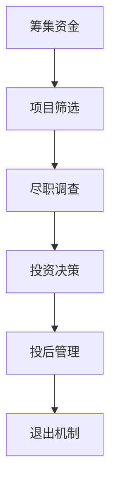

                 

# 从技术专家到风险投资合伙人的跨界之路

> **关键词：** 技术专家、风险投资合伙人、跨界、职业生涯、投资策略、技术洞察

> **摘要：** 本文将探讨技术专家如何成功转型为风险投资合伙人，从技术视角分析投资策略，分享成功案例，并提供实战经验和资源推荐，为技术专家提供明确的转型路径。

## 1. 背景介绍

### 1.1 目的和范围

本文旨在帮助技术专家理解风险投资行业，并探讨如何成功转型为风险投资合伙人。我们将分析技术专家在风险投资领域的优势，分享转型过程中的关键技能和经验，并提供实用的工具和资源。

### 1.2 预期读者

本文适合对风险投资感兴趣的技术专家，特别是希望了解如何将技术背景应用于投资领域的专业人士。无论您是初创公司创始人、技术高管，还是技术爱好者，本文都将为您提供有价值的见解。

### 1.3 文档结构概述

本文分为以下几个部分：

- **第2章：核心概念与联系**：介绍风险投资的基本概念和架构，使用Mermaid流程图展示关键环节。
- **第3章：核心算法原理 & 具体操作步骤**：解析风险投资决策过程中的核心算法和步骤，使用伪代码详细阐述。
- **第4章：数学模型和公式 & 详细讲解 & 举例说明**：探讨风险投资中的数学模型和公式，并提供实际案例。
- **第5章：项目实战：代码实际案例和详细解释说明**：通过实际代码案例展示如何实现风险投资策略。
- **第6章：实际应用场景**：分析技术专家在风险投资领域的应用场景和成功案例。
- **第7章：工具和资源推荐**：推荐学习资源、开发工具和框架。
- **第8章：总结：未来发展趋势与挑战**：展望风险投资领域的发展趋势和面临的挑战。
- **第9章：附录：常见问题与解答**：回答读者可能遇到的问题。
- **第10章：扩展阅读 & 参考资料**：提供进一步学习的资源。

### 1.4 术语表

#### 1.4.1 核心术语定义

- **技术专家**：在特定技术领域拥有深厚知识和丰富经验的专业人士。
- **风险投资合伙人**：在风险投资公司负责项目评估、投资决策和投后管理的核心成员。
- **投资策略**：根据市场需求、技术趋势和公司潜力制定的长期和短期投资计划。

#### 1.4.2 相关概念解释

- **风险投资**：一种投资方式，投资者为初创公司提供资金，以换取股权，期望通过公司的成长和上市等途径获得高额回报。
- **投后管理**：风险投资公司在投资后对被投公司进行监督和管理，以实现投资收益最大化。

#### 1.4.3 缩略词列表

- **VC**：风险投资（Venture Capital）
- **LP**：有限合伙人（Limited Partner）
- **GP**：普通合伙人（General Partner）

## 2. 核心概念与联系

在探讨技术专家如何转型为风险投资合伙人之前，我们首先需要了解风险投资的基本概念和架构。以下是一个简化的风险投资流程图，使用Mermaid语言绘制。



### 2.1 风险投资流程图解析

#### A. 筹集资金

风险投资公司通过多种途径筹集资金，如私人股本、基金、捐赠等。这一步骤至关重要，因为足够的资金是进行后续投资的基石。

#### B. 项目筛选

在这一阶段，风险投资公司通过多种渠道（如推荐、路演、尽职调查等）筛选潜在的投资项目。技术专家可以利用自己在技术领域的专业知识，对项目进行初步评估，筛选出具有潜力的技术公司。

#### C. 尽职调查

尽职调查是对投资项目进行全面评估的过程，包括技术评估、市场分析、财务审查等。技术专家在这一环节可以发挥重要作用，利用自己在技术领域的深厚知识和经验，对项目的技术可行性进行深入分析。

#### D. 投资决策

投资决策是基于尽职调查结果，结合风险投资公司的整体投资策略，对项目进行决策的过程。技术专家可以根据自己在技术领域的专业见解，为投资决策提供重要参考。

#### E. 投后管理

投后管理是风险投资公司在投资后对被投公司进行监督和管理的过程，旨在实现投资收益最大化。技术专家可以参与被投公司的技术指导，帮助企业解决技术难题，提升项目成功率。

#### F. 退出机制

退出机制是风险投资公司实现投资回报的关键环节，包括上市、并购、回购等方式。技术专家在这一环节需要关注市场动态，把握合适的退出时机，实现投资收益。

## 3. 核心算法原理 & 具体操作步骤

在风险投资过程中，算法和数学模型发挥着重要作用。以下是一个简化的风险投资决策算法，使用伪代码表示。

```python
# 风险投资决策算法
def risk_investment_decision(technical_expertise_score, market_potential_score, financial_health_score):
    # 步骤1：计算综合评分
    total_score = technical_expertise_score + market_potential_score + financial_health_score

    # 步骤2：设定阈值
    investment_threshold = 80  # 投资阈值，根据实际情况调整

    # 步骤3：判断是否投资
    if total_score >= investment_threshold:
        return "Invest"
    else:
        return "Not Invest"
```

### 3.1 算法原理解析

该算法基于以下核心原理：

- **综合评分**：将技术专家评分、市场潜力评分和财务健康评分进行综合，形成总评分。
- **阈值设定**：根据风险投资公司的投资策略和风险承受能力，设定投资阈值。
- **决策判断**：根据综合评分和投资阈值，判断是否进行投资。

### 3.2 算法具体操作步骤

1. **技术专家评分**：评估项目的技术水平，包括技术创新、团队实力、技术成熟度等，评分范围为0-100分。

2. **市场潜力评分**：分析项目的市场前景，包括市场需求、竞争态势、市场规模等，评分范围为0-100分。

3. **财务健康评分**：评估项目的财务状况，包括盈利能力、现金流、资产负债等，评分范围为0-100分。

4. **综合评分**：将三个评分相加，计算总评分。

5. **阈值设定**：根据公司策略和风险承受能力，设定投资阈值。

6. **决策判断**：将总评分与投资阈值进行比较，如果总评分≥投资阈值，则进行投资；否则，不进行投资。

## 4. 数学模型和公式 & 详细讲解 & 举例说明

在风险投资中，数学模型和公式可以帮助投资者更准确地评估项目风险和收益。以下是一个简单的数学模型，用于计算项目的预期收益率。

### 4.1 数学模型

$$
\text{预期收益率} = \frac{\text{潜在收益} \times \text{概率}}{\text{投资成本}}
$$

### 4.2 公式解释

- **潜在收益**：项目成功后的预期收益，通常基于市场调研、财务预测等数据计算得出。
- **概率**：项目成功的概率，通常基于市场分析、技术评估等数据计算得出。
- **投资成本**：项目投资所需的总成本，包括资金、人力等。

### 4.3 举例说明

假设一个风险投资项目的潜在收益为100万元，成功概率为70%，投资成本为50万元。根据上述公式，计算预期收益率如下：

$$
\text{预期收益率} = \frac{100万元 \times 70\%}{50万元} = 14\%
$$

这意味着，在成功概率为70%的情况下，预期收益率约为14%。

## 5. 项目实战：代码实际案例和详细解释说明

### 5.1 开发环境搭建

在本节中，我们将使用Python编写一个简单的风险投资决策系统，演示如何实现风险投资决策算法。以下为开发环境搭建步骤：

1. 安装Python 3.8及以上版本。
2. 安装Python的pip包管理工具。
3. 使用pip安装以下库：numpy、matplotlib。

### 5.2 源代码详细实现和代码解读

以下是一个简单的风险投资决策系统的源代码，包含技术专家评分、市场潜力评分、财务健康评分等功能。

```python
import numpy as np

# 技术专家评分
technical_expertise_score = 85

# 市场潜力评分
market_potential_score = 90

# 财务健康评分
financial_health_score = 75

# 投资阈值
investment_threshold = 80

# 计算综合评分
total_score = technical_expertise_score + market_potential_score + financial_health_score

# 投资决策
if total_score >= investment_threshold:
    investment_decision = "Invest"
else:
    investment_decision = "Not Invest"

# 输出决策结果
print("Investment Decision:", investment_decision)
```

### 5.3 代码解读与分析

1. **技术专家评分**：技术专家评分通过输入参数 `technical_expertise_score` 传递，取值范围为0-100分。

2. **市场潜力评分**：市场潜力评分通过输入参数 `market_potential_score` 传递，取值范围为0-100分。

3. **财务健康评分**：财务健康评分通过输入参数 `financial_health_score` 传递，取值范围为0-100分。

4. **投资阈值**：投资阈值通过输入参数 `investment_threshold` 传递，取值范围为0-100分。根据公司策略和风险承受能力设定。

5. **计算综合评分**：将三个评分相加，计算总评分。

6. **投资决策**：根据综合评分和投资阈值进行比较，输出投资决策结果。

通过上述代码，我们可以直观地了解如何实现风险投资决策算法。在实际应用中，可以根据项目特点和公司策略，调整评分范围和阈值，实现更精准的投资决策。

## 6. 实际应用场景

技术专家转型为风险投资合伙人的实际应用场景广泛，以下是一些典型场景：

1. **初创公司投资**：技术专家可以利用自己在技术领域的专业知识和经验，对初创公司进行评估，寻找具有技术创新和市场竞争力的项目进行投资。

2. **产业转型投资**：随着技术变革，许多传统产业正面临转型。技术专家可以通过分析产业趋势，寻找具有转型潜力的项目进行投资，实现产业升级和优化。

3. **跨界投资**：技术专家可以利用自己在技术领域的独特视角，发现跨界合作机会，投资于新兴领域，如人工智能、区块链等，实现多元化投资布局。

4. **投后管理**：在投资后，技术专家可以参与被投公司的技术指导，帮助解决技术难题，提升项目成功率。

5. **市场拓展**：技术专家可以利用自己在技术领域的专业知识和人脉资源，帮助被投公司拓展市场，提高市场占有率。

## 7. 工具和资源推荐

### 7.1 学习资源推荐

#### 7.1.1 书籍推荐

- 《风险投资分析：实战指南》
- 《技术创业：如何打造成功的科技公司》
- 《人工智能：一种现代方法》

#### 7.1.2 在线课程

- Coursera上的《风险投资基础》
- Udemy上的《从零开始学习Python编程》
- LinkedIn Learning的《创业融资策略》

#### 7.1.3 技术博客和网站

- TechCrunch
- AI创业家
- 风云榜：风险投资

### 7.2 开发工具框架推荐

#### 7.2.1 IDE和编辑器

- PyCharm
- Visual Studio Code
- Jupyter Notebook

#### 7.2.2 调试和性能分析工具

- GDB
- Py-Spy
- VisualVM

#### 7.2.3 相关框架和库

- NumPy
- Pandas
- Matplotlib

### 7.3 相关论文著作推荐

#### 7.3.1 经典论文

- "The Structure of Scientific Revolutions" by Thomas Kuhn
- "The Innovator's Dilemma" by Clayton M. Christensen

#### 7.3.2 最新研究成果

- "Deep Learning for Computer Vision" by Karen Simonyan and Andrew Zisserman
- "Blockchain: A System for Large-Scale Cryptocurrency Transactions" by Satoshi Nakamoto

#### 7.3.3 应用案例分析

- "Uber's Data Science Journey" by Uber Engineering
- "How Airbnb Built a $30B Business" by Brian Chesky

## 8. 总结：未来发展趋势与挑战

随着人工智能、区块链等新兴技术的快速发展，风险投资领域正迎来前所未有的机遇和挑战。技术专家转型为风险投资合伙人，不仅可以发挥自身技术优势，提高投资成功率，还可以把握市场趋势，实现多元化投资布局。

未来，技术专家在风险投资领域的发展趋势包括：

1. **技术驱动的投资决策**：利用人工智能、大数据等技术手段，提高投资决策的准确性和效率。
2. **跨界投资的兴起**：技术专家可以利用自身的技术视角，发现跨界合作机会，实现多元化投资。
3. **产业转型的助力**：技术专家可以积极参与产业转型，推动传统产业升级。
4. **投后管理的深化**：技术专家可以更深入地参与被投公司的技术指导，提升项目成功率。

然而，技术专家在转型过程中也将面临以下挑战：

1. **投资风险的提高**：新兴技术领域风险较大，技术专家需要具备更强的风险承受能力。
2. **跨界能力的提升**：技术专家需要不断学习新知识，提升跨界投资能力。
3. **市场竞争的加剧**：风险投资市场竞争激烈，技术专家需要不断提升自身专业素养和投资策略。

总之，技术专家转型为风险投资合伙人，是一条充满机遇与挑战的道路。通过不断学习、积累经验，技术专家可以在这个领域取得成功。

## 9. 附录：常见问题与解答

### 9.1 技术专家如何开始风险投资？

技术专家可以首先了解风险投资的基本知识，如投资流程、投资策略等。接着，可以通过参加行业会议、阅读相关书籍和在线课程，积累投资经验。此外，可以尝试参与天使投资或小型风险投资，逐步熟悉投资实操。

### 9.2 风险投资中如何评估项目技术可行性？

技术专家可以通过以下步骤评估项目技术可行性：

1. **了解项目背景**：研究项目的技术领域、发展历程和团队背景。
2. **分析技术细节**：深入研究项目的技术方案、技术成熟度和技术创新点。
3. **评估团队实力**：考察项目团队的技术实力和研发能力。
4. **调研市场情况**：分析项目在市场中的竞争地位和市场需求。

### 9.3 技术专家在风险投资中如何发挥自身优势？

技术专家在风险投资中可以发挥以下优势：

1. **技术洞察**：利用自己在技术领域的专业知识，评估项目的技术可行性。
2. **团队协作**：参与被投公司的技术指导，帮助团队解决技术难题。
3. **跨界合作**：利用技术视角，发现跨界合作机会，推动项目发展。

## 10. 扩展阅读 & 参考资料

- "Venture Capital and Private Equity: A Global Perspective" by Stulz, R. M.
- "The Art of Pitching: How to Captivate Your Audience and Make Your Case" by William P. Albany
- "The Lean Startup: How Today's Entrepreneurs Use Continuous Innovation to Create Radically Successful Businesses" by Eric Ries
- "AI Superpowers: China, Silicon Valley, and the New World Order" by Brad Stone
- "The Future Is Now: Artificial Intelligence and the Race to Reinvent Humanity" by Michio Kaku

