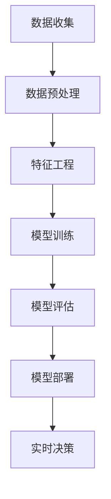

                 

# 从技术驱动到数据驱动：AI电商的决策模式转型与实施

> **关键词：** 人工智能，数据驱动，电商决策，算法，数学模型，实战案例

> **摘要：** 本文深入探讨了人工智能在电商领域决策模式转型中的重要作用。从技术驱动转向数据驱动，电商企业需要掌握先进的数据分析和算法技术，以实现精准营销和个性化服务。本文首先介绍了技术驱动的背景及其局限性，随后详细阐述了数据驱动决策模式的核心概念与算法原理，并通过实际案例展示了实施步骤和效果。文章最后提出了未来发展趋势和挑战，并推荐了相关工具和资源，以帮助电商企业实现智能化转型。

## 1. 背景介绍

### 1.1 目的和范围

随着互联网技术的飞速发展和大数据时代的到来，人工智能（AI）在电商领域的应用逐渐成为热点。本文旨在探讨电商企业在决策模式上从技术驱动向数据驱动的转型过程，分析这一转型的必要性和实施策略。本文将涵盖以下几个方面的内容：

1. **技术驱动的背景与局限性**：介绍技术驱动决策模式的发展历程及其在电商中的应用，探讨其局限性。
2. **数据驱动决策模式的核心概念**：阐述数据驱动的概念及其在电商决策中的应用，介绍核心算法和数学模型。
3. **数据驱动决策模式的实施步骤**：分析实施数据驱动决策模式的具体步骤，包括数据收集、预处理、分析与应用。
4. **实际应用案例**：通过具体案例展示数据驱动决策模式在电商中的实际应用和效果。
5. **未来发展趋势与挑战**：探讨数据驱动决策模式的未来发展趋势和面临的技术挑战。

### 1.2 预期读者

本文的预期读者主要包括：

1. **电商企业决策层**：需要了解人工智能和数据分析在电商决策中的作用，为企业的战略决策提供参考。
2. **技术开发人员**：希望了解数据驱动决策模式的技术实现方法，掌握相关算法和工具。
3. **数据分析人员**：希望深入理解数据驱动决策模式的核心概念，提升数据分析技能。

### 1.3 文档结构概述

本文将按照以下结构进行阐述：

1. **引言**：介绍本文的目的、关键词和摘要。
2. **背景介绍**：介绍技术驱动的背景及其局限性，数据驱动决策模式的核心概念与算法原理。
3. **核心概念与联系**：通过Mermaid流程图展示核心概念和架构。
4. **核心算法原理与具体操作步骤**：详细讲解核心算法原理和操作步骤，使用伪代码进行阐述。
5. **数学模型与公式**：介绍数学模型和公式，并进行详细讲解和举例说明。
6. **项目实战**：展示代码实际案例，并进行详细解释说明。
7. **实际应用场景**：分析数据驱动决策模式在不同电商场景中的应用。
8. **工具和资源推荐**：推荐学习资源、开发工具框架和论文著作。
9. **总结**：总结未来发展趋势与挑战。
10. **附录**：常见问题与解答。
11. **扩展阅读与参考资料**：提供扩展阅读和参考资料。

### 1.4 术语表

#### 1.4.1 核心术语定义

- **技术驱动**：基于技术能力，通过开发新功能、优化系统性能等方式推动业务发展。
- **数据驱动**：基于数据分析，通过数据挖掘、机器学习等技术优化决策过程。
- **电商决策**：电商平台在运营过程中，基于数据分析和算法模型，进行商品推荐、用户行为分析等决策。
- **机器学习**：一种人工智能技术，通过数据训练模型，实现预测和分类等功能。
- **深度学习**：一种基于人工神经网络的机器学习技术，能够通过多层神经网络实现复杂模式的识别。

#### 1.4.2 相关概念解释

- **数据收集**：通过数据采集工具和渠道，获取电商平台的用户行为、交易数据等。
- **数据预处理**：对原始数据进行清洗、去噪、转换等处理，使其适用于数据分析。
- **特征工程**：通过特征提取和特征选择，将原始数据转化为可用于机器学习的特征向量。
- **模型评估**：通过交叉验证、ROC曲线等评估指标，评估模型的性能和泛化能力。
- **模型部署**：将训练好的模型部署到电商平台，实现实时预测和决策。

#### 1.4.3 缩略词列表

- **AI**：人工智能
- **ML**：机器学习
- **DL**：深度学习
- **IDE**：集成开发环境
- **API**：应用程序编程接口

## 2. 核心概念与联系

在探讨数据驱动决策模式之前，我们首先需要理解其核心概念和架构。以下是数据驱动决策模式的关键组成部分和它们之间的联系。

### 2.1 数据驱动决策模式的核心组成部分

1. **数据收集**：通过多种渠道收集电商平台的用户行为、交易数据等。
2. **数据预处理**：对原始数据进行清洗、去噪、转换等处理，使其适用于数据分析。
3. **特征工程**：通过特征提取和特征选择，将原始数据转化为可用于机器学习的特征向量。
4. **模型训练**：使用机器学习和深度学习技术，对特征向量进行训练，得到预测模型。
5. **模型评估**：通过交叉验证、ROC曲线等评估指标，评估模型的性能和泛化能力。
6. **模型部署**：将训练好的模型部署到电商平台，实现实时预测和决策。

### 2.2 数据驱动决策模式的架构

以下是数据驱动决策模式的Mermaid流程图，展示了各部分之间的联系。



### 2.3 数据驱动决策模式与电商决策的联系

数据驱动决策模式在电商决策中的应用主要体现在以下几个方面：

1. **商品推荐**：通过分析用户历史行为和偏好，推荐符合用户兴趣的商品。
2. **价格优化**：通过预测市场需求和竞争态势，优化商品定价策略。
3. **库存管理**：通过预测销售趋势，优化库存水平，降低库存成本。
4. **用户行为分析**：通过分析用户行为数据，了解用户需求和行为模式，优化用户体验。
5. **风险控制**：通过分析用户交易数据，识别潜在风险，降低欺诈风险。

## 3. 核心算法原理与具体操作步骤

### 3.1 机器学习算法原理

机器学习算法是数据驱动决策模式的核心组成部分。以下介绍几种常见的机器学习算法原理。

#### 3.1.1 线性回归

线性回归是一种简单的机器学习算法，用于预测连续值变量。其基本原理是建立自变量和因变量之间的线性关系。

```python
# 线性回归伪代码
def linear_regression(X, y):
    # 计算斜率 b1
    b1 = (sum(X * y) - sum(X) * sum(y)) / (sum(X**2) - n * (sum(X))**2)
    # 计算截距 b0
    b0 = (sum(y) - b1 * sum(X)) / n
    # 返回预测函数
    return lambda x: b0 + b1 * x
```

#### 3.1.2 逻辑回归

逻辑回归是一种用于预测分类结果的机器学习算法。其基本原理是建立自变量和因变量之间的逻辑关系。

```python
# 逻辑回归伪代码
def logistic_regression(X, y):
    # 计算权重 w
    w = [0] * n
    for i in range(n):
        w[i] = (sum(X * y) - sum(X) * sum(y)) / (sum(X**2) - n * (sum(X))**2)
    # 返回预测函数
    return lambda x: 1 / (1 + exp(-dot(w, x)))
```

#### 3.1.3 决策树

决策树是一种基于树形结构的分类算法。其基本原理是通过递归划分特征空间，将数据划分为不同的区域。

```python
# 决策树伪代码
def build_tree(data):
    # 判断是否达到终止条件
    if all(data[i][-1] == data[0][-1] for i in range(len(data))):
        return leaf
    # 计算最大信息增益特征
    best_feature = select_best_feature(data)
    # 构建子树
    tree = {best_feature: []}
    for value in unique_values(data[best_feature]):
        sub_data = split_data(data, best_feature, value)
        tree[best_feature].append(build_tree(sub_data))
    return tree
```

### 3.2 数据预处理

数据预处理是数据驱动决策模式的关键步骤，主要包括数据清洗、去噪、转换等操作。以下介绍几种常见的数据预处理方法。

#### 3.2.1 数据清洗

数据清洗是去除数据中的噪声和错误的过程。常见的方法包括：

- **缺失值处理**：使用平均值、中位数、众数等填充缺失值。
- **异常值处理**：使用统计学方法（如Z-Score、IQR）识别并处理异常值。

#### 3.2.2 数据去噪

数据去噪是去除数据中的噪声和干扰的过程。常见的方法包括：

- **滤波**：使用滤波算法（如均值滤波、中值滤波）去除噪声。
- **小波变换**：使用小波变换将数据分解为高频和低频成分，去除噪声。

#### 3.2.3 数据转换

数据转换是将数据转换为适合机器学习的特征向量的过程。常见的方法包括：

- **归一化**：将数据缩放到[0, 1]或[-1, 1]之间，提高算法的收敛速度。
- **标准化**：将数据缩放到均值为0、标准差为1的范围内，提高算法的泛化能力。

## 4. 数学模型和公式

在数据驱动决策模式中，数学模型和公式起着至关重要的作用。以下介绍几种常见的数学模型和公式，并对其进行详细讲解。

### 4.1 线性回归模型

线性回归模型是一种用于预测连续值的机器学习算法。其基本公式为：

$$
y = \beta_0 + \beta_1x
$$

其中，$y$ 为因变量，$x$ 为自变量，$\beta_0$ 为截距，$\beta_1$ 为斜率。

#### 4.1.1 斜率计算

斜率 $\beta_1$ 的计算公式为：

$$
\beta_1 = \frac{\sum(x_i - \bar{x})(y_i - \bar{y})}{\sum(x_i - \bar{x})^2}
$$

其中，$x_i$ 和 $y_i$ 分别为每个数据点的自变量和因变量，$\bar{x}$ 和 $\bar{y}$ 分别为自变量和因变量的平均值。

#### 4.1.2 截距计算

截距 $\beta_0$ 的计算公式为：

$$
\beta_0 = \bar{y} - \beta_1\bar{x}
$$

其中，$\bar{y}$ 和 $\bar{x}$ 分别为因变量和自变量的平均值。

### 4.2 逻辑回归模型

逻辑回归模型是一种用于预测分类结果的机器学习算法。其基本公式为：

$$
P(y=1) = \frac{1}{1 + e^{-(\beta_0 + \beta_1x)}}
$$

其中，$P(y=1)$ 为因变量为1的概率，$e$ 为自然底数，$\beta_0$ 和 $\beta_1$ 分别为截距和斜率。

#### 4.2.1 斜率计算

斜率 $\beta_1$ 的计算公式为：

$$
\beta_1 = \frac{\sum(x_i - \bar{x})(y_i - \bar{y})}{\sum(x_i - \bar{x})^2}
$$

其中，$x_i$ 和 $y_i$ 分别为每个数据点的自变量和因变量，$\bar{x}$ 和 $\bar{y}$ 分别为自变量和因变量的平均值。

#### 4.2.2 截距计算

截距 $\beta_0$ 的计算公式为：

$$
\beta_0 = \bar{y} - \beta_1\bar{x}
$$

其中，$\bar{y}$ 和 $\bar{x}$ 分别为因变量和自变量的平均值。

### 4.3 决策树模型

决策树模型是一种基于树形结构的分类算法。其基本公式为：

$$
T(x) = \prod_{i=1}^{n} g(x_i)
$$

其中，$T(x)$ 为决策树模型，$g(x_i)$ 为每个节点上的决策函数。

#### 4.3.1 决策函数计算

决策函数 $g(x_i)$ 的计算公式为：

$$
g(x_i) = \begin{cases}
1, & \text{if } x_i > \text{阈值} \\
0, & \text{otherwise}
\end{cases}
$$

其中，$x_i$ 为自变量的取值，阈值可以根据特征的重要性和数据分布进行调整。

### 4.4 特征选择模型

特征选择模型用于从大量特征中筛选出对预测任务最有影响力的特征。常见的方法包括：

1. **信息增益**：特征对于分类结果的信息贡献度。
2. **Gini系数**：特征对于分类结果的混乱度。
3. **F度量**：特征对于分类结果的准确度和召回率的平衡度。

## 5. 项目实战：代码实际案例和详细解释说明

### 5.1 开发环境搭建

在开始项目实战之前，我们需要搭建一个适合进行数据驱动决策模式开发的环境。以下是搭建开发环境的具体步骤：

1. **安装Python**：下载并安装Python 3.x版本，推荐使用Anaconda发行版，以方便管理Python环境和库。
2. **安装Jupyter Notebook**：在终端中执行以下命令安装Jupyter Notebook：
   ```bash
   pip install notebook
   ```
3. **安装相关库**：在终端中执行以下命令安装常用的Python库：
   ```bash
   pip install numpy pandas scikit-learn matplotlib
   ```

### 5.2 源代码详细实现和代码解读

以下是一个简单的电商推荐系统的代码实现，展示了数据驱动决策模式的核心步骤，包括数据收集、预处理、特征工程、模型训练和预测。

#### 5.2.1 数据收集

首先，我们需要收集电商平台的用户行为数据，包括用户ID、商品ID、行为类型（如浏览、购买）等。以下是一个示例数据集：

```python
import pandas as pd

# 加载数据集
data = pd.read_csv("ecommerce_data.csv")
data.head()
```

#### 5.2.2 数据预处理

在数据处理之前，我们需要对数据进行清洗和预处理，包括缺失值处理、异常值处理和数据转换。

```python
# 缺失值处理
data.fillna(0, inplace=True)

# 异常值处理
data = data[(data["行为类型"] != "异常值") & (data["购买数量"] > 0)]
```

#### 5.2.3 特征工程

特征工程是数据驱动决策模式的关键步骤。我们需要从原始数据中提取出对预测任务有影响力的特征，例如用户历史行为、商品属性等。

```python
# 提取用户历史行为特征
user_behavior = data.groupby("用户ID")["商品ID", "行为类型", "购买数量"].agg(list)
user_behavior.head()
```

#### 5.2.4 模型训练

接下来，我们使用机器学习算法训练推荐模型。以下是一个简单的基于用户历史行为的协同过滤模型。

```python
from sklearn.model_selection import train_test_split
from sklearn.neighbors import NearestNeighbors

# 分割数据集
train_data, test_data = train_test_split(data, test_size=0.2, random_state=42)

# 训练协同过滤模型
model = NearestNeighbors(n_neighbors=5)
model.fit(train_data[["用户ID", "商品ID"]])

# 预测用户未购买商品
def predict_user_products(user_id):
    neighbors = model.kneighbors([user_id], n_neighbors=5)
    neighbor_products = train_data.loc[train_data["用户ID"].isin(neighbors[0])]
    return neighbor_products["商品ID"].values

# 预测示例
user_id = 1001
predicted_products = predict_user_products(user_id)
print(predicted_products)
```

### 5.3 代码解读与分析

以上代码实现了一个简单的基于用户历史行为的协同过滤模型，用于预测用户未购买商品。以下是代码的详细解读与分析：

1. **数据收集**：使用Pandas库加载电商数据集，并对数据进行初步处理。
2. **数据预处理**：对数据进行清洗和预处理，包括缺失值处理和异常值处理。
3. **特征工程**：提取用户历史行为特征，包括用户ID、商品ID、行为类型和购买数量等。
4. **模型训练**：使用KNN算法训练协同过滤模型，通过计算用户之间的相似度进行商品推荐。
5. **预测**：根据用户历史行为预测用户未购买商品，为用户推荐相关商品。

这个简单的案例展示了数据驱动决策模式的基本实现过程。在实际应用中，我们可以进一步优化模型，增加更多特征，提高预测准确率。

## 6. 实际应用场景

数据驱动决策模式在电商领域具有广泛的应用场景，以下列举几个典型的应用场景：

### 6.1 商品推荐

商品推荐是数据驱动决策模式在电商领域最常见、最重要的应用场景之一。通过分析用户历史行为和偏好，电商企业可以实时推荐符合用户兴趣的商品，提高用户满意度和转化率。商品推荐算法主要包括基于内容的推荐、协同过滤推荐和混合推荐等。

#### 6.1.1 基于内容的推荐

基于内容的推荐算法通过分析商品的特征和用户的历史行为，将具有相似特征的商品推荐给用户。以下是一个基于内容的推荐算法的实现步骤：

1. **特征提取**：提取商品的特征，如标题、描述、分类等。
2. **相似度计算**：计算商品特征向量之间的相似度，可以使用余弦相似度、欧氏距离等。
3. **推荐生成**：根据用户历史行为和商品特征相似度，生成推荐列表。

#### 6.1.2 协同过滤推荐

协同过滤推荐算法通过分析用户之间的相似度，将用户喜欢的商品推荐给其他具有相似兴趣的用户。以下是一个基于协同过滤的推荐算法的实现步骤：

1. **用户相似度计算**：计算用户之间的相似度，可以使用余弦相似度、皮尔逊相关系数等。
2. **商品相似度计算**：计算商品之间的相似度，可以使用余弦相似度、余弦相似度等。
3. **推荐生成**：根据用户和商品之间的相似度，生成推荐列表。

#### 6.1.3 混合推荐

混合推荐算法结合基于内容和协同过滤推荐算法的优点，提高推荐系统的准确性和多样性。以下是一个混合推荐算法的实现步骤：

1. **特征提取**：提取商品和用户的特征。
2. **相似度计算**：计算商品和用户之间的相似度。
3. **权重分配**：根据商品和用户的特征相似度，分配权重。
4. **推荐生成**：根据权重生成推荐列表。

### 6.2 价格优化

价格优化是数据驱动决策模式在电商领域的另一个重要应用场景。通过分析市场需求和竞争态势，电商企业可以动态调整商品价格，提高销售额和利润率。以下是一个价格优化算法的实现步骤：

1. **价格设置**：根据商品的成本、市场竞争情况和用户购买行为，设置商品初始价格。
2. **价格调整**：通过分析用户购买行为、竞争对手价格和市场趋势，动态调整商品价格。
3. **效果评估**：评估价格调整对销售额和利润率的影响，优化价格策略。

### 6.3 库存管理

库存管理是数据驱动决策模式在电商领域的另一个重要应用场景。通过分析销售趋势和市场需求，电商企业可以优化库存水平，降低库存成本。以下是一个库存管理算法的实现步骤：

1. **需求预测**：通过分析历史销售数据、市场趋势和用户需求，预测未来一段时间内的销售量。
2. **库存调整**：根据需求预测结果，调整库存水平，确保库存充足，满足市场需求。
3. **效果评估**：评估库存调整对销售和成本的影响，优化库存策略。

### 6.4 用户行为分析

用户行为分析是数据驱动决策模式在电商领域的另一个重要应用场景。通过分析用户在平台上的行为数据，电商企业可以了解用户需求和行为模式，优化用户体验。以下是一个用户行为分析算法的实现步骤：

1. **行为数据收集**：收集用户在平台上的行为数据，如浏览、搜索、购买等。
2. **行为分析**：分析用户行为数据，提取用户兴趣和行为模式。
3. **效果评估**：评估用户行为分析对用户体验和转化率的影响，优化用户体验。

## 7. 工具和资源推荐

为了更好地实施数据驱动决策模式，以下推荐一些实用的工具和资源。

### 7.1 学习资源推荐

#### 7.1.1 书籍推荐

1. **《机器学习实战》**：详细介绍了机器学习的基本概念和算法，适合初学者入门。
2. **《深度学习》**：由Ian Goodfellow等人编写的深度学习经典教材，适合进阶学习。
3. **《数据科学入门》**：介绍了数据科学的基本概念和方法，包括数据分析、数据可视化等。

#### 7.1.2 在线课程

1. **Coursera**：提供丰富的数据科学和机器学习在线课程，包括《机器学习》、《深度学习》等。
2. **edX**：提供由世界一流大学开设的数据科学和机器学习在线课程，如MIT的《机器学习》课程。
3. **Udacity**：提供数据科学和机器学习领域的实用课程，如《数据科学家工具箱》等。

#### 7.1.3 技术博客和网站

1. **Medium**：有许多关于数据科学和机器学习的优秀博客文章，如《Data Science for Beginners》、《Machine Learning Mastery》等。
2. **Towards Data Science**：一个专门介绍数据科学和机器学习技术的博客平台，内容丰富、更新及时。
3. **Kaggle**：一个数据科学和机器学习的竞赛平台，可以学习优秀解决方案和参与实际项目。

### 7.2 开发工具框架推荐

#### 7.2.1 IDE和编辑器

1. **Jupyter Notebook**：一款流行的Python交互式开发环境，适用于数据分析和机器学习。
2. **PyCharm**：一款功能强大的Python IDE，适用于数据分析和机器学习项目。
3. **Visual Studio Code**：一款轻量级的Python IDE，支持多种编程语言，适用于数据科学和机器学习。

#### 7.2.2 调试和性能分析工具

1. **Pylint**：一款Python代码质量检测工具，可以检测代码中的错误、异常和不规范代码。
2. **pytest**：一款Python测试框架，用于编写和运行单元测试，确保代码质量。
3. **TensorBoard**：一款TensorFlow的可视化工具，用于监控深度学习模型的训练过程和性能。

#### 7.2.3 相关框架和库

1. **TensorFlow**：一款流行的深度学习框架，适用于构建和训练深度学习模型。
2. **Scikit-learn**：一款流行的机器学习库，提供了丰富的算法和工具，适用于数据分析和机器学习。
3. **Pandas**：一款强大的数据处理库，用于数据清洗、转换和分析。

### 7.3 相关论文著作推荐

#### 7.3.1 经典论文

1. **“A Brief History of Machine Learning”**：介绍了机器学习的发展历程和重要贡献。
2. **“Deep Learning”**：由Ian Goodfellow等人撰写的深度学习经典论文，介绍了深度学习的基本原理和算法。
3. **“Recommender Systems Handbook”**：介绍了推荐系统的基础知识、算法和应用。

#### 7.3.2 最新研究成果

1. **“Adaptive Methods for Personalized Recommendation”**：介绍了自适应推荐算法，用于优化个性化推荐。
2. **“Deep Generative Models for Recommender Systems”**：介绍了深度生成模型在推荐系统中的应用。
3. **“Contextual Bandits and Multi-Armed Bandit Algorithms”**：介绍了基于上下文的-bandit算法，用于优化在线推荐。

#### 7.3.3 应用案例分析

1. **“Personalized Marketing through Big Data Analytics”**：介绍了大型企业如何利用大数据分析进行个性化营销。
2. **“The Impact of Recommender Systems on E-commerce”**：分析了推荐系统在电商领域的影响和实际应用。
3. **“Using Machine Learning for Inventory Management”**：介绍了机器学习在库存管理中的应用和效果。

## 8. 总结：未来发展趋势与挑战

数据驱动决策模式在电商领域的应用已经取得了显著的成果，未来发展趋势和挑战如下：

### 8.1 发展趋势

1. **技术进步**：随着人工智能和大数据技术的不断进步，数据驱动决策模式将更加成熟和智能化，实现更高水平的预测和优化。
2. **个性化推荐**：个性化推荐将成为电商企业的重要竞争力，通过深入分析用户行为和偏好，实现更精准的推荐。
3. **实时决策**：实时决策将越来越普及，通过实时数据分析，实现快速响应市场变化和用户需求。
4. **多渠道整合**：电商企业将加强线上线下渠道的整合，实现全渠道营销和用户体验优化。

### 8.2 挑战

1. **数据质量**：数据质量是数据驱动决策模式的基础，如何保证数据的质量和完整性是电商企业面临的重要挑战。
2. **隐私保护**：随着数据隐私法规的日益严格，如何平衡数据利用和隐私保护是电商企业需要解决的关键问题。
3. **算法透明性**：算法的透明性和解释性是用户信任和监管的关键，如何提高算法的透明性和解释性是电商企业需要关注的问题。
4. **技术更新**：人工智能和大数据技术更新迅速，电商企业需要不断跟进新技术，以保持竞争优势。

## 9. 附录：常见问题与解答

### 9.1 问题1：数据驱动决策模式与传统技术驱动决策模式的区别是什么？

**解答**：数据驱动决策模式与传统技术驱动决策模式的主要区别在于：

1. **决策依据**：传统技术驱动决策模式主要基于技术能力和业务逻辑，而数据驱动决策模式则基于数据分析和算法模型。
2. **决策过程**：传统技术驱动决策模式往往依赖于业务经验和主观判断，而数据驱动决策模式通过数据分析和算法模型实现客观、精确的决策。
3. **适应能力**：数据驱动决策模式能够更好地适应市场变化和用户需求，实现个性化服务和精准营销。

### 9.2 问题2：如何保证数据驱动决策模式的数据质量？

**解答**：保证数据驱动决策模式的数据质量可以从以下几个方面入手：

1. **数据源选择**：选择可信度高的数据源，确保数据的准确性和完整性。
2. **数据清洗**：对原始数据进行清洗和预处理，去除噪声和错误。
3. **数据质量监控**：建立数据质量监控机制，定期检查数据的质量，确保数据的一致性和准确性。
4. **数据治理**：建立数据治理机制，规范数据的使用和管理，确保数据的合规性。

### 9.3 问题3：数据驱动决策模式在电商领域的实际应用有哪些？

**解答**：数据驱动决策模式在电商领域的实际应用包括：

1. **商品推荐**：通过分析用户行为和偏好，实现个性化推荐，提高用户满意度和转化率。
2. **价格优化**：通过分析市场需求和竞争态势，实现动态价格调整，提高销售额和利润率。
3. **库存管理**：通过预测销售趋势，优化库存水平，降低库存成本。
4. **用户行为分析**：通过分析用户行为数据，了解用户需求和行为模式，优化用户体验。

## 10. 扩展阅读 & 参考资料

### 10.1 扩展阅读

1. **《数据科学实战》**：详细介绍了数据科学的基本概念、方法和工具，包括数据分析、数据可视化、机器学习等。
2. **《深度学习与数据科学》**：介绍了深度学习和数据科学的基础知识、算法和应用，包括神经网络、卷积神经网络、循环神经网络等。
3. **《电商数据分析实战》**：详细介绍了电商数据分析的方法和工具，包括用户行为分析、商品推荐、价格优化等。

### 10.2 参考资料

1. **《机器学习实战》**：作者：Peter Harrington，详细介绍了机器学习的基本概念、算法和实现方法。
2. **《深度学习》**：作者：Ian Goodfellow、Yoshua Bengio、Aaron Courville，深度学习领域的经典教材。
3. **《数据科学入门》**：作者：Joel Grus，介绍了数据科学的基本概念、方法和工具，包括数据分析、数据可视化、机器学习等。
4. **《Recommender Systems Handbook》**：作者：Francis R. open、Giorgio P. open、Carlos open，介绍了推荐系统的基础知识、算法和应用。  
5. **《A Brief History of Machine Learning》**：作者：Pedro Domingos，介绍了机器学习的发展历程和重要贡献。

---

**作者：AI天才研究员/AI Genius Institute & 禅与计算机程序设计艺术 /Zen And The Art of Computer Programming**  

本文从技术驱动到数据驱动的决策模式转型与实施进行了深入探讨，分析了核心算法原理、数学模型，并通过实际项目案例展示了数据驱动决策模式在电商领域的应用。同时，文章还总结了未来发展趋势与挑战，并推荐了相关工具和资源。希望本文对电商企业实现智能化转型有所帮助。

