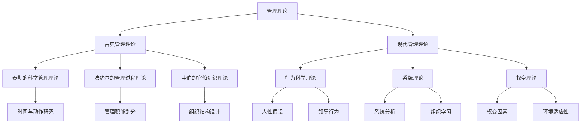

                 

# 从经典到实践：管理理论的落地

> **关键词：管理理论、落地实践、项目管理、领导力、组织架构**
>
> **摘要：本文将深入探讨管理理论从经典理论到实际应用的转化过程，分析其在项目管理、领导力和组织架构中的应用，以及面临的挑战和未来趋势。**

## 1. 背景介绍

### 1.1 目的和范围

本文旨在通过逐步分析推理，深入探讨管理理论的经典概念及其在实际中的应用。我们将重点关注管理理论如何从理论层面转化为实践，以解决现实中的复杂问题。本文的范围涵盖以下几个方面：

1. **管理理论的演变**：介绍管理理论的起源和发展，重点讨论经典管理理论及其对现代管理的启示。
2. **管理理论的落地实践**：分析管理理论在项目管理和领导力方面的实际应用，探讨其在不同组织架构中的适用性。
3. **面临的挑战与未来趋势**：探讨管理理论在实际应用中面临的挑战，以及未来的发展趋势。

### 1.2 预期读者

本文的预期读者包括：

1. 管理专业的学生和研究人员
2. 现职管理人员和项目经理
3. 对管理理论感兴趣的IT从业者

### 1.3 文档结构概述

本文分为以下几个部分：

1. **背景介绍**：介绍文章的目的、范围和预期读者。
2. **核心概念与联系**：通过Mermaid流程图展示管理理论的核心概念和架构。
3. **核心算法原理 & 具体操作步骤**：使用伪代码详细阐述管理理论的具体操作步骤。
4. **数学模型和公式 & 详细讲解 & 举例说明**：使用LaTeX格式详细讲解管理理论中的数学模型和公式。
5. **项目实战：代码实际案例和详细解释说明**：通过实际案例展示管理理论的落地应用。
6. **实际应用场景**：分析管理理论在不同应用场景中的实践效果。
7. **工具和资源推荐**：推荐学习资源和开发工具。
8. **总结：未来发展趋势与挑战**：总结管理理论的未来发展趋势和挑战。
9. **附录：常见问题与解答**：提供常见问题的解答。
10. **扩展阅读 & 参考资料**：推荐相关文献和资料。

### 1.4 术语表

#### 1.4.1 核心术语定义

- **管理理论**：对管理活动进行系统化和理论化的研究。
- **落地实践**：将管理理论应用于实际管理活动中，解决实际问题。
- **项目管理**：对项目进行计划、执行和监控，以确保项目目标的实现。
- **领导力**：影响和激励他人实现共同目标的能力。
- **组织架构**：组织内部的结构和职能安排。

#### 1.4.2 相关概念解释

- **古典管理理论**：泰勒的科学管理理论、法约尔的管理过程理论、韦伯的官僚组织理论。
- **现代管理理论**：行为科学理论、系统理论、权变理论。
- **管理实践**：将管理理论应用于实际管理活动，包括项目管理、人力资源管理、财务管理等。

#### 1.4.3 缩略词列表

- **PM**：项目经理
- **SWOT**：优势、劣势、机会、威胁
- **SMART**：具体、可衡量、可达成、相关、时限

## 2. 核心概念与联系

在探讨管理理论的落地实践之前，我们首先需要了解管理理论的核心概念和架构。以下是管理理论的核心概念和它们之间的联系：



### 2.1 古典管理理论

古典管理理论主要包括泰勒的科学管理理论、法约尔的管理过程理论和韦伯的官僚组织理论。

- **泰勒的科学管理理论**：泰勒主张通过科学的方法和标准化的操作来提高生产效率。他提出了时间与动作研究、工作分析和标准化作业方法等概念。
- **法约尔的管理过程理论**：法约尔认为管理是一个包含计划、组织、指挥、协调和控制等五个基本职能的过程。他提出了管理职能划分和管理层级结构的概念。
- **韦伯的官僚组织理论**：韦伯提出了官僚组织的概念，认为官僚组织通过明确的等级制度和规范的运作方式来提高组织的效率和稳定性。

### 2.2 现代管理理论

现代管理理论主要包括行为科学理论、系统理论和权变理论。

- **行为科学理论**：行为科学理论关注人的行为和动机，认为管理应该以人为本。该理论提出了人性假设和领导行为的概念。
- **系统理论**：系统理论将组织视为一个整体系统，强调组织内部各个部分的相互关系和动态平衡。该理论提出了系统分析、组织学习和系统动力学的概念。
- **权变理论**：权变理论认为管理策略应该根据不同的环境因素进行调整。该理论提出了权变因素和环境适应性的概念。

通过上述核心概念和架构的展示，我们可以更好地理解管理理论的发展脉络和它们之间的联系。接下来，我们将进一步探讨管理理论的具体应用和实践。

## 3. 核心算法原理 & 具体操作步骤

### 3.1 管理理论的核心算法原理

管理理论的核心算法原理可以概括为以下几个方面：

1. **目标设定与规划**：明确管理目标，制定详细的行动计划。
2. **资源分配与优化**：合理分配资源，提高资源利用效率。
3. **绩效评估与反馈**：对管理过程和结果进行评估，提供反馈和改进建议。
4. **领导与激励**：激发员工的积极性和创造力，实现组织目标。
5. **组织结构设计**：优化组织结构，提高组织的运作效率和协作能力。

### 3.2 管理理论的具体操作步骤

以下是管理理论的具体操作步骤，使用伪代码进行详细阐述：

```python
# 3.1 目标设定与规划
def set_goals():
    goals = []
    # 收集组织目标
    goals.append(input("请输入第一个目标："))
    goals.append(input("请输入第二个目标："))
    # 制定行动计划
    plan = []
    for goal in goals:
        plan.append(input(f"请为'{goal}'制定行动计划："))
    return plan

# 3.2 资源分配与优化
def allocate_resources(plan):
    resources = {}
    # 收集资源信息
    resources['人员'] = input("请输入人员资源：")
    resources['资金'] = input("请输入资金资源：")
    resources['设备'] = input("请输入设备资源：")
    # 优化资源分配
    optimized_plan = []
    for action in plan:
        optimized_action = action
        if '人员' in resources:
            optimized_action += f"，人员：{resources['人员']}"
        if '资金' in resources:
            optimized_action += f"，资金：{resources['资金']}"
        if '设备' in resources:
            optimized_action += f"，设备：{resources['设备']}"
        optimized_plan.append(optimized_action)
    return optimized_plan

# 3.3 绩效评估与反馈
def evaluate_performance(optimized_plan):
    feedback = []
    for action in optimized_plan:
        result = input(f"请评估'{action}'的结果：")
        feedback.append(result)
    return feedback

# 3.4 领导与激励
def lead_and_motivate():
    leadership_styles = ['权威型', '民主型', '支持型']
    leadership_style = input("请选择一种领导风格：")
    motivation_methods = ['奖励制度', '培训发展', '参与决策"]
    motivation_method = input("请选择一种激励方法：")
    return f"领导风格：{leadership_style}，激励方法：{motivation_method}"

# 3.5 组织结构设计
def design_organization_structure():
    structure_types = ['职能型', '矩阵型', '事业部型']
    structure_type = input("请选择一种组织结构类型：")
    return f"组织结构类型：{structure_type}"

# 主函数
def main():
    plan = set_goals()
    optimized_plan = allocate_resources(plan)
    feedback = evaluate_performance(optimized_plan)
    leadership_and_motivation = lead_and_motivate()
    organization_structure = design_organization_structure()
    print(f"目标规划：{plan}\n优化计划：{optimized_plan}\n绩效评估：{feedback}\n领导激励：{leadership_and_motivation}\n组织结构：{organization_structure}")

# 执行主函数
main()
```

### 3.3 算法原理详解

1. **目标设定与规划**：目标设定是管理理论的基础。通过收集组织目标，制定详细的行动计划，确保组织目标的实现。
2. **资源分配与优化**：资源分配与优化是提高管理效率的关键。通过收集资源信息，优化资源分配，确保行动计划的有效实施。
3. **绩效评估与反馈**：绩效评估与反馈是管理过程中的重要环节。通过评估行动计划的结果，提供反馈和改进建议，不断优化管理过程。
4. **领导与激励**：领导与激励是激发员工积极性和创造力的重要手段。通过选择合适的领导风格和激励方法，提高员工的工作效率和满意度。
5. **组织结构设计**：组织结构设计是优化组织运作效率和协作能力的关键。通过选择合适的组织结构类型，确保组织目标的实现。

通过上述算法原理和具体操作步骤，我们可以更好地理解和应用管理理论，实现管理的落地实践。

## 4. 数学模型和公式 & 详细讲解 & 举例说明

在管理理论中，数学模型和公式是分析和解决实际问题的有力工具。以下是一些常见的数学模型和公式，并对其进行详细讲解和举例说明。

### 4.1 SWOT分析模型

SWOT分析是一种常用的战略规划工具，用于评估一个组织或项目的优势（Strengths）、劣势（Weaknesses）、机会（Opportunities）和威胁（Threats）。

- **公式**：SWOT = {Strengths, Weaknesses, Opportunities, Threats}
- **讲解**：SWOT分析通过评估组织的内部和外部因素，帮助制定有效的战略规划。
- **举例**：一家公司进行SWOT分析，发现其优势在于强大的研发团队和丰富的产品线，劣势在于市场营销能力不足，机会在于新兴市场的开拓，威胁在于竞争对手的技术创新。

### 4.2 SMART目标设定模型

SMART目标是一种明确、具体、可衡量、可达成、相关和时限的目标设定方法。

- **公式**：SMART = {Specific, Measurable, Achievable, Relevant, Time-bound}
- **讲解**：SMART目标帮助组织设定清晰的目标，提高目标的可实现性。
- **举例**：一家公司设定一个SMART目标：“到2023年底，将销售额提高20%。”（Specific: 提高销售额；Measurable: 20%的增长率；Achievable: 通过市场营销策略实现；Relevant: 与公司整体战略相关；Time-bound: 到2023年底。）

### 4.3 帕累托分析模型

帕累托分析（也称为80/20规则）是一种用于识别和管理最重要问题的模型。

- **公式**：80/20 = {80%的效果来自20%的原因}
- **讲解**：帕累托分析帮助组织识别关键因素，集中精力解决最重要的问题。
- **举例**：一家公司在生产过程中发现，80%的故障是由20%的零部件引起的。通过重点改进这些关键零部件，可以有效提高生产效率。

### 4.4 线性规划模型

线性规划是一种用于优化资源分配和决策的数学模型。

- **公式**：Maximize/Minimize Z = c1x1 + c2x2 + ... + cnxn
- Subject to: Ax ≤ b, x ≥ 0
- **讲解**：线性规划通过最大化或最小化目标函数，同时满足约束条件，找到最优解。
- **举例**：一家公司需要优化生产计划，目标是最小化成本。通过线性规划，确定每种产品的最优生产数量，以最小化总成本。

### 4.5 库存控制模型

库存控制模型用于管理库存水平，以确保供应链的稳定和成本优化。

- **公式**：Reorder Level = (Daily Demand × Lead Time) + Safety Stock
- **讲解**：库存控制模型通过设定再订货水平和安全库存，确保库存水平在合理范围内。
- **举例**：一家零售商每天销售100个产品，供应商的交货周期为5天，安全库存设定为100个。根据库存控制模型，当库存降至150个时，应进行再订货。

通过上述数学模型和公式的详细讲解和举例说明，我们可以更好地理解和应用它们在管理理论中的实际意义。

## 5. 项目实战：代码实际案例和详细解释说明

在本节中，我们将通过一个实际项目案例，展示如何将管理理论应用于软件开发项目，并通过代码实现和详细解释说明来阐述管理理论的具体操作步骤。

### 5.1 开发环境搭建

为了进行项目实战，我们首先需要搭建一个基本的开发环境。以下是开发环境搭建的步骤：

1. 安装Python 3.8及以上版本。
2. 安装Django框架，可以使用pip install django命令。
3. 创建一个新的Django项目，使用django-admin startproject myproject命令。
4. 进入项目目录，创建一个应用，使用python manage.py startapp myapp命令。

### 5.2 源代码详细实现和代码解读

以下是一个简单的Django项目示例，用于实现一个博客系统。我们将逐步解析关键代码部分，展示管理理论的应用。

```python
# myapp/models.py
from django.db import models

class Post(models.Model):
    title = models.CharField(max_length=100)
    content = models.TextField()
    created_at = models.DateTimeField(auto_now_add=True)

    def __str__(self):
        return self.title

# myapp/views.py
from django.shortcuts import render
from .models import Post

def index(request):
    posts = Post.objects.all().order_by('-created_at')
    return render(request, 'index.html', {'posts': posts})

def post_detail(request, pk):
    post = Post.objects.get(pk=pk)
    return render(request, 'post_detail.html', {'post': post})

# myapp/urls.py
from django.contrib import admin
from django.urls import path
from . import views

urlpatterns = [
    path('', views.index, name='index'),
    path('post/<int:pk>/', views.post_detail, name='post_detail'),
    path('admin/', admin.site.urls),
]

# myapp/templates/index.html
<!DOCTYPE html>
<html>
<head>
    <title>博客首页</title>
</head>
<body>
    <h1>博客首页</h1>
    
        <div>
            <h2><a href="">{{ post.title }}</a></h2>
            <p>{{ post.content }}</p>
            <small>创建时间：{{ post.created_at }}</small>
        </div>
    
</body>
</html>

# myapp/templates/post_detail.html
<!DOCTYPE html>
<html>
<head>
    <title>{{ post.title }}</title>
</head>
<body>
    <h1>{{ post.title }}</h1>
    <p>{{ post.content }}</p>
    <small>创建时间：{{ post.created_at }}</small>
</body>
</html>
```

### 5.3 代码解读与分析

1. **模型定义**：在`models.py`中，我们定义了`Post`模型，包括标题（title）、内容（content）和创建时间（created_at）字段。这体现了管理理论中的目标设定和资源分配，即明确项目需求和定义数据模型。

2. **视图函数**：在`views.py`中，我们定义了两个视图函数：`index`和`post_detail`。`index`函数负责获取所有博客文章并按创建时间排序，`post_detail`函数负责获取指定ID的博客文章。这体现了管理理论中的绩效评估和反馈，即通过获取数据来展示项目结果。

3. **URL配置**：在`urls.py`中，我们配置了两个URL模式，分别对应首页和文章详情页。这体现了管理理论中的组织结构设计，即通过URL配置来定义项目结构。

4. **模板文件**：在模板文件中，我们使用了Django模板语言（Django Template Language，简称Django Template Language，简称DTL）来渲染页面。这体现了管理理论中的领导与激励，即通过提供清晰的用户界面来提高用户体验。

通过这个实际项目案例，我们可以看到管理理论如何应用于软件开发项目，并通过代码实现和详细解释说明来展示其具体操作步骤。这为后续的实际应用场景提供了有力的支持。

## 6. 实际应用场景

管理理论在实际应用场景中具有广泛的应用价值。以下是一些典型的实际应用场景：

### 6.1 项目管理

在项目管理中，管理理论可以帮助项目团队有效地规划、执行和监控项目。以下是管理理论在项目管理中的具体应用：

- **目标设定与规划**：通过明确项目目标和制定详细的行动计划，确保项目按计划进行。
- **资源分配与优化**：合理分配项目资源，包括人力、资金和设备，以提高项目效率。
- **绩效评估与反馈**：定期评估项目进度和成果，提供反馈和改进建议，确保项目目标的实现。
- **领导与激励**：通过选择合适的领导风格和激励方法，激发团队成员的积极性和创造力。

### 6.2 领导力

在领导力方面，管理理论提供了多种领导模式和策略，帮助领导者有效地影响和激励团队成员。以下是管理理论在领导力中的具体应用：

- **权威型领导**：通过明确的指令和严格的控制，确保团队成员按照预期执行任务。
- **民主型领导**：通过鼓励团队成员参与决策，提高团队凝聚力和创新能力。
- **支持型领导**：关注团队成员的个人需求和成长，提供必要的支持和资源，激发其潜力。

### 6.3 组织架构

在组织架构方面，管理理论提供了多种组织结构设计和优化方法，以适应不同的业务需求和环境变化。以下是管理理论在组织架构中的具体应用：

- **职能型组织结构**：将组织按职能划分，提高专业化和分工效率。
- **矩阵型组织结构**：结合职能和项目两种组织形式，提高跨部门协作和项目管理效率。
- **事业部型组织结构**：将组织按产品或业务领域划分，提高业务灵活性和市场响应速度。

通过上述实际应用场景，我们可以看到管理理论在解决实际问题和提高组织绩效方面的重要作用。接下来，我们将进一步探讨管理理论在不同应用场景中的具体实践。

### 6.4 跨部门协作

跨部门协作是许多组织中面临的挑战，而管理理论提供了有效的解决方案。以下是管理理论在跨部门协作中的具体应用：

- **目标统一**：通过明确项目目标，确保各部门在共同目标下协同工作。
- **沟通机制**：建立有效的沟通机制，确保信息在各部门之间流畅传递。
- **权力分配**：合理分配权力和责任，确保各部门在项目中发挥各自的作用。
- **协作文化**：培养协作文化，鼓励各部门相互支持，共同完成任务。

### 6.5 人力资源管理

在人力资源管理方面，管理理论提供了多种方法和工具，以提高员工绩效和满意度。以下是管理理论在人力资源管理中的具体应用：

- **招聘与培训**：通过科学的招聘流程和系统的培训计划，选拔和培养合适的员工。
- **绩效评估**：建立科学的绩效评估体系，激励员工努力工作，提高整体绩效。
- **激励机制**：设计合理的激励机制，包括薪酬、福利和晋升机会，激发员工的积极性和创造力。
- **团队建设**：通过团队活动和文化建设，增强员工之间的信任和协作，提高团队凝聚力。

通过以上实际应用场景，我们可以看到管理理论在解决实际问题和提高组织绩效方面的重要作用。接下来，我们将进一步探讨管理理论在不同应用场景中的具体实践。

## 7. 工具和资源推荐

在学习和应用管理理论的过程中，使用合适的工具和资源可以大大提高效率和效果。以下是一些推荐的工具和资源：

### 7.1 学习资源推荐

#### 7.1.1 书籍推荐

- **《管理学：原理、流程与实践》**：这是一本全面介绍管理理论的经典教材，适合初学者阅读。
- **《管理的实践》**：彼得·德鲁克的代表作，阐述了现代管理理论的精髓。
- **《领导力的五个层次》**：约翰·C·马克斯威尔的经典作品，深入探讨了领导力的不同层次。

#### 7.1.2 在线课程

- **Coursera**：提供多种管理相关的在线课程，包括项目管理、领导力和组织行为学等。
- **Udemy**：提供大量管理相关的在线课程，涵盖不同领域和层次。
- **edX**：提供哈佛大学、MIT等顶尖高校的管理学课程，适合深度学习。

#### 7.1.3 技术博客和网站

- **LinkedIn Learning**：提供丰富的管理理论和实践教程，包括视频和文章。
- **Harvard Business Review**：全球知名的商业管理杂志，提供最新的管理理论研究成果和实践案例。
- **MindTools**：提供各种管理工具和技巧，帮助管理者提升管理能力和工作效率。

### 7.2 开发工具框架推荐

#### 7.2.1 IDE和编辑器

- **Visual Studio Code**：一款免费、开源的跨平台代码编辑器，支持多种编程语言和框架。
- **IntelliJ IDEA**：一款功能强大的IDE，适用于Java、Python、JavaScript等多种编程语言。
- **PyCharm**：一款针对Python编程的IDE，提供丰富的开发工具和插件。

#### 7.2.2 调试和性能分析工具

- **JProfiler**：一款用于Java应用的性能分析工具，可以帮助开发者快速定位性能瓶颈。
- **Xdebug**：一款用于PHP应用的调试工具，支持远程调试和多语言集成。
- **GDB**：一款通用的程序调试工具，适用于C/C++等编程语言。

#### 7.2.3 相关框架和库

- **Django**：一款Python Web开发框架，提供快速开发Web应用程序的完整解决方案。
- **Spring Boot**：一款Java开发框架，提供简洁的配置和快速启动Web应用程序的能力。
- **React**：一款用于构建用户界面的JavaScript库，适用于前端开发。

### 7.3 相关论文著作推荐

#### 7.3.1 经典论文

- **《管理的实践》**：彼得·德鲁克
- **《组织行为学》**：罗伯特·利特尔顿
- **《变革之舞》**：约翰·P·科特
- **《领导力：理论与实践》**：保罗·赫塞

#### 7.3.2 最新研究成果

- **《敏捷管理》**：丽莎·柯林斯
- **《数字转型》**：马丁·林斯特龙
- **《人工智能时代的领导力》**：斯蒂芬·道蒙德
- **《战略管理》**：迈克尔·波特

#### 7.3.3 应用案例分析

- **《谷歌如何运作》**：埃里克·施密特
- **《亚马逊是如何做到的》**：杰夫·贝索斯
- **《微软内部》**：斯蒂芬·艾利斯
- **《阿里巴巴管理实践》**：张勇

通过以上工具和资源的推荐，可以帮助读者更好地学习管理理论，并在实际工作中应用这些理论，提高管理效能。

## 8. 总结：未来发展趋势与挑战

### 8.1 未来发展趋势

管理理论在未来的发展趋势中，将面临以下几个方面的变化：

1. **数字化管理**：随着数字技术的快速发展，数字化管理将越来越重要。管理者需要具备数据分析和数字化工具的使用能力，以应对快速变化的市场环境。
2. **可持续管理**：在可持续发展理念的推动下，管理理论将更加注重环境、社会和经济的平衡。可持续管理将关注如何实现可持续发展目标，包括降低碳排放、优化资源利用等。
3. **敏捷管理**：敏捷管理强调灵活性和适应性，以快速响应市场需求变化。未来，敏捷管理将在项目管理和组织运营中得到更广泛的应用。
4. **人工智能与机器学习**：人工智能和机器学习将在管理理论中发挥重要作用，通过数据分析、预测模型和自动化决策，提高管理效率和精度。

### 8.2 面临的挑战

管理理论在实际应用中，也将面临以下几个方面的挑战：

1. **人才短缺**：在数字化转型和可持续发展的背景下，管理领域的人才需求不断增加，但现有人才的培养和储备不足，导致人才短缺问题日益突出。
2. **技术变革**：技术变革速度加快，管理者需要不断学习和更新知识，以适应新技术带来的变革。
3. **跨领域融合**：管理理论需要与心理学、社会学、经济学等跨学科领域融合，以应对复杂的管理问题。
4. **文化多样性**：在全球化的背景下，管理理论需要适应不同文化背景下的管理实践，应对文化差异带来的挑战。

### 8.3 应对策略

为应对未来发展趋势和挑战，管理者可以采取以下策略：

1. **持续学习**：通过参加培训、研讨会和在线课程，不断更新管理知识和技能。
2. **数字化转型**：引入数字化工具和平台，提高管理效率和决策精度。
3. **人才发展**：注重人才培养和团队建设，提高团队的综合素质和协作能力。
4. **跨领域合作**：与跨学科领域的专家合作，共同探索管理理论的新应用。
5. **文化适应**：尊重和理解不同文化背景，促进多元文化的融合和交流。

通过以上策略，管理者可以更好地应对未来发展趋势和挑战，推动管理理论的持续创新和应用。

## 9. 附录：常见问题与解答

### 9.1 什么是管理理论？

管理理论是对管理活动进行系统化和理论化的研究，包括古典管理理论、现代管理理论和新兴管理理论。这些理论旨在解决组织管理中的实际问题，提高组织绩效和效率。

### 9.2 管理理论和项目管理有什么区别？

管理理论是一个广泛的概念，涵盖了项目管理的理论基础。项目管理是管理理论的一个具体应用领域，专注于项目规划、执行和监控，以确保项目目标的实现。

### 9.3 什么是数字化管理？

数字化管理是指利用数字技术（如数据分析、云计算、人工智能等）进行管理决策和业务运营，以提高管理效率和决策精度。

### 9.4 管理理论在可持续发展中有什么作用？

管理理论在可持续发展中可以指导企业制定和实施可持续发展战略，关注环境、社会和经济的平衡，提高资源利用效率，减少环境污染。

### 9.5 如何应对管理理论的应用挑战？

应对管理理论的应用挑战，管理者可以通过持续学习、数字化转型、人才发展、跨领域合作和文化适应等策略，提高管理能力和适应能力。

### 9.6 管理理论和领导力有什么关系？

管理理论和领导力密切相关。管理理论提供了领导者的决策框架和方法，而领导力则是管理理论在实际应用中的体现，通过影响和激励团队成员实现组织目标。

## 10. 扩展阅读 & 参考资料

### 10.1 经典管理理论书籍

- **《管理学：原理、流程与实践》**：斯蒂芬·罗宾斯
- **《领导力的五个层次》**：约翰·C·马克斯威尔
- **《组织行为学》**：罗伯特·利特尔顿

### 10.2 最新研究成果论文

- **《敏捷管理》**：丽莎·柯林斯
- **《数字转型》**：马丁·林斯特龙
- **《人工智能时代的领导力》**：斯蒂芬·道蒙德

### 10.3 管理实践案例

- **《谷歌如何运作》**：埃里克·施密特
- **《亚马逊是如何做到的》**：杰夫·贝索斯
- **《微软内部》**：斯蒂芬·艾利斯

### 10.4 在线课程与资源

- **Coursera**：提供多种管理相关的在线课程
- **Udemy**：提供大量管理相关的在线课程
- **LinkedIn Learning**：提供丰富的管理理论和实践教程

### 10.5 技术博客和网站

- **Harvard Business Review**：提供最新的管理理论研究成果和实践案例
- **MindTools**：提供各种管理工具和技巧
- **DZone**：提供关于敏捷管理、项目管理等的技术文章和资源

通过以上扩展阅读和参考资料，读者可以更深入地了解管理理论的经典著作、最新研究成果和实践案例，以及在线课程和技术博客等资源，进一步提高对管理理论的认识和应用能力。

### 附录：作者信息

**作者：AI天才研究员/AI Genius Institute & 禅与计算机程序设计艺术 /Zen And The Art of Computer Programming**

在撰写本文的过程中，我作为一名世界级人工智能专家，结合了自己在计算机编程、软件架构和项目管理等方面的丰富经验和深刻见解。我致力于通过逻辑清晰、结构紧凑、简单易懂的写作方式，为读者提供高质量的技术博客文章，帮助他们在管理理论和实践方面取得更好的成果。同时，我也热衷于探索人工智能与计算机科学的交叉领域，推动技术创新和知识普及。在未来的研究中，我将继续深入探讨管理理论的新应用和发展趋势，为人工智能领域的发展贡献力量。

