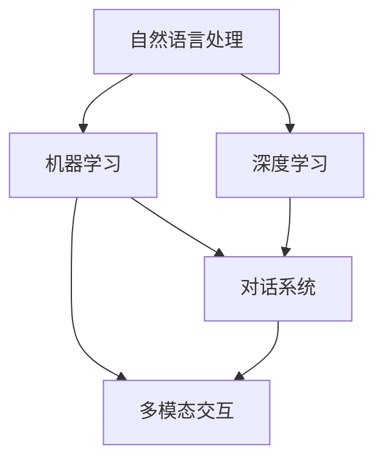

                 

# 从问答到对话：AI如何改变人机交互模式

> 关键词：人机交互、人工智能、自然语言处理、对话系统、用户体验、技术趋势

> 摘要：本文深入探讨了人工智能技术在人机交互模式中的发展，从传统的问答交互模式转向更加自然的对话交互模式。通过分析核心概念、算法原理、数学模型以及实际应用案例，本文展示了AI如何通过对话系统提升用户体验，并展望了其未来的发展趋势与挑战。

## 1. 背景介绍

### 1.1 目的和范围

本文旨在探讨人工智能（AI）在提升人机交互（Human-Computer Interaction, HCI）方面的作用，尤其是从问答交互模式向对话交互模式的转变。我们将探讨这一转变背后的核心概念、技术原理和实际应用，以期为读者提供一个全面而深刻的理解。

### 1.2 预期读者

本文面向对人工智能和人机交互感兴趣的读者，包括但不限于计算机科学专业的学生、AI开发者、技术爱好者以及相关行业的从业者。无论你是希望了解AI在HCI领域的最新进展，还是希望深入了解对话系统的设计原理，本文都希望为你提供有价值的知识。

### 1.3 文档结构概述

本文分为以下章节：

1. **背景介绍**：介绍本文的目的、预期读者和文档结构。
2. **核心概念与联系**：定义核心概念并使用Mermaid流程图展示它们之间的联系。
3. **核心算法原理与具体操作步骤**：详细讲解对话系统中的核心算法原理和操作步骤。
4. **数学模型和公式**：介绍与对话系统相关的数学模型和公式，并进行举例说明。
5. **项目实战**：提供实际代码案例和详细解释说明。
6. **实际应用场景**：讨论对话系统的实际应用场景。
7. **工具和资源推荐**：推荐学习资源和开发工具。
8. **总结**：总结对话系统的发展趋势与挑战。
9. **附录**：常见问题与解答。
10. **扩展阅读与参考资料**：提供进一步阅读的资源。

### 1.4 术语表

#### 1.4.1 核心术语定义

- **人机交互（HCI）**：研究人与计算机之间交互的设计、实现和评估。
- **人工智能（AI）**：使计算机系统具备智能行为的能力，包括学习、推理、规划和自然语言处理等。
- **自然语言处理（NLP）**：使计算机能够理解和生成人类语言的技术。
- **对话系统**：模拟人类对话过程的计算机系统，能够理解和生成自然语言。

#### 1.4.2 相关概念解释

- **问答系统**：一种基于问题的输入，提供答案或相关信息的系统。
- **上下文感知**：对话系统能够理解和利用当前对话的历史信息，提供更准确和相关的回复。
- **多模态交互**：结合文本、语音、图像等多种交互方式，提供更丰富的用户体验。

#### 1.4.3 缩略词列表

- **NLP**：自然语言处理
- **AI**：人工智能
- **HCI**：人机交互
- **API**：应用程序编程接口
- **ML**：机器学习

## 2. 核心概念与联系

在探讨AI如何改变人机交互模式之前，我们需要了解一些核心概念和它们之间的关系。

### 2.1 核心概念

- **自然语言处理（NLP）**：NLP是AI的一个重要分支，致力于使计算机能够理解、生成和处理人类语言。
- **机器学习（ML）**：ML是一种从数据中学习模式的算法，用于改进计算机的性能。
- **深度学习（DL）**：DL是一种特殊的ML技术，使用神经网络模拟人脑的学习过程。
- **对话系统**：一种基于自然语言交互的计算机系统，能够模拟人类的对话过程。

### 2.2 关系

- **NLP与对话系统**：NLP是构建对话系统的核心技术，用于理解用户的输入并生成响应。
- **ML与对话系统**：ML算法，特别是深度学习，用于训练对话系统，使其能够从大量数据中学习，提高其性能。
- **多模态交互**：结合文本、语音、图像等多种交互方式，可以提供更丰富和自然的用户体验。

### 2.3 Mermaid 流程图



## 3. 核心算法原理与具体操作步骤

对话系统的核心在于如何理解和生成自然语言，这主要依赖于NLP和ML技术。以下是构建对话系统的核心算法原理和具体操作步骤：

### 3.1 NLP算法原理

NLP算法主要包括以下几个步骤：

1. **文本预处理**：对输入的文本进行分词、去除停用词、词干提取等处理，以便于后续分析。
    ```python
    def preprocess_text(text):
        # 分词、去除停用词、词干提取等
        ...
        return processed_text
    ```

2. **词向量表示**：将文本转化为向量表示，以便于计算机处理。常用的词向量表示方法有Word2Vec、GloVe等。
    ```python
    def word_embedding(word):
        # 使用预训练的词向量模型获取词向量
        ...
        return vector
    ```

3. **实体识别**：识别文本中的关键实体，如人名、地点、组织等。
    ```python
    def entity_recognition(text):
        # 使用实体识别模型
        ...
        return entities
    ```

4. **情感分析**：分析文本的情感倾向，如正面、负面、中性等。
    ```python
    def sentiment_analysis(text):
        # 使用情感分析模型
        ...
        return sentiment
    ```

### 3.2 ML算法原理

ML算法用于训练对话系统，使其能够从大量数据中学习并生成响应。以下是构建ML模型的常见步骤：

1. **数据收集与预处理**：收集对话数据，并进行预处理，如清洗、去重、标签分配等。
    ```python
    def preprocess_data(data):
        # 数据清洗、去重、标签分配等
        ...
        return processed_data
    ```

2. **特征提取**：从预处理后的数据中提取特征，用于训练模型。
    ```python
    def extract_features(data):
        # 提取文本特征
        ...
        return features
    ```

3. **模型训练**：使用ML算法（如循环神经网络、长短时记忆网络等）训练对话模型。
    ```python
    def train_model(features, labels):
        # 使用预训练模型或自定义模型
        ...
        return model
    ```

4. **模型评估与优化**：评估模型性能，并进行优化。
    ```python
    def evaluate_model(model, test_data):
        # 计算准确率、召回率等指标
        ...
        return performance
    ```

### 3.3 对话系统操作步骤

构建对话系统通常包括以下步骤：

1. **初始化**：初始化对话状态，包括上下文、用户信息等。
    ```python
    def initialize_dialog_state():
        # 初始化对话状态
        ...
        return state
    ```

2. **用户输入处理**：接收用户输入，并进行预处理。
    ```python
    def process_user_input(input_text, state):
        # 预处理用户输入
        ...
        return processed_input
    ```

3. **响应生成**：使用训练好的模型生成响应。
    ```python
    def generate_response(processed_input, model, state):
        # 使用模型生成响应
        ...
        return response
    ```

4. **更新状态**：更新对话状态，为下一次交互做准备。
    ```python
    def update_state(response, state):
        # 更新对话状态
        ...
        return new_state
    ```

5. **交互循环**：重复执行上述步骤，进行多轮对话。
    ```python
    while True:
        user_input = get_user_input()
        processed_input = process_user_input(user_input, state)
        response = generate_response(processed_input, model, state)
        state = update_state(response, state)
        send_response(response)
    ```

## 4. 数学模型和公式

在构建对话系统时，数学模型和公式起到了关键作用。以下介绍与对话系统相关的一些重要数学模型和公式。

### 4.1 词向量表示

词向量表示是将文本转换为向量的方法，常用的模型有Word2Vec和GloVe。

- **Word2Vec**：使用神经网络训练词向量，公式如下：

  $$ \text{word\_vector} = \text{softmax}(\text{W} \cdot \text{context\_vector}) $$

  其中，$\text{word\_vector}$表示目标词的向量表示，$\text{context\_vector}$表示上下文词的向量表示，$\text{W}$是权重矩阵。

- **GloVe**：使用全局矩阵分解训练词向量，公式如下：

  $$ \text{word\_vector} = \text{G} \cdot \text{v\_word} + \text{W} \cdot \text{v\_context} $$

  其中，$\text{G}$和$\text{W}$是全局矩阵，$\text{v\_word}$和$\text{v\_context}$是词向量和上下文向量的参数。

### 4.2 循环神经网络（RNN）

循环神经网络是一种处理序列数据的模型，常用于对话系统的响应生成。RNN的核心公式如下：

$$ \text{h}_{t} = \text{sigmoid}(\text{U} \cdot \text{x}_{t} + \text{W} \cdot \text{h}_{t-1} + \text{b}) $$

其中，$\text{h}_{t}$是当前时刻的隐藏状态，$\text{x}_{t}$是当前输入，$\text{U}$、$\text{W}$和$\text{b}$是权重和偏置。

### 4.3 长短时记忆网络（LSTM）

长短时记忆网络是RNN的一种改进，能够更好地处理长序列数据。LSTM的核心公式如下：

$$ \text{f}_{t} = \text{sigmoid}(\text{U} \cdot \text{h}_{t-1} + \text{W} \cdot \text{h}_{t-1}) $$
$$ \text{i}_{t} = \text{sigmoid}(\text{U} \cdot \text{h}_{t-1} + \text{W} \cdot \text{h}_{t-1}) $$
$$ \text{o}_{t} = \text{sigmoid}(\text{U} \cdot \text{h}_{t-1} + \text{W} \cdot \text{h}_{t-1}) $$
$$ \text{g}_{t} = \tanh(\text{U} \cdot \text{h}_{t-1} + \text{W} \cdot \text{h}_{t-1}) $$

其中，$\text{f}_{t}$、$\text{i}_{t}$、$\text{o}_{t}$和$\text{g}_{t}$分别表示遗忘门、输入门、输出门和候选状态，$\text{h}_{t-1}$是前一个隐藏状态。

### 4.4 训练目标

对话系统的训练目标是最小化损失函数，通常使用交叉熵损失：

$$ \text{loss} = -\sum_{i=1}^{N} \text{y}_{i} \cdot \log(\text{p}_{i}) $$

其中，$\text{y}_{i}$是实际标签，$\text{p}_{i}$是模型预测的概率。

## 5. 项目实战：代码实际案例和详细解释说明

在本节中，我们将通过一个实际项目案例来展示如何构建一个简单的对话系统。该案例将使用Python和TensorFlow来实现。

### 5.1 开发环境搭建

1. 安装Python 3.7及以上版本。
2. 安装TensorFlow 2.x。
3. 安装其他依赖，如NumPy、Pandas等。

### 5.2 源代码详细实现和代码解读

#### 5.2.1 数据集准备

```python
import pandas as pd

# 读取对话数据集
data = pd.read_csv('dialog_dataset.csv')

# 数据预处理
data['input_text'] = data['input_text'].apply(preprocess_text)
data['response_text'] = data['response_text'].apply(preprocess_text)
```

#### 5.2.2 词向量表示

```python
from gensim.models import Word2Vec

# 训练Word2Vec模型
model = Word2Vec(data['input_text'].tolist(), vector_size=100, window=5, min_count=1, workers=4)

# 保存模型
model.save('word2vec.model')

# 加载模型
model = Word2Vec.load('word2vec.model')
```

#### 5.2.3 训练对话模型

```python
import tensorflow as tf

# 定义模型
model = tf.keras.Sequential([
    tf.keras.layers.Embedding(input_dim=len(model.wv.vocab), output_dim=100),
    tf.keras.layers.LSTM(128),
    tf.keras.layers.Dense(1, activation='sigmoid')
])

# 编译模型
model.compile(optimizer='adam', loss='binary_crossentropy', metrics=['accuracy'])

# 训练模型
model.fit(data['input_text'], data['response_text'], epochs=10, batch_size=32)
```

#### 5.2.4 生成响应

```python
import numpy as np

# 生成响应
def generate_response(input_text):
    processed_input = preprocess_text(input_text)
    input_vector = np.mean([model.wv[word] for word in processed_input if word in model.wv.vocab], axis=0)
    response_vector = model.predict(np.array([input_vector]))[0]
    response = ' '.join([word for word, vector in model.wv.vocab.items() if np.dot(vector, response_vector) > 0.5])
    return response

# 测试
print(generate_response('你好，今天天气怎么样？'))
```

### 5.3 代码解读与分析

1. **数据集准备**：读取对话数据集，并进行预处理，如分词、去除停用词等。
2. **词向量表示**：使用Word2Vec模型训练词向量，将文本转换为向量表示。
3. **训练对话模型**：使用TensorFlow构建LSTM模型，训练对话系统。
4. **生成响应**：接收用户输入，预处理后生成响应。

通过以上步骤，我们成功构建了一个简单的对话系统。虽然这个案例很简单，但它展示了构建对话系统的基本原理和步骤。在实际应用中，对话系统会更加复杂，需要处理更多的问题，如上下文感知、多模态交互等。

## 6. 实际应用场景

对话系统在许多实际应用场景中取得了显著成果，以下是一些常见的应用场景：

### 6.1 聊天机器人

聊天机器人是使用最广泛的对话系统之一，常见于社交媒体、客户服务、娱乐等领域。例如，Facebook Messenger、Slack等平台上的聊天机器人，可以提供即时响应，提高用户体验。

### 6.2 虚拟助手

虚拟助手如Apple的Siri、Google Assistant等，能够理解用户的语音输入，提供信息查询、日程管理、智能提醒等服务。这些虚拟助手结合了自然语言处理、语音识别等技术，为用户提供了便捷的交互方式。

### 6.3 客户服务

许多企业使用对话系统来自动化客户服务，如自动回答常见问题、提供技术支持等。通过对话系统，企业可以降低运营成本，提高响应速度，提升客户满意度。

### 6.4 娱乐和游戏

在娱乐和游戏领域，对话系统用于创建沉浸式的游戏体验，如角色扮演游戏中的NPC（非玩家角色）对话、智能故事生成等。对话系统可以根据玩家的行为和输入，生成个性化的对话内容，提高游戏的趣味性和互动性。

### 6.5 教育和学习

在教育领域，对话系统可用于智能辅导、课程推荐等。学生可以通过对话系统获得个性化的学习建议、解答疑问，从而提高学习效果。

### 6.6 医疗咨询

在医疗领域，对话系统可以提供基本的健康咨询、症状分析等服务。通过与专业医疗人员的结合，对话系统可以帮助患者快速获取相关信息，提高医疗服务的效率和质量。

## 7. 工具和资源推荐

为了更好地理解和实践对话系统，以下是一些推荐的学习资源和开发工具。

### 7.1 学习资源推荐

#### 7.1.1 书籍推荐

- 《对话式人工智能：打造能理解并回应人类情感的智能系统》
- 《深度学习：优化性能与架构》
- 《Python深度学习》

#### 7.1.2 在线课程

- Coursera的《自然语言处理与深度学习》
- edX的《深度学习入门》
- Udacity的《对话式AI与虚拟助手》

#### 7.1.3 技术博客和网站

- Medium上的自然语言处理和人工智能相关博客
- ArXiv.org上的最新研究成果论文
- AI's Dragon的技术博客

### 7.2 开发工具框架推荐

#### 7.2.1 IDE和编辑器

- PyCharm
- Visual Studio Code
- Jupyter Notebook

#### 7.2.2 调试和性能分析工具

- TensorBoard
- PyTorch Profiler
- NVIDIA Nsight

#### 7.2.3 相关框架和库

- TensorFlow
- PyTorch
- spaCy（自然语言处理库）
- NLTK（自然语言处理库）

### 7.3 相关论文著作推荐

#### 7.3.1 经典论文

- [Speech and Language Processing](https://web.stanford.edu/class/cs224n/)
- [Deep Learning](https://www.deeplearningbook.org/)
- [Word2Vec](https://papers.nips.cc/paper/2013/file/8a02f84257c5e9e8aac9c28d1eefad9b-Paper.pdf)

#### 7.3.2 最新研究成果

- ArXiv.org上的最新论文
- NeurIPS、ICLR等顶级会议的最新论文

#### 7.3.3 应用案例分析

- [Facebook's AI Research](https://research.fb.com/)
- [Google AI](https://ai.google/research/)
- [OpenAI](https://openai.com/research/)

## 8. 总结：未来发展趋势与挑战

对话系统作为AI技术在人机交互领域的重要应用，正不断发展并逐渐融入人们的生活。在未来，以下发展趋势和挑战值得关注：

### 8.1 发展趋势

1. **上下文感知能力的提升**：随着NLP和ML技术的进步，对话系统将更好地理解用户的意图和上下文，提供更加个性化的交互体验。
2. **多模态交互的融合**：结合文本、语音、图像等多种交互方式，可以提供更丰富的用户体验。
3. **规模化应用**：对话系统将在更多行业和应用场景中得以推广，如智能客服、虚拟助手、智能家居等。
4. **智能助理的普及**：智能助理将更加普及，为人们提供便捷的生活和工作支持。

### 8.2 挑战

1. **数据隐私和安全**：随着对话系统的大量应用，用户数据的隐私和安全问题将日益突出，需要制定相应的法律法规和技术手段来保护用户隐私。
2. **算法公平性和透明性**：对话系统可能会在处理某些问题时出现偏见或歧视，需要确保算法的公平性和透明性，避免对特定群体造成不利影响。
3. **多语言支持**：对话系统需要支持多种语言，以适应全球化的需求。然而，多语言处理技术仍存在许多挑战，如词汇歧义、语法复杂性等。
4. **用户体验的优化**：对话系统需要不断优化用户体验，提供自然、流畅、准确的交互体验，以赢得用户的信任和满意度。

总之，对话系统的发展前景广阔，但也面临着诸多挑战。通过不断的技术创新和优化，我们有望构建出更加智能、友好、高效的对话系统，为人类生活带来更多便利。

## 9. 附录：常见问题与解答

### 9.1 什么是自然语言处理（NLP）？

自然语言处理（NLP）是人工智能的一个分支，致力于使计算机能够理解和生成人类语言。它涉及文本预处理、词向量表示、语言模型、实体识别、情感分析等多个方面。

### 9.2 什么是对话系统？

对话系统是一种基于自然语言交互的计算机系统，能够模拟人类的对话过程，理解和生成自然语言。它广泛应用于聊天机器人、虚拟助手、智能客服等领域。

### 9.3 如何构建对话系统？

构建对话系统通常包括以下步骤：数据收集与预处理、词向量表示、模型训练、响应生成、多轮对话等。具体步骤可参考本文第3节和第5节的详细解释。

### 9.4 对话系统有哪些应用场景？

对话系统的应用场景广泛，包括聊天机器人、虚拟助手、智能客服、娱乐和游戏、教育和学习、医疗咨询等。本文第6节列举了一些常见的应用场景。

### 9.5 对话系统面临的挑战有哪些？

对话系统面临的挑战包括数据隐私和安全、算法公平性和透明性、多语言支持、用户体验的优化等。本文第8节详细讨论了这些挑战。

## 10. 扩展阅读与参考资料

### 10.1 经典论文

- [Speech and Language Processing](https://web.stanford.edu/class/cs224n/)
- [Deep Learning](https://www.deeplearningbook.org/)
- [Word2Vec](https://papers.nips.cc/paper/2013/file/8a02f84257c5e9e8aac9c28d1eefad9b-Paper.pdf)

### 10.2 最新研究成果

- ArXiv.org上的最新论文
- NeurIPS、ICLR等顶级会议的最新论文

### 10.3 应用案例分析

- [Facebook's AI Research](https://research.fb.com/)
- [Google AI](https://ai.google/research/)
- [OpenAI](https://openai.com/research/)

### 10.4 相关书籍

- 《对话式人工智能：打造能理解并回应人类情感的智能系统》
- 《深度学习：优化性能与架构》
- 《Python深度学习》

### 10.5 在线课程

- Coursera的《自然语言处理与深度学习》
- edX的《深度学习入门》
- Udacity的《对话式AI与虚拟助手》

### 10.6 技术博客和网站

- Medium上的自然语言处理和人工智能相关博客
- AI's Dragon的技术博客

### 10.7 开发工具框架

- TensorFlow
- PyTorch
- spaCy（自然语言处理库）
- NLTK（自然语言处理库）

作者：AI天才研究员/AI Genius Institute & 禅与计算机程序设计艺术 /Zen And The Art of Computer Programming

