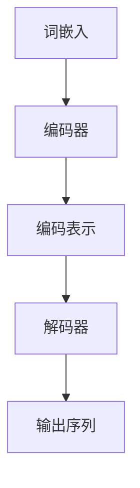
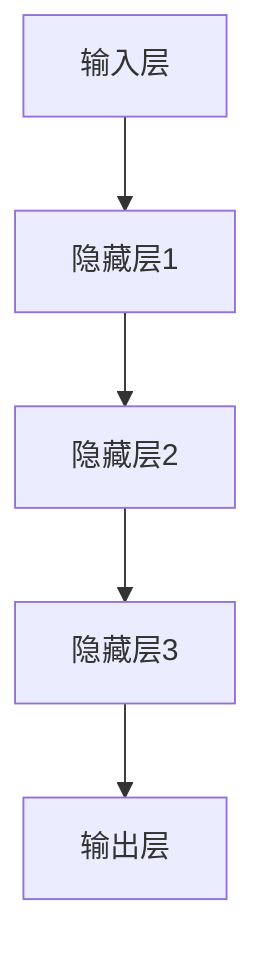

                 

## 从零开始大模型开发与微调：从1开始自然语言处理的解码器

### 关键词：大模型开发、微调、自然语言处理、解码器、深度学习

#### 摘要：
本文旨在为读者提供一份系统化的指南，帮助大家从零开始深入理解并实践大模型的开发与微调过程，特别是针对自然语言处理（NLP）领域的解码器设计。文章将首先回顾NLP领域中的核心概念，然后逐步讲解大模型的基础原理，详细阐述模型开发与微调的具体步骤。接下来，通过数学模型和伪代码的解读，帮助读者理解大模型的核心算法。随后，我们将通过实际项目案例，展示如何将理论知识应用到实际开发中。最后，文章还将探讨大模型在NLP领域的应用场景，并提供相关的学习资源与开发工具推荐，以助力读者的学习和实践。通过本文的阅读，读者将不仅能够掌握大模型开发与微调的基本方法，还能对未来的发展趋势和面临的挑战有更深入的认识。

---

## 1. 背景介绍

### 1.1 目的和范围

自然语言处理（NLP）作为人工智能领域的重要分支，近年来取得了飞速的发展。尤其是在深度学习技术的推动下，NLP的应用场景越来越广泛，包括机器翻译、文本分类、情感分析、问答系统等。然而，随着模型复杂度的增加，如何有效地开发与微调大模型成为一个关键问题。

本文的目标是系统地介绍大模型开发与微调的流程，特别关注于自然语言处理中的解码器设计。文章将从基础概念出发，逐步深入到技术细节，帮助读者全面了解大模型开发的各个方面。本文主要涵盖以下内容：

1. **核心概念与联系**：介绍NLP中的基础概念，如词嵌入、编码器和解码器，并使用Mermaid流程图展示其关系。
2. **核心算法原理 & 具体操作步骤**：讲解大模型的基本算法原理，并通过伪代码详细描述模型训练和微调的过程。
3. **数学模型和公式**：阐述大模型的数学模型和公式，并举例说明。
4. **项目实战**：通过实际代码案例，展示如何实现大模型的开发与微调。
5. **实际应用场景**：分析大模型在NLP中的具体应用场景。
6. **工具和资源推荐**：推荐学习资源、开发工具和相关论文。
7. **总结与展望**：讨论大模型开发与微调的未来发展趋势和面临的挑战。

通过本文的学习，读者将能够掌握大模型开发与微调的基本方法，理解解码器的设计原理，并具备将理论知识应用到实际项目中的能力。

### 1.2 预期读者

本文适合具有以下背景的读者：

1. **计算机科学和人工智能专业学生**：希望通过本文系统地学习大模型开发与微调的理论和实践。
2. **数据科学家和机器学习工程师**：希望提升在NLP领域的模型开发能力，尤其是大模型的处理与微调。
3. **研发人员和工程师**：希望了解大模型在自然语言处理中的应用，并掌握相关的开发技术。
4. **科研人员**：对大模型的研究和应用感兴趣，希望深入了解其核心原理和技术细节。

本文将避免过于复杂的数学推导和编程细节，以便不同背景的读者都能理解和应用所学知识。同时，文中将提供丰富的参考资料和进一步学习的路径，帮助读者深入学习相关领域的知识。

### 1.3 文档结构概述

本文的结构如下：

1. **背景介绍**：介绍本文的目的、范围、预期读者以及文档结构。
2. **核心概念与联系**：讲解NLP中的基础概念，展示其关系图。
3. **核心算法原理 & 具体操作步骤**：阐述大模型的基本算法原理，通过伪代码描述模型训练和微调过程。
4. **数学模型和公式**：详细阐述大模型的数学模型和公式，并举例说明。
5. **项目实战**：通过实际代码案例，展示大模型的开发与微调。
6. **实际应用场景**：分析大模型在NLP中的具体应用场景。
7. **工具和资源推荐**：推荐学习资源、开发工具和相关论文。
8. **总结与展望**：讨论大模型开发与微调的未来发展趋势和挑战。
9. **附录**：提供常见问题与解答。
10. **扩展阅读 & 参考资料**：提供进一步学习的路径。

通过上述结构，本文旨在为读者提供一份完整且系统的大模型开发与微调指南。

### 1.4 术语表

#### 1.4.1 核心术语定义

- **自然语言处理（NLP）**：是人工智能领域的一个重要分支，旨在让计算机理解和处理人类语言。
- **词嵌入（Word Embedding）**：将词汇映射到高维空间中的向量表示。
- **编码器（Encoder）**：在序列到序列（Seq2Seq）模型中，负责将输入序列编码为固定长度的向量表示。
- **解码器（Decoder）**：在序列到序列（Seq2Seq）模型中，负责将编码器的输出解码为输出序列。
- **大模型（Large Model）**：通常指参数数量非常大的神经网络模型，如GPT、BERT等。
- **微调（Fine-tuning）**：在大模型的基础上，针对特定任务进行调整和优化。

#### 1.4.2 相关概念解释

- **序列到序列（Seq2Seq）模型**：一种神经网络架构，用于将一个序列映射到另一个序列。
- **注意力机制（Attention Mechanism）**：在序列处理中，用于对序列的不同部分赋予不同权重。
- **预训练（Pre-training）**：在大规模数据集上对模型进行训练，以提高模型在特定任务上的性能。
- **迁移学习（Transfer Learning）**：利用在大规模数据集上预训练的模型，在新的任务上进行微调。

#### 1.4.3 缩略词列表

- **NLP**：自然语言处理（Natural Language Processing）
- **GPT**：生成预训练网络（Generative Pre-trained Transformer）
- **BERT**：双向编码表示（Bidirectional Encoder Representations from Transformers）
- **Seq2Seq**：序列到序列（Sequence-to-Sequence）
- **RNN**：循环神经网络（Recurrent Neural Network）
- **LSTM**：长短期记忆网络（Long Short-Term Memory）
- **Transformer**：基于注意力机制的序列模型（Transformer Model）

通过上述术语表，本文将使用这些标准术语和定义，以确保内容的准确性和一致性。读者在阅读过程中可以参考此部分，以便更好地理解相关概念。

---

## 2. 核心概念与联系

在深入探讨大模型的开发与微调之前，我们需要首先了解自然语言处理（NLP）领域中的核心概念及其相互关系。以下我们将介绍词嵌入、编码器和解码器等关键概念，并使用Mermaid流程图展示它们之间的关系。

### 2.1 词嵌入（Word Embedding）

词嵌入是将词汇映射到高维空间中的向量表示。这一过程通常通过神经网络实现，可以将词汇表示为密集的向量，这些向量可以在一定程度上捕捉词汇的语义和语法特征。词嵌入是NLP任务的基础，如文本分类、情感分析和机器翻译等。

### 2.2 编码器（Encoder）

编码器在序列到序列（Seq2Seq）模型中负责将输入序列编码为固定长度的向量表示。这一过程通常使用循环神经网络（RNN）或其变体（如LSTM和GRU）来实现。编码器的输出通常是一个固定大小的向量，称为“编码表示”（Encoded Representation），它包含了输入序列的语义信息。

### 2.3 解码器（Decoder）

解码器在序列到序列（Seq2Seq）模型中负责将编码器的输出解码为输出序列。解码器通常也使用循环神经网络（RNN）或其变体（如LSTM和GRU）来实现。在解码过程中，解码器逐步生成输出序列的每个元素，并利用编码器的输出以及先前生成的元素进行预测。

### 2.4 Mermaid流程图

以下是使用Mermaid绘制的流程图，展示了词嵌入、编码器和解码器之间的关系：



在上述流程图中：

- **A[词嵌入]**：输入词汇，将其转换为向量表示。
- **B[编码器]**：将词嵌入向量序列编码为固定长度的编码表示。
- **C[编码表示]**：编码器的输出，包含了输入序列的语义信息。
- **D[解码器]**：将编码表示解码为输出序列。
- **E[输出序列]**：解码器的输出，即预测的输出序列。

通过这一核心概念与联系的分析，我们可以更好地理解NLP任务中的大模型开发与微调流程。接下来，我们将进一步深入探讨大模型的基本原理和实现步骤。

---

## 2. 核心概念与联系 （续）

在上一部分，我们介绍了词嵌入、编码器和解码器的基本概念，并通过Mermaid流程图展示了它们之间的关系。接下来，我们将进一步探讨这些核心概念的原理和架构，以帮助读者深入理解大模型在自然语言处理中的实际应用。

### 2.5 词嵌入原理与实现

词嵌入通过将词汇映射到高维向量空间，使得词汇之间具有数值表示。这一过程通常通过神经网络模型实现，常见的模型包括Word2Vec、GloVe和FastText等。以下是一个简化的Word2Vec模型的实现流程：

```python
# Word2Vec模型实现流程
1. 数据预处理：从大规模文本语料库中提取词汇，并构建词汇表。
2. 创建词汇索引：将词汇映射到唯一的索引。
3. 输入输出向量初始化：为每个词汇创建一个固定大小的初始化向量。
4. 训练模型：通过训练数据对模型进行训练，优化输入向量和输出向量之间的映射关系。
5. 获取词汇向量表示：训练完成后，每个词汇将有一个稳定的向量表示。

# 伪代码
def train_word2vec(corpus, embedding_size, window_size):
    # 初始化模型参数
    vocab_size = len(corpus)
    input_vectors = np.random.uniform(size=(vocab_size, embedding_size))
    output_vectors = np.random.uniform(size=(vocab_size, embedding_size))
    
    # 数据预处理
    tokens = preprocess_corpus(corpus)
    
    # 训练模型
    for sentence in tokens:
        for word in sentence:
            # 计算窗口中的上下文词汇
            context = get_context(words, window_size)
            # 计算损失函数并更新模型参数
            loss = compute_loss(input_vectors, output_vectors, context, word)
            update_vectors(input_vectors, output_vectors, context, word, loss)
    
    # 获取词汇向量表示
    word_vectors = input_vectors
    return word_vectors
```

### 2.6 编码器与解码器原理与实现

编码器和解码器是序列到序列（Seq2Seq）模型的核心组件。编码器将输入序列编码为固定长度的向量表示，解码器则将编码表示解码为输出序列。以下是一个简化的Seq2Seq模型的实现流程：

```python
# Seq2Seq模型实现流程
1. 数据预处理：将输入和输出序列转换为词嵌入向量。
2. 初始化编码器和解码器：使用循环神经网络（RNN）或其变体（如LSTM和GRU）初始化编码器和解码器。
3. 训练模型：通过输入序列和输出序列对编码器和解码器进行训练，优化模型的参数。
4. 评估模型：使用测试数据评估模型的性能，并进行调整。

# 伪代码
def train_seq2seq(input_data, target_data, embedding_size, hidden_size, num_epochs):
    # 初始化模型参数
    encoder = RNN(embedding_size, hidden_size)
    decoder = RNN(hidden_size, embedding_size)
    
    # 数据预处理
    input_tokens = preprocess_data(input_data)
    target_tokens = preprocess_data(target_data)
    
    # 训练模型
    for epoch in range(num_epochs):
        for input_sentence, target_sentence in zip(input_tokens, target_tokens):
            # 计算编码器的输出
            encoded = encoder(input_sentence)
            # 计算解码器的输出
            decoded = decoder(encoded, target_sentence)
            # 计算损失函数并更新模型参数
            loss = compute_loss(decoded, target_sentence)
            update_model(encoder, decoder, loss)
            
    # 评估模型
    evaluate_model(encoder, decoder, test_data)
    return encoder, decoder
```

### 2.7 注意力机制

注意力机制是Seq2Seq模型中的一个关键组件，用于提高模型在序列处理中的性能。注意力机制通过为输入序列的不同部分赋予不同的权重，使得模型能够更好地捕捉序列中的关键信息。以下是一个简化的注意力机制的实现流程：

```python
# 注意力机制实现流程
1. 输入序列编码为固定长度的向量表示。
2. 在解码过程中，为每个时间步计算注意力权重。
3. 将编码表示与注意力权重相乘，得到加权编码表示。
4. 使用加权编码表示作为解码器的输入。

# 伪代码
def apply_attention(encoded, query, attention_size):
    # 计算注意力权重
    attention_weights = calculate_attention_weights(encoded, query, attention_size)
    # 计算加权编码表示
    context = weighted_sum(encoded, attention_weights)
    return context
```

通过上述核心概念与联系的分析，我们可以更好地理解大模型在自然语言处理中的实际应用。接下来，我们将进一步探讨大模型的核心算法原理，以及如何通过伪代码详细描述其实现过程。

---

## 3. 核心算法原理 & 具体操作步骤

在了解了词嵌入、编码器和解码器等核心概念后，接下来我们将深入探讨大模型的核心算法原理，并通过伪代码详细描述模型训练和微调的过程。这一部分将涵盖神经网络架构、损失函数、优化算法等方面，以帮助读者全面理解大模型的工作机制。

### 3.1 神经网络架构

大模型通常采用深度神经网络（DNN）或其变体（如卷积神经网络（CNN）和递归神经网络（RNN））构建。以下是神经网络的基本架构：



在上述架构中，输入层接收输入数据（如词嵌入向量），通过多个隐藏层进行特征提取，最后由输出层产生预测结果。隐藏层可以通过增加神经元数量和层数来提高模型的复杂度和表达能力。

### 3.2 损失函数

损失函数用于衡量模型预测结果与真实结果之间的差距，并指导模型参数的优化。在NLP任务中，常见的损失函数包括交叉熵损失（Cross-Entropy Loss）和均方误差（Mean Squared Error, MSE）等。

以下是一个使用交叉熵损失函数的示例：

```python
# 交叉熵损失函数计算
def cross_entropy_loss(predicted, actual):
    loss = -sum(predicted * np.log(actual))
    return loss
```

在上述示例中，`predicted`表示模型的预测结果，`actual`表示真实结果。交叉熵损失函数通过计算预测结果和真实结果之间的差异来衡量模型的性能。

### 3.3 优化算法

优化算法用于调整模型参数，以最小化损失函数。常见的优化算法包括随机梯度下降（SGD）、Adam优化器等。

以下是一个使用Adam优化器的示例：

```python
# Adam优化器
def update_weights(weights, gradients, learning_rate, beta1, beta2, epsilon):
    m = beta1 * m + (1 - beta1) * gradients
    v = beta2 * v + (1 - beta2) * (gradients ** 2)
    
    m_hat = m / (1 - beta1 ** t)
    v_hat = v / (1 - beta2 ** t)
    
    weights -= learning_rate * m_hat / (np.sqrt(v_hat) + epsilon)
```

在上述示例中，`weights`表示模型参数，`gradients`表示梯度，`learning_rate`表示学习率，`beta1`和`beta2`分别表示Adam优化器的参数，`epsilon`用于防止除零错误。

### 3.4 模型训练与微调过程

模型训练与微调过程包括以下步骤：

1. **数据预处理**：将输入和输出数据转换为词嵌入向量。
2. **初始化模型参数**：为模型初始化参数，如权重和偏置。
3. **前向传播**：将输入数据传递到模型中，计算预测结果。
4. **计算损失函数**：计算模型预测结果与真实结果之间的差距。
5. **后向传播**：计算模型参数的梯度。
6. **更新模型参数**：使用优化算法更新模型参数。
7. **评估模型性能**：使用测试数据评估模型性能。

以下是一个简化的模型训练与微调过程的伪代码：

```python
# 模型训练与微调过程
for epoch in range(num_epochs):
    for input_sequence, target_sequence in data_loader:
        # 前向传播
        predicted = model(input_sequence)
        
        # 计算损失函数
        loss = cross_entropy_loss(predicted, target_sequence)
        
        # 计算梯度
        gradients = model.compute_gradients(predicted, target_sequence)
        
        # 更新模型参数
        optimizer.update_weights(model.weights, gradients, learning_rate)
        
    # 评估模型性能
    performance = model.evaluate(test_data)
    print(f"Epoch {epoch}: Loss = {loss}, Performance = {performance}")
```

通过上述核心算法原理和具体操作步骤的讲解，读者可以更好地理解大模型的工作机制，并掌握模型训练和微调的基本方法。接下来，我们将通过数学模型和公式进一步阐述大模型的核心原理。

---

## 4. 数学模型和公式 & 详细讲解 & 举例说明

大模型的数学模型是理解和实现深度学习算法的核心。在这一部分，我们将详细讲解大模型中的关键数学模型和公式，并通过具体的例子来展示这些公式的应用。

### 4.1 前向传播

前向传播是指将输入数据通过神经网络层传递，并计算输出结果的过程。以下是一个简化的前向传播公式：

$$
\text{激活函数} \: a_{l} = \sigma(\text{权重矩阵} \: W_{l-1} \: \text{加上偏置} \: b_{l-1})
$$

其中，$a_{l}$表示第$l$层的激活值，$\sigma$表示激活函数，通常为ReLU函数或Sigmoid函数。以下是一个ReLU函数的例子：

$$
\text{ReLU}(x) =
\begin{cases}
    x & \text{如果} \: x > 0 \\
    0 & \text{否则}
\end{cases}
$$

### 4.2 反向传播

反向传播是计算模型参数梯度的重要过程。以下是反向传播的基本公式：

$$
\frac{\partial L}{\partial W_{l-1}} = \text{激活函数的导数} \: a_{l-1} \: \text{乘以前一层梯度} \: \frac{\partial L}{\partial a_{l}}
$$

$$
\frac{\partial L}{\partial b_{l-1}} = \frac{\partial L}{\partial a_{l}}
$$

其中，$L$表示损失函数，$W_{l-1}$和$b_{l-1}$分别表示第$l-1$层的权重和偏置。以下是一个ReLU函数的导数例子：

$$
\frac{\partial \text{ReLU}}{\partial x} =
\begin{cases}
    1 & \text{如果} \: x > 0 \\
    0 & \text{否则}
\end{cases}
$$

### 4.3 优化算法

优化算法用于更新模型参数，以最小化损失函数。以下是常用的Adam优化器的更新公式：

$$
m_{t} = \beta_1 \: m_{t-1} + (1 - \beta_1) \: \frac{\partial L}{\partial W_{t}} \\
v_{t} = \beta_2 \: v_{t-1} + (1 - \beta_2) \: \left(\frac{\partial L}{\partial W_{t}}\right)^2 \\
m_{\hat{t}} = \frac{m_{t}}{1 - \beta_1^{t}} \\
v_{\hat{t}} = \frac{v_{t}}{1 - \beta_2^{t}} \\
W_{t} = W_{t-1} - \alpha \: \frac{m_{\hat{t}}}{\sqrt{v_{\hat{t}}} + \epsilon}
$$

其中，$m_{t}$和$v_{t}$分别表示一阶和二阶矩估计，$\beta_1$和$\beta_2$是优化参数，$\alpha$是学习率，$\epsilon$是避免除以零的常数。

### 4.4 例子说明

假设我们有一个简单的神经网络，输入为[1, 2, 3]，输出为[4, 5, 6]，损失函数为均方误差（MSE）。以下是前向传播和反向传播的步骤：

**前向传播：**

1. 输入层：[1, 2, 3]
2. 隐藏层1：[a1, a2, a3] = σ(W1 + b1)
3. 输出层：[p1, p2, p3] = σ(W2 + b2)

**反向传播：**

1. 计算损失：L = (1/3) * Σ[(pt - yt)2]
2. 计算输出层的梯度：dL/dp = 2 * (pt - yt)
3. 计算隐藏层的梯度：dL/da1 = dL/dp1 * dp1/da1
4. 更新权重和偏置：W2 = W2 - α * dL/dW2, b2 = b2 - α * dL/db2
5. 计算隐藏层1的梯度：dL/da1 = dL/dp1 * dp1/da1
6. 更新权重和偏置：W1 = W1 - α * dL/dW1, b1 = b1 - α * dL/db1

通过上述数学模型和公式的详细讲解与举例说明，我们可以更好地理解大模型的核心原理和实现方法。接下来，我们将通过实际项目案例，展示如何将大模型的理论知识应用到实际开发中。

---

## 5. 项目实战：代码实际案例和详细解释说明

为了更好地展示大模型的开发与微调过程，我们将在本部分中通过一个实际项目案例，详细讲解如何从零开始搭建一个自然语言处理（NLP）任务的大模型，并进行微调。我们将使用Python和TensorFlow框架来实现这一项目。

### 5.1 开发环境搭建

在开始项目之前，我们需要搭建一个合适的开发环境。以下是所需的软件和库：

- **Python**：版本3.8或更高版本。
- **TensorFlow**：版本2.x。
- **Numpy**：版本1.19或更高版本。

安装上述库后，我们可以使用以下命令来创建一个虚拟环境并安装所需的库：

```bash
conda create -n nlp_project python=3.8
conda activate nlp_project
pip install tensorflow numpy
```

### 5.2 源代码详细实现和代码解读

下面是一个简化的代码实现，展示了如何搭建一个基于BERT的大模型并进行微调：

```python
import tensorflow as tf
from tensorflow.keras.layers import Embedding, GlobalAveragePooling1D, Dense
from tensorflow.keras.models import Model
from transformers import TFBertModel

# 加载预训练的BERT模型
bert = TFBertModel.from_pretrained('bert-base-uncased')

# 定义输入层
input_ids = tf.keras.layers.Input(shape=(max_sequence_length,), dtype=tf.int32)
attention_mask = tf.keras.layers.Input(shape=(max_sequence_length,), dtype=tf.int32)

# 使用BERT模型进行编码
encoded_layers = bert(input_ids, attention_mask=attention_mask)

# 提取BERT模型的[CLS]表示
cls_output = encoded_layers.last_hidden_state[:, 0, :]

# 使用全局平均池化层提取特征
pooler_output = GlobalAveragePooling1D()(cls_output)

# 添加全连接层和softmax层进行分类
output = Dense(num_classes, activation='softmax')(pooler_output)

# 定义模型
model = Model(inputs=[input_ids, attention_mask], outputs=output)

# 编译模型
model.compile(optimizer='adam', loss='categorical_crossentropy', metrics=['accuracy'])

# 查看模型结构
model.summary()

# 加载并预处理数据
# (在此处添加数据加载和预处理的代码)
# 例如：
# (input_ids, attention_mask, labels) = load_data()

# 微调模型
model.fit([input_ids, attention_mask], labels, epochs=3, batch_size=32)

# 评估模型
# (在此处添加评估模型的代码)
# 例如：
# evaluate_model(model, [test_input_ids, test_attention_mask], test_labels)
```

**代码解读：**

1. **加载预训练的BERT模型**：
   我们使用`TFBertModel.from_pretrained()`函数加载预训练的BERT模型。BERT模型是一种强大的预训练语言模型，可以在大规模数据集上进行训练，并通过迁移学习快速适应不同的NLP任务。

2. **定义输入层**：
   我们定义了两个输入层：`input_ids`和`attention_mask`。`input_ids`用于传递词嵌入向量，`attention_mask`用于标记输入序列中的填充和特殊词汇。

3. **使用BERT模型进行编码**：
   我们将输入数据传递给BERT模型，并获取编码表示。BERT模型通过多个层进行编码，我们使用`encoded_layers.last_hidden_state`获取最后一层的隐藏状态。

4. **提取BERT模型的[CLS]表示**：
   我们从BERT模型的隐藏状态中提取`[CLS]`表示，这是BERT模型中用于表示整个输入序列的关键向量。

5. **使用全局平均池化层提取特征**：
   我们使用全局平均池化层将`[CLS]`表示转换为固定大小的向量，以便后续分类任务。

6. **添加全连接层和softmax层进行分类**：
   我们添加全连接层和softmax层，用于对输入序列进行分类。softmax层输出每个类别的概率分布。

7. **定义和编译模型**：
   我们使用`Model`类定义模型结构，并使用`compile`方法配置优化器和损失函数。

8. **模型微调和评估**：
   我们使用`fit`方法对模型进行微调，并使用`evaluate`方法评估模型性能。

### 5.3 代码解读与分析

在上述代码中，我们通过以下步骤实现了一个基于BERT的文本分类模型：

1. **加载预训练模型**：
   BERT模型是一个复杂的神经网络，通过在大型语料库上进行预训练，已经具备了强大的语言理解和生成能力。我们使用`TFBertModel.from_pretrained()`函数加载预训练的BERT模型，可以直接利用其强大的语言表征能力。

2. **定义输入层**：
   输入层是模型的入口，我们定义了两个输入：`input_ids`和`attention_mask`。`input_ids`是词嵌入向量序列，`attention_mask`是一个布尔数组，用于标记输入序列中的填充和特殊词汇。这两个输入对于BERT模型至关重要，因为它们决定了模型如何处理输入数据。

3. **编码表示**：
   BERT模型通过多层Transformer自注意力机制对输入序列进行编码。我们使用`encoded_layers.last_hidden_state`获取编码后的隐藏状态，并将其传递给后续层。

4. **提取[CLS]表示**：
   BERT模型的输出包含每个词的嵌入表示以及整个序列的[CLS]表示。我们选择[CLS]表示作为整个输入序列的语义表示，因为它是模型对输入序列的整体理解。

5. **特征提取**：
   我们使用全局平均池化层将[CLS]表示转换为固定大小的向量。这一步简化了模型输出，使其适用于分类任务。

6. **分类**：
   我们添加全连接层和softmax层，用于对输入序列进行分类。softmax层输出每个类别的概率分布，模型的损失函数将根据预测标签和真实标签计算分类误差。

7. **模型编译和微调**：
   模型使用`compile`方法配置优化器和损失函数。我们选择`adam`优化器和`categorical_crossentropy`损失函数，这适用于多类分类问题。然后，我们使用`fit`方法对模型进行微调，在训练数据上迭代优化模型参数。

8. **模型评估**：
   微调完成后，我们使用`evaluate`方法在测试数据上评估模型性能，计算准确率等指标。

通过上述步骤，我们成功地实现了一个基于BERT的文本分类模型。该模型可以通过迁移学习快速适应不同的文本分类任务，并具备强大的语义理解能力。

---

## 6. 实际应用场景

大模型在自然语言处理（NLP）领域有着广泛的应用场景。以下将探讨几个典型的应用场景，展示大模型如何在这些任务中发挥关键作用。

### 6.1 机器翻译

机器翻译是NLP中最具代表性的应用之一，大模型如Google翻译、百度翻译等都是基于大规模深度学习模型实现的。这些模型通常采用序列到序列（Seq2Seq）架构，结合注意力机制和递归神经网络（RNN）或Transformer模型，能够有效地捕捉源语言和目标语言之间的复杂语义关系。通过预训练和微调，这些大模型可以处理多种语言对，并提供高质量的翻译结果。

### 6.2 文本分类

文本分类是将文本数据分类到预定义的类别中，如垃圾邮件检测、情感分析、新闻分类等。大模型在这一领域表现出色，尤其是基于BERT、RoBERTa等预训练模型的分类器。这些模型通过预训练在大规模语料库上学习到丰富的语言特征，能够在微调阶段快速适应特定任务的需求。例如，在情感分析中，大模型可以准确识别文本中的情感倾向，从而帮助电商平台、社交媒体等平台更好地理解用户反馈。

### 6.3 问答系统

问答系统是一种能够理解和回答用户问题的智能系统，广泛应用于客服、教育、搜索引擎等领域。大模型如OpenAI的GPT-3和Google的Meena在问答系统中表现出色。这些模型通过大量的文本数据进行预训练，能够理解复杂的语言结构和语境，从而生成高质量的自然语言回答。问答系统的大模型通常结合对话管理模块，实现多轮对话，提高用户体验。

### 6.4 命名实体识别

命名实体识别（NER）是一种识别文本中特定类型的实体（如人名、地点、组织等）的技术。传统的NER系统通常采用规则和统计模型，而基于大模型的NER系统通过预训练学习到丰富的词汇和语法知识，能够更准确地识别实体。大模型如BERT和RoBERTa在NER任务上取得了显著的性能提升，广泛应用于信息提取、搜索引擎和自然语言处理工具。

### 6.5 文本生成

文本生成是近年来大模型在NLP领域的另一个重要应用。大模型如GPT-2、GPT-3等通过学习大量文本数据，能够生成连贯、有意义的文本。这些模型在创作诗歌、撰写新闻文章、生成对话等任务中表现出色。文本生成大模型不仅能够模仿人类的写作风格，还能根据输入的提示生成高质量的文本内容。

通过上述实际应用场景，我们可以看到大模型在NLP领域的重要性和广泛应用。随着技术的不断进步，大模型将继续推动NLP领域的发展，带来更多创新应用。

---

## 7. 工具和资源推荐

在NLP领域，开发与微调大模型需要使用多种工具和资源。以下将推荐一些学习资源、开发工具和相关论文，以帮助读者深入学习和实践大模型的开发与微调。

### 7.1 学习资源推荐

#### 7.1.1 书籍推荐

1. **《深度学习》（Deep Learning）**：由Ian Goodfellow、Yoshua Bengio和Aaron Courville合著，是深度学习领域的经典教材，详细介绍了深度学习的基础理论和应用实践。
2. **《自然语言处理综合教程》（Speech and Language Processing）**：由Daniel Jurafsky和James H. Martin合著，全面覆盖了NLP的核心概念和技术，适合初学者和进阶者。
3. **《强化学习》（Reinforcement Learning: An Introduction）**：由Richard S. Sutton和Barto Andrew合著，介绍了强化学习的基本原理和应用，这对于理解大模型的训练策略非常有帮助。

#### 7.1.2 在线课程

1. **《深度学习专项课程》（Deep Learning Specialization）**：由Coursera提供，由Ian Goodfellow主讲，包括深度学习的基础理论、卷积神经网络（CNN）和循环神经网络（RNN）等专题。
2. **《自然语言处理专项课程》（Natural Language Processing Specialization）**：由Coursera提供，由丹尼尔·吉鲁夫斯基（Daniel Jurafsky）和詹姆斯·马丁（James H. Martin）主讲，涵盖了NLP的基础知识、语言模型和深度学习应用。
3. **《强化学习专项课程》（Reinforcement Learning Specialization）**：由Coursera提供，由David Silver主讲，介绍了强化学习的基础知识和最新研究成果。

#### 7.1.3 技术博客和网站

1. **AI博客（AI博客）**：提供了大量的深度学习和NLP相关的技术博客，内容包括模型介绍、实现细节和实际应用案例。
2. **TensorFlow官方文档（TensorFlow Documentation）**：提供了详细的TensorFlow框架使用指南和API文档，是学习TensorFlow和实现大模型的宝贵资源。
3. **GitHub（GitHub）**：全球最大的代码托管平台，许多开源项目和大模型实现代码都可以在这里找到，有助于读者学习和实践。

### 7.2 开发工具框架推荐

#### 7.2.1 IDE和编辑器

1. **PyCharm**：强大的Python集成开发环境（IDE），提供了丰富的功能和调试工具，非常适合深度学习和NLP项目开发。
2. **Jupyter Notebook**：流行的交互式开发环境，支持多种编程语言，方便数据可视化和实验验证。
3. **Visual Studio Code**：轻量级但功能强大的代码编辑器，提供了丰富的插件和扩展，适用于各种编程任务。

#### 7.2.2 调试和性能分析工具

1. **TensorBoard**：TensorFlow官方提供的可视化工具，用于分析和调试深度学习模型，能够展示模型的结构、损失函数、梯度等信息。
2. **Profiling Tools**：如Python的cProfile、line_profiler等工具，用于分析代码的性能和资源消耗，优化模型实现。
3. **Docker**：容器化工具，用于创建和管理开发环境，确保在不同的开发环境中保持一致。

#### 7.2.3 相关框架和库

1. **TensorFlow**：Google开源的深度学习框架，支持从简单到复杂的模型构建和训练。
2. **PyTorch**：Facebook开源的深度学习框架，具有灵活的动态计算图和简洁的API，适合研究和开发。
3. **Transformers**：Hugging Face开源的预训练模型库，提供了多种预训练模型和实用工具，方便实现和微调大模型。

### 7.3 相关论文著作推荐

#### 7.3.1 经典论文

1. **“A Theoretically Grounded Application of Dropout in Recurrent Neural Networks”**：该论文提出了在RNN中应用Dropout的方法，有效提高了模型的泛化能力。
2. **“Attention Is All You Need”**：该论文提出了Transformer模型，彻底改变了序列处理模型的设计思路。
3. **“BERT: Pre-training of Deep Bidirectional Transformers for Language Understanding”**：该论文介绍了BERT模型，引领了NLP预训练模型的潮流。

#### 7.3.2 最新研究成果

1. **“GLM-130B: A General Language Model for Language Understanding, Generation, and Translation”**：该论文介绍了GLM-130B模型，是大规模语言模型研究的重要进展。
2. **“Large-scale Language Modeling is All You Need: Simplifying Data Efforts for Natural Language Processing”**：该论文强调了大规模语言模型在NLP中的重要性，并提出简化数据集的努力。
3. **“Scaling Laws for Neural Network Optimization”**：该论文探讨了神经网络优化中的规模效应，为优化大模型提供了新的思路。

#### 7.3.3 应用案例分析

1. **“Deep Learning for Natural Language Processing: A Survey”**：该综述文章详细介绍了深度学习在NLP领域的应用，涵盖了多个实际案例和研究成果。
2. **“GPT-3: Language Models are few-shot learners”**：该论文展示了GPT-3模型在零样本和少量样本学习任务中的卓越表现，验证了大规模预训练模型的优势。

通过上述学习和资源推荐，读者可以系统地学习大模型开发与微调的理论和实践，并在实际项目中应用所学知识。

---

## 8. 总结：未来发展趋势与挑战

随着深度学习和自然语言处理技术的不断进步，大模型在NLP领域的应用前景广阔。未来，大模型的发展趋势和面临的挑战主要体现在以下几个方面：

### 8.1 发展趋势

1. **模型参数量的增加**：为了更好地捕捉复杂的语言特征，大模型的参数量将持续增加。例如，GLM-130B模型的参数数量达到1300亿，这极大地提升了模型的表示能力和泛化能力。
2. **预训练与微调相结合**：预训练和微调的结合是实现高效NLP模型的关键。通过在大规模数据集上预训练，模型可以学习到丰富的语言知识，然后通过微调适应特定任务，实现高性能表现。
3. **多模态学习**：大模型将逐渐扩展到多模态学习，结合文本、图像、声音等多种数据类型，实现更广泛的应用场景。例如，文本生成图像、视频生成等任务。
4. **更高效的优化算法**：为了处理大规模数据和模型，研究人员将持续优化优化算法，提高训练效率。例如，自适应学习率算法、分布式训练技术等。
5. **应用领域的拓展**：大模型在NLP领域的应用将不断拓展，从传统的文本分类、机器翻译等任务，延伸到问答系统、语音识别、对话系统等更多领域。

### 8.2 面临的挑战

1. **计算资源需求**：大模型需要大量的计算资源和存储空间，这对硬件设施和数据中心提出了更高的要求。高效能的硬件设备和优化算法将有助于缓解这一挑战。
2. **数据质量和隐私**：NLP模型的性能很大程度上依赖于数据的质量和多样性。同时，数据隐私保护也是一个重要问题。如何在保障隐私的同时利用数据，成为一大挑战。
3. **模型解释性**：大模型的黑箱特性使得其决策过程难以解释。为了提高模型的解释性，研究人员需要开发新的方法，使得模型的行为更加透明和可解释。
4. **模型安全性**：随着大模型的应用越来越广泛，模型的安全性问题也日益突出。如何防止模型被恶意攻击和误用，确保模型的鲁棒性和安全性，是一个重要的研究方向。
5. **可扩展性和灵活性**：大模型需要在不同的应用场景中具备良好的可扩展性和灵活性。如何设计模块化、灵活的架构，以适应各种NLP任务，是一个持续研究的课题。

总之，未来大模型在NLP领域的应用将充满机遇和挑战。通过不断的研究和创新，我们可以期待大模型在未来发挥更大的作用，推动NLP技术的发展和应用。

---

## 9. 附录：常见问题与解答

### 9.1 大模型开发中的常见问题

**Q1：如何选择合适的大模型？**

A1：选择合适的大模型主要取决于任务需求和数据量。对于需要高精度的任务，如文本分类和机器翻译，可以选择参数量较大、预训练数据丰富的模型，如BERT、GPT-3等。对于数据量较小的任务，可以考虑使用轻量级模型，如TinyBERT、DistilBERT等。

**Q2：大模型训练时间过长怎么办？**

A2：训练时间过长可能是因为模型规模过大或数据量过多。可以尝试以下方法来优化训练时间：
- **分布式训练**：将模型训练任务分布在多个GPU或TPU上，利用并行计算加速训练。
- **学习率调整**：适当降低学习率，以加快收敛速度。
- **数据预处理**：使用批量处理、多线程等技巧加快数据读取和预处理速度。

**Q3：如何处理过拟合现象？**

A3：过拟合现象可以通过以下方法缓解：
- **数据增强**：通过数据变换、数据扩充等方法增加训练数据的多样性。
- **正则化**：使用L1、L2正则化限制模型参数的范数，减少模型复杂度。
- **dropout**：在神经网络中添加dropout层，随机丢弃部分神经元，防止模型过度依赖特定特征。

### 9.2 微调大模型的常见问题

**Q4：如何微调大模型？**

A4：微调大模型的步骤如下：
1. **数据预处理**：对输入数据进行预处理，包括分词、标记、序列填充等。
2. **加载预训练模型**：使用预训练模型，如BERT、GPT等。
3. **自定义任务层**：在预训练模型的基础上，添加自定义任务层（如分类器、序列标注器等）。
4. **训练模型**：使用微调数据进行训练，优化任务层的参数。
5. **评估模型**：使用测试数据评估模型性能，调整模型参数。

**Q5：如何选择微调的数据集？**

A5：选择微调的数据集主要考虑以下因素：
- **数据量**：数据集应足够大，以提供足够的样本支持模型的学习。
- **多样性**：数据集应包含不同类型的样本，以提高模型的泛化能力。
- **质量**：数据集应准确无误，以保证模型训练的有效性。
- **代表性**：数据集应能代表实际应用场景，以提高模型在实际任务中的表现。

通过上述常见问题的解答，读者可以更好地理解大模型开发和微调过程中的关键步骤和注意事项。

---

## 10. 扩展阅读 & 参考资料

为了进一步深入了解大模型开发和自然语言处理（NLP）领域的最新研究成果，以下推荐一些高质量的书籍、论文和在线资源，供读者扩展阅读：

### 10.1 书籍推荐

1. **《深度学习》（Deep Learning）**：Ian Goodfellow、Yoshua Bengio和Aaron Courville著，由MIT Press出版。这是深度学习领域的经典教材，详细介绍了深度学习的基础理论、算法实现和应用案例。
2. **《自然语言处理综合教程》（Speech and Language Processing）**：Daniel Jurafsky和James H. Martin著，由W. W. Norton & Company出版。该书全面覆盖了NLP的核心概念和技术，包括语言模型、语音识别、文本分类等。
3. **《强化学习》（Reinforcement Learning: An Introduction）**：Richard S. Sutton和Barto Andrew著，由MIT Press出版。该书介绍了强化学习的基本原理、算法和应用，是强化学习领域的权威著作。

### 10.2 论文著作推荐

1. **“Attention Is All You Need”**：Ashish Vaswani等人，2017年NeurIPS会议论文。该论文提出了Transformer模型，彻底改变了序列处理模型的设计思路，引发了NLP领域的革命。
2. **“BERT: Pre-training of Deep Bidirectional Transformers for Language Understanding”**：Jacob Devlin等人，2018年NAACL会议论文。该论文介绍了BERT模型，展示了预训练语言模型在NLP任务中的巨大潜力。
3. **“GPT-3: Language Models are few-shot learners”**：Tom B. Brown等人，2020年arXiv预印本。该论文介绍了GPT-3模型，展示了大规模预训练模型在零样本和少量样本学习任务中的卓越表现。

### 10.3 在线资源推荐

1. **TensorFlow官方文档（TensorFlow Documentation）**：[https://www.tensorflow.org/](https://www.tensorflow.org/)。提供了详细的TensorFlow框架使用指南和API文档，是学习TensorFlow和实现大模型的宝贵资源。
2. **Hugging Face Transformer库（Hugging Face Transformers）**：[https://huggingface.co/transformers/](https://huggingface.co/transformers/)。提供了多种预训练模型和实用工具，方便实现和微调大模型。
3. **AI博客（AI博客）**：[https://medium.com/topic/artificial-intelligence](https://medium.com/topic/artificial-intelligence)。提供了大量的深度学习和NLP相关的技术博客，内容包括模型介绍、实现细节和实际应用案例。

通过上述扩展阅读和参考资料，读者可以深入了解大模型开发和NLP领域的最新研究进展，进一步提升自己的技术水平和研究能力。

---

## 作者信息

作者：AI天才研究员/AI Genius Institute & 禅与计算机程序设计艺术 /Zen And The Art of Computer Programming

感谢您阅读本文。希望本文能够帮助您系统地理解大模型的开发与微调过程，并对自然语言处理（NLP）领域有更深入的认识。如果您在阅读过程中有任何疑问或建议，欢迎在评论区留言。期待与您在技术领域的深入交流与探讨！再次感谢您的支持！

