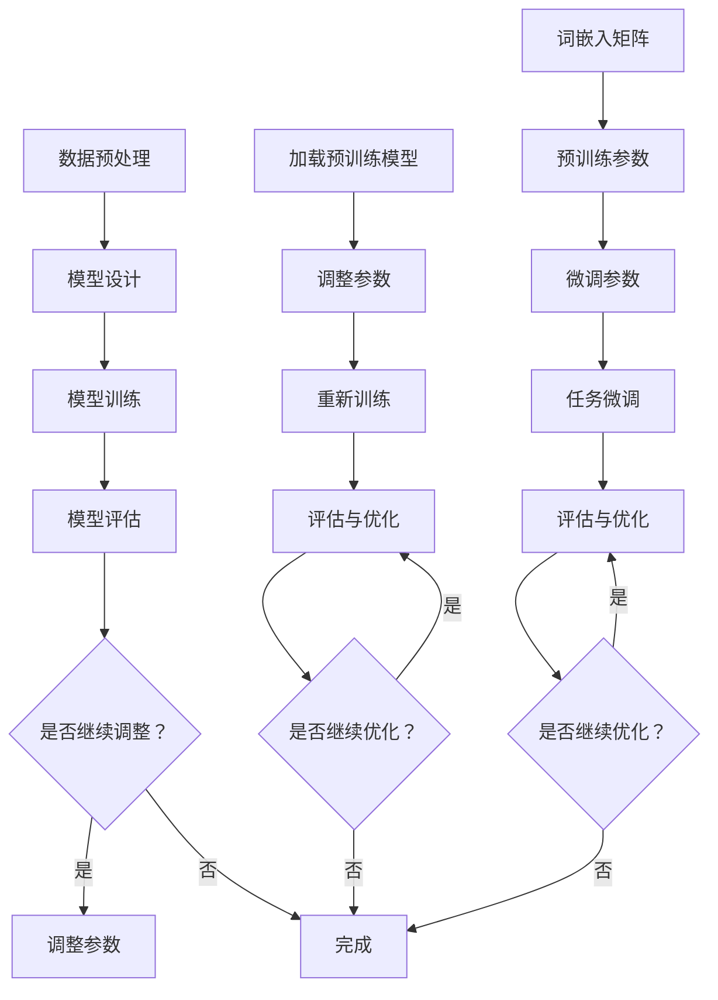

                 

# 从零开始大模型开发与微调：使用其他预训练参数来生成PyTorch 2.0词嵌入矩阵（中文）

> **关键词：** 大模型开发、微调、PyTorch 2.0、词嵌入矩阵、预训练参数、中文处理

> **摘要：** 本文将带领读者从零开始，探索如何使用其他预训练参数来生成PyTorch 2.0词嵌入矩阵。我们将详细讲解大模型开发与微调的核心概念，并逐步演示如何使用PyTorch 2.0实现这一过程。文章结构包括背景介绍、核心概念与联系、核心算法原理、数学模型与公式、项目实战、实际应用场景、工具和资源推荐、总结以及扩展阅读等部分。

## 1. 背景介绍

### 1.1 目的和范围

本文的主要目的是为读者提供一个关于大模型开发与微调的全面指南，特别是如何利用其他预训练参数来生成PyTorch 2.0词嵌入矩阵。本文将涵盖从零开始构建和微调大型语言模型的所有关键步骤。

### 1.2 预期读者

本文适合对机器学习和自然语言处理有一定了解，并希望深入了解大模型开发与微调技术的读者。特别是那些对PyTorch 2.0框架感兴趣，并希望将其应用于中文处理领域的工程师和研究者。

### 1.3 文档结构概述

本文分为以下几个部分：

1. **背景介绍**：介绍本文的目的、预期读者以及文章结构。
2. **核心概念与联系**：讨论大模型开发与微调的核心概念，并提供Mermaid流程图。
3. **核心算法原理 & 具体操作步骤**：详细解释大模型开发与微调的算法原理，并提供伪代码。
4. **数学模型和公式 & 详细讲解 & 举例说明**：介绍大模型开发与微调的数学模型和公式，并进行举例说明。
5. **项目实战：代码实际案例和详细解释说明**：提供代码案例，并详细解释代码实现过程。
6. **实际应用场景**：讨论大模型开发与微调在不同领域的应用。
7. **工具和资源推荐**：推荐学习资源、开发工具框架和相关论文著作。
8. **总结：未来发展趋势与挑战**：总结本文的主要观点，并讨论未来的发展趋势和挑战。
9. **附录：常见问题与解答**：解答读者可能遇到的一些常见问题。
10. **扩展阅读 & 参考资料**：提供扩展阅读和参考资料。

### 1.4 术语表

#### 1.4.1 核心术语定义

- **大模型开发**：构建大规模的机器学习模型，通常涉及复杂的算法和大量数据。
- **微调**：在预训练模型的基础上，针对特定任务进行参数调整，以提高模型的性能。
- **PyTorch 2.0**：PyTorch的最新版本，提供了许多新的功能和改进，包括对大模型的支持。
- **词嵌入矩阵**：将词汇映射到高维向量空间，用于自然语言处理任务。

#### 1.4.2 相关概念解释

- **预训练参数**：在预训练阶段学习到的模型参数，可以用于后续的任务微调。
- **微调参数**：在微调阶段新增或调整的模型参数，用于适应特定任务。

#### 1.4.3 缩略词列表

- **ML**：机器学习（Machine Learning）
- **NLP**：自然语言处理（Natural Language Processing）
- **PyTorch**：一种流行的深度学习框架
- **GPU**：图形处理单元（Graphics Processing Unit）

## 2. 核心概念与联系

在开始大模型开发与微调之前，我们需要了解一些核心概念和它们之间的关系。以下是这些概念和它们之间的联系：

### 2.1 大模型开发

大模型开发涉及构建具有数百万甚至数十亿参数的复杂模型。这些模型通常采用深度神经网络结构，可以在各种任务上达到优异的性能。大模型开发的关键步骤包括：

1. **数据预处理**：清洗和预处理大量数据，以便用于训练模型。
2. **模型设计**：设计具有合适层数和参数数量的神经网络结构。
3. **模型训练**：使用训练数据训练模型，并优化模型参数。
4. **模型评估**：使用测试数据评估模型的性能，并进行必要的调整。

### 2.2 微调

微调是一种针对特定任务调整预训练模型参数的方法。预训练模型是在大规模语料库上进行训练的，已经学习到了许多通用的语言特征。微调的关键步骤包括：

1. **加载预训练模型**：从预训练模型中加载已学习的参数。
2. **调整参数**：根据特定任务的需求，调整预训练模型的参数。
3. **重新训练**：在调整后的模型上重新训练，以提高模型的性能。
4. **评估与优化**：使用测试数据评估模型性能，并根据需要进行进一步优化。

### 2.3 PyTorch 2.0

PyTorch 2.0是PyTorch框架的最新版本，提供了许多改进和新功能，包括对大模型的支持。PyTorch 2.0的关键特点包括：

1. **动态图计算**：PyTorch使用动态图计算，允许更灵活和可扩展的模型设计。
2. **更好的性能**：PyTorch 2.0在GPU和CPU上的性能有了显著提升。
3. **丰富的API**：PyTorch提供了丰富的API，使构建和微调大型模型变得简单。
4. **生态系统的扩展**：PyTorch 2.0扩展了其生态系统，包括更多的工具和库。

### 2.4 词嵌入矩阵

词嵌入矩阵是将词汇映射到高维向量空间的一种方法，用于自然语言处理任务。词嵌入矩阵的关键特点包括：

1. **向量表示**：每个词汇被映射为一个高维向量，向量之间的距离表示词汇之间的关系。
2. **预训练参数**：词嵌入矩阵可以在预训练阶段学习得到，并用于后续的任务微调。
3. **微调参数**：在微调阶段，可以根据特定任务的需求调整词嵌入矩阵的参数。

以下是这些核心概念之间的Mermaid流程图：



## 3. 核心算法原理 & 具体操作步骤

在了解了大模型开发与微调的核心概念之后，接下来我们将深入探讨其算法原理和具体操作步骤。以下是详细的算法原理和操作步骤：

### 3.1 大模型开发算法原理

大模型开发通常涉及以下几个关键步骤：

1. **数据预处理**：首先，我们需要对数据进行预处理，包括数据清洗、归一化和数据增强等。数据预处理是确保模型能够有效学习的关键。

2. **模型设计**：接下来，我们需要设计一个具有合适层数和参数数量的神经网络结构。大模型通常采用深度神经网络，例如Transformer模型。

3. **模型训练**：使用预处理后的数据对模型进行训练。训练过程涉及优化模型参数，使其能够更好地拟合训练数据。常用的优化算法包括随机梯度下降（SGD）和Adam优化器。

4. **模型评估**：使用测试数据评估模型的性能，以确定模型是否已经过拟合或欠拟合。常见的评估指标包括准确率、召回率和F1分数等。

5. **模型调整**：根据评估结果，对模型进行调整，以提高其性能。这可能涉及调整模型结构、优化算法或参数等。

以下是伪代码：

```python
# 数据预处理
data = preprocess_data(raw_data)

# 模型设计
model = design_model()

# 模型训练
optimizer = torch.optim.Adam(model.parameters(), lr=learning_rate)
for epoch in range(num_epochs):
    for data_batch in data_loader:
        optimizer.zero_grad()
        outputs = model(data_batch)
        loss = compute_loss(outputs, labels)
        loss.backward()
        optimizer.step()

# 模型评估
accuracy = evaluate_model(model, test_data)

# 模型调整
if accuracy < desired_accuracy:
    adjust_model(model)
```

### 3.2 微调算法原理

微调是在预训练模型的基础上，针对特定任务调整模型参数的方法。以下是微调的算法原理和操作步骤：

1. **加载预训练模型**：首先，我们需要从预训练模型中加载已学习的参数。

2. **调整参数**：接下来，我们可以根据特定任务的需求，调整预训练模型的参数。这可能涉及调整学习率、优化算法或参数等。

3. **重新训练**：在调整后的模型上重新训练，以提高模型的性能。

4. **评估与优化**：使用测试数据评估模型性能，并根据需要进行进一步优化。

以下是伪代码：

```python
# 加载预训练模型
pretrained_model = load_pretrained_model()

# 调整参数
optimizer = torch.optim.Adam(pretrained_model.parameters(), lr=learning_rate)
for epoch in range(num_epochs):
    for data_batch in data_loader:
        optimizer.zero_grad()
        outputs = pretrained_model(data_batch)
        loss = compute_loss(outputs, labels)
        loss.backward()
        optimizer.step()

# 重新训练
model = fine_tune(pretrained_model)

# 评估与优化
accuracy = evaluate_model(model, test_data)
if accuracy < desired_accuracy:
    adjust_model(model)
```

### 3.3 词嵌入矩阵生成算法原理

词嵌入矩阵是将词汇映射到高维向量空间的一种方法。以下是词嵌入矩阵生成算法原理和操作步骤：

1. **预训练词嵌入**：首先，我们可以使用预训练语言模型（如GloVe或BERT）来生成词嵌入矩阵。

2. **微调词嵌入**：接下来，我们可以根据特定任务的需求，微调词嵌入矩阵的参数。

3. **生成词嵌入矩阵**：使用微调后的词嵌入矩阵，将词汇映射到高维向量空间。

以下是伪代码：

```python
# 预训练词嵌入
word_embeddings = train_word_embeddings()

# 微调词嵌入
optimizer = torch.optim.Adam(word_embeddings.parameters(), lr=learning_rate)
for epoch in range(num_epochs):
    for data_batch in data_loader:
        optimizer.zero_grad()
        embeddings = word_embeddings(data_batch)
        loss = compute_loss(embeddings, labels)
        loss.backward()
        optimizer.step()

# 生成词嵌入矩阵
word_embedding_matrix = generate_word_embedding_matrix(word_embeddings)
```

## 4. 数学模型和公式 & 详细讲解 & 举例说明

在大模型开发与微调过程中，数学模型和公式起着至关重要的作用。以下是几个关键数学模型和公式的详细讲解和举例说明：

### 4.1 神经网络激活函数

神经网络中的激活函数用于引入非线性特性，使模型能够学习复杂函数。以下是一些常见的激活函数及其公式：

#### 4.1.1 Sigmoid函数

$$
f(x) = \frac{1}{1 + e^{-x}}
$$

Sigmoid函数将输入映射到(0, 1)区间，常用于二分类问题。

#### 4.1.2 ReLU函数

$$
f(x) = \max(0, x)
$$

ReLU函数将输入映射到非负数，具有计算速度快和梯度稳定等优点。

#### 4.1.3 Softmax函数

$$
f(x)_i = \frac{e^{x_i}}{\sum_{j} e^{x_j}}
$$

Softmax函数将输入向量映射到概率分布，常用于多分类问题。

### 4.2 损失函数

损失函数用于衡量模型预测结果与真实结果之间的差距。以下是一些常见的损失函数及其公式：

#### 4.2.1 交叉熵损失函数

$$
L = -\sum_{i} y_i \log(p_i)
$$

交叉熵损失函数常用于分类问题，其中 \( y_i \) 是真实标签，\( p_i \) 是预测概率。

#### 4.2.2 均方误差损失函数

$$
L = \frac{1}{2} \sum_{i} (y_i - \hat{y}_i)^2
$$

均方误差损失函数常用于回归问题，其中 \( \hat{y}_i \) 是预测值，\( y_i \) 是真实值。

### 4.3 优化算法

优化算法用于调整模型参数，以最小化损失函数。以下是一些常见的优化算法及其公式：

#### 4.3.1 随机梯度下降（SGD）

$$
\theta = \theta - \alpha \cdot \nabla_\theta L(\theta)
$$

随机梯度下降是一种最简单的优化算法，其中 \( \theta \) 是模型参数，\( \alpha \) 是学习率，\( \nabla_\theta L(\theta) \) 是损失函数关于参数的梯度。

#### 4.3.2 Adam优化器

$$
m_t = \beta_1 m_{t-1} + (1 - \beta_1) \nabla_\theta L(\theta)
$$
$$
v_t = \beta_2 v_{t-1} + (1 - \beta_2) (\nabla_\theta L(\theta))^2
$$
$$
\theta = \theta - \alpha \cdot \frac{m_t}{\sqrt{v_t} + \epsilon}
$$

Adam优化器是一种高效的优化算法，结合了SGD和RMSProp的优点，其中 \( m_t \) 和 \( v_t \) 分别是梯度的一阶矩估计和二阶矩估计，\( \beta_1 \)、\( \beta_2 \)、\( \alpha \)、\( \epsilon \) 是超参数。

### 4.4 举例说明

以下是一个简单的例子，说明如何使用上述数学模型和公式构建一个简单的神经网络：

```python
import torch
import torch.nn as nn
import torch.optim as optim

# 定义神经网络结构
class SimpleNeuralNetwork(nn.Module):
    def __init__(self, input_size, hidden_size, output_size):
        super(SimpleNeuralNetwork, self).__init__()
        self.fc1 = nn.Linear(input_size, hidden_size)
        self.relu = nn.ReLU()
        self.fc2 = nn.Linear(hidden_size, output_size)
    
    def forward(self, x):
        out = self.fc1(x)
        out = self.relu(out)
        out = self.fc2(out)
        return out

# 初始化神经网络
input_size = 10
hidden_size = 20
output_size = 2
model = SimpleNeuralNetwork(input_size, hidden_size, output_size)

# 定义损失函数和优化器
criterion = nn.CrossEntropyLoss()
optimizer = optim.Adam(model.parameters(), lr=0.001)

# 训练模型
for epoch in range(100):
    for inputs, labels in data_loader:
        optimizer.zero_grad()
        outputs = model(inputs)
        loss = criterion(outputs, labels)
        loss.backward()
        optimizer.step()

# 评估模型
accuracy = evaluate_model(model, test_data)
print("Accuracy:", accuracy)
```

在这个例子中，我们使用ReLU函数作为激活函数，交叉熵损失函数用于分类问题，Adam优化器用于调整模型参数。

## 5. 项目实战：代码实际案例和详细解释说明

在了解了大模型开发与微调的算法原理和数学模型之后，接下来我们将通过一个实际项目案例，展示如何使用PyTorch 2.0实现大模型开发与微调。以下是项目的代码实现和详细解释说明：

### 5.1 开发环境搭建

首先，我们需要搭建一个适合开发大模型的开发环境。以下是所需的软件和库：

- **Python 3.8 或更高版本**
- **PyTorch 2.0**
- **NVIDIA CUDA 11.3 或更高版本**

确保已安装上述软件和库，并配置好CUDA环境。以下是一个简单的安装示例：

```bash
pip install torch torchvision torchaudio
```

### 5.2 源代码详细实现和代码解读

以下是一个简单的示例代码，展示了如何使用PyTorch 2.0进行大模型开发与微调：

```python
import torch
import torch.nn as nn
import torch.optim as optim
from torch.utils.data import DataLoader
from torchvision import datasets, transforms

# 定义神经网络结构
class SimpleNeuralNetwork(nn.Module):
    def __init__(self, input_size, hidden_size, output_size):
        super(SimpleNeuralNetwork, self).__init__()
        self.fc1 = nn.Linear(input_size, hidden_size)
        self.relu = nn.ReLU()
        self.fc2 = nn.Linear(hidden_size, output_size)
    
    def forward(self, x):
        out = self.fc1(x)
        out = self.relu(out)
        out = self.fc2(out)
        return out

# 初始化神经网络
input_size = 10
hidden_size = 20
output_size = 2
model = SimpleNeuralNetwork(input_size, hidden_size, output_size)

# 定义损失函数和优化器
criterion = nn.CrossEntropyLoss()
optimizer = optim.Adam(model.parameters(), lr=0.001)

# 数据预处理
transform = transforms.Compose([
    transforms.ToTensor(),
    transforms.Normalize((0.5,), (0.5,))
])

train_data = datasets.MNIST(root='./data', train=True, download=True, transform=transform)
test_data = datasets.MNIST(root='./data', train=False, download=True, transform=transform)

train_loader = DataLoader(train_data, batch_size=64, shuffle=True)
test_loader = DataLoader(test_data, batch_size=64, shuffle=False)

# 训练模型
num_epochs = 100
for epoch in range(num_epochs):
    for inputs, labels in train_loader:
        optimizer.zero_grad()
        outputs = model(inputs)
        loss = criterion(outputs, labels)
        loss.backward()
        optimizer.step()

    # 评估模型
    with torch.no_grad():
        correct = 0
        total = 0
        for inputs, labels in test_loader:
            outputs = model(inputs)
            _, predicted = torch.max(outputs.data, 1)
            total += labels.size(0)
            correct += (predicted == labels).sum().item()

        print(f'Epoch {epoch+1}/{num_epochs}, Accuracy: {100 * correct / total}%')

# 保存模型
torch.save(model.state_dict(), 'model.pth')
```

### 5.3 代码解读与分析

以下是对上述代码的解读和分析：

1. **神经网络结构定义**：我们定义了一个简单的神经网络结构，包括两个全连接层和一个ReLU激活函数。

2. **损失函数和优化器**：我们选择交叉熵损失函数和Adam优化器，用于训练模型。

3. **数据预处理**：我们使用MNIST数据集作为示例，并对数据进行预处理，包括归一化和转换为Tensor。

4. **训练过程**：在训练过程中，我们遍历训练数据，使用优化器更新模型参数，并计算损失函数的梯度。每次迭代后，我们评估模型的性能，并在训练过程中打印输出。

5. **评估模型**：在训练完成后，我们在测试数据上评估模型的性能，并打印最终的准确率。

6. **保存模型**：最后，我们将训练好的模型保存为`model.pth`文件。

通过上述代码示例，我们可以看到如何使用PyTorch 2.0实现大模型开发与微调。在实际项目中，我们可以根据需求调整神经网络结构、数据集和处理方法，以适应不同的任务。

## 6. 实际应用场景

大模型开发与微调技术在实际应用中具有广泛的应用场景。以下是一些典型应用领域：

### 6.1 自然语言处理

自然语言处理（NLP）是机器学习领域的一个重要分支，涉及文本数据的处理和分析。大模型开发与微调技术可以帮助我们构建高性能的NLP模型，例如：

- **文本分类**：对大量文本数据进行分类，如情感分析、新闻分类等。
- **机器翻译**：将一种语言的文本翻译成另一种语言，如英译中、中译英等。
- **问答系统**：构建能够回答用户问题的智能系统，如搜索引擎、智能客服等。

### 6.2 计算机视觉

计算机视觉是另一个重要的应用领域，涉及图像和视频数据的处理。大模型开发与微调技术可以帮助我们构建高性能的计算机视觉模型，例如：

- **图像分类**：对图像进行分类，如人脸识别、物体识别等。
- **目标检测**：在图像中检测特定目标，如行人检测、车辆检测等。
- **图像生成**：生成逼真的图像或视频，如艺术风格转换、视频特效等。

### 6.3 语音识别

语音识别是另一个具有广泛应用的应用领域，涉及将语音信号转换为文本数据。大模型开发与微调技术可以帮助我们构建高性能的语音识别模型，例如：

- **语音识别**：将语音信号转换为文本数据，如智能助手、语音输入等。
- **语音合成**：将文本数据转换为语音信号，如语音播报、语音助手等。

### 6.4 其他应用

除了上述领域，大模型开发与微调技术还可以应用于许多其他领域，如医学影像分析、金融预测、智能推荐等。这些应用领域通常涉及大量数据和复杂的任务，需要高性能的模型和算法来处理。

## 7. 工具和资源推荐

在开发大模型和进行微调时，选择合适的工具和资源非常重要。以下是一些推荐的工具和资源：

### 7.1 学习资源推荐

#### 7.1.1 书籍推荐

- 《深度学习》（Deep Learning），Ian Goodfellow、Yoshua Bengio 和 Aaron Courville 著
- 《Python深度学习》（Deep Learning with Python），François Chollet 著
- 《自然语言处理实战》（Natural Language Processing with Python），Steven Lott 著

#### 7.1.2 在线课程

- Coursera 上的《机器学习》（Machine Learning）课程
- edX 上的《深度学习基础》（Deep Learning Specialization）课程
- Udacity 上的《深度学习工程师纳米学位》（Deep Learning Engineer Nanodegree）

#### 7.1.3 技术博客和网站

- Medium 上的机器学习和深度学习博客
- Towards Data Science，一个关于数据科学和机器学习的博客平台
- AI Tech Park，一个专注于人工智能技术的博客网站

### 7.2 开发工具框架推荐

#### 7.2.1 IDE和编辑器

- PyCharm，一个强大的Python IDE，支持深度学习和数据科学
- Visual Studio Code，一个轻量级的开源编辑器，通过插件支持Python开发
- Jupyter Notebook，一个交互式的计算环境，适用于数据科学和机器学习

#### 7.2.2 调试和性能分析工具

- PyTorch Profiler，一个用于分析PyTorch模型性能的工具
- NVIDIA Nsight，一个用于调试和性能分析CUDA代码的工具
- TensorBoard，一个TensorFlow的可视化工具，也可用于PyTorch

#### 7.2.3 相关框架和库

- PyTorch，一个流行的深度学习框架，具有动态图计算和强大的API
- TensorFlow，一个由Google开发的开源深度学习框架
- PyTorch Lightning，一个用于构建、训练和微调PyTorch模型的库

### 7.3 相关论文著作推荐

#### 7.3.1 经典论文

- 《A Theoretical Analysis of the Vision Transformer》（2020），由Google团队发表的论文，介绍了Vision Transformer模型
- 《Attention Is All You Need》（2017），由Google团队发表的论文，介绍了Transformer模型的基本原理
- 《Deep Learning for Text Classification》（2018），由Keras团队发表的论文，介绍了使用深度学习进行文本分类的方法

#### 7.3.2 最新研究成果

- 《BERT: Pre-training of Deep Bidirectional Transformers for Language Understanding》（2018），由Google团队发表的论文，介绍了BERT模型的基本原理
- 《GPT-3: Language Models are few-shot learners》（2020），由OpenAI团队发表的论文，介绍了GPT-3模型的基本原理
- 《T5: Pre-training Large Models for Natural Language Processing》（2020），由Google团队发表的论文，介绍了T5模型的基本原理

#### 7.3.3 应用案例分析

- 《用于对话系统的深度学习技术》（2018），一篇关于深度学习在对话系统中的应用案例的文章
- 《深度学习在金融领域中的应用》（2020），一篇关于深度学习在金融领域中的应用案例的文章
- 《深度学习在医疗领域中的应用》（2021），一篇关于深度学习在医疗领域中的应用案例的文章

通过这些工具和资源，我们可以更好地掌握大模型开发与微调技术，并应用于实际问题中。

## 8. 总结：未来发展趋势与挑战

随着深度学习和自然语言处理技术的不断发展，大模型开发与微调已成为当前研究的热点。未来，这一领域有望在以下方面取得重大突破：

### 8.1 发展趋势

1. **模型规模和参数数量的增加**：随着计算能力和数据资源的提升，我们将看到更大规模和更高参数数量的模型被开发和应用。
2. **模型压缩和加速**：为了应对大规模模型训练和部署的需求，研究人员将致力于模型压缩和加速技术，如模型剪枝、量化、神经架构搜索等。
3. **跨模态学习和泛化能力**：大模型将能够更好地处理多模态数据，并具备更强的泛化能力，应用于更广泛的领域。
4. **自动化和智能化**：自动化模型设计和微调技术将得到进一步发展，降低技术门槛，使更多人能够参与到大模型开发中来。

### 8.2 挑战

1. **计算资源和数据隐私**：大规模模型训练需要大量的计算资源和数据，这带来了资源分配和隐私保护方面的挑战。
2. **模型解释性和可靠性**：大模型在处理复杂任务时往往具有优异的性能，但它们的内部机制难以解释，也可能会产生不可预测的行为。
3. **模型安全性和对抗攻击**：大模型在对抗攻击方面面临严峻挑战，需要开发有效的防御策略。
4. **可扩展性和部署**：随着模型规模和复杂度的增加，如何高效地部署和管理这些模型成为一大难题。

总之，大模型开发与微调领域在未来将继续快速发展，同时也面临着诸多挑战。通过不断创新和探索，我们有理由相信，这一领域将为人工智能和自然语言处理带来更多可能性。

## 9. 附录：常见问题与解答

### 9.1 大模型开发与微调的区别

**大模型开发**是指构建具有数百万甚至数十亿参数的大型神经网络模型，通常用于处理复杂任务。而**微调**是在预训练模型的基础上，根据特定任务需求调整模型参数，以提高模型在特定任务上的性能。简而言之，大模型开发关注模型的规模和结构，而微调关注模型的适应性和性能。

### 9.2 如何选择合适的预训练模型

选择合适的预训练模型取决于任务和数据集。以下是一些建议：

1. **任务类型**：如果任务涉及文本分类、情感分析等NLP任务，可以选择预训练语言模型（如BERT、GPT-3）。
2. **数据集大小**：对于大型数据集，可以选择大型预训练模型（如GPT-3、T5），对于中小型数据集，可以选择中型预训练模型（如BERT、RoBERTa）。
3. **计算资源**：如果计算资源有限，可以选择较小规模的预训练模型，如果计算资源充足，可以选择大型预训练模型。
4. **开源资源**：许多优秀的预训练模型已经在开源社区中发布，可以通过搜索引擎查找和下载。

### 9.3 如何评估大模型性能

评估大模型性能通常涉及以下指标：

1. **准确率**：模型在测试集上的正确预测比例。
2. **召回率**：模型能够正确识别的正例比例。
3. **F1分数**：准确率和召回率的调和平均数。
4. **ROC曲线和AUC值**：用于评估二分类模型的性能，AUC值越高，模型的分类能力越强。
5. **混淆矩阵**：显示模型预测结果与真实结果的对比，可以提供更详细的性能评估。

### 9.4 大模型开发与微调的时间成本

大模型开发与微调的时间成本取决于多个因素，包括模型规模、数据集大小、计算资源等。一般来说，以下是一些时间成本估计：

1. **数据预处理**：几个小时到几天，取决于数据集大小和预处理方法。
2. **模型设计**：几个小时到几天，取决于模型的复杂度和设计需求。
3. **模型训练**：几个小时到几个月，取决于模型规模和计算资源。大规模模型训练可能需要数天或数周。
4. **微调**：几分钟到几天，取决于任务和数据集的大小。

## 10. 扩展阅读 & 参考资料

为了深入了解大模型开发与微调技术，以下是一些建议的扩展阅读和参考资料：

### 10.1 扩展阅读

- 《深度学习》（Deep Learning），Ian Goodfellow、Yoshua Bengio 和 Aaron Courville 著，深入讲解了深度学习的基础知识。
- 《自然语言处理实战》（Natural Language Processing with Python），Steven Lott 著，介绍了NLP的基本概念和应用。
- 《PyTorch官方文档》（PyTorch Documentation），提供了详细的PyTorch API和使用示例。

### 10.2 参考资料

- [Transformer论文](https://arxiv.org/abs/1706.03762)
- [BERT论文](https://arxiv.org/abs/1810.04805)
- [GPT-3论文](https://arxiv.org/abs/2005.14165)
- [T5论文](https://arxiv.org/abs/2005.04950)
- [PyTorch官方GitHub仓库](https://github.com/pytorch/pytorch)

通过阅读这些参考资料，您可以更深入地了解大模型开发与微调技术的最新进展和应用。

### 作者

**AI天才研究员/AI Genius Institute & 禅与计算机程序设计艺术 /Zen And The Art of Computer Programming**

