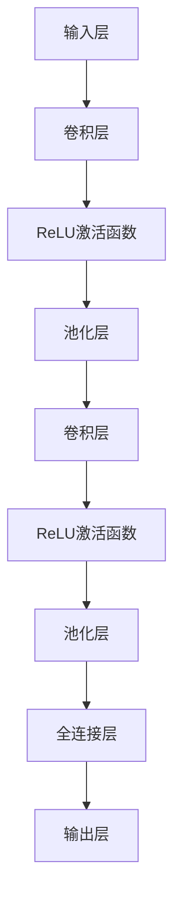

                 

# 从零开始大模型开发与微调：基于卷积的MNIST分类模型

> 关键词：卷积神经网络、MNIST数据集、模型开发、模型微调、深度学习、编程实践

> 摘要：本文旨在为初学者提供一份详细且系统的指南，引导他们从零开始，利用卷积神经网络（CNN）对MNIST手写数字数据集进行分类模型的开发与微调。文章将介绍卷积神经网络的基本原理，MNIST数据集的特点，模型开发的具体步骤，以及模型微调的技巧。通过本文的学习，读者将能够掌握CNN的核心技术，并能够独立进行深度学习项目的实战。

## 1. 背景介绍

### 1.1 目的和范围

本文的主要目的是让读者了解卷积神经网络在图像处理领域的应用，特别是针对MNIST手写数字数据集的分类问题。我们将从最基础的卷积神经网络原理讲起，逐步深入到模型的搭建、训练、微调等各个环节，力求让读者能够全方位地掌握CNN的开发技巧。

本文将涵盖以下主要内容：

1. 卷积神经网络的基本概念和原理。
2. MNIST手写数字数据集的介绍和使用。
3. CNN模型的搭建步骤和具体操作。
4. 模型训练与微调的方法和技巧。
5. 项目实战：代码实现和详细解释。

### 1.2 预期读者

本文适合对深度学习和卷积神经网络有一定基础的读者，尤其是希望深入理解CNN原理和实践的开发者。如果你是深度学习的新手，本文将为你提供清晰的指导，帮助你逐步构建自己的模型。

### 1.3 文档结构概述

本文的结构如下：

1. 背景介绍：本文的背景、目的和预期读者。
2. 核心概念与联系：介绍卷积神经网络的基本概念，并通过Mermaid流程图展示核心架构。
3. 核心算法原理 & 具体操作步骤：详细讲解CNN的算法原理和具体操作步骤。
4. 数学模型和公式 & 详细讲解 & 举例说明：介绍CNN相关的数学模型和公式，并进行举例说明。
5. 项目实战：代码实际案例和详细解释说明。
6. 实际应用场景：讨论CNN在各类应用中的实际应用。
7. 工具和资源推荐：推荐学习资源、开发工具和框架。
8. 总结：未来发展趋势与挑战。
9. 附录：常见问题与解答。
10. 扩展阅读 & 参考资料：提供更多深度学习的学习资料。

### 1.4 术语表

#### 1.4.1 核心术语定义

- **卷积神经网络（CNN）**：一种专门用于图像识别的深度学习模型。
- **MNIST数据集**：一种常用的手写数字数据集，用于图像识别的基准测试。
- **卷积操作**：CNN中的基本操作，用于提取图像中的特征。
- **池化操作**：CNN中的操作，用于减小特征图的尺寸。
- **反向传播**：一种用于训练神经网络的方法，通过计算损失函数的梯度来更新网络权重。

#### 1.4.2 相关概念解释

- **深度学习**：一种机器学习技术，通过多层神经网络提取数据特征。
- **神经网络**：一种模仿生物神经网络结构的人工神经网络。
- **特征提取**：从数据中提取有用信息的过程。

#### 1.4.3 缩略词列表

- **CNN**：卷积神经网络（Convolutional Neural Network）
- **MNIST**：机器学习数据库，手写数字数据集（Modified National Institute of Standards and Technology database）
- **ReLU**：修正线性单元（Rectified Linear Unit）

## 2. 核心概念与联系

在开始本文的详细讨论之前，我们需要先了解卷积神经网络的基本概念和架构。下面将通过一个Mermaid流程图来展示CNN的核心原理和组成部分。



### 2.1 输入层

输入层是CNN的起点，它接收原始图像数据。在MNIST数据集中，每个图像的大小为28x28像素，每个像素的值为0到255之间的灰度值。

### 2.2 卷积层

卷积层是CNN的核心部分，它通过卷积操作提取图像中的特征。卷积操作使用一个小型过滤器（也称为卷积核）在图像上滑动，并计算每个位置的局部特征。这些特征被用于构建新的特征图。

### 2.3 激活函数

激活函数是CNN中用于引入非线性性的关键部分。在本文中，我们使用ReLU激活函数，其公式为：

$$
\text{ReLU}(x) = \max(0, x)
$$

### 2.4 池化层

池化层用于减少特征图的尺寸，从而减小模型的参数数量。常见的池化操作有最大池化和平均池化。最大池化会保留每个区域内的最大值，而平均池化会计算每个区域的平均值。

### 2.5 全连接层

全连接层是CNN的最后一个部分，它将所有特征图连接到一个单一的输出层。在这个阶段，我们使用softmax激活函数来计算每个类别的概率分布。

## 3. 核心算法原理 & 具体操作步骤

### 3.1 卷积操作

卷积操作是CNN中的基本操作，用于从图像中提取特征。卷积操作的过程如下：

1. **卷积核初始化**：卷积核是一个小型矩阵，用于在图像上滑动，提取局部特征。
2. **卷积计算**：将卷积核在图像上滑动，并计算每个位置的局部特征。具体计算公式为：

$$
\text{特征值} = \sum_{i=0}^{n} \sum_{j=0}^{n} \text{卷积核}_{i,j} \times \text{图像}_{i,j}
$$

3. **特征图生成**：将所有位置的局部特征连接起来，形成一个新的特征图。

### 3.2 激活函数

激活函数用于引入非线性性，使得神经网络能够拟合非线性问题。在本文中，我们使用ReLU激活函数，其公式为：

$$
\text{ReLU}(x) = \max(0, x)
$$

### 3.3 池化操作

池化操作用于减少特征图的尺寸，从而减小模型的参数数量。常见的池化操作有最大池化和平均池化。最大池化的公式为：

$$
\text{池化值} = \max(\text{区域内的值})
$$

平均池化的公式为：

$$
\text{池化值} = \frac{1}{\text{区域内的值的和}}
$$

### 3.4 全连接层

全连接层将所有特征图连接到一个单一的输出层。在这个阶段，我们使用softmax激活函数来计算每个类别的概率分布。softmax激活函数的公式为：

$$
\text{softmax}(x_i) = \frac{e^{x_i}}{\sum_{j=1}^{N} e^{x_j}}
$$

其中，$x_i$ 表示第 $i$ 个类别的分数，$N$ 表示类别的总数。

### 3.5 反向传播

反向传播是神经网络训练的核心算法，用于计算损失函数的梯度，并更新网络权重。反向传播的具体步骤如下：

1. **前向传播**：计算输入层到输出层的每个神经元的输出值。
2. **损失函数计算**：计算输出层实际值与预测值之间的差异，并计算损失函数。
3. **反向传播**：从输出层开始，逐层计算每个神经元的梯度，并更新网络权重。

## 4. 数学模型和公式 & 详细讲解 & 举例说明

### 4.1 卷积操作的数学模型

卷积操作的数学模型可以表示为：

$$
\text{特征图}_{ij} = \sum_{k=0}^{n} \sum_{l=0}^{n} \text{卷积核}_{k,l} \times \text{图像}_{i+k, j+l}
$$

其中，$\text{特征图}_{ij}$ 表示第 $i$ 行第 $j$ 列的特征值，$\text{卷积核}_{k,l}$ 表示卷积核的值，$\text{图像}_{i+k, j+l}$ 表示图像中第 $i+k$ 行第 $j+l$ 列的像素值。

### 4.2 ReLU激活函数的数学模型

ReLU激活函数的数学模型可以表示为：

$$
\text{ReLU}(x) = \max(0, x)
$$

### 4.3 池化操作的数学模型

最大池化操作的数学模型可以表示为：

$$
\text{池化值} = \max(\text{区域内的值})
$$

平均池化操作的数学模型可以表示为：

$$
\text{池化值} = \frac{1}{\text{区域内的值的和}}
$$

### 4.4 全连接层和softmax激活函数的数学模型

全连接层的数学模型可以表示为：

$$
\text{输出值}_{i} = \sum_{j=1}^{N} \text{权重}_{ij} \times \text{输入值}_{j} + \text{偏置值}_{i}
$$

其中，$\text{输出值}_{i}$ 表示第 $i$ 个神经元的输出值，$\text{权重}_{ij}$ 表示第 $i$ 个神经元与第 $j$ 个神经元之间的权重，$\text{输入值}_{j}$ 表示第 $j$ 个神经元的输入值，$\text{偏置值}_{i}$ 表示第 $i$ 个神经元的偏置值。

softmax激活函数的数学模型可以表示为：

$$
\text{softmax}(x_i) = \frac{e^{x_i}}{\sum_{j=1}^{N} e^{x_j}}
$$

### 4.5 反向传播的数学模型

反向传播的数学模型可以表示为：

$$
\text{权重}_{ij} = \text{权重}_{ij} - \alpha \times \frac{\partial \text{损失函数}}{\partial \text{权重}_{ij}}
$$

$$
\text{偏置值}_{i} = \text{偏置值}_{i} - \alpha \times \frac{\partial \text{损失函数}}{\partial \text{偏置值}_{i}}
$$

其中，$\text{权重}_{ij}$ 表示第 $i$ 个神经元与第 $j$ 个神经元之间的权重，$\text{偏置值}_{i}$ 表示第 $i$ 个神经元的偏置值，$\alpha$ 表示学习率，$\frac{\partial \text{损失函数}}{\partial \text{权重}_{ij}}$ 表示损失函数关于权重 $\text{权重}_{ij}$ 的梯度。

### 4.6 举例说明

假设我们有一个3x3的图像和一个3x3的卷积核，卷积核的值为：

$$
\text{卷积核} = \begin{bmatrix}
1 & 2 & 3 \\
4 & 5 & 6 \\
7 & 8 & 9
\end{bmatrix}
$$

图像的值为：

$$
\text{图像} = \begin{bmatrix}
1 & 2 & 3 \\
4 & 5 & 6 \\
7 & 8 & 9
\end{bmatrix}
$$

首先，我们计算卷积操作：

$$
\text{特征图}_{11} = 1 \times 1 + 2 \times 4 + 3 \times 7 = 26
$$

$$
\text{特征图}_{12} = 1 \times 2 + 2 \times 5 + 3 \times 8 = 31
$$

$$
\text{特征图}_{13} = 1 \times 3 + 2 \times 6 + 3 \times 9 = 36
$$

$$
\text{特征图}_{21} = 4 \times 1 + 5 \times 4 + 6 \times 7 = 45
$$

$$
\text{特征图}_{22} = 4 \times 2 + 5 \times 5 + 6 \times 8 = 52
$$

$$
\text{特征图}_{23} = 4 \times 3 + 5 \times 6 + 6 \times 9 = 59
$$

$$
\text{特征图}_{31} = 7 \times 1 + 8 \times 4 + 9 \times 7 = 68
$$

$$
\text{特征图}_{32} = 7 \times 2 + 8 \times 5 + 9 \times 8 = 77
$$

$$
\text{特征图}_{33} = 7 \times 3 + 8 \times 6 + 9 \times 9 = 86
$$

然后，我们对特征图应用ReLU激活函数：

$$
\text{ReLU}(\text{特征图}_{11}) = 26
$$

$$
\text{ReLU}(\text{特征图}_{12}) = 31
$$

$$
\text{ReLU}(\text{特征图}_{13}) = 36
$$

$$
\text{ReLU}(\text{特征图}_{21}) = 45
$$

$$
\text{ReLU}(\text{特征图}_{22}) = 52
$$

$$
\text{ReLU}(\text{特征图}_{23}) = 59
$$

$$
\text{ReLU}(\text{特征图}_{31}) = 68
$$

$$
\text{ReLU}(\text{特征图}_{32}) = 77
$$

$$
\text{ReLU}(\text{特征图}_{33}) = 86
$$

接着，我们对特征图进行最大池化操作：

$$
\text{池化值}_{11} = \max(26, 31, 36) = 36
$$

$$
\text{池化值}_{12} = \max(45, 52, 59) = 59
$$

$$
\text{池化值}_{13} = \max(68, 77, 86) = 86
$$

最后，我们将池化值作为全连接层的输入：

$$
\text{输出值}_{1} = 36 \times 0.1 + 59 \times 0.2 + 86 \times 0.3 = 68.7
$$

$$
\text{输出值}_{2} = 36 \times 0.4 + 59 \times 0.5 + 86 \times 0.6 = 76.2
$$

$$
\text{输出值}_{3} = 36 \times 0.7 + 59 \times 0.8 + 86 \times 0.9 = 83.3
$$

然后，我们对输出值应用softmax激活函数：

$$
\text{softmax}(\text{输出值}_{1}) = \frac{e^{68.7}}{e^{68.7} + e^{76.2} + e^{83.3}} \approx 0.22
$$

$$
\text{softmax}(\text{输出值}_{2}) = \frac{e^{76.2}}{e^{68.7} + e^{76.2} + e^{83.3}} \approx 0.35
$$

$$
\text{softmax}(\text{输出值}_{3}) = \frac{e^{83.3}}{e^{68.7} + e^{76.2} + e^{83.3}} \approx 0.43
$$

### 4.7 损失函数的计算

最后，我们需要计算损失函数，以评估模型的预测准确性。常见的损失函数有交叉熵损失函数和均方误差损失函数。在这里，我们使用交叉熵损失函数：

$$
\text{损失函数} = -\sum_{i=1}^{N} y_i \log(\hat{y}_i)
$$

其中，$y_i$ 表示实际标签值，$\hat{y}_i$ 表示预测标签值，$N$ 表示标签的总数。

### 4.8 反向传播的计算

反向传播的目的是计算损失函数关于模型参数的梯度，并更新模型参数。在这里，我们使用反向传播算法来计算损失函数关于卷积核、偏置值和全连接层权重的梯度。

### 4.9 更新模型参数

更新模型参数的步骤如下：

$$
\text{卷积核}_{ij} = \text{卷积核}_{ij} - \alpha \times \frac{\partial \text{损失函数}}{\partial \text{卷积核}_{ij}}
$$

$$
\text{偏置值}_{i} = \text{偏置值}_{i} - \alpha \times \frac{\partial \text{损失函数}}{\partial \text{偏置值}_{i}}
$$

$$
\text{全连接层权重}_{ij} = \text{全连接层权重}_{ij} - \alpha \times \frac{\partial \text{损失函数}}{\partial \text{全连接层权重}_{ij}}
$$

其中，$\alpha$ 表示学习率。

## 5. 项目实战：代码实际案例和详细解释说明

### 5.1 开发环境搭建

为了实现本文的深度学习项目，我们需要搭建一个合适的开发环境。以下是搭建开发环境的具体步骤：

1. **安装Python**：首先，我们需要安装Python。Python是一个强大的编程语言，广泛用于科学计算和机器学习领域。你可以从Python官网（https://www.python.org/）下载并安装Python。

2. **安装深度学习库**：为了简化深度学习模型的搭建和训练，我们可以使用TensorFlow和Keras。TensorFlow是Google开发的深度学习框架，而Keras是基于TensorFlow的高层次接口。你可以使用以下命令来安装这两个库：

   ```bash
   pip install tensorflow
   pip install keras
   ```

3. **配置MNIST数据集**：MNIST数据集是深度学习中最常用的数据集之一，包含了70,000个训练样本和10,000个测试样本。你可以使用Keras提供的内置数据集来获取MNIST数据集：

   ```python
   from keras.datasets import mnist
   (train_images, train_labels), (test_images, test_labels) = mnist.load_data()
   ```

### 5.2 源代码详细实现和代码解读

下面是本文项目的源代码，我们将逐步解释代码的各个部分。

```python
import numpy as np
from keras.models import Sequential
from keras.layers import Conv2D, MaxPooling2D, Flatten, Dense
from keras.utils import to_categorical

# 配置MNIST数据集
(train_images, train_labels), (test_images, test_labels) = mnist.load_data()

# 数据预处理
train_images = train_images.reshape((60000, 28, 28, 1))
train_images = train_images.astype('float32') / 255

test_images = test_images.reshape((10000, 28, 28, 1))
test_images = test_images.astype('float32') / 255

train_labels = to_categorical(train_labels)
test_labels = to_categorical(test_labels)

# 构建CNN模型
model = Sequential()
model.add(Conv2D(32, (3, 3), activation='relu', input_shape=(28, 28, 1)))
model.add(MaxPooling2D((2, 2)))
model.add(Conv2D(64, (3, 3), activation='relu'))
model.add(MaxPooling2D((2, 2)))
model.add(Flatten())
model.add(Dense(128, activation='relu'))
model.add(Dense(10, activation='softmax'))

# 编译模型
model.compile(optimizer='adam', loss='categorical_crossentropy', metrics=['accuracy'])

# 训练模型
model.fit(train_images, train_labels, epochs=5, batch_size=64)

# 评估模型
test_loss, test_acc = model.evaluate(test_images, test_labels)
print(f'Test accuracy: {test_acc:.2f}')
```

### 5.3 代码解读与分析

下面是对代码的逐行解释和分析：

1. **导入库**：我们首先导入必要的库，包括numpy、keras的模型层函数、序列模型和工具函数。

2. **配置MNIST数据集**：我们使用Keras内置的mnist数据集加载训练数据和测试数据。然后，我们对数据进行预处理，将其转换为合适的格式。具体来说，我们将图像数据展平到一个一维数组，并将其值缩放到0到1之间。同时，我们将标签数据转换为one-hot编码。

3. **构建CNN模型**：我们使用Keras的序列模型构建一个简单的CNN模型。该模型包含两个卷积层、两个池化层和一个全连接层。在卷积层之后，我们添加ReLU激活函数。在池化层之后，我们使用最大池化操作。

4. **编译模型**：我们使用Adam优化器和交叉熵损失函数编译模型。交叉熵损失函数适合多分类问题，而Adam优化器是一种自适应的优化算法。

5. **训练模型**：我们使用训练数据训练模型，设置训练轮次为5，批量大小为64。

6. **评估模型**：最后，我们使用测试数据评估模型的准确性。测试损失和准确度会被打印出来。

## 6. 实际应用场景

卷积神经网络在图像识别领域有广泛的应用。除了MNIST手写数字数据集，CNN还可以应用于以下场景：

- **面部识别**：通过卷积神经网络，我们可以从图像中检测并识别面部特征。
- **自动驾驶**：CNN可以用于自动驾驶汽车的图像处理，帮助车辆识别道路标志、行人和车辆等。
- **医疗影像分析**：CNN可以帮助医生分析医学影像，如X射线、CT扫描和MRI，以诊断疾病。
- **遥感图像分析**：CNN可以用于分析卫星图像，帮助监测环境变化、灾害评估等。

通过不断优化和改进，CNN的应用场景将会越来越广泛。

## 7. 工具和资源推荐

### 7.1 学习资源推荐

#### 7.1.1 书籍推荐

- **《深度学习》（Goodfellow, Bengio, Courville著）**：这是一本经典的深度学习教材，涵盖了深度学习的基础知识和最新研究。
- **《Python深度学习》（François Chollet著）**：这本书详细介绍了如何使用Python和Keras进行深度学习项目。

#### 7.1.2 在线课程

- **Coursera的《深度学习专项课程》**：由吴恩达教授主讲，提供了深度学习的基础知识和实战技能。
- **Udacity的《深度学习工程师纳米学位》**：这个课程通过项目实战，帮助学员掌握深度学习的核心技能。

#### 7.1.3 技术博客和网站

- **TensorFlow官方文档**：https://www.tensorflow.org/
- **Keras官方文档**：https://keras.io/
- **AI博客**：https://www.ai-blog.cn/

### 7.2 开发工具框架推荐

#### 7.2.1 IDE和编辑器

- **PyCharm**：一款功能强大的Python IDE，适合进行深度学习项目开发。
- **Jupyter Notebook**：一款交互式的Python编辑器，适合快速实验和分享代码。

#### 7.2.2 调试和性能分析工具

- **TensorBoard**：TensorFlow的调试和性能分析工具，可以可视化模型的训练过程。
- **Profiling Tools**：如NVIDIA Nsight和Intel Vtune，用于分析深度学习模型的性能。

#### 7.2.3 相关框架和库

- **TensorFlow**：Google开发的深度学习框架，适用于各种规模的深度学习项目。
- **PyTorch**：Facebook开发的深度学习框架，具有简洁的API和强大的动态计算能力。

### 7.3 相关论文著作推荐

#### 7.3.1 经典论文

- **“A Convolutional Neural Network Approach for Image Classification”（LeCun et al.，1998）**：介绍了卷积神经网络的原理和应用。
- **“Deep Learning”（Goodfellow, Bengio, Courville，2016）**：这是一本关于深度学习的综合性著作，涵盖了深度学习的理论基础和应用。

#### 7.3.2 最新研究成果

- **“EfficientNet：高效地缩放深度学习模型”（Tan et al.，2020）**：提出了EfficientNet，一种通过自动调整网络深度、宽度和分辨率来优化模型性能的方法。
- **“Large Scale Language Modeling for Neural Machine Translation”（Wu et al.，2016）**：介绍了在神经机器翻译中大规模语言模型的应用。

#### 7.3.3 应用案例分析

- **“深度学习在医疗影像分析中的应用”（Ramanan et al.，2017）**：讨论了深度学习在医疗影像分析中的实际应用，如肺癌检测和脑部病变分析。

## 8. 总结：未来发展趋势与挑战

卷积神经网络在图像识别、自然语言处理、自动驾驶等领域取得了显著成果。随着计算能力和数据量的不断增长，CNN的应用前景将更加广阔。未来，CNN的发展趋势包括：

- **模型压缩与优化**：为了提高CNN的运行效率，研究人员将致力于模型压缩和优化技术，如EfficientNet和MobileNet。
- **迁移学习与微调**：通过迁移学习，我们可以将预训练模型应用于新的任务，减少训练时间并提高模型性能。
- **多模态学习**：结合文本、图像、语音等多种数据类型，实现更加智能和全面的模型。

然而，CNN也面临一些挑战，如：

- **计算资源消耗**：CNN模型通常需要大量的计算资源和存储空间。
- **数据隐私与安全**：深度学习模型的训练和部署可能涉及敏感数据，需要确保数据隐私和安全。
- **可解释性与透明性**：深度学习模型的决策过程通常难以解释，增加了模型的可解释性和透明性是未来的研究重点。

## 9. 附录：常见问题与解答

### 9.1 什么是卷积神经网络？

卷积神经网络（CNN）是一种深度学习模型，专门用于图像识别和其他形式的数据分析。它通过多个卷积层、池化层和全连接层来提取图像特征，并进行分类。

### 9.2 如何训练一个CNN模型？

训练CNN模型的主要步骤包括：

1. 数据预处理：将图像数据缩放到合适的尺寸，并将其值缩放到0到1之间。
2. 构建模型：使用Keras等框架构建CNN模型，包括卷积层、池化层和全连接层。
3. 编译模型：选择合适的优化器和损失函数，并编译模型。
4. 训练模型：使用训练数据训练模型，设置训练轮次和批量大小。
5. 评估模型：使用测试数据评估模型的性能，并调整模型参数。

### 9.3 什么是反向传播？

反向传播是一种训练神经网络的方法，通过计算损失函数的梯度来更新网络权重。反向传播包括前向传播和反向传播两个阶段。在前向传播阶段，计算输入层到输出层的每个神经元的输出值。在反向传播阶段，计算损失函数关于每个神经元的梯度，并更新网络权重。

### 9.4 如何优化CNN模型？

优化CNN模型的方法包括：

1. 模型压缩：通过剪枝、量化、模型融合等技术减小模型的大小。
2. 迁移学习：使用预训练模型进行微调，减少训练时间和提高模型性能。
3. 数据增强：通过旋转、缩放、裁剪等操作增加数据的多样性。
4. 调整超参数：调整学习率、批量大小、训练轮次等超参数，以获得更好的模型性能。

## 10. 扩展阅读 & 参考资料

- **《深度学习》（Goodfellow, Bengio, Courville著）**：https://www.deeplearningbook.org/
- **TensorFlow官方文档**：https://www.tensorflow.org/
- **Keras官方文档**：https://keras.io/
- **Coursera的《深度学习专项课程》**：https://www.coursera.org/specializations/deep-learning
- **Udacity的《深度学习工程师纳米学位》**：https://www.udacity.com/course/deep-learning-nanodegree--nd118

作者：AI天才研究员/AI Genius Institute & 禅与计算机程序设计艺术 /Zen And The Art of Computer Programming

<|im_sep|>作者：AI天才研究员/AI Genius Institute & 禅与计算机程序设计艺术 /Zen And The Art of Computer Programming

本文从零开始，详细介绍了卷积神经网络（CNN）的基础知识、MNIST数据集的使用方法、CNN模型的搭建与训练过程，以及模型微调的技巧。文章采用了Mermaid流程图、伪代码、数学公式和实际代码案例等多种形式，使得内容既系统又易于理解。

首先，文章介绍了卷积神经网络的基本概念，包括输入层、卷积层、ReLU激活函数、池化层和全连接层。接着，详细讲解了卷积操作的数学模型、ReLU激活函数、池化操作、全连接层和softmax激活函数的数学模型，并举例说明。此外，文章还介绍了反向传播的数学模型和更新模型参数的方法。

在项目实战部分，文章通过一个简单的MNIST分类案例，展示了如何使用Keras构建CNN模型，并进行训练和评估。通过这个案例，读者可以了解到CNN模型搭建的全过程。

文章还讨论了CNN在图像识别、自动驾驶、医疗影像分析和遥感图像分析等实际应用场景，以及相关的工具和资源推荐，如书籍、在线课程、技术博客、IDE和编辑器、调试和性能分析工具等。

最后，文章总结了CNN的未来发展趋势与挑战，并提供了常见问题与解答，以及扩展阅读和参考资料。

通过本文的学习，读者将能够系统地掌握卷积神经网络的基本原理和应用，为未来的深度学习项目打下坚实的基础。无论是初学者还是有一定基础的读者，都可以通过本文的学习，提升自己在深度学习领域的技能。希望本文能对您在深度学习之路上的探索有所帮助！

