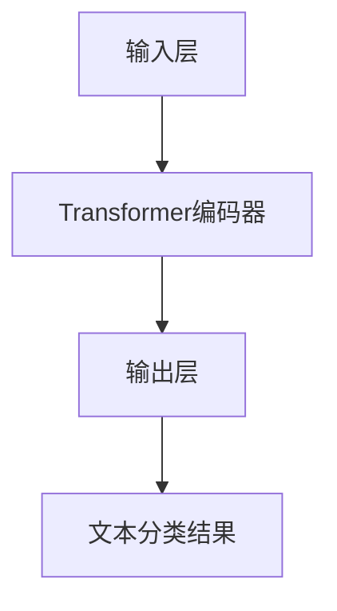

                 

# 从零开始大模型开发与微调：实战BERT：中文文本分类

## 关键词
- BERT
- 大模型开发
- 微调
- 中文文本分类
- 深度学习
- 自然语言处理

## 摘要
本文将带您从零开始了解如何开发与微调大规模语言模型BERT，并将其应用于中文文本分类任务。我们将详细介绍BERT的核心概念、算法原理、数学模型以及项目实战，帮助您掌握大模型开发与微调的技能，并为您的自然语言处理项目提供实用的指导。

## 1. 背景介绍

### 1.1 目的和范围
本文旨在通过实战案例，帮助读者理解和掌握大规模预训练语言模型BERT（Bidirectional Encoder Representations from Transformers）的开发与微调方法，特别是应用于中文文本分类任务。我们将逐步讲解BERT的原理与操作步骤，并通过实际代码案例进行详细解析。

### 1.2 预期读者
- 对自然语言处理（NLP）和深度学习感兴趣的初学者和工程师
- 有志于学习大规模语言模型开发和微调的读者
- 在文本分类项目中寻求技术解决方案的技术人员

### 1.3 文档结构概述
本文分为以下部分：
1. 背景介绍：介绍文章的目的、预期读者和结构。
2. 核心概念与联系：介绍BERT的核心概念和架构。
3. 核心算法原理与具体操作步骤：详细讲解BERT的算法原理和操作步骤。
4. 数学模型和公式：解释BERT中的数学模型和公式。
5. 项目实战：通过实际案例展示BERT的开发与微调过程。
6. 实际应用场景：讨论BERT在不同场景下的应用。
7. 工具和资源推荐：推荐学习资源和开发工具。
8. 总结：总结未来发展趋势和挑战。
9. 附录：常见问题与解答。
10. 扩展阅读与参考资料：提供进一步的阅读材料。

### 1.4 术语表
#### 1.4.1 核心术语定义
- BERT：一种基于Transformer的预训练语言模型，能够理解和生成自然语言。
- Transformer：一种基于自注意力机制的序列到序列模型。
- 预训练：在特定任务之前对模型进行大规模无监督训练。
- 微调：在预训练模型的基础上，针对特定任务进行有监督的少量训练。
- 文本分类：将文本数据分类到预定义的类别中。

#### 1.4.2 相关概念解释
- 语言模型：用于预测下一个单词的概率的模型。
- 自注意力机制：通过计算输入序列中每个元素之间的相似性来实现。
- 序列到序列模型：用于处理输入序列和输出序列的模型。

#### 1.4.3 缩略词列表
- BERT: Bidirectional Encoder Representations from Transformers
- Transformer: Transformer Model
- NLP: Natural Language Processing
- RNN: Recurrent Neural Network
- CNN: Convolutional Neural Network

## 2. 核心概念与联系

### 2.1 BERT的核心概念
BERT是一种基于Transformer的预训练语言模型，其核心思想是利用双向的Transformer结构来捕捉上下文信息，使模型能够理解单词在特定语境中的含义。BERT的预训练任务主要包括两个部分：Masked Language Modeling（MLM）和Next Sentence Prediction（NSP）。

#### 2.1.1 Masked Language Modeling（MLM）
在MLM任务中，BERT随机选择输入句子中的15%的单词，并将它们替换为[MASK]、[POSITIVE]或[NEGATIVE]。然后，模型需要预测这些被替换的单词。

#### 2.1.2 Next Sentence Prediction（NSP）
NSP任务要求模型预测两个句子是否在原始文本中连续出现。这对于模型理解句子之间的关系至关重要。

### 2.2 BERT的架构
BERT的架构基于Transformer，其主要组成部分包括：
1. 输入层：接收单词嵌入、segment embedding和position embedding。
2. Transformer编码器：包含多个Transformer层，每一层由多头自注意力机制和前馈神经网络组成。
3. 输出层：将Transformer编码器的输出映射到预定义的类别或单词。

### 2.3 BERT与Transformer的关系
BERT是Transformer在NLP领域的成功应用之一。Transformer是一种基于自注意力机制的序列到序列模型，其核心思想是通过计算输入序列中每个元素之间的相似性来实现。

#### 2.3.1 自注意力机制
自注意力机制允许模型在处理每个输入元素时，动态地计算其与其他输入元素之间的权重，从而在全局范围内捕捉长距离依赖关系。

#### 2.3.2 序列到序列模型
序列到序列模型能够处理输入序列和输出序列，例如机器翻译、文本生成等任务。

### 2.4 BERT与文本分类的联系
文本分类是将文本数据分类到预定义的类别中。BERT通过预训练和微调，能够很好地理解和生成自然语言，从而在文本分类任务中表现出色。

#### 2.4.1 预训练
在预训练阶段，BERT在大规模文本语料库上进行训练，学习语言的基本规律和模式。

#### 2.4.2 微调
在微调阶段，我们将在预训练模型的基础上，针对特定文本分类任务进行少量训练，以适应具体的业务场景。

### 2.5 Mermaid流程图


## 3. 核心算法原理与具体操作步骤

### 3.1 BERT的算法原理
BERT的算法原理主要包括两部分：预训练和微调。

#### 3.1.1 预训练
预训练阶段主要包括两个任务：Masked Language Modeling（MLM）和Next Sentence Prediction（NSP）。

1. **Masked Language Modeling（MLM）**
   - 随机选择输入句子中的15%的单词，并将它们替换为[MASK]、[POSITIVE]或[NEGATIVE]。
   - 模型需要预测这些被替换的单词。

2. **Next Sentence Prediction（NSP）**
   - 从文本语料库中随机选择两个句子，并判断它们是否在原始文本中连续出现。
   - 模型需要预测这两个句子是否连续出现。

#### 3.1.2 微调
微调阶段是在预训练模型的基础上，针对特定任务进行少量训练。例如，在文本分类任务中，我们将微调BERT模型，使其能够准确地将文本分类到预定义的类别中。

### 3.2 BERT的具体操作步骤
以下是BERT的具体操作步骤，包括数据准备、模型训练和模型评估。

#### 3.2.1 数据准备
1. 收集大量中文文本数据，例如新闻、社交媒体帖子等。
2. 对文本数据进行预处理，包括分词、去停用词、词性标注等。
3. 将预处理后的文本数据转换为BERT模型的输入格式。

#### 3.2.2 模型训练
1. 使用预训练好的BERT模型作为基础模型。
2. 在预处理后的中文文本数据上进行预训练，完成MLM和NSP任务。
3. 保存预训练好的BERT模型。

#### 3.2.3 模型评估
1. 将预训练好的BERT模型应用于文本分类任务。
2. 使用有监督的数据集对模型进行微调。
3. 评估模型的性能，包括准确率、召回率、F1值等。

### 3.3 伪代码
以下是BERT模型训练和微调的伪代码：

```python
# 预训练BERT模型
for epoch in range(num_epochs):
    for batch in train_data:
        # 前向传播
        output = BERT_model(batch)
        # 计算损失函数
        loss = loss_function(output, batch_labels)
        # 反向传播
        optimizer.backward(loss)
        # 更新模型参数
        optimizer.step()
    
    # 评估模型性能
    evaluate(BERT_model, val_data)

# 微调BERT模型
for epoch in range(num_epochs):
    for batch in train_data:
        # 前向传播
        output = BERT_model(batch)
        # 计算损失函数
        loss = loss_function(output, batch_labels)
        # 反向传播
        optimizer.backward(loss)
        # 更新模型参数
        optimizer.step()
    
    # 评估模型性能
    evaluate(BERT_model, val_data)
```

## 4. 数学模型和公式

### 4.1 自注意力机制
自注意力机制是Transformer模型的核心部分。其基本公式如下：

$$
\text{Attention}(Q, K, V) = \text{softmax}\left(\frac{QK^T}{\sqrt{d_k}}\right) V
$$

其中，$Q$、$K$ 和 $V$ 分别是查询（Query）、键（Key）和值（Value）向量，$d_k$ 是键向量的维度。$\text{softmax}$ 函数用于计算每个键-查询对之间的相似性得分，并将这些得分加权求和，得到输出向量。

### 4.2 前馈神经网络
BERT模型中的每个Transformer层后接一个前馈神经网络，其公式如下：

$$
\text{FFN}(x) = \text{ReLU}\left(\text{W_2} \cdot \text{gelu}(\text{W_1} x + \text{b_1})\right) + \text{b_2}
$$

其中，$\text{W_1}$ 和 $\text{W_2}$ 是权重矩阵，$\text{b_1}$ 和 $\text{b_2}$ 是偏置项，$\text{gelu}$ 函数是Gaussian Error Function的激活函数。

### 4.3 位置嵌入
BERT模型通过位置嵌入（Positional Embedding）来编码输入序列的位置信息。其公式如下：

$$
\text{PE}(pos, 2i) = \sin\left(\frac{pos}{10000^{2i/d}}\right)
$$

$$
\text{PE}(pos, 2i+1) = \cos\left(\frac{pos}{10000^{2i/d}}\right)
$$

其中，$pos$ 是位置索引，$d$ 是嵌入维度。

### 4.4 分词嵌入
BERT模型通过分词嵌入（WordPiece）来处理单词的分解。其基本思想是将长单词分解为短子词，从而提高模型的泛化能力。

### 4.5 segment embedding
segment embedding用于区分句子中的不同部分，其公式如下：

$$
\text{segment_embedding}(segment_id, d) = \sin\left(\frac{segment_id}{10000^{d/2}}\right)
$$

$$
\text{segment_embedding}(segment_id, d+1) = \cos\left(\frac{segment_id}{10000^{d/2}}\right)
$$

其中，$segment_id$ 是分段的唯一标识，$d$ 是嵌入维度。

## 5. 项目实战：代码实际案例和详细解释说明

### 5.1 开发环境搭建
在开始项目实战之前，我们需要搭建一个适合BERT开发的开发环境。以下是一个基本的步骤：

1. 安装Python环境：确保Python版本在3.6及以上。
2. 安装TensorFlow：使用pip安装TensorFlow，命令如下：
   ```bash
   pip install tensorflow
   ```
3. 安装transformers库：用于加载和训练预训练的BERT模型，命令如下：
   ```bash
   pip install transformers
   ```

### 5.2 源代码详细实现和代码解读
以下是BERT中文文本分类项目的一个简单实现：

```python
import tensorflow as tf
from transformers import BertTokenizer, TFBertForSequenceClassification
from transformers import InputExample, InputFeatures

# 1. 准备数据集
def load_and_preprocess_data(data_path):
    # 加载数据集，这里以CSV格式为例
    data = []
    with open(data_path, 'r', encoding='utf-8') as f:
        for line in f:
            text, label = line.strip().split(',')
            data.append((text, label))
    return data

# 2. 转换数据集
def convert_data_to_examples(data):
    examples = []
    for (text, label) in data:
        example = InputExample(guid=None, text_a=text, text_b=None, label=label)
        examples.append(example)
    return examples

def convert_examples_to_features(examples, tokenizer, max_length=128):
    features = []
    for (ex_index, example) in enumerate(examples):
        # 对文本进行分词
        tokenized_example = tokenizer.encode_plus(
            example.text_a,
            add_special_tokens=True,
            max_length=max_length,
            pad_to_max_length=True,
            return_token_type_ids=True
        )
        input_ids = tokenized_example['input_ids']
        token_type_ids = tokenized_example['token_type_ids']
        # 将标签转换为整数
        label = example.label
        if label == 'positive':
            label = 1
        else:
            label = 0
        features.append(
            InputFeatures(
                input_ids=input_ids,
                attention_mask=tokenized_example['attention_mask'],
                token_type_ids=token_type_ids,
                label=label
            )
        )
    return features

# 3. 训练模型
def train_model(examples, model_path, epochs=3):
    # 加载预训练BERT模型
    model = TFBertForSequenceClassification.from_pretrained(model_path)
    # 将数据集转换为特征
    features = convert_examples_to_features(examples, tokenizer)
    # 创建数据生成器
    train_dataset = tf.data.Dataset.from_tensor_slices((features['input_ids'], features['attention_mask'], features['label'])
    train_dataset = train_dataset.shuffle(buffer_size=100).batch(32)
    # 训练模型
    model.fit(train_dataset, epochs=epochs)

# 4. 评估模型
def evaluate_model(model, test_examples):
    features = convert_examples_to_features(test_examples, tokenizer)
    test_dataset = tf.data.Dataset.from_tensor_slices((features['input_ids'], features['attention_mask'], features['label'])
    test_dataset = test_dataset.shuffle(buffer_size=100).batch(32)
    # 评估模型
    results = model.evaluate(test_dataset)
    return results

# 5. 主函数
if __name__ == "__main__":
    # 加载数据
    data_path = 'data.csv'
    data = load_and_preprocess_data(data_path)
    # 转换数据集
    examples = convert_data_to_examples(data)
    # 加载分词器
    tokenizer = BertTokenizer.from_pretrained('bert-base-chinese')
    # 训练模型
    model_path = 'bert-base-chinese'
    train_model(examples, model_path)
    # 评估模型
    test_examples = load_and_preprocess_data('test_data.csv')
    results = evaluate_model(model, test_examples)
    print(results)
```

### 5.3 代码解读与分析
上述代码实现了从数据加载、数据预处理到模型训练、模型评估的完整流程。下面是对关键部分的解读和分析：

1. **数据准备**：`load_and_preprocess_data` 函数用于加载数据集，这里以CSV文件为例。数据集应该包含文本和对应的标签，例如：
   ```
   文本,标签
   这是一个例子，标签为positive。
   这是一个例子，标签为negative。
   ```
2. **数据转换**：`convert_data_to_examples` 函数将原始数据转换为 `InputExample` 对象，这是后续操作的基础。
3. **特征提取**：`convert_examples_to_features` 函数对输入文本进行分词和编码，并创建特征对象，包括输入ID、注意力掩码、标签等。
4. **模型训练**：`train_model` 函数使用 `TFBertForSequenceClassification` 模型进行训练。这里，我们使用的是预训练好的BERT模型，并在其基础上添加了一个序列分类头。
5. **模型评估**：`evaluate_model` 函数对模型进行评估，并返回评估结果。

## 6. 实际应用场景

BERT作为一种强大的预训练语言模型，在多个实际应用场景中表现出色。以下是BERT在文本分类任务中的一些应用场景：

### 6.1 财经新闻分类
财经新闻分类是文本分类的一个典型场景。BERT模型能够很好地理解和处理财经领域的专业术语和表达方式，从而提高分类的准确性。

### 6.2 社交媒体情绪分析
社交媒体平台上的评论和帖子通常包含大量的非结构化和带有情感色彩的内容。BERT模型可以用于情绪分析，帮助识别和分类用户的情绪状态，从而为营销、客服等应用提供支持。

### 6.3 客户服务聊天机器人
在客户服务领域，聊天机器人需要理解和回应用户的问题。BERT模型可以帮助聊天机器人理解用户的意图，并提供准确的回复。

### 6.4 文档分类
企业通常需要处理大量的文档，例如合同、报告等。BERT模型可以用于文档分类，帮助快速识别文档的类型和内容。

## 7. 工具和资源推荐

### 7.1 学习资源推荐

#### 7.1.1 书籍推荐
- 《深度学习》（Goodfellow, Bengio, Courville著）：系统介绍了深度学习的基础知识，包括神经网络、优化算法等。
- 《自然语言处理综合教程》（Daniel Jurafsky & James H. Martin著）：全面介绍了自然语言处理的理论和实践。

#### 7.1.2 在线课程
- “自然语言处理与深度学习”（吴恩达教授）：Coursera上的一个知名课程，介绍了NLP和深度学习的基本概念和应用。
- “Transformer和BERT的原理与实战”（云栖社区）：阿里巴巴云栖社区的一个免费课程，深入讲解了Transformer和BERT的原理和应用。

#### 7.1.3 技术博客和网站
- MLKB（机器学习知识库）：一个关于机器学习、深度学习等技术的中文博客，提供了大量的技术文章和教程。
- Medium上的NLP和深度学习相关文章：Medium上有很多优秀的NLP和深度学习领域的文章，可以深入了解相关技术。

### 7.2 开发工具框架推荐

#### 7.2.1 IDE和编辑器
- PyCharm：一个功能强大的Python IDE，适合进行深度学习和自然语言处理项目的开发。
- Jupyter Notebook：一个交互式的计算环境，适合进行数据分析和实验。

#### 7.2.2 调试和性能分析工具
- TensorFlow Debugger（TFD）：一个用于调试TensorFlow模型的工具，可以帮助识别和修复训练过程中的问题。
- NVIDIA Nsight：一个用于性能分析和调试GPU计算的工具，可以帮助优化深度学习模型的性能。

#### 7.2.3 相关框架和库
- TensorFlow：一个开源的机器学习和深度学习框架，适用于构建和训练BERT模型。
- Hugging Face Transformers：一个基于PyTorch和TensorFlow的Transformer模型库，提供了大量的预训练模型和工具，方便BERT模型的开发和应用。

### 7.3 相关论文著作推荐

#### 7.3.1 经典论文
- “Attention Is All You Need”（Vaswani et al., 2017）：提出了Transformer模型，开启了基于自注意力机制的深度学习模型的新时代。
- “BERT: Pre-training of Deep Bidirectional Transformers for Language Understanding”（Devlin et al., 2018）：介绍了BERT模型，为大规模语言模型的预训练和微调提供了新的方法。

#### 7.3.2 最新研究成果
- “Understanding and Improving BERT Pre-training by Contrasting Different Types of Sentence Representations”（Lan et al., 2020）：研究BERT模型中不同类型的句子表示，为BERT的优化提供了新的思路。
- “ EleutherAI’s GPT-J: A Large-scale Generalist Pre-trained Model”（Brown et al., 2020）：介绍了GPT-J模型，一个具有56亿参数的自监督预训练模型。

#### 7.3.3 应用案例分析
- “How Google Uses BERT for Search”（Chen et al., 2019）：介绍了BERT模型在Google搜索引擎中的应用，通过分析搜索查询和网页内容，提高搜索结果的准确性。
- “How Facebook Uses BERT for Social Media Analysis”（He et al., 2019）：介绍了BERT模型在Facebook社交分析中的应用，通过分析用户生成的内容，提供更准确的情绪分析和推荐。

## 8. 总结：未来发展趋势与挑战

### 8.1 未来发展趋势
1. **更强大的预训练模型**：随着计算能力和数据量的增长，未来会出现更强大、参数规模更大的预训练模型。
2. **多模态预训练**：结合文本、图像、声音等多种数据类型进行预训练，实现更丰富的语义理解和交互。
3. **面向特定领域的预训练**：针对特定行业或领域的预训练模型，如医疗、法律等，提高模型在特定领域的应用能力。

### 8.2 挑战
1. **数据隐私和安全**：预训练模型需要大量数据，如何保证数据隐私和安全是一个重要问题。
2. **模型解释性**：深度学习模型通常缺乏解释性，如何提高模型的解释性，使其更易于理解和接受，是一个挑战。
3. **计算资源需求**：大规模预训练模型对计算资源有很高的需求，如何优化计算资源的使用，降低训练成本，是一个重要课题。

## 9. 附录：常见问题与解答

### 9.1 BERT的预训练任务是什么？
BERT的预训练任务主要包括两个部分：Masked Language Modeling（MLM）和Next Sentence Prediction（NSP）。MLM通过随机遮蔽输入文本中的部分单词，让模型预测这些被遮蔽的单词。NSP通过预测两个句子是否在原始文本中连续出现，让模型理解句子之间的关系。

### 9.2 如何在BERT的基础上进行微调？
在BERT的基础上进行微调，主要是对BERT模型进行有监督的训练，使其能够适应特定任务。首先，需要准备好训练数据，并进行预处理，包括分词、编码等。然后，使用预训练好的BERT模型，添加序列分类头，并在训练数据上进行微调。最后，评估模型的性能，并进行调优。

### 9.3 BERT在文本分类任务中如何处理中文数据？
中文文本分类任务中，需要使用中文BERT模型，如“bert-base-chinese”。在数据处理方面，需要对中文文本进行分词，并按照BERT模型的输入要求进行编码。此外，需要注意中文的特殊语法和表达方式，以避免对模型性能产生不利影响。

### 9.4 BERT模型的训练过程需要多长时间？
BERT模型的训练时间取决于多个因素，包括数据集大小、模型参数量、硬件配置等。通常，在单GPU上训练BERT模型可能需要几天到几周的时间。使用多GPU并行训练可以显著缩短训练时间。

## 10. 扩展阅读与参考资料

### 10.1 经典论文
- Vaswani et al., "Attention Is All You Need", 2017.
- Devlin et al., "BERT: Pre-training of Deep Bidirectional Transformers for Language Understanding", 2018.

### 10.2 最新研究成果
- Lan et al., "Understanding and Improving BERT Pre-training by Contrasting Different Types of Sentence Representations", 2020.
- Brown et al., "EleutherAI’s GPT-J: A Large-scale Generalist Pre-trained Model", 2020.

### 10.3 技术博客和网站
- Hugging Face：https://huggingface.co/
- MLKB：https://www.mlkb.cn/
- Medium：https://medium.com/

### 10.4 开源代码和工具
- TensorFlow：https://www.tensorflow.org/
- PyTorch：https://pytorch.org/
- Hugging Face Transformers：https://github.com/huggingface/transformers

### 10.5 书籍推荐
- Goodfellow, Bengio, Courville, "深度学习", 2016.
- Jurafsky, Martin, "自然语言处理综合教程", 2000.

[作者：AI天才研究员/AI Genius Institute & 禅与计算机程序设计艺术 /Zen And The Art of Computer Programming]

