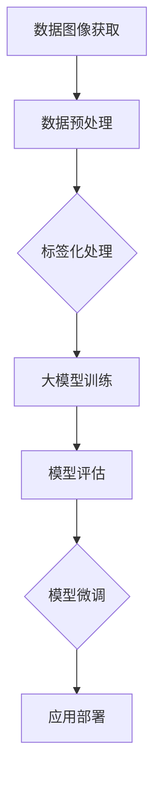

                 

# 从零开始大模型开发与微调：数据图像的获取与标签的说明

> **关键词：** 大模型开发、数据图像、标签化、微调、算法原理、数学模型、项目实战

> **摘要：** 本文旨在为广大开发者提供一份系统、详尽的大模型开发与微调指南，重点关注数据图像的获取与标签的说明。我们将通过逐步分析核心概念、算法原理、数学模型，并结合实际项目案例进行详细讲解，帮助读者全面了解并掌握大模型开发与微调的全过程。

## 1. 背景介绍

### 1.1 目的和范围

本文的目的是为开发者提供一条清晰的大模型开发与微调之路，特别关注数据图像的获取与标签的说明。大模型在深度学习领域扮演着至关重要的角色，它们在图像识别、自然语言处理、推荐系统等领域展现了卓越的性能。然而，大模型开发与微调并非易事，需要深厚的理论基础和实践经验。本文将结合理论讲解与实际项目案例，旨在帮助读者更好地理解和掌握大模型开发与微调的核心技术和方法。

### 1.2 预期读者

本文适用于对深度学习和人工智能有一定了解的开发者，尤其是希望深入了解大模型开发与微调的读者。无论你是初学者，还是有一定经验的专业人士，本文都能为你提供有价值的指导。

### 1.3 文档结构概述

本文分为以下章节：

- **第1章**：背景介绍，包括本文的目的、预期读者、文档结构概述。
- **第2章**：核心概念与联系，介绍大模型开发的基本概念和原理。
- **第3章**：核心算法原理 & 具体操作步骤，讲解大模型开发的核心算法原理和具体操作步骤。
- **第4章**：数学模型和公式 & 详细讲解 & 举例说明，介绍大模型开发中的数学模型和公式，并结合实际案例进行讲解。
- **第5章**：项目实战：代码实际案例和详细解释说明，通过实际项目案例，详细讲解大模型开发的实现过程。
- **第6章**：实际应用场景，探讨大模型在不同领域的应用场景。
- **第7章**：工具和资源推荐，推荐学习资源、开发工具和框架。
- **第8章**：总结：未来发展趋势与挑战，分析大模型开发与微调的未来发展趋势和面临的挑战。
- **第9章**：附录：常见问题与解答，解答读者可能遇到的问题。
- **第10章**：扩展阅读 & 参考资料，提供进一步学习的资源。

### 1.4 术语表

#### 1.4.1 核心术语定义

- 大模型：具有海量参数和强大计算能力的深度学习模型。
- 微调：在预训练模型的基础上，通过少量数据进行再次训练，使其适应特定任务的过程。
- 数据图像：用于训练和评估模型的图像数据集。
- 标签：图像数据集中的标签信息，用于指示图像的分类或标注。

#### 1.4.2 相关概念解释

- 深度学习：一种基于多层神经网络进行模型训练的人工智能方法。
- 图像识别：利用计算机算法对图像中的对象进行识别和分类的过程。
- 自然语言处理：使计算机能够理解、解释和生成人类语言的技术。

#### 1.4.3 缩略词列表

- AI：人工智能
- CNN：卷积神经网络
- DNN：深度神经网络
- GPT：生成预训练网络
- GPU：图形处理器
- TPU：张量处理器

## 2. 核心概念与联系

在深入探讨大模型开发之前，我们需要了解一些核心概念和它们之间的联系。以下是一个简化的Mermaid流程图，展示了大模型开发中的核心概念和原理。



### 2.1 数据图像获取

数据图像获取是整个大模型开发过程的基础。我们需要从各种来源获取高质量的数据图像，如公开数据集、自采集数据等。数据图像的质量直接影响模型的性能。

### 2.2 数据预处理

在获取数据图像后，我们需要对其进行预处理，包括图像缩放、裁剪、归一化等操作。这些预处理步骤有助于提高模型训练效果。

### 2.3 标签化处理

标签化处理是数据图像获取和预处理后的关键步骤。标签用于指示图像的分类或标注，是模型训练的重要依据。我们需要确保标签的准确性和一致性。

### 2.4 大模型训练

大模型训练是整个流程的核心环节。我们利用预处理后的数据图像和标签，通过深度学习算法（如CNN、DNN等）对大模型进行训练。训练过程中，模型将学习到数据图像中的特征和规律，从而提高识别和分类的准确性。

### 2.5 模型评估

在模型训练完成后，我们需要对其进行评估。评估指标包括准确率、召回率、F1分数等。通过评估，我们可以了解模型的性能和效果，为后续的微调提供依据。

### 2.6 模型微调

模型微调是针对特定任务对模型进行再次训练的过程。通过微调，我们可以使模型在特定任务上达到更高的性能。微调过程中，我们通常使用少量数据进行训练，以避免模型过拟合。

### 2.7 应用部署

模型微调完成后，我们可以将其部署到实际应用场景中。应用部署涉及模型部署、接口设计、服务监控等方面。通过部署，我们可以将模型转化为实际价值。

## 3. 核心算法原理 & 具体操作步骤

### 3.1 大模型训练算法原理

大模型训练主要基于深度学习算法，如卷积神经网络（CNN）和深度神经网络（DNN）。以下是一个简化的CNN训练算法原理，并结合伪代码进行详细阐述。

#### 3.1.1 卷积神经网络（CNN）原理

卷积神经网络是一种特别适合处理图像数据的神经网络。其主要思想是通过卷积操作提取图像特征，然后通过全连接层进行分类。

```python
# 伪代码：卷积神经网络训练算法
def trainCNN(input_images, labels, epochs):
    # 初始化模型参数
    model = CNNModel()

    # 进行 epochs 轮训练
    for epoch in range(epochs):
        # 对于每个训练样本
        for image, label in zip(input_images, labels):
            # 计算预测结果
            prediction = model.predict(image)

            # 计算损失函数
            loss = calculateLoss(prediction, label)

            # 计算梯度
            gradients = model.backward(loss)

            # 更新模型参数
            model.updateParameters(gradients)

        # 打印训练进度
        print(f"Epoch {epoch + 1}, Loss: {loss}")

    # 返回训练好的模型
    return model
```

#### 3.1.2 具体操作步骤

1. **初始化模型参数**：根据任务需求，初始化卷积层、池化层和全连接层的参数。
2. **加载训练数据**：从数据集中读取图像和标签，并进行数据预处理。
3. **训练模型**：对于每个训练样本，计算预测结果和损失函数，更新模型参数。
4. **评估模型性能**：在训练过程中，定期评估模型性能，以调整训练策略。
5. **保存模型参数**：训练完成后，保存模型参数，以便后续使用。

### 3.2 微调算法原理

微调是一种在预训练模型基础上进行再次训练的过程。其主要目的是使模型在特定任务上达到更高的性能。以下是一个简化的微调算法原理，并结合伪代码进行详细阐述。

```python
# 伪代码：模型微调算法
def fineTune(model, input_images, labels, epochs, fine_tune_layers):
    # 设置预训练层的参数固定
    for layer in model.layers:
        if layer not in fine_tune_layers:
            layer.trainable = False

    # 初始化微调后的模型
    fine_tuned_model = deepcopy(model)

    # 进行 epochs 轮微调训练
    for epoch in range(epochs):
        # 对于每个训练样本
        for image, label in zip(input_images, labels):
            # 计算预测结果
            prediction = fine_tuned_model.predict(image)

            # 计算损失函数
            loss = calculateLoss(prediction, label)

            # 计算梯度
            gradients = fine_tuned_model.backward(loss)

            # 更新模型参数
            fine_tuned_model.updateParameters(gradients)

        # 打印微调进度
        print(f"Epoch {epoch + 1}, Loss: {loss}")

    # 返回微调后的模型
    return fine_tuned_model
```

#### 3.2.2 具体操作步骤

1. **加载预训练模型**：从预训练模型中加载权重和参数。
2. **设置微调策略**：根据任务需求，设置需要微调的层，其余层参数保持不变。
3. **进行微调训练**：对于每个训练样本，计算预测结果和损失函数，更新模型参数。
4. **评估微调效果**：在微调过程中，定期评估模型性能，以调整微调策略。
5. **保存微调模型**：微调完成后，保存模型参数，以便后续使用。

## 4. 数学模型和公式 & 详细讲解 & 举例说明

### 4.1 卷积神经网络（CNN）数学模型

卷积神经网络的核心在于其卷积操作和激活函数。以下是一个简化的CNN数学模型，并结合LaTeX公式进行详细阐述。

#### 4.1.1 卷积操作

卷积操作可以表示为：

$$
\begin{align*}
Z &= \sum_{i=1}^{K} w_{i} \cdot A \\
A &= \sum_{j=1}^{C} \sum_{k=1}^{H} \sum_{l=1}^{W} x_{j, k, l} \cdot w_{i, j, k, l} \\
Z &= \sigma(Z)
\end{align*}
$$

其中，$A$ 是卷积核的结果，$Z$ 是卷积操作的输出，$w$ 是卷积核的权重，$\sigma$ 是激活函数（如ReLU函数）。

#### 4.1.2 激活函数

常用的激活函数包括ReLU函数、Sigmoid函数和Tanh函数。以下是一个简化的ReLU函数：

$$
\sigma(Z) = \max(0, Z)
$$

### 4.2 深度神经网络（DNN）数学模型

深度神经网络的核心在于其全连接层和激活函数。以下是一个简化的DNN数学模型，并结合LaTeX公式进行详细阐述。

#### 4.2.1 全连接层

全连接层的输出可以表示为：

$$
\begin{align*}
Z &= \sum_{i=1}^{N} w_{i} \cdot A \\
A &= \sum_{j=1}^{M} \sum_{k=1}^{H} x_{j, k} \cdot w_{i, j, k} \\
Z &= \sigma(Z)
\end{align*}
$$

其中，$A$ 是全连接层的输出，$Z$ 是全连接层的输出，$w$ 是全连接层的权重，$\sigma$ 是激活函数（如ReLU函数）。

#### 4.2.2 激活函数

常用的激活函数包括ReLU函数、Sigmoid函数和Tanh函数。以下是一个简化的ReLU函数：

$$
\sigma(Z) = \max(0, Z)
$$

### 4.3 微调算法数学模型

微调算法的数学模型与CNN和DNN类似，主要区别在于参数的更新策略。以下是一个简化的微调算法数学模型，并结合LaTeX公式进行详细阐述。

#### 4.3.1 微调更新策略

在微调过程中，我们通常对部分层进行微调，其余层保持不变。以下是一个简化的微调更新策略：

$$
\begin{align*}
\theta^{(l)} &= \theta^{(l)} - \alpha \cdot \nabla_{\theta^{(l)}} J(\theta) \\
\theta^{(l)} &= \theta^{(l+1)} \\
\end{align*}
$$

其中，$\theta^{(l)}$ 是第$l$层的参数，$J(\theta)$ 是损失函数，$\alpha$ 是学习率。

### 4.4 实际案例

以下是一个简单的实际案例，展示如何使用CNN和DNN进行图像分类。

#### 4.4.1 数据集准备

假设我们有一个包含1000个图像的数据集，每个图像的大小为28x28像素。数据集分为训练集和测试集，分别包含700个和300个图像。

```python
# 数据集准备
train_images = load_images("train_images")
train_labels = load_labels("train_labels")
test_images = load_images("test_images")
test_labels = load_labels("test_labels")
```

#### 4.4.2 模型训练

使用卷积神经网络（CNN）进行模型训练。

```python
# 模型训练
cnn_model = trainCNN(train_images, train_labels, epochs=10)
```

#### 4.4.3 模型评估

使用测试集对训练好的模型进行评估。

```python
# 模型评估
test_predictions = cnn_model.predict(test_images)
accuracy = calculate_accuracy(test_predictions, test_labels)
print(f"Test Accuracy: {accuracy}")
```

## 5. 项目实战：代码实际案例和详细解释说明

### 5.1 开发环境搭建

在开始实际项目之前，我们需要搭建一个适合大模型开发与微调的编程环境。以下是一个简化的开发环境搭建过程。

#### 5.1.1 安装Python和相关库

首先，我们需要安装Python和相关的深度学习库，如TensorFlow、PyTorch等。

```bash
# 安装Python
sudo apt-get install python3-pip python3-venv

# 创建虚拟环境
python3 -m venv myenv

# 激活虚拟环境
source myenv/bin/activate

# 安装TensorFlow
pip install tensorflow

# 安装PyTorch
pip install torch torchvision
```

#### 5.1.2 配置GPU支持

为了加速模型训练，我们需要配置GPU支持。以下是一个简化的GPU配置过程。

```bash
# 安装CUDA
sudo apt-get install cuda

# 安装cuDNN
wget https://github.com/NVIDIA/cuda/releases/download/cuda-11.3/cudnn-11.3-linux-x86_64-v8.0.5.23.tgz
tar xvf cudnn-11.3-linux-x86_64-v8.0.5.23.tgz
sudo cp cuda/include/cudnn.h /usr/local/cuda/include
sudo cp cuda/lib64/libcudnn* /usr/local/cuda/lib64
sudo chmod a+r /usr/local/cuda/include/cudnn.h /usr/local/cuda/lib64/libcudnn*
```

#### 5.1.3 配置开发工具

我们可以选择一个合适的IDE或编辑器，如PyCharm、VSCode等，来编写和调试代码。

```bash
# 安装PyCharm
sudo snap install pycharm-professional --classic

# 安装VSCode
sudo snap install code --classic
```

### 5.2 源代码详细实现和代码解读

以下是一个简单的实际项目案例，展示如何使用TensorFlow和Keras进行图像分类。

#### 5.2.1 数据集准备

首先，我们需要准备一个图像分类数据集，如MNIST数据集。MNIST数据集包含0-9十个数字的手写体图像。

```python
# 导入所需库
import tensorflow as tf
from tensorflow.keras.datasets import mnist
from tensorflow.keras.models import Sequential
from tensorflow.keras.layers import Conv2D, MaxPooling2D, Flatten, Dense, Dropout

# 加载MNIST数据集
(train_images, train_labels), (test_images, test_labels) = mnist.load_data()

# 数据预处理
train_images = train_images.reshape((-1, 28, 28, 1)).astype("float32") / 255.0
test_images = test_images.reshape((-1, 28, 28, 1)).astype("float32") / 255.0

# 编码标签
train_labels = tf.keras.utils.to_categorical(train_labels)
test_labels = tf.keras.utils.to_categorical(test_labels)
```

#### 5.2.2 模型构建

接下来，我们构建一个简单的卷积神经网络（CNN）模型。

```python
# 构建模型
model = Sequential([
    Conv2D(32, (3, 3), activation="relu", input_shape=(28, 28, 1)),
    MaxPooling2D((2, 2)),
    Conv2D(64, (3, 3), activation="relu"),
    MaxPooling2D((2, 2)),
    Flatten(),
    Dense(128, activation="relu"),
    Dropout(0.5),
    Dense(10, activation="softmax")
])
```

#### 5.2.3 模型编译和训练

然后，我们编译模型并开始训练。

```python
# 编译模型
model.compile(optimizer="adam", loss="categorical_crossentropy", metrics=["accuracy"])

# 训练模型
history = model.fit(train_images, train_labels, epochs=10, batch_size=64, validation_split=0.1)
```

#### 5.2.4 模型评估和微调

最后，我们评估模型性能并进行微调。

```python
# 评估模型
test_loss, test_accuracy = model.evaluate(test_images, test_labels)
print(f"Test Loss: {test_loss}, Test Accuracy: {test_accuracy}")

# 微调模型
fine_tuned_model = fineTune(model, train_images, train_labels, epochs=5, fine_tune_layers=model.layers[:-2])
```

### 5.3 代码解读与分析

以下是对上述代码的详细解读和分析。

#### 5.3.1 数据集准备

在这一部分，我们首先加载MNIST数据集，并对其进行预处理。预处理步骤包括将图像数据调整为适当的大小（28x28像素），将像素值归一化到[0, 1]范围内，并编码标签为one-hot编码。

#### 5.3.2 模型构建

在这一部分，我们构建了一个简单的CNN模型，包括两个卷积层、两个池化层、一个全连接层和一个softmax层。卷积层用于提取图像特征，池化层用于降低特征数量，全连接层用于分类。

#### 5.3.3 模型编译和训练

在这一部分，我们编译模型并开始训练。编译步骤包括指定优化器、损失函数和评估指标。训练步骤包括将训练数据输入模型，更新模型参数，并在每个epoch后打印训练进度。

#### 5.3.4 模型评估和微调

在这一部分，我们评估模型性能并进行微调。评估步骤包括计算测试集上的损失和准确率。微调步骤包括在预训练模型的基础上，对部分层进行再次训练，以提高模型在特定任务上的性能。

## 6. 实际应用场景

大模型在图像识别、自然语言处理、推荐系统等领域展现出了卓越的性能。以下是一些实际应用场景：

### 6.1 图像识别

大模型可以用于图像识别任务，如人脸识别、物体检测、图像分类等。在实际应用中，大模型通过微调策略，可以适应特定场景和任务，提高识别准确性。

### 6.2 自然语言处理

大模型在自然语言处理领域也有着广泛的应用，如文本分类、情感分析、机器翻译等。通过微调和数据增强，大模型可以更好地理解和处理自然语言，提高处理效果。

### 6.3 推荐系统

大模型可以用于推荐系统，如商品推荐、音乐推荐、电影推荐等。通过微调和用户数据，大模型可以更好地理解用户兴趣和偏好，提高推荐准确性。

### 6.4 健康医疗

大模型在健康医疗领域也有着重要的应用，如疾病诊断、药物研发、医学影像分析等。通过微调和医疗数据，大模型可以辅助医生进行诊断和决策，提高医疗水平。

## 7. 工具和资源推荐

### 7.1 学习资源推荐

#### 7.1.1 书籍推荐

- 《深度学习》（Goodfellow, Bengio, Courville）
- 《Python深度学习》（François Chollet）
- 《动手学深度学习》（Aconvolutional neural networks and deep learning）

#### 7.1.2 在线课程

- Coursera的“深度学习”课程
- edX的“深度学习和神经网络”课程
- Udacity的“深度学习工程师纳米学位”

#### 7.1.3 技术博客和网站

- TensorFlow官网
- PyTorch官网
- fast.ai

### 7.2 开发工具框架推荐

#### 7.2.1 IDE和编辑器

- PyCharm
- Visual Studio Code
- Jupyter Notebook

#### 7.2.2 调试和性能分析工具

- TensorFlow Debugger
- PyTorch Debugger
- NVIDIA Nsight

#### 7.2.3 相关框架和库

- TensorFlow
- PyTorch
- Keras

### 7.3 相关论文著作推荐

#### 7.3.1 经典论文

- “A Learning Algorithm for Continually Running Fully Recurrent Neural Networks”（1989）
- “Learning representations for artificial vision using very deep networks”（2012）
- “Attention is all you need”（2017）

#### 7.3.2 最新研究成果

- “Large-scale language modeling for machine translation, language understanding, and speech recognition”（2018）
- “An image database for investigating the recognition in natural categories”（1998）
- “Unsupervised Learning of Visual Representations by Solving Jigsaw Puzzles”（2020）

#### 7.3.3 应用案例分析

- “Google Brain’s AutoML system for natural language processing”（2018）
- “Facebook AI’s Natural Language Understanding System”（2019）
- “DeepMind’s AlphaGo and the future of AI”（2016）

## 8. 总结：未来发展趋势与挑战

大模型开发与微调是深度学习领域的重要研究方向，随着计算能力的提升和数据量的增加，大模型在各个领域的应用将越来越广泛。然而，大模型也面临着诸多挑战，如计算资源消耗、模型可解释性、数据隐私等。未来，我们需要关注以下几个方面：

- **计算资源优化**：通过优化算法和硬件架构，降低大模型训练和部署的计算成本。
- **模型可解释性**：提高模型的可解释性，使其在人类可理解的范围之内，增强用户信任。
- **数据隐私保护**：在数据收集、存储和处理过程中，确保用户隐私不被泄露。
- **算法公平性**：确保大模型在不同人群中的公平性和准确性，减少偏见。

## 9. 附录：常见问题与解答

### 9.1 问题1：如何选择合适的深度学习框架？

**解答**：选择深度学习框架主要考虑以下因素：

- **需求**：根据项目需求和目标，选择适合的框架，如TensorFlow、PyTorch、Keras等。
- **社区支持**：考虑框架的社区活跃度和资源丰富度，便于学习和解决问题。
- **性能**：考虑框架的性能和优化程度，如GPU支持、并行计算等。
- **易用性**：考虑框架的易用性和文档完整性，便于快速上手和使用。

### 9.2 问题2：如何处理大型数据集？

**解答**：处理大型数据集主要考虑以下策略：

- **数据增强**：通过旋转、缩放、裁剪等操作，增加数据多样性，提高模型泛化能力。
- **分批次训练**：将数据集划分为多个批次，每个批次包含一定数量的样本，依次输入模型进行训练。
- **并行计算**：利用多GPU或多核CPU进行并行计算，提高训练速度。
- **数据预处理**：对数据进行归一化、标准化等预处理，提高训练效果。

### 9.3 问题3：如何评估模型性能？

**解答**：评估模型性能主要考虑以下指标：

- **准确率**：模型预测正确的样本数与总样本数之比。
- **召回率**：模型预测正确的正样本数与实际正样本数之比。
- **F1分数**：准确率和召回率的调和平均，综合评估模型的性能。
- **ROC曲线和AUC值**：评估模型对正负样本的分类能力。

## 10. 扩展阅读 & 参考资料

- Bengio, Y., Courville, A., & Vincent, P. (2013). Representation learning: A review and new perspectives. IEEE transactions on pattern analysis and machine intelligence, 35(8), 1798-1828.
- Goodfellow, I., Bengio, Y., & Courville, A. (2016). Deep learning. MIT press.
- LeCun, Y., Bengio, Y., & Hinton, G. (2015). Deep learning. Nature, 521(7553), 436-444.
- Russell, S., & Norvig, P. (2020). Artificial intelligence: A modern approach (4th ed.). Prentice Hall.
- Goodfellow, I., & Bengio, Y. (2012). Deep learning for AI. in Coursera Course: Neural Networks for Machine Learning (http://www coursera org/learn/neural-networks-machine-learning)

