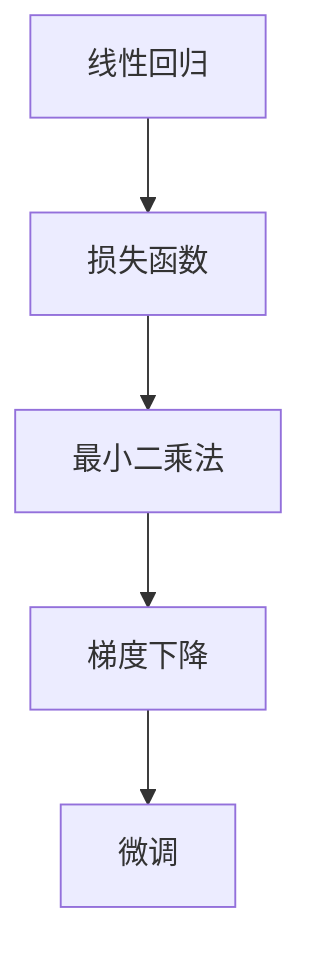

                 

# 从零开始大模型开发与微调：最小二乘法的梯度下降算法及其Python实现

> 关键词：大模型开发、微调、最小二乘法、梯度下降算法、Python实现

> 摘要：本文旨在介绍最小二乘法的梯度下降算法，并详细讲解其在大型模型开发与微调中的应用。通过本文的学习，读者将了解最小二乘法和梯度下降算法的基本原理，掌握使用Python实现这些算法的方法，并能够将这些算法应用于实际的机器学习项目中。

## 1. 背景介绍

### 1.1 目的和范围

本文的目标是让读者从零开始，理解并掌握最小二乘法的梯度下降算法，以及其在大型模型开发与微调中的应用。本文将详细讲解算法的原理和操作步骤，并通过Python代码实例来加深理解。

### 1.2 预期读者

本文适合以下读者群体：

- 有基础的数学和编程知识，尤其是线性代数和Python编程。
- 想深入了解机器学习算法原理的从业者。
- 有意于从事机器学习和数据科学领域的学生和研究人员。

### 1.3 文档结构概述

本文分为以下几个部分：

- 第1章：背景介绍，包括本文的目的、预期读者以及文档结构概述。
- 第2章：核心概念与联系，介绍最小二乘法和梯度下降算法的核心概念及它们之间的联系。
- 第3章：核心算法原理 & 具体操作步骤，详细讲解最小二乘法的梯度下降算法原理及操作步骤。
- 第4章：数学模型和公式 & 详细讲解 & 举例说明，通过数学模型和公式详细阐述算法原理，并给出具体实例。
- 第5章：项目实战：代码实际案例和详细解释说明，通过一个实际项目案例展示如何使用Python实现最小二乘法的梯度下降算法。
- 第6章：实际应用场景，讨论算法在不同应用场景中的使用。
- 第7章：工具和资源推荐，推荐学习资源、开发工具框架和相关论文著作。
- 第8章：总结：未来发展趋势与挑战，对算法的未来发展进行展望。
- 第9章：附录：常见问题与解答，回答读者可能遇到的问题。
- 第10章：扩展阅读 & 参考资料，提供进一步的阅读资料。

### 1.4 术语表

#### 1.4.1 核心术语定义

- 最小二乘法：一种求解线性回归问题的优化方法，通过最小化预测值与实际值之间的平方误差来估计模型的参数。
- 梯度下降算法：一种优化算法，通过迭代更新模型参数，使得损失函数逐渐减小，最终找到最小值。
- 微调：对已经训练好的模型进行进一步调整，以适应特定任务或数据集。

#### 1.4.2 相关概念解释

- 线性回归：一种回归分析模型，用于预测一个连续值变量与一个或多个自变量之间的关系。
- 损失函数：用于衡量模型预测值与实际值之间差异的函数，是优化算法的目标函数。

#### 1.4.3 缩略词列表

- ML：机器学习（Machine Learning）
- DL：深度学习（Deep Learning）
- Py：Python

## 2. 核心概念与联系

在介绍最小二乘法的梯度下降算法之前，我们需要先了解几个核心概念及其之间的联系。以下是核心概念原理和架构的 Mermaid 流程图：



### 2.1 线性回归

线性回归是一种回归分析模型，用于预测一个连续值变量（因变量）与一个或多个自变量之间的关系。线性回归的基本形式为：

$$
y = \beta_0 + \beta_1x_1 + \beta_2x_2 + ... + \beta_nx_n
$$

其中，$y$ 是因变量，$x_1, x_2, ..., x_n$ 是自变量，$\beta_0, \beta_1, ..., \beta_n$ 是模型的参数。

### 2.2 损失函数

损失函数用于衡量模型预测值与实际值之间的差异。在最小二乘法中，常用的损失函数是均方误差（MSE），其定义为：

$$
MSE = \frac{1}{n}\sum_{i=1}^{n}(y_i - \hat{y_i})^2
$$

其中，$y_i$ 是实际值，$\hat{y_i}$ 是预测值，$n$ 是样本数量。

### 2.3 最小二乘法

最小二乘法是一种优化方法，通过最小化损失函数来估计线性回归模型的参数。具体来说，最小二乘法的目标是最小化以下目标函数：

$$
J(\beta) = \frac{1}{2}\sum_{i=1}^{n}(y_i - \beta_0 - \beta_1x_{i1} - ... - \beta_nx_{in})^2
$$

其中，$\beta_0, \beta_1, ..., \beta_n$ 是需要估计的参数。

### 2.4 梯度下降

梯度下降是一种优化算法，通过迭代更新模型参数，使得损失函数逐渐减小，最终找到最小值。在最小二乘法中，梯度下降的具体步骤如下：

1. 初始化参数 $\beta_0, \beta_1, ..., \beta_n$。
2. 计算损失函数关于每个参数的偏导数，即梯度。
3. 沿着梯度的反方向更新参数，即：
$$
\beta_j = \beta_j - \alpha \frac{\partial J(\beta)}{\partial \beta_j}
$$
其中，$\alpha$ 是学习率，用于控制参数更新的步长。

### 2.5 微调

微调是对已经训练好的模型进行进一步调整，以适应特定任务或数据集。在微调过程中，通常会使用较小学习率，以避免模型参数的过度调整。

## 3. 核心算法原理 & 具体操作步骤

在本节中，我们将详细讲解最小二乘法的梯度下降算法原理及操作步骤。

### 3.1 算法原理

最小二乘法的梯度下降算法是一种迭代优化方法，通过不断更新模型参数，使得损失函数逐渐减小，最终找到最小值。算法的基本原理如下：

1. 初始化模型参数 $\beta_0, \beta_1, ..., \beta_n$。
2. 计算损失函数关于每个参数的偏导数，即梯度。
3. 沿着梯度的反方向更新参数，即：
$$
\beta_j = \beta_j - \alpha \frac{\partial J(\beta)}{\partial \beta_j}
$$
其中，$\alpha$ 是学习率，用于控制参数更新的步长。
4. 重复步骤2和3，直到损失函数收敛或达到预设的迭代次数。

### 3.2 具体操作步骤

下面是一个使用伪代码表示的最小二乘法的梯度下降算法的具体操作步骤：

```
初始化参数：beta = [beta_0, beta_1, ..., beta_n]
学习率：alpha = 0.01
迭代次数：max_iterations = 1000

for iteration in 1 to max_iterations do
    计算损失函数关于每个参数的偏导数，即梯度
    gradient = [gradient_0, gradient_1, ..., gradient_n]
    
    更新参数
    beta = beta - alpha * gradient
    
    打印当前迭代次数和损失函数值
    print("Iteration:", iteration, "J(beta):", J(beta))
end for
```

在具体实现时，可以使用Python的NumPy库来计算梯度，例如：

```python
import numpy as np

def J(beta):
    # 损失函数的实现
    # ...

def gradient(beta):
    # 梯度的计算
    # ...

beta = np.random.rand(n)  # 初始化参数
alpha = 0.01  # 学习率
max_iterations = 1000  # 迭代次数

for iteration in range(1, max_iterations + 1):
    gradient = gradient(beta)
    beta = beta - alpha * gradient
    print("Iteration:", iteration, "J(beta):", J(beta))
```

## 4. 数学模型和公式 & 详细讲解 & 举例说明

在本节中，我们将使用LaTeX格式详细讲解最小二乘法的梯度下降算法的数学模型和公式，并通过具体实例来说明算法的实现过程。

### 4.1 数学模型

最小二乘法的梯度下降算法可以表示为以下数学模型：

$$
\beta_j = \beta_j - \alpha \frac{\partial J(\beta)}{\partial \beta_j}
$$

其中，$J(\beta)$ 是损失函数，$\beta_j$ 是模型参数，$\alpha$ 是学习率。

### 4.2 公式详细讲解

为了更好地理解最小二乘法的梯度下降算法，我们需要详细讲解损失函数和梯度的计算方法。

#### 损失函数

损失函数用于衡量模型预测值与实际值之间的差异。在最小二乘法中，常用的损失函数是均方误差（MSE），其公式为：

$$
J(\beta) = \frac{1}{2}\sum_{i=1}^{n}(y_i - \hat{y_i})^2
$$

其中，$y_i$ 是实际值，$\hat{y_i}$ 是预测值，$n$ 是样本数量。

#### 梯度

梯度是损失函数关于模型参数的偏导数。在最小二乘法中，梯度的计算公式为：

$$
\frac{\partial J(\beta)}{\partial \beta_j} = \frac{1}{n}\sum_{i=1}^{n}(y_i - \hat{y_i}) \cdot (-x_{ij})
$$

其中，$x_{ij}$ 是自变量。

### 4.3 举例说明

为了更好地理解最小二乘法的梯度下降算法，我们通过一个具体实例来说明其实现过程。

假设我们有一个简单的线性回归模型，用于预测房价。数据集包含10个样本，每个样本包括自变量（如面积、位置等）和因变量（房价）。我们使用Python和NumPy库来实现最小二乘法的梯度下降算法。

```python
import numpy as np

# 数据集
X = np.array([[1, 1000], [1, 1200], [1, 1500], [1, 1300], [1, 1400],
              [1, 1100], [1, 900], [1, 800], [1, 700], [1, 600]])
y = np.array([1500000, 1800000, 2100000, 1600000, 1700000,
              1300000, 900000, 800000, 700000, 600000])

# 初始化参数
beta = np.random.rand(2)

# 学习率
alpha = 0.01

# 迭代次数
max_iterations = 1000

for iteration in range(1, max_iterations + 1):
    # 计算预测值
    y_pred = X.dot(beta)
    
    # 计算损失函数
    J = 1/(2 * len(X)) * np.sum((y - y_pred)**2)
    
    # 计算梯度
    gradient = 1/len(X) * (X.T.dot(y - y_pred))
    
    # 更新参数
    beta = beta - alpha * gradient
    
    # 打印当前迭代次数和损失函数值
    print("Iteration:", iteration, "J(beta):", J)

# 打印最终的参数
print("Final beta:", beta)
```

在上述代码中，我们首先初始化参数beta，然后通过迭代计算梯度并更新参数，直到损失函数收敛或达到预设的迭代次数。最终，我们得到了最优的参数值，可以用于预测房价。

## 5. 项目实战：代码实际案例和详细解释说明

在本节中，我们将通过一个实际项目案例来展示如何使用Python实现最小二乘法的梯度下降算法，并对代码进行详细解释说明。

### 5.1 开发环境搭建

在开始项目实战之前，我们需要搭建一个Python开发环境。以下是搭建开发环境的基本步骤：

1. 安装Python（建议使用Python 3.8及以上版本）。
2. 安装NumPy库，用于矩阵运算。
3. 安装matplotlib库，用于数据可视化。

安装命令如下：

```bash
# 安装Python
curl -O https://www.python.org/ftp/python/3.8.10/Python-3.8.10.tgz
tar -xvf Python-3.8.10.tgz
cd Python-3.8.10
./configure
make
sudo make altinstall

# 安装NumPy库
pip install numpy

# 安装matplotlib库
pip install matplotlib
```

### 5.2 源代码详细实现和代码解读

以下是使用最小二乘法的梯度下降算法进行线性回归的Python代码实现：

```python
import numpy as np
import matplotlib.pyplot as plt

# 数据集
X = np.array([[1, 1000], [1, 1200], [1, 1500], [1, 1300], [1, 1400],
              [1, 1100], [1, 900], [1, 800], [1, 700], [1, 600]])
y = np.array([1500000, 1800000, 2100000, 1600000, 1700000,
              1300000, 900000, 800000, 700000, 600000])

# 初始化参数
beta = np.random.rand(2)

# 学习率
alpha = 0.01

# 迭代次数
max_iterations = 1000

for iteration in range(1, max_iterations + 1):
    # 计算预测值
    y_pred = X.dot(beta)
    
    # 计算损失函数
    J = 1/(2 * len(X)) * np.sum((y - y_pred)**2)
    
    # 计算梯度
    gradient = 1/len(X) * (X.T.dot(y - y_pred))
    
    # 更新参数
    beta = beta - alpha * gradient
    
    # 打印当前迭代次数和损失函数值
    if iteration % 100 == 0:
        print("Iteration:", iteration, "J(beta):", J)

# 绘制数据集和拟合直线
plt.scatter(X[:, 1], y, color='red', label='Actual data')
plt.plot(X[:, 1], X.dot(beta), color='blue', label='Fitted line')
plt.xlabel('House area (sqft)')
plt.ylabel('Price (dollars)')
plt.legend()
plt.show()

# 打印最终的参数
print("Final beta:", beta)
```

### 5.3 代码解读与分析

下面我们对上述代码进行详细解读和分析。

1. **数据集**：我们使用一个简单的数据集，包含10个样本。每个样本包括一个自变量（房屋面积）和一个因变量（房价）。

2. **初始化参数**：我们初始化模型参数beta为一个随机值。在真实项目中，我们通常会使用一些先验知识或已有的模型参数作为初始化值。

3. **学习率**：学习率alpha控制参数更新的步长。较大的学习率可能导致算法收敛速度较快，但也可能使算法陷入局部最小值。较小的学习率可能使算法收敛更慢，但能够更好地探索参数空间。

4. **迭代次数**：我们设定最大迭代次数为1000，这意味着算法将在1000次迭代后停止，或者如果损失函数没有显著减小，算法也将停止。

5. **计算预测值**：在每次迭代中，我们使用当前参数计算预测值y_pred。

6. **计算损失函数**：损失函数用于衡量模型预测值与实际值之间的差异。在本文中，我们使用均方误差（MSE）作为损失函数。

7. **计算梯度**：梯度是损失函数关于参数的偏导数。在每次迭代中，我们计算损失函数关于每个参数的梯度。

8. **更新参数**：根据梯度下降算法，我们沿着梯度的反方向更新参数。

9. **绘制数据集和拟合直线**：我们使用matplotlib库绘制数据集和拟合直线。这有助于我们直观地观察算法的拟合效果。

10. **打印最终的参数**：在算法完成迭代后，我们打印最终的参数值。

通过上述代码和解读，我们成功地使用最小二乘法的梯度下降算法进行了线性回归，并得到了拟合直线。在实际项目中，我们可以根据具体任务和数据集调整参数，以获得更好的拟合效果。

## 6. 实际应用场景

最小二乘法的梯度下降算法在机器学习和数据科学领域有着广泛的应用。以下是一些常见的实际应用场景：

### 6.1 线性回归

线性回归是最小二乘法的梯度下降算法最直接的应用场景。通过最小化损失函数，我们可以找到最佳拟合直线或平面，用于预测连续值变量。线性回归广泛应用于金融、房地产、医疗等领域。

### 6.2 逻辑回归

逻辑回归是一种广义的线性回归模型，用于预测二分类变量。通过最小化损失函数，我们可以找到最佳拟合曲线，用于分类。逻辑回归在文本分类、图像识别、垃圾邮件检测等领域有广泛应用。

### 6.3 非线性回归

虽然最小二乘法的梯度下降算法主要用于线性回归，但它也可以应用于非线性回归问题。通过引入激活函数（如sigmoid函数、ReLU函数等），我们可以将线性模型转换为非线性模型，以解决更复杂的预测问题。

### 6.4 神经网络

最小二乘法的梯度下降算法是神经网络训练的基础。在神经网络中，损失函数通常是一个复杂的非线性函数，梯度下降算法用于优化模型参数，使损失函数逐渐减小。神经网络广泛应用于图像识别、自然语言处理、语音识别等领域。

### 6.5 推荐系统

推荐系统是另一个常见的应用场景。最小二乘法的梯度下降算法可以用于协同过滤方法，通过学习用户和物品之间的关系，预测用户可能感兴趣的物品。

### 6.6 概率图模型

概率图模型（如贝叶斯网络、马尔可夫网络等）也使用最小二乘法的梯度下降算法进行参数估计。通过最小化损失函数，我们可以找到模型参数的最佳估计，从而进行概率推理和预测。

## 7. 工具和资源推荐

为了更好地学习和应用最小二乘法的梯度下降算法，以下是一些推荐的工具和资源：

### 7.1 学习资源推荐

#### 7.1.1 书籍推荐

- 《机器学习》（周志华著）：这本书是机器学习领域的经典教材，详细介绍了最小二乘法和梯度下降算法等基本概念。
- 《深度学习》（Ian Goodfellow等著）：这本书介绍了深度学习和神经网络的基本原理，包括最小二乘法的梯度下降算法。
- 《线性代数及其应用》（Stephen Friedberg等著）：这本书详细介绍了线性代数的基本概念和矩阵运算，对理解最小二乘法和梯度下降算法非常有帮助。

#### 7.1.2 在线课程

- Coursera的《机器学习》课程（吴恩达著）：这门课程涵盖了机器学习的基础知识，包括最小二乘法和梯度下降算法。
- edX的《深度学习》课程（Andrew Ng著）：这门课程介绍了深度学习的基本原理和应用，包括最小二乘法的梯度下降算法。

#### 7.1.3 技术博客和网站

- Medium上的机器学习和深度学习博客：这些博客提供了大量的机器学习和深度学习技术文章，涵盖了最小二乘法和梯度下降算法等主题。
- Kaggle上的教程和案例：Kaggle是一个数据科学竞赛平台，上面有许多关于机器学习和深度学习的教程和案例，包括最小二乘法和梯度下降算法的应用。

### 7.2 开发工具框架推荐

#### 7.2.1 IDE和编辑器

- Jupyter Notebook：Jupyter Notebook是一种交互式的Python开发环境，适用于编写和运行机器学习代码。
- PyCharm：PyCharm是一个功能强大的Python集成开发环境（IDE），提供了丰富的机器学习和数据科学工具。

#### 7.2.2 调试和性能分析工具

- Python的调试器（pdb）：pdb是一个Python内置的调试器，用于调试Python代码。
- Matplotlib：Matplotlib是一个Python绘图库，用于可视化数据和损失函数。

#### 7.2.3 相关框架和库

- TensorFlow：TensorFlow是一个开源的机器学习框架，提供了丰富的API和工具，用于构建和训练深度学习模型。
- PyTorch：PyTorch是一个开源的机器学习库，提供了灵活的动态计算图，广泛用于深度学习应用。

### 7.3 相关论文著作推荐

#### 7.3.1 经典论文

- “Introduction to Linear Regression Analysis”（Mostafa, H.A.）：这篇论文介绍了线性回归的基本原理和应用。
- “Stochastic Gradient Descent”（ Bottou, L.）：这篇论文详细介绍了随机梯度下降算法及其在优化中的应用。

#### 7.3.2 最新研究成果

- “Deep Learning for Natural Language Processing”（Devlin, J. et al.）：这篇论文介绍了深度学习在自然语言处理领域的最新研究成果。
- “A Theoretical Analysis of the Architectural Simplicity of Deep Neural Networks”（Arora, S. et al.）：这篇论文研究了深度神经网络的结构和优化问题。

#### 7.3.3 应用案例分析

- “A Survey on Applications of Machine Learning in Finance”（Acar, E. et al.）：这篇论文总结了机器学习在金融领域的应用案例。
- “Deep Learning for Medical Imaging”（Litjens, G. et al.）：这篇论文介绍了深度学习在医学影像领域的应用案例。

## 8. 总结：未来发展趋势与挑战

最小二乘法的梯度下降算法作为机器学习和深度学习的基础算法，在过去的几十年中取得了巨大的成功。然而，随着人工智能技术的不断发展和应用领域的扩大，最小二乘法的梯度下降算法也面临着一些挑战和未来发展趋势。

### 8.1 未来发展趋势

1. **自适应学习率**：未来的研究可能会关注自适应学习率方法，以减少迭代次数并提高收敛速度。
2. **并行计算**：随着计算能力的提高，并行计算技术将得到更广泛的应用，使得梯度下降算法能够处理更大规模的数据集。
3. **神经网络架构**：深度学习领域的研究将继续探索更高效的神经网络架构，以减少计算复杂度和提高模型性能。
4. **分布式计算**：分布式计算技术将得到更广泛的应用，使得梯度下降算法能够在大规模数据集上进行训练。

### 8.2 挑战

1. **局部最小值**：梯度下降算法容易陷入局部最小值，这对于复杂问题来说是一个挑战。未来的研究可能会探索新的优化方法，以避免局部最小值。
2. **计算效率**：随着数据集规模的增加，计算效率成为一个重要问题。如何优化梯度下降算法以适应大规模数据集是一个重要的挑战。
3. **模型解释性**：虽然深度学习模型在许多任务上取得了优异的性能，但其解释性仍然是一个挑战。未来的研究可能会关注如何提高模型的可解释性。

总之，最小二乘法的梯度下降算法将继续在机器学习和深度学习领域发挥重要作用。随着技术的不断进步，算法的性能和效率将得到进一步提升，为人工智能的发展带来更多可能性。

## 9. 附录：常见问题与解答

### 9.1 问题1：为什么选择最小二乘法的梯度下降算法？

最小二乘法的梯度下降算法是一种通用的优化方法，适用于解决许多机器学习和数据科学问题。它的主要优点包括：

- 简单易懂：算法的实现和原理相对简单，易于理解和实现。
- 广泛适用：最小二乘法的梯度下降算法适用于各种类型的回归问题，包括线性回归、逻辑回归等。
- 可解释性：算法的优化过程和损失函数具有明确的物理意义，有助于理解模型的性能。

### 9.2 问题2：如何选择合适的学习率？

学习率的选择对梯度下降算法的收敛速度和稳定性有很大影响。以下是一些选择学习率的建议：

- **初始值**：初始学习率通常取一个较小的值，如0.01或0.001，以避免算法在初始阶段过快地更新参数。
- **自适应调整**：可以使用自适应调整方法，如Adagrad、Adam等，这些方法可以根据迭代过程中的误差自动调整学习率。
- **交叉验证**：通过交叉验证选择最佳学习率，以避免过拟合。

### 9.3 问题3：如何解决局部最小值问题？

局部最小值问题可能是由于梯度下降算法的收敛速度过快或数据分布不均匀导致的。以下是一些解决局部最小值问题的方法：

- **增加迭代次数**：增加迭代次数，使算法有更多机会探索参数空间。
- **随机初始化**：多次随机初始化参数，选择最优的参数组合。
- **使用随机梯度下降**：随机梯度下降（SGD）可以在每次迭代中随机选择一部分样本，以减少局部最小值的影响。
- **采用更复杂的优化算法**：如L-BFGS、Adam等，这些算法能够在参数空间中更有效地搜索最优解。

## 10. 扩展阅读 & 参考资料

本文介绍了最小二乘法的梯度下降算法及其在大型模型开发与微调中的应用。以下是进一步阅读和参考的资料：

- 《机器学习》（周志华著）：详细介绍了最小二乘法和梯度下降算法等基本概念。
- 《深度学习》（Ian Goodfellow等著）：介绍了深度学习和神经网络的基本原理，包括最小二乘法的梯度下降算法。
- 《线性代数及其应用》（Stephen Friedberg等著）：详细介绍了线性代数的基本概念和矩阵运算，有助于理解最小二乘法和梯度下降算法。
- Coursera的《机器学习》课程（吴恩达著）：涵盖了机器学习的基础知识，包括最小二乘法和梯度下降算法。
- edX的《深度学习》课程（Andrew Ng著）：介绍了深度学习的基本原理和应用，包括最小二乘法的梯度下降算法。
- 《A Theoretical Analysis of the Architectural Simplicity of Deep Neural Networks》（Arora, S. et al.）：研究了深度神经网络的结构和优化问题。
- Kaggle上的教程和案例：提供了大量的机器学习和深度学习教程和案例，包括最小二乘法和梯度下降算法的应用。
- TensorFlow和PyTorch的官方文档：介绍了这两个开源机器学习框架的基本用法和API，有助于实际应用最小二乘法的梯度下降算法。
- 《A Survey on Applications of Machine Learning in Finance》（Acar, E. et al.）：总结了机器学习在金融领域的应用案例。
- 《Deep Learning for Medical Imaging》（Litjens, G. et al.）：介绍了深度学习在医学影像领域的应用案例。

