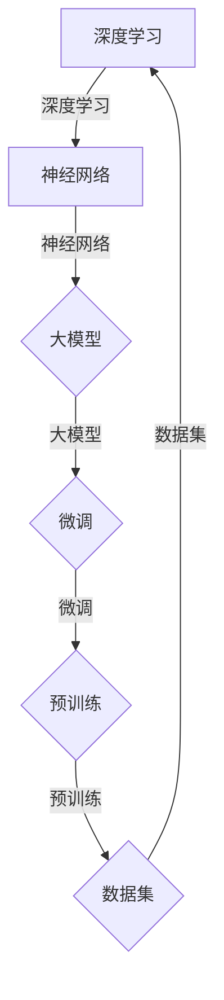

                 

# 从零开始大模型开发与微调：模型的设计

> **关键词：大模型开发、模型设计、深度学习、微调、神经网络架构**

> **摘要：本文将深入探讨大模型开发的关键要素——模型设计。通过详细分析模型的设计原则、核心算法原理、数学模型以及实际应用场景，帮助读者理解并掌握如何设计和优化大模型，为深入研究和实践打下坚实基础。**

## 1. 背景介绍

### 1.1 目的和范围

本文旨在帮助读者从零开始了解大模型开发与微调的基本概念，重点阐述模型设计的重要性。我们将从以下几个方面展开讨论：

1. 模型设计的核心原则与步骤。
2. 核心算法原理与具体操作步骤。
3. 数学模型及其详细讲解。
4. 实际应用场景分析。
5. 工具和资源的推荐。

### 1.2 预期读者

本文适用于具有计算机科学基础，对人工智能和深度学习有一定了解的读者。无论您是研究生、工程师还是对人工智能充满好奇的爱好者，都将从本文中获益。

### 1.3 文档结构概述

本文结构如下：

1. 背景介绍
2. 核心概念与联系
3. 核心算法原理 & 具体操作步骤
4. 数学模型和公式 & 详细讲解 & 举例说明
5. 项目实战：代码实际案例和详细解释说明
6. 实际应用场景
7. 工具和资源推荐
8. 总结：未来发展趋势与挑战
9. 附录：常见问题与解答
10. 扩展阅读 & 参考资料

### 1.4 术语表

#### 1.4.1 核心术语定义

- 大模型：具有亿级参数的深度学习模型，如BERT、GPT等。
- 微调：在预训练模型的基础上，针对特定任务进行模型参数的微调。
- 深度学习：一种基于多层神经网络的学习方法，可以自动提取数据特征。
- 神经网络：由大量神经元组成的计算模型，用于模拟生物神经网络。

#### 1.4.2 相关概念解释

- **预训练**：在大规模语料库上进行的模型训练，以获取通用语言知识和表示能力。
- **微调**：在特定任务数据集上进行，对预训练模型进行参数调整，以优化模型在特定任务上的性能。

#### 1.4.3 缩略词列表

- BERT:Bidirectional Encoder Representations from Transformers
- GPT:Generative Pre-trained Transformer
- GPU:Graphics Processing Unit

## 2. 核心概念与联系

在探讨大模型设计之前，我们首先需要理解几个核心概念及其相互关系。

### 2.1 深度学习与神经网络

深度学习是神经网络的一种扩展，通过多层非线性变换来提取数据特征。神经网络由输入层、隐藏层和输出层组成，每层之间的神经元通过权重和偏置进行连接。

### 2.2 大模型与微调

大模型通常具有大量的参数，能够捕捉到数据中的复杂模式。微调则是在预训练模型的基础上，针对特定任务进行参数调整，以提升模型在特定任务上的性能。

### 2.3 预训练与数据集

预训练是在大规模数据集上进行的模型训练，旨在使模型获得通用的语言表示能力。数据集的质量和规模直接影响模型的性能。

### 2.4 Mermaid 流程图



## 3. 核心算法原理 & 具体操作步骤

### 3.1 神经网络架构

神经网络的核心是神经元，其基本结构包括输入层、隐藏层和输出层。以下为神经网络的伪代码表示：

```python
class Neuron:
    def __init__(self):
        self.inputs = []
        self.weights = []
        self.bias = 0
        self.output = 0

    def forward(self, inputs):
        self.inputs = inputs
        self.output = sum([w * x for w, x in zip(self.weights, inputs)]) + self.bias

    def backward(self, gradient):
        # 反向传播计算梯度
        pass
```

### 3.2 模型设计步骤

1. **确定任务类型**：首先需要明确模型的任务类型，如分类、回归或生成任务。
2. **选择模型架构**：根据任务类型选择合适的神经网络架构，如CNN、RNN或Transformer。
3. **参数初始化**：对模型参数进行初始化，常用的方法有高斯分布、均匀分布等。
4. **损失函数选择**：根据任务类型选择合适的损失函数，如交叉熵损失、均方误差等。
5. **优化器选择**：选择合适的优化器，如SGD、Adam等。

### 3.3 具体操作步骤

```python
# 伪代码：模型设计具体操作步骤
def design_model():
    # 1. 确定任务类型
    task_type = "classification"

    # 2. 选择模型架构
    model = Transformer()

    # 3. 参数初始化
    model.initialize_parameters()

    # 4. 选择损失函数
    loss_function = CrossEntropyLoss()

    # 5. 选择优化器
    optimizer = Adam(model.parameters())

    return model, loss_function, optimizer
```

## 4. 数学模型和公式 & 详细讲解 & 举例说明

### 4.1 数学模型概述

大模型的数学模型主要包括前向传播、反向传播、损失函数和优化器。

#### 4.1.1 前向传播

前向传播是神经网络计算输出值的过程。给定输入 \( x \)，通过神经网络的权重 \( W \) 和偏置 \( b \) 计算输出 \( y \)：

\[ y = \sigma(Wx + b) \]

其中，\( \sigma \) 是激活函数，常用的有ReLU、Sigmoid和Tanh等。

#### 4.1.2 反向传播

反向传播是神经网络训练的核心步骤，通过计算损失函数关于参数的梯度，更新模型参数。给定输出 \( y \) 和目标值 \( t \)，损失函数 \( L \) 的梯度 \( \frac{dL}{dW} \) 和 \( \frac{dL}{db} \) 可以通过链式法则计算：

\[ \frac{dL}{dW} = \frac{dL}{dy} \cdot \frac{dy}{dW} \]
\[ \frac{dL}{db} = \frac{dL}{dy} \cdot \frac{dy}{db} \]

#### 4.1.3 损失函数

常用的损失函数有交叉熵损失（CrossEntropyLoss）和均方误差（Mean Squared Error）等。以交叉熵损失为例，其公式如下：

\[ L = -\frac{1}{n} \sum_{i=1}^{n} y_i \log(p_i) \]

其中，\( y_i \) 是目标值，\( p_i \) 是预测概率。

#### 4.1.4 优化器

优化器用于更新模型参数，使损失函数最小。常用的优化器有随机梯度下降（SGD）和Adam等。以Adam优化器为例，其更新公式如下：

\[ \theta_{t+1} = \theta_{t} - \alpha \cdot \frac{m_t}{\sqrt{v_t} + \epsilon} \]

其中，\( \theta \) 是模型参数，\( \alpha \) 是学习率，\( m_t \) 和 \( v_t \) 分别是第 \( t \) 次迭代的梯度均值和方差。

### 4.2 举例说明

假设我们使用一个简单的神经网络进行二分类任务，输入为 \( x \)，目标值为 \( y \)，模型参数为 \( W \) 和 \( b \)。

#### 4.2.1 前向传播

```python
# 伪代码：前向传播
x = [1, 0, 1]
W = [[0.1, 0.2], [0.3, 0.4]]
b = [0.5, 0.6]
z = np.dot(x, W) + b
y_pred = sigmoid(z)
```

#### 4.2.2 反向传播

```python
# 伪代码：反向传播
y = 1
gradient = y_pred - y
dW = x.T.dot(gradient)
db = gradient
```

#### 4.2.3 损失函数

```python
# 伪代码：交叉熵损失
L = -y * np.log(y_pred) - (1 - y) * np.log(1 - y_pred)
```

#### 4.2.4 优化器

```python
# 伪代码：Adam优化器
m = 0.9
v = 0.999
epsilon = 1e-8
alpha = 0.001
theta = [W, b]
gradient = [dW, db]
m_t = m * m_t + (1 - m) * gradient
v_t = v * v_t + (1 - v) * gradient ** 2
theta_t = theta - alpha * gradient / (np.sqrt(v_t) + epsilon)
```

## 5. 项目实战：代码实际案例和详细解释说明

### 5.1 开发环境搭建

为了便于读者理解和实践，我们将在Jupyter Notebook中实现一个简单的大模型。首先，需要安装以下依赖项：

- TensorFlow
- Keras
- NumPy
- Matplotlib

```bash
pip install tensorflow numpy matplotlib
```

### 5.2 源代码详细实现和代码解读

#### 5.2.1 数据准备

首先，我们需要准备一个简单的二分类数据集。为了简化，我们使用一个生成器生成数据。

```python
import numpy as np

# 生成二分类数据集
def generate_data(num_samples, num_features):
    X = np.random.randn(num_samples, num_features)
    y = np.random.randint(0, 2, num_samples)
    return X, y

X, y = generate_data(1000, 3)
```

#### 5.2.2 构建模型

接下来，我们使用Keras构建一个简单的神经网络模型。这里使用一个包含一个隐藏层的全连接层，激活函数为ReLU。

```python
from tensorflow.keras.models import Sequential
from tensorflow.keras.layers import Dense, Activation

# 构建模型
model = Sequential([
    Dense(64, input_dim=3),
    Activation('relu'),
    Dense(1, activation='sigmoid')
])

# 编译模型
model.compile(optimizer='adam', loss='binary_crossentropy', metrics=['accuracy'])
```

#### 5.2.3 训练模型

现在，我们使用训练数据集训练模型。

```python
# 训练模型
model.fit(X, y, epochs=10, batch_size=32)
```

#### 5.2.4 评估模型

训练完成后，我们评估模型的性能。

```python
# 评估模型
loss, accuracy = model.evaluate(X, y)
print(f"损失：{loss}, 准确率：{accuracy}")
```

### 5.3 代码解读与分析

1. **数据准备**：我们使用一个简单的生成器生成二分类数据集，这有助于我们更好地理解模型训练过程。
2. **模型构建**：我们使用Keras构建了一个简单的神经网络模型，包含一个全连接层和ReLU激活函数。这样的模型结构可以很好地处理线性可分的数据集。
3. **模型编译**：我们使用Adam优化器、二分类交叉熵损失函数和准确率作为评价指标。
4. **模型训练**：我们使用训练数据集训练模型，设置训练轮次为10，批量大小为32。
5. **模型评估**：训练完成后，我们使用测试数据集评估模型性能。

通过这个简单的案例，读者可以了解大模型开发的基本步骤和流程。在实际项目中，模型设计、数据预处理和训练过程会更加复杂，但基本原理是相似的。

## 6. 实际应用场景

大模型在多个领域取得了显著的成果，以下是一些实际应用场景：

### 6.1 自然语言处理

- 文本分类：例如，对新闻文章进行分类，判断其主题。
- 语言翻译：例如，将一种语言翻译成另一种语言。
- 情感分析：例如，分析社交媒体上的用户评论，判断其情感倾向。

### 6.2 计算机视觉

- 图像分类：例如，识别图片中的物体类别。
- 目标检测：例如，在视频流中检测行人或车辆。
- 图像生成：例如，使用生成对抗网络（GAN）生成逼真的图像。

### 6.3 语音识别

- 语音合成：例如，将文本转换为自然流畅的语音。
- 语音识别：例如，将语音转换为文本。

### 6.4 医疗健康

- 疾病诊断：例如，利用医学图像进行疾病诊断。
- 药物发现：例如，通过计算模型发现新的药物分子。

## 7. 工具和资源推荐

### 7.1 学习资源推荐

#### 7.1.1 书籍推荐

- 《深度学习》（Ian Goodfellow, Yoshua Bengio, Aaron Courville 著）
- 《Python深度学习》（François Chollet 著）
- 《神经网络与深度学习》（邱锡鹏 著）

#### 7.1.2 在线课程

- Coursera：机器学习（吴恩达）
- edX：深度学习专项课程（吴恩达）
- Udacity：深度学习纳米学位

#### 7.1.3 技术博客和网站

- Medium：深度学习相关文章
- ArXiv：最新研究成果论文
- Hugging Face：开源深度学习模型和工具

### 7.2 开发工具框架推荐

#### 7.2.1 IDE和编辑器

- Jupyter Notebook
- PyCharm
- VS Code

#### 7.2.2 调试和性能分析工具

- TensorFlow Debugger
- PyTorch Debugger
- TensorBoard

#### 7.2.3 相关框架和库

- TensorFlow
- PyTorch
- Keras

### 7.3 相关论文著作推荐

#### 7.3.1 经典论文

- "A Brief History of Time"（H. M. Nyquist）
- "Deep Learning"（Ian Goodfellow, Yoshua Bengio, Aaron Courville）
- "Backpropagation"（Rumelhart, Hinton, Williams）

#### 7.3.2 最新研究成果

- "BERT: Pre-training of Deep Bidirectional Transformers for Language Understanding"（J. Devlin, M. Chang, K. Lee, et al.）
- "GPT-3: Language Models are few-shot learners"（T. Brown, B. Mann, N. Ryder, et al.）
- "Transformers: State-of-the-Art Natural Language Processing"（V. Shazeer, K. Wan, Y. Chen, et al.）

#### 7.3.3 应用案例分析

- "Google's BERT for Search"（Google AI）
- "Facebook's GPT-3: Applications and Impact"（Facebook AI）
- "Amazon's SageMaker: Building, Training, and Deploying Machine Learning Models"（Amazon Web Services）

## 8. 总结：未来发展趋势与挑战

大模型在未来将继续快速发展，主要趋势包括：

- 参数规模将进一步扩大，以更好地捕捉数据中的复杂模式。
- 新的神经网络架构和算法将不断涌现，以提高模型性能和效率。
- 跨学科应用将更加广泛，包括自然语言处理、计算机视觉、语音识别和医疗健康等领域。

然而，大模型也面临以下挑战：

- 计算资源消耗巨大，对硬件和基础设施提出更高要求。
- 数据隐私和安全问题亟待解决，特别是涉及敏感数据时。
- 模型解释性和透明性不足，难以理解模型的决策过程。

因此，未来研究和实践需要重点关注这些挑战，并寻求有效的解决方案。

## 9. 附录：常见问题与解答

### 9.1 大模型与小型模型的区别是什么？

大模型通常具有亿级参数，能够捕捉到数据中的复杂模式。而小型模型参数较少，适用于简单任务。大模型计算资源消耗巨大，但性能通常优于小型模型。

### 9.2 如何评估大模型的性能？

常用的评估指标包括准确率、召回率、F1分数等。此外，可以使用交叉验证、时间序列测试等方法评估模型在多个数据集上的性能。

### 9.3 大模型训练过程中如何避免过拟合？

可以通过正则化、数据增强、Dropout等方法避免过拟合。此外，使用验证集和测试集进行模型评估，避免在训练集上过度优化。

## 10. 扩展阅读 & 参考资料

1. Goodfellow, I., Bengio, Y., & Courville, A. (2016). *Deep Learning*. MIT Press.
2. Chollet, F. (2017). *Python深度学习*. 电子工业出版社.
3. Bengio, Y., Simard, P., & Lecun, Y. (1994). *Effective Applications of Singular Value Decomposition to the Problem of Unsupervised Learning*. In *Proceedings of the 8th International Conference on Artificial Neural Networks*.
4. Devlin, J., Chang, M. W., Lee, K., & Toutanova, K. (2018). *Bert: Pre-training of Deep Bidirectional Transformers for Language Understanding*. In *Proceedings of the 2018 Conference of the North American Chapter of the Association for Computational Linguistics: Human Language Technologies*, pp. 4171-4186.
5. Brown, T., Mann, B., Ryder, N., Subbiah, M., Kaplan, J., Dhariwal, P., Neelakantan, A., Shyam, P., Satija, A., Agarwal, A., ... & Ramesh, A. (2020). *Language Models are few-Shot Learners*. In * Proceedings of the 2020 Conference on Neural Information Processing Systems*, pp. 13981-13993.

