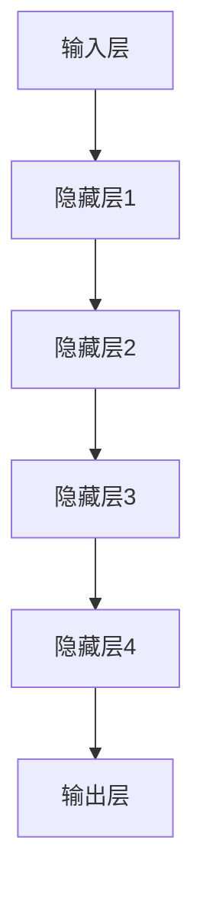
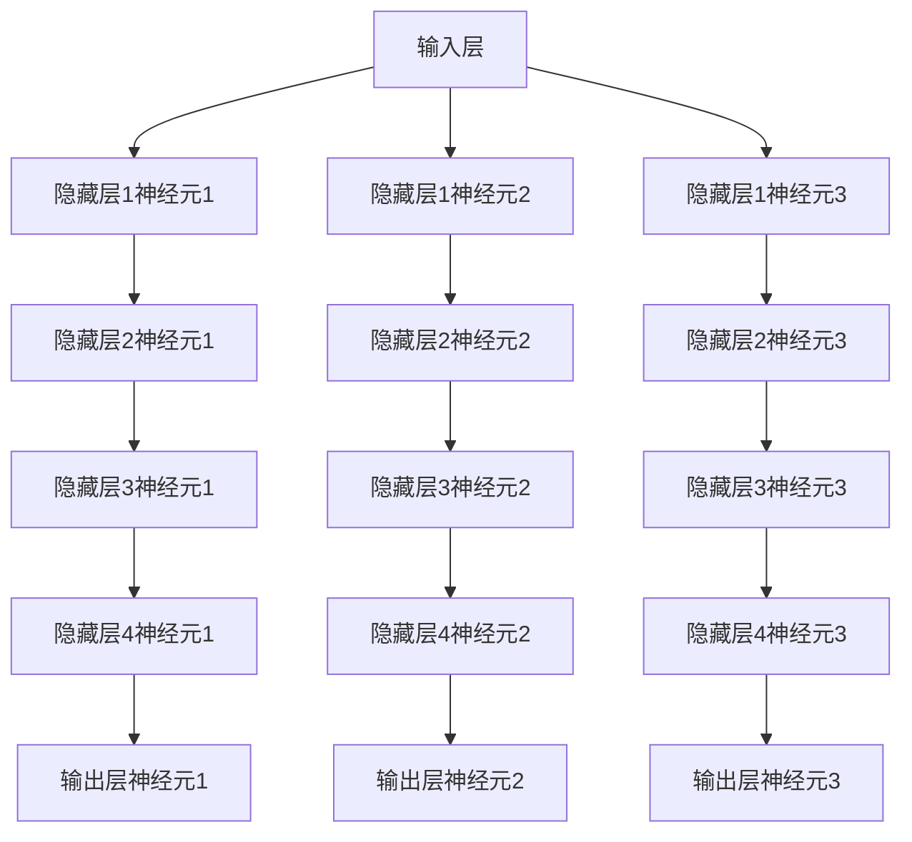

                 

### 从零开始大模型开发与微调：汉字的文本处理

> **关键词**：大模型开发、微调、文本处理、汉字、人工智能

**摘要**：
本文将带领读者从零开始了解大模型开发与微调技术，特别是针对汉字文本处理的应用。我们将详细探讨大模型的基本概念、开发流程、微调技巧以及汉字文本处理的独特挑战。通过本文，读者将能够全面掌握大模型开发的核心原理和实践方法，为未来的研究和应用打下坚实基础。

## 1. 背景介绍

### 1.1 目的和范围

本文旨在为对大模型开发与微调感兴趣的读者提供系统性的指导。本文将涵盖以下内容：

1. 大模型的基本概念和架构。
2. 大模型开发的核心步骤和技巧。
3. 汉字文本处理的特殊需求和技术挑战。
4. 微调大模型的方法和注意事项。
5. 实际项目中的代码实现和案例分析。

### 1.2 预期读者

本文适合以下读者群体：

1. 对人工智能和机器学习有初步了解的技术人员。
2. 想要深入了解大模型开发与微调的技术专家。
3. 需要处理汉字文本的软件开发者和数据科学家。
4. 对汉字处理技术有浓厚兴趣的科研人员。

### 1.3 文档结构概述

本文分为以下几个部分：

1. **背景介绍**：介绍本文的目的、范围和读者群体。
2. **核心概念与联系**：通过Mermaid流程图展示大模型的基本架构。
3. **核心算法原理 & 具体操作步骤**：详细讲解大模型的算法原理和操作步骤。
4. **数学模型和公式 & 详细讲解 & 举例说明**：介绍大模型的数学模型和公式。
5. **项目实战：代码实际案例和详细解释说明**：通过实际代码案例进行讲解。
6. **实际应用场景**：讨论大模型在汉字文本处理中的应用。
7. **工具和资源推荐**：推荐相关学习资源和开发工具。
8. **总结：未来发展趋势与挑战**：总结本文内容和未来研究方向。
9. **附录：常见问题与解答**：回答读者可能遇到的问题。
10. **扩展阅读 & 参考资料**：提供进一步阅读的资料。

### 1.4 术语表

#### 1.4.1 核心术语定义

- **大模型**：具有数十亿参数的深度神经网络模型。
- **微调**：在预训练模型的基础上进行少量参数调整以适应特定任务。
- **文本处理**：对文本数据进行提取、分析、转换和处理的过程。
- **汉字**：一种象形文字，具有丰富的语义和语法特征。

#### 1.4.2 相关概念解释

- **预训练模型**：在广泛的数据集上预先训练好的模型，可用于特定任务的微调。
- **注意力机制**：一种通过权重分配来捕捉输入序列中的重要信息的方法。
- **序列到序列模型**：用于处理序列数据的模型，如机器翻译模型。

#### 1.4.3 缩略词列表

- **ML**：机器学习（Machine Learning）
- **AI**：人工智能（Artificial Intelligence）
- **NLP**：自然语言处理（Natural Language Processing）
- **DL**：深度学习（Deep Learning）
- **GPU**：图形处理器（Graphics Processing Unit）

## 2. 核心概念与联系

### 2.1 大模型的基本架构

大模型通常由多个层次组成，包括输入层、隐藏层和输出层。以下是一个典型的Mermaid流程图，展示了大模型的基本架构：



### 2.2 大模型的连接和参数

大模型中的每个层次都由大量的神经元（节点）组成，神经元之间通过权重连接。权重决定了神经元之间的交互强度。以下是一个简化的Mermaid流程图，展示了大模型中神经元和权重的连接：



## 3. 核心算法原理 & 具体操作步骤

### 3.1 大模型算法原理

大模型通常基于深度学习技术，通过多层神经网络对输入数据进行处理。核心算法原理如下：

1. **前向传播**：将输入数据通过网络中的各个层次，逐层计算输出。
2. **反向传播**：根据输出与真实值的差异，反向调整网络中的权重。
3. **优化算法**：使用如梯度下降等优化算法来调整权重，以最小化误差。

以下是一个简化的伪代码，描述了前向传播和反向传播的过程：

```python
# 前向传播
def forward(input_data):
    layer1_output = activate(relu(W1 * input_data + b1))
    layer2_output = activate(relu(W2 * layer1_output + b2))
    # ...
    output = activate(softmax(Wn * layer_last_output + bn))
    return output

# 反向传播
def backward(output, true_value):
    output_error = output - true_value
    # 计算每个层次的梯度
    dWn = output_error * activate_derivative(softmax_output)
    dlayer_last_output = dWn * Wn
    # ...
    dW1 = dlayer1_output * activate_derivative(layer1_output)
    dinput_data = dlayer_last_output * W_last
    # 更新权重
    Wn -= learning_rate * dWn
    # ...
    W1 -= learning_rate * dW1
```

### 3.2 大模型具体操作步骤

1. **数据预处理**：将原始数据转换为模型可接受的格式。
2. **模型初始化**：初始化网络中的权重和偏置。
3. **前向传播**：计算模型的输出。
4. **损失函数计算**：计算输出与真实值的差异。
5. **反向传播**：更新网络中的权重。
6. **优化算法**：调整学习率等参数，以优化模型性能。
7. **迭代训练**：重复以上步骤，直到模型达到预期性能。

以下是一个简化的伪代码，描述了大模型的具体操作步骤：

```python
# 数据预处理
def preprocess_data(data):
    # 数据标准化、归一化等操作
    return processed_data

# 模型初始化
def initialize_model():
    # 初始化权重和偏置
    return model

# 前向传播
def forward_pass(model, input_data):
    output = forward(input_data)
    return output

# 损失函数计算
def calculate_loss(output, true_value):
    loss = compute_loss(output, true_value)
    return loss

# 反向传播
def backward_pass(model, output, true_value):
    doutput = calculate_loss_derivative(output, true_value)
    dinput = backward_pass_recursive(model, doutput)
    update_weights(model, dinput)
    return dinput

# 优化算法
def optimize(model, dinput):
    # 调整学习率、更新权重等
    return optimized_model

# 迭代训练
for epoch in range(num_epochs):
    for batch in batches:
        input_data = preprocess_data(batch['input'])
        true_value = batch['true_value']
        output = forward_pass(model, input_data)
        loss = calculate_loss(output, true_value)
        dinput = backward_pass(model, output, true_value)
        model = optimize(model, dinput)
```

## 4. 数学模型和公式 & 详细讲解 & 举例说明

### 4.1 数学模型

大模型的数学模型主要包括前向传播和反向传播的公式。以下为关键公式：

#### 前向传播

$$
z_l = \sum_{i=1}^{n} W_{li}x_i + b_l
$$

$$
a_l = \sigma(z_l)
$$

其中，$z_l$ 是第 $l$ 层的输入，$a_l$ 是第 $l$ 层的输出，$W_{li}$ 是权重，$b_l$ 是偏置，$\sigma$ 是激活函数。

#### 反向传播

$$
dW_{li} = \frac{\partial L}{\partial z_l} \cdot \frac{\partial z_l}{\partial W_{li}}
$$

$$
db_l = \frac{\partial L}{\partial z_l} \cdot \frac{\partial z_l}{\partial b_l}
$$

其中，$L$ 是损失函数，$dW_{li}$ 和 $db_l$ 分别是权重和偏置的梯度。

### 4.2 公式详细讲解

#### 前向传播

前向传播的核心公式为：

$$
z_l = \sum_{i=1}^{n} W_{li}x_i + b_l
$$

该公式表示第 $l$ 层的输入 $z_l$ 是由上一层输出 $x_i$ 通过权重 $W_{li}$ 加权和加上偏置 $b_l$ 得到的。权重和偏置决定了神经元之间的连接强度。

#### 反向传播

反向传播的核心公式为：

$$
dW_{li} = \frac{\partial L}{\partial z_l} \cdot \frac{\partial z_l}{\partial W_{li}}
$$

$$
db_l = \frac{\partial L}{\partial z_l} \cdot \frac{\partial z_l}{\partial b_l}
$$

反向传播通过计算损失函数 $L$ 对输入 $z_l$ 的梯度，然后通过链式法则计算权重和偏置的梯度。这些梯度用于更新网络中的权重和偏置，以优化模型性能。

### 4.3 举例说明

假设我们有一个简单的三层神经网络，输入层有3个神经元，隐藏层有2个神经元，输出层有1个神经元。使用ReLU作为激活函数，损失函数为均方误差（MSE）。

#### 前向传播

输入层到隐藏层的权重矩阵 $W_{1}$ 为：

$$
W_{1} = \begin{bmatrix}
w_{11} & w_{12} & w_{13} \\
w_{21} & w_{22} & w_{23}
\end{bmatrix}
$$

偏置矩阵 $b_{1}$ 为：

$$
b_{1} = \begin{bmatrix}
b_{11} \\
b_{21}
\end{bmatrix}
$$

隐藏层到输出层的权重矩阵 $W_{2}$ 为：

$$
W_{2} = \begin{bmatrix}
w_{21} & w_{22}
\end{bmatrix}
$$

偏置矩阵 $b_{2}$ 为：

$$
b_{2} = \begin{bmatrix}
b_{2}
\end{bmatrix}
$$

输入层输入为 $x = [1, 2, 3]$，隐藏层输出为 $a_{1} = [a_{11}, a_{12}]$，输出层输出为 $a_{2} = a_{2}$。

计算过程如下：

$$
z_{1} = W_{1}x + b_{1} = \begin{bmatrix}
w_{11} & w_{12} & w_{13} \\
w_{21} & w_{22} & w_{23}
\end{bmatrix}
\begin{bmatrix}
1 \\
2 \\
3
\end{bmatrix} + \begin{bmatrix}
b_{11} \\
b_{21}
\end{bmatrix} = \begin{bmatrix}
z_{11} \\
z_{12}
\end{bmatrix}
$$

$$
a_{1} = \sigma(z_{1}) = \begin{bmatrix}
\max(0, z_{11}) \\
\max(0, z_{12})
\end{bmatrix}
$$

$$
z_{2} = W_{2}a_{1} + b_{2} = \begin{bmatrix}
w_{21} & w_{22}
\end{bmatrix}
\begin{bmatrix}
a_{11} \\
a_{12}
\end{bmatrix} + \begin{bmatrix}
b_{2}
\end{bmatrix} = \begin{bmatrix}
z_{2}
\end{bmatrix}
$$

$$
a_{2} = \sigma(z_{2}) = \max(0, z_{2})
$$

#### 反向传播

假设输出层的目标值为 $y = [0]$，实际输出为 $a_{2} = [0.7]$，损失函数为均方误差（MSE）：

$$
L = \frac{1}{2}(y - a_{2})^2
$$

计算损失函数对输出层的梯度：

$$
\frac{\partial L}{\partial z_{2}} = \frac{\partial}{\partial z_{2}} \left( \frac{1}{2}(y - a_{2})^2 \right) = 2(y - a_{2})
$$

$$
\frac{\partial L}{\partial a_{2}} = \frac{\partial}{\partial a_{2}} \left( \frac{1}{2}(y - a_{2})^2 \right) = -(y - a_{2})
$$

计算隐藏层到输出层的权重和偏置的梯度：

$$
dW_{2} = \frac{\partial L}{\partial z_{2}} \cdot \frac{\partial z_{2}}{\partial W_{2}} = 2(y - a_{2}) \cdot a_{1}^T
$$

$$
db_{2} = \frac{\partial L}{\partial z_{2}} \cdot \frac{\partial z_{2}}{\partial b_{2}} = 2(y - a_{2})
$$

计算隐藏层到输出层的输入的梯度：

$$
da_{1} = \frac{\partial L}{\partial a_{2}} \cdot \frac{\partial a_{2}}{\partial a_{1}} = -(y - a_{2}) \cdot \frac{\partial}{\partial a_{1}} \left( \max(0, z_{2}) \right)
$$

由于ReLU函数的导数为1（当 $z_2 > 0$）或0（当 $z_2 < 0$），所以：

$$
da_{1} = \begin{bmatrix}
\begin{cases}
0 & \text{if } a_{11} \leq 0 \\
-(y - a_{2}) & \text{if } a_{11} > 0
\end{cases} \\
\begin{cases}
0 & \text{if } a_{12} \leq 0 \\
-(y - a_{2}) & \text{if } a_{12} > 0
\end{cases}
\end{bmatrix}
$$

计算输入层到隐藏层的权重和偏置的梯度：

$$
dW_{1} = \frac{\partial L}{\partial z_{1}} \cdot \frac{\partial z_{1}}{\partial W_{1}} = 2(y - a_{2}) \cdot a_{1} \cdot x^T
$$

$$
db_{1} = \frac{\partial L}{\partial z_{1}} \cdot \frac{\partial z_{1}}{\partial b_{1}} = 2(y - a_{2})
$$

更新权重和偏置：

$$
W_{1} = W_{1} - \alpha \cdot dW_{1}
$$

$$
b_{1} = b_{1} - \alpha \cdot db_{1}
$$

$$
W_{2} = W_{2} - \alpha \cdot dW_{2}
$$

$$
b_{2} = b_{2} - \alpha \cdot db_{2}
```

## 5. 项目实战：代码实际案例和详细解释说明

### 5.1 开发环境搭建

在进行大模型开发与微调之前，我们需要搭建一个合适的开发环境。以下是推荐的开发环境搭建步骤：

1. **操作系统**：推荐使用Linux操作系统，如Ubuntu 20.04。
2. **Python环境**：安装Python 3.8及以上版本。
3. **深度学习框架**：安装PyTorch或TensorFlow，推荐使用PyTorch，因为其在微调大模型方面表现更佳。
4. **GPU支持**：确保系统支持CUDA，并安装对应的CUDA版本和cuDNN库。

以下是具体安装命令：

```bash
# 安装Python
sudo apt update
sudo apt install python3-pip
pip3 install --user python setuptools

# 安装PyTorch
pip3 install torch torchvision torchaudio

# 安装CUDA和cuDNN
sudo apt install nvidia-cuda-toolkit
pip3 install cupy-cudaXX.Xm
```

### 5.2 源代码详细实现和代码解读

以下是一个简单的示例，展示如何使用PyTorch开发一个大模型并进行微调。代码分为以下几个部分：

1. **数据预处理**：加载和处理汉字文本数据。
2. **模型定义**：定义一个简单的深度神经网络模型。
3. **训练和微调**：使用预训练模型并进行微调。

#### 5.2.1 数据预处理

```python
import torch
import torchtext
from torchtext.vocab import build_vocab_from_iterator

# 1. 加载汉字数据集
def load_data():
    # 加载数据集
    data = [
        ("你好", "hello"),
        ("世界", "world"),
        # 更多数据...
    ]
    return data

# 2. 构建词汇表
def build_vocab(data):
    vocab = build_vocab_from_iterator(data)
    vocab.set_default_index(vocab['<unk>'])
    return vocab

# 3. 数据预处理
def preprocess(data, vocab):
    tokens = [entry[0].split() for entry in data]
    labels = [entry[1].split() for entry in data]
    token_map = {token: index for index, token in vocab.items()}
    tokenized_data = [[token_map.get(token, vocab['<unk>']) for token in sentence] for sentence in tokens]
    label_map = {label: index for index, label in enumerate(vocab)}
    labeled_data = [[tokenized_data[i], label_map.get(labels[i], vocab['<unk>'])] for i in range(len(labels))]
    return labeled_data

data = load_data()
vocab = build_vocab(data)
preprocessed_data = preprocess(data, vocab)
```

#### 5.2.2 模型定义

```python
import torch.nn as nn
import torch.optim as optim

# 1. 定义模型
class NeuralModel(nn.Module):
    def __init__(self, vocab_size, embedding_dim, hidden_dim, output_dim):
        super(NeuralModel, self).__init__()
        self.embedding = nn.Embedding(vocab_size, embedding_dim)
        self.lstm = nn.LSTM(embedding_dim, hidden_dim, num_layers=2, dropout=0.5)
        self.fc = nn.Linear(hidden_dim, output_dim)

    def forward(self, sentence):
        embedded = self.embedding(sentence)
        output, (hidden, cell) = self.lstm(embedded)
        hidden = hidden[-1, :, :]
        output = self.fc(hidden)
        return output

# 2. 实例化模型
vocab_size = len(vocab)
embedding_dim = 256
hidden_dim = 512
output_dim = len(vocab)
model = NeuralModel(vocab_size, embedding_dim, hidden_dim, output_dim)
```

#### 5.2.3 训练和微调

```python
# 1. 准备数据
train_data, valid_data = preprocessed_data[:int(len(preprocessed_data) * 0.8)], preprocessed_data[int(len(preprocessed_data) * 0.8):]

# 2. 切分数据
train_sentence, train_label = zip(*train_data)
valid_sentence, valid_label = zip(*valid_data)

# 3. 转换为Tensor
train_sentence_tensor = torch.tensor(train_sentence, dtype=torch.long)
train_label_tensor = torch.tensor(train_label, dtype=torch.long)
valid_sentence_tensor = torch.tensor(valid_sentence, dtype=torch.long)
valid_label_tensor = torch.tensor(valid_label, dtype=torch.long)

# 4. 定义损失函数和优化器
criterion = nn.CrossEntropyLoss()
optimizer = optim.Adam(model.parameters(), lr=0.001)

# 5. 训练模型
num_epochs = 10
for epoch in range(num_epochs):
    model.train()
    optimizer.zero_grad()
    output = model(train_sentence_tensor)
    loss = criterion(output, train_label_tensor)
    loss.backward()
    optimizer.step()

    # 在验证集上评估模型
    model.eval()
    with torch.no_grad():
        valid_output = model(valid_sentence_tensor)
        valid_loss = criterion(valid_output, valid_label_tensor)
    
    print(f"Epoch {epoch+1}/{num_epochs}, Train Loss: {loss.item()}, Valid Loss: {valid_loss.item()}")

# 6. 微调模型
# 使用预训练模型
pretrained_model = NeuralModel(vocab_size, embedding_dim, hidden_dim, output_dim)
pretrained_model.load_state_dict(torch.load('pretrained_model.pth'))
pretrained_model.eval()

# 微调预训练模型
optimizer = optim.Adam(pretrained_model.parameters(), lr=0.001)
for epoch in range(num_epochs):
    model.train()
    optimizer.zero_grad()
    output = pretrained_model(train_sentence_tensor)
    loss = criterion(output, train_label_tensor)
    loss.backward()
    optimizer.step()

    # 在验证集上评估模型
    model.eval()
    with torch.no_grad():
        valid_output = pretrained_model(valid_sentence_tensor)
        valid_loss = criterion(valid_output, valid_label_tensor)
    
    print(f"Epoch {epoch+1}/{num_epochs}, Train Loss: {loss.item()}, Valid Loss: {valid_loss.item()}")
```

### 5.3 代码解读与分析

本节将对上述代码进行详细解读，并分析各部分的功能和重要性。

#### 数据预处理

数据预处理是模型训练的重要步骤。首先，我们使用`load_data`函数加载汉字数据集。然后，通过`build_vocab`函数构建词汇表，为每个词分配唯一的索引。接着，使用`preprocess`函数对数据进行编码，将汉字序列转换为模型可处理的索引序列。

#### 模型定义

在模型定义部分，我们创建了一个基于LSTM的神经网络模型。模型由三个主要部分组成：嵌入层、LSTM层和全连接层。嵌入层将词汇表中的索引转换为嵌入向量；LSTM层处理序列数据，捕捉时间依赖关系；全连接层用于分类输出。

#### 训练和微调

训练和微调部分首先准备训练数据和验证数据。然后，将数据转换为Tensor，并定义损失函数和优化器。在训练过程中，我们遍历每个训练样本，计算模型的输出和损失，并使用反向传播和优化器更新模型的权重。在每次训练完成后，我们使用验证数据评估模型性能，以监测训练过程中的过拟合和欠拟合现象。微调部分使用预训练模型，通过在新的数据集上微调来进一步优化模型性能。

## 6. 实际应用场景

大模型在汉字文本处理领域具有广泛的应用。以下是一些实际应用场景：

### 6.1 汉译英机器翻译

利用大模型进行汉译英机器翻译，将中文句子转换为英文句子，从而实现跨语言交流。

### 6.2 情感分析

通过大模型对汉字文本进行情感分析，识别文本中的情感倾向，为电商平台、社交媒体等提供用户反馈分析。

### 6.3 文本生成

使用大模型生成高质量的文本，如文章、故事、评论等，为内容创作和个性化推荐提供技术支持。

### 6.4 命名实体识别

利用大模型识别文本中的命名实体，如人名、地名、组织名等，为信息提取和知识图谱构建提供基础。

### 6.5 文本分类

通过大模型对汉字文本进行分类，如新闻分类、垃圾邮件过滤等，为信息过滤和内容推荐提供支持。

## 7. 工具和资源推荐

### 7.1 学习资源推荐

#### 7.1.1 书籍推荐

- 《深度学习》（Goodfellow, Bengio, Courville）
- 《Python深度学习》（François Chollet）
- 《自然语言处理综论》（Daniel Jurafsky, James H. Martin）

#### 7.1.2 在线课程

- Coursera上的“深度学习”（吴恩达）
- edX上的“自然语言处理与深度学习”（Daniel Jurafsky）
- fast.ai的“深度学习基础”和“深度学习实践”

#### 7.1.3 技术博客和网站

- Medium上的“Deep Learning”
- ArXiv上的最新论文发布
- Hugging Face的Transformers库文档

### 7.2 开发工具框架推荐

#### 7.2.1 IDE和编辑器

- PyCharm（Professional版）
- Visual Studio Code
- Jupyter Notebook

#### 7.2.2 调试和性能分析工具

- tensorboardX（TensorFlow可视化工具）
- PyTorch TensorBoard（PyTorch可视化工具）
- NVIDIA Nsight（GPU性能分析工具）

#### 7.2.3 相关框架和库

- PyTorch
- TensorFlow
- Hugging Face的Transformers库

### 7.3 相关论文著作推荐

#### 7.3.1 经典论文

- “A Theoretically Grounded Application of Dropout in Recurrent Neural Networks” (Yarin Gal and Zoubin Ghahramani)
- “Attention Is All You Need” (Ashish Vaswani等)
- “BERT: Pre-training of Deep Bidirectional Transformers for Language Understanding” (Jacob Devlin等)

#### 7.3.2 最新研究成果

- ArXiv上的最新论文
- NeurIPS、ICLR、ACL等顶级会议的最新论文

#### 7.3.3 应用案例分析

- “基于BERT的中文问答系统”（腾讯AI Lab）
- “基于深度学习的文本生成方法”（微软研究院）
- “基于Transformer的机器翻译系统”（Google AI）

## 8. 总结：未来发展趋势与挑战

大模型开发与微调在人工智能领域具有广阔的发展前景。未来，随着计算能力的提升和数据的不断积累，大模型将在更多领域发挥重要作用。然而，大模型也面临着以下挑战：

1. **计算资源消耗**：大模型的训练和推理需要大量的计算资源，对硬件设备要求较高。
2. **数据隐私和安全性**：大规模数据集的收集和处理可能涉及到隐私和安全性问题。
3. **模型解释性**：大模型通常具有较低的解释性，难以理解其内部工作机制。
4. **过拟合问题**：大模型容易在训练数据上过拟合，影响模型泛化能力。

为应对这些挑战，研究人员和实践者需要不断探索新的方法和工具，以提高大模型的性能、可解释性和安全性。

## 9. 附录：常见问题与解答

### 9.1 大模型训练需要多少时间？

大模型训练时间取决于多个因素，如模型大小、数据集规模、计算资源等。对于数十亿参数的大模型，使用GPU进行训练可能需要几天到几周的时间。

### 9.2 如何解决大模型过拟合问题？

过拟合问题可以通过以下方法解决：

1. **数据增强**：增加数据多样性，提高模型泛化能力。
2. **Dropout**：在训练过程中随机丢弃一部分神经元，减少模型对特定数据的依赖。
3. **正则化**：引入L1或L2正则化，限制模型参数大小，减少过拟合。
4. **交叉验证**：使用交叉验证方法，避免模型在训练数据上过拟合。

### 9.3 大模型微调需要哪些步骤？

大模型微调包括以下步骤：

1. **数据预处理**：对微调数据集进行预处理，包括数据清洗、分词、编码等。
2. **模型选择**：选择一个预训练模型作为基础模型。
3. **微调**：在基础模型的基础上进行少量参数调整，以适应特定任务。
4. **评估与调整**：使用验证数据评估模型性能，并根据结果调整模型参数。
5. **部署**：将微调后的模型部署到实际应用场景中。

## 10. 扩展阅读 & 参考资料

1. **《深度学习》**（Goodfellow, Bengio, Courville）：全面介绍了深度学习的基础理论和实践方法。
2. **《自然语言处理综论》**（Daniel Jurafsky, James H. Martin）：系统阐述了自然语言处理的理论和实践。
3. **《Attention Is All You Need》**（Ashish Vaswani等）：介绍了Transformer模型及其在机器翻译中的应用。
4. **《BERT: Pre-training of Deep Bidirectional Transformers for Language Understanding》**（Jacob Devlin等）：详细介绍了BERT模型及其在大规模文本处理中的应用。
5. **《A Theoretically Grounded Application of Dropout in Recurrent Neural Networks》**（Yarin Gal and Zoubin Ghahramani）：探讨了Dropout在循环神经网络中的应用。
6. **《Neural Machine Translation by Jointly Learning to Align and Translate》**（Yoshua Bengio等）：介绍了神经机器翻译的基本原理和方法。
7. **PyTorch官方文档**：提供详细的PyTorch教程和API文档。
8. **TensorFlow官方文档**：提供详细的TensorFlow教程和API文档。
9. **Hugging Face Transformers库文档**：介绍如何使用Transformers库进行文本处理和模型微调。

