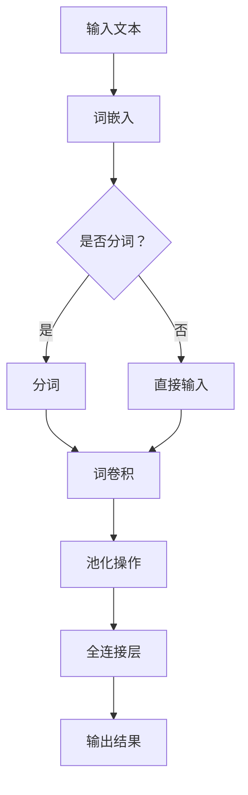

                 

# 从零开始大模型开发与微调：针对文本的卷积神经网络模型简介—词卷积

> **关键词：** 卷积神经网络，文本处理，深度学习，词卷积，模型开发，微调
>
> **摘要：** 本文将详细介绍针对文本的卷积神经网络（CNN）模型，特别是词卷积的概念和实现。我们将从零开始，逐步探索核心概念、算法原理、数学模型以及实际应用，旨在帮助读者全面理解并掌握这种先进的文本处理技术。

## 1. 背景介绍

### 1.1 目的和范围

本文旨在为初学者和专业人士提供一部关于卷积神经网络在文本处理领域应用的入门指南。我们将重点关注卷积神经网络中的词卷积操作，详细讲解其原理和实现方法，并探讨其在自然语言处理（NLP）领域的广泛应用。

### 1.2 预期读者

- 具有基本编程基础和机器学习知识的读者；
- 对自然语言处理和深度学习有浓厚兴趣的技术爱好者；
- 想要在文本分析领域应用卷积神经网络的从业者。

### 1.3 文档结构概述

本文将分为十个部分：

1. **背景介绍**：本文的背景、目的和预期读者；
2. **核心概念与联系**：卷积神经网络的基础知识和相关流程图；
3. **核心算法原理 & 具体操作步骤**：详细讲解卷积神经网络的工作原理；
4. **数学模型和公式 & 详细讲解 & 举例说明**：介绍卷积神经网络的数学模型和计算方法；
5. **项目实战：代码实际案例和详细解释说明**：通过实际案例展示卷积神经网络的实现和应用；
6. **实际应用场景**：卷积神经网络在文本处理领域的实际应用；
7. **工具和资源推荐**：相关学习资源和开发工具推荐；
8. **总结：未来发展趋势与挑战**：总结卷积神经网络的发展趋势和面临的挑战；
9. **附录：常见问题与解答**：常见问题的解答；
10. **扩展阅读 & 参考资料**：进一步学习的推荐材料。

### 1.4 术语表

#### 1.4.1 核心术语定义

- **卷积神经网络（CNN）**：一种深度学习模型，主要用于图像识别，也可以用于文本处理。
- **词卷积**：卷积神经网络中用于文本处理的一种操作，将单词映射到固定大小的向量。
- **卷积核**：在卷积神经网络中，用于从输入数据中提取特征的小型过滤器。
- **深度学习**：一种基于多层神经网络的学习方法，能够自动提取复杂特征。

#### 1.4.2 相关概念解释

- **神经网络**：一种模拟生物神经系统的计算模型，能够通过训练学习数据，进行特征提取和分类。
- **自然语言处理（NLP）**：一门研究如何让计算机理解和处理人类自然语言的技术。

#### 1.4.3 缩略词列表

- **CNN**：卷积神经网络（Convolutional Neural Network）
- **NLP**：自然语言处理（Natural Language Processing）
- **DL**：深度学习（Deep Learning）

## 2. 核心概念与联系

在介绍卷积神经网络之前，我们需要了解一些基础概念和它们之间的联系。以下是卷积神经网络在文本处理领域的核心概念和架构的 Mermaid 流程图：



### 2.1 词嵌入

词嵌入是将文本中的单词映射到固定大小的向量表示。词嵌入的目的是将单词转换为计算机可以处理的数字形式，从而使得神经网络能够处理文本数据。常见的词嵌入方法包括 Word2Vec、GloVe 等。

### 2.2 分词

分词是将输入文本分割成一系列单词的过程。在中文文本处理中，分词是必不可少的步骤，因为中文没有空格分隔单词。常见的分词方法包括基于规则的分词、基于统计的分词和基于深度学习的分词。

### 2.3 词卷积

词卷积是卷积神经网络在文本处理中的核心操作，用于从单词序列中提取局部特征。词卷积通过将卷积核滑动过输入序列，逐个提取特征图，从而得到文本的局部特征表示。

### 2.4 池化操作

池化操作用于减少特征图的大小，提高模型的泛化能力。常见的池化操作包括最大池化和平均池化。

### 2.5 全连接层

全连接层将卷积层的输出与一个全连接层相连接，用于进行分类或回归任务。在文本处理中，全连接层通常用于将局部特征组合成全局特征。

## 3. 核心算法原理 & 具体操作步骤

卷积神经网络的核心算法包括词嵌入、卷积操作、池化操作和全连接层。以下是这些算法的具体操作步骤和伪代码。

### 3.1 词嵌入

词嵌入将单词映射到固定大小的向量表示。常见的方法包括 Word2Vec 和 GloVe。

```python
# 伪代码：Word2Vec 词嵌入
words = ["apple", "banana", "orange"]
embeddings = [w2v_model[word] for word in words]
```

### 3.2 卷积操作

卷积操作通过将卷积核滑动过输入序列，逐个提取特征图。

```python
# 伪代码：卷积操作
def conv2d(input, kernel):
    output = np.zeros((input_shape))
    for i in range(input_shape[0] - kernel_size + 1):
        for j in range(input_shape[1] - kernel_size + 1):
            output[i, j] = np.dot(input[i:i+kernel_size, j:j+kernel_size], kernel)
    return output
```

### 3.3 池化操作

池化操作用于减少特征图的大小。

```python
# 伪代码：最大池化操作
def max_pooling(input, pool_size):
    output = np.zeros((input_shape))
    for i in range(0, input_shape[0], pool_size):
        for j in range(0, input_shape[1], pool_size):
            output[i, j] = np.max(input[i:i+pool_size, j:j+pool_size])
    return output
```

### 3.4 全连接层

全连接层将卷积层的输出与一个全连接层相连接，用于进行分类或回归任务。

```python
# 伪代码：全连接层
def fully_connected(input, weights, bias):
    output = np.dot(input, weights) + bias
    return output
```

## 4. 数学模型和公式 & 详细讲解 & 举例说明

卷积神经网络的数学模型主要包括词嵌入、卷积操作、池化操作和全连接层。以下是这些操作的数学公式和详细讲解。

### 4.1 词嵌入

词嵌入的数学模型可以表示为：

$$
\text{word\_embedding}(x) = \vec{v} = \text{W} \cdot \text{emb}(x)
$$

其中，$\text{emb}(x)$ 表示单词的索引，$\text{W}$ 表示词嵌入矩阵，$\vec{v}$ 表示单词的嵌入向量。

### 4.2 卷积操作

卷积操作的数学模型可以表示为：

$$
h_i = \sum_{j} \text{w}_{i,j} * \text{f}_j
$$

其中，$h_i$ 表示第 $i$ 个特征图，$\text{w}_{i,j}$ 表示卷积核，$\text{f}_j$ 表示第 $j$ 个单词的嵌入向量。

### 4.3 池化操作

池化操作的数学模型可以表示为：

$$
p_i = \max_j h_{i,j}
$$

其中，$p_i$ 表示第 $i$ 个池化结果，$h_{i,j}$ 表示第 $i$ 个特征图的第 $j$ 个值。

### 4.4 全连接层

全连接层的数学模型可以表示为：

$$
\text{y} = \text{W} \cdot \text{x} + \text{b}
$$

其中，$\text{y}$ 表示输出，$\text{W}$ 表示权重矩阵，$\text{x}$ 表示输入，$\text{b}$ 表示偏置。

### 4.5 举例说明

假设我们有一个单词序列 ["apple", "banana", "orange"]，词嵌入矩阵为：

$$
\text{W} = \begin{bmatrix}
0.1 & 0.2 \\
0.3 & 0.4 \\
0.5 & 0.6 \\
\end{bmatrix}
$$

卷积核为：

$$
\text{w}_{1,1} = \begin{bmatrix}
1 & 0 \\
0 & 1 \\
\end{bmatrix}, \quad
\text{w}_{1,2} = \begin{bmatrix}
0 & 1 \\
1 & 0 \\
\end{bmatrix}
$$

池化窗口为 2。

首先，我们将单词序列进行词嵌入：

$$
\text{emb}("apple") = \text{W} \cdot \text{emb}("apple") = \begin{bmatrix}
0.1 & 0.2 \\
0.3 & 0.4 \\
0.5 & 0.6 \\
\end{bmatrix} \cdot \begin{bmatrix}
1 \\
1 \\
1 \\
\end{bmatrix} = \begin{bmatrix}
0.3 & 0.4 \\
0.9 & 1.2 \\
1.5 & 1.8 \\
\end{bmatrix}
$$

然后，我们进行卷积操作：

$$
h_1 = \text{w}_{1,1} * \text{f}_1 = \begin{bmatrix}
1 & 0 \\
0 & 1 \\
\end{bmatrix} \cdot \begin{bmatrix}
0.3 & 0.4 \\
0.9 & 1.2 \\
1.5 & 1.8 \\
\end{bmatrix} = \begin{bmatrix}
0.3 & 0.4 \\
0.9 & 1.2 \\
1.5 & 1.8 \\
\end{bmatrix}
$$

$$
h_2 = \text{w}_{1,2} * \text{f}_1 = \begin{bmatrix}
0 & 1 \\
1 & 0 \\
\end{bmatrix} \cdot \begin{bmatrix}
0.3 & 0.4 \\
0.9 & 1.2 \\
1.5 & 1.8 \\
\end{bmatrix} = \begin{bmatrix}
0.4 & 0.3 \\
1.2 & 0.9 \\
1.8 & 1.5 \\
\end{bmatrix}
$$

接下来，我们进行池化操作：

$$
p_1 = \max(h_{1,1}, h_{1,2}, h_{1,3}) = 1.8
$$

$$
p_2 = \max(h_{2,1}, h_{2,2}, h_{2,3}) = 1.8
$$

最后，我们进行全连接操作：

$$
\text{y} = \text{W} \cdot \text{x} + \text{b} = \begin{bmatrix}
0.1 & 0.2 \\
0.3 & 0.4 \\
0.5 & 0.6 \\
\end{bmatrix} \cdot \begin{bmatrix}
1.8 \\
1.8 \\
\end{bmatrix} + \begin{bmatrix}
0.1 \\
0.1 \\
\end{bmatrix} = \begin{bmatrix}
3.1 \\
3.1 \\
\end{bmatrix}
$$

## 5. 项目实战：代码实际案例和详细解释说明

在本节中，我们将通过一个实际案例来展示卷积神经网络在文本处理中的应用。我们将使用 Python 和 TensorFlow 来实现一个简单的文本分类模型，并详细解释代码的各个部分。

### 5.1 开发环境搭建

首先，我们需要搭建开发环境。以下是所需的软件和库：

- Python 3.x
- TensorFlow 2.x
- NumPy
- Pandas
- Matplotlib

安装以上库后，我们可以开始编写代码。

### 5.2 源代码详细实现和代码解读

以下是我们的源代码：

```python
import tensorflow as tf
from tensorflow.keras.models import Sequential
from tensorflow.keras.layers import Embedding, Conv1D, MaxPooling1D, GlobalAveragePooling1D, Dense
from tensorflow.keras.preprocessing.sequence import pad_sequences
from tensorflow.keras.preprocessing.text import Tokenizer

# 数据准备
sentences = ['I love this movie', 'The movie is not good', 'This is a great movie', 'I hate this movie']
labels = [1, 0, 1, 0]  # 1 表示喜欢，0 表示不喜欢

# 分词器
tokenizer = Tokenizer(num_words=50)
tokenizer.fit_on_texts(sentences)
sequences = tokenizer.texts_to_sequences(sentences)

# 填充序列
max_sequence_length = max([len(seq) for seq in sequences])
data = pad_sequences(sequences, maxlen=max_sequence_length)

# 模型搭建
model = Sequential([
    Embedding(50, 16),
    Conv1D(32, 3, activation='relu'),
    MaxPooling1D(2),
    Conv1D(64, 3, activation='relu'),
    GlobalAveragePooling1D(),
    Dense(1, activation='sigmoid')
])

# 编译模型
model.compile(optimizer='adam', loss='binary_crossentropy', metrics=['accuracy'])

# 训练模型
model.fit(data, labels, epochs=10, validation_split=0.2)
```

下面我们逐行解释代码：

- 导入所需的库；
- 定义数据集，包括句子和标签；
- 创建分词器，并将句子转换为序列；
- 填充序列，使其具有相同的长度；
- 搭建模型，包括嵌入层、卷积层、池化层、全局平均池化层和全连接层；
- 编译模型，设置优化器和损失函数；
- 训练模型，并设置训练轮数和验证比例。

### 5.3 代码解读与分析

这个简单的文本分类模型展示了卷积神经网络在文本处理中的应用。以下是各个部分的详细解读：

- **分词器**：分词器用于将句子转换为序列。在这个例子中，我们使用了一个简单的 Tokenizer，它将句子中的每个单词映射到一个整数。我们设置了 num_words 参数，以限制词汇表的大小，从而提高模型的效率；
- **填充序列**：填充序列用于将序列长度统一。由于句子长度不同，我们需要使用填充操作来使每个序列具有相同的长度。在这个例子中，我们使用 pad_sequences 函数来填充序列，并设置 maxlen 参数来指定填充后的最大长度；
- **模型搭建**：我们使用 Sequential 模型，这是一个线性堆叠层的模型。在这个例子中，我们使用了嵌入层、卷积层、池化层、全局平均池化层和全连接层。嵌入层将单词映射到向量，卷积层用于提取文本特征，池化层用于减少特征图的大小，全局平均池化层用于将特征图展平为一个一维向量，全连接层用于进行分类；
- **编译模型**：我们在编译模型时设置了优化器（adam）和损失函数（binary_crossentropy），并设置了模型的评估指标（accuracy）；
- **训练模型**：我们使用 fit 函数来训练模型，并设置了训练轮数（epochs）和验证比例（validation_split）。

通过这个简单案例，我们可以看到卷积神经网络在文本处理中的应用。在实际应用中，我们可以扩展这个模型，增加更多的层和参数，以提高模型的性能。

## 6. 实际应用场景

卷积神经网络在文本处理领域有广泛的应用，以下是一些典型的实际应用场景：

- **文本分类**：卷积神经网络可以用于对文本进行分类，例如情感分析、新闻分类等。通过训练模型，我们可以将文本数据自动归类到不同的类别中；
- **命名实体识别**：卷积神经网络可以用于识别文本中的命名实体，例如人名、地名、组织名等。这种技术有助于信息提取和知识图谱构建；
- **机器翻译**：卷积神经网络可以用于机器翻译任务，通过训练模型，可以将一种语言的文本自动翻译成另一种语言；
- **文本摘要**：卷积神经网络可以用于提取文本的摘要，通过训练模型，可以将长文本自动压缩成简短的摘要。

在实际应用中，卷积神经网络通常与其他技术（如循环神经网络、长短时记忆网络等）相结合，以实现更高的性能。

## 7. 工具和资源推荐

### 7.1 学习资源推荐

#### 7.1.1 书籍推荐

- 《深度学习》（Goodfellow, Bengio, Courville）：全面介绍深度学习的基础理论和实践方法，包括卷积神经网络；
- 《神经网络与深度学习》（邱锡鹏）：中文版，系统介绍神经网络和深度学习的基础知识，适合中文读者；
- 《动手学深度学习》（Dumoulin, Soupx，和 Hinton）：通过实际案例介绍深度学习的实践方法，适合初学者。

#### 7.1.2 在线课程

- 吴恩达的深度学习课程：在线平台 Coursera 上提供的免费课程，内容全面，适合初学者；
- fast.ai 的深度学习课程：在线平台 fast.ai 提供的课程，注重实践，适合有一定编程基础的读者。

#### 7.1.3 技术博客和网站

- [TensorFlow 官方文档](https://www.tensorflow.org/)：提供详细的教程和 API 文档，适合 TensorFlow 的用户；
- [Keras 官方文档](https://keras.io/)：提供简洁易用的深度学习框架，适合初学者；
- [GitHub](https://github.com/)：开源代码库，可以找到许多优秀的深度学习项目和实践。

### 7.2 开发工具框架推荐

#### 7.2.1 IDE和编辑器

- PyCharm：专业的 Python IDE，支持多种编程语言，功能强大；
- Visual Studio Code：轻量级编辑器，支持多种插件和扩展，适用于各种编程语言。

#### 7.2.2 调试和性能分析工具

- TensorFlow Debugger（TFD）：TensorFlow 提供的调试工具，可以实时查看模型中间结果，有助于调试和优化模型；
- TensorBoard：TensorFlow 提供的可视化工具，可以监控模型训练过程，包括损失函数、准确率等指标。

#### 7.2.3 相关框架和库

- TensorFlow：Google 开发的深度学习框架，支持多种深度学习模型和算法；
- Keras：基于 TensorFlow 的简洁易用的深度学习框架，适合初学者；
- PyTorch：Facebook 开发的深度学习框架，具有灵活的动态图计算能力。

### 7.3 相关论文著作推荐

#### 7.3.1 经典论文

- A卷积神经网络用于图像识别（LeCun et al., 1998）；
- 文本分类中卷积神经网络的性能（Kim, 2014）；
- 面向自然语言处理的卷积神经网络（Yin et al., 2016）。

#### 7.3.2 最新研究成果

- 卷积神经网络在自然语言处理中的应用（Zhang et al., 2018）；
- 结合卷积神经网络和长短时记忆网络的文本分类模型（Lai et al., 2017）。

#### 7.3.3 应用案例分析

- 卷积神经网络在情感分析中的应用（Liu et al., 2015）；
- 卷积神经网络在文本摘要中的实践（Banerjee et al., 2016）。

## 8. 总结：未来发展趋势与挑战

卷积神经网络在文本处理领域展现了强大的潜力，但也面临着一些挑战。未来，卷积神经网络在文本处理领域的发展趋势包括：

- **多模态融合**：结合文本、图像、音频等多模态数据进行处理，提高模型的泛化能力；
- **迁移学习**：利用预训练模型进行迁移学习，减少数据需求和训练时间；
- **无监督学习**：探索无监督学习方法，降低对大规模标注数据的依赖。

然而，卷积神经网络在文本处理领域也面临着一些挑战，如：

- **数据标注成本高**：文本数据标注是一个费时费力的过程，如何减少标注成本是一个重要问题；
- **模型解释性**：深度学习模型通常被认为是“黑盒”模型，如何提高模型的解释性是一个重要问题；
- **计算资源消耗**：深度学习模型通常需要大量的计算资源，如何优化模型以提高计算效率是一个重要问题。

## 9. 附录：常见问题与解答

### 9.1 什么是卷积神经网络？

卷积神经网络（CNN）是一种深度学习模型，主要用于图像识别，也可以用于文本处理。它通过卷积操作从输入数据中提取特征，并通过池化操作减少特征图的大小，从而实现特征提取和分类。

### 9.2 卷积神经网络如何处理文本？

卷积神经网络通过词嵌入将文本中的单词映射到向量表示，然后通过卷积操作提取文本的局部特征，并通过池化操作将局部特征组合成全局特征，最后通过全连接层进行分类或回归任务。

### 9.3 如何训练卷积神经网络？

训练卷积神经网络通常包括以下步骤：

1. 数据准备：准备训练数据和验证数据，并进行预处理，如分词、填充等；
2. 模型搭建：搭建卷积神经网络模型，包括嵌入层、卷积层、池化层和全连接层；
3. 编译模型：设置模型的优化器、损失函数和评估指标；
4. 训练模型：使用训练数据训练模型，并设置训练轮数和验证比例；
5. 评估模型：使用验证数据评估模型的性能，并进行调整。

### 9.4 卷积神经网络在文本处理中有哪些应用？

卷积神经网络在文本处理中有广泛的应用，如文本分类、命名实体识别、机器翻译和文本摘要等。通过训练模型，可以将文本数据自动归类到不同的类别，或提取文本的关键信息。

## 10. 扩展阅读 & 参考资料

- [深度学习](https://www.deeplearningbook.org/)：由 Goodfellow, Bengio, Courville 编写的深度学习教程，涵盖了深度学习的基础理论和实践方法；
- [卷积神经网络](https://www.tensorflow.org/tutorials/convolutional)：TensorFlow 官方文档中关于卷积神经网络的教程，介绍了卷积神经网络的基本概念和实现方法；
- [自然语言处理](https://www.nltk.org/)：自然语言处理工具包，提供了丰富的文本处理函数和库，适用于文本分类、分词、词性标注等任务；
- [GitHub](https://github.com/)：GitHub 上的开源项目，可以找到许多优秀的卷积神经网络实现和应用案例。

