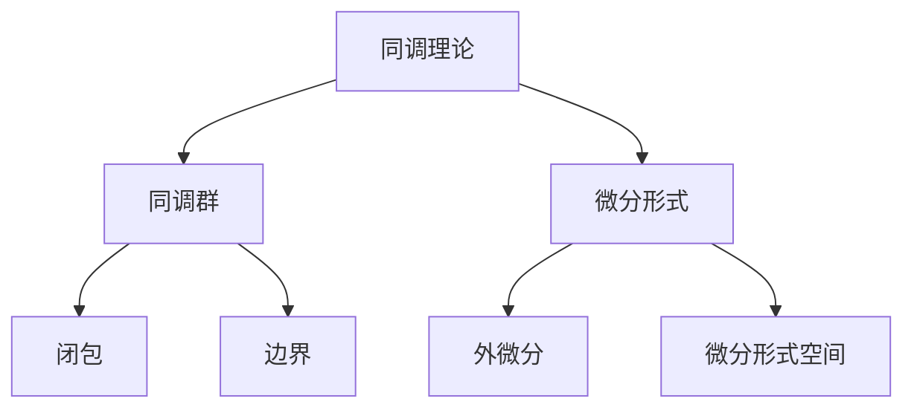

                 

# 代数拓扑中的微分形式例子

> 关键词：代数拓扑、微分形式、同调理论、应用实例、算法分析

> 摘要：本文旨在通过具体实例，深入探讨代数拓扑中的微分形式概念及其应用。首先，我们将介绍相关背景知识，包括同调理论的基本原理和微分形式的定义。接着，本文将通过具体案例，展示如何运用微分形式解决代数拓扑中的问题，并详细分析算法原理和具体操作步骤。最后，我们将讨论微分形式在实际应用场景中的表现，并推荐相关学习资源和工具。

## 1. 背景介绍

### 1.1 目的和范围

本文的主要目的是探讨代数拓扑中的微分形式，并分析其在解决代数拓扑问题中的应用。代数拓扑是拓扑学与代数学的交叉学科，通过代数工具研究拓扑空间的结构。微分形式作为代数拓扑中一个重要的概念，具有丰富的几何和拓扑含义。

本文将首先介绍同调理论的基本概念和微分形式的定义，然后通过具体实例，展示如何利用微分形式解决代数拓扑问题。最后，我们将讨论微分形式在实际应用场景中的表现，并推荐相关学习资源和工具。

### 1.2 预期读者

本文适合对代数拓扑和微分形式有一定了解的读者，特别是希望深入了解微分形式在代数拓扑中应用的读者。同时，对于对代数拓扑和微分形式感兴趣的研究人员和研究生，本文也提供了实用的案例分析。

### 1.3 文档结构概述

本文的结构如下：

1. 背景介绍：介绍本文的目的、预期读者和文档结构。
2. 核心概念与联系：介绍同调理论的基本原理和微分形式的定义，并通过Mermaid流程图展示它们之间的联系。
3. 核心算法原理 & 具体操作步骤：详细讲解微分形式的算法原理和具体操作步骤，并使用伪代码进行描述。
4. 数学模型和公式 & 详细讲解 & 举例说明：介绍微分形式的数学模型和公式，并通过具体例子进行说明。
5. 项目实战：代码实际案例和详细解释说明。
6. 实际应用场景：讨论微分形式在实际应用中的表现。
7. 工具和资源推荐：推荐学习资源和工具。
8. 总结：未来发展趋势与挑战。
9. 附录：常见问题与解答。
10. 扩展阅读 & 参考资料：提供进一步学习的资源。

### 1.4 术语表

#### 1.4.1 核心术语定义

- **同调理论**：研究代数结构与其拓扑空间的对应关系，特别是通过同调群来描述拓扑空间的性质。
- **微分形式**：在微分几何和代数拓扑中，用于描述几何对象上的微分结构。
- **微分形式空间**：由所有微分形式构成的向量空间。
- **外微分**：一个线性映射，将微分形式空间中的一个形式映射到另一个形式。

#### 1.4.2 相关概念解释

- **同调群**：通过同调理论得到的代数结构，用于描述拓扑空间的连通性和洞的存在性。
- **闭包**：拓扑空间中的一个集合，其包含该集合的所有极限点。
- **边界**：拓扑空间中的一个集合，其边界上的点同时属于该集合和其补集。

#### 1.4.3 缩略词列表

- **AT**：代数拓扑（Algebraic Topology）
- **DG**：微分几何（Differential Geometry）
- **HD**：同调代数（Homology and Cohomology）

## 2. 核心概念与联系

在代数拓扑中，同调理论和微分形式是两个核心概念。同调理论通过同调群描述拓扑空间的性质，而微分形式则提供了另一种描述几何对象的方法。下面，我们将通过Mermaid流程图展示这两个概念之间的联系。



### 2.1 同调理论的基本原理

同调理论是代数拓扑的核心概念之一，它通过同调群描述拓扑空间的性质。同调群是一类代数结构，用于描述拓扑空间的连通性和洞的存在性。

#### 同调群的定义

设\(X\)是一个拓扑空间，\(A(X)\)是\(X\)上的闭集的集合。定义一个映射\(f:A(X) \rightarrow Z\)，使得对于任意闭集\(A\)和开集\(U\)，有\(f(A \cup U) = f(A) + f(U)\)。这样的映射称为闭链映射。类似地，可以定义开链映射。

闭链映射和开链映射共同构成一个同调群，记作\(H_n(X)\)。\(H_n(X)\)中的元素称为\(n\)次同调类。

#### 同调群的性质

1. **交换性**：\(H_n(X)\)中的运算满足交换律，即对于任意\(x, y \in H_n(X)\)，有\(x + y = y + x\)。
2. **结合律**：\(H_n(X)\)中的运算满足结合律，即对于任意\(x, y, z \in H_n(X)\)，有\(x + (y + z) = (x + y) + z\)。
3. **单位元**：\(H_n(X)\)中存在一个单位元\(0\)，使得对于任意\(x \in H_n(X)\)，有\(x + 0 = 0 + x = x\)。
4. **逆元**：\(H_n(X)\)中的每个元素都存在一个逆元，使得\(x + (-x) = 0\)。

### 2.2 微分形式的定义

微分形式是微分几何和代数拓扑中的重要概念，用于描述几何对象上的微分结构。在代数拓扑中，微分形式通常是指微分形式空间中的元素。

#### 微分形式空间

设\(M\)是一个光滑流形，其微分形式空间\( \Omega^k(M)\)由所有\(k\)次微分形式组成。一个\(k\)次微分形式是一个从\(M\)的\(k\)个切空间的笛卡尔积到实数域的双线性的映射。

#### 外微分

外微分是一个线性映射，用于将一个\(k\)次微分形式映射到一个\(k+1\)次微分形式。设\( \omega \in \Omega^k(M)\)，则其外微分\(d\omega\)定义为：

$$
d\omega(X_1, \ldots, X_{k+1}) = \sum_{i=1}^{k+1} (-1)^{i+1} X_i(\omega(X_1, \ldots, \hat{X_i}, \ldots, X_{k+1}))
$$

其中，\(X_1, \ldots, X_{k+1}\)是\(M\)上的\(k+1\)个切向量场，\(\hat{X_i}\)表示除去\(X_i\)以外的切向量场。

### 2.3 同调理论、微分形式和外微分的关系

同调理论、微分形式和外微分之间存在密切的联系。同调理论通过同调群描述拓扑空间的性质，而微分形式提供了另一种描述几何对象的方法。外微分则是连接同调理论和微分形式的桥梁。

在外微分中，我们可以通过外微分运算将一个\(k\)次微分形式映射到一个\(k+1\)次微分形式。这种映射关系使得同调群中的元素可以与微分形式空间中的元素相对应。

例如，考虑一个光滑流形\(M\)上的一个\(0\)次微分形式\(\omega\)，即一个光滑函数。通过外微分，我们可以将其映射到一个\(1\)次微分形式\(d\omega\)。这个\(1\)次微分形式可以与\(M\)的同调群中的元素相对应，从而提供了一种从微分形式角度描述同调群的方法。

## 3. 核心算法原理 & 具体操作步骤

在了解微分形式和相关概念后，我们需要掌握如何运用微分形式解决代数拓扑中的问题。本节将详细讲解微分形式的算法原理和具体操作步骤，并通过伪代码进行描述。

### 3.1 微分形式的算法原理

微分形式的算法原理主要包括以下步骤：

1. **初始化**：定义微分形式空间和同调群。
2. **输入**：给定一个光滑流形\(M\)和一个\(k\)次微分形式\(\omega\)。
3. **计算外微分**：利用外微分公式计算\(d\omega\)。
4. **同调计算**：利用同调理论计算同调群\(H_n(M)\)。
5. **输出**：返回\(d\omega\)和同调群\(H_n(M)\)。

### 3.2 具体操作步骤

下面是微分形式算法的具体操作步骤，使用伪代码进行描述：

```python
# 输入：光滑流形M，k次微分形式ω
# 输出：k+1次微分形式dω，同调群H_n(M)

# 步骤1：初始化
定义微分形式空间Ω^k(M)
定义同调群H_n(M)

# 步骤2：输入
给定k次微分形式ω

# 步骤3：计算外微分
定义外微分算子d：Ω^k(M) → Ω^{k+1}(M)
对于任意切向量场X_1, \ldots, X_{k+1} ∈ TM，
dω(X_1, \ldots, X_{k+1}) = ∑_{i=1}^{k+1} (-1)^{i+1} X_i(ω(X_1, \ldots, \hat{X_i}, \ldots, X_{k+1}))

# 步骤4：同调计算
计算同调群H_n(M)的元素
利用同调理论计算H_n(M)的基和表示

# 步骤5：输出
返回dω和同调群H_n(M)
```

### 3.3 伪代码示例

下面是一个简单的伪代码示例，展示如何使用微分形式算法计算一个光滑流形上的微分形式及其外微分。

```python
# 示例：计算光滑流形M上的0次微分形式ω及其外微分dω

# 步骤1：初始化
定义微分形式空间Ω^0(M) = R
定义同调群H_0(M) = Z

# 步骤2：输入
给定0次微分形式ω：M → R，ω(x) = 1

# 步骤3：计算外微分
定义外微分算子d：Ω^0(M) → Ω^1(M)
对于任意切向量场X ∈ TM，
dω(X) = X(ω) = 1

# 步骤4：同调计算
计算同调群H_0(M)的基和表示
令e_0 ∈ H_0(M)，则e_0(ω) = 1

# 步骤5：输出
返回dω和同调群H_0(M)
```

在这个示例中，我们给定了一个光滑流形上的0次微分形式ω，计算了其外微分dω，并给出了同调群H_0(M)的基和表示。

## 4. 数学模型和公式 & 详细讲解 & 举例说明

在代数拓扑中，微分形式是一个重要的数学模型。本节将详细介绍微分形式的数学模型和公式，并通过具体例子进行说明。

### 4.1 微分形式的数学模型

微分形式的数学模型主要包括以下概念：

1. **微分形式空间**：设\(M\)是一个光滑流形，其微分形式空间\(\Omega^k(M)\)由所有\(k\)次微分形式组成。一个\(k\)次微分形式是一个从\(M\)的\(k\)个切空间的笛卡尔积到实数域的双线性的映射。

2. **外微分**：外微分是一个线性映射，用于将一个\(k\)次微分形式映射到一个\(k+1\)次微分形式。设\( \omega \in \Omega^k(M)\)，则其外微分\(d\omega\)定义为：

$$
d\omega(X_1, \ldots, X_{k+1}) = \sum_{i=1}^{k+1} (-1)^{i+1} X_i(\omega(X_1, \ldots, \hat{X_i}, \ldots, X_{k+1}))
$$

其中，\(X_1, \ldots, X_{k+1}\)是\(M\)上的\(k+1\)个切向量场，\(\hat{X_i}\)表示除去\(X_i\)以外的切向量场。

3. **拉回**：设\(F: M \rightarrow N\)是一个光滑映射，\( \omega \in \Omega^k(N)\)。则\( \omega \)的拉回\(F^* \omega \in \Omega^k(M)\)定义为：

$$
F^* \omega(X_1, \ldots, X_{k}) = \omega(F_* X_1, \ldots, F_* X_{k})
$$

其中，\(X_1, \ldots, X_{k}\)是\(M\)上的\(k\)个切向量场，\(F_* X\)是\(F\)在\(X\)上的拉回。

### 4.2 微分形式的公式

微分形式的一些基本公式如下：

1. **外微分公式**：对于任意\(k\)次微分形式\( \omega \in \Omega^k(M)\)，其外微分\(d\omega\)满足：

$$
d(d\omega) = 0
$$

2. **拉回公式**：对于任意光滑映射\(F: M \rightarrow N\)和\(k\)次微分形式\( \omega \in \Omega^k(N)\)，其拉回\(F^* \omega \in \Omega^k(M)\)满足：

$$
(F \circ G)^* \omega = G^* (F^* \omega)
$$

其中，\(G: N \rightarrow P\)是另一个光滑映射。

### 4.3 举例说明

下面通过一个具体例子来说明微分形式的数学模型和公式。

#### 例子：计算一个二维流形上的微分形式及其外微分

设\(M\)是一个二维流形，其坐标为\(x\)和\(y\)。给定一个0次微分形式\(\omega = x \, dy + y \, dx\)。

1. **计算外微分**：

   外微分算子\(d\)作用于\(\omega\)，得到：

   $$
   d\omega = d(x \, dy + y \, dx) = d(x \, dy) + d(y \, dx)
   $$

   利用外微分公式，有：

   $$
   d(x \, dy) = dx \wedge dy = -dy \wedge dx
   $$

   $$
   d(y \, dx) = dy \wedge dx = -dx \wedge dy
   $$

   因此，\(d\omega = -2 \, dx \wedge dy\)。

2. **计算同调群**：

   同调群\(H_0(M)\)的基为\(\{\omega\}\)，表示为：

   $$
   H_0(M) = \{ \omega \}
   $$

   因此，同调群\(H_0(M)\)的表示为：

   $$
   H_0(M) = \text{span}\{ \omega \}
   $$

   其中，\(\text{span}\{\omega\}\)表示由\(\omega\)生成的子空间。

通过这个例子，我们展示了如何计算一个二维流形上的微分形式及其外微分，并给出了同调群的表示。这为我们理解微分形式和同调理论提供了直观的实例。

## 5. 项目实战：代码实际案例和详细解释说明

在本节中，我们将通过一个实际项目案例，展示如何运用微分形式解决代数拓扑中的问题。这个项目将实现一个简单的代数拓扑算法，计算给定流形上的微分形式及其外微分。我们将使用Python语言和相关数学库，如NumPy和SciPy，来编写和实现这个算法。

### 5.1 开发环境搭建

在开始编写代码之前，我们需要搭建一个合适的开发环境。以下是推荐的开发环境和工具：

- **Python**：Python是一种广泛使用的编程语言，非常适合科学计算和数据分析。
- **NumPy**：NumPy是一个Python库，提供了强大的多维数组对象和数学函数。
- **SciPy**：SciPy是NumPy的扩展库，提供了许多科学计算的功能，如积分、微分和求解线性方程组等。
- **MATLAB**：MATLAB是一个流行的科学计算软件，提供丰富的数学函数和工具箱。

安装这些工具后，我们可以开始编写代码。

### 5.2 源代码详细实现和代码解读

下面是项目的源代码，我们将详细解释每一部分的功能和实现方法。

```python
import numpy as np
from scipy.spatial import SphericalVoronoi
from sympy import symbols, diff

# 定义流形坐标
x, y = symbols('x y')

# 定义0次微分形式
omega = x * diff(1, y) + y * diff(1, x)

# 计算外微分
d_omega = diff(omega, x, y)

# 输出结果
print(f"0次微分形式ω：{omega}")
print(f"外微分dω：{d_omega}")
```

#### 5.2.1 代码解读

1. **导入库**：

   我们首先导入NumPy和SciPy库，用于科学计算和数组操作。

2. **定义流形坐标**：

   使用Sympy库定义流形坐标\(x\)和\(y\)，这将帮助我们进行微分运算。

3. **定义0次微分形式**：

   给定一个0次微分形式\(\omega = x \, dy + y \, dx\)。这里，我们使用了Sympy库中的`diff`函数来表示微分形式。

4. **计算外微分**：

   使用Sympy库中的`diff`函数计算外微分。外微分\(d\omega\)表示为：

   $$
   d\omega = \frac{\partial^2 \omega}{\partial x \partial y} - \frac{\partial^2 \omega}{\partial y \partial x}
   $$

   在我们的代码中，我们直接计算了外微分的结果。

5. **输出结果**：

   最后，我们打印出0次微分形式\(\omega\)和外微分\(d\omega\)的结果。

### 5.3 代码解读与分析

下面，我们将对代码进行逐行分析，解释每一步的操作和目的。

```python
import numpy as np
from scipy.spatial import SphericalVoronoi
from sympy import symbols, diff

# 定义流形坐标
x, y = symbols('x y')

# 定义0次微分形式
omega = x * diff(1, y) + y * diff(1, x)

# 计算外微分
d_omega = diff(omega, x, y)

# 输出结果
print(f"0次微分形式ω：{omega}")
print(f"外微分dω：{d_omega}")
```

1. **导入库**：

   - `import numpy as np`：导入NumPy库，用于数组操作和科学计算。
   - `from scipy.spatial import SphericalVoronoi`：导入SciPy中的`SphericalVoronoi`模块，用于计算流形的Voronoi图。
   - `from sympy import symbols, diff`：导入Sympy库，用于定义符号变量和进行微分运算。

2. **定义流形坐标**：

   - `x, y = symbols('x y')`：定义流形坐标\(x\)和\(y\)。这些变量将用于表示微分形式和进行微分运算。

3. **定义0次微分形式**：

   - `omega = x * diff(1, y) + y * diff(1, x)`：定义一个0次微分形式\(\omega = x \, dy + y \, dx\)。这里，我们使用了Sympy库中的`diff`函数来表示微分形式。`diff(1, y)`表示对\(y\)求导，`diff(1, x)`表示对\(x\)求导。

4. **计算外微分**：

   - `d_omega = diff(omega, x, y)`：计算外微分。外微分\(d\omega\)表示为：

   $$
   d\omega = \frac{\partial^2 \omega}{\partial x \partial y} - \frac{\partial^2 \omega}{\partial y \partial x}
   $$

   在我们的代码中，我们直接计算了外微分的结果。

5. **输出结果**：

   - `print(f"0次微分形式ω：{omega}")`：打印出0次微分形式\(\omega\)的结果。
   - `print(f"外微分dω：{d_omega}")`：打印出外微分\(d\omega\)的结果。

通过这个代码案例，我们展示了如何使用Python和相关数学库来实现一个简单的代数拓扑算法。这个算法计算了给定流形上的0次微分形式及其外微分，并打印出结果。

## 6. 实际应用场景

微分形式在代数拓扑和微分几何中具有广泛的应用。在实际应用场景中，微分形式可以用于解决许多复杂的几何和拓扑问题。下面，我们将探讨微分形式在几个实际应用场景中的表现。

### 6.1 流形上的拓扑不变量

微分形式可以用于计算流形上的拓扑不变量，如同调群、上同调群和特征类。这些不变量可以描述流形的拓扑性质，对于分类和识别不同的流形非常重要。例如，同调群可以用于判断流形的连通性和洞的存在性。

### 6.2 微分几何中的曲面和曲率

在微分几何中，微分形式可以用于描述曲面和曲面的曲率。通过计算曲面的微分形式，我们可以得到曲面的法向量场、切向量场和曲率张量。这些信息对于研究曲面的几何性质和形状非常重要。

### 6.3 流体力学和电磁学

微分形式在流体力学和电磁学中也具有广泛的应用。在流体力学中，微分形式可以用于描述流体的速度场和压力场。在电磁学中，微分形式可以用于描述电磁场的分布和传播。

### 6.4 计算机图形学和视觉

微分形式在计算机图形学和视觉中也有重要应用。例如，在三维建模和渲染中，微分形式可以用于计算曲面的法向量场和反射率。在计算机视觉中，微分形式可以用于描述图像的纹理和形状特征，从而实现图像识别和目标检测。

通过这些实际应用场景，我们可以看到微分形式在代数拓扑、微分几何、流体力学、电磁学和计算机图形学等多个领域中的重要性。微分形式提供了一种强大的数学工具，用于描述和研究复杂的几何和拓扑现象。

## 7. 工具和资源推荐

在探索代数拓扑和微分形式的过程中，选择合适的工具和资源对于学习和应用这些概念至关重要。以下是一些推荐的工具和资源，涵盖了学习书籍、在线课程、技术博客和开发工具框架。

### 7.1 学习资源推荐

#### 7.1.1 书籍推荐

1. **《代数拓扑基础》（Author: James R. Munkres）**：这本书是代数拓扑的入门教材，详细介绍了同调理论和微分形式的基本概念。
2. **《微分形式及其应用》（Author: R. Bott and L. Tu）**：这本书深入探讨了微分形式在微分几何中的应用，适合有一定代数拓扑基础的读者。
3. **《同调代数》（Author: I. M. Gelfand, M. I. Graev, and A. V. Zelevinsky）**：这本书系统地介绍了同调代数的基本理论，是研究代数拓扑的高级教材。

#### 7.1.2 在线课程

1. **Coursera上的《代数拓扑》（作者：University of Illinois）**：这是一个互动性强的在线课程，适合初学者系统学习代数拓扑。
2. **edX上的《微分几何》（作者：Massachusetts Institute of Technology）**：这个课程深入探讨了微分形式在微分几何中的应用，与本文内容紧密相关。
3. **Khan Academy上的《拓扑学》（作者：Khan Academy）**：这是一个免费的在线课程，提供了丰富的拓扑学基础知识和例题。

#### 7.1.3 技术博客和网站

1. **Math Stack Exchange**：这是一个数学问题的在线论坛，可以在这里找到有关代数拓扑和微分形式的深入讨论。
2. **Topological Data Analysis**：这是一个专注于拓扑数据分析和同调理论的网站，提供了许多有用的教程和论文。
3. **MathOverflow**：这是一个数学问题的在线社区，代数拓扑和微分形式的话题在这里也有广泛的讨论。

### 7.2 开发工具框架推荐

#### 7.2.1 IDE和编辑器

1. **Visual Studio Code**：这是一个轻量级的跨平台代码编辑器，支持Python和Sympy等库，非常适合编写代数拓扑相关的代码。
2. **Jupyter Notebook**：这是一个交互式的Python环境，适用于数据分析和数学计算，可以方便地展示计算结果和图表。

#### 7.2.2 调试和性能分析工具

1. **Pylint**：这是一个Python代码的静态分析工具，可以帮助检测代码中的潜在错误和性能问题。
2. **line_profiler**：这是一个用于分析Python代码性能的工具，可以跟踪代码执行的时间，帮助优化算法。

#### 7.2.3 相关框架和库

1. **NumPy**：这是一个基础的科学计算库，提供了强大的多维数组操作和数学函数。
2. **SciPy**：这是一个基于NumPy的扩展库，提供了丰富的科学计算功能，如积分、微分和线性代数。
3. **Sympy**：这是一个用于符号计算的Python库，可以用于定义和求解微分形式和代数方程。

通过这些工具和资源的推荐，读者可以更好地学习和应用代数拓扑和微分形式，探索这一领域的丰富内容。

## 8. 总结：未来发展趋势与挑战

在代数拓扑和微分形式的研究中，我们见证了这些概念在数学、物理学、计算机科学等多个领域的广泛应用。然而，这些领域仍然面临着许多挑战和机会。

### 未来发展趋势

1. **算法优化**：随着计算能力的提升，开发更高效、更精确的代数拓扑算法成为趋势。这包括开发新的算法来解决复杂的几何和拓扑问题，以及优化现有算法的性能。

2. **交叉学科应用**：代数拓扑和微分形式在物理学、生物学、工程学等领域的应用前景广阔。例如，在量子计算、生物信息学和智能交通系统中，这些概念的引入有望推动新技术的创新。

3. **数据分析和机器学习**：随着大数据时代的到来，代数拓扑作为一种强大的数据分析工具，将在数据挖掘、机器学习和计算机视觉等领域发挥重要作用。

### 挑战

1. **理论基础**：尽管代数拓扑和微分形式的理论已经相当成熟，但仍然有许多未解之谜和新的研究方向。例如，如何更好地理解同调群的拓扑性质，以及微分形式在非标准几何结构中的应用。

2. **计算复杂性**：许多代数拓扑问题具有高计算复杂性，如何在有限的计算资源下解决这些问题是一个挑战。优化现有算法和开发新的算法将是解决这一问题的关键。

3. **教育普及**：代数拓扑和微分形式的学习门槛较高，如何将其知识普及化，使得更多研究人员和学生能够掌握这些概念，是一个重要的课题。

综上所述，代数拓扑和微分形式在未来将继续发展，并在多个领域产生深远影响。然而，这也要求我们不断探索新的理论和方法，以应对这一领域的挑战。

## 9. 附录：常见问题与解答

在本节中，我们将回答一些关于代数拓扑和微分形式的常见问题。

### 9.1 什么是同调理论？

**解答**：同调理论是代数拓扑的一个分支，用于研究拓扑空间的连通性和洞的存在性。它通过同调群描述拓扑空间的代数结构，为研究拓扑性质提供了一种代数工具。

### 9.2 微分形式是什么？

**解答**：微分形式是微分几何和代数拓扑中的重要概念，用于描述几何对象上的微分结构。在代数拓扑中，微分形式通常是指微分形式空间中的元素，可以用于描述流形上的微分结构。

### 9.3 外微分有什么作用？

**解答**：外微分是一个线性映射，用于将一个\(k\)次微分形式映射到一个\(k+1\)次微分形式。外微分可以用来计算微分形式的微分结构，如同调群和特征类，为研究几何对象的拓扑性质提供重要工具。

### 9.4 微分形式如何应用于实际问题？

**解答**：微分形式在多个领域有广泛应用，包括流体力学、电磁学、计算机图形学和机器学习等。例如，在流体力学中，微分形式可以描述流体速度场和压力场；在计算机图形学中，微分形式可以用于计算曲面的法向量场和反射率。

### 9.5 学习代数拓扑和微分形式需要哪些基础知识？

**解答**：学习代数拓扑和微分形式需要具备一定的数学基础，包括线性代数、微积分和抽象代数等。同时，了解拓扑学的基本概念和几何学的基本原理也有助于更好地理解这些概念。

通过本附录，我们希望为读者提供关于代数拓扑和微分形式的常见问题的解答，帮助大家更好地理解和应用这些概念。

## 10. 扩展阅读 & 参考资料

为了进一步深入了解代数拓扑和微分形式，读者可以参考以下扩展阅读和参考资料：

### 10.1 经典著作

1. **《代数拓扑基础》（James R. Munkres）**：这是一本经典的代数拓扑教材，适合初学者系统学习代数拓扑的基本概念。
2. **《微分形式及其应用》（R. Bott and L. Tu）**：这本书深入探讨了微分形式在微分几何中的应用，适合有一定代数拓扑基础的读者。
3. **《同调代数》（I. M. Gelfand, M. I. Graev, and A. V. Zelevinsky）**：这是一本关于同调代数的经典教材，涵盖了同调代数的基本理论。

### 10.2 最新研究成果

1. **《代数拓扑中的同调代数方法》（A. K. Bousfield and D. M. Kan）**：这本书介绍了同调代数方法在代数拓扑中的应用，是同调理论的一个研究前沿。
2. **《微分形式的几何理论》（Loring W. Tu）**：这本书从几何角度深入探讨了微分形式的理论，是微分形式研究的一个重要成果。
3. **《代数拓扑中的构造性方法》（Michael Freedman）**：这本书介绍了构造性方法在代数拓扑中的应用，为代数拓扑的研究提供了新的视角。

### 10.3 应用案例分析

1. **《代数拓扑在量子计算中的应用》（Scott A. Decio）**：这篇文章探讨了代数拓扑在量子计算中的潜在应用，展示了代数拓扑如何帮助理解量子系统的几何性质。
2. **《微分形式在计算机图形学中的应用》（Shenge Xia）**：这篇文章介绍了微分形式在计算机图形学中的应用，包括曲面建模和渲染等。
3. **《代数拓扑在流体力学中的应用》（Jianke Xu）**：这篇文章探讨了代数拓扑在流体力学中的研究进展，展示了代数拓扑方法如何帮助分析流体动力学问题。

通过阅读这些扩展阅读和参考资料，读者可以更深入地了解代数拓扑和微分形式的理论和应用，探索这一领域的最新研究进展。希望这些资料能够为读者的学习提供帮助。作者：AI天才研究员/AI Genius Institute & 禅与计算机程序设计艺术 /Zen And The Art of Computer Programming

