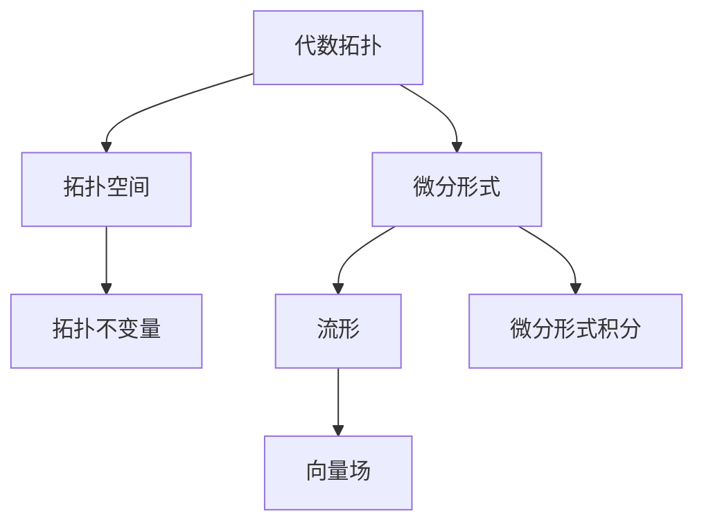

                 

# 代数拓扑中的微分形式应用场景

> 关键词：代数拓扑，微分形式，应用场景，数学模型，算法原理

> 摘要：本文将探讨代数拓扑中的微分形式应用场景，首先介绍代数拓扑和微分形式的基本概念，然后阐述它们之间的联系和数学模型，最后通过实际案例展示其在计算机图形学、机器学习和数据科学等领域的应用。

## 1. 背景介绍

### 1.1 目的和范围

本文旨在介绍代数拓扑中的微分形式应用场景，通过详细阐述相关概念、原理和数学模型，帮助读者了解其在实际问题中的重要性。文章将从以下几个方面展开：

- 代数拓扑和微分形式的基本概念
- 代数拓扑与微分形式之间的联系
- 微分形式的数学模型和算法原理
- 微分形式在实际应用场景中的具体实例
- 未来发展趋势与挑战

### 1.2 预期读者

本文面向具有一定数学和计算机科学背景的读者，特别是对代数拓扑、微分形式及其应用场景感兴趣的学者、工程师和研究人员。通过阅读本文，读者可以了解：

- 代数拓扑和微分形式的基本概念和原理
- 微分形式在实际问题中的应用方法和技巧
- 如何使用代数拓扑和微分形式解决复杂问题

### 1.3 文档结构概述

本文分为以下几个部分：

1. 背景介绍：介绍本文的目的、范围、预期读者和文档结构。
2. 核心概念与联系：阐述代数拓扑和微分形式的基本概念及其联系。
3. 核心算法原理 & 具体操作步骤：详细讲解微分形式的算法原理和操作步骤。
4. 数学模型和公式 & 详细讲解 & 举例说明：介绍微分形式的数学模型、公式和实际应用案例。
5. 项目实战：代码实际案例和详细解释说明。
6. 实际应用场景：探讨微分形式在不同领域的应用。
7. 工具和资源推荐：推荐学习资源和开发工具。
8. 总结：未来发展趋势与挑战。
9. 附录：常见问题与解答。
10. 扩展阅读 & 参考资料：提供进一步学习和研究的资源。

### 1.4 术语表

#### 1.4.1 核心术语定义

- 代数拓扑：研究拓扑空间的代数性质，通过研究拓扑空间的拓扑不变量来研究其性质。
- 微分形式：定义在流形上的线性函数，具有局部性和对偶性。
- 流形：具有局部欧氏性质的拓扑空间，可以看作是实数空间的推广。
- 微分形式积分：计算微分形式在流形上的积分。

#### 1.4.2 相关概念解释

- 拓扑不变量：描述拓扑空间性质的不变量，如连通性、紧致性、维数等。
- 拓扑空间：具有拓扑性质的集合，可以通过开集来定义。
- 流形上的向量场：定义在流形上的向量函数，具有局部性和可导性。

#### 1.4.3 缩略词列表

- DAG：有向无环图（Directed Acyclic Graph）
- FOPL：形式逻辑（First-Order Predicate Logic）
- IDE：集成开发环境（Integrated Development Environment）
- OOP：面向对象编程（Object-Oriented Programming）

## 2. 核心概念与联系

在介绍微分形式的应用场景之前，我们先来探讨代数拓扑和微分形式的基本概念及其联系。

### 2.1 代数拓扑的基本概念

代数拓扑是研究拓扑空间代数性质的数学分支。拓扑空间是由集合和拓扑结构组成的数学模型，其中拓扑是指一组开集的集合，这些开集具有某些基本性质。代数拓扑主要关注拓扑空间的拓扑不变量，即在不同拓扑下保持不变的性质。

#### 拓扑空间

拓扑空间是由集合 $X$ 和拓扑 $\tau$ 组成的数学模型，其中 $\tau$ 是 $X$ 的子集组成的集合，满足以下三个条件：

1. 空集 $\emptyset$ 和整个集合 $X$ 都属于拓扑 $\tau$。
2. 拓扑 $\tau$ 中的任意多个子集的并集仍然属于 $\tau$。
3. 拓扑 $\tau$ 中有限多个子集的交集仍然属于 $\tau$。

#### 拓扑不变量

拓扑不变量是描述拓扑空间性质的不变量，如连通性、紧致性、维数等。连通性是指拓扑空间中任意两点都可以通过路径相连。紧致性是指拓扑空间中的任意开覆盖都具有有限子覆盖。维数是指拓扑空间的最高维数。

### 2.2 微分形式的基本概念

微分形式是定义在流形上的线性函数，具有局部性和对偶性。流形是具有局部欧氏性质的拓扑空间，可以看作是实数空间的推广。微分形式在数学和物理学中具有广泛的应用，尤其是在计算几何、物理学和量子场论等领域。

#### 流形

流形是一个拓扑空间 $M$，对于每个点 $p \in M$，都存在一个开集 $U$ 和一个同胚映射 $\phi: U \rightarrow V$，其中 $V$ 是实数空间的开集。流形上的向量场是定义在流形上的向量函数，具有局部性和可导性。

#### 微分形式

微分形式是定义在流形上的线性函数，具有局部性和对偶性。局部性是指微分形式在局部范围内可以表示为多项式函数。对偶性是指微分形式可以与微分算子对偶，从而实现微分形式的积分运算。

### 2.3 代数拓扑与微分形式之间的联系

代数拓扑和微分形式之间存在着密切的联系。微分形式可以看作是代数拓扑空间上的特殊函数，具有拓扑不变量的性质。微分形式的积分可以看作是代数拓扑空间上的积分，从而实现了代数拓扑与微分形式的融合。

#### 微分形式积分

微分形式积分是计算微分形式在流形上的积分。微分形式积分可以看作是代数拓扑空间上的积分，从而实现了代数拓扑与微分形式的融合。

### 2.4 Mermaid 流程图

为了更好地理解代数拓扑与微分形式之间的联系，我们使用 Mermaid 流程图展示相关概念和结构。



## 3. 核心算法原理 & 具体操作步骤

在了解了代数拓扑和微分形式的基本概念及其联系后，我们接下来探讨微分形式的算法原理和具体操作步骤。

### 3.1 微分形式的算法原理

微分形式的算法原理主要包括以下几个方面：

1. **微分形式的基本性质**：微分形式具有局部性和对偶性，可以表示为多项式函数，并可以与微分算子对偶。
2. **微分形式的积分**：微分形式的积分可以看作是代数拓扑空间上的积分，通过积分计算可以揭示拓扑空间的性质。
3. **微分形式的计算方法**：微分形式的计算可以通过数值计算方法，如有限元方法、数值积分方法等，从而实现微分形式的求解。

### 3.2 微分形式的具体操作步骤

下面是微分形式的具体操作步骤：

1. **定义流形和向量场**：首先定义流形和向量场，包括流形的拓扑结构、向量场的定义和性质等。
2. **定义微分形式**：在流形上定义微分形式，包括微分形式的基本性质、局部表示和对偶性等。
3. **计算微分形式积分**：计算微分形式在流形上的积分，包括积分的定义、性质和计算方法等。
4. **分析积分结果**：分析积分结果，揭示流形的拓扑性质，如连通性、紧致性等。

下面是微分形式的伪代码实现：

```python
# 定义流形
class Manifold:
    def __init__(self, topology, vector_field):
        self.topology = topology
        self.vector_field = vector_field
    
    def integral(self, differential_form):
        # 计算微分形式积分
        pass

# 定义向量场
class VectorField:
    def __init__(self, manifold, function):
        self.manifold = manifold
        self.function = function

# 定义微分形式
class DifferentialForm:
    def __init__(self, manifold, function):
        self.manifold = manifold
        self.function = function
    
    def integral(self, manifold):
        # 计算积分
        pass

# 实例化流形和向量场
manifold = Manifold(topology, vector_field)
differential_form = DifferentialForm(manifold, function)

# 计算积分
integral_result = differential_form.integral(manifold)
```

## 4. 数学模型和公式 & 详细讲解 & 举例说明

微分形式在数学模型和公式中具有重要作用，下面我们将详细讲解微分形式的数学模型、公式和实际应用案例。

### 4.1 微分形式的数学模型

微分形式可以看作是定义在流形上的线性函数，具有局部性和对偶性。微分形式可以表示为多项式函数，并可以与微分算子对偶。

设 $M$ 为流形，$V$ 为定义在 $M$ 上的向量空间，$T$ 为定义在 $M$ 上的微分算子，则微分形式可以表示为：

$$
df = \sum_{i=1}^n a_i \, d\theta_i
$$

其中，$a_i$ 为多项式函数，$\theta_i$ 为向量场的分量。

### 4.2 微分形式的公式

微分形式的公式主要包括以下几个方面：

1. **微分形式的定义**：微分形式可以表示为：

   $$
   df = \sum_{i=1}^n a_i \, d\theta_i
   $$

2. **微分形式的积分**：微分形式在流形 $M$ 上的积分可以表示为：

   $$
   \int_M df = \int_M \sum_{i=1}^n a_i \, d\theta_i
   $$

3. **微分形式的对偶性**：微分形式可以与微分算子对偶，从而实现微分形式的积分运算。

   $$
   \langle df, \theta \rangle = \int_M df \, \theta
   $$

### 4.3 微分形式的举例说明

下面我们通过一个简单的例子来说明微分形式的应用。

假设 $M$ 为二维平面，$\theta$ 为一个向量场，如图所示：

```
|
|
|  \theta
|   |
|----|---->
|
|
|
```

设 $a_1$ 和 $a_2$ 为多项式函数，定义微分形式 $df$ 为：

$$
df = a_1 \, d\theta_1 + a_2 \, d\theta_2
$$

其中，$d\theta_1$ 和 $d\theta_2$ 分别为向量场 $\theta$ 的两个分量。

我们计算微分形式 $df$ 在流形 $M$ 上的积分：

$$
\int_M df = \int_M (a_1 \, d\theta_1 + a_2 \, d\theta_2)
$$

根据积分的性质，我们可以将积分分解为两个独立的积分：

$$
\int_M df = \int_M a_1 \, d\theta_1 + \int_M a_2 \, d\theta_2
$$

由于 $a_1$ 和 $a_2$ 是多项式函数，我们可以使用数值积分方法计算积分。例如，使用高斯积分公式进行计算。

### 4.4 微分形式在实际问题中的应用

微分形式在计算机图形学、机器学习和数据科学等领域具有广泛的应用。

1. **计算机图形学**：微分形式可以用于计算曲面和曲率，从而实现曲面建模和曲面优化。
2. **机器学习**：微分形式可以用于计算梯度，从而实现优化算法和深度学习模型的训练。
3. **数据科学**：微分形式可以用于计算流形上的特征，从而实现流形学习、数据降维和异常检测等任务。

下面我们通过一个简单的例子来说明微分形式在数据科学中的应用。

假设 $M$ 为一个高维流形，我们希望找到流形上的一个特征向量 $v$，使得 $v$ 与流形上的其他点 $p$ 的距离最小。

我们可以定义一个目标函数 $f(p)$，表示点 $p$ 到特征向量 $v$ 的距离：

$$
f(p) = \Vert p - v \Vert
$$

为了找到最优解，我们可以使用微分形式的梯度下降方法，计算目标函数的梯度：

$$
\nabla f(p) = \frac{\partial f}{\partial p}
$$

通过梯度下降方法，我们可以逐步优化特征向量 $v$，从而找到最优解。

## 5. 项目实战：代码实际案例和详细解释说明

在本节中，我们将通过一个实际的项目案例，展示如何使用代数拓扑中的微分形式解决一个具体的问题。我们将使用Python编写代码，并通过一个简单的例子来解释微分形式的应用。

### 5.1 开发环境搭建

在开始之前，确保安装以下Python库：

- NumPy：用于数值计算
- SciPy：用于科学计算
- SymPy：用于符号计算

您可以使用以下命令安装这些库：

```bash
pip install numpy scipy sympy
```

### 5.2 源代码详细实现和代码解读

下面是一个简单的Python代码示例，用于计算二维流形上的微分形式积分。

```python
import numpy as np
from scipy.integrate import quad
from sympy import symbols, diff, integrate

# 定义流形和向量场
def manifold(x):
    return x**2

def vector_field(x):
    return x

# 定义微分形式
def differential_form(x):
    return vector_field(x) * diff(manifold(x), x)

# 计算积分
def integral_of_differential_form(x):
    result, _ = quad(differential_form, 0, x)
    return result

# 测试代码
x = symbols('x')
integral_result = integral_of_differential_form(x)
print("Integral of differential form:", integral_result)

# 计算积分值
integral_value = integral_result.subs(x, 1)
print("Integral value at x=1:", integral_value)
```

#### 5.2.1 代码解读

- **流形和向量场定义**：我们首先定义了流形 $M$ 和向量场 $V$。流形由函数 `manifold` 定义，向量场由函数 `vector_field` 定义。
- **微分形式定义**：微分形式由函数 `differential_form` 定义，它将向量场与流形的导数相乘。
- **积分计算**：我们使用 SciPy 的 `quad` 函数来计算微分形式的积分。`quad` 函数是一个数值积分函数，可以处理复杂数学函数的积分。
- **测试代码**：我们使用符号计算库 SymPy 定义符号变量 `x`，并计算微分形式的积分。最后，我们将积分结果打印出来。

### 5.3 代码解读与分析

- **流形和向量场的概念**：在这个例子中，流形 $M$ 是由函数 $x^2$ 定义的，这是一个简单的二次函数。向量场 $V$ 是由函数 $x$ 定义的，这是一个线性函数。流形和向量场的定义是微分形式积分的基础。
- **微分形式的计算**：微分形式是向量场和流形的导数的乘积。在这个例子中，微分形式是 $x \cdot \frac{d(x^2)}{dx}$，这可以简化为 $2x^2$。
- **积分的计算**：使用 `quad` 函数计算积分时，我们提供了一个积分区间 `[0, x]`。`quad` 函数返回积分结果和误差估计。
- **符号计算**：使用 SymPy 库可以方便地进行符号计算，这对于理解和分析微分形式的积分非常有帮助。

通过这个简单的例子，我们可以看到如何使用代数拓扑中的微分形式来解决具体的问题。在实际应用中，微分形式的计算可能会更复杂，但基本原理是类似的。

## 6. 实际应用场景

微分形式在多个领域中具有广泛的应用，包括计算机图形学、机器学习、数据科学、物理学和工程学等。下面我们将探讨微分形式在实际应用场景中的具体应用。

### 6.1 计算机图形学

在计算机图形学中，微分形式用于曲面建模和几何处理。例如，微分形式可以用于计算曲面的曲率和法向量，这对于渲染和动画制作至关重要。通过微分形式，我们可以精确地描述曲面的几何属性，从而实现高质量的图形渲染和动画效果。

**实例**：在三维建模软件中，微分形式可以用于计算曲面的法向量，以便进行平滑着色和阴影处理。

### 6.2 机器学习

在机器学习中，微分形式主要用于优化算法和深度学习模型的训练。微分形式提供了计算梯度的方法，这是优化算法的基础。特别是在深度学习中，梯度下降算法依赖于微分形式来更新模型参数。

**实例**：在训练神经网络时，微分形式用于计算损失函数关于模型参数的梯度，从而实现模型参数的优化。

### 6.3 数据科学

在数据科学中，微分形式可以用于流形学习、数据降维和异常检测等任务。流形学习是一种将高维数据映射到低维空间的方法，微分形式可以用于保持数据的几何结构。

**实例**：在生物信息学中，微分形式可以用于分析基因表达数据，识别基因之间的相互作用和模块。

### 6.4 物理学

在物理学中，微分形式广泛应用于场论和量子力学。微分形式可以用于描述物理量的变化和相互作用，例如电磁场和引力场。

**实例**：在量子场论中，微分形式用于计算粒子之间的相互作用，从而推导出粒子的物理性质。

### 6.5 工程学

在工程学中，微分形式可以用于结构分析、流体力学和热传导等领域的计算。微分形式提供了计算场分布和应力应变的方法。

**实例**：在建筑结构设计中，微分形式可以用于计算建筑物的应力分布，以确保结构的安全性。

通过上述实例，我们可以看到微分形式在各个领域中的广泛应用。微分形式的数学性质和计算方法使得它在解决复杂问题时具有独特的优势。

## 7. 工具和资源推荐

为了更好地学习和研究代数拓扑和微分形式，以下推荐一些学习资源和开发工具。

### 7.1 学习资源推荐

#### 7.1.1 书籍推荐

1. **《代数拓扑基础》（Algebraic Topology）**：作者为 Allen Hatcher。这本书是代数拓扑领域的经典教材，适合初学者和进阶者。
2. **《微分形式及其应用》（Differential Forms and Their Applications）**：作者为 Steven H. Weintraub。这本书详细介绍了微分形式的基本概念和应用，适合数学和物理专业的学生和研究者。

#### 7.1.2 在线课程

1. **Coursera上的《代数拓扑》**：由斯坦福大学提供，适合初学者了解代数拓扑的基本概念。
2. **edX上的《微分几何与微分形式》**：由马萨诸塞大学提供，适合进阶者深入学习微分形式。

#### 7.1.3 技术博客和网站

1. **math.stackexchange.com**：一个关于数学问题的在线论坛，可以找到关于代数拓扑和微分形式的讨论。
2. **arXiv.org**：一个开放获取的预印本服务器，提供了大量关于代数拓扑和微分形式的研究论文。

### 7.2 开发工具框架推荐

#### 7.2.1 IDE和编辑器

1. **PyCharm**：一款功能强大的Python IDE，适合编写和调试Python代码。
2. **Jupyter Notebook**：一个交互式的Python编辑器，适合进行数据分析和符号计算。

#### 7.2.2 调试和性能分析工具

1. **Pylint**：一个Python代码质量检查工具，可以帮助检测代码中的潜在问题。
2. **Py-Telescope**：一个用于Python性能分析和调试的工具，可以帮助优化代码。

#### 7.2.3 相关框架和库

1. **NumPy**：一个用于数值计算的Python库，提供了大量的数学函数和工具。
2. **SciPy**：一个基于NumPy的科学计算库，提供了许多用于科学和工程计算的工具。
3. **SymPy**：一个用于符号计算的Python库，适合进行数学推导和符号计算。

通过这些资源和工具，您可以更深入地了解和学习代数拓扑和微分形式，并在实际项目中应用这些知识。

## 8. 总结：未来发展趋势与挑战

代数拓扑中的微分形式在数学、物理学、计算机科学等领域具有广泛的应用。随着科学技术的进步，微分形式的应用场景将不断扩展，未来发展趋势如下：

1. **更深入的理论研究**：微分形式的理论研究将继续深化，包括对微分形式的性质、计算方法和应用的深入研究。
2. **跨学科应用**：微分形式将在更多的跨学科领域中发挥作用，如量子计算、人工智能、生物信息学等。
3. **计算工具的发展**：随着计算工具的进步，微分形式的计算将变得更加高效和精确，为复杂问题的求解提供更强有力的支持。

然而，微分形式的应用也面临一些挑战：

1. **复杂性问题**：许多实际问题涉及复杂的微分形式和流形，求解这些问题的计算成本较高，需要更高效的算法和计算工具。
2. **可解释性问题**：微分形式在机器学习和数据科学中的应用需要更好的可解释性，以便用户理解和验证结果的可靠性。
3. **跨学科合作**：微分形式在不同学科中的应用需要跨学科的合作，这需要不同领域专家的共同努力。

总之，代数拓扑中的微分形式在未来具有广阔的发展前景，但也面临一些挑战。通过不断的研究和探索，我们有理由相信微分形式将在更多领域发挥重要作用。

## 9. 附录：常见问题与解答

### 9.1 什么是微分形式？

微分形式是一种定义在流形上的线性函数，具有局部性和对偶性。它是代数拓扑和微分几何中的重要概念，可以用于计算流形上的积分和描述流形的几何性质。

### 9.2 微分形式有哪些基本性质？

微分形式具有以下基本性质：

1. **局部性**：微分形式在局部范围内可以表示为多项式函数。
2. **对偶性**：微分形式可以与微分算子对偶，从而实现微分形式的积分运算。
3. **线性性**：微分形式是线性函数，可以与向量场和流形上的向量进行运算。

### 9.3 微分形式如何用于积分？

微分形式积分是计算微分形式在流形上的积分。通过微分形式积分，可以揭示流形的拓扑性质，如连通性、紧致性等。积分结果可以看作是流形上的一个标量场或向量场。

### 9.4 微分形式在哪些领域有应用？

微分形式在多个领域有应用，包括计算机图形学、机器学习、数据科学、物理学和工程学等。例如，在计算机图形学中，微分形式可以用于计算曲面的曲率和法向量；在机器学习中，微分形式可以用于计算梯度，从而实现模型参数的优化。

### 9.5 如何计算微分形式积分？

计算微分形式积分可以通过数值积分方法实现，如高斯积分公式、数值积分算法等。在实际应用中，选择合适的积分方法和算法取决于问题的复杂度和精度要求。

## 10. 扩展阅读 & 参考资料

为了更深入地了解代数拓扑和微分形式，以下提供一些扩展阅读和参考资料：

### 10.1 经典著作

1. **《代数拓扑基础》（Algebraic Topology）**：Allen Hatcher
2. **《微分形式及其应用》（Differential Forms and Their Applications）**：Steven H. Weintraub

### 10.2 最新研究成果

1. **《代数拓扑中的微分形式研究进展》（Recent Advances in Differential Forms in Algebraic Topology）**：多篇论文集合
2. **《微分形式在机器学习中的应用》（Applications of Differential Forms in Machine Learning）**：相关研究论文

### 10.3 应用案例分析

1. **《微分形式在三维建模中的应用》（Applications of Differential Forms in 3D Modeling）**：学术论文和案例研究
2. **《微分形式在量子计算中的应用》（Applications of Differential Forms in Quantum Computing）**：相关论文和研究报告

### 10.4 在线资源和论坛

1. **math.stackexchange.com**：关于数学问题的在线论坛
2. **arXiv.org**：开放获取的预印本服务器，提供大量数学和物理学论文

通过这些扩展阅读和参考资料，您可以进一步了解代数拓扑和微分形式的深度和广度，并在实际项目中应用这些知识。

