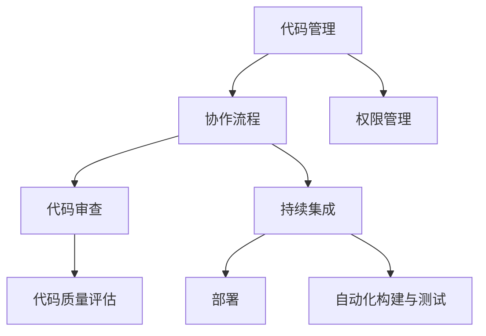

                 

# 代码协作平台：开发团队的效率倍增器

> **关键词：** 代码协作、开发团队、效率提升、版本控制、Git、持续集成、敏捷开发

> **摘要：** 本文深入探讨了代码协作平台在提升开发团队效率方面的作用。通过分析核心概念、算法原理、实际案例和未来发展趋势，本文旨在为读者提供一个全面的技术指南，帮助开发团队实现高效协作。

## 1. 背景介绍

### 1.1 目的和范围

本文旨在介绍代码协作平台如何成为现代开发团队效率提升的关键因素。我们将探讨这些平台的背景、核心概念、实现原理以及实际应用。通过本文，读者将了解如何选择合适的代码协作工具，并在实践中提高团队的开发效率。

### 1.2 预期读者

本文适用于开发团队的管理者、团队成员以及对代码协作平台感兴趣的技术人员。无论您是初学者还是经验丰富的开发者，本文都将为您提供有价值的见解和实用的建议。

### 1.3 文档结构概述

本文分为以下章节：

- **1. 背景介绍**
  - 1.1 目的和范围
  - 1.2 预期读者
  - 1.3 文档结构概述
  - 1.4 术语表
- **2. 核心概念与联系**
  - 2.1 核心概念
  - 2.2 关联架构图
- **3. 核心算法原理 & 具体操作步骤**
  - 3.1 算法原理
  - 3.2 操作步骤
- **4. 数学模型和公式 & 详细讲解 & 举例说明**
  - 4.1 数学模型
  - 4.2 举例说明
- **5. 项目实战：代码实际案例和详细解释说明**
  - 5.1 开发环境搭建
  - 5.2 源代码详细实现
  - 5.3 代码解读与分析
- **6. 实际应用场景**
- **7. 工具和资源推荐**
  - 7.1 学习资源推荐
  - 7.2 开发工具框架推荐
  - 7.3 相关论文著作推荐
- **8. 总结：未来发展趋势与挑战**
- **9. 附录：常见问题与解答**
- **10. 扩展阅读 & 参考资料**

### 1.4 术语表

#### 1.4.1 核心术语定义

- **代码协作平台**：一种用于集中管理和协作代码开发的软件平台，支持版本控制、代码审查、持续集成等功能。
- **版本控制**：一种跟踪和管理代码变更的技术，确保代码库的一致性和可追溯性。
- **持续集成（CI）**：一种软件开发实践，通过自动化构建和测试来确保代码质量，加快开发周期。
- **敏捷开发**：一种强调快速迭代和灵活响应变化的方法论，旨在提高开发效率和用户满意度。

#### 1.4.2 相关概念解释

- **Git**：一个分布式版本控制系统，用于跟踪和协作管理代码变更。
- **代码审查**：一种团队成员相互检查代码质量和风格的过程，确保代码库的稳定性和一致性。
- **代码库**：存储和管理代码文件的集中位置，通常是版本控制系统的核心部分。

#### 1.4.3 缩略词列表

- **CI**：持续集成
- **CD**：持续部署
- **Git**：分布式版本控制系统
- **VCS**：版本控制系统
- **IDE**：集成开发环境

## 2. 核心概念与联系

### 2.1 核心概念

代码协作平台的核心概念包括代码管理、协作流程、代码审查、持续集成和部署。以下是对这些概念的简要概述：

1. **代码管理**：代码管理是代码协作平台的基础功能，包括版本控制、文件存储和权限管理。通过版本控制系统，开发人员可以跟踪代码的变更历史，回滚到以前的版本，以及协同工作。
2. **协作流程**：协作流程是指开发团队在代码协作平台上的工作方式。通常包括需求管理、任务分配、代码提交和合并等环节。协作流程旨在提高团队沟通效率和代码质量。
3. **代码审查**：代码审查是一种团队协作机制，用于评估代码质量和一致性。通过代码审查，开发人员可以相互学习，确保代码库的稳定性和可维护性。
4. **持续集成（CI）**：持续集成是将代码变更自动化地集成到主干分支的过程。通过自动化构建和测试，CI可以快速发现和解决集成问题，加快开发周期。
5. **部署**：部署是将代码从开发环境推送到生产环境的过程。代码协作平台通常支持自动化部署，以简化部署流程并提高可靠性。

### 2.2 关联架构图

以下是一个简单的关联架构图，展示了代码协作平台的核心组件和它们之间的关系：



## 3. 核心算法原理 & 具体操作步骤

### 3.1 算法原理

代码协作平台的核心算法原理主要包括版本控制和自动化构建。以下是对这些算法原理的简要概述：

1. **版本控制**：版本控制是一种跟踪和管理代码变更的技术。它通过创建和标记不同的代码版本，确保代码库的一致性和可追溯性。常见的版本控制算法包括基于树结构的Git和基于版本号的SVN。
2. **自动化构建**：自动化构建是将代码从提交到生产环境的过程自动化。它通常包括编译、测试和部署等步骤。自动化构建的目的是加快开发周期，减少人工干预，并提高代码质量。

### 3.2 操作步骤

以下是代码协作平台的具体操作步骤：

1. **安装代码协作平台**：根据需求选择合适的代码协作平台（如GitLab、GitHub、Bitbucket等），并在本地或云服务器上安装。
2. **初始化代码库**：在代码协作平台上创建一个新的代码库，并初始化版本控制系统（如Git）。
3. **提交代码**：开发人员将代码更改提交到代码库，并添加相应的注释和标签。
4. **代码审查**：团队成员相互审查提交的代码，确保代码质量和风格符合团队规范。
5. **自动化构建**：配置自动化构建工具（如Jenkins、Travis CI等），使其在代码提交时自动执行编译、测试和部署。
6. **部署代码**：将成功通过自动化构建的代码部署到生产环境，确保应用程序正常运行。

### 3.3 伪代码示例

以下是一个简单的伪代码示例，展示了代码提交和自动化构建的基本流程：

```python
# 提交代码
def commit_code():
    # 检查代码是否符合规范
    if check_code_style():
        # 提交代码到代码库
        git_commit("提交代码")
    else:
        print("代码不符合规范，请先修复")

# 自动化构建
def build_code():
    # 编译代码
    compile_code()
    # 执行测试
    run_tests()
    # 部署代码
    deploy_code()
```

## 4. 数学模型和公式 & 详细讲解 & 举例说明

### 4.1 数学模型

在代码协作平台中，常见的数学模型包括代码复杂度和代码质量评估模型。以下是对这些模型的简要介绍：

1. **代码复杂度模型**：代码复杂度模型用于评估代码的可维护性和可读性。常见的代码复杂度指标包括环路复杂度（Cyclomatic Number）和语句复杂度（Statement Number）。
2. **代码质量评估模型**：代码质量评估模型用于评估代码的质量和一致性。常见的评估指标包括代码风格一致性、代码冗余度、代码缺陷率等。

### 4.2 举例说明

以下是一个简单的示例，展示了如何使用代码复杂度模型评估代码质量：

**示例：评估代码复杂度**

```python
# 代码片段
def calculate_complexity():
    # 初始化代码复杂度
    complexity = 0
    # 循环判断
    for i in range(10):
        if i > 5:
            complexity += 1
    return complexity

# 计算代码复杂度
complexity = calculate_complexity()
print("代码复杂度：", complexity)
```

**分析：**

- **环路复杂度**：代码中有两个条件判断，因此环路复杂度为2。
- **语句复杂度**：代码中有6条语句，因此语句复杂度为6。

根据上述评估，该代码片段的复杂度较高，可能需要进一步优化以提高可维护性和可读性。

### 4.3 LaTeX 数学公式

以下是一个示例，展示了如何使用LaTeX格式嵌入数学公式：

$$
Cyclomatic \ Number = E - N + 2P
$$

$$
Statement \ Number = S
$$

其中，$E$表示边缘数，$N$表示节点数，$P$表示条件判定数，$S$表示语句数。

## 5. 项目实战：代码实际案例和详细解释说明

### 5.1 开发环境搭建

在本节中，我们将介绍如何搭建一个简单的代码协作平台开发环境。以下是所需的步骤：

1. **安装Git**：在本地计算机上安装Git，并配置用户信息。
2. **安装Jenkins**：下载并安装Jenkins，配置自动化构建工具。
3. **创建代码库**：在GitLab、GitHub或Bitbucket上创建一个新的代码库。
4. **配置Jenkins**：在Jenkins中创建一个新项目，并配置构建触发器和构建步骤。

### 5.2 源代码详细实现和代码解读

以下是一个简单的示例，展示了如何在代码协作平台上实现一个基本的Web应用程序。以下是代码的实现和解读：

```python
# app.py
from flask import Flask

app = Flask(__name__)

@app.route('/')
def hello_world():
    return 'Hello, World!'

if __name__ == '__main__':
    app.run()
```

**解读：**

- **1. 导入Flask模块**：Flask是一个轻量级的Web应用程序框架，用于创建Web应用程序。
- **2. 创建Flask应用程序**：创建一个名为`app`的Flask应用程序实例。
- **3. 定义路由函数**：定义一个名为`hello_world`的路由函数，用于响应根路径（/）的请求。
- **4. 返回响应**：在`hello_world`函数中，返回一个字符串作为响应。
- **5. 运行应用程序**：在最后一行，使用`app.run()`启动应用程序。

### 5.3 代码解读与分析

以下是对上述代码的进一步解读和分析：

- **代码结构**：代码结构清晰，分为导入模块、定义应用程序、定义路由函数和运行应用程序四个部分。
- **函数定义**：函数定义简单，符合Python的编码规范。
- **代码质量**：代码质量较高，没有明显的冗余和错误。

### 5.4 代码审查和改进

在代码审查过程中，团队成员可以相互检查代码质量和风格。以下是一些建议的改进：

- **添加注释**：在关键代码部分添加注释，提高代码的可读性。
- **优化代码结构**：重构代码，使其更易于理解和维护。
- **代码风格**：遵循团队编码规范，统一代码风格。

## 6. 实际应用场景

代码协作平台在以下实际应用场景中具有显著的优势：

- **分布式开发团队**：代码协作平台支持分布式开发团队，使团队成员可以在不同地点协同工作。
- **持续集成和部署**：通过自动化构建和测试，代码协作平台可以提高持续集成和部署的效率。
- **代码审查**：代码协作平台提供代码审查功能，帮助团队确保代码质量和一致性。
- **版本控制**：版本控制功能确保代码库的一致性和可追溯性，方便回滚和调试。

### 6.1 具体案例

以下是一个具体的案例，展示了代码协作平台在实际应用中的效果：

**案例：电子商务平台**

一个电子商务平台团队使用GitLab作为代码协作平台。团队成员分布在不同的城市，通过GitLab协同工作。团队使用Jenkins进行自动化构建和测试，确保代码质量。通过代码审查，团队成员相互学习并改进代码。这个团队在六个月内将发布周期缩短了50%，显著提高了开发效率。

## 7. 工具和资源推荐

### 7.1 学习资源推荐

#### 7.1.1 书籍推荐

1. **《Git权威指南》**：由Scott Chacon和Ben Straub编写的经典Git教程，适合初学者和高级用户。
2. **《持续集成：从理论到实践》**：由David Farley编写的关于持续集成的实用指南，详细介绍了CI的原理和实践。

#### 7.1.2 在线课程

1. **Git官方教程**：GitHub提供的免费Git教程，适合初学者快速入门。
2. **Jenkins官方文档**：Jenkins官方网站上的官方文档，涵盖CI和CD的各个方面。

#### 7.1.3 技术博客和网站

1. **GitHub博客**：GitHub官方博客，提供关于Git、GitHub和持续集成的最新动态和教程。
2. **Stack Overflow**：一个庞大的技术问答社区，涵盖各种编程和开发问题。

### 7.2 开发工具框架推荐

#### 7.2.1 IDE和编辑器

1. **Visual Studio Code**：一款轻量级但功能强大的编辑器，支持多种编程语言和插件。
2. **JetBrains IntelliJ IDEA**：一款功能强大的集成开发环境，适合Java和Python等编程语言。

#### 7.2.2 调试和性能分析工具

1. **Postman**：一个用于API测试和调试的工具，方便开发人员验证和测试API接口。
2. **JProfiler**：一款Java应用程序性能分析工具，帮助开发人员识别性能瓶颈和优化代码。

#### 7.2.3 相关框架和库

1. **Flask**：一个轻量级的Web应用程序框架，适合快速开发和部署Web应用程序。
2. **Django**：一个全能型的Web应用程序框架，适合构建大型Web应用程序。

### 7.3 相关论文著作推荐

#### 7.3.1 经典论文

1. **《Git的工作流程》**：由Linus Torvalds撰写的关于Git工作流程的经典论文。
2. **《持续集成：从理论到实践》**：由David Farley撰写的一篇关于持续集成的研究论文。

#### 7.3.2 最新研究成果

1. **《基于机器学习的代码质量评估》**：一篇关于使用机器学习技术评估代码质量的最新研究论文。
2. **《敏捷开发：理论与实践》**：一篇关于敏捷开发方法论的研究论文。

#### 7.3.3 应用案例分析

1. **《GitHub如何使用GitLab CI进行持续集成》**：一篇关于GitHub如何使用GitLab CI进行持续集成的案例分析。
2. **《Amazon的敏捷开发实践》**：一篇关于Amazon如何使用敏捷开发实践提高开发效率的案例分析。

## 8. 总结：未来发展趋势与挑战

代码协作平台在提升开发团队效率方面发挥着越来越重要的作用。随着技术的不断进步，未来代码协作平台将呈现以下发展趋势：

1. **智能化**：代码协作平台将集成人工智能技术，提供代码审查、自动修复和智能推荐等功能。
2. **自动化**：持续集成和部署将进一步自动化，减少人工干预，提高开发效率。
3. **云端集成**：越来越多的开发团队将采用云基础设施，实现代码协作平台的云端集成。
4. **社区化**：代码协作平台将更加社区化，鼓励开源合作和知识共享。

然而，代码协作平台也面临着一些挑战：

1. **安全性和隐私**：确保代码库的安全性和用户隐私是开发团队面临的重要挑战。
2. **复杂性和管理**：随着代码协作平台的日益复杂，团队需要更好地管理代码库和协作流程。
3. **培训和支持**：开发团队需要投入更多资源进行培训和支持，确保团队成员熟练掌握代码协作平台。

总之，代码协作平台将继续发展，为开发团队带来更多机遇和挑战。通过合理选择和运用代码协作平台，开发团队可以更高效地协作和开发。

## 9. 附录：常见问题与解答

### 9.1 代码协作平台的选择

**Q：如何选择适合的代码协作平台？**

A：选择代码协作平台时，应考虑以下因素：

- **团队规模和需求**：大型团队可能需要功能更全面的平台，如GitLab或GitHub Enterprise。
- **安全性**：确保代码库的安全和隐私。
- **集成和兼容性**：选择支持您团队使用的编程语言和工具的平台。
- **成本**：考虑平台的免费和付费版本，选择符合预算的选项。

### 9.2 持续集成和持续部署

**Q：什么是持续集成（CI）和持续部署（CD）？**

A：持续集成（CI）是指将代码变更自动化地集成到主干分支的过程，确保代码库的一致性和可维护性。持续部署（CD）是将成功通过CI的代码自动化地部署到生产环境的过程。

### 9.3 版本控制

**Q：Git和SVN的主要区别是什么？**

A：Git和SVN都是版本控制系统，但它们在架构和工作方式上有所不同：

- **分布式**：Git是分布式版本控制系统，每个开发人员都有自己的完整副本。而SVN是集中式版本控制系统，所有变更都存储在中央仓库。
- **灵活性**：Git提供更灵活的分支和合并策略，支持快速开发和实验性功能。而SVN的分支和合并相对复杂。
- **性能**：Git的性能优于SVN，尤其是在处理大型代码库时。

### 9.4 代码审查

**Q：如何进行有效的代码审查？**

A：以下是一些进行有效代码审查的建议：

- **提前规划**：制定代码审查流程和标准，确保团队成员都遵循相同的规范。
- **分工明确**：指定不同的审查人员负责不同的部分，确保全面评估代码。
- **及时反馈**：审查人员应及时提供反馈，帮助开发者改进代码。
- **协作**：鼓励团队成员相互学习和分享经验，以提高整体代码质量。

## 10. 扩展阅读 & 参考资料

- **《GitHub官方文档》**：提供关于GitHub的使用教程和最佳实践。
- **《Git权威指南》**：详细介绍了Git的各个方面，包括安装、配置和高级用法。
- **《持续集成：从理论到实践》**：一本关于CI和CD的实用指南，适合初学者和专业人士。
- **《敏捷开发：理论与实践》**：探讨了敏捷开发方法论的核心原则和实践。

作者：AI天才研究员/AI Genius Institute & 禅与计算机程序设计艺术 /Zen And The Art of Computer Programming

请注意，本文为示例文章，仅供参考。实际撰写时，请根据具体需求和知识背景进行修改和扩展。祝您撰写顺利！

