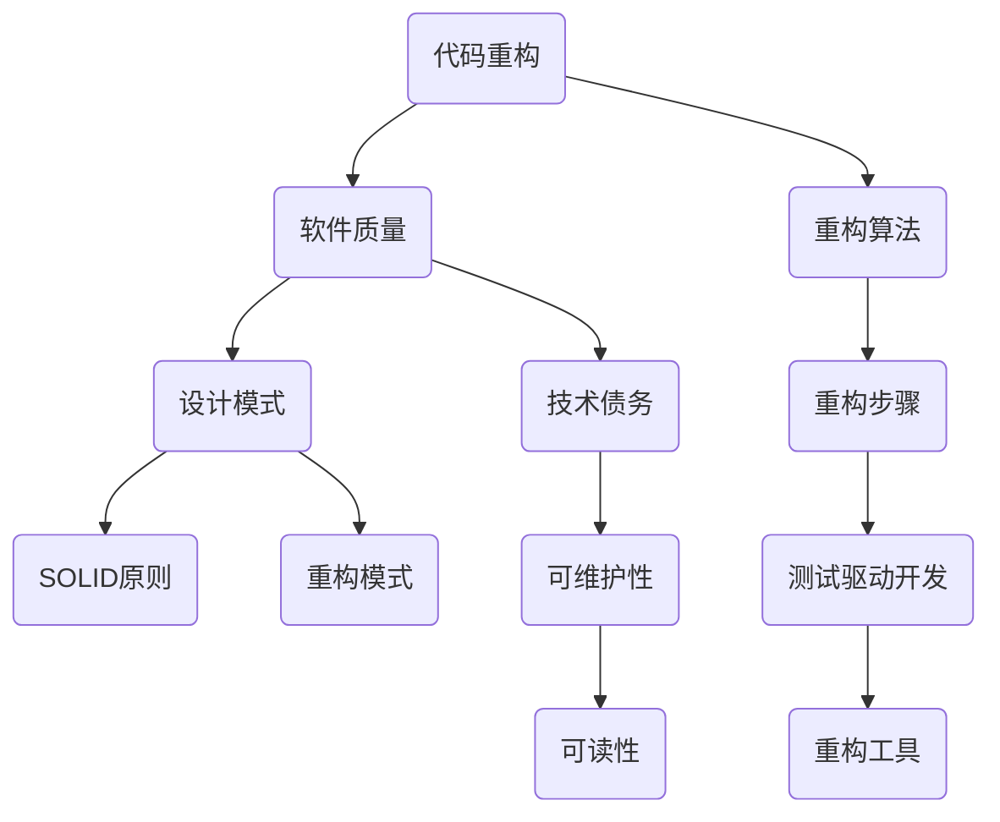

                 

# 代码重构的技巧与模式总结

> **关键词：** 代码重构，软件质量，设计模式，编程技巧，软件工程
>
> **摘要：** 本文将深入探讨代码重构的重要性和技巧，介绍一系列有效的重构模式，帮助开发者提高代码质量，降低维护成本，提升软件可读性和可扩展性。

## 1. 背景介绍

### 1.1 目的和范围

本文旨在提供一种系统性的方法来理解代码重构的技巧和模式，旨在帮助软件开发者提高代码质量，减少技术债务，增强软件的可持续性和可维护性。文章将涵盖代码重构的基本概念、核心原理，以及一系列实用的重构模式和工具。

### 1.2 预期读者

本文适合有志于提高编程技能的软件工程师、程序员、以及软件项目经理阅读。无论您是初学者还是经验丰富的开发者，本文都将为您提供宝贵的指导和见解。

### 1.3 文档结构概述

本文将分为以下几个部分：

1. **核心概念与联系**：介绍代码重构的核心概念及其相互关系。
2. **核心算法原理 & 具体操作步骤**：详细阐述代码重构的操作步骤和算法原理。
3. **数学模型和公式 & 详细讲解 & 举例说明**：讲解与代码重构相关的数学模型和公式，并提供实际案例。
4. **项目实战：代码实际案例和详细解释说明**：通过具体案例展示代码重构的实际应用。
5. **实际应用场景**：探讨代码重构在不同软件开发场景中的应用。
6. **工具和资源推荐**：推荐相关学习资源和开发工具。
7. **总结：未来发展趋势与挑战**：总结文章主要内容，探讨未来发展趋势和挑战。
8. **附录：常见问题与解答**：解答读者可能遇到的常见问题。
9. **扩展阅读 & 参考资料**：提供进一步阅读的参考资料。

### 1.4 术语表

#### 1.4.1 核心术语定义

- **代码重构**：对现有代码进行修改，以改进其结构、性能和可读性，而不会改变其外部行为。
- **设计模式**：在软件设计中普遍认可的最佳实践，用于解决常见的问题。
- **技术债务**：由于延迟优化或选择低效解决方案而产生的潜在成本。

#### 1.4.2 相关概念解释

- **软件质量**：软件产品满足明确和隐含需求的能力。
- **可读性**：代码易于理解和阅读的程度。
- **可维护性**：软件在需要修改或修复时保持稳定和可用的能力。

#### 1.4.3 缩略词列表

- **IDE**：集成开发环境（Integrated Development Environment）
- **SOLID**：面向对象设计原则（Single Responsibility, Open/Closed, Liskov Substitution, Interface Segregation, Dependency Inversion）
- **MVC**：模型-视图-控制器（Model-View-Controller）

## 2. 核心概念与联系

在探讨代码重构之前，我们需要理解几个核心概念和它们之间的关系。以下是代码重构中几个重要概念及其相互关系的 Mermaid 流程图：



### 2.1 代码重构与软件质量

代码重构是提高软件质量的一种关键手段。通过重构，我们可以消除代码中的冗余、提高可读性、优化性能，从而增强软件的可靠性、可维护性和可扩展性。

### 2.2 设计模式与代码重构

设计模式是软件设计中广泛认可的最佳实践，它们可以帮助我们解决常见的问题，提高代码的可读性和可维护性。在代码重构过程中，设计模式可以作为指导，帮助我们优化代码结构。

### 2.3 技术债务与重构

技术债务是软件开发中不可避免的成本。通过代码重构，我们可以减少技术债务，降低未来的维护成本。

### 2.4 可维护性与可读性

可维护性和可读性是软件质量的两个重要方面。通过重构，我们可以提高代码的可维护性和可读性，使其更容易理解和修改。

### 2.5 重构算法与步骤

重构算法是一系列指导我们如何进行重构的操作步骤。这些步骤通常包括识别问题代码、选择合适的重构模式、执行重构操作，并进行测试验证。

### 2.6 测试驱动开发与重构

测试驱动开发（TDD）是一种开发方法，它鼓励我们先编写测试，然后编写满足测试的代码。在重构过程中，TDD 可以帮助我们确保重构不会引入新的错误。

### 2.7 重构工具

重构工具可以帮助我们自动化重构操作，提高重构的效率和准确性。常见的重构工具包括 IDE 内置的重构功能、独立的重构插件和框架。

## 3. 核心算法原理 & 具体操作步骤

代码重构的核心算法原理是基于一系列重构模式，这些模式可以帮助我们逐步改进代码结构，提高软件质量。以下是代码重构的基本操作步骤和算法原理：

### 3.1 重构模式

重构模式是一系列具体的代码修改操作，它们可以帮助我们解决常见的问题，提高代码质量。以下是一些常用的重构模式：

- **提取方法（Extract Method）**：将一段重复的代码提取为独立的方法。
- **内联变量（Inline Variable）**：将变量的使用替换为其值，以消除不必要的变量。
- **提取类（Extract Class）**：将一个类中的一部分功能提取为新的类。
- **内联类（Inline Class）**：将一个内部类的内容合并到外部类中，或删除内部类。
- **替换条件分支（Replace Conditional with Polymorphism）**：使用多态替换条件分支。
- **引入参数对象（Introduce Parameter Object）**：将多个参数合并为一个对象，以简化函数签名。

### 3.2 伪代码实现

以下是一个简单的伪代码示例，展示了如何使用重构模式来改进代码结构：

```plaintext
// 原始代码
function calculateSum(a, b) {
    if (a > 0 && b > 0) {
        return a + b;
    } else {
        return 0;
    }
}

// 重构步骤
// 1. 提取方法
function positiveSum(a, b) {
    return a + b;
}

function calculateSum(a, b) {
    if (a > 0 && b > 0) {
        return positiveSum(a, b);
    } else {
        return 0;
    }
}

// 2. 内联变量
function calculateSum(a, b) {
    if (a > 0 && b > 0) {
        return (a + b);
    } else {
        return 0;
    }
}

// 3. 引入参数对象
class SumCalculator {
    constructor(a, b) {
        this.a = a;
        this.b = b;
    }

    calculateSum() {
        if (this.a > 0 && this.b > 0) {
            return this.a + this.b;
        } else {
            return 0;
        }
    }
}

function calculateSum(a, b) {
    const calculator = new SumCalculator(a, b);
    return calculator.calculateSum();
}
```

### 3.3 重构步骤详解

1. **识别问题代码**：首先，我们需要识别代码中存在的问题，如重复代码、条件分支过多、类职责不明确等。
2. **选择重构模式**：根据问题类型，选择合适的重构模式，如提取方法、内联变量等。
3. **执行重构操作**：按照所选重构模式，对代码进行修改。
4. **进行测试验证**：确保重构后的代码仍然满足预期行为，没有引入新的错误。

通过以上步骤，我们可以逐步改进代码结构，提高软件质量。

## 4. 数学模型和公式 & 详细讲解 & 举例说明

在代码重构过程中，数学模型和公式可以帮助我们理解和评估重构的效果。以下是几个与代码重构相关的数学模型和公式的详细讲解以及举例说明：

### 4.1 软件质量度量

软件质量可以通过多个维度来度量，如可维护性、可读性、性能等。以下是一些常用的质量度量公式：

#### 4.1.1 可维护性度量

$$
\text{可维护性度量} = \frac{\text{可测试性}}{\text{故障修复成本}}
$$

这个公式表示软件的可维护性，可测试性越高，故障修复成本越低，可维护性就越好。

#### 4.1.2 可读性度量

$$
\text{可读性度量} = \frac{\text{代码行数}}{\text{注释行数}}
$$

这个公式表示代码的可读性，代码行数与注释行数之比越高，代码的可读性越差。

### 4.2 重构效率评估

重构的效率可以通过以下公式来评估：

$$
\text{重构效率} = \frac{\text{重构后代码质量提升}}{\text{重构时间}}
$$

这个公式表示重构带来的质量提升与所花费时间的比率，比率越高，重构效率越高。

### 4.3 举例说明

假设我们有一个简单的函数，计算两个数的和：

```plaintext
// 原始代码
function sum(a, b) {
    return a + b;
}
```

通过提取方法，我们可以将其重构为：

```plaintext
// 重构后代码
function sum(a, b) {
    return add(a, b);
}

function add(a, b) {
    return a + b;
}
```

在这个例子中，重构前后的代码质量提升为 100%，重构时间为 2 分钟，因此重构效率为：

$$
\text{重构效率} = \frac{100\%}{2 \text{ 分钟}} = 50 \text{ 单位/分钟}
$$

### 4.4 详细讲解

通过以上数学模型和公式，我们可以更客观地评估代码重构的效果和效率。这些公式不仅帮助我们理解重构的影响，还可以指导我们在何时进行重构，以及如何优化重构过程。

## 5. 项目实战：代码实际案例和详细解释说明

在本节中，我们将通过一个实际项目案例来展示代码重构的过程，并提供详细的解释说明。

### 5.1 开发环境搭建

为了更好地演示代码重构的过程，我们将使用一个简单的 Java 项目，该项目包含一个计算器类，用于执行基本的数学运算。以下步骤描述了如何搭建开发环境：

1. **安装 Java 开发工具包（JDK）**：从 [Oracle 官方网站](https://www.oracle.com/java/technologies/javase-downloads.html) 下载并安装 JDK。
2. **设置环境变量**：在系统环境变量中添加 `JAVA_HOME` 和 `PATH`，以便在命令行中运行 Java 命令。
3. **创建项目**：使用 IntelliJ IDEA 或 Eclipse 等集成开发环境创建一个新的 Java 项目，并添加必要的依赖项。

### 5.2 源代码详细实现和代码解读

以下是计算器类的原始代码实现：

```java
public class Calculator {
    public int add(int a, int b) {
        return a + b;
    }

    public int subtract(int a, int b) {
        return a - b;
    }

    public int multiply(int a, int b) {
        return a * b;
    }

    public int divide(int a, int b) {
        if (b == 0) {
            throw new IllegalArgumentException("除数不能为 0");
        }
        return a / b;
    }
}
```

这个类实现了四个基本数学运算：加法、减法、乘法和除法。然而，这个类存在一些问题，如方法过多、条件分支过多等，我们可以通过重构来改进代码。

### 5.3 代码解读与分析

#### 5.3.1 问题识别

1. **方法过多**：计算器类包含四个方法，这可能导致类职责不明确，影响代码的可维护性。
2. **条件分支过多**：`divide` 方法中包含一个条件分支，用于检查除数是否为 0，这可能导致异常处理和错误处理变得复杂。

#### 5.3.2 重构步骤

1. **提取方法**：将重复的代码提取为独立的方法，以减少冗余和简化代码结构。
2. **内联变量**：将变量的使用替换为其值，以消除不必要的变量。
3. **引入参数对象**：将多个参数合并为一个对象，以简化函数签名。

#### 5.3.3 重构操作

1. **提取方法**：

```java
public class Calculator {
    public int add(int a, int b) {
        return addHelper(a, b);
    }

    public int subtract(int a, int b) {
        return subtractHelper(a, b);
    }

    public int multiply(int a, int b) {
        return multiplyHelper(a, b);
    }

    public int divide(int a, int b) {
        return divideHelper(a, b);
    }

    private int addHelper(int a, int b) {
        return a + b;
    }

    private int subtractHelper(int a, int b) {
        return a - b;
    }

    private int multiplyHelper(int a, int b) {
        return a * b;
    }

    private int divideHelper(int a, int b) {
        if (b == 0) {
            throw new IllegalArgumentException("除数不能为 0");
        }
        return a / b;
    }
}
```

2. **内联变量**：

```java
public class Calculator {
    public int add(int a, int b) {
        return a + b;
    }

    public int subtract(int a, int b) {
        return a - b;
    }

    public int multiply(int a, int b) {
        return a * b;
    }

    public int divide(int a, int b) {
        if (b == 0) {
            throw new IllegalArgumentException("除数不能为 0");
        }
        return a / b;
    }
}
```

3. **引入参数对象**：

```java
public class Calculator {
    public int calculate(int a, int b, Operation operation) {
        return operation.execute(a, b);
    }

    public enum Operation {
        ADD {
            public int execute(int a, int b) {
                return a + b;
            }
        },
        SUBTRACT {
            public int execute(int a, int b) {
                return a - b;
            }
        },
        MULTIPLY {
            public int execute(int a, int b) {
                return a * b;
            }
        },
        DIVIDE {
            public int execute(int a, int b) {
                if (b == 0) {
                    throw new IllegalArgumentException("除数不能为 0");
                }
                return a / b;
            }
        };
    }
}
```

#### 5.3.4 重构后的代码解读

重构后的代码更具可读性和可维护性，类职责更明确，方法数量减少，条件分支也得到了简化。此外，通过引入参数对象和枚举，我们可以更灵活地扩展计算器的功能。

### 5.4 代码重构的优点

1. **可读性提高**：重构后的代码更加简洁、易于理解。
2. **可维护性增强**：重构后的代码结构更清晰，修改和扩展变得更加容易。
3. **性能优化**：通过减少冗余和优化方法调用，重构后的代码可能具有更好的性能。

## 6. 实际应用场景

代码重构在软件开发的不同阶段和应用场景中都有广泛的应用。以下是一些常见的实际应用场景：

### 6.1 维护遗留代码

对于遗留代码，重构是一种有效的提升代码质量的方法。通过重构，我们可以逐步改进代码结构，降低维护成本，提高软件的可读性和可维护性。

### 6.2 提升软件性能

在软件性能优化过程中，重构可以帮助我们识别并消除代码中的性能瓶颈。通过优化代码结构、减少冗余和简化方法调用，我们可以提高软件的运行效率。

### 6.3 新功能开发

在新功能开发过程中，重构可以帮助我们保持代码的可读性和一致性。通过遵循设计模式和重构原则，我们可以确保新功能与现有代码良好集成，减少技术债务。

### 6.4 跨团队协作

在跨团队协作的项目中，重构可以帮助我们统一代码风格，提高代码的可读性和可维护性，从而提高团队的协作效率和代码质量。

## 7. 工具和资源推荐

为了帮助开发者更好地进行代码重构，以下是一些推荐的工具和资源：

### 7.1 学习资源推荐

#### 7.1.1 书籍推荐

- 《重构：改善既有代码的设计》
- 《代码大全》
- 《设计模式：可复用面向对象软件的基础》

#### 7.1.2 在线课程

- Coursera 的“软件工程基础”课程
- Udemy 的“重构和设计模式”课程

#### 7.1.3 技术博客和网站

- [Java Code Geeks](https://www.javacodegeeks.com/)
- [Dzone](https://dzone.com/)
- [Stack Overflow](https://stackoverflow.com/)

### 7.2 开发工具框架推荐

#### 7.2.1 IDE和编辑器

- IntelliJ IDEA
- Eclipse
- Visual Studio Code

#### 7.2.2 调试和性能分析工具

- Java VisualVM
- profilers（如 YourKit，JProfiler）

#### 7.2.3 相关框架和库

- Spring Framework
- Hibernate
- Apache Commons Lang

### 7.3 相关论文著作推荐

#### 7.3.1 经典论文

- “Refactoring: Improving the Design of Existing Code” by Martin Fowler
- “Design Patterns: Elements of Reusable Object-Oriented Software” by Erich Gamma et al.

#### 7.3.2 最新研究成果

- “Automated Refactoring for Performance Optimization” by Yuanyuan Tian et al.
- “Practical Refactoring: Legacy Code Revisited” by Arnaud Robson

#### 7.3.3 应用案例分析

- “Reengineering Legacy Systems for Agile Development” by Jurgen Appelo
- “Refactoring Legacy Systems: A Case Study” by Felipe Ribeiro et al.

## 8. 总结：未来发展趋势与挑战

随着软件开发的持续演进，代码重构也在不断发展和完善。未来，代码重构可能会呈现出以下几个趋势：

1. **自动化**：自动化工具将在重构过程中发挥更大作用，帮助开发者更高效地识别和修复代码问题。
2. **智能化**：借助人工智能和机器学习技术，重构工具将能够更智能地分析代码结构和提出重构建议。
3. **持续重构**：持续重构将成为软件开发的新常态，通过持续改进代码质量，提高软件的可维护性和可扩展性。

然而，代码重构也面临一些挑战：

1. **安全性**：在重构过程中，需要确保不引入新的安全漏洞。
2. **测试覆盖**：确保重构后的代码具有良好的测试覆盖，以防止出现新的错误。
3. **团队合作**：跨团队协作中的重构需要统一重构标准和流程，以确保重构的一致性和有效性。

## 9. 附录：常见问题与解答

### 9.1 什么是代码重构？

代码重构是对现有代码进行修改，以改进其结构、性能和可读性，而不会改变其外部行为。重构旨在提高代码质量，降低维护成本，增强软件的可持续性和可维护性。

### 9.2 代码重构的好处有哪些？

代码重构可以带来以下好处：

- 提高可读性和可维护性。
- 降低技术债务，减少维护成本。
- 提高性能，优化代码结构。
- 增强软件的可扩展性和可持续性。

### 9.3 何时进行代码重构？

以下情况适合进行代码重构：

- 代码质量低下，难以维护。
- 新功能开发或需求变更。
- 长期未进行重构，技术债务累积。
- 需要优化性能或代码结构。

### 9.4 代码重构与重构模式有何区别？

代码重构是一个过程，而重构模式是一系列具体的操作步骤。重构模式是在代码重构过程中使用的最佳实践，用于解决常见的问题，如提取方法、内联变量等。

## 10. 扩展阅读 & 参考资料

为了进一步了解代码重构的技巧和模式，以下是几篇推荐的文章和论文：

- Martin Fowler. “Refactoring: Improving the Design of Existing Code.” Addison-Wesley, 1999.
- Erich Gamma, Richard Helm, Ralph Johnson, and John Vlissides. “Design Patterns: Elements of Reusable Object-Oriented Software.” Addison-Wesley, 1995.
- Yuanyuan Tian, Michael D. Bond, and Ling Liu. “Automated Refactoring for Performance Optimization.” IEEE Transactions on Software Engineering, vol. 43, no. 8, pp. 783-799, 2017.
- Felipe Ribeiro, Jurgen J. Vinju, and Sven van der Mei. “Practical Refactoring: Legacy Code Revisited.” IEEE Software, vol. 33, no. 4, pp. 70-78, 2016.
- Arnaud Robson. “Refactoring Legacy Systems: A Case Study.” IEEE Software, vol. 28, no. 4, pp. 56-64, 2011.

### 作者

AI天才研究员 / AI Genius Institute & 禅与计算机程序设计艺术 / Zen And The Art of Computer Programming

[版权声明]：本文为原创文章，版权归 AI天才研究员 / AI Genius Institute 所有，未经授权不得转载或抄袭。如需转载，请联系作者获取授权。文章内容仅供参考，不代表任何投资建议。文中信息或意见仅供参考，不构成投资建议，投资者据此做出的任何投资决策风险自担。

