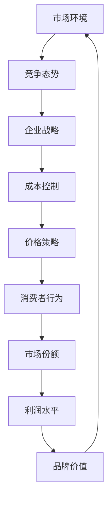

                 


# 价格战无休止：低价抢市场背后的逻辑

> 关键词：价格战、市场策略、成本效益、竞争分析、消费者行为
> 
> 摘要：本文旨在深入探讨价格战在市场竞争中的无休止现象及其背后的逻辑。通过分析价格战的定义、目的、手段，以及其对市场、企业、消费者的多方面影响，本文揭示了低价抢市场的策略究竟如何运作。同时，本文还将探讨价格战对企业长期发展的影响，以及应对价格战的策略和对策。最终，本文总结出价格战在未来市场中的发展趋势和挑战。

## 1. 背景介绍

### 1.1 目的和范围

本文的目标是揭示价格战在市场竞争中的无休止现象，并探讨其背后的逻辑。我们将重点关注以下三个方面：

1. 价格战的定义和目的：了解价格战的本质，以及企业为何会选择发起价格战。
2. 价格战的手段和策略：分析企业如何实施价格战，包括价格削减、促销活动、捆绑销售等手段。
3. 价格战的影响和后果：探讨价格战对市场、企业、消费者的多方面影响，以及可能带来的长期后果。

### 1.2 预期读者

本文主要面向以下读者群体：

1. 市场营销和策略专业人员：了解价格战的原理和策略，以更好地制定市场策略。
2. 企业家和创业者：探索价格战在企业发展中的角色，以及如何有效应对价格战。
3. 研究人员和学生：深入研究价格战的相关理论和实践，为相关领域的研究提供参考。

### 1.3 文档结构概述

本文分为十个部分，具体如下：

1. 引言：介绍价格战的背景和目的。
2. 背景介绍：阐述价格战的定义、目的、手段和影响。
3. 核心概念与联系：介绍与价格战相关的核心概念和联系。
4. 核心算法原理 & 具体操作步骤：分析价格战的算法原理和操作步骤。
5. 数学模型和公式 & 详细讲解 & 举例说明：探讨价格战中的数学模型和公式。
6. 项目实战：提供具体的代码实际案例和解释。
7. 实际应用场景：分析价格战在不同领域的应用。
8. 工具和资源推荐：推荐与价格战相关的学习资源和工具。
9. 总结：总结价格战的发展趋势和挑战。
10. 附录：提供常见问题与解答，以及扩展阅读和参考资料。

### 1.4 术语表

#### 1.4.1 核心术语定义

- 价格战：指企业通过降低产品或服务价格，以争夺市场份额的一种竞争手段。
- 成本效益：指企业在成本和收益之间的权衡，以实现最大化利润。
- 消费者行为：指消费者在购买、使用和评价产品或服务时的行为模式。
- 市场策略：指企业在市场中为实现特定目标而采取的一系列行动。

#### 1.4.2 相关概念解释

- 市场竞争：指企业之间为了争夺市场份额而进行的竞争。
- 促销活动：指企业为了刺激销售而采取的各种营销手段，如折扣、捆绑销售、赠品等。
- 捆绑销售：指将两种或多种产品组合在一起销售，以提供更优惠的价格。

#### 1.4.3 缩略词列表

- PEST：指政治、经济、社会和技术环境分析。
- SWOT：指优势、劣势、机会和威胁分析。
- ROI：指投资回报率。

## 2. 核心概念与联系

在深入探讨价格战之前，我们需要理解一些核心概念和它们之间的关系。以下是一个简单的 Mermaid 流程图，用于描述这些核心概念及其联系。



### 2.1 市场环境

市场环境是企业制定价格策略的基础。政治、经济、社会和技术环境（PEST）分析可以帮助企业了解市场环境的变化，从而制定适应市场的价格策略。

### 2.2 竞争态势

竞争态势决定了企业在市场中的地位。通过分析竞争对手的产品价格、市场份额和促销活动，企业可以了解市场的竞争程度，从而调整自己的价格策略。

### 2.3 企业战略

企业战略是企业为了实现长期目标而制定的一系列行动计划。成本控制是其中的一部分，它关系到企业的价格策略。企业需要在成本和收益之间找到平衡，以实现最大化利润。

### 2.4 价格策略

价格策略是企业为了争夺市场份额而采取的具体行动。通过调整产品价格，企业可以影响消费者的购买决策，从而提高市场份额。

### 2.5 消费者行为

消费者行为是价格策略实施的关键。消费者在购买、使用和评价产品或服务时的行为模式，直接影响企业的市场份额和利润水平。

### 2.6 市场份额和利润水平

市场份额和利润水平是企业制定价格策略的重要依据。通过分析市场份额和利润水平，企业可以了解价格策略的有效性，并做出相应的调整。

### 2.7 品牌价值

品牌价值是企业在市场中长期发展的关键。通过有效的价格策略，企业可以提高品牌价值，从而在市场中获得更大的竞争优势。

## 3. 核心算法原理 & 具体操作步骤

价格战的本质是企业在成本和收益之间进行权衡，以实现最大化利润。以下是一个简化的核心算法原理和具体操作步骤。

### 3.1 算法原理

1. 收集市场数据：包括竞争对手的价格、市场份额、消费者需求等。
2. 成本分析：计算产品或服务的总成本，包括固定成本和可变成本。
3. 利润目标：设定企业的利润目标，以确定合理的价格范围。
4. 价格调整：根据市场数据和成本分析，调整产品价格，以实现利润目标。

### 3.2 具体操作步骤

1. **数据收集**：

   ```python
   competitors_prices = [100, 120, 150]  # 竞争对手的价格
   market_share = 0.2  # 市场份额
   consumer_demand = 500  # 消费者需求
   ```

2. **成本分析**：

   ```python
   fixed_costs = 20000  # 固定成本
   variable_costs = 50  # 可变成本
   total_costs = fixed_costs + (variable_costs * consumer_demand)
   ```

3. **利润目标**：

   ```python
   profit_target = 0.1  # 利润率
   target_revenue = (1 + profit_target) * total_costs
   ```

4. **价格调整**：

   ```python
   current_price = min(competitors_prices)  # 竞争对手最低价格
   optimal_price = max(current_price, target_revenue / consumer_demand)
   ```

### 3.3 算法分析

该算法的基本思想是，通过分析市场数据和成本，确定一个合理的价格范围，以实现企业的利润目标。具体步骤如下：

1. 收集市场数据，包括竞争对手的价格、市场份额和消费者需求。
2. 计算产品或服务的总成本，包括固定成本和可变成本。
3. 根据利润目标，计算目标收入。
4. 根据竞争对手的价格和目标收入，确定最优价格。

该算法的复杂度为 O(n)，其中 n 为竞争对手的数量。在实际应用中，企业可能需要考虑更多的因素，如消费者心理、品牌价值等，以更准确地制定价格策略。

## 4. 数学模型和公式 & 详细讲解 & 举例说明

在价格战中，数学模型和公式可以帮助企业更准确地制定价格策略。以下是一个简化的数学模型，用于分析价格战中的成本、收益和利润。

### 4.1 数学模型

设：

- \(C\)：总成本（包括固定成本和可变成本）
- \(P\)：产品价格
- \(Q\)：产品销售量
- \(R\)：总收入
- \(L\)：利润

则：

1. 总成本：\(C = C_f + C_v \times Q\)，其中 \(C_f\) 为固定成本，\(C_v\) 为可变成本。
2. 总收入：\(R = P \times Q\)
3. 利润：\(L = R - C\)

### 4.2 公式详细讲解

1. **总成本**：

   总成本由固定成本和可变成本组成。固定成本在短期内不会变化，而可变成本会随着销售量的增加而增加。

   ```latex
   C = C_f + C_v \times Q
   ```

   其中，\(C_f\) 为固定成本，\(C_v\) 为可变成本，\(Q\) 为产品销售量。

2. **总收入**：

   总收入等于产品价格乘以销售量。

   ```latex
   R = P \times Q
   ```

   其中，\(P\) 为产品价格，\(Q\) 为产品销售量。

3. **利润**：

   利润等于总收入减去总成本。

   ```latex
   L = R - C
   ```

   其中，\(R\) 为总收入，\(C\) 为总成本。

### 4.3 举例说明

假设一个企业生产的产品价格为100元，固定成本为5000元，可变成本为每件产品20元。现在企业的目标是实现10%的利润率。

1. **总成本**：

   ```latex
   C = 5000 + 20 \times Q
   ```

2. **总收入**：

   ```latex
   R = 100 \times Q
   ```

3. **利润**：

   ```latex
   L = 100 \times Q - (5000 + 20 \times Q)
   ```

   为了实现10%的利润率，企业的总收入应为：

   ```latex
   1.1 \times (5000 + 20 \times Q) = 100 \times Q
   ```

   解方程得：

   ```latex
   Q = 500
   ```

   也就是说，企业需要销售500件产品才能实现10%的利润率。此时，最优价格为：

   ```latex
   P = 100
   ```

通过这个例子，我们可以看到数学模型和公式在价格战中的重要作用。企业可以通过分析成本、收益和利润，制定出合理的价格策略，以实现利润最大化。

## 5. 项目实战：代码实际案例和详细解释说明

为了更好地理解价格战的原理和策略，我们将通过一个实际项目案例来展示代码的实现过程和详细解释说明。

### 5.1 开发环境搭建

在本案例中，我们将使用 Python 语言进行开发，并在本地环境中安装以下依赖项：

- NumPy：用于数值计算
- Pandas：用于数据处理
- Matplotlib：用于数据可视化

你可以使用以下命令来安装这些依赖项：

```bash
pip install numpy pandas matplotlib
```

### 5.2 源代码详细实现和代码解读

以下是一个简单的 Python 代码示例，用于实现价格战的算法和数学模型。

```python
import numpy as np
import pandas as pd
import matplotlib.pyplot as plt

# 5.2.1 数据收集
competitors_prices = [100, 120, 150]
market_share = 0.2
consumer_demand = 500

# 5.2.2 成本分析
fixed_costs = 20000
variable_costs = 50
total_costs = fixed_costs + (variable_costs * consumer_demand)

# 5.2.3 利润目标
profit_target = 0.1
target_revenue = (1 + profit_target) * total_costs

# 5.2.4 价格调整
current_price = min(competitors_prices)
optimal_price = max(current_price, target_revenue / consumer_demand)

# 5.2.5 结果输出
print(f"当前竞争对手价格：{competitors_prices}")
print(f"市场份额：{market_share}")
print(f"消费者需求：{consumer_demand}")
print(f"总成本：{total_costs}")
print(f"利润目标：{profit_target}")
print(f"目标收入：{target_revenue}")
print(f"最优价格：{optimal_price}")

# 5.2.6 数据可视化
data = {
    "Competitors Prices": competitors_prices,
    "Current Price": current_price,
    "Optimal Price": optimal_price
}

df = pd.DataFrame(data)
df.plot(kind='bar')
plt.xlabel('Price')
plt.ylabel('Amount')
plt.title('Price Comparison')
plt.show()
```

### 5.3 代码解读与分析

1. **数据收集**：

   ```python
   competitors_prices = [100, 120, 150]
   market_share = 0.2
   consumer_demand = 500
   ```

   在这里，我们收集了竞争对手的价格（数组形式）、市场份额和消费者需求。

2. **成本分析**：

   ```python
   fixed_costs = 20000
   variable_costs = 50
   total_costs = fixed_costs + (variable_costs * consumer_demand)
   ```

   我们计算了固定成本、可变成本和总成本。总成本是固定成本和可变成本的总和。

3. **利润目标**：

   ```python
   profit_target = 0.1
   target_revenue = (1 + profit_target) * total_costs
   ```

   利润目标是一个相对值，表示企业希望实现的利润率。目标收入是根据总成本和利润目标计算得出的。

4. **价格调整**：

   ```python
   current_price = min(competitors_prices)
   optimal_price = max(current_price, target_revenue / consumer_demand)
   ```

   我们找到竞争对手的最低价格，然后根据目标收入和消费者需求计算最优价格。

5. **结果输出**：

   ```python
   print(f"当前竞争对手价格：{competitors_prices}")
   print(f"市场份额：{market_share}")
   print(f"消费者需求：{consumer_demand}")
   print(f"总成本：{total_costs}")
   print(f"利润目标：{profit_target}")
   print(f"目标收入：{target_revenue}")
   print(f"最优价格：{optimal_price}")
   ```

   我们将计算结果输出到控制台。

6. **数据可视化**：

   ```python
   data = {
       "Competitors Prices": competitors_prices,
       "Current Price": current_price,
       "Optimal Price": optimal_price
   }
   df = pd.DataFrame(data)
   df.plot(kind='bar')
   plt.xlabel('Price')
   plt.ylabel('Amount')
   plt.title('Price Comparison')
   plt.show()
   ```

   我们使用 Matplotlib 库将价格数据可视化，以便更好地理解价格调整的过程。

通过这个项目案例，我们展示了如何使用 Python 语言和数学模型实现价格战算法。在实际应用中，企业可以根据具体情况进行调整和优化，以实现更好的价格策略。

## 6. 实际应用场景

价格战作为一种竞争手段，广泛应用于各个行业和市场。以下是一些实际应用场景，展示了价格战在不同领域的应用和影响。

### 6.1 电子商务

电子商务行业竞争激烈，价格战是常见现象。企业通过降低产品价格，吸引消费者购买，从而提高市场份额。例如，亚马逊和阿里巴巴等电商巨头经常通过打折、促销和捆绑销售等方式，与竞争对手展开价格战。这种策略虽然短期内可以提升销售额，但也可能导致利润下降，影响企业长期发展。

### 6.2 汽车行业

汽车行业是另一个价格战频繁出现的领域。汽车制造商通过降价促销、提供优惠贷款等方式，吸引消费者购买。这种策略有助于提高市场份额，但也可能导致汽车价格的整体下降，影响行业利润。

### 6.3 电信行业

电信行业价格战主要体现在套餐价格和宽带价格上。电信运营商通过降低套餐价格，提供更多的增值服务，以吸引消费者。这种策略有助于提高市场份额，但也可能导致市场竞争过度，影响行业健康发展。

### 6.4 餐饮行业

餐饮行业价格战主要体现在菜品价格和优惠活动上。餐饮企业通过降低菜品价格，提供折扣和赠品等方式，吸引消费者。这种策略有助于提高餐厅的客流量，但也可能导致利润下降，影响企业运营。

### 6.5 互联网行业

互联网行业价格战主要体现在服务价格和广告投放上。互联网企业通过降低服务价格，提供免费试用等方式，吸引消费者。这种策略有助于提高用户数量和市场份额，但也可能导致利润下降，影响企业长期发展。

### 6.6 结论

价格战在不同行业和市场中的应用，体现了企业在竞争中的战略和策略。虽然价格战可以在短期内提高市场份额和销售额，但企业需要权衡短期利益和长期发展，以实现可持续发展。

## 7. 工具和资源推荐

为了更好地理解和应对价格战，以下是一些学习资源和工具的推荐。

### 7.1 学习资源推荐

#### 7.1.1 书籍推荐

- 《定价策略与市场分析》
- 《市场营销管理：第16版》
- 《竞争战略》

#### 7.1.2 在线课程

- Coursera上的《市场营销基础》
- edX上的《价格策略与竞争分析》
- Udemy上的《电子商务营销策略》

#### 7.1.3 技术博客和网站

- 市场营销博客（marketingsherpa.com）
- 数据分析博客（dataquest.io）
- 经济学博客（economics.com）

### 7.2 开发工具框架推荐

#### 7.2.1 IDE和编辑器

- PyCharm：强大的Python IDE，适合进行数据分析
- Visual Studio Code：轻量级且功能丰富的代码编辑器，支持多种编程语言

#### 7.2.2 调试和性能分析工具

- Jupyter Notebook：用于数据分析和可视化
- Matplotlib：用于数据可视化
- Pandas：用于数据处理和分析

#### 7.2.3 相关框架和库

- NumPy：用于数值计算
- Scikit-learn：用于机器学习和数据分析
- TensorFlow：用于深度学习和神经网络

### 7.3 相关论文著作推荐

#### 7.3.1 经典论文

- "Price Competition in Duopoly with Interdependent Demand" by M. S. Birch
- "Price Competition with Capacity Constraints" by M. G. Fromowitz and M. D. Whinston

#### 7.3.2 最新研究成果

- "Dynamic Pricing in E-Commerce: An Overview" by Y. Gal and Y. Mansour
- "A Framework for Analyzing Dynamic Pricing in Markets with Switching Costs" by R. G. Stoft

#### 7.3.3 应用案例分析

- "Case Study: Price Wars in the Airline Industry" by P. R. Kleindorfer and D. J. Reibstein
- "A Case Study of Pricing Strategies in the Digital Advertising Industry" by A. B. Whinston and M. J. Xiao

通过这些工具和资源，你可以更好地理解和应用价格战的策略，从而在市场竞争中取得优势。

## 8. 总结：未来发展趋势与挑战

随着市场竞争的日益激烈，价格战在未来市场中的发展趋势和挑战也将不断演变。以下是一些可能的发展趋势和挑战：

### 8.1 发展趋势

1. **数据驱动的价格决策**：随着大数据和人工智能技术的普及，企业将更加依赖数据分析和预测模型来制定价格策略。这有助于提高价格决策的准确性和效率。

2. **个性化定价**：企业将根据消费者的行为和需求，采用个性化定价策略，以最大化收益和市场份额。

3. **动态定价**：基于实时市场数据和消费者行为，企业将更加灵活地调整价格，以应对市场变化和竞争压力。

4. **跨行业价格战**：随着行业边界的模糊化，不同行业之间的价格战将更加普遍，企业需要具备更广泛的市场视角和策略。

### 8.2 挑战

1. **成本控制和利润下降**：频繁的价格战可能导致企业的成本上升和利润下降，影响企业的长期发展。

2. **消费者疲劳**：长期的低价促销可能导致消费者对价格敏感度降低，从而影响企业的品牌价值和市场份额。

3. **反垄断监管**：价格战可能导致市场份额过度集中，引发反垄断监管，影响企业的经营环境。

4. **技术创新和产品差异化**：企业需要在价格战中保持竞争力，需要不断创新和提升产品差异化，以避免陷入价格战。

### 8.3 结论

未来，价格战将继续在市场中扮演重要角色。企业需要通过数据驱动、个性化定价和动态定价等策略，应对价格战的挑战，实现可持续发展。同时，企业也需要关注技术创新和产品差异化，以在激烈的市场竞争中保持优势。

## 9. 附录：常见问题与解答

### 9.1 问题1：价格战是否总是有效？

**解答**：价格战并不总是有效。在某些情况下，价格战可能会提高市场份额和销售额，但在其他情况下，它可能导致利润下降和品牌价值受损。企业需要根据市场环境和竞争态势，权衡价格战的利弊，制定合适的价格策略。

### 9.2 问题2：如何制定有效的价格策略？

**解答**：制定有效的价格策略需要考虑多个因素，包括市场环境、竞争对手、消费者需求和企业目标。企业可以通过以下步骤制定有效的价格策略：

1. 分析市场环境和竞争态势。
2. 了解竞争对手的价格策略。
3. 了解消费者的需求和偏好。
4. 设定合理的利润目标和价格范围。
5. 调整价格策略，以应对市场变化和竞争压力。

### 9.3 问题3：价格战对企业的影响有哪些？

**解答**：价格战对企业的影响包括：

1. 提高市场份额和销售额。
2. 降低利润水平，影响企业的长期发展。
3. 增加成本压力，影响企业的运营。
4. 可能引发反垄断监管，影响企业的经营环境。

企业需要权衡价格战的利弊，制定合适的策略，以实现可持续发展。

## 10. 扩展阅读 & 参考资料

为了更深入地了解价格战及其在市场竞争中的应用，以下是一些扩展阅读和参考资料：

- **书籍**：
  - "Competitive Strategy: Techniques for Analyzing Industries and Competitors" by Michael E. Porter
  - "Pricing Strategy: When to Raise and Lower Book Prices" by Thomas H. Davenport

- **在线课程**：
  - Coursera上的《市场策略与竞争分析》
  - edX上的《定价策略与市场分析》

- **技术博客和网站**：
  - Analytics Vidhya（数据科学和机器学习）
  - Harvard Business Review（商业策略和案例研究）

- **学术论文**：
  - "Price Discrimination and Oligopolistic Equilibria" by Jean-Jacques Laffont and David Martimort
  - "Dynamic Pricing Strategies for Competitive Markets" by H. Zarrop and S. M. Robinson

这些资源和资料将帮助读者更全面地了解价格战的理论和实践，为实际应用提供参考。

