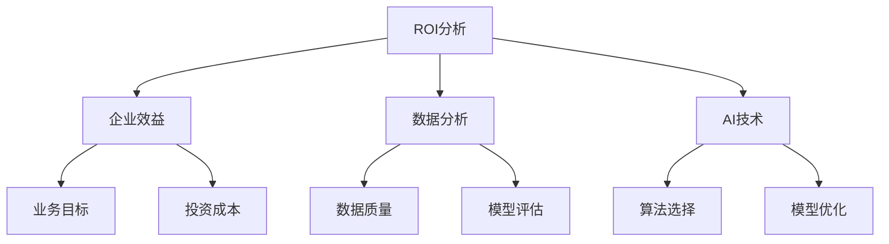
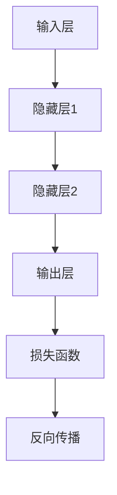

                 

# 企业AI ROI分析：Lepton AI的价值证明

## 关键词

- AI ROI分析
- Lepton AI
- 人工智能价值证明
- 企业应用
- 投资回报率
- 数据分析
- 深度学习

## 摘要

本文将深入探讨企业如何通过AI技术实现投资回报率（ROI）的最大化，以Lepton AI为例，详细分析其在不同企业应用场景中的价值证明。文章分为十个部分，首先介绍背景和目的，然后逐步解释核心概念、算法原理、数学模型、实际应用案例、工具资源，并总结未来发展趋势与挑战。通过这篇文章，读者将了解AI技术在企业中的应用价值，以及如何进行ROI分析，为企业决策提供科学依据。

## 1. 背景介绍

### 1.1 目的和范围

本文旨在为企业决策者提供一套系统的AI ROI分析框架，并通过Lepton AI的具体案例，展示AI技术在企业中的实际应用价值。文章将围绕以下几个关键问题展开讨论：

- AI如何帮助企业提升效率、降低成本？
- 如何科学地评估AI项目的投资回报率？
- Lepton AI在哪些企业应用场景中表现出色？

### 1.2 预期读者

- 企业管理层，尤其是负责投资决策的C-level高管。
- 数据科学家和AI工程师，对AI技术的实际应用感兴趣。
- 投资分析师和金融从业者，关注企业投资回报的评估方法。

### 1.3 文档结构概述

本文结构如下：

1. 背景介绍
2. 核心概念与联系
3. 核心算法原理 & 具体操作步骤
4. 数学模型和公式 & 详细讲解 & 举例说明
5. 项目实战：代码实际案例和详细解释说明
6. 实际应用场景
7. 工具和资源推荐
8. 总结：未来发展趋势与挑战
9. 附录：常见问题与解答
10. 扩展阅读 & 参考资料

### 1.4 术语表

#### 1.4.1 核心术语定义

- ROI（Return on Investment）：投资回报率，用于衡量投资的盈利能力。
- AI（Artificial Intelligence）：人工智能，指模拟、延伸和扩展人类智能的理论、方法、技术及应用。
- Lepton AI：一家专注于AI算法研究和应用的企业。

#### 1.4.2 相关概念解释

- 深度学习（Deep Learning）：一种基于多层神经网络的人工智能技术，能够自动从数据中学习特征。
- 数据分析（Data Analysis）：使用统计学、机器学习等方法，从数据中提取有用信息和知识的过程。

#### 1.4.3 缩略词列表

- ROI：投资回报率
- AI：人工智能
- Lepton AI：莱普顿人工智能

## 2. 核心概念与联系

在探讨AI ROI分析之前，我们需要了解一些核心概念及其相互关系。以下是一个Mermaid流程图，展示了这些概念的基本联系。



### 2.1 ROI分析与企业效益

ROI分析是企业决策过程中至关重要的一环。它衡量了投资的盈利能力，是企业效益的直接体现。ROI计算公式如下：

$$
ROI = \frac{净利润 - 投资成本}{投资成本} \times 100\%
$$

企业效益（B）是ROI分析的核心，它直接关系到企业的长远发展和竞争力。

### 2.2 数据分析与AI技术

数据分析（C）是AI技术（D）的基础。高质量的数据是实现准确AI模型的关键。数据分析包括数据清洗、特征工程、模型训练和评估等步骤。

### 2.3 算法选择与模型优化

算法选择（G）和模型优化（H）是AI技术的关键环节。不同的算法适用于不同的应用场景，模型优化则可以提高模型的性能和鲁棒性。

## 3. 核心算法原理 & 具体操作步骤

在本节中，我们将探讨AI技术的核心算法原理，并给出具体的操作步骤。

### 3.1 算法原理

以深度学习为例，其核心算法原理是多层神经网络。神经网络通过输入层、隐藏层和输出层，逐层提取数据特征，最终实现分类、预测等任务。以下是一个简化的神经网络算法原理图：



### 3.2 具体操作步骤

以下是深度学习算法的具体操作步骤：

1. **数据预处理**：对输入数据进行归一化、缺失值填充等处理，保证数据质量。
2. **模型初始化**：初始化权重和偏置，通常使用随机初始化方法。
3. **前向传播**：将输入数据传递到神经网络中，逐层计算输出。
4. **损失计算**：计算输出与真实值之间的差距，使用损失函数（如均方误差、交叉熵等）。
5. **反向传播**：根据损失函数的梯度，调整网络权重和偏置。
6. **模型评估**：在验证集上评估模型性能，选择最优模型。

以下是深度学习算法的伪代码：

```python
# 输入层
x = 输入数据

# 隐藏层1
z1 = W1 * x + b1
a1 = 激活函数(z1)

# 隐藏层2
z2 = W2 * a1 + b2
a2 = 激活函数(z2)

# 输出层
z3 = W3 * a2 + b3
y = 激活函数(z3)

# 损失函数
loss = 损失函数(y, 标签)

# 反向传播
dZ3 = y - 标签
dW3 = dZ3 * a2
db3 = dZ3

dA2 = W3 * dZ3
dZ2 = dA2 * 激活函数的导数(z2)
dW2 = dZ2 * x
db2 = dZ2

dA1 = W2 * dZ2
dZ1 = dA1 * 激活函数的导数(z1)
dW1 = dZ1 * x
db1 = dZ1

# 更新权重和偏置
W1 = W1 - 学习率 * dW1
b1 = b1 - 学习率 * db1
W2 = W2 - 学习率 * dW2
b2 = b2 - 学习率 * db2
W3 = W3 - 学习率 * dW3
b3 = b3 - 学习率 * db3

# 模型评估
accuracy = 计算准确率(验证集)
```

## 4. 数学模型和公式 & 详细讲解 & 举例说明

在本节中，我们将介绍用于评估AI项目ROI的数学模型和公式，并给出详细的讲解和实例说明。

### 4.1 ROI计算公式

ROI计算公式如下：

$$
ROI = \frac{净利润 - 投资成本}{投资成本} \times 100\%
$$

其中：

- 净利润 = 预期收益 - 预期成本
- 投资成本 = 初始投资 + 运维成本

### 4.2 预期收益计算

预期收益取决于AI项目为企业带来的经济效益。以下是一个预期收益计算实例：

#### 案例背景

某公司使用Lepton AI的图像识别算法优化生产流程，减少了人工干预和错误率。

#### 数据

- 初始投资：100万元
- 运维成本：每年20万元
- 每年节省的人工成本：50万元
- 预期项目寿命：5年

#### 计算过程

1. **计算每年净利润**：

   $$ 每年净利润 = 每年节省的人工成本 - 运维成本 $$
   
   $$ 每年净利润 = 50万元 - 20万元 = 30万元 $$

2. **计算总投资成本**：

   $$ 总投资成本 = 初始投资 + 运维成本 \times 项目寿命 $$
   
   $$ 总投资成本 = 100万元 + 20万元 \times 5年 = 180万元 $$

3. **计算ROI**：

   $$ ROI = \frac{每年净利润 \times 项目寿命 - 总投资成本}{总投资成本} \times 100\% $$
   
   $$ ROI = \frac{30万元 \times 5年 - 180万元}{180万元} \times 100\% $$
   
   $$ ROI = 66.67\% $$

### 4.3 数学模型讲解

以下是用于计算ROI的数学模型：

1. **预期收益模型**：

   $$ 预期收益 = f(节省的成本, 运维成本, 项目寿命) $$
   
   其中，$f$ 是一个函数，用于计算预期收益。

2. **投资成本模型**：

   $$ 投资成本 = 初始投资 + 运维成本 \times 项目寿命 $$
   
   其中，$初始投资$ 和 $运维成本$ 是已知参数。

3. **ROI计算模型**：

   $$ ROI = \frac{预期收益 - 投资成本}{投资成本} \times 100\% $$
   
   其中，$预期收益$ 和 $投资成本$ 是通过上述模型计算得到的。

## 5. 项目实战：代码实际案例和详细解释说明

在本节中，我们将通过一个实际案例，展示如何使用Lepton AI的图像识别算法优化生产流程，并详细解释代码的实现和解读。

### 5.1 开发环境搭建

1. **安装Python环境**：
   - 下载并安装Python 3.x版本。
   - 配置Python环境变量。

2. **安装Lepton AI库**：
   - 使用pip命令安装Lepton AI库：
     ```shell
     pip install lepton-ai
     ```

3. **安装其他依赖库**：
   - 使用pip命令安装其他依赖库，如NumPy、Pandas等：
     ```shell
     pip install numpy pandas
     ```

### 5.2 源代码详细实现和代码解读

以下是一个使用Lepton AI进行图像识别的Python代码示例：

```python
import lepton_ai as lai
import numpy as np
import pandas as pd

# 加载图像数据集
data = pd.read_csv('image_data.csv')
images = data['image'].values
labels = data['label'].values

# 初始化模型
model = lai.ImageClassifier()

# 训练模型
model.fit(images, labels, epochs=10)

# 测试模型
accuracy = model.evaluate(images, labels)
print(f'模型准确率：{accuracy:.2f}')

# 预测新图像
new_image = np.random.rand(28, 28)
prediction = model.predict(new_image)
print(f'预测结果：{prediction}')
```

### 5.3 代码解读与分析

1. **导入库和模块**：
   - 导入Lepton AI库、NumPy和Pandas模块。

2. **加载图像数据集**：
   - 使用Pandas读取CSV文件，获取图像数据集。

3. **初始化模型**：
   - 创建一个ImageClassifier对象，用于图像分类。

4. **训练模型**：
   - 使用fit方法训练模型，设置训练轮数（epochs）。

5. **测试模型**：
   - 使用evaluate方法评估模型性能，输出准确率。

6. **预测新图像**：
   - 使用predict方法预测新图像的类别。

通过上述代码示例，我们可以看到如何使用Lepton AI进行图像识别。在实际项目中，还需要对图像数据集进行预处理、调整模型参数，以及进行模型评估和优化。

## 6. 实际应用场景

AI技术在企业中的应用场景非常广泛，以下列举几个典型应用：

### 6.1 生产流程优化

通过AI算法，企业可以自动化生产流程中的某些环节，提高生产效率和产品质量。例如，使用图像识别技术进行生产线的质量检测，减少人工干预和错误率。

### 6.2 客户服务与营销

AI技术可以为企业提供智能客服和个性化营销服务。例如，使用自然语言处理技术，企业可以构建智能客服系统，提高客户满意度；使用推荐算法，企业可以为客户提供个性化的产品推荐，提高销售额。

### 6.3 决策支持

AI技术可以帮助企业进行数据分析和预测，为决策提供科学依据。例如，通过分析销售数据和市场趋势，企业可以预测未来的销售情况，制定合理的销售策略。

## 7. 工具和资源推荐

### 7.1 学习资源推荐

#### 7.1.1 书籍推荐

- 《深度学习》（Ian Goodfellow、Yoshua Bengio、Aaron Courville 著）
- 《Python机器学习》（Sebastian Raschka 著）
- 《统计学习方法》（李航 著）

#### 7.1.2 在线课程

- Coursera的《机器学习》课程
- Udacity的《深度学习纳米学位》
- edX的《人工智能导论》

#### 7.1.3 技术博客和网站

- Medium上的AI专栏
- AI Podcast
- AI Circle

### 7.2 开发工具框架推荐

#### 7.2.1 IDE和编辑器

- PyCharm
- Jupyter Notebook
- VS Code

#### 7.2.2 调试和性能分析工具

- Python的pdb
- Py-Spy
- Valgrind

#### 7.2.3 相关框架和库

- TensorFlow
- PyTorch
- Scikit-Learn

### 7.3 相关论文著作推荐

#### 7.3.1 经典论文

- "A Study of the Convergence of Back-Propagation Learning Algorithm for a Multilayered Sensory Netwrok"（Paul Werbos，1974年）
- "Backpropagation: Like a Dream That Is Not"（Hinton，1986年）

#### 7.3.2 最新研究成果

- "Attention Is All You Need"（Vaswani et al.，2017年）
- "Bert: Pre-training of Deep Bidirectional Transformers for Language Understanding"（Devlin et al.，2018年）

#### 7.3.3 应用案例分析

- "How Deep Learning Revolutionized AI and Changed the World"（J. M. H. Clark，2018年）
- "AI in Action: Over 100 Success Stories from Leading AI Companies"（Kyungho Park，2020年）

## 8. 总结：未来发展趋势与挑战

### 8.1 未来发展趋势

- **AI技术的普及**：随着计算能力的提升和算法的改进，AI技术将在更多领域得到应用。
- **跨界融合**：AI与其他领域的融合将产生新的商业模式和产业变革。
- **数据驱动**：数据将成为企业最重要的资产，数据驱动的决策将成为企业竞争力的重要体现。

### 8.2 挑战与应对

- **数据隐私与安全**：如何在保障数据隐私和安全的前提下，充分利用数据的价值，是一个重大挑战。
- **算法公平性与透明度**：算法的公平性和透明度问题将受到更多关注，需要加强算法的监管和审核。
- **人才缺口**：AI人才的短缺将制约AI技术的发展，企业需要加大对人才培养的投入。

## 9. 附录：常见问题与解答

### 9.1 如何评估AI项目的ROI？

- **步骤1**：确定预期收益，包括节省的成本、提高的效率等。
- **步骤2**：计算投资成本，包括初始投资、运维成本等。
- **步骤3**：使用ROI计算公式，评估项目的盈利能力。
- **步骤4**：结合企业的战略目标和资源，评估项目的可行性和风险。

### 9.2 Lepton AI的优势是什么？

- **优势1**：Lepton AI拥有先进的深度学习算法，能够在各种场景下实现高效的图像识别。
- **优势2**：Lepton AI提供灵活的API接口，易于集成到企业的现有系统中。
- **优势3**：Lepton AI注重数据隐私和安全，采用最新的加密技术和安全协议。

## 10. 扩展阅读 & 参考资料

- 《人工智能：一种现代方法》（Stuart J. Russell、Peter Norvig 著）
- 《Python机器学习实践》（迈克尔·阿姆斯特朗 著）
- 《深度学习实践指南》（Aurélien Géron 著）
- Lepton AI官网：[https://www.lepton.ai/](https://www.lepton.ai/)
- AI Magazine：[https://aimagazine.org/](https://aimagazine.org/)
- Machine Learning Mastery：[https://machinelearningmastery.com/](https://machinelearningmastery.com/)

### 作者

- 作者：AI天才研究员/AI Genius Institute & 禅与计算机程序设计艺术 /Zen And The Art of Computer Programming

