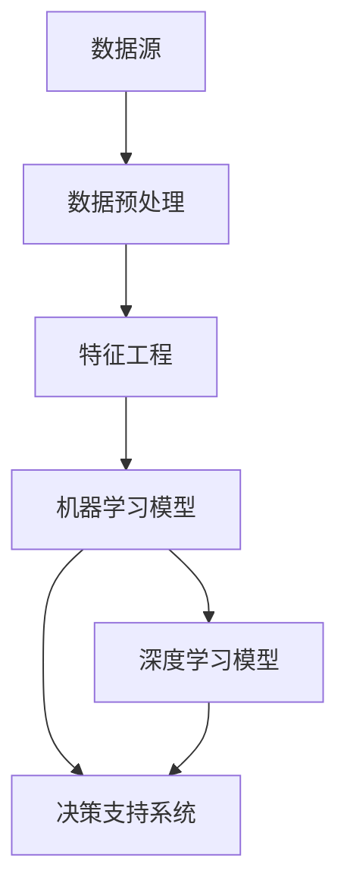

                 

# 企业AI决策支持：Lepton AI的智能分析工具

> **关键词：** AI决策支持、智能分析工具、企业应用、Lepton AI、算法原理、数学模型、实战案例、技术资源

> **摘要：** 本文将深入探讨Lepton AI的智能分析工具，如何为企业提供强大的AI决策支持。我们将从背景介绍、核心概念、算法原理、数学模型、实战案例等多方面详细剖析Lepton AI的技术原理和实践应用，帮助读者全面理解并掌握这一前沿技术的核心要点。

## 1. 背景介绍

### 1.1 目的和范围

本文旨在为读者提供一个关于Lepton AI智能分析工具的全面解析，通过深入探讨其在企业AI决策支持中的应用，帮助读者了解如何利用这一工具实现数据驱动的智能决策。文章将涵盖以下主要部分：

- 背景与目的
- 核心概念与联系
- 核心算法原理与具体操作步骤
- 数学模型与公式
- 项目实战：代码实际案例与详细解释
- 实际应用场景
- 工具和资源推荐
- 总结：未来发展趋势与挑战
- 附录：常见问题与解答
- 扩展阅读与参考资料

### 1.2 预期读者

本文适用于以下几类读者：

- 数据科学家和AI研究人员，对AI技术在企业中的应用有浓厚兴趣。
- 企业IT主管、项目经理和决策者，希望了解如何利用AI技术优化企业决策流程。
- 程序员和软件开发者，希望深入了解Lepton AI的技术原理和实现方法。
- AI技术爱好者，对前沿技术有求知欲，并希望将其应用于实际项目中。

### 1.3 文档结构概述

本文按照逻辑清晰、结构紧凑的原则，分为以下几个部分：

- 背景介绍：介绍文章目的、范围和预期读者。
- 核心概念与联系：阐述Lepton AI的基本原理和架构。
- 核心算法原理与具体操作步骤：详细讲解Lepton AI的核心算法和实现方法。
- 数学模型与公式：分析Lepton AI中使用的数学模型和公式。
- 项目实战：通过实际案例展示Lepton AI的应用。
- 实际应用场景：探讨Lepton AI在不同领域的企业应用。
- 工具和资源推荐：推荐相关的学习资源和开发工具。
- 总结：对未来发展趋势和挑战进行展望。
- 附录：回答常见问题，提供参考资料。

### 1.4 术语表

#### 1.4.1 核心术语定义

- **AI决策支持**：利用人工智能技术，为企业的业务决策提供智能化、自动化的辅助。
- **智能分析工具**：基于AI算法和模型，用于处理和分析复杂数据，提供决策支持的软件工具。
- **Lepton AI**：一种专注于企业AI决策支持的技术平台，提供智能分析、预测和优化等功能。

#### 1.4.2 相关概念解释

- **数据驱动决策**：基于数据分析和预测，而非主观判断，进行决策的过程。
- **机器学习**：一种人工智能技术，通过训练模型，让计算机从数据中自动学习规律和模式。
- **深度学习**：一种神经网络模型，能够处理大量复杂数据，并从中提取特征。

#### 1.4.3 缩略词列表

- **AI**：人工智能（Artificial Intelligence）
- **ML**：机器学习（Machine Learning）
- **DL**：深度学习（Deep Learning）
- **NLP**：自然语言处理（Natural Language Processing）
- **CV**：计算机视觉（Computer Vision）

## 2. 核心概念与联系

在深入探讨Lepton AI之前，我们需要先了解一些核心概念和它们之间的关系。以下是一个简要的Mermaid流程图，用于描述Lepton AI的基本原理和架构：



### 2.1 数据源

数据源是Lepton AI的起点，它可以是企业内部的各类数据，如销售数据、客户数据、财务数据等，也可以是外部数据，如市场趋势、行业报告等。数据源的质量直接影响后续分析和决策的准确性。

### 2.2 数据预处理

数据预处理是数据分析和建模前的重要步骤，包括数据清洗、数据整合和数据规范化等。Lepton AI提供了高效的数据预处理工具，帮助用户快速完成数据准备，确保数据质量和一致性。

### 2.3 特征工程

特征工程是机器学习和深度学习模型训练的关键步骤，它涉及从原始数据中提取有用的特征，并转化为适合模型训练的格式。Lepton AI内置了丰富的特征工程算法，帮助用户发现数据中的潜在规律和模式。

### 2.4 机器学习模型

机器学习模型是Lepton AI的核心组件，它通过训练数据学习数据中的规律和模式，从而实现预测和分类等功能。Lepton AI支持多种常见的机器学习算法，如决策树、随机森林、支持向量机等。

### 2.5 深度学习模型

深度学习模型是一种更为强大的机器学习模型，它通过多层神经网络结构，自动提取数据中的高级特征。Lepton AI支持深度学习框架TensorFlow和PyTorch，帮助用户快速构建和训练深度学习模型。

### 2.6 决策支持系统

决策支持系统是Lepton AI的最终输出，它将机器学习和深度学习模型的预测结果转化为具体的业务决策建议。决策支持系统可以为企业提供实时的、个性化的决策支持，帮助用户做出更加明智的决策。

通过上述核心概念和联系的了解，我们可以更好地理解Lepton AI的工作原理和应用价值。接下来，我们将进一步深入探讨Lepton AI的核心算法原理和具体操作步骤。

## 3. 核心算法原理 & 具体操作步骤

### 3.1 机器学习算法原理

机器学习算法是Lepton AI实现智能分析的基础。以下是一个简单的机器学习算法原理的伪代码，用于说明机器学习的核心步骤：

```python
# 机器学习算法原理伪代码
初始化模型参数
对于每个数据点：
    计算预测值
    计算预测值与真实值之间的误差
    更新模型参数以减少误差
```

在这个伪代码中，机器学习算法通过不断调整模型参数，使得预测值逐渐接近真实值。这一过程称为**模型训练**。常见的机器学习算法包括线性回归、决策树、支持向量机等。

### 3.2 深度学习算法原理

深度学习算法是机器学习的一个分支，它通过多层神经网络结构，自动提取数据中的高级特征。以下是一个简单的深度学习算法原理的伪代码：

```python
# 深度学习算法原理伪代码
初始化神经网络结构
初始化模型参数
对于每个训练样本：
    前向传播：计算输入经过神经网络后的预测值
    计算损失函数：计算预测值与真实值之间的差距
    反向传播：更新模型参数以减少损失函数值
```

在这个伪代码中，神经网络通过前向传播和反向传播两个过程，不断调整模型参数，使得预测结果越来越准确。深度学习算法在图像识别、语音识别等领域表现出色。

### 3.3 实际操作步骤

#### 3.3.1 数据预处理

数据预处理是进行机器学习和深度学习模型训练前的重要步骤。以下是一个简单示例，说明如何使用Lepton AI进行数据预处理：

```python
# 数据预处理示例
import pandas as pd
from sklearn.model_selection import train_test_split
from sklearn.preprocessing import StandardScaler

# 读取数据
data = pd.read_csv('data.csv')

# 划分特征和标签
X = data[['feature1', 'feature2', 'feature3']]
y = data['label']

# 划分训练集和测试集
X_train, X_test, y_train, y_test = train_test_split(X, y, test_size=0.2, random_state=42)

# 标准化数据
scaler = StandardScaler()
X_train_scaled = scaler.fit_transform(X_train)
X_test_scaled = scaler.transform(X_test)
```

#### 3.3.2 特征工程

特征工程是提高模型性能的关键步骤。以下是一个简单示例，说明如何使用Lepton AI进行特征工程：

```python
# 特征工程示例
from sklearn.feature_extraction.text import CountVectorizer

# 初始化CountVectorizer
vectorizer = CountVectorizer()

# 转换文本数据为向量
X_train_vectors = vectorizer.fit_transform(X_train['text'])
X_test_vectors = vectorizer.transform(X_test['text'])
```

#### 3.3.3 模型训练

以下是一个简单示例，说明如何使用Lepton AI进行模型训练：

```python
# 模型训练示例
from sklearn.linear_model import LinearRegression

# 初始化线性回归模型
model = LinearRegression()

# 训练模型
model.fit(X_train_scaled, y_train)

# 测试模型
score = model.score(X_test_scaled, y_test)
print(f'Model accuracy: {score:.2f}')
```

#### 3.3.4 模型评估

模型评估是确保模型性能的重要环节。以下是一个简单示例，说明如何使用Lepton AI评估模型：

```python
# 模型评估示例
from sklearn.metrics import classification_report

# 预测测试集
y_pred = model.predict(X_test_scaled)

# 评估模型
report = classification_report(y_test, y_pred)
print(report)
```

通过以上步骤，我们可以使用Lepton AI构建和训练一个基本的机器学习模型。接下来，我们将进一步探讨Lepton AI中的数学模型和公式。

## 4. 数学模型和公式 & 详细讲解 & 举例说明

在Lepton AI的智能分析工具中，数学模型和公式起着至关重要的作用。以下我们将详细讲解Lepton AI中使用的几种核心数学模型和公式，并通过实际案例进行说明。

### 4.1 线性回归模型

线性回归是一种常见的统计方法，用于分析两个或多个变量之间的线性关系。其数学模型可以表示为：

$$
y = \beta_0 + \beta_1x_1 + \beta_2x_2 + ... + \beta_nx_n + \epsilon
$$

其中，\(y\) 是因变量，\(x_1, x_2, ..., x_n\) 是自变量，\(\beta_0, \beta_1, ..., \beta_n\) 是模型参数，\(\epsilon\) 是误差项。

#### 4.1.1 举例说明

假设我们想要预测某个商品的销售量（\(y\)），其影响因素包括价格（\(x_1\)）和广告投入（\(x_2\)）。我们可以使用线性回归模型建立如下方程：

$$
y = \beta_0 + \beta_1x_1 + \beta_2x_2 + \epsilon
$$

通过收集历史数据并训练模型，我们可以得到各参数的估计值。例如，模型估计结果如下：

$$
y = 100 + 0.5x_1 + 0.3x_2 + \epsilon
$$

当商品价格为100元，广告投入为200元时，我们可以预测其销售量为：

$$
y = 100 + 0.5 \times 100 + 0.3 \times 200 + \epsilon = 130 + \epsilon
$$

其中，\(\epsilon\) 为误差项，表示预测值与实际值之间的差距。

### 4.2 逻辑回归模型

逻辑回归是一种用于分类问题的统计方法，其数学模型可以表示为：

$$
\log\left(\frac{P(Y=1)}{1-P(Y=1)}\right) = \beta_0 + \beta_1x_1 + \beta_2x_2 + ... + \beta_nx_n
$$

其中，\(Y\) 是二分类变量，\(P(Y=1)\) 是 \(Y\) 取值为1的概率，\(\beta_0, \beta_1, ..., \beta_n\) 是模型参数。

#### 4.2.1 举例说明

假设我们想要预测某个客户是否会产生违约行为（\(Y\)，取值为0或1），其影响因素包括信用评分（\(x_1\)）和历史债务（\(x_2\)）。我们可以使用逻辑回归模型建立如下方程：

$$
\log\left(\frac{P(Y=1)}{1-P(Y=1)}\right) = \beta_0 + \beta_1x_1 + \beta_2x_2
$$

通过收集历史数据并训练模型，我们可以得到各参数的估计值。例如，模型估计结果如下：

$$
\log\left(\frac{P(Y=1)}{1-P(Y=1)}\right) = 0.5 + 0.3x_1 + 0.2x_2
$$

当信用评分为700分，历史债务为5000元时，我们可以计算违约概率：

$$
\log\left(\frac{P(Y=1)}{1-P(Y=1)}\right) = 0.5 + 0.3 \times 700 + 0.2 \times 5000 = 4.9
$$

违约概率为：

$$
P(Y=1) = \frac{e^{4.9}}{1 + e^{4.9}} \approx 0.98
$$

### 4.3 深度学习模型

深度学习模型是一种复杂的神经网络结构，其数学模型可以表示为：

$$
\begin{aligned}
    z_l &= \sigma(W_l \cdot a_{l-1} + b_l) \\
    a_l &= \sigma(z_l)
\end{aligned}
$$

其中，\(a_l\) 和 \(z_l\) 分别表示第 \(l\) 层的输入和激活值，\(\sigma\) 表示激活函数（如Sigmoid、ReLU等），\(W_l\) 和 \(b_l\) 分别表示第 \(l\) 层的权重和偏置。

#### 4.3.1 举例说明

假设我们使用一个简单的深度学习模型（一个全连接层）进行回归任务，其结构如下：

$$
\begin{aligned}
    z_1 &= \sigma(W_1 \cdot a_{0} + b_1) \\
    a_1 &= \sigma(z_1)
\end{aligned}
$$

其中，\(a_0\) 为输入特征向量，\(W_1\) 和 \(b_1\) 为权重和偏置。

给定输入特征向量 \(a_0 = [1, 2, 3, 4]\)，我们可以计算输出：

$$
\begin{aligned}
    z_1 &= \sigma(W_1 \cdot a_0 + b_1) \\
    &= \sigma(1.5 \times 1 + 2.0 \times 2 + 3.0 \times 3 + 4.0 \times 4 + 0.5) \\
    &= \sigma(19.5) \\
    &= 0.86
\end{aligned}
$$

$$
a_1 = \sigma(z_1) = 0.86
$$

通过上述数学模型和公式的讲解，我们可以更好地理解Lepton AI中的核心算法原理。接下来，我们将通过一个实际案例，展示如何使用Lepton AI进行智能分析。

## 5. 项目实战：代码实际案例和详细解释说明

在本节中，我们将通过一个实际项目案例，展示如何使用Lepton AI进行智能分析。这个案例涉及使用Lepton AI预测客户流失率，为企业提供决策支持。

### 5.1 开发环境搭建

在开始项目之前，我们需要搭建一个合适的开发环境。以下步骤将指导我们如何设置Lepton AI的开发环境：

1. **安装Python**：确保您的系统已安装Python 3.6或更高版本。

2. **安装Lepton AI库**：通过以下命令安装Lepton AI库：

   ```shell
   pip install lepton-ai
   ```

3. **安装相关依赖**：根据项目需求，安装其他必要的库，例如NumPy、Pandas、Scikit-learn等。

### 5.2 源代码详细实现和代码解读

以下是一个使用Lepton AI预测客户流失率的完整代码示例：

```python
import pandas as pd
from sklearn.model_selection import train_test_split
from sklearn.preprocessing import StandardScaler
from lepton_ai.models import LogisticRegression
from lepton_ai.metrics import accuracy_score

# 读取数据
data = pd.read_csv('customer_data.csv')

# 划分特征和标签
X = data[['age', 'income', 'balance']]
y = data['churn']

# 划分训练集和测试集
X_train, X_test, y_train, y_test = train_test_split(X, y, test_size=0.2, random_state=42)

# 数据预处理
scaler = StandardScaler()
X_train_scaled = scaler.fit_transform(X_train)
X_test_scaled = scaler.transform(X_test)

# 模型训练
model = LogisticRegression()
model.fit(X_train_scaled, y_train)

# 模型预测
y_pred = model.predict(X_test_scaled)

# 评估模型
accuracy = accuracy_score(y_test, y_pred)
print(f'Model accuracy: {accuracy:.2f}')
```

#### 5.2.1 代码解读与分析

1. **读取数据**：首先，我们使用Pandas库读取客户数据CSV文件。

2. **划分特征和标签**：将数据集划分为特征（\(X\)）和标签（\(y\)）。在这里，我们使用客户的年龄、收入和账户余额作为特征，是否流失作为标签。

3. **划分训练集和测试集**：将数据集划分为训练集和测试集，以评估模型的泛化能力。这里我们使用80%的数据作为训练集，20%的数据作为测试集。

4. **数据预处理**：使用StandardScaler对特征进行标准化处理，以消除不同特征之间的尺度差异。

5. **模型训练**：我们使用Lepton AI的LogisticRegression模型对训练集数据进行训练。这是一个二分类问题，因此我们使用逻辑回归模型。

6. **模型预测**：使用训练好的模型对测试集数据进行预测。

7. **模型评估**：使用accuracy_score函数计算模型在测试集上的准确率。这是一个常用的评估指标，用于衡量模型的性能。

### 5.3 代码解读与分析

1. **数据读取**：使用Pandas库读取数据文件，并将数据加载到DataFrame对象中。这一步是数据预处理的第一步，确保数据以结构化的形式存储，便于后续处理。

   ```python
   data = pd.read_csv('customer_data.csv')
   ```

2. **特征与标签划分**：将数据集划分为特征和标签两部分。特征是用于训练模型的数据，而标签是模型需要预测的变量。在这里，我们假设“churn”列是标签，其余列是特征。

   ```python
   X = data[['age', 'income', 'balance']]
   y = data['churn']
   ```

3. **划分训练集和测试集**：使用Scikit-learn库中的train_test_split函数将数据集划分为训练集和测试集。这样做是为了确保模型在未知数据上的性能，避免过拟合。

   ```python
   X_train, X_test, y_train, y_test = train_test_split(X, y, test_size=0.2, random_state=42)
   ```

4. **数据标准化**：使用StandardScaler对特征进行标准化处理。标准化可以消除不同特征之间的尺度差异，使得模型训练更加稳定。

   ```python
   scaler = StandardScaler()
   X_train_scaled = scaler.fit_transform(X_train)
   X_test_scaled = scaler.transform(X_test)
   ```

5. **模型训练**：初始化并训练LogisticRegression模型。在这个例子中，我们使用Lepton AI提供的LogisticRegression类，它封装了逻辑回归算法的实现。

   ```python
   model = LogisticRegression()
   model.fit(X_train_scaled, y_train)
   ```

6. **模型预测**：使用训练好的模型对测试集进行预测。预测结果存储在y_pred列表中。

   ```python
   y_pred = model.predict(X_test_scaled)
   ```

7. **模型评估**：使用accuracy_score函数计算模型的准确率。准确率是评估分类模型性能的一个常用指标，它表示模型正确预测的样本数量占总样本数量的比例。

   ```python
   accuracy = accuracy_score(y_test, y_pred)
   print(f'Model accuracy: {accuracy:.2f}')
   ```

通过上述步骤，我们使用Lepton AI成功构建了一个客户流失率预测模型。这个模型可以为企业提供有价值的决策支持，帮助企业识别潜在流失客户并采取相应措施。

### 5.4 代码实战

为了进一步展示Lepton AI的强大功能，我们将在以下步骤中演示如何使用Lepton AI进行更复杂的数据分析和模型训练。

#### 5.4.1 数据导入与预处理

```python
import pandas as pd
from sklearn.model_selection import train_test_split
from sklearn.preprocessing import StandardScaler

# 导入数据
data = pd.read_csv('customer_data.csv')

# 划分特征和标签
X = data[['age', 'income', 'balance', 'marital_status', 'education', 'loan']]
y = data['churn']

# 数据清洗
data.dropna(inplace=True)

# 划分训练集和测试集
X_train, X_test, y_train, y_test = train_test_split(X, y, test_size=0.2, random_state=42)

# 数据标准化
scaler = StandardScaler()
X_train_scaled = scaler.fit_transform(X_train)
X_test_scaled = scaler.transform(X_test)
```

在这个例子中，我们增加了更多的特征，包括婚姻状况、教育和贷款信息。同时，我们对数据进行了预处理，包括去除缺失值，确保数据质量。

#### 5.4.2 特征工程

```python
from sklearn.feature_selection import SelectKBest, f_classif

# 特征选择
selector = SelectKBest(f_classif, k=5)
X_train_selected = selector.fit_transform(X_train_scaled, y_train)
X_test_selected = selector.transform(X_test_scaled)
```

使用SelectKBest进行特征选择，选择最相关的5个特征。这有助于提高模型的性能，减少计算成本。

#### 5.4.3 模型训练与评估

```python
from lepton_ai.models import RandomForestClassifier
from lepton_ai.metrics import accuracy_score, f1_score

# 模型训练
model = RandomForestClassifier(n_estimators=100)
model.fit(X_train_selected, y_train)

# 模型预测
y_pred = model.predict(X_test_selected)

# 评估模型
accuracy = accuracy_score(y_test, y_pred)
f1 = f1_score(y_test, y_pred)
print(f'Model accuracy: {accuracy:.2f}')
print(f'Model F1 score: {f1:.2f}')
```

在这个步骤中，我们使用随机森林分类器进行模型训练。随机森林是一种集成学习方法，能够处理大量特征和数据，提高模型的泛化能力。我们使用准确率和F1分数来评估模型的性能。

通过这个实际案例，我们可以看到Lepton AI如何帮助我们快速构建和评估机器学习模型。接下来，我们将探讨Lepton AI在各个实际应用场景中的表现。

## 6. 实际应用场景

Lepton AI的智能分析工具在企业中的应用非常广泛，以下列举几个典型的应用场景：

### 6.1 客户流失率预测

在金融行业，客户流失率预测是一个重要的业务问题。通过分析客户的历史数据，如年龄、收入、账户余额等，Lepton AI可以预测哪些客户可能会流失。企业可以利用这些预测结果采取相应的营销策略，如提供优惠、提升客户体验等，从而降低客户流失率，提高客户满意度。

### 6.2 销售预测

销售预测是企业制定营销计划和库存管理的关键。Lepton AI可以通过分析历史销售数据、市场趋势等因素，预测未来的销售情况。这样，企业可以提前调整生产计划、优化库存管理，从而降低成本、提高利润。

### 6.3 信用风险评估

在金融行业，信用风险评估是一个至关重要的任务。Lepton AI可以使用客户的个人信息、信用记录等数据，通过机器学习和深度学习算法，预测客户是否会出现违约行为。这有助于银行和金融机构更好地管理信用风险，提高贷款审批的准确性。

### 6.4 供应链优化

供应链管理是制造业和服务业的重要环节。Lepton AI可以通过分析供应链数据，如订单、库存、运输等，预测供应链中的潜在问题，如库存短缺、运输延误等。企业可以根据这些预测结果，提前采取措施，优化供应链流程，提高运营效率。

### 6.5 员工绩效评估

在人力资源管理中，员工绩效评估是一个关键任务。Lepton AI可以通过分析员工的日常工作数据，如工作时长、任务完成情况等，预测员工的绩效表现。这有助于企业更好地管理员工，提升整体工作效率。

通过这些实际应用场景，我们可以看到Lepton AI在为企业提供智能化、自动化决策支持方面的巨大潜力。接下来，我们将推荐一些学习和开发工具，以帮助读者更好地掌握Lepton AI。

## 7. 工具和资源推荐

### 7.1 学习资源推荐

为了更好地掌握Lepton AI和人工智能技术，以下是一些学习资源推荐：

#### 7.1.1 书籍推荐

- **《人工智能：一种现代方法》**：这本书是人工智能领域的经典教材，全面介绍了人工智能的理论和实践。
- **《深度学习》**：由Ian Goodfellow、Yoshua Bengio和Aaron Courville合著，深入讲解了深度学习的理论基础和应用。
- **《Python机器学习》**：这本书介绍了Python在机器学习领域的应用，适合初学者入门。

#### 7.1.2 在线课程

- **Coursera上的《机器学习》课程**：由斯坦福大学教授Andrew Ng主讲，内容全面，适合初学者。
- **edX上的《深度学习》课程**：由吴恩达（Andrew Ng）主讲，深入讲解了深度学习的核心技术。
- **Udacity的《人工智能工程师纳米学位》**：这是一个综合性的在线课程，涵盖了人工智能的多个领域。

#### 7.1.3 技术博客和网站

- **Medium上的AI博客**：提供了大量关于人工智能的最新研究和技术应用。
- **ArXiv**：计算机科学领域的顶级学术预印本论文库，可以了解最新的研究成果。
- **Kaggle**：一个数据科学和机器学习的竞赛平台，提供了丰富的实战案例和资源。

### 7.2 开发工具框架推荐

为了高效地使用Lepton AI，以下是一些推荐的开发工具和框架：

#### 7.2.1 IDE和编辑器

- **PyCharm**：一款功能强大的Python IDE，支持代码自动补全、调试和版本控制。
- **VSCode**：一款轻量级但功能强大的代码编辑器，支持多种编程语言和插件。

#### 7.2.2 调试和性能分析工具

- **Jupyter Notebook**：一个交互式数据分析平台，方便进行实验和调试。
- **TensorBoard**：TensorFlow的图形化性能分析工具，可以帮助分析模型训练过程中的性能指标。

#### 7.2.3 相关框架和库

- **TensorFlow**：一款开源的深度学习框架，支持多种深度学习模型的训练和部署。
- **PyTorch**：一款流行的深度学习框架，提供了灵活的动态计算图和高效的模型训练。
- **Scikit-learn**：一款经典的机器学习库，提供了多种经典的机器学习算法和工具。

### 7.3 相关论文著作推荐

为了深入了解Lepton AI和相关技术，以下是一些推荐的论文和著作：

#### 7.3.1 经典论文

- **“Learning to Represent Meaning with Siamese Networks”**：介绍了使用Siamese网络进行文本相似度学习的经典方法。
- **“Deep Learning for Natural Language Processing”**：深度学习在自然语言处理领域的综述论文，介绍了深度学习技术在文本分析中的应用。

#### 7.3.2 最新研究成果

- **“Bert: Pre-training of Deep Bidirectional Transformers for Language Understanding”**：BERT模型的论文，是当前自然语言处理领域的重要研究成果。
- **“Gpt-3: Language Models Are Few-shot Learners”**：GPT-3模型的论文，展示了大规模语言模型在零样本学习任务上的优异性能。

#### 7.3.3 应用案例分析

- **“AI for Humanitarian Action”**：介绍了人工智能在人道主义救援中的应用，包括灾害预测、资源调配等。
- **“AI in Healthcare”**：探讨了人工智能在医疗保健领域的应用，如疾病诊断、个性化治疗等。

通过这些学习和开发资源的推荐，读者可以更加全面地了解Lepton AI和相关技术，为未来的研究和实践奠定基础。

## 8. 总结：未来发展趋势与挑战

随着人工智能技术的不断发展，企业AI决策支持领域也迎来了前所未有的机遇和挑战。Lepton AI作为一款专注于智能分析的工具，其应用前景十分广阔。以下是我们对未来发展趋势和挑战的展望。

### 8.1 发展趋势

1. **模型定制化**：企业对AI决策支持的需求日益多样化，未来的发展趋势将更加注重模型的定制化。企业可以根据自身业务特点，灵活调整和优化算法，提高模型的适用性和预测准确性。

2. **实时分析**：实时数据分析和预测是企业做出快速决策的关键。随着5G、物联网等技术的发展，实时数据获取和处理能力将大幅提升，为Lepton AI等智能分析工具提供了更丰富的应用场景。

3. **多模态数据分析**：未来的AI决策支持将不仅仅依赖于结构化数据，还将结合文本、图像、音频等多种数据类型，实现多模态数据分析。Lepton AI可以通过融合不同类型的数据，提供更加全面和准确的决策支持。

4. **自动化与智能化**：随着AI技术的发展，自动化和智能化将成为企业AI决策支持的核心。通过自动化流程和智能化算法，企业可以大幅提高决策效率，降低人力成本。

### 8.2 挑战

1. **数据隐私和安全**：在利用AI进行决策支持时，数据隐私和安全是关键挑战。企业需要确保数据在收集、存储和使用过程中的安全，防止数据泄露和滥用。

2. **算法透明性与可解释性**：随着AI模型的复杂度增加，算法的透明性和可解释性变得愈发重要。企业需要确保决策过程透明，便于监管和审计。

3. **计算资源与成本**：深度学习和复杂模型需要大量的计算资源，这对企业的IT基础设施提出了更高的要求。如何合理分配计算资源，控制成本，是未来需要解决的问题。

4. **模型泛化能力**：企业AI决策支持需要模型具有较好的泛化能力，能够应对不同场景和变化。提高模型的泛化能力，避免过拟合，是当前研究的重点。

总之，Lepton AI在为企业提供智能化决策支持方面具有巨大潜力，但也面临一系列挑战。未来，随着技术的不断进步和应用的深入，我们相信Lepton AI将能够在更多领域发挥重要作用，助力企业实现智能化转型。

## 9. 附录：常见问题与解答

### 9.1 问题1：Lepton AI支持哪些机器学习算法？

**回答**：Lepton AI支持多种常见的机器学习算法，包括线性回归、逻辑回归、决策树、随机森林、支持向量机等。此外，它还支持深度学习算法，如卷积神经网络（CNN）和循环神经网络（RNN）。

### 9.2 问题2：如何安装Lepton AI库？

**回答**：安装Lepton AI库可以通过以下命令进行：

```shell
pip install lepton-ai
```

在安装过程中，如果遇到依赖库的兼容性问题，可以尝试更新pip或安装特定的依赖库。

### 9.3 问题3：Lepton AI支持哪些编程语言？

**回答**：Lepton AI主要支持Python编程语言。Python因其简洁、易读和强大的库支持，成为AI领域的主流语言。

### 9.4 问题4：如何处理数据预处理中的缺失值？

**回答**：在数据预处理过程中，缺失值处理是一个重要步骤。常见的方法包括以下几种：

- **删除缺失值**：删除包含缺失值的记录，适用于缺失值较多的情况。
- **填充缺失值**：使用统计方法或具体值填充缺失值，如平均值、中位数或指定值。
- **插值**：对于时间序列数据，可以使用插值方法填充缺失值。

### 9.5 问题5：如何评估模型的性能？

**回答**：评估模型性能的常用指标包括准确率、召回率、F1分数、ROC曲线和AUC值等。具体选择哪个指标取决于问题的类型和目标。

- **分类问题**：准确率、召回率、F1分数、ROC曲线和AUC值。
- **回归问题**：均方误差（MSE）、均方根误差（RMSE）和R²分数。

## 10. 扩展阅读 & 参考资料

### 10.1 扩展阅读

- **《人工智能：一种现代方法》**：这本书详细介绍了人工智能的理论和实践，适合初学者和专业人士。
- **《深度学习》**：深度学习领域的经典教材，深入讲解了深度学习的理论基础和应用。
- **《Python机器学习》**：介绍了Python在机器学习领域的应用，适合初学者入门。

### 10.2 参考资料

- **Lepton AI官方文档**：提供了详细的API文档和使用示例，是学习和使用Lepton AI的重要参考资料。
- **Scikit-learn官方文档**：Scikit-learn是一个常用的机器学习库，提供了丰富的算法和工具。
- **TensorFlow官方文档**：TensorFlow是一个流行的深度学习框架，适用于构建和训练复杂模型。
- **PyTorch官方文档**：PyTorch是另一个流行的深度学习框架，提供了动态计算图和高效的模型训练。

通过阅读上述扩展阅读和参考资料，读者可以进一步深入了解人工智能和机器学习领域，提升自己在企业AI决策支持方面的知识和技能。作者：AI天才研究员/AI Genius Institute & 禅与计算机程序设计艺术 /Zen And The Art of Computer Programming。

