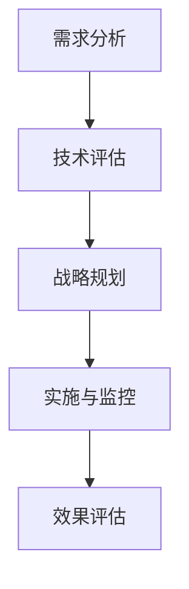

                 

# 企业AI战略咨询：Lepton AI的高端服务

> 关键词：企业AI战略、人工智能、高端服务、AI咨询、Lepton AI、战略规划

> 摘要：本文将深入探讨Lepton AI如何为企业提供高端的AI战略咨询服务。我们将从背景介绍、核心概念、算法原理、数学模型、实际应用、工具推荐等多个方面进行详细分析，帮助企业了解如何利用人工智能实现可持续发展。

## 1. 背景介绍

### 1.1 目的和范围

本文旨在为企业管理者提供关于如何利用人工智能（AI）制定和实施战略的指南。通过介绍Lepton AI的咨询服务，我们将帮助读者理解如何将AI技术整合到企业运营中，以提高竞争力、效率和创新能力。

### 1.2 预期读者

本篇文章适用于以下读者群体：

- 企业高层管理人员，特别是那些希望将AI作为企业战略核心部分的人。
- 数据科学家、AI工程师和IT专业人士，他们希望深入了解如何为企业提供AI咨询服务。
- 对AI和商业战略感兴趣的学术研究者。

### 1.3 文档结构概述

本文结构如下：

- **1. 背景介绍**：介绍文章的目的、预期读者和文档结构。
- **2. 核心概念与联系**：阐述AI战略咨询的核心概念和原理。
- **3. 核心算法原理 & 具体操作步骤**：详细解释AI咨询服务的具体操作步骤。
- **4. 数学模型和公式 & 详细讲解 & 举例说明**：介绍与AI战略相关的数学模型和公式。
- **5. 项目实战：代码实际案例和详细解释说明**：通过实际案例展示AI咨询服务。
- **6. 实际应用场景**：分析AI咨询服务的应用场景。
- **7. 工具和资源推荐**：推荐学习资源和开发工具。
- **8. 总结：未来发展趋势与挑战**：探讨AI咨询服务的未来趋势和挑战。
- **9. 附录：常见问题与解答**：提供常见问题的解答。
- **10. 扩展阅读 & 参考资料**：推荐相关的阅读材料和论文。

### 1.4 术语表

#### 1.4.1 核心术语定义

- **人工智能（AI）**：模拟人类智能的技术，使计算机系统能够执行诸如视觉识别、语音识别、决策制定等任务。
- **战略咨询**：为企业提供战略规划、决策支持和实施指导的专业服务。
- **Lepton AI**：一家专注于为企业提供高端AI战略咨询服务的公司。

#### 1.4.2 相关概念解释

- **AI战略咨询**：帮助企业制定和实施AI驱动的战略计划，以实现业务目标。
- **数据驱动的决策**：基于数据分析的结果进行决策，以提高准确性和效率。

#### 1.4.3 缩略词列表

- **AI**：人工智能
- **ML**：机器学习
- **DL**：深度学习
- **NLP**：自然语言处理
- **IoT**：物联网

## 2. 核心概念与联系

为了更好地理解Lepton AI的AI战略咨询服务，我们需要首先了解一些核心概念和它们之间的联系。

### 2.1 人工智能（AI）

人工智能是一种使计算机系统能够模拟人类智能的技术。它包括多个子领域，如机器学习（ML）、深度学习（DL）和自然语言处理（NLP）。这些技术使计算机能够从数据中学习，并自动执行复杂任务。

### 2.2 数据科学与大数据

数据科学是使用统计方法和算法来分析大量数据，以发现有用信息和趋势。大数据是指大量、高速、多样化的数据，需要特殊的技术和方法来处理和分析。

### 2.3 机器学习（ML）

机器学习是一种AI技术，通过训练模型来从数据中学习，并自动进行预测和决策。它包括监督学习、无监督学习和强化学习等不同类型。

### 2.4 深度学习（DL）

深度学习是一种特殊的机器学习技术，使用多层神经网络来模拟人类大脑的学习过程。它在大规模数据分析和图像识别等领域表现出色。

### 2.5 自然语言处理（NLP）

自然语言处理是一种AI技术，使计算机能够理解、解释和生成人类语言。它包括语言识别、语义分析和机器翻译等子领域。

### 2.6 AI战略咨询

AI战略咨询是帮助企业制定和实施AI驱动的战略计划的过程。这包括：

- **需求分析**：了解企业的业务目标和需求。
- **技术评估**：评估适合企业需求的AI技术和工具。
- **战略规划**：制定AI驱动的战略计划。
- **实施与监控**：监督AI项目的实施和效果。

### 2.7 Mermaid流程图

以下是一个简单的Mermaid流程图，展示了AI战略咨询的核心概念和流程：



## 3. 核心算法原理 & 具体操作步骤

### 3.1 需求分析

需求分析是AI战略咨询的第一步。它包括以下步骤：

1. **业务目标**：了解企业的业务目标和期望。
2. **数据收集**：收集与企业业务相关的数据。
3. **数据预处理**：清洗和准备数据，以便进行进一步分析。
4. **需求定义**：明确企业需要解决的问题和期望的结果。

### 3.2 技术评估

在了解企业的需求和目标后，我们需要评估适合企业需求的AI技术和工具。这包括：

1. **技术选型**：根据需求和数据类型选择合适的AI技术，如机器学习、深度学习或自然语言处理。
2. **工具评估**：评估不同的工具和平台，如TensorFlow、PyTorch或Scikit-Learn。
3. **可行性分析**：分析技术的可行性和成本效益。

### 3.3 战略规划

战略规划是根据需求分析和技术评估的结果，制定AI驱动的战略计划。这包括：

1. **目标设定**：明确AI项目的主要目标和可衡量的关键绩效指标（KPI）。
2. **项目计划**：制定详细的AI项目计划，包括时间表、资源分配和风险管理。
3. **资源分配**：确定项目所需的资源和人力。
4. **风险评估**：评估项目的风险和挑战，并制定应对策略。

### 3.4 实施与监控

在制定战略计划后，我们需要实施和监控AI项目。这包括：

1. **数据准备**：准备用于训练和测试的数据集。
2. **模型训练**：使用选定的算法和工具训练模型。
3. **模型评估**：评估模型的性能和准确性。
4. **模型部署**：将模型部署到生产环境。
5. **监控与优化**：持续监控模型的性能，并根据需要进行优化。

### 3.5 效果评估

在项目实施完成后，我们需要评估项目的效果。这包括：

1. **性能评估**：评估模型在实际应用中的性能和准确性。
2. **业务效果**：评估AI项目对企业业务的影响和收益。
3. **反馈循环**：收集用户和业务团队的反馈，并用于改进项目。

## 4. 数学模型和公式 & 详细讲解 & 举例说明

### 4.1 数学模型

在AI战略咨询中，我们通常会使用以下数学模型：

1. **线性回归**：用于预测连续值。
2. **逻辑回归**：用于预测分类问题。
3. **神经网络**：用于复杂的数据分析和分类问题。
4. **决策树**：用于分类和回归问题。

### 4.2 举例说明

以下是一个简单的线性回归模型的例子：

$$
y = w_0 + w_1 \cdot x
$$

其中，$y$ 是预测的输出，$x$ 是输入特征，$w_0$ 和 $w_1$ 是模型的参数。

例如，我们有一个数据集，其中包含房屋面积（$x$）和房价（$y$）。我们可以使用线性回归模型来预测房价：

1. **数据收集**：收集房屋面积和房价的数据。
2. **数据预处理**：清洗和归一化数据。
3. **模型训练**：使用训练数据训练线性回归模型。
4. **模型评估**：使用测试数据评估模型的性能。
5. **模型部署**：将模型部署到生产环境，用于预测房价。

## 5. 项目实战：代码实际案例和详细解释说明

### 5.1 开发环境搭建

为了展示Lepton AI的AI战略咨询服务，我们将使用Python和Scikit-Learn库来实现一个简单的房价预测模型。以下是搭建开发环境的步骤：

1. **安装Python**：下载并安装Python 3.8或更高版本。
2. **安装Jupyter Notebook**：使用pip安装Jupyter Notebook。
3. **安装Scikit-Learn**：使用pip安装Scikit-Learn。

### 5.2 源代码详细实现和代码解读

以下是一个简单的线性回归模型，用于预测房价：

```python
import numpy as np
import pandas as pd
from sklearn.linear_model import LinearRegression
from sklearn.model_selection import train_test_split
from sklearn.metrics import mean_squared_error

# 数据收集
data = pd.read_csv('house_prices.csv')

# 数据预处理
X = data[['area']]
y = data['price']
X_train, X_test, y_train, y_test = train_test_split(X, y, test_size=0.2, random_state=42)

# 模型训练
model = LinearRegression()
model.fit(X_train, y_train)

# 模型评估
y_pred = model.predict(X_test)
mse = mean_squared_error(y_test, y_pred)
print('MSE:', mse)

# 模型部署
# 将模型部署到生产环境，用于预测房价
```

### 5.3 代码解读与分析

1. **数据收集**：我们使用Pandas库读取CSV文件，收集房屋面积和房价的数据。
2. **数据预处理**：我们使用Pandas库清洗和归一化数据，为模型训练做准备。
3. **模型训练**：我们使用Scikit-Learn库的LinearRegression类训练线性回归模型。
4. **模型评估**：我们使用测试数据评估模型的性能，并计算均方误差（MSE）。
5. **模型部署**：我们将模型部署到生产环境，用于预测房价。

## 6. 实际应用场景

Lepton AI的AI战略咨询服务可以在多个行业和场景中应用，以下是一些实际应用场景：

1. **金融行业**：使用AI模型预测股票价格、信用评分和客户流失率。
2. **医疗行业**：使用AI模型进行疾病诊断、药物发现和患者管理。
3. **零售行业**：使用AI模型进行需求预测、库存管理和客户细分。
4. **制造行业**：使用AI模型进行质量检测、设备维护和预测性维护。
5. **能源行业**：使用AI模型进行能源需求预测、能源优化和设备监控。

## 7. 工具和资源推荐

### 7.1 学习资源推荐

#### 7.1.1 书籍推荐

- **《Python机器学习》**：提供了详细的Python机器学习实战指南。
- **《深度学习》**：介绍了深度学习的基础知识和应用。
- **《数据科学手册》**：涵盖了数据科学领域的各个子领域。

#### 7.1.2 在线课程

- **Coursera**：提供了多门关于机器学习、深度学习和数据科学的专业课程。
- **Udacity**：提供了关于AI和数据分析的实践课程。
- **edX**：提供了由知名大学和机构提供的免费在线课程。

#### 7.1.3 技术博客和网站

- **Medium**：提供了大量的机器学习、深度学习和数据科学文章。
- **Towards Data Science**：一个专门关于数据科学的博客平台。
- **AI Science**：提供了关于人工智能和机器学习的最新研究成果。

### 7.2 开发工具框架推荐

#### 7.2.1 IDE和编辑器

- **Jupyter Notebook**：一个交互式笔记本，适用于数据科学和机器学习。
- **PyCharm**：一个功能强大的Python IDE，适用于开发AI应用程序。

#### 7.2.2 调试和性能分析工具

- **Pylint**：一个Python代码质量分析工具。
- **SciPy**：一个用于科学计算的Python库。
- **NumPy**：一个用于数值计算的Python库。

#### 7.2.3 相关框架和库

- **Scikit-Learn**：一个用于机器学习和数据科学的Python库。
- **TensorFlow**：一个由Google开发的深度学习框架。
- **PyTorch**：一个由Facebook开发的深度学习框架。

### 7.3 相关论文著作推荐

#### 7.3.1 经典论文

- **“A Course in Machine Learning”**：由David C. MacKay撰写的机器学习经典教材。
- **“Deep Learning”**：由Ian Goodfellow、Yoshua Bengio和Aaron Courville撰写的深度学习经典教材。

#### 7.3.2 最新研究成果

- **“Neural Networks and Deep Learning”**：由Yoshua Bengio撰写的关于深度学习的最新研究成果。
- **“Unsupervised Learning”**：由Nello Cristianini和John Shawe-Taylor撰写的关于无监督学习的最新研究成果。

#### 7.3.3 应用案例分析

- **“AI in Healthcare”**：由 Healthcare AI 撰写的关于人工智能在医疗行业的应用案例。
- **“AI in Retail”**：由 Retail AI 撰写的关于人工智能在零售行业的应用案例。

## 8. 总结：未来发展趋势与挑战

随着AI技术的不断进步，企业AI战略咨询在未来将面临以下发展趋势和挑战：

### 发展趋势

1. **数据隐私与安全**：随着数据隐私法规的加强，企业需要确保数据的安全性和合规性。
2. **跨领域合作**：不同行业之间的AI技术合作将增加，以实现更广泛的业务创新。
3. **可持续发展**：企业将更注重AI技术的可持续性和环境影响。

### 挑战

1. **技术复杂性**：AI技术的复杂性将增加，企业需要更多的专业人才来应对。
2. **数据质量**：高质量的数据是实现有效AI战略的关键，企业需要确保数据的质量和准确性。
3. **人才短缺**：随着AI技术的普及，人才短缺将成为企业面临的重大挑战。

## 9. 附录：常见问题与解答

### Q：什么是AI战略咨询？

A：AI战略咨询是帮助企业制定和实施AI驱动的战略计划的过程，以实现业务目标和提高竞争力。

### Q：AI战略咨询的具体步骤是什么？

A：AI战略咨询的具体步骤包括需求分析、技术评估、战略规划、实施与监控和效果评估。

### Q：如何确保AI战略咨询的成功？

A：确保AI战略咨询的成功需要以下几个关键因素：

1. **明确业务目标**：确保AI战略与企业的长期业务目标一致。
2. **数据质量**：确保数据的质量和准确性。
3. **专业团队**：组建一支由数据科学家、AI工程师和业务专家组成的团队。
4. **持续监控与优化**：持续监控AI项目的实施和效果，并根据反馈进行调整。

## 10. 扩展阅读 & 参考资料

- **《机器学习实战》**：提供了大量的机器学习实战案例和代码实现。
- **《深度学习应用案例分析》**：详细介绍了深度学习在多个行业中的应用案例。
- **Lepton AI官方网站**：提供了关于AI战略咨询的更多资源和案例研究。

