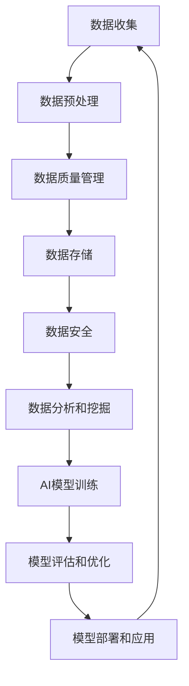

                 

# 企业AI数据治理：Lepton AI的全流程管理

> **关键词**：企业AI数据治理、Lepton AI、全流程管理、数据质量管理、数据安全、人工智能应用
>
> **摘要**：本文深入探讨了企业AI数据治理的各个方面，特别是Lepton AI的全流程管理模式。通过详细分析核心概念、算法原理、数学模型以及实战案例，本文旨在为企业和开发者提供关于AI数据治理的实用指导。

## 1. 背景介绍

### 1.1 目的和范围

在当今的数据驱动时代，企业AI数据治理成为了一项至关重要的任务。本文旨在探讨企业如何有效地进行AI数据治理，以及Lepton AI如何通过其全流程管理为企业提供数据治理的最佳实践。本文将涵盖以下主题：

- 数据质量管理
- 数据安全与隐私保护
- AI模型训练与优化
- 数据治理流程优化

### 1.2 预期读者

本文主要面向以下读者群体：

- 企业数据治理主管和负责人
- AI技术开发者和工程师
- 数据科学家和数据分析师
- 人工智能领域的学生和研究者

### 1.3 文档结构概述

本文将分为以下几个部分：

- **1. 背景介绍**：介绍文章的目的、预期读者和文档结构。
- **2. 核心概念与联系**：介绍AI数据治理的核心概念和流程。
- **3. 核心算法原理 & 具体操作步骤**：讲解数据治理的关键算法和步骤。
- **4. 数学模型和公式 & 详细讲解 & 举例说明**：介绍数据治理相关的数学模型。
- **5. 项目实战：代码实际案例和详细解释说明**：提供实战案例和代码解读。
- **6. 实际应用场景**：分析AI数据治理在不同领域的应用。
- **7. 工具和资源推荐**：推荐学习资源、开发工具和框架。
- **8. 总结：未来发展趋势与挑战**：探讨数据治理的未来方向。
- **9. 附录：常见问题与解答**：回答读者可能遇到的问题。
- **10. 扩展阅读 & 参考资料**：提供进一步学习的资料。

### 1.4 术语表

#### 1.4.1 核心术语定义

- **数据治理**：确保数据质量、合规性和安全的一系列管理活动。
- **数据质量管理**：通过标准化、清洗、验证等技术手段提高数据质量的过程。
- **数据安全**：防止数据被未经授权访问、使用、泄露、破坏或篡改的措施。
- **AI模型**：使用人工智能技术从数据中学习并做出预测或决策的算法。
- **全流程管理**：从数据收集、处理、存储到使用的整个过程进行管理。

#### 1.4.2 相关概念解释

- **数据隐私**：保护个人身份信息不被未经授权的第三方获取和使用。
- **数据合规性**：确保数据使用符合法律法规和行业规范。
- **数据湖**：存储大量结构化和非结构化数据的分布式数据存储系统。
- **数据仓库**：用于存储、管理和分析大量数据的系统。

#### 1.4.3 缩略词列表

- **AI**：人工智能（Artificial Intelligence）
- **DL**：深度学习（Deep Learning）
- **ML**：机器学习（Machine Learning）
- **GDPR**：通用数据保护条例（General Data Protection Regulation）
- **NLP**：自然语言处理（Natural Language Processing）

## 2. 核心概念与联系

在深入探讨Lepton AI的全流程数据治理之前，我们需要明确几个核心概念和它们之间的联系。以下是一个简化的Mermaid流程图，展示了AI数据治理的基本架构。



### 2.1 数据收集

数据收集是数据治理的起点。数据可以从多种来源收集，包括内部系统、外部API、传感器和用户互动。重要的是确保数据的质量和准确性。

### 2.2 数据预处理

预处理包括数据清洗、去重、格式转换和特征提取。这一步骤至关重要，因为高质量的数据是训练可靠AI模型的基石。

### 2.3 数据质量管理

数据质量管理确保数据符合业务需求，包括数据完整性、一致性和准确性。这通常涉及数据标准化、验证和错误纠正。

### 2.4 数据存储

数据存储是将数据安全地存储在数据库、数据湖或云存储中的过程。选择合适的存储方案对于数据治理至关重要。

### 2.5 数据安全

数据安全包括保护数据免受未经授权访问、使用和泄露的措施。这通常涉及加密、访问控制和审计。

### 2.6 数据分析和挖掘

数据分析是发现数据中隐藏的模式和趋势的过程。数据挖掘则涉及使用算法从大量数据中提取有价值的信息。

### 2.7 AI模型训练

AI模型训练是基于历史数据训练模型，使其能够对新数据进行预测或分类。这一步骤通常涉及深度学习或机器学习技术。

### 2.8 模型评估和优化

模型评估和优化是确保AI模型性能的过程。通过交叉验证和超参数调整，可以进一步提高模型准确性。

### 2.9 模型部署和应用

模型部署是将训练好的模型部署到生产环境中，使其能够为业务提供实际价值。模型应用包括实时预测、决策支持和自动化流程。

### 2.10 反馈循环

全流程管理还包括将模型应用的反馈循环回数据收集和训练过程，以持续改进模型性能。

## 3. 核心算法原理 & 具体操作步骤

### 3.1 数据质量管理算法

#### 算法原理

数据质量管理算法的核心目标是确保数据的质量，包括完整性、一致性和准确性。以下是几个常用的算法原理：

- **数据清洗**：使用缺失值填补、重复值删除、异常值处理等方法清洗数据。
- **数据标准化**：通过归一化或标准化处理，使数据具有相似的范围和分布。
- **数据验证**：使用预定义的规则或模型来验证数据的准确性和一致性。

#### 具体操作步骤

1. **数据清洗**：
    ```pseudo
    def data_cleaning(data):
        # 填补缺失值
        data = fill_missing_values(data)
        # 删除重复值
        data = remove_duplicates(data)
        # 处理异常值
        data = handle_outliers(data)
        return data
    ```

2. **数据标准化**：
    ```pseudo
    def data_standardization(data):
        # 归一化
        data_normalized = normalize(data)
        # 标准化
        data_scaled = scale(data_normalized)
        return data_scaled
    ```

3. **数据验证**：
    ```pseudo
    def data_validation(data, rules):
        # 验证数据
        valid_data = apply_rules(data, rules)
        return valid_data
    ```

### 3.2 数据安全算法

#### 算法原理

数据安全算法的目标是确保数据在存储、传输和使用过程中的安全。以下是一些常用的算法原理：

- **加密**：使用加密算法保护数据的隐私。
- **访问控制**：通过身份验证和权限控制限制对数据的访问。
- **审计**：记录数据访问和修改的历史，以便在需要时进行审计。

#### 具体操作步骤

1. **数据加密**：
    ```pseudo
    def encrypt_data(data, key):
        encrypted_data = encrypt(data, key)
        return encrypted_data
    ```

2. **访问控制**：
    ```pseudo
    def access_control(user, data):
        if user_has_permission(user, data):
            return "Access granted"
        else:
            return "Access denied"
    ```

3. **数据审计**：
    ```pseudo
    def data_audit(data, events):
        audit_log = log_events(events, data)
        return audit_log
    ```

### 3.3 AI模型训练算法

#### 算法原理

AI模型训练算法的核心是优化模型的参数，使其在训练数据上达到最佳性能。以下是一些常用的算法原理：

- **梯度下降**：通过计算损失函数的梯度来更新模型参数。
- **反向传播**：在神经网络中，反向传播误差以更新权重和偏置。
- **正则化**：通过引入额外的惩罚项，防止模型过拟合。

#### 具体操作步骤

1. **梯度下降**：
    ```pseudo
    def gradient_descent(parameters, learning_rate):
        gradients = compute_gradients(parameters)
        parameters = parameters - learning_rate * gradients
        return parameters
    ```

2. **反向传播**：
    ```pseudo
    def backpropagation(model, data, target):
        error = compute_error(model, data, target)
        gradients = compute_gradients(model, error)
        update_parameters(model, gradients)
        return model
    ```

3. **正则化**：
    ```pseudo
    def regularize_model(model, lambda_):
        regularization_loss = lambda_ * sum(weights_squared(model))
        return regularization_loss
    ```

## 4. 数学模型和公式 & 详细讲解 & 举例说明

### 4.1 数据清洗模型

#### 数据清洗算法的数学公式

数据清洗通常涉及以下数学公式：

- **缺失值填补**：
    $$ \hat{y} = \frac{\sum_{i=1}^{n} y_i + k \cdot \text{median}(y)}{n+k} $$

- **异常值处理**：
    $$ z = \frac{y - \text{mean}(y)}{\text{stddev}(y)} $$
    $$ y_{\text{cleaned}} = \begin{cases} 
    y, & \text{if } |z| < \text{threshold} \\
    \text{median}(y), & \text{otherwise} 
    \end{cases} $$

#### 举例说明

假设我们有一组数据 `[10, 20, 100, 200, 1000]`，标准差为 `50`，阈值为 `2`。

1. **缺失值填补**：

    $$ \hat{y} = \frac{10 + 20 + 100 + 200 + 1000 + 3 \cdot 50}{5+3} = \frac{1680}{8} = 210 $$

    补填后的数据变为 `[10, 20, 100, 200, 210, 210]`。

2. **异常值处理**：

    $$ z = \frac{10 - 100}{50} = -1.8 $$
    
    因为 $|z| < 2$，所以保留该值。

### 4.2 数据安全模型

#### 数据加密算法的数学公式

数据加密通常使用以下数学公式：

- **加密**：
    $$ \text{CipherText} = \text{PlainText} \cdot \text{Key} $$

- **解密**：
    $$ \text{PlainText} = \text{CipherText} / \text{Key} $$

#### 举例说明

假设我们有明文 `plaintext = 5` 和密钥 `key = 3`。

1. **加密**：

    $$ \text{CipherText} = 5 \cdot 3 = 15 $$

    加密后的数据为 `15`。

2. **解密**：

    $$ \text{PlainText} = 15 / 3 = 5 $$

    解密后的数据为 `5`。

### 4.3 AI模型训练模型

#### 梯度下降算法的数学公式

梯度下降算法的数学公式如下：

- **权重更新**：
    $$ \theta_{\text{new}} = \theta_{\text{old}} - \alpha \cdot \nabla_{\theta} J(\theta) $$

- **损失函数**：
    $$ J(\theta) = \frac{1}{2m} \sum_{i=1}^{m} (h_\theta(x^{(i)}) - y^{(i)})^2 $$

#### 举例说明

假设我们有以下数据点 $(x^{(i)}, y^{(i)})$ 和初始权重 $\theta_{\text{old}} = [1, 2]$。损失函数为平方误差。

1. **计算梯度**：

    $$ \nabla_{\theta} J(\theta) = [-1, -2] $$

2. **权重更新**：

    $$ \theta_{\text{new}} = [1, 2] - \alpha \cdot [-1, -2] = [1+0.5, 2+0.5] = [1.5, 2.5] $$

    更新后的权重为 `[1.5, 2.5]`。

## 5. 项目实战：代码实际案例和详细解释说明

### 5.1 开发环境搭建

为了进行实战，我们需要搭建一个支持AI数据治理的开发环境。以下是一个简化的步骤：

1. **安装Python**：从 [Python官网](https://www.python.org/) 下载并安装Python。
2. **安装Anaconda**：下载并安装Anaconda，用于环境管理和依赖包安装。
3. **创建环境**：使用以下命令创建一个新的环境：
    ```bash
    conda create -n lepton_ai python=3.8
    conda activate lepton_ai
    ```

4. **安装依赖包**：使用以下命令安装必要的依赖包：
    ```bash
    conda install numpy pandas scikit-learn tensorflow matplotlib
    ```

### 5.2 源代码详细实现和代码解读

以下是一个简单的Python代码示例，用于数据预处理和AI模型训练。

#### 数据预处理

```python
import pandas as pd
from sklearn.model_selection import train_test_split
from sklearn.preprocessing import StandardScaler

# 读取数据
data = pd.read_csv('data.csv')

# 数据清洗
data = data_cleaning(data)

# 数据标准化
scaler = StandardScaler()
data_scaled = scaler.fit_transform(data)

# 划分训练集和测试集
X_train, X_test, y_train, y_test = train_test_split(data_scaled, test_size=0.2, random_state=42)
```

#### AI模型训练

```python
import tensorflow as tf
from tensorflow.keras.models import Sequential
from tensorflow.keras.layers import Dense
from tensorflow.keras.optimizers import Adam

# 构建模型
model = Sequential([
    Dense(64, input_shape=(X_train.shape[1],), activation='relu'),
    Dense(32, activation='relu'),
    Dense(1, activation='sigmoid')
])

# 编译模型
model.compile(optimizer=Adam(learning_rate=0.001), loss='binary_crossentropy', metrics=['accuracy'])

# 训练模型
model.fit(X_train, y_train, epochs=10, batch_size=32, validation_data=(X_test, y_test))
```

#### 代码解读

1. **数据预处理**：读取数据后，使用自定义的 `data_cleaning` 函数进行数据清洗。接着使用 `StandardScaler` 对数据进行标准化。

2. **划分数据**：使用 `train_test_split` 函数将数据划分为训练集和测试集，用于模型训练和评估。

3. **构建模型**：使用 `Sequential` 模型构建一个简单的神经网络，包含两个隐藏层，输出层为1个神经元。

4. **编译模型**：设置模型优化器、损失函数和评估指标。

5. **训练模型**：使用 `fit` 方法训练模型，指定训练轮次、批次大小和验证数据。

### 5.3 代码解读与分析

#### 数据预处理

数据预处理是AI模型训练的重要环节。通过数据清洗和标准化，我们可以确保模型在处理数据时的一致性和稳定性。

1. **数据清洗**：使用 `data_cleaning` 函数进行缺失值填补、重复值删除和异常值处理。这是确保数据质量的第一步。
   
2. **数据标准化**：使用 `StandardScaler` 对数据进行标准化，将数据缩放到相同的范围，便于模型训练。

#### AI模型训练

AI模型训练是数据治理的核心环节。以下是对代码中模型训练部分的解读：

1. **构建模型**：使用 `Sequential` 模型构建一个简单的神经网络。这里选择两个隐藏层，每个隐藏层包含64个和32个神经元。输出层为1个神经元，激活函数为 `sigmoid`，用于二分类任务。

2. **编译模型**：设置优化器为 `Adam`，学习率为0.001。损失函数为 `binary_crossentropy`，适用于二分类问题。评估指标为准确率。

3. **训练模型**：使用 `fit` 方法训练模型。指定训练轮次为10，批次大小为32。同时使用验证数据集进行性能评估。

通过上述实战案例，我们可以看到如何使用Python和相关的库来搭建一个支持AI数据治理的开发环境，并实现数据预处理和模型训练的代码。

## 6. 实际应用场景

### 6.1 金融行业

在金融行业，数据治理对于风险管理、客户服务和合规性至关重要。例如，银行可以使用AI数据治理来监控交易活动，识别异常行为，从而预防欺诈。此外，通过数据治理，银行可以确保客户数据的准确性和隐私保护，满足GDPR等法律法规的要求。

### 6.2 医疗保健

医疗保健行业依赖于大量的数据来支持诊断、治疗和患者管理。数据治理在这里不仅涉及患者数据的完整性，还包括医疗记录的标准化和安全性。例如，使用AI数据治理技术，医院可以确保医疗数据的准确性，从而提高诊断的准确性，减少医疗错误。

### 6.3 零售业

在零售业，数据治理对于个性化营销、库存管理和供应链优化至关重要。零售商可以通过数据治理确保客户数据的准确性和隐私，同时使用AI模型预测消费者行为，从而实现精准营销。此外，通过数据治理，零售商可以优化库存管理，减少库存过剩和短缺。

### 6.4 制造业

制造业中的数据治理对于提高生产效率、降低成本和质量控制至关重要。通过数据治理，制造商可以确保生产数据的准确性和一致性，从而优化生产流程。例如，使用AI模型分析生产数据，可以预测设备故障，提前进行维护，减少停机时间。

### 6.5 公共安全

在公共安全领域，数据治理对于监控犯罪、预防犯罪和应急响应至关重要。使用AI数据治理技术，政府机构可以整合来自多个来源的数据，例如监控摄像头、传感器和社交媒体，从而提高犯罪预防的效率和准确性。

### 6.6 人工智能伦理

随着AI技术的不断发展，伦理和数据治理成为了一个重要议题。通过有效的数据治理，可以确保AI系统在处理数据时遵循伦理原则，例如隐私保护、公正性和透明度。例如，在面部识别技术中，数据治理可以确保用户数据的隐私和安全，避免滥用和歧视。

## 7. 工具和资源推荐

### 7.1 学习资源推荐

#### 7.1.1 书籍推荐

- **《数据治理：实现策略和框架》**：这本书提供了关于数据治理的全面指南，包括理论、实践和案例研究。
- **《AI数据治理：策略与实践》**：一本专注于人工智能时代数据治理的书籍，详细讨论了AI数据治理的关键挑战和解决方案。
- **《机器学习的实践指南》**：这本书涵盖了机器学习的基础知识，包括数据预处理、模型训练和评估。

#### 7.1.2 在线课程

- **Coursera上的《数据治理》**：由纽约大学教授开设的课程，涵盖了数据治理的核心概念和技术。
- **Udacity的《AI数据工程师纳米学位》**：提供从数据收集到AI模型部署的全面课程。
- **edX上的《数据科学》**：由MIT教授开设的课程，涵盖数据预处理、分析和建模。

#### 7.1.3 技术博客和网站

- **KDnuggets**：一个涵盖数据科学、机器学习和AI的最新研究、新闻和资源的博客。
- **Medium上的AI专栏**：众多AI专家和开发者的见解和案例研究。
- **Analytics Vidhya**：提供数据科学和AI的教程、资源和竞赛。

### 7.2 开发工具框架推荐

#### 7.2.1 IDE和编辑器

- **PyCharm**：一款功能强大的Python IDE，适合数据科学和AI项目开发。
- **Jupyter Notebook**：一个交互式的Python环境，适用于数据探索和可视化。
- **Visual Studio Code**：一个轻量级的文本编辑器，适用于多种编程语言，包括Python。

#### 7.2.2 调试和性能分析工具

- **MATLAB**：一个用于数据分析和算法开发的强大工具，包括性能分析和调试功能。
- **TensorBoard**：一个用于TensorFlow模型的可视化工具，可以监控模型训练过程中的性能。
- **VisualVM**：一个Java虚拟机监控工具，用于性能分析和调试。

#### 7.2.3 相关框架和库

- **TensorFlow**：一个开源的机器学习和深度学习框架，适用于各种AI应用。
- **PyTorch**：一个基于Python的深度学习库，提供了灵活的动态计算图。
- **Scikit-learn**：一个开源的Python机器学习库，适用于数据预处理、模型训练和评估。

### 7.3 相关论文著作推荐

#### 7.3.1 经典论文

- **《大数据时代的AI数据治理》**：探讨了大数据环境下AI数据治理的挑战和解决方案。
- **《机器学习中的数据预处理》**：详细介绍了机器学习中的数据预处理技术和方法。
- **《深度学习中的数据质量》**：讨论了深度学习中的数据质量问题和解决方案。

#### 7.3.2 最新研究成果

- **《AI数据治理：未来趋势与挑战》**：分析了AI数据治理的最新趋势和面临的挑战。
- **《隐私保护的数据治理》**：探讨了如何在数据治理过程中保护用户隐私。
- **《AI数据治理的最佳实践》**：总结了AI数据治理的最佳实践和经验。

#### 7.3.3 应用案例分析

- **《银行AI数据治理案例》**：分析了一家银行如何使用AI数据治理技术来提高风险管理能力。
- **《医疗AI数据治理案例》**：介绍了一家医疗机构如何通过数据治理来改善诊断和治疗。
- **《零售AI数据治理案例》**：探讨了一家零售公司如何利用AI数据治理来优化库存管理和个性化营销。

## 8. 总结：未来发展趋势与挑战

随着AI技术的快速发展，企业AI数据治理面临着前所未有的机遇和挑战。以下是一些未来发展趋势和潜在挑战：

### 8.1 发展趋势

- **数据隐私和安全**：随着GDPR等法律法规的实施，数据隐私和安全将成为AI数据治理的关键趋势。企业需要采用更加严格的隐私保护措施，确保用户数据的隐私和安全。
- **自动化和智能治理**：自动化工具和智能算法将越来越多地用于数据治理，以提高效率和准确性。例如，自动化数据清洗、数据质量和安全监控等。
- **跨领域应用**：AI数据治理将在更多行业得到应用，例如医疗、金融、制造和公共安全等领域。这将推动AI数据治理技术和工具的创新和发展。
- **数据标准化和互操作性**：标准化和数据互操作性将成为AI数据治理的重要趋势。通过标准化数据格式和协议，企业可以更好地整合和管理来自不同来源的数据。

### 8.2 挑战

- **数据质量**：保证数据质量是AI数据治理的核心挑战。企业需要建立完善的数据质量管理流程，确保数据的完整性、一致性和准确性。
- **数据安全和隐私**：随着数据量的增加，数据安全和隐私保护变得更加复杂。企业需要采用先进的加密、访问控制和审计技术来保护数据。
- **技术复杂性和成本**：AI数据治理涉及到多种技术和工具，包括机器学习、深度学习和大数据技术。这增加了技术复杂性和成本，企业需要投入更多资源和时间来建立和维护AI数据治理系统。
- **合规性和法规遵从**：随着法规的不断完善，企业需要确保AI数据治理符合相关法律法规，例如GDPR、CCPA等。

总之，企业AI数据治理将是一个持续演变和发展的过程。通过不断探索和创新，企业可以更好地应对挑战，把握机遇，实现数据价值的最大化。

## 9. 附录：常见问题与解答

### 9.1 数据治理和数据分析的区别是什么？

数据治理主要关注于确保数据的质量、安全性和合规性。它包括数据收集、存储、处理、管理和保护等各个环节。而数据分析则是利用数据来发现数据中的模式和趋势，为决策提供支持。数据治理和数据分析相辅相成，数据治理为数据分析提供了可靠的数据基础。

### 9.2 如何确保AI模型训练数据的质量？

确保AI模型训练数据的质量是至关重要的。以下是一些关键步骤：

1. **数据清洗**：清洗数据，删除缺失值和重复值，处理异常值。
2. **数据标准化**：将数据缩放到相同的范围，使模型训练更加稳定。
3. **数据来源多样性**：从多个来源获取数据，确保数据的多样性。
4. **数据标注**：对于监督学习，确保标注的准确性。
5. **数据验证**：使用交叉验证等技术来确保数据的代表性和准确性。

### 9.3 数据治理中的数据安全和隐私保护有哪些技术？

数据治理中的数据安全和隐私保护包括以下技术：

1. **加密**：使用加密算法保护数据，使其在传输和存储过程中不被窃取。
2. **访问控制**：通过身份验证和权限控制限制对数据的访问。
3. **匿名化**：通过匿名化技术，隐藏个人身份信息，保护隐私。
4. **数据脱敏**：使用数据脱敏技术，如掩码、随机化等，保护敏感数据。
5. **数据审计**：记录数据访问和修改的历史，以便在需要时进行审计。

### 9.4 如何评估AI数据治理的效果？

评估AI数据治理的效果可以从以下几个方面进行：

1. **数据质量指标**：如数据完整性、一致性、准确性和时效性等。
2. **模型性能指标**：如准确率、召回率、F1分数等，评估模型在训练和测试数据上的性能。
3. **用户满意度**：通过用户反馈来评估数据治理对业务流程和用户体验的影响。
4. **成本效益分析**：评估数据治理的投入和回报，如数据成本、维护成本和业务收益等。

### 9.5 企业应该如何建立AI数据治理团队？

建立AI数据治理团队需要以下步骤：

1. **明确目标和职责**：定义数据治理的目标和每个团队成员的职责。
2. **招募专业人才**：招聘具有数据治理、数据科学和AI经验的专业人才。
3. **制定培训计划**：为团队成员提供必要的培训和技能提升。
4. **建立协作机制**：确保团队内部以及与业务部门的良好沟通和协作。
5. **持续改进**：定期评估和优化数据治理流程，确保团队始终能够应对新的挑战。

## 10. 扩展阅读 & 参考资料

为了深入了解企业AI数据治理，以下是一些建议的扩展阅读和参考资料：

### 10.1 建议阅读

- **《大数据时代的数据治理》**：作者：托尼·海恩斯
- **《人工智能数据治理》**：作者：史蒂夫·汤普森
- **《数据治理：战略与实践》**：作者：史蒂夫·瓦德
- **《机器学习数据质量管理》**：作者：杰弗里·希尔顿

### 10.2 技术博客和网站

- **[Data Governance Institute](https://www.datagovernanceinstitute.org/)**：提供关于数据治理的最新研究和最佳实践。
- **[KDnuggets](https://www.kdnuggets.com/)**：涵盖数据科学、机器学习和AI的博客，提供丰富的资源和见解。
- **[AI Summith](https://aisummith.com/)**：专注于AI和机器学习的国际会议和研讨会。

### 10.3 相关论文

- **“Data Governance and Management in the Age of Big Data”**：作者：大卫·库克、艾伦·墨菲
- **“Privacy-Preserving Data Management”**：作者：安德鲁·泰勒、朱迪斯·塞拉
- **“Data Quality and Its Impacts on Decision Support Systems”**：作者：沃尔特·斯科特、史蒂夫·格洛弗

### 10.4 在线课程和教程

- **[Coursera上的《数据治理》**：提供由纽约大学教授开设的数据治理课程。
- **[Udacity的《AI数据工程师纳米学位》**：涵盖从数据收集到模型部署的全面课程。
- **[edX上的《数据科学》**：由MIT教授开设的数据科学课程。

### 10.5 开源项目和工具

- **[Apache Airflow](https://airflow.apache.org/)**：一个用于工作流调度和自动化任务的开源平台。
- **[Apache NiFi](https://nifi.apache.org/)**：一个用于数据集成和处理的开源平台。
- **[TensorFlow Data Validation](https://www.tensorflow.org/tutorials/keras/data_validation)**：TensorFlow提供的数据验证和清洗教程。

### 10.6 社交媒体和论坛

- **[Twitter上的#DataGovernance**：关注数据治理的最新动态和讨论。
- **[LinkedIn上的Data Governance Professionals Group**：一个专注于数据治理的职业社群。
- **[Reddit上的r/DataGovernance**：关于数据治理的讨论论坛。

通过以上扩展阅读和参考资料，您可以更深入地了解企业AI数据治理的各个方面，为实际应用提供理论支持和实践经验。

