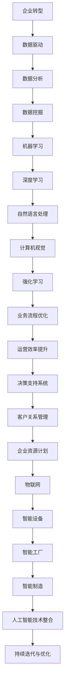
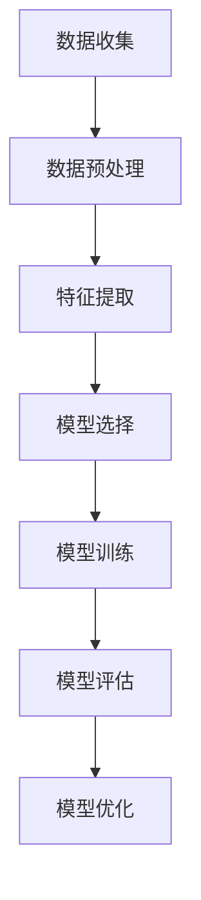
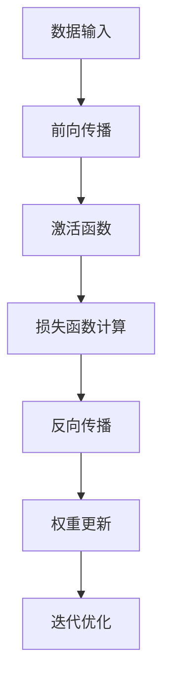
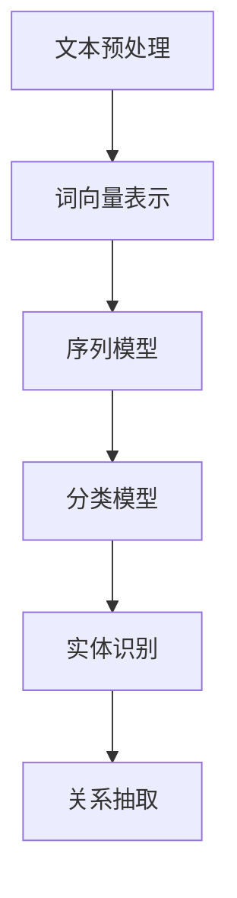
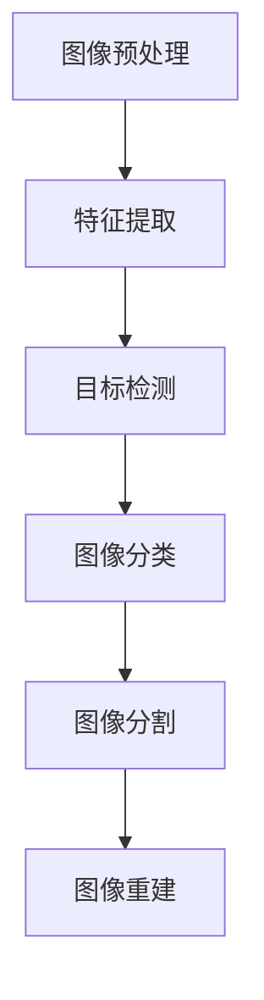

                 

# 企业转型中的AI应用技术

## 关键词
AI应用，企业转型，人工智能技术，商业智能，数字化转型，算法优化，数据挖掘，机器学习，深度学习，业务流程优化，运营效率提升。

## 摘要
本文深入探讨了企业在转型过程中应用人工智能技术的关键作用。通过逐步分析，我们揭示了AI在提高企业运营效率、优化业务流程、增强决策支持等方面的潜力。文章将首先介绍企业转型的背景和AI技术的核心概念，随后详细阐述AI算法原理、数学模型及其应用实例。在此基础上，我们将分享具体的实战案例，展示如何在实际项目中落地AI技术。随后，文章将探讨AI在不同行业中的应用场景，并推荐相关工具和资源，以帮助企业更好地利用AI技术实现转型。最后，本文将总结AI技术在企业转型中的发展趋势与挑战，为未来企业提供战略思考。

## 1. 背景介绍

### 1.1 目的和范围
本文旨在为企业领导者、技术决策者以及相关从业人员提供一套系统化的AI应用指南，帮助他们理解AI在企业转型中的关键作用，并掌握如何有效实施和优化AI技术。文章将涵盖AI技术在企业运营、决策支持、业务流程优化等多个方面的应用，并通过具体案例进行解析。

### 1.2 预期读者
预期读者包括：
- 企业CEO、CTO和高级管理层；
- 数据科学和AI技术从业者；
- 企业战略规划与IT部门的专业人员；
- 对AI应用技术感兴趣的科研人员和学生。

### 1.3 文档结构概述
本文分为十个部分：
1. 背景介绍：介绍企业转型的必要性和AI技术的核心概念。
2. 核心概念与联系：介绍AI技术的核心原理和架构。
3. 核心算法原理 & 具体操作步骤：详细讲解AI算法原理和操作步骤。
4. 数学模型和公式 & 详细讲解 & 举例说明：介绍AI应用的数学模型和公式，并提供实例说明。
5. 项目实战：代码实际案例和详细解释说明。
6. 实际应用场景：探讨AI技术在企业中的具体应用场景。
7. 工具和资源推荐：推荐学习资源、开发工具和框架。
8. 总结：未来发展趋势与挑战。
9. 附录：常见问题与解答。
10. 扩展阅读 & 参考资料：提供进一步阅读的资源。

### 1.4 术语表

#### 1.4.1 核心术语定义
- 企业转型：企业为了适应市场环境变化、提升竞争力而进行的战略调整和变革过程。
- AI应用：人工智能技术在具体业务场景中的应用，如机器学习、深度学习、自然语言处理等。
- 数据挖掘：从大量数据中提取有价值信息的过程。
- 机器学习：利用数据和统计方法建立模型，自动从数据中学习规律和模式。
- 深度学习：一种特殊的机器学习方法，通过多层神经网络进行数据特征提取和学习。

#### 1.4.2 相关概念解释
- 业务流程优化：通过分析和改进业务流程，提高效率和降低成本。
- 决策支持系统（DSS）：辅助决策者进行决策的计算机系统。
- 运营效率提升：提高企业运营过程中的效率，降低资源浪费。

#### 1.4.3 缩略词列表
- AI：人工智能
- ML：机器学习
- DL：深度学习
- DSS：决策支持系统
- IoT：物联网
- CRM：客户关系管理
- ERP：企业资源计划

## 2. 核心概念与联系

在探讨AI在企业转型中的应用之前，我们首先需要了解一些核心概念和它们之间的联系。以下是AI技术中几个关键概念及其相互关系的Mermaid流程图：



### 2.1. 企业转型中的数据驱动

企业转型离不开数据驱动的理念。数据是企业运营的基石，通过数据分析、数据挖掘等技术，企业可以挖掘数据中的价值，从而支持决策和业务优化。

### 2.2. 数据分析、数据挖掘与机器学习

数据分析是数据挖掘的基础，通过统计和分析数据，识别数据中的规律和趋势。数据挖掘则是在海量数据中寻找隐藏的模式和知识，而机器学习是数据挖掘的高级形式，通过构建模型自动学习数据中的规律。

### 2.3. 深度学习、自然语言处理与计算机视觉

深度学习是一种基于多层神经网络的机器学习方法，它在图像识别、语音识别和自然语言处理等领域取得了显著成果。自然语言处理（NLP）关注文本数据的处理，而计算机视觉（CV）则关注图像和视频数据的处理。

### 2.4. 强化学习在业务流程优化中的应用

强化学习是一种通过试错和反馈进行学习的方法，它在业务流程优化中可以用于优化供应链管理、需求预测和资源分配等。

### 2.5. 业务流程优化、运营效率提升与决策支持系统

业务流程优化通过改进流程提高效率，运营效率提升则是通过技术和管理的创新降低成本。决策支持系统（DSS）利用数据和算法支持决策者进行决策，从而提高决策的准确性和效率。

## 3. 核心算法原理 & 具体操作步骤

在了解了AI在企业转型中的核心概念和联系后，接下来我们将详细讲解AI技术的核心算法原理和具体操作步骤。

### 3.1. 机器学习算法原理

机器学习算法的核心思想是通过训练数据集来构建模型，使得模型能够对新数据进行预测或分类。以下是机器学习算法的基本步骤：



- **数据收集**：收集相关的训练数据。
- **数据预处理**：清洗数据，处理缺失值和异常值。
- **特征提取**：从原始数据中提取有用的特征。
- **模型选择**：根据业务需求选择合适的模型。
- **模型训练**：使用训练数据集训练模型。
- **模型评估**：使用验证数据集评估模型性能。
- **模型优化**：根据评估结果对模型进行调整和优化。

### 3.2. 深度学习算法原理

深度学习是一种基于多层神经网络的机器学习方法，它通过层层提取数据特征，从而实现对数据的复杂建模。以下是深度学习算法的基本步骤：



- **数据输入**：将输入数据传递给神经网络。
- **前向传播**：数据在神经网络中传递，经过每一层神经元的计算。
- **激活函数**：对神经元输出进行非线性变换。
- **损失函数计算**：计算模型预测值与真实值之间的差异。
- **反向传播**：将损失函数的误差反向传播，更新神经网络权重。
- **权重更新**：根据梯度信息调整神经网络权重。
- **迭代优化**：重复前向传播和反向传播，直到模型达到预期性能。

### 3.3. 自然语言处理（NLP）算法原理

自然语言处理是一种使计算机能够理解、处理和生成自然语言的技术。以下是NLP算法的基本步骤：



- **文本预处理**：对文本进行分词、去停用词等处理。
- **词向量表示**：将文本转换为词向量，用于神经网络处理。
- **序列模型**：处理文本序列，如循环神经网络（RNN）和长短时记忆网络（LSTM）。
- **分类模型**：对文本进行分类，如支持向量机（SVM）和朴素贝叶斯（NB）。
- **实体识别**：识别文本中的实体，如人名、地名等。
- **关系抽取**：提取实体之间的关系，如“某某是某某的丈夫”。

### 3.4. 计算机视觉（CV）算法原理

计算机视觉是一种使计算机能够像人类一样理解、处理和解释图像和视频的技术。以下是CV算法的基本步骤：



- **图像预处理**：对图像进行滤波、去噪等处理。
- **特征提取**：从图像中提取特征，如边缘、纹理等。
- **目标检测**：检测图像中的目标，如人脸、车辆等。
- **图像分类**：对图像进行分类，如猫狗分类、花卉分类等。
- **图像分割**：将图像分割成不同的区域，如语义分割、实例分割等。
- **图像重建**：根据图像数据进行重建，如三维重建、图像超分辨率等。

通过以上对AI核心算法原理的讲解，我们可以看到AI技术在企业转型中的应用潜力。接下来，我们将进一步探讨这些算法在实际项目中的应用步骤和具体操作。

## 4. 数学模型和公式 & 详细讲解 & 举例说明

在AI技术的应用过程中，数学模型和公式起着至关重要的作用。以下我们将详细讲解一些常用的数学模型和公式，并通过具体例子进行说明。

### 4.1. 机器学习中的线性回归模型

线性回归是一种经典的机器学习算法，用于预测连续值。其数学模型可以表示为：

$$ y = \beta_0 + \beta_1 \cdot x + \epsilon $$

其中，$ y $ 是预测值，$ x $ 是输入特征，$ \beta_0 $ 和 $ \beta_1 $ 是模型参数，$ \epsilon $ 是误差项。

**例子：** 假设我们要预测房价，输入特征是房屋面积 $ x $。我们可以通过线性回归模型来建立房价与房屋面积之间的关系。

首先，我们收集一定数量的房屋销售数据，包含房屋面积和对应的房价。然后，我们使用线性回归算法对数据集进行训练，得到模型参数 $ \beta_0 $ 和 $ \beta_1 $。最后，我们可以使用训练好的模型来预测新房屋的房价。

### 4.2. 机器学习中的逻辑回归模型

逻辑回归是一种用于分类的机器学习算法，其数学模型可以表示为：

$$ P(y=1) = \frac{1}{1 + e^{-(\beta_0 + \beta_1 \cdot x)}} $$

其中，$ P(y=1) $ 是目标变量为1的概率，$ x $ 是输入特征，$ \beta_0 $ 和 $ \beta_1 $ 是模型参数。

**例子：** 假设我们要对客户进行分类，判断他们是否愿意购买某种产品。输入特征包括客户的年龄、收入、购买历史等。我们可以使用逻辑回归模型来建立客户购买意愿的预测模型。

首先，我们收集客户的购买数据，并标记购买意愿。然后，我们使用逻辑回归算法对数据集进行训练，得到模型参数 $ \beta_0 $ 和 $ \beta_1 $。最后，我们可以使用训练好的模型来预测新客户的购买意愿。

### 4.3. 深度学习中的卷积神经网络（CNN）

卷积神经网络是一种用于图像识别和处理的深度学习模型。其核心组件是卷积层，卷积层的数学模型可以表示为：

$$ h_{ij} = \sum_{k} w_{ik,j} \cdot x_{kj} + b_j $$

其中，$ h_{ij} $ 是卷积层输出的特征图，$ x_{kj} $ 是输入特征图，$ w_{ik,j} $ 是卷积核，$ b_j $ 是偏置。

**例子：** 假设我们要对图像进行分类，输入图像的大小为 $ 28 \times 28 $。我们可以使用卷积神经网络来建立图像分类模型。

首先，我们收集一定数量的图像数据，并标记它们所属的类别。然后，我们设计卷积神经网络的结构，包括卷积层、池化层和全连接层。接着，我们使用训练数据集对网络进行训练，调整卷积核和偏置参数，使模型能够准确分类图像。

### 4.4. 自然语言处理中的循环神经网络（RNN）

循环神经网络是一种用于处理序列数据的深度学习模型，其核心组件是隐藏状态，隐藏状态的数学模型可以表示为：

$$ h_t = \sigma(W_h \cdot [h_{t-1}, x_t] + b_h) $$

其中，$ h_t $ 是第 $ t $ 个时间步的隐藏状态，$ x_t $ 是第 $ t $ 个时间步的输入，$ \sigma $ 是激活函数，$ W_h $ 是权重矩阵，$ b_h $ 是偏置。

**例子：** 假设我们要对文本进行情感分析，输入文本是一个句子。我们可以使用循环神经网络来建立文本分类模型。

首先，我们收集一定数量的文本数据，并标记它们的情感类别。然后，我们设计循环神经网络的结构，包括输入层、隐藏层和输出层。接着，我们使用训练数据集对网络进行训练，调整隐藏状态和输出层的参数，使模型能够准确分类文本。

通过以上对数学模型和公式的讲解以及具体例子的说明，我们可以看到AI技术在企业转型中的应用潜力。接下来，我们将通过实际项目案例，进一步展示AI技术的应用步骤和具体操作。

## 5. 项目实战：代码实际案例和详细解释说明

### 5.1 开发环境搭建

在进行AI应用项目开发之前，我们需要搭建合适的开发环境。以下是一个基于Python和TensorFlow的深度学习项目环境搭建步骤：

1. 安装Python：
   - 访问Python官方网站（https://www.python.org/）下载最新版本的Python安装包。
   - 运行安装包进行安装，选择默认选项。

2. 安装TensorFlow：
   - 打开终端或命令行窗口。
   - 输入以下命令安装TensorFlow：
     ```bash
     pip install tensorflow
     ```

3. 安装其他依赖库：
   - 为了简化代码开发，我们还需要安装一些常用的依赖库，如NumPy、Pandas和Matplotlib等。
     ```bash
     pip install numpy pandas matplotlib
     ```

### 5.2 源代码详细实现和代码解读

以下是一个简单的深度学习项目代码，用于实现图像分类。代码主要包括数据预处理、模型定义、模型训练和模型评估四个部分。

```python
import tensorflow as tf
from tensorflow.keras import layers, models
import numpy as np
import matplotlib.pyplot as plt

# 5.2.1 数据预处理
# 加载数据集
(x_train, y_train), (x_test, y_test) = tf.keras.datasets.cifar10.load_data()

# 数据归一化
x_train, x_test = x_train / 255.0, x_test / 255.0

# 转换为模型输入格式
x_train = x_train.reshape((-1, 32, 32, 3))
x_test = x_test.reshape((-1, 32, 32, 3))

# 5.2.2 模型定义
model = models.Sequential()
model.add(layers.Conv2D(32, (3, 3), activation='relu', input_shape=(32, 32, 3)))
model.add(layers.MaxPooling2D((2, 2)))
model.add(layers.Conv2D(64, (3, 3), activation='relu'))
model.add(layers.MaxPooling2D((2, 2)))
model.add(layers.Conv2D(64, (3, 3), activation='relu'))
model.add(layers.Flatten())
model.add(layers.Dense(64, activation='relu'))
model.add(layers.Dense(10, activation='softmax'))

# 5.2.3 模型训练
model.compile(optimizer='adam',
              loss='sparse_categorical_crossentropy',
              metrics=['accuracy'])

model.fit(x_train, y_train, epochs=10, batch_size=64)

# 5.2.4 模型评估
test_loss, test_acc = model.evaluate(x_test, y_test, verbose=2)
print('\nTest accuracy:', test_acc)

# 可视化模型性能
plt.figure(figsize=(8, 6))
plt.subplot(1, 2, 1)
plt.plot(model.history.history['accuracy'], label='Training Accuracy')
plt.plot(model.history.history['val_accuracy'], label='Validation Accuracy')
plt.xlabel('Epochs')
plt.ylabel('Accuracy')
plt.legend()

plt.subplot(1, 2, 2)
plt.plot(model.history.history['loss'], label='Training Loss')
plt.plot(model.history.history['val_loss'], label='Validation Loss')
plt.xlabel('Epochs')
plt.ylabel('Loss')
plt.legend()
plt.show()
```

#### 5.2.1 数据预处理

在这个项目中，我们使用CIFAR-10数据集进行图像分类。首先，我们加载数据集并对其进行归一化处理，以便模型能够更好地训练。然后，我们将图像数据转换成模型所需的输入格式。

#### 5.2.2 模型定义

在模型定义部分，我们使用Keras框架搭建了一个简单的卷积神经网络（CNN）模型。模型包括两个卷积层、一个池化层和一个全连接层。卷积层用于提取图像特征，全连接层用于分类。

#### 5.2.3 模型训练

在模型训练部分，我们使用Adam优化器和sparse_categorical_crossentropy损失函数来训练模型。通过fit方法，我们指定训练数据集和训练轮数，并设置batch_size为64。

#### 5.2.4 模型评估

在模型评估部分，我们使用测试数据集对训练好的模型进行评估。通过evaluate方法，我们计算模型的测试损失和测试准确率。最后，我们使用Matplotlib可视化模型性能，包括准确率和损失曲线。

通过以上代码实战，我们展示了如何使用深度学习技术实现图像分类。接下来，我们将进一步分析这个项目，并讨论如何在实际业务场景中应用AI技术。

### 5.3 代码解读与分析

在这个项目中，我们使用Keras框架搭建了一个简单的卷积神经网络（CNN）模型，用于分类CIFAR-10数据集。以下是代码的详细解读和分析：

1. **数据预处理**：
   - 加载CIFAR-10数据集，并将其分为训练集和测试集。
   - 数据归一化，将图像的像素值缩放到0到1之间，以便模型更容易训练。
   - 将图像数据转换成模型所需的输入格式，即一个四维数组，其中第一维度是样本数量，后三维分别表示图像的宽、高和通道数。

2. **模型定义**：
   - 使用Sequential模型，堆叠多个层来构建深度学习模型。
   - **卷积层**：第一个卷积层使用32个3x3的卷积核，激活函数为ReLU。第二个卷积层使用64个3x3的卷积核，激活函数也为ReLU。
   - **池化层**：使用2x2的最大池化层，以减小特征图的尺寸，降低模型的复杂性。
   - **全连接层**：第一个全连接层使用64个神经元，激活函数为ReLU。第二个全连接层使用10个神经元，激活函数为softmax，用于分类输出。

3. **模型训练**：
   - 使用Adam优化器，它是一种自适应的优化算法，能够提高模型的收敛速度。
   - 使用sparse_categorical_crossentropy损失函数，这是一种用于多标签分类的损失函数。
   - 模型训练过程中，我们设置了10个训练轮次（epochs）和batch_size为64，每次训练64个样本。

4. **模型评估**：
   - 使用测试数据集对训练好的模型进行评估。
   - 通过evaluate方法计算模型的测试损失和测试准确率，并打印结果。
   - 使用Matplotlib可视化模型性能，包括准确率和损失曲线，以便观察模型的训练过程和性能。

通过这个项目，我们了解到如何使用深度学习技术实现图像分类。在实际业务场景中，我们可以根据具体需求调整模型的架构、参数和训练策略，以提高模型的性能和泛化能力。

### 6. 实际应用场景

AI技术在企业转型中具有广泛的应用场景，以下是一些典型的实际应用案例：

#### 6.1. 供应链优化

- **应用场景**：通过机器学习和优化算法，预测供应链中的需求和库存，优化生产计划和库存管理。
- **案例分析**：沃尔玛使用AI技术预测商品需求，优化库存，降低成本，提高供应链效率。

#### 6.2. 风险管理

- **应用场景**：使用AI技术分析和预测潜在的风险，如信用风险、市场风险和操作风险。
- **案例分析**：金融机构利用AI技术分析客户行为和交易数据，识别潜在欺诈行为，降低风险。

#### 6.3. 客户服务

- **应用场景**：使用自然语言处理和机器学习技术，提供智能客服和个性化推荐服务。
- **案例分析**：亚马逊使用AI技术提供智能客服，通过聊天机器人和语音助手解答客户问题，提高客户满意度。

#### 6.4. 产品推荐

- **应用场景**：通过用户行为数据，利用机器学习技术推荐产品，提高销售转化率。
- **案例分析**：阿里巴巴使用AI技术分析用户行为，推荐相关商品，提高用户购买体验。

#### 6.5. 业务流程优化

- **应用场景**：通过分析和优化业务流程，提高运营效率和降低成本。
- **案例分析**：制造业企业使用AI技术优化生产流程，减少停机时间，提高生产效率。

#### 6.6. 智能制造

- **应用场景**：通过计算机视觉和物联网技术，实现工厂设备的智能监控和故障预测。
- **案例分析**：西门子使用AI技术监测工厂设备状态，预测设备故障，提高设备利用率。

通过以上实际应用场景和案例分析，我们可以看到AI技术在企业转型中的广泛应用和巨大潜力。企业可以根据自身需求，选择合适的AI技术进行应用，实现业务流程优化、效率提升和竞争力增强。

### 7. 工具和资源推荐

为了更好地利用AI技术推动企业转型，以下是几个推荐的工具和资源：

#### 7.1 学习资源推荐

##### 7.1.1 书籍推荐
- 《深度学习》（Goodfellow, Bengio, Courville著）
- 《Python机器学习》（Sebastian Raschka著）
- 《AI应用实战》（Ian Cooper著）

##### 7.1.2 在线课程
- Coursera上的“机器学习”课程（吴恩达教授）
- edX上的“深度学习”课程（谷歌DeepMind）
- Udacity的“AI工程师纳米学位”

##### 7.1.3 技术博客和网站
- Medium上的AI专栏
- AI.SCIENCE网站
- Analytics Vidhya博客

#### 7.2 开发工具框架推荐

##### 7.2.1 IDE和编辑器
- PyCharm
- Jupyter Notebook
- VSCode

##### 7.2.2 调试和性能分析工具
- TensorFlow Debugger
- PyTorch TensorBoard
- NVIDIA Nsight

##### 7.2.3 相关框架和库
- TensorFlow
- PyTorch
- Keras
- Scikit-learn

##### 7.2.4 数据库和管理工具
- MongoDB
- Redis
- Elasticsearch

#### 7.3 相关论文著作推荐

##### 7.3.1 经典论文
- "Backpropagation"（Rumelhart, Hinton, Williams著）
- "Deep Learning"（Goodfellow, Bengio, Courville著）
- "Recurrent Neural Networks for Language Modeling"（Liang et al.著）

##### 7.3.2 最新研究成果
- "Transformer: A Novel Architecture for Neural Networks"（Vaswani et al.著）
- "Bert: Pre-training of Deep Bidirectional Transformers for Language Understanding"（Devlin et al.著）
- "GPT-3: Language Models are Few-Shot Learners"（Brown et al.著）

##### 7.3.3 应用案例分析
- "AI in Healthcare: A Review of Current Applications and Future Trends"（Moussa et al.著）
- "AI in Financial Services: Opportunities and Challenges"（Mangasarian et al.著）
- "AI in Manufacturing: A Comprehensive Review"（Zhang et al.著）

通过这些工具和资源的推荐，企业可以更好地掌握AI技术，推动企业数字化转型和业务优化。

### 8. 总结：未来发展趋势与挑战

随着人工智能技术的不断发展和成熟，企业转型中的AI应用将迎来更多的机遇和挑战。未来，AI技术将在以下几个方面取得重要突破：

1. **智能化水平提升**：通过深度学习和强化学习，AI技术将能够更好地理解和应对复杂业务场景，提供更精准的决策支持。
2. **跨领域融合**：AI技术与物联网、大数据、云计算等技术的深度融合，将为企业带来更广泛的应用场景和解决方案。
3. **个性化服务**：基于用户行为和偏好数据的个性化推荐和客户服务，将进一步提高用户体验和满意度。

然而，AI技术在企业转型中仍面临以下挑战：

1. **数据隐私和安全**：随着AI技术对数据的依赖性增加，数据隐私和安全问题将成为企业关注的重点。
2. **技术成熟度和可扩展性**：如何在企业内部快速部署和扩展AI技术，以确保其高效运行和持续优化。
3. **人才短缺**：AI技术人才的短缺将限制企业对AI技术的应用和发展。

为应对这些挑战，企业应采取以下策略：

1. **加强数据管理和安全**：建立健全的数据管理和安全机制，确保数据的安全和合规性。
2. **建立技术团队**：招聘和培养AI技术人才，建立专业的技术团队，推动AI技术的创新和应用。
3. **持续学习和迭代**：关注AI技术的发展动态，不断学习和引进新技术，优化现有业务流程。

总之，AI技术在企业转型中具有巨大的潜力和价值。企业应抓住这一机遇，积极应对挑战，以实现可持续的发展和竞争力提升。

### 9. 附录：常见问题与解答

#### 9.1. 企业转型中的AI应用有哪些常见误区？

- **误区1：仅关注技术本身，忽视业务需求**：企业在引入AI技术时，应首先明确业务需求和目标，而不是单纯追求技术上的创新。
- **误区2：忽视数据质量和安全**：高质量的数据是AI模型训练和预测的基础，企业应重视数据的质量管理和安全。
- **误区3：缺乏长期规划和持续投入**：AI技术应用是一个长期的过程，企业需要制定明确的发展规划，并持续投入资源。

#### 9.2. 企业如何评估AI项目的成功率？

- **评估指标1：业务指标提升**：评估AI项目是否达到预期的业务目标，如提升销售业绩、降低运营成本等。
- **评估指标2：模型性能**：评估AI模型在测试数据集上的性能，如准确率、召回率等。
- **评估指标3：项目成本**：评估项目在时间和资金上的投入与收益。

#### 9.3. 企业如何培养AI技术人才？

- **策略1：内部培训**：定期组织内部培训，提高员工的AI技术水平和业务理解。
- **策略2：外部引进**：招聘具备AI技术背景的专业人才，为团队注入新的活力。
- **策略3：校企合作**：与高校和科研机构合作，共同培养和输送AI技术人才。

### 10. 扩展阅读 & 参考资料

为了深入了解AI技术在企业转型中的应用，以下是一些扩展阅读和参考资料：

- 《人工智能：一种现代的方法》（Stuart J. Russell & Peter Norvig著）
- 《机器学习年度回顾2022》（JMLR：Journal of Machine Learning Research）
- 《深度学习：理论、算法与优化》（高建、朱辉、韩家炜等著）
- 《AI战略：如何打造智能时代的企业》（吴军著）
- AI in Industry (https://aiin.industry.ai/)
- arXiv (https://arxiv.org/)

通过这些阅读和参考资料，读者可以进一步了解AI技术的最新动态和应用案例，为企业的数字化转型提供有益的启示。

### 作者信息

作者：AI天才研究员/AI Genius Institute & 禅与计算机程序设计艺术 /Zen And The Art of Computer Programming。

