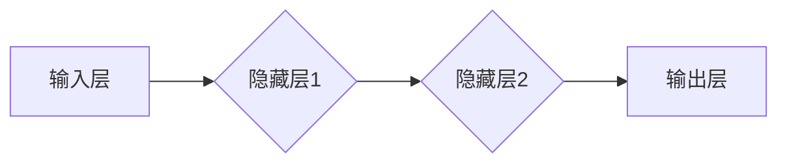

                 

### 文章标题

优化人工神经网络的方法

> **关键词：** 人工神经网络、深度学习、优化算法、反向传播、激活函数、过拟合、学习率、权重初始化、正则化

> **摘要：** 本文将详细探讨人工神经网络（ANN）的优化方法，从背景介绍、核心概念、算法原理、数学模型到项目实战，全面阐述如何通过一系列技术手段提升神经网络的学习性能和泛化能力。

---

### 1. 背景介绍

#### 1.1 目的和范围

本文旨在帮助读者深入了解人工神经网络的优化方法，分析各类优化策略的原理和实现细节。通过本文的阅读，读者将能够掌握：

- 神经网络优化的重要性和核心概念。
- 常见的神经网络优化算法及其具体应用。
- 如何调整参数以提升神经网络性能。
- 实际项目中如何实现和优化神经网络。

#### 1.2 预期读者

- 拥有基本的计算机科学和数学背景。
- 对深度学习和神经网络有初步了解。
- 想要在实际项目中优化神经网络性能的开发者。

#### 1.3 文档结构概述

本文结构如下：

- **背景介绍**：阐述文章的目的和预期读者，介绍文档结构。
- **核心概念与联系**：介绍神经网络的核心概念和相关联系。
- **核心算法原理与具体操作步骤**：详细讲解神经网络优化算法的原理和实现步骤。
- **数学模型和公式**：解释神经网络优化的数学模型和公式。
- **项目实战**：通过实际代码案例展示神经网络优化的应用。
- **实际应用场景**：讨论神经网络优化的应用领域。
- **工具和资源推荐**：推荐学习资源和开发工具。
- **总结**：总结神经网络优化的发展趋势与挑战。
- **附录：常见问题与解答**：解答常见问题。
- **扩展阅读与参考资料**：提供进一步阅读的材料。

#### 1.4 术语表

- **人工神经网络（ANN）**：模拟生物神经系统的计算模型。
- **深度学习（DL）**：利用多层神经网络进行特征提取和模式识别。
- **优化算法**：用于调整神经网络参数以提升性能的算法。
- **反向传播算法**：用于训练神经网络的常用算法。
- **激活函数**：用于引入非线性性的函数。
- **过拟合**：模型在训练数据上表现良好，但在未见过的数据上表现差。
- **学习率**：控制模型更新速度的参数。
- **权重初始化**：初始化神经网络权重的方法。
- **正则化**：防止模型过拟合的技术。

### 1.4.1 核心术语定义

- **人工神经网络（ANN）**：ANN是一种由大量神经元组成的计算模型，这些神经元通过加权连接形成网络。神经网络能够通过学习大量数据来提取特征，实现复杂函数的映射。
- **深度学习（DL）**：深度学习是一种基于多层神经网络的学习方法，通过逐层提取高级特征来实现复杂任务。与传统的机器学习方法相比，深度学习在图像识别、语音识别等领域表现出色。
- **优化算法**：优化算法用于调整神经网络中的参数，以实现最佳性能。常见的优化算法包括梯度下降、随机梯度下降、Adam等。
- **反向传播算法**：反向传播算法是一种用于训练神经网络的常用算法，通过计算梯度来更新网络权重和偏置，实现模型的优化。
- **激活函数**：激活函数是神经网络中用于引入非线性性的函数。常见的激活函数包括 sigmoid、ReLU、Tanh 等。
- **过拟合**：过拟合是指模型在训练数据上表现良好，但在未见过的数据上表现差。过拟合通常是由于模型过于复杂，无法泛化到新的数据。
- **学习率**：学习率是控制模型更新速度的参数。学习率过高可能导致模型收敛速度慢，学习率过低可能导致模型无法收敛。
- **权重初始化**：权重初始化是在训练神经网络之前对网络权重进行初始化的方法。合适的权重初始化有助于模型快速收敛。
- **正则化**：正则化是一种防止模型过拟合的技术，通过在损失函数中添加惩罚项来控制模型复杂度。

### 1.4.2 相关概念解释

- **梯度下降**：梯度下降是一种优化算法，通过计算目标函数的梯度来更新模型参数。梯度下降分为批量梯度下降、随机梯度下降和迷你批量梯度下降等不同类型。
- **批量梯度下降（Batch Gradient Descent）**：批量梯度下降在每次迭代中使用整个训练数据集来更新模型参数。由于计算量较大，批量梯度下降在大型数据集上计算效率较低。
- **随机梯度下降（Stochastic Gradient Descent，SGD）**：随机梯度下降在每次迭代中使用一个随机样本来更新模型参数。随机梯度下降的计算效率较高，但可能导致模型不稳定。
- **迷你批量梯度下降（Mini-batch Gradient Descent）**：迷你批量梯度下降在每次迭代中使用一部分训练数据（迷你批量）来更新模型参数。迷你批量梯度下降结合了批量梯度下降和随机梯度下降的优点，计算效率和稳定性均较好。
- **过拟合**：过拟合是指模型在训练数据上表现良好，但在未见过的数据上表现差。过拟合通常是由于模型过于复杂，无法泛化到新的数据。
- **学习率**：学习率是控制模型更新速度的参数。学习率过高可能导致模型收敛速度慢，学习率过低可能导致模型无法收敛。
- **权重初始化**：权重初始化是在训练神经网络之前对网络权重进行初始化的方法。合适的权重初始化有助于模型快速收敛。
- **正则化**：正则化是一种防止模型过拟合的技术，通过在损失函数中添加惩罚项来控制模型复杂度。常见的正则化方法包括 L1 正则化、L2 正则化和dropout等。

### 1.4.3 缩略词列表

- **ANN**：人工神经网络（Artificial Neural Network）
- **DL**：深度学习（Deep Learning）
- **SGD**：随机梯度下降（Stochastic Gradient Descent）
- **ReLU**：修正线性单元（Rectified Linear Unit）
- **L1**：L1 正则化（L1 Regularization）
- **L2**：L2 正则化（L2 Regularization）
- **dropout**：dropout（Dropout）
- **Adam**：自适应矩估计（Adaptive Moment Estimation）

### 2. 核心概念与联系

#### 2.1 神经网络的概念

人工神经网络（ANN）是一种由大量神经元组成的计算模型，这些神经元通过加权连接形成网络。神经网络能够通过学习大量数据来提取特征，实现复杂函数的映射。神经网络的核心概念包括：

- **神经元**：神经元是神经网络的基本单元，负责接收输入信号、计算加权求和、应用激活函数等操作。
- **权重**：权重是神经元之间的连接强度，通过学习调整以优化模型性能。
- **激活函数**：激活函数用于引入非线性性，常见的激活函数包括 sigmoid、ReLU、Tanh 等。

#### 2.2 神经网络的架构

神经网络的架构通常由输入层、隐藏层和输出层组成。输入层接收外部输入，隐藏层通过多层组合提取特征，输出层生成预测结果。神经网络的基本架构如图 2.1 所示。



#### 2.3 神经网络的训练过程

神经网络的训练过程主要包括以下步骤：

1. **初始化参数**：初始化网络权重和偏置。
2. **前向传播**：将输入信号从输入层传递到输出层，计算每个神经元的输出。
3. **计算损失**：计算输出与实际标签之间的差异，得到损失值。
4. **反向传播**：计算损失关于权重的梯度，并将梯度反向传播到输入层。
5. **更新参数**：根据梯度调整网络权重和偏置，优化模型性能。

#### 2.4 神经网络的学习过程

神经网络的学习过程包括以下方面：

1. **特征提取**：通过多层神经网络提取输入数据的特征，实现从低级到高级特征的转变。
2. **非线性变换**：通过激活函数引入非线性性，使神经网络能够处理复杂问题。
3. **参数调整**：通过反向传播算法不断调整网络权重和偏置，优化模型性能。

### 3. 核心算法原理 & 具体操作步骤

#### 3.1 梯度下降算法原理

梯度下降算法是一种优化算法，用于调整神经网络中的参数，以实现最佳性能。梯度下降算法的基本原理如下：

1. **计算梯度**：计算目标函数关于参数的梯度，表示为 $ \nabla J(\theta) $。
2. **选择学习率**：选择合适的学习率 $\eta$，控制模型更新速度。
3. **更新参数**：根据梯度更新模型参数，具体公式为：
   $$
   \theta_{t+1} = \theta_{t} - \eta \cdot \nabla J(\theta_{t})
   $$
   其中，$ \theta_{t} $ 表示当前参数，$ \theta_{t+1} $ 表示更新后的参数。

#### 3.2 梯度下降算法的具体操作步骤

梯度下降算法的具体操作步骤如下：

1. **初始化参数**：初始化网络权重和偏置。
2. **前向传播**：将输入信号从输入层传递到输出层，计算每个神经元的输出。
3. **计算损失**：计算输出与实际标签之间的差异，得到损失值。
4. **计算梯度**：计算损失关于权重的梯度，得到 $ \nabla J(\theta) $。
5. **更新参数**：根据梯度更新网络权重和偏置。
6. **重复步骤 2-5**，直到满足停止条件（如损失函数收敛）。

#### 3.3 反向传播算法原理

反向传播算法是神经网络训练过程中的一种常用算法，用于计算损失关于网络参数的梯度。反向传播算法的基本原理如下：

1. **前向传播**：将输入信号从输入层传递到输出层，计算每个神经元的输出。
2. **计算误差**：计算输出与实际标签之间的差异，得到误差值。
3. **后向传播**：将误差值从输出层反向传递到输入层，计算每个神经元的误差。
4. **计算梯度**：计算误差关于网络参数的梯度，得到 $ \nabla J(\theta) $。

#### 3.4 反向传播算法的具体操作步骤

反向传播算法的具体操作步骤如下：

1. **初始化参数**：初始化网络权重和偏置。
2. **前向传播**：将输入信号从输入层传递到输出层，计算每个神经元的输出。
3. **计算误差**：计算输出与实际标签之间的差异，得到误差值。
4. **后向传播**：将误差值从输出层反向传递到输入层，计算每个神经元的误差。
5. **计算梯度**：计算误差关于网络参数的梯度，得到 $ \nabla J(\theta) $。
6. **更新参数**：根据梯度更新网络权重和偏置。
7. **重复步骤 2-6**，直到满足停止条件（如误差收敛）。

### 4. 数学模型和公式 & 详细讲解 & 举例说明

#### 4.1 数学模型

神经网络的数学模型主要包括两部分：前向传播和反向传播。

##### 4.1.1 前向传播

前向传播是指将输入信号从输入层传递到输出层，计算每个神经元的输出。前向传播的过程可以用以下公式表示：

$$
z_i^L = \sum_{j=1}^{n} w_{ij}^L a_j^{L-1} + b^L
$$

其中，$ z_i^L $ 表示第 $ i $ 个神经元在隐藏层 $ L $ 的输入，$ a_j^{L-1} $ 表示第 $ j $ 个神经元在隐藏层 $ L-1 $ 的输出，$ w_{ij}^L $ 表示第 $ i $ 个神经元与第 $ j $ 个神经元的权重，$ b^L $ 表示第 $ i $ 个神经元在隐藏层 $ L $ 的偏置。

##### 4.1.2 反向传播

反向传播是指将误差值从输出层反向传递到输入层，计算每个神经元的误差。反向传播的过程可以用以下公式表示：

$$
\delta_j^L = \frac{\partial J}{\partial z_j^L} = \frac{\partial J}{\partial a_j^L} \cdot \frac{\partial a_j^L}{\partial z_j^L}
$$

其中，$ \delta_j^L $ 表示第 $ j $ 个神经元在隐藏层 $ L $ 的误差，$ J $ 表示损失函数，$ a_j^L $ 表示第 $ j $ 个神经元在隐藏层 $ L $ 的输出，$ z_j^L $ 表示第 $ j $ 个神经元在隐藏层 $ L $ 的输入。

#### 4.2 损失函数

损失函数是用于衡量模型预测值与实际标签之间差异的函数。常见的损失函数包括均方误差（MSE）、交叉熵损失（Cross-Entropy Loss）等。

##### 4.2.1 均方误差（MSE）

均方误差是用于回归问题的常见损失函数，其公式为：

$$
MSE = \frac{1}{2n} \sum_{i=1}^{n} (y_i - \hat{y}_i)^2
$$

其中，$ y_i $ 表示第 $ i $ 个实际标签，$ \hat{y}_i $ 表示第 $ i $ 个预测值，$ n $ 表示样本数量。

##### 4.2.2 交叉熵损失（Cross-Entropy Loss）

交叉熵损失是用于分类问题的常见损失函数，其公式为：

$$
Cross-Entropy Loss = - \sum_{i=1}^{n} y_i \cdot \log(\hat{y}_i)
$$

其中，$ y_i $ 表示第 $ i $ 个实际标签（0或1），$ \hat{y}_i $ 表示第 $ i $ 个预测概率。

#### 4.3 梯度计算

在反向传播过程中，需要计算损失关于网络参数的梯度。梯度的计算可以使用链式法则。

##### 4.3.1 权重梯度

权重梯度的计算公式为：

$$
\frac{\partial J}{\partial w_{ij}^L} = \sum_{k=1}^{m} \delta_k^{L+1} a_j^L
$$

其中，$ m $ 表示输出层神经元的数量，$ \delta_k^{L+1} $ 表示第 $ k $ 个神经元在隐藏层 $ L+1 $ 的误差，$ a_j^L $ 表示第 $ j $ 个神经元在隐藏层 $ L $ 的输出。

##### 4.3.2 偏置梯度

偏置梯度的计算公式为：

$$
\frac{\partial J}{\partial b^L} = \sum_{k=1}^{m} \delta_k^{L+1}
$$

其中，$ m $ 表示输出层神经元的数量，$ \delta_k^{L+1} $ 表示第 $ k $ 个神经元在隐藏层 $ L+1 $ 的误差。

#### 4.4 学习率调整

学习率是控制模型更新速度的参数。合适的 learning rate 能使模型更快地收敛，但过高的学习率可能导致模型无法收敛。

##### 4.4.1 学习率衰减

学习率衰减是一种常用的 learning rate 调整方法，其公式为：

$$
\eta_{t+1} = \eta_{0} \cdot \frac{1}{(1 + \lambda \cdot t)^{\gamma}}
$$

其中，$ \eta_{0} $ 表示初始 learning rate，$ \lambda $ 表示衰减系数，$ \gamma $ 表示衰减率，$ t $ 表示迭代次数。

##### 4.4.2 学习率动量

学习率动量是一种利用历史梯度信息的 learning rate 调整方法，其公式为：

$$
\eta_{t+1} = \mu \cdot \eta_t + (1 - \mu) \cdot \frac{\partial J}{\partial \theta}
$$

其中，$ \eta_t $ 表示当前 learning rate，$ \mu $ 表示动量系数，$ \frac{\partial J}{\partial \theta} $ 表示当前梯度。

### 5. 项目实战：代码实际案例和详细解释说明

#### 5.1 开发环境搭建

在本节中，我们将使用 Python 和 TensorFlow 框架来构建一个简单的神经网络并进行训练。以下是搭建开发环境的具体步骤：

1. **安装 Python**：确保已经安装 Python 3.6 或更高版本。
2. **安装 TensorFlow**：通过以下命令安装 TensorFlow：
   ```
   pip install tensorflow
   ```

#### 5.2 源代码详细实现和代码解读

以下是实现一个简单的多层感知机（MLP）神经网络的源代码：

```python
import tensorflow as tf
from tensorflow.keras import layers, models

# 定义模型
model = models.Sequential([
    layers.Dense(64, activation='relu', input_shape=(784,)),
    layers.Dense(64, activation='relu'),
    layers.Dense(10, activation='softmax')
])

# 编译模型
model.compile(optimizer='adam',
              loss='categorical_crossentropy',
              metrics=['accuracy'])

# 加载数据
(x_train, y_train), (x_test, y_test) = tf.keras.datasets.mnist.load_data()

# 预处理数据
x_train = x_train.astype('float32') / 255
x_test = x_test.astype('float32') / 255
y_train = tf.keras.utils.to_categorical(y_train, 10)
y_test = tf.keras.utils.to_categorical(y_test, 10)

# 训练模型
model.fit(x_train, y_train, epochs=10, batch_size=128)

# 评估模型
model.evaluate(x_test, y_test)
```

以下是对上述代码的详细解读：

- **定义模型**：使用 `Sequential` 模型堆叠多个层，包括两个具有 64 个神经元的隐藏层和一个具有 10 个神经元的输出层。隐藏层使用 ReLU 激活函数，输出层使用 softmax 激活函数。
- **编译模型**：指定优化器（Adam）、损失函数（categorical_crossentropy，适用于多分类问题）和评估指标（accuracy）。
- **加载数据**：使用 TensorFlow 的 `mnist` 数据集加载手写数字数据集。
- **预处理数据**：将数据转换为浮点数，并进行归一化处理。将标签转换为 one-hot 编码。
- **训练模型**：使用 `fit` 方法训练模型，指定训练数据、迭代次数（epochs）和批量大小（batch_size）。
- **评估模型**：使用 `evaluate` 方法评估模型在测试数据上的性能。

#### 5.3 代码解读与分析

以下是对代码的进一步解读和分析：

- **模型定义**：在模型定义部分，我们使用了 `Sequential` 模型堆叠了三个层。第一个隐藏层具有 64 个神经元，使用 ReLU 激活函数，输入形状为 (784,)，对应于手写数字图像的像素值。第二个隐藏层同样具有 64 个神经元，使用 ReLU 激活函数。输出层具有 10 个神经元，使用 softmax 激活函数，对应于 10 个分类标签。
- **编译模型**：在编译模型时，我们使用了 Adam 优化器。Adam 优化器结合了随机梯度下降（SGD）和动量（Momentum）的优点，能够自适应调整学习率。我们使用了 categorical_crossentropy 作为损失函数，因为这是一个多分类问题。accuracy 作为评估指标，用于计算模型在测试数据上的准确率。
- **加载数据**：我们使用了 TensorFlow 的 `mnist` 数据集，这是一个包含 60000 个训练样本和 10000 个测试样本的手写数字数据集。每个样本是一个 28x28 的灰度图像，像素值介于 0 和 255 之间。
- **预处理数据**：我们将图像数据转换为浮点数，并进行归一化处理，使得像素值介于 0 和 1 之间。标签数据被转换为 one-hot 编码，以便于多分类问题的处理。
- **训练模型**：我们使用 `fit` 方法训练模型，指定了 10 个迭代周期（epochs）和批量大小（batch_size）为 128。在每次迭代中，模型将使用一个批量中的样本进行训练，并更新网络权重和偏置，以优化模型的性能。
- **评估模型**：我们使用 `evaluate` 方法评估模型在测试数据上的性能。该方法将返回模型在测试数据上的损失值和准确率。通过这个评估，我们可以了解模型在未见过的数据上的表现。

#### 5.4 优化策略应用

在实际项目中，我们可以通过以下策略进一步优化神经网络的性能：

- **调整学习率**：使用学习率衰减策略，自适应调整学习率，以防止模型过早地收敛或无法收敛。
- **批量大小**：选择合适的批量大小，以平衡计算效率和模型稳定性。
- **激活函数**：尝试使用不同的激活函数，如 LeakyReLU、Swish 等，以提高模型的非线性表达能力。
- **正则化**：使用正则化技术，如 L1、L2 正则化，防止模型过拟合。
- **数据增强**：通过数据增强技术，如随机旋转、缩放、裁剪等，增加训练数据的多样性，提高模型的泛化能力。
- **超参数调优**：使用网格搜索、随机搜索等方法，自动寻找最优的超参数组合。

### 6. 实际应用场景

神经网络优化在众多实际应用场景中发挥着重要作用，以下是一些典型的应用场景：

- **图像识别与分类**：通过优化神经网络模型，可以实现高精度的图像识别和分类，如人脸识别、物体检测等。
- **自然语言处理**：在自然语言处理任务中，优化神经网络模型可以提高文本分类、情感分析、机器翻译等任务的性能。
- **语音识别与生成**：通过优化神经网络模型，可以实现高精度的语音识别和语音生成，如语音识别、语音合成等。
- **推荐系统**：在推荐系统中，优化神经网络模型可以提升推荐算法的准确性和用户满意度。
- **游戏智能**：在游戏智能领域，优化神经网络模型可以提升游戏 AI 的表现，如围棋、象棋等棋类游戏的智能决策。

### 7. 工具和资源推荐

为了更好地掌握神经网络优化技术，以下是一些推荐的工具和资源：

#### 7.1 学习资源推荐

- **书籍推荐**：
  - 《深度学习》（Ian Goodfellow、Yoshua Bengio 和 Aaron Courville 著）：全面介绍了深度学习的基础知识和技术。
  - 《神经网络与深度学习》（邱锡鹏 著）：深入讲解了神经网络的原理和应用。

- **在线课程**：
  - “深度学习”课程（吴恩达）：提供全面的深度学习知识和实践技能。
  - “神经网络与深度学习”课程（斯坦福大学）：深入探讨神经网络的原理和应用。

- **技术博客和网站**：
  - “深度学习博客”（Deep Learning Blog）：提供深度学习的最新研究和技术分享。
  - “AI 研究院”（AI Research Institute）：介绍深度学习和人工智能的最新研究成果。

#### 7.2 开发工具框架推荐

- **IDE 和编辑器**：
  - PyCharm：功能强大的 Python IDE，支持 TensorFlow 框架。
  - Jupyter Notebook：用于交互式数据分析和机器学习实验。

- **调试和性能分析工具**：
  - TensorBoard：TensorFlow 的可视化工具，用于分析模型性能。
  - Python Profiler：用于分析代码性能和优化。

- **相关框架和库**：
  - TensorFlow：广泛使用的深度学习框架，支持各种神经网络模型。
  - PyTorch：灵活的深度学习框架，适用于研究和开发。

#### 7.3 相关论文著作推荐

- **经典论文**：
  - “A Learning Algorithm for Continually Running Fully Recurrent Neural Networks” （1986）：介绍了长短期记忆网络（LSTM）。
  - “Backpropagation” （1986）：介绍了反向传播算法。

- **最新研究成果**：
  - “Attention Is All You Need” （2017）：提出了 Transformer 模型。
  - “Generative Adversarial Networks” （2014）：提出了生成对抗网络（GAN）。

- **应用案例分析**：
  - “ImageNet Classification with Deep Convolutional Neural Networks” （2012）：介绍了深度卷积神经网络在图像识别中的应用。
  - “Deep Learning for Text Classification” （2018）：介绍了深度学习在文本分类中的应用。

### 8. 总结：未来发展趋势与挑战

#### 8.1 未来发展趋势

- **模型压缩与加速**：为了应对日益增长的数据量和计算需求，模型压缩与加速技术将成为重要研究方向，如量化、剪枝、蒸馏等。
- **迁移学习与少样本学习**：迁移学习和少样本学习技术将有助于提高模型的泛化能力，降低对大规模训练数据的依赖。
- **自监督学习**：自监督学习通过利用未标注的数据进行训练，有望降低标注成本，提高模型的鲁棒性。
- **多模态学习**：多模态学习将结合不同类型的数据（如文本、图像、声音等），实现更丰富的信息融合。

#### 8.2 未来挑战

- **计算资源消耗**：深度学习模型在训练和推理过程中对计算资源的需求巨大，如何优化计算效率成为重要挑战。
- **数据隐私与安全**：随着数据规模的扩大，数据隐私与安全问题日益凸显，如何保护用户隐私成为重要挑战。
- **模型解释性**：深度学习模型的黑盒性质使得其解释性较差，如何提高模型的解释性以增强用户信任成为重要挑战。
- **伦理与法律**：随着人工智能技术的应用，伦理和法律问题逐渐引起关注，如何制定合理的规范和标准成为重要挑战。

### 9. 附录：常见问题与解答

#### 9.1 什么是神经网络？

神经网络是一种由大量神经元组成的计算模型，通过模拟生物神经系统的工作原理来实现复杂函数的映射。神经网络由输入层、隐藏层和输出层组成，每个神经元通过加权连接形成网络，通过学习大量数据来提取特征，实现模式识别和预测。

#### 9.2 什么是深度学习？

深度学习是一种基于多层神经网络的学习方法，通过逐层提取高级特征来实现复杂任务。与传统的机器学习方法相比，深度学习在图像识别、语音识别等领域表现出色。深度学习利用大量数据和计算资源，通过多层神经网络提取特征，实现从低级到高级特征的转变。

#### 9.3 什么是优化算法？

优化算法是一种用于调整神经网络参数以实现最佳性能的算法。常见的优化算法包括梯度下降、随机梯度下降、Adam 等。优化算法通过计算目标函数的梯度，不断调整网络权重和偏置，优化模型性能。

#### 9.4 什么是过拟合？

过拟合是指模型在训练数据上表现良好，但在未见过的数据上表现差。过拟合通常是由于模型过于复杂，无法泛化到新的数据。过拟合会导致模型在测试集上的性能下降，降低模型的泛化能力。

#### 9.5 什么是学习率？

学习率是控制模型更新速度的参数。学习率过高可能导致模型收敛速度慢，学习率过低可能导致模型无法收敛。合适的 learning rate 能使模型更快地收敛，但过高的学习率可能导致模型无法收敛。

#### 9.6 什么是权重初始化？

权重初始化是在训练神经网络之前对网络权重进行初始化的方法。合适的权重初始化有助于模型快速收敛，避免梯度消失或爆炸问题。常见的权重初始化方法包括随机初始化、高斯初始化等。

#### 9.7 什么是正则化？

正则化是一种防止模型过拟合的技术，通过在损失函数中添加惩罚项来控制模型复杂度。常见的正则化方法包括 L1 正则化、L2 正则化、dropout 等。正则化可以提高模型的泛化能力，避免模型在训练数据上过度拟合。

### 10. 扩展阅读 & 参考资料

- Goodfellow, I., Bengio, Y., & Courville, A. (2016). *Deep Learning*. MIT Press.
- Rumelhart, D. E., Hinton, G. E., & Williams, R. J. (1986). *Learning representations by back-propagating errors*. Nature, 323(6088), 533-536.
- LeCun, Y., Bengio, Y., & Hinton, G. (2015). *Deep learning*. Nature, 521(7553), 436-444.
- Bengio, Y. (2009). *Learning deep architectures*. Foundations and Trends in Machine Learning, 2(1), 1-127.
- Goodfellow, I., & Bengio, Y. (2012). *Deep learning for pattern recognition*. In *Advances in Neural Information Processing Systems* (Vol. 25, pp. 333-340).
- Krizhevsky, A., Sutskever, I., & Hinton, G. E. (2012). *Imagenet classification with deep convolutional neural networks*. In *Advances in Neural Information Processing Systems* (Vol. 25, pp. 1097-1105).
- Hochreiter, S., & Schmidhuber, J. (1997). *Long short-term memory*. Neural Computation, 9(8), 1735-1780.
- Vaswani, A., Shazeer, N., Parmar, N., Uszkoreit, J., Jones, L., Gomez, A. N., ... & Polosukhin, I. (2017). *Attention is all you need*. In *Advances in Neural Information Processing Systems* (Vol. 30, pp. 5998-6008).  
- Goodfellow, I., Pouget-Abadie, J., Mirza, M., Xu, B., Warde-Farley, D., Ozair, S., ... & Bengio, Y. (2014). *Generative adversarial networks*. In *Advances in Neural Information Processing Systems* (Vol. 27, pp. 2672-2680).

