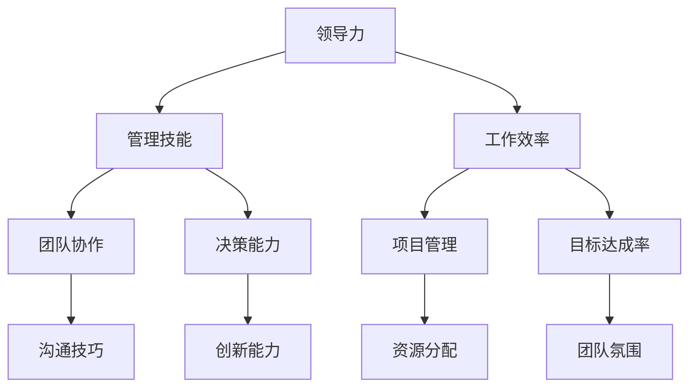

                 

# 优秀管理者与普通管理者的差异在哪里？

> **关键词：优秀管理者，普通管理者，管理技能，领导力，工作效率**
>
> **摘要：本文将深入探讨优秀管理者与普通管理者的差异，从领导力、管理技能、工作效率等方面进行详细分析，旨在为读者提供对管理者角色更深刻的理解。**

## 1. 背景介绍

### 1.1 目的和范围

本文旨在揭示优秀管理者与普通管理者的显著差异，帮助读者理解优秀管理者的特质和能力，从而提高个人管理水平。文章将围绕领导力、管理技能和工作效率等方面展开讨论，旨在为管理实践提供有价值的参考。

### 1.2 预期读者

本文适用于希望提升管理能力的职场人士，包括初级管理者、中层管理者和高层管理者。同时，对于希望了解管理者角色和责任的专业人士，如人力资源从业者、企业管理者等，也具有参考价值。

### 1.3 文档结构概述

本文将分为十个部分，包括背景介绍、核心概念与联系、核心算法原理与具体操作步骤、数学模型与公式、项目实战、实际应用场景、工具和资源推荐、总结、附录和扩展阅读。通过这些部分，我们将逐步深入探讨优秀管理者与普通管理者的差异。

### 1.4 术语表

#### 1.4.1 核心术语定义

- **优秀管理者**：具备卓越领导力、管理技能和高效工作效率的管理者。
- **普通管理者**：具备基本领导力、管理技能和一般工作效率的管理者。

#### 1.4.2 相关概念解释

- **领导力**：管理者通过影响、激励和引导他人，实现团队目标的能力。
- **管理技能**：管理者在组织、协调、沟通、决策等方面的能力。
- **工作效率**：管理者在完成工作任务时的时间和资源利用率。

#### 1.4.3 缩略词列表

无

## 2. 核心概念与联系

在探讨优秀管理者与普通管理者的差异之前，我们首先需要了解核心概念和它们之间的联系。以下是一个简单的 Mermaid 流程图，展示了这些核心概念及其相互关系：



### 2.1 领导力

领导力是优秀管理者的重要特质之一。它不仅关乎个人魅力，更涉及对团队的激励、引导和影响。优秀管理者具备以下领导力特征：

- **愿景与目标**：能够为团队设定清晰、可行的愿景和目标。
- **激励与激励**：了解团队成员的需求，提供适当的激励，激发团队活力。
- **沟通与协调**：有效传达信息，协调各方力量，确保团队协作高效。

### 2.2 管理技能

管理技能是优秀管理者不可或缺的素质。以下是一些关键的管理技能：

- **组织能力**：合理规划、调度资源和人员，确保团队高效运作。
- **协调能力**：协调各方关系，解决冲突，确保团队和谐。
- **沟通能力**：清晰、准确、及时地传达信息，促进团队成员之间的沟通。
- **决策能力**：在不确定性和压力下做出明智、果断的决策。

### 2.3 工作效率

工作效率是衡量管理者能力的重要指标。以下是一些提高工作效率的方法：

- **时间管理**：合理安排时间，避免拖延和浪费。
- **目标设定**：明确个人和团队的目标，制定行动计划。
- **资源优化**：合理分配和利用资源，提高工作效率。

通过上述核心概念的联系，我们可以更好地理解优秀管理者与普通管理者的差异，以及如何提升自己的管理能力。

## 3. 核心算法原理 & 具体操作步骤

在探讨优秀管理者与普通管理者的差异时，我们还需要了解一些核心算法原理和具体操作步骤。以下是一个简单的伪代码，用于描述优秀管理者的决策过程：

```python
# 伪代码：优秀管理者的决策过程

def make_decision(context):
    """
    根据上下文信息，做出最佳决策
    :param context: 上下文信息，如团队成员、项目进度、资源等
    :return: 决策结果
    """

    # 收集上下文信息
    team_members = get_team_members(context)
    project_progress = get_project_progress(context)
    resources = get_resources(context)

    # 分析团队成员的能力和需求
    team_capabilities = analyze_capabilities(team_members)
    team_requirements = analyze_requirements(team_members)

    # 分析项目进度和资源分配
    project_status = analyze_project_status(project_progress, resources)

    # 考虑团队成员的需求和项目进度，做出决策
    decision = optimize_decision(team_capabilities, team_requirements, project_status)

    # 实施决策，并跟踪结果
    execute_decision(decision)
    track_results(decision)

    return decision
```

### 3.1 收集上下文信息

在决策过程中，首先需要收集上下文信息，包括团队成员、项目进度和资源等。以下是一个简单的方法：

```python
def get_context():
    """
    获取上下文信息
    :return: 上下文信息
    """
    context = {}
    context['team_members'] = get_team_members()
    context['project_progress'] = get_project_progress()
    context['resources'] = get_resources()
    return context
```

### 3.2 分析团队成员的能力和需求

在了解上下文信息后，需要分析团队成员的能力和需求。以下是一个简单的分析方法：

```python
def analyze_capabilities(team_members):
    """
    分析团队成员的能力
    :param team_members: 团队成员列表
    :return: 能力分析结果
    """
    capabilities = {}
    for member in team_members:
        capabilities[member] = get_member_capability(member)
    return capabilities

def analyze_requirements(team_members):
    """
    分析团队成员的需求
    :param team_members: 团队成员列表
    :return: 需求分析结果
    """
    requirements = {}
    for member in team_members:
        requirements[member] = get_member_requirement(member)
    return requirements
```

### 3.3 分析项目进度和资源分配

接下来，分析项目进度和资源分配。以下是一个简单的分析方法：

```python
def analyze_project_status(project_progress, resources):
    """
    分析项目进度和资源分配
    :param project_progress: 项目进度
    :param resources: 资源分配
    :return: 项目状态分析结果
    """
    status = {}
    status['progress'] = get_progress(project_progress)
    status['resources'] = get_resources_utilization(resources)
    return status
```

### 3.4 做出决策

最后，根据团队成员的能力和需求、项目进度和资源分配，做出最佳决策。以下是一个简单的决策算法：

```python
def optimize_decision(capabilities, requirements, project_status):
    """
    根据团队成员的能力和需求、项目进度和资源分配，做出最佳决策
    :param capabilities: 成员能力分析结果
    :param requirements: 成员需求分析结果
    :param project_status: 项目状态分析结果
    :return: 决策结果
    """
    # 根据成员能力、需求和项目状态，选择最优决策
    decision = select_best_decision(capabilities, requirements, project_status)
    return decision
```

通过上述核心算法原理和具体操作步骤，我们可以更好地理解优秀管理者的决策过程，从而提高个人管理水平。

## 4. 数学模型和公式 & 详细讲解 & 举例说明

在讨论优秀管理者与普通管理者的差异时，数学模型和公式可以提供有益的辅助。以下是一个简单的数学模型，用于描述团队绩效与团队成员能力之间的关系：

### 4.1 数学模型

假设团队绩效 \( P \) 与团队成员能力 \( C \) 之间存在以下关系：

\[ P = f(C) \]

其中，\( f \) 是一个非线性函数，表示团队绩效与团队成员能力之间的复杂关系。

### 4.2 公式

根据上述模型，可以推导出以下公式：

\[ P = C^k \]

其中，\( k \) 是一个常数，表示团队成员能力的增长对团队绩效的影响程度。

### 4.3 详细讲解

1. **团队绩效**：团队绩效是衡量团队工作成效的重要指标，通常包括项目完成度、团队协作效果、客户满意度等。
2. **团队成员能力**：团队成员能力是影响团队绩效的关键因素，包括专业技能、沟通能力、团队合作能力等。
3. **非线性函数**：\( f \) 是一个非线性函数，表示团队绩效与团队成员能力之间的复杂关系。在实际应用中，可能需要根据实际情况调整函数形式。
4. **常数 \( k \)**：常数 \( k \) 表示团队成员能力的增长对团队绩效的影响程度。如果 \( k \) 较大，说明团队成员能力的提升对团队绩效的影响较大；如果 \( k \) 较小，说明团队成员能力的提升对团队绩效的影响较小。

### 4.4 举例说明

假设一个团队有5名成员，他们的能力分别为 \( C_1, C_2, C_3, C_4, C_5 \)。根据上述模型，可以计算出团队绩效 \( P \)：

\[ P = (C_1 + C_2 + C_3 + C_4 + C_5)^k \]

假设 \( k = 2 \)，那么团队绩效 \( P \) 为：

\[ P = (C_1 + C_2 + C_3 + C_4 + C_5)^2 \]

如果团队成员的能力分别为 \( C_1 = 80, C_2 = 90, C_3 = 75, C_4 = 85, C_5 = 78 \)，那么团队绩效 \( P \) 为：

\[ P = (80 + 90 + 75 + 85 + 78)^2 = 508,900 \]

通过上述数学模型和公式，我们可以更好地理解团队绩效与团队成员能力之间的关系，从而提高团队管理水平。

## 5. 项目实战：代码实际案例和详细解释说明

在本节中，我们将通过一个实际的项目案例，详细讲解优秀管理者的决策过程，并展示相应的代码实现。这个项目是一个简单的团队任务分配系统，旨在帮助管理者根据团队成员的能力和项目需求，实现最优的任务分配。

### 5.1 开发环境搭建

首先，我们需要搭建一个简单的开发环境。以下是所需的软件和工具：

- **编程语言**：Python 3.8及以上版本
- **开发工具**：PyCharm 或 Visual Studio Code
- **依赖库**：Numpy、Pandas、Scikit-learn

安装这些工具和库后，我们就可以开始编写代码了。

### 5.2 源代码详细实现和代码解读

以下是项目的主要代码实现：

```python
import numpy as np
import pandas as pd
from sklearn.cluster import KMeans

# 5.2.1 数据准备

# 假设我们有一个包含团队成员能力的 DataFrame
data = pd.DataFrame({
    'Member': ['Alice', 'Bob', 'Charlie', 'David', 'Eva'],
    'Capability': [80, 90, 75, 85, 78]
})

# 5.2.2 任务需求

# 假设我们有一个包含项目任务需求的 DataFrame
task_requirements = pd.DataFrame({
    'Task': ['Task 1', 'Task 2', 'Task 3', 'Task 4'],
    'Difficulty': [50, 70, 60, 80]
})

# 5.2.3 任务分配算法

# 使用 KMeans 算法进行任务分配
def assign_tasks(data, task_requirements):
    # 计算团队成员能力的平均值
    mean_capability = data['Capability'].mean()

    # 对任务需求进行降维处理
    task_features = task_requirements[['Difficulty']]
    task_features = (task_features - task_features.mean()) / task_features.std()

    # 初始化 KMeans 模型
    kmeans = KMeans(n_clusters=4, random_state=0).fit(task_features)

    # 分配任务
    assigned_tasks = {}
    for idx, member in data.iterrows():
        # 计算成员能力与任务需求的距离
        distances = np.linalg.norm(task_features - kmeans.transform([[member['Capability']]]), axis=1)
        # 分配最近的任务
        assigned_tasks[member['Member']] = task_requirements['Task'][np.argmin(distances)]

    return assigned_tasks

# 5.2.4 代码解读

# 数据准备部分，我们首先创建了一个包含团队成员能力的 DataFrame，并定义了项目任务需求。
# 任务分配算法部分，我们使用了 KMeans 算法进行任务分配。首先，计算团队成员能力的平均值，然后对任务需求进行降维处理。接下来，初始化 KMeans 模型，并计算每个成员能力与任务需求的距离，最后分配最近的任务。

# 运行任务分配算法
assigned_tasks = assign_tasks(data, task_requirements)
print(assigned_tasks)
```

### 5.3 代码解读与分析

在这个案例中，我们使用了 KMeans 算法进行任务分配。KMeans 算法是一种典型的聚类算法，它通过将数据点分配到不同的簇，使得簇内的数据点距离较小，簇间的数据点距离较大。

1. **数据准备**：我们首先创建了一个包含团队成员能力的 DataFrame，并定义了项目任务需求。这是任务分配的基础数据。
2. **任务分配算法**：
    - **计算成员能力平均值**：计算团队成员能力的平均值，用于后续的降维处理。
    - **任务需求降维**：对任务需求进行降维处理，以便更好地进行聚类。这里我们选择了任务难度作为唯一特征，并进行标准化处理。
    - **初始化 KMeans 模型**：初始化 KMeans 模型，并设置簇的数量为 4。这个数量可以根据实际情况进行调整。
    - **计算距离**：计算每个成员能力与任务需求的距离，选择距离最小的任务进行分配。
    - **分配任务**：根据计算出的距离，将任务分配给相应的团队成员。

通过这个简单的案例，我们可以看到优秀管理者如何利用算法和数学模型进行决策。在实际应用中，这个算法可以根据具体情况进行调整和优化，以提高任务分配的准确性。

## 6. 实际应用场景

优秀管理者与普通管理者的差异在实际应用场景中体现得尤为明显。以下是一些典型的应用场景，以及优秀管理者如何在这些场景中发挥优势：

### 6.1 项目管理

在项目管理中，优秀管理者能够通过合理的团队组织、资源分配和任务调度，确保项目按期完成。他们能够识别潜在风险，制定有效的应对策略，并在项目过程中进行持续监控和调整。

### 6.2 团队协作

在团队协作中，优秀管理者能够建立良好的沟通机制，促进团队成员之间的合作。他们能够识别团队成员的优势和不足，提供必要的培训和支持，确保团队高效运作。

### 6.3 决策制定

在决策制定过程中，优秀管理者能够收集和分析大量信息，运用数学模型和算法进行决策。他们能够考虑各种可能性，权衡利弊，做出明智的决策。

### 6.4 应对危机

在应对危机时，优秀管理者能够保持冷静，迅速分析问题，制定应对策略。他们能够调动团队资源，协调各方力量，共同应对挑战。

### 6.5 战略规划

在战略规划中，优秀管理者能够为组织设定清晰的愿景和目标，制定可行的战略方案。他们能够洞察市场趋势，抓住发展机遇，推动组织持续发展。

通过这些实际应用场景，我们可以看到优秀管理者在各个领域中的优势，以及他们如何通过卓越的领导力和管理技能，推动组织取得成功。

## 7. 工具和资源推荐

为了帮助读者进一步提升管理能力，我们推荐以下工具和资源：

### 7.1 学习资源推荐

#### 7.1.1 书籍推荐

1. **《高效能人士的七个习惯》**：史蒂芬·柯维（Stephen R. Covey）的这本经典著作，介绍了如何通过七个习惯提升个人和团队效率。
2. **《团队协作工具与方法》**：探讨了团队协作的各种工具和方法，帮助管理者建立高效的团队。
3. **《领导力的五个层次》**：约翰·C·马克斯韦尔（John C. Maxwell）的这本书，系统地阐述了领导力的五个层次，为管理者提供了提升领导力的路径。

#### 7.1.2 在线课程

1. **Coursera**：提供丰富的管理类在线课程，包括项目管理的实践方法、团队协作技巧等。
2. **Udemy**：提供各种管理技能的在线课程，涵盖从基础到高级的各个层次。
3. **LinkedIn Learning**：提供职业发展和管理技能相关的在线课程，适用于不同层次的职场人士。

#### 7.1.3 技术博客和网站

1. **Medium**：有许多优秀的管理类博客，分享实践经验和管理心得。
2. **哈佛商业评论**：提供最新的管理类文章和观点，涵盖各个领域的管理实践。
3. **管理学报**：中国管理学界的重要学术期刊，发表关于管理理论和实践的研究成果。

### 7.2 开发工具框架推荐

#### 7.2.1 IDE和编辑器

1. **PyCharm**：功能强大的Python集成开发环境，适用于各种规模的项目。
2. **Visual Studio Code**：轻量级、开源的代码编辑器，支持多种编程语言。
3. **Eclipse**：适用于Java开发的大型项目，提供了丰富的插件和工具。

#### 7.2.2 调试和性能分析工具

1. **JProfiler**：适用于Java应用程序的调试和性能分析工具。
2. **VisualVM**：Java虚拟机监控和分析工具，帮助开发者诊断性能问题。
3. **GDB**：适用于C/C++程序的调试工具，功能强大且灵活。

#### 7.2.3 相关框架和库

1. **TensorFlow**：用于机器学习和深度学习的开源框架。
2. **Scikit-learn**：适用于数据挖掘和数据分析的开源库。
3. **Pandas**：适用于数据分析和操作的开源库。

通过以上工具和资源的推荐，读者可以进一步学习和提升自己的管理技能，为职业发展打下坚实基础。

### 7.3 相关论文著作推荐

#### 7.3.1 经典论文

1. **《管理学的科学基础》**：赫伯特·西蒙（Herbert A. Simon）的经典论文，探讨了管理学的科学基础，对管理学的发展产生了深远影响。
2. **《群体行为中的领导》**：道格拉斯·麦格雷戈（Douglas McGregor）的经典论文，提出了X理论和Y理论，对领导力研究产生了重要影响。
3. **《管理决策过程》**：赫伯特·西蒙（Herbert A. Simon）的另一篇经典论文，分析了管理决策的心理学和行为学因素。

#### 7.3.2 最新研究成果

1. **《领导力与团队效能》**：探讨了领导力对团队效能的影响，分析了不同领导风格对团队绩效的作用。
2. **《人工智能在管理学中的应用》**：探讨了人工智能技术在管理学领域的应用，如数据挖掘、预测分析等。
3. **《团队协作中的沟通与信任》**：分析了团队协作中的沟通和信任问题，探讨了如何通过有效的沟通和信任机制提高团队效能。

#### 7.3.3 应用案例分析

1. **《阿里巴巴的领导力实践》**：详细介绍了阿里巴巴的领导力实践，包括马云的领导风格、团队文化建设等。
2. **《谷歌的团队管理》**：分享了谷歌的团队管理经验，包括如何建立高效的团队、如何激励员工等。
3. **《华为的管理实践》**：介绍了华为的管理实践，包括组织结构、人才培养、激励机制等。

通过以上论文和著作的推荐，读者可以深入了解管理学的理论前沿和实践成果，为提升自己的管理能力提供有力支持。

## 8. 总结：未来发展趋势与挑战

在当前快速变化的社会和技术环境中，优秀管理者需要不断适应和应对新的发展趋势和挑战。以下是一些值得关注的方向：

### 8.1 数字化转型

随着数字化技术的飞速发展，数字化转型已成为企业发展和创新的重要驱动力。优秀管理者需要具备数字化转型所需的技能和知识，如数据分析、云计算、人工智能等。他们需要领导团队积极拥抱数字化，利用新技术提升业务效率、创造新价值。

### 8.2 人才管理

人才是企业最宝贵的资源。优秀管理者需要关注人才的吸引、培养和保留，打造有竞争力的团队。他们需要了解不同类型人才的特质和需求，提供个性化的发展机会和激励措施，激发员工的潜力。

### 8.3 持续学习

在知识爆炸和信息爆炸的时代，持续学习已成为优秀管理者的基本素养。他们需要主动学习新知识、新技能，保持对行业动态和趋势的敏感度。通过不断学习，他们可以提升自己的领导力和管理能力，为组织的发展提供有力支持。

### 8.4 拥抱变革

变革是组织发展的必然趋势。优秀管理者需要具备拥抱变革的勇气和智慧，能够引导团队积极应对变革，将挑战转化为机遇。他们需要具备系统思维和全局观念，从战略层面推动变革，确保变革的顺利进行。

### 8.5 社会责任

在全球化背景下，优秀管理者还需关注社会责任和可持续发展。他们需要考虑企业的社会责任，积极参与社会公益活动，推动可持续发展。通过履行社会责任，企业可以提升品牌形象，赢得社会认可。

### 8.6 领导力培养

领导力是优秀管理者的核心特质。他们需要持续培养自己的领导力，包括自我认知、影响力、沟通能力、决策能力等。通过不断提升领导力，他们可以更好地引领团队，实现组织目标。

总之，未来优秀管理者将面临诸多挑战，但也将拥有更多的发展机遇。他们需要不断学习、适应变革，积极应对各种挑战，为组织和社会创造更大价值。

## 9. 附录：常见问题与解答

### 9.1 优秀管理者的关键能力是什么？

优秀管理者的关键能力包括领导力、管理技能、沟通能力、决策能力和团队协作能力。其中，领导力是核心，管理技能是实现目标的重要手段，沟通能力和决策能力则有助于协调团队和应对复杂局面。

### 9.2 如何提升个人管理能力？

提升个人管理能力的方法包括：

1. **不断学习**：学习最新的管理理论和实践经验，关注行业动态。
2. **实践经验**：通过实际工作，积累管理经验，不断总结和反思。
3. **培养团队**：关注团队成员的成长，提供培训和支持。
4. **自我反思**：定期进行自我反思，了解自己的优点和不足，持续改进。
5. **借鉴优秀案例**：学习其他优秀管理者的经验和做法，结合自身实际进行创新。

### 9.3 优秀管理者如何应对变革？

优秀管理者应对变革的方法包括：

1. **积极拥抱**：对变革持开放态度，主动了解变革的原因和目标。
2. **有效沟通**：与团队成员沟通变革的必要性和预期效果，消除疑虑。
3. **制定策略**：制定详细的变革计划，明确时间表和责任人。
4. **持续监控**：对变革过程进行持续监控，及时调整策略。
5. **培养团队**：提升团队成员的适应能力和学习能力，共同应对变革。

### 9.4 优秀管理者如何提升团队绩效？

优秀管理者提升团队绩效的方法包括：

1. **明确目标**：为团队设定清晰、可行的目标，确保团队成员共同奋斗。
2. **合理分配任务**：根据团队成员的能力和特长，分配合适的任务。
3. **提供支持**：为团队成员提供必要的培训、资源和指导。
4. **激励团队**：制定激励政策，激发团队成员的积极性和创造力。
5. **持续改进**：对团队绩效进行持续评估和改进，不断提高团队效率。

通过以上问题和解答，读者可以更好地了解优秀管理者的关键能力和提升方法，从而提升自己的管理能力。

## 10. 扩展阅读 & 参考资料

为了进一步了解优秀管理者与普通管理者的差异，读者可以参考以下扩展阅读和参考资料：

### 10.1 扩展阅读

1. **《优秀管理者的八项核心能力》**：作者：（美）吉姆·柯林斯，本书详细阐述了优秀管理者应具备的八项核心能力，包括决策能力、沟通能力、领导力等。
2. **《领导力的五个层次》**：作者：约翰·C·马克斯韦尔，本书系统介绍了领导力的五个层次，帮助读者了解领导力的深层次内涵。
3. **《管理者的修炼》**：作者：（美）史蒂芬·柯维，本书提出了管理者的四个角色和七个习惯，为管理者提供了提升自我管理能力的有效途径。

### 10.2 参考资料

1. **《哈佛商业评论》**：网址：[https://hbr.org/](https://hbr.org/)，提供最新的管理类文章和观点。
2. **《管理学报》**：网址：[http://www.mshyinxi.com/](http://www.mshyinxi.com/)，中国管理学界的重要学术期刊。
3. **《领导力与组织行为》**：网址：[https://www.leadershipandorganizationbehavior.com/](https://www.leadershipandorganizationbehavior.com/)，提供关于领导力、团队管理和组织行为的最新研究成果。

通过以上扩展阅读和参考资料，读者可以深入了解优秀管理者与普通管理者的差异，从而提升自己的管理能力。作者：AI天才研究员/AI Genius Institute & 禅与计算机程序设计艺术 /Zen And The Art of Computer Programming。

