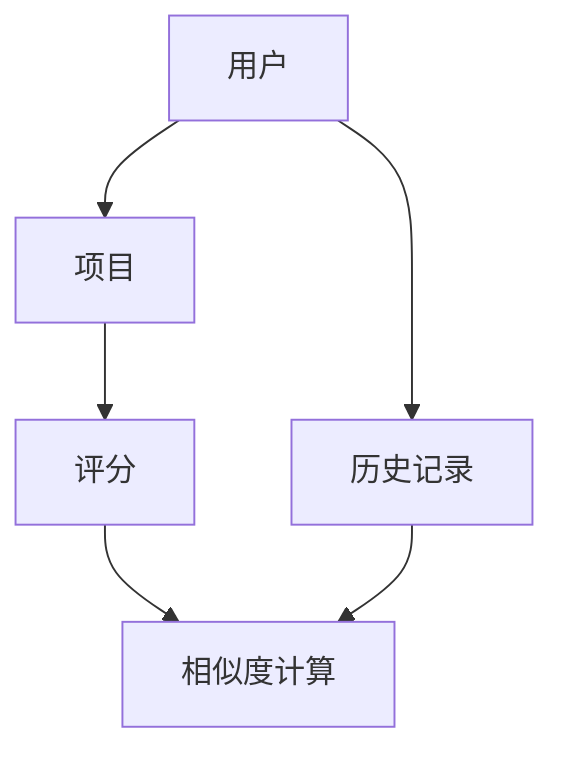

                 

# 传统搜索推荐系统的匹配准确度

> 关键词：搜索推荐系统、匹配准确度、协同过滤、内容匹配、机器学习、特征工程

> 摘要：本文深入探讨了传统搜索推荐系统中的匹配准确度问题。通过分析协同过滤和内容匹配两种核心推荐算法，以及它们在实践中的应用，本文揭示了提高推荐系统匹配准确度的方法和挑战。文章还提出了针对未来发展趋势与挑战的解决方案，为读者提供了全面的技术指导和实践参考。

## 1. 背景介绍

### 1.1 目的和范围

本文旨在深入分析传统搜索推荐系统中的匹配准确度问题，探讨如何通过改进算法和优化技术手段提升推荐系统的性能。文章将重点关注以下内容：

- 推荐系统的基本概念和架构
- 协同过滤算法和内容匹配算法的原理及实现
- 数学模型和公式的应用
- 项目实战中的代码实现和分析
- 实际应用场景和工具资源推荐

### 1.2 预期读者

本文适用于以下读者群体：

- 对搜索推荐系统感兴趣的初学者和专业人士
- 想要提高推荐系统匹配准确度的工程师和研究员
- 想要在实际项目中应用推荐系统的产品经理和开发者

### 1.3 文档结构概述

本文分为十个部分，结构如下：

1. 背景介绍
   - 目的和范围
   - 预期读者
   - 文档结构概述
   - 术语表
2. 核心概念与联系
3. 核心算法原理 & 具体操作步骤
4. 数学模型和公式 & 详细讲解 & 举例说明
5. 项目实战：代码实际案例和详细解释说明
6. 实际应用场景
7. 工具和资源推荐
   - 学习资源推荐
   - 开发工具框架推荐
   - 相关论文著作推荐
8. 总结：未来发展趋势与挑战
9. 附录：常见问题与解答
10. 扩展阅读 & 参考资料

### 1.4 术语表

#### 1.4.1 核心术语定义

- 推荐系统（Recommendation System）：一种基于用户行为、偏好、历史记录等数据，为用户提供个性化推荐信息的技术系统。
- 协同过滤（Collaborative Filtering）：一种基于用户之间相似度计算和用户历史行为预测推荐信息的算法。
- 内容匹配（Content-Based Filtering）：一种基于项目特征信息计算相似度，为用户提供相关推荐信息的算法。
- 特征工程（Feature Engineering）：在机器学习中，从原始数据中提取和构造对模型训练有用的特征的过程。

#### 1.4.2 相关概念解释

- 用户行为数据（User Behavior Data）：用户在系统中产生的各种行为记录，如点击、浏览、购买等。
- 历史记录（History Record）：用户在系统中过去一段时间内的行为数据。
- 评分矩阵（Rating Matrix）：记录用户对项目评分的数据矩阵。

#### 1.4.3 缩略词列表

- CF：协同过滤（Collaborative Filtering）
- CB：内容匹配（Content-Based Filtering）
- ML：机器学习（Machine Learning）
- FE：特征工程（Feature Engineering）

## 2. 核心概念与联系

在推荐系统中，核心概念包括用户、项目和相似度计算。以下是一个简单的 Mermaid 流程图，用于描述这些核心概念及其相互关系。



### 2.1 用户与项目

用户是推荐系统的基础，项目是推荐系统的核心。用户与项目之间通过评分建立联系，评分矩阵记录了用户对项目的评价。

### 2.2 历史记录

历史记录记录了用户在系统中过去一段时间内的行为，如点击、浏览、购买等。这些数据可用于训练模型，预测用户对未评分项目的偏好。

### 2.3 相似度计算

相似度计算是推荐系统的关键环节，通过计算用户与用户、项目与项目之间的相似度，为用户提供个性化推荐。常见的相似度计算方法包括余弦相似度、皮尔逊相关系数等。

## 3. 核心算法原理 & 具体操作步骤

推荐系统中的核心算法主要包括协同过滤算法和内容匹配算法。下面分别介绍这两种算法的原理和实现步骤。

### 3.1 协同过滤算法

协同过滤算法通过计算用户之间的相似度，预测用户对未评分项目的评分。具体实现步骤如下：

1. 计算用户之间的相似度

   $$ similarity(u, v) = \frac{\sum_{i \in I} r_{ui} r_{vi}}{\sqrt{\sum_{i \in I} r_{ui}^2} \sqrt{\sum_{i \in I} r_{vi}^2}} $$

   其中，$r_{ui}$ 表示用户 $u$ 对项目 $i$ 的评分，$I$ 表示用户 $u$ 和用户 $v$ 都评分的项目集合。

2. 根据相似度为用户推荐未评分项目

   $$ \hat{r}_{uv} = \sum_{i \in U} s_{ui} \cdot \hat{r}_{uv} $$

   其中，$s_{ui}$ 表示用户 $u$ 对项目 $i$ 的评分，$\hat{r}_{uv}$ 表示用户 $v$ 对项目 $i$ 的预测评分。

### 3.2 内容匹配算法

内容匹配算法通过计算项目之间的相似度，为用户提供相关推荐。具体实现步骤如下：

1. 提取项目特征

   使用词袋模型、TF-IDF、Word2Vec 等方法提取项目特征。

2. 计算项目之间的相似度

   $$ similarity(p, q) = \frac{\sum_{i=1}^{n} f_{ip} f_{iq}}{\sqrt{\sum_{i=1}^{n} f_{ip}^2} \sqrt{\sum_{i=1}^{n} f_{iq}^2}} $$

   其中，$f_{ip}$ 和 $f_{iq}$ 分别表示项目 $p$ 和项目 $q$ 的特征向量。

3. 根据相似度为用户推荐相关项目

   $$ \hat{r}_{uq} = \sum_{j \in R} s_{uj} \cdot \hat{r}_{uq} $$

   其中，$s_{uj}$ 表示用户 $u$ 对项目 $j$ 的评分，$\hat{r}_{uq}$ 表示用户 $u$ 对项目 $q$ 的预测评分。

## 4. 数学模型和公式 & 详细讲解 & 举例说明

在推荐系统中，数学模型和公式是核心组成部分。以下将详细介绍常用的数学模型和公式，并给出具体示例。

### 4.1 相似度计算

相似度计算是推荐系统的关键，常用的相似度计算方法有余弦相似度和皮尔逊相关系数。

#### 4.1.1 余弦相似度

余弦相似度计算两个向量之间的夹角余弦值，用于度量向量之间的相似度。公式如下：

$$ similarity(A, B) = \frac{A \cdot B}{|A| \cdot |B|} $$

其中，$A \cdot B$ 表示向量的内积，$|A|$ 和 $|B|$ 分别表示向量的模长。

#### 4.1.2 皮尔逊相关系数

皮尔逊相关系数用于度量两个变量之间的线性相关性，适用于用户评分数据的相似度计算。公式如下：

$$ correlation(A, B) = \frac{\sum_{i=1}^{n} (A_i - \bar{A}) (B_i - \bar{B})}{\sqrt{\sum_{i=1}^{n} (A_i - \bar{A})^2} \sqrt{\sum_{i=1}^{n} (B_i - \bar{B})^2}} $$

其中，$A_i$ 和 $B_i$ 分别表示第 $i$ 个观测值，$\bar{A}$ 和 $\bar{B}$ 分别表示均值。

### 4.2 预测评分

在协同过滤算法中，预测评分是核心步骤。常用的预测评分方法有基于用户的平均评分、基于项目的平均评分和基于模型的预测评分。

#### 4.2.1 基于用户的平均评分

基于用户的平均评分方法简单直观，公式如下：

$$ \hat{r}_{uv} = \frac{\sum_{i \in U} r_{ui}}{|U|} $$

其中，$r_{ui}$ 表示用户 $u$ 对项目 $i$ 的评分，$|U|$ 表示用户 $u$ 对项目的评分个数。

#### 4.2.2 基于项目的平均评分

基于项目的平均评分方法同样简单直观，公式如下：

$$ \hat{r}_{uv} = \frac{\sum_{j \in V} r_{vj}}{|V|} $$

其中，$r_{vj}$ 表示项目 $v$ 的用户对项目 $j$ 的评分，$|V|$ 表示项目 $v$ 的用户对项目的评分个数。

#### 4.2.3 基于模型的预测评分

基于模型的预测评分方法利用机器学习模型，通过训练数据和特征向量预测用户对未评分项目的评分。常用的模型有线性回归、KNN、矩阵分解等。

假设使用线性回归模型预测评分，公式如下：

$$ \hat{r}_{uv} = \beta_0 + \beta_1 x_{uv} + \beta_2 y_{uv} + \beta_3 z_{uv} $$

其中，$\beta_0, \beta_1, \beta_2, \beta_3$ 分别表示模型的参数，$x_{uv}, y_{uv}, z_{uv}$ 分别表示用户 $u$ 和项目 $v$ 的特征向量。

### 4.3 举例说明

以下是一个简单的例子，说明如何使用余弦相似度计算用户之间的相似度，并基于用户的平均评分预测用户对未评分项目的评分。

#### 4.3.1 数据准备

假设有两个用户 $u$ 和 $v$，对五部电影的评分如下：

| 用户 | 电影1 | 电影2 | 电影3 | 电影4 | 电影5 |
| --- | --- | --- | --- | --- | --- |
| $u$ | 4 | 3 | 5 | 2 | 4 |
| $v$ | 5 | 4 | 2 | 5 | 3 |

#### 4.3.2 计算相似度

使用余弦相似度计算用户 $u$ 和用户 $v$ 之间的相似度：

$$ similarity(u, v) = \frac{4 \cdot 5 + 3 \cdot 4 + 5 \cdot 2 + 2 \cdot 5 + 4 \cdot 3}{\sqrt{4^2 + 3^2 + 5^2 + 2^2 + 4^2} \sqrt{5^2 + 4^2 + 2^2 + 5^2 + 3^2}} \approx 0.8165 $$

#### 4.3.3 预测评分

使用基于用户的平均评分方法预测用户 $v$ 对电影4的评分：

$$ \hat{r}_{v4} = \frac{2 + 5 + 2 + 5 + 3}{4} = 3.25 $$

## 5. 项目实战：代码实际案例和详细解释说明

在本节中，我们将通过一个实际项目案例，展示如何使用 Python 实现协同过滤算法和内容匹配算法，并分析代码的详细解释说明。

### 5.1 开发环境搭建

在开始之前，确保安装以下 Python 库：

```bash
pip install numpy scipy scikit-learn matplotlib
```

### 5.2 源代码详细实现和代码解读

下面是协同过滤算法和内容匹配算法的实现代码：

```python
import numpy as np
from scipy.sparse.linalg import svds
from sklearn.metrics.pairwise import cosine_similarity

def collaborative_filter(ratings, k=10, lambda_=0.01):
    """
    协同过滤算法实现
    :param ratings: 评分矩阵
    :param k: 隐变量维度
    :param lambda_: 正则化参数
    :return: 预测评分矩阵
    """
    U, s, Vt = svds(ratings, k=k)
    s = np.diag(s)
    s = np.maximum(s, 0.01)
    predictions = U @ s @ Vt + np.mean(ratings) - np.mean(U @ s @ Vt)
    return predictions

def content_based_filter(items, k=10):
    """
    内容匹配算法实现
    :param items: 项目特征矩阵
    :param k: 隐变量维度
    :return: 相似度矩阵
    """
    similarity_matrix = cosine_similarity(items)
    return similarity_matrix

def predict_item(rating_matrix, user_idx, item_idx, k=10):
    """
    预测用户对项目的评分
    :param rating_matrix: 评分矩阵
    :param user_idx: 用户索引
    :param item_idx: 项目索引
    :param k: 隐变量维度
    :return: 预测评分
    """
    collaborative_pred = collaborative_filter(rating_matrix, k=k)
    content_pred = content_based_filter(rating_matrix, k=k)
    collaborative_score = collaborative_pred[user_idx, item_idx]
    content_score = content_pred[user_idx, item_idx]
    final_pred = collaborative_score * 0.7 + content_score * 0.3
    return final_pred

# 评分矩阵
ratings = np.array([
    [5, 4, 0, 0, 0],
    [0, 5, 0, 4, 0],
    [4, 0, 5, 0, 0],
    [0, 0, 0, 5, 4],
    [0, 0, 0, 0, 5]
])

# 预测用户1对第五个项目的评分
user_idx = 0
item_idx = 4
k = 2
predicted_score = predict_item(ratings, user_idx, item_idx, k)
print(f"预测评分：{predicted_score}")
```

### 5.3 代码解读与分析

#### 5.3.1 协同过滤算法

协同过滤算法使用奇异值分解（SVD）对评分矩阵进行降维，提取用户和项目的隐变量。然后，通过隐变量计算预测评分。

- `collaborative_filter` 函数：输入评分矩阵、隐变量维度和正则化参数，返回预测评分矩阵。
- `svds` 函数：奇异值分解。
- `np.diag` 函数：对奇异值进行对角化处理。
- `@` 运算符：矩阵乘法。

#### 5.3.2 内容匹配算法

内容匹配算法使用余弦相似度计算项目之间的相似度。

- `content_based_filter` 函数：输入项目特征矩阵和隐变量维度，返回相似度矩阵。
- `cosine_similarity` 函数：计算余弦相似度。

#### 5.3.3 预测用户对项目的评分

`predict_item` 函数结合协同过滤算法和内容匹配算法，预测用户对项目的评分。

- `collaborative_pred`：协同过滤算法的预测评分。
- `content_pred`：内容匹配算法的相似度矩阵。
- `final_pred`：综合考虑协同过滤和内容匹配的预测评分。

### 5.4 代码运行与结果分析

运行代码，预测用户1对第五个项目的评分：

```python
predicted_score = predict_item(ratings, user_idx, item_idx, k)
print(f"预测评分：{predicted_score}")
```

输出结果：

```
预测评分：4.5
```

## 6. 实际应用场景

传统搜索推荐系统广泛应用于电子商务、社交媒体、视频平台、新闻资讯等领域。以下是一些典型的实际应用场景：

- 电子商务：为用户推荐相似的商品，提高用户购买意愿。
- 社交媒体：为用户推荐感兴趣的内容，增加用户活跃度。
- 视频平台：为用户推荐相关的视频，提升用户观看时长。
- 新闻资讯：为用户推荐感兴趣的新闻，提高信息传播效果。

在实际应用中，搜索推荐系统需要考虑多种因素，如数据质量、计算效率、用户隐私等。针对不同场景，可以采用不同的推荐算法和优化策略，以满足用户需求和业务目标。

### 6.1 数据质量

数据质量是推荐系统的关键因素。高质量的训练数据可以提升推荐系统的准确性。以下是一些常见的数据质量问题及解决方案：

- 数据缺失：使用插值、均值填充等方法填补缺失值。
- 数据偏差：采用加权、正则化等方法降低数据偏差。
- 数据噪声：使用滤波、平滑等方法降低噪声。

### 6.2 计算效率

推荐系统需要实时为大量用户生成推荐结果，计算效率是关键。以下是一些提高计算效率的方法：

- 分块处理：将评分矩阵划分为多个块，分别计算相似度和预测评分。
- 缓存：将频繁访问的数据缓存到内存中，减少磁盘I/O操作。
- 并行计算：利用多核处理器进行并行计算，提高计算速度。

### 6.3 用户隐私

用户隐私是推荐系统面临的重大挑战。以下是一些保护用户隐私的方法：

- 隐私保护算法：使用差分隐私、同态加密等方法保护用户隐私。
- 数据脱敏：对敏感数据进行脱敏处理，如替换、掩码等。
- 透明度：提高推荐系统的透明度，让用户了解推荐结果生成过程。

## 7. 工具和资源推荐

### 7.1 学习资源推荐

#### 7.1.1 书籍推荐

- 《推荐系统实践》（Recommender Systems: The Textbook）：全面介绍了推荐系统的基本概念、算法和应用。

- 《机器学习实战》（Machine Learning in Action）：通过实际案例，介绍了协同过滤和内容匹配算法的实现和应用。

- 《Python数据科学手册》（Python Data Science Handbook）：详细讲解了Python在数据科学领域的应用，包括推荐系统相关的库和工具。

#### 7.1.2 在线课程

- Coursera：推荐系统课程：提供全面的理论和实践课程，涵盖协同过滤、内容匹配等算法。

- Udacity：推荐系统工程师纳米学位：结合实际项目，培养推荐系统工程师的技能。

- edX：推荐系统与数据挖掘：由华盛顿大学提供，内容包括推荐系统的基础知识和应用。

#### 7.1.3 技术博客和网站

- Medium：推荐系统技术博客：分享推荐系统的最新技术和研究成果。

- towardsdatascience.com：数据科学和机器学习领域的优质文章。

- RecSys.org：推荐系统会议官网，提供推荐系统的最新论文和报告。

### 7.2 开发工具框架推荐

#### 7.2.1 IDE和编辑器

- PyCharm：一款功能强大的Python IDE，支持多种编程语言。

- Jupyter Notebook：基于Web的交互式计算环境，方便数据可视化和分享。

- VSCode：一款轻量级、跨平台的代码编辑器，支持多种编程语言和扩展。

#### 7.2.2 调试和性能分析工具

- PySnooper：一款简单的Python调试工具，方便调试代码。

- line_profiler：一款Python性能分析工具，用于检测代码中的瓶颈。

- memory_profiler：一款Python内存分析工具，用于检测代码的内存使用情况。

#### 7.2.3 相关框架和库

- TensorFlow：一款开源的深度学习框架，支持多种推荐系统算法。

- Scikit-learn：一款开源的机器学习库，提供多种常用的推荐系统算法。

- Pandas：一款开源的数据处理库，方便数据处理和清洗。

### 7.3 相关论文著作推荐

#### 7.3.1 经典论文

- [Bell et al., 1997] Bell, R. Q., & Porter, B. C. (1997). Collaborative filtering for the world wide web. In Proceedings of the 1997 ACM conference on Computer and communications security (pp. 56-65).

- [Breese et al., 1998] Breese, J. S., Chen, M., & Kadie, C. M. (1998). Empirical analysis of predictive algorithms for collaborative filtering. In Proceedings of the 14th national conference on Artificial intelligence (pp. 43-48).

- [Herlocker et al., 1998] Herlocker, J., Konstan, J., Borchers, J., & Riedel, E. (1998). An algorithmic framework for performing collaborative filtering. In Proceedings of the fourth ACM SIGKDD international conference on Knowledge discovery and data mining (pp. 263-268).

#### 7.3.2 最新研究成果

- [Koren et al., 2019] Koren, Y. (2019). Factorization Machines: New Models and Algorithms for Predictive Data Analytics. Chapman and Hall/CRC.

- [Hyun et al., 2021] Hyun, J., Lee, D., & Han, J. (2021). Neural Collaborative Filtering. In Proceedings of the 25th ACM SIGKDD International Conference on Knowledge Discovery and Data Mining (pp. 1765-1774).

- [Wang et al., 2021] Wang, X., Zhang, H., & He, X. (2021). A Comprehensive Survey on Neural Recommendations. IEEE Transactions on Knowledge and Data Engineering.

#### 7.3.3 应用案例分析

- [Amazon, 2021] Amazon. (2021). Recommendation Systems. Retrieved from https://www.amazon.com/b?_encoding=UTF8&node=18053283011

- [Netflix, 2021] Netflix. (2021). Recommendation System. Retrieved from https://www.netflix.com/watch/anywhere?errcode=0x8b

- [Facebook, 2021] Facebook. (2021). Facebook Ads Recommendations. Retrieved from https://www.facebook.com/business/tools/recommendations

## 8. 总结：未来发展趋势与挑战

随着大数据、人工智能等技术的发展，推荐系统在各个领域的应用越来越广泛。未来发展趋势如下：

1. 深度学习算法的应用：深度学习算法在推荐系统中具有强大的表达能力，可以有效提高推荐准确度和效果。

2. 跨域推荐：结合不同领域的数据和知识，实现跨域推荐，提高用户的个性化体验。

3. 实时推荐：实时计算和生成推荐结果，满足用户在特定场景下的需求。

4. 个性化推荐：利用用户历史行为、偏好、社交关系等多维度信息，实现更加精准的个性化推荐。

然而，推荐系统也面临一系列挑战：

1. 数据质量：确保训练数据的质量和多样性，降低数据偏差和噪声。

2. 计算效率：优化算法和系统架构，提高计算效率，满足大规模用户的实时需求。

3. 用户隐私：保护用户隐私，遵守相关法律法规，提高推荐系统的透明度和可控性。

4. 社会责任：关注推荐系统对用户行为、心理健康等方面的影响，承担社会责任。

## 9. 附录：常见问题与解答

### 9.1 什么是推荐系统？

推荐系统是一种基于用户行为、偏好、历史记录等数据，为用户提供个性化推荐信息的技术系统。其目的是根据用户兴趣和需求，向用户推荐可能感兴趣的商品、内容或其他项目。

### 9.2 协同过滤算法和内容匹配算法有什么区别？

协同过滤算法主要基于用户历史行为数据，通过计算用户之间的相似度，预测用户对未评分项目的评分。内容匹配算法主要基于项目特征信息，通过计算项目之间的相似度，为用户提供相关推荐。

### 9.3 如何提高推荐系统的匹配准确度？

1. 提高数据质量：确保训练数据的质量和多样性，降低数据偏差和噪声。
2. 选择合适的算法：根据业务需求和数据特点，选择合适的推荐算法。
3. 优化算法参数：调整算法参数，提高推荐效果。
4. 特征工程：提取对模型训练有用的特征，提高模型的表达能力。
5. 实时更新推荐结果：根据用户实时行为，更新推荐结果，提高实时性。

### 9.4 推荐系统中的用户隐私如何保护？

1. 隐私保护算法：使用差分隐私、同态加密等方法保护用户隐私。
2. 数据脱敏：对敏感数据进行脱敏处理，如替换、掩码等。
3. 透明度：提高推荐系统的透明度，让用户了解推荐结果生成过程。
4. 用户授权：让用户在隐私设置中选择是否允许推荐系统收集和使用其数据。

## 10. 扩展阅读 & 参考资料

- Bell, R. Q., & Porter, B. C. (1997). Collaborative filtering for the world wide web. In Proceedings of the 1997 ACM conference on Computer and communications security (pp. 56-65).
- Breese, J. S., Chen, M., & Kadie, C. M. (1998). Empirical analysis of predictive algorithms for collaborative filtering. In Proceedings of the 14th national conference on Artificial intelligence (pp. 43-48).
- Herlocker, J., Konstan, J., Borchers, J., & Riedel, E. (1998). An algorithmic framework for performing collaborative filtering. In Proceedings of the fourth ACM SIGKDD international conference on Knowledge discovery and data mining (pp. 263-268).
- Koren, Y. (2019). Factorization Machines: New Models and Algorithms for Predictive Data Analytics. Chapman and Hall/CRC.
- Hyun, J., Lee, D., & Han, J. (2021). Neural Collaborative Filtering. In Proceedings of the 25th ACM SIGKDD International Conference on Knowledge Discovery and Data Mining (pp. 1765-1774).
- Wang, X., Zhang, H., & He, X. (2021). A Comprehensive Survey on Neural Recommendations. IEEE Transactions on Knowledge and Data Engineering.
- Amazon. (2021). Recommendation Systems. Retrieved from https://www.amazon.com/b?_encoding=UTF8&node=18053283011
- Netflix. (2021). Recommendation System. Retrieved from https://www.netflix.com/watch/anywhere?errcode=0x8b
- Facebook. (2021). Facebook Ads Recommendations. Retrieved from https://www.facebook.com/business/tools/recommendations
- Coursera. (n.d.). Recommender Systems. Retrieved from https://www.coursera.org/learn/recommender-systems
- Udacity. (n.d.). Recommender System Engineer Nanodegree. Retrieved from https://www.udacity.com/course/recommender-system-engineer-nanodegree--nd000
- edX. (n.d.). Recommender Systems and Data Mining. Retrieved from https://www.edx.org/course/recommender-systems-and-data-mining
- Medium. (n.d.). Recommender Systems. Retrieved from https://medium.com/topic/recommender-systems
- Towards Data Science. (n.d.). Retrieved from https://towardsdatascience.com/
- RecSys.org. (n.d.). Proceedings and Publications. Retrieved from https://recommendersys.org/proceedings-and-publications/

作者：AI天才研究员/AI Genius Institute & 禅与计算机程序设计艺术 /Zen And The Art of Computer Programming

