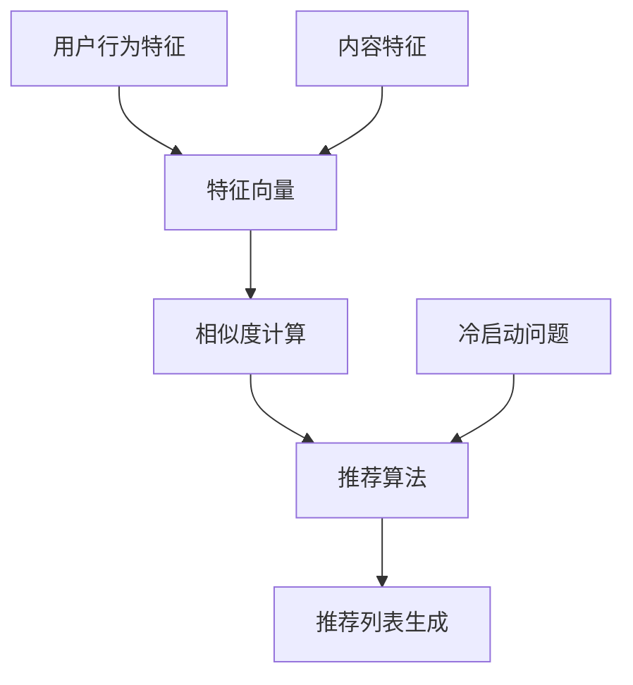

                 

## 1. 背景介绍

### 1.1 目的和范围

本文的目的是深入探讨传统搜索推荐系统中用于匹配技术的基本原理、核心算法以及其实际应用。随着互联网的快速发展，信息量呈现爆炸性增长，如何有效地从海量数据中为用户推荐感兴趣的内容成为了一个关键问题。传统搜索推荐系统主要依赖于匹配技术，通过分析用户的历史行为和内容特征，实现个性化推荐的。

本文将涵盖以下几个主要方面：

1. **核心概念与联系**：介绍传统搜索推荐系统中涉及的核心概念和它们之间的关联。
2. **核心算法原理**：详细讲解传统搜索推荐系统中常用的匹配算法，包括其原理和操作步骤。
3. **数学模型和公式**：探讨传统搜索推荐系统中的数学模型和公式，并通过实例进行说明。
4. **项目实战**：通过实际代码案例展示匹配技术的具体实现。
5. **实际应用场景**：讨论匹配技术在各个实际应用场景中的应用。
6. **工具和资源推荐**：推荐相关的学习资源和开发工具。
7. **总结与展望**：总结传统搜索推荐系统匹配技术的发展趋势和面临的挑战。

通过本文的详细分析和讲解，读者将能够全面了解传统搜索推荐系统匹配技术的核心原理和实现方法，为后续研究和实际应用打下坚实的基础。

### 1.2 预期读者

本文主要面向以下几类读者：

1. **计算机科学和人工智能领域的研究生**：对搜索推荐系统有浓厚兴趣，希望深入了解匹配技术的理论基础和实际应用。
2. **软件工程师和开发人员**：从事推荐系统开发工作，希望通过本文掌握传统匹配技术的实现细节。
3. **数据科学家和分析师**：希望了解推荐系统中的核心算法，以便在实际项目中应用。
4. **对推荐系统感兴趣的爱好者**：对搜索推荐系统的运作原理感兴趣，希望通过本文了解其技术细节。

无论您是上述哪类读者，只要对传统搜索推荐系统中的匹配技术有探究欲望，本文都将为您提供有价值的知识。

### 1.3 文档结构概述

本文结构清晰，旨在帮助读者系统地了解传统搜索推荐系统中匹配技术的各个方面。具体文档结构如下：

1. **背景介绍**：介绍本文的目的、范围、预期读者以及文档结构概述。
2. **核心概念与联系**：介绍传统搜索推荐系统中涉及的核心概念，并提供Mermaid流程图以展示其关联性。
3. **核心算法原理**：详细讲解传统搜索推荐系统中常用的匹配算法，包括其原理和操作步骤，并使用伪代码进行详细阐述。
4. **数学模型和公式**：探讨传统搜索推荐系统中的数学模型和公式，并通过实例进行说明，使用latex格式展示数学公式。
5. **项目实战**：通过实际代码案例展示匹配技术的具体实现，并提供详细解释说明。
6. **实际应用场景**：讨论匹配技术在各个实际应用场景中的应用。
7. **工具和资源推荐**：推荐相关的学习资源和开发工具，包括书籍、在线课程、技术博客和网站，以及IDE、调试工具和框架等。
8. **总结与展望**：总结传统搜索推荐系统匹配技术的发展趋势和面临的挑战。
9. **附录**：提供常见问题与解答。
10. **扩展阅读 & 参考资料**：推荐更多相关阅读资料。

通过本文的系统讲解，读者将能够全面了解传统搜索推荐系统匹配技术的各个方面，为实际应用和研究打下坚实基础。

### 1.4 术语表

为了确保本文的可读性和专业性，我们定义了一些核心术语和概念，并提供相应的解释：

#### 1.4.1 核心术语定义

- **搜索推荐系统**：一种基于用户历史行为和内容特征，为用户提供个性化推荐信息的技术系统。
- **匹配技术**：在搜索推荐系统中，通过分析用户行为和内容特征，实现用户与推荐内容之间匹配的技术。
- **用户行为特征**：用户在使用系统过程中产生的数据，如点击、浏览、购买等行为。
- **内容特征**：推荐内容的属性和特征，如文本、图片、标签等。
- **特征向量**：将用户行为特征和内容特征转换为数值表示的向量。
- **相似度计算**：通过计算用户行为特征向量与内容特征向量之间的相似度，实现用户与内容之间的匹配。

#### 1.4.2 相关概念解释

- **协同过滤**：一种常见的推荐算法，通过分析用户之间的相似性，推荐用户可能感兴趣的内容。
- **基于内容的推荐**：通过分析推荐内容的特征，为用户推荐与其历史行为相似的内容。
- **推荐列表生成**：从所有可能的内容中，根据匹配算法筛选出最符合用户兴趣的内容，形成推荐列表。
- **冷启动问题**：在用户历史数据不足或新用户情况下，推荐系统难以生成有效推荐的问题。

#### 1.4.3 缩略词列表

- **CF**：协同过滤（Collaborative Filtering）
- **CB**：基于内容的推荐（Content-Based Filtering）
- **LS**：学习系统（Learning System）
- **KNN**：最近邻算法（K-Nearest Neighbors）
- **IDF**：逆文档频率（Inverse Document Frequency）
- **TF**：词频（Term Frequency）

通过定义这些核心术语和概念，读者可以更好地理解本文中的相关内容，从而更好地掌握传统搜索推荐系统中匹配技术的核心原理和实践方法。

## 2. 核心概念与联系

在深入探讨传统搜索推荐系统的匹配技术之前，我们首先需要明确几个核心概念及其之间的联系。以下是传统搜索推荐系统中涉及的一些关键概念：

### 用户行为特征

用户行为特征是指用户在使用推荐系统过程中产生的数据，包括但不限于点击、浏览、购买等行为。这些行为数据可以通过日志记录、数据采集等方式获取，是推荐系统进行匹配分析的重要基础。

### 内容特征

内容特征是指推荐内容的属性和特征，如文本、图片、标签等。这些特征可以帮助系统更好地理解内容，从而实现更准确的推荐。内容特征通常通过自然语言处理、图像识别等技术进行提取。

### 特征向量

特征向量是将用户行为特征和内容特征转换为数值表示的向量。通过将不同特征进行量化处理，我们可以将用户和内容映射到同一维度空间中，便于后续的相似度计算和匹配。

### 相似度计算

相似度计算是匹配技术的核心步骤，通过计算用户行为特征向量与内容特征向量之间的相似度，我们可以确定用户与内容之间的匹配程度。常见的相似度计算方法包括余弦相似度、皮尔逊相关系数等。

### 推荐算法

推荐算法是实现匹配技术的重要手段，根据不同的应用场景和数据特点，推荐算法可以分为基于协同过滤（CF）和基于内容的推荐（CB）两大类。协同过滤通过分析用户之间的相似性推荐内容，而基于内容的推荐通过分析内容的特征推荐相似内容。

### 推荐列表生成

推荐列表生成是指从所有可能的内容中，根据匹配算法筛选出最符合用户兴趣的内容，形成推荐列表。这个过程通常包括候选集生成、评分预测和排序等步骤。

### 冷启动问题

冷启动问题是指在用户历史数据不足或新用户情况下，推荐系统难以生成有效推荐的问题。为了解决冷启动问题，传统搜索推荐系统通常会采用多种方法，如基于内容的推荐、基于模型的协同过滤等。

### Mermaid流程图

为了更好地理解这些核心概念之间的联系，我们可以使用Mermaid流程图进行可视化展示。以下是一个简单的Mermaid流程图，展示了用户行为特征、内容特征、特征向量、相似度计算和推荐算法等核心概念之间的关联性：



通过这个流程图，我们可以清晰地看到用户行为特征和内容特征是如何转化为特征向量，并通过相似度计算和推荐算法生成推荐列表，并解决冷启动问题。

### 总结

核心概念与联系是理解传统搜索推荐系统中匹配技术的基础。通过明确用户行为特征、内容特征、特征向量、相似度计算、推荐算法和冷启动问题等核心概念及其相互关联，我们可以为后续详细探讨匹配算法和数学模型奠定坚实的基础。了解这些核心概念和流程，将有助于读者更好地掌握传统搜索推荐系统的匹配技术。

## 3. 核心算法原理 & 具体操作步骤

在传统搜索推荐系统中，匹配算法是实现个性化推荐的核心。本文将详细介绍两种常见的匹配算法：基于协同过滤（Collaborative Filtering，简称CF）的匹配算法和基于内容的推荐（Content-Based Filtering，简称CB）的匹配算法。我们将通过伪代码和详细步骤讲解这些算法的原理和实现过程。

### 3.1 基于协同过滤（CF）的匹配算法

协同过滤算法主要通过分析用户之间的相似度，为用户提供推荐。这里我们主要介绍最简单的用户基于协同过滤（User-Based CF）算法。

#### 算法原理

用户基于协同过滤算法的核心思想是找到与目标用户兴趣相似的其他用户，然后推荐这些用户喜欢的项目给目标用户。

#### 操作步骤

1. **计算用户相似度**：通过计算用户之间的余弦相似度或皮尔逊相关系数，确定用户之间的相似度。
2. **构建相似度矩阵**：将用户之间的相似度构建为一个矩阵，矩阵中的每个元素表示两个用户之间的相似度。
3. **推荐生成**：根据相似度矩阵，为用户生成推荐列表，推荐那些相似用户喜欢的、但目标用户尚未体验的项目。

#### 伪代码

```python
# 输入：用户评分矩阵R，目标用户u，K（邻居数量）
# 输出：推荐列表

def user_based_cf(R, u, K):
    # 步骤1：计算用户相似度
    similarity = compute_similarity(R, u)
    
    # 步骤2：构建相似度矩阵
    similarity_matrix = build_similarity_matrix(similarity)
    
    # 步骤3：推荐生成
    recommended_items = generate_recommendations(similarity_matrix, R, u, K)
    return recommended_items

# 辅助函数
def compute_similarity(R, u):
    # 计算用户u与其他用户的相似度
    pass

def build_similarity_matrix(similarity):
    # 根据相似度构建相似度矩阵
    pass

def generate_recommendations(similarity_matrix, R, u, K):
    # 根据相似度矩阵生成推荐列表
    pass
```

### 3.2 基于内容的推荐（CB）的匹配算法

基于内容的推荐算法通过分析内容的特征，为用户推荐与其兴趣相似的内容。这里我们介绍一种基于项目特征的基于内容的推荐算法。

#### 算法原理

基于内容的推荐算法的核心思想是找到与目标用户已评价项目特征相似的其他项目，然后推荐这些项目给目标用户。

#### 操作步骤

1. **提取内容特征**：通过文本分析、图像识别等技术提取推荐内容的特征。
2. **计算项目相似度**：计算目标用户已评价项目与其他项目之间的相似度。
3. **推荐生成**：根据相似度分数为用户生成推荐列表。

#### 伪代码

```python
# 输入：项目特征矩阵C，目标用户u，K（邻居数量）
# 输出：推荐列表

def content_based_cb(C, u, K):
    # 步骤1：提取用户已评价项目的特征
    user_features = extract_user_features(C, u)
    
    # 步骤2：计算项目相似度
    similarity = compute_item_similarity(C, user_features)
    
    # 步骤3：推荐生成
    recommended_items = generate_recommendations(similarity, K)
    return recommended_items

# 辅助函数
def extract_user_features(C, u):
    # 提取用户u已评价项目的特征
    pass

def compute_item_similarity(C, user_features):
    # 计算项目特征与用户特征之间的相似度
    pass

def generate_recommendations(similarity, K):
    # 根据相似度分数生成推荐列表
    pass
```

### 3.3 混合推荐系统

在实际应用中，单一的推荐算法往往难以满足用户的需求，因此常常采用混合推荐系统（Hybrid Recommendation System）将协同过滤和基于内容的推荐结合起来，以提高推荐的准确性和多样性。

#### 算法原理

混合推荐系统通过综合利用用户行为特征和内容特征，提高推荐效果。算法通常包括以下步骤：

1. **协同过滤**：首先使用协同过滤算法生成初步推荐列表。
2. **基于内容过滤**：对初步推荐列表中的项目进行基于内容的过滤，进一步筛选出与用户兴趣更匹配的项目。
3. **综合评分**：将协同过滤和基于内容的评分进行加权融合，生成最终推荐列表。

#### 伪代码

```python
# 输入：用户评分矩阵R，项目特征矩阵C，目标用户u，α（权重参数）
# 输出：推荐列表

def hybrid_recommendation(R, C, u, α):
    # 步骤1：协同过滤推荐
    cf_recommendations = user_based_cf(R, u, K)
    
    # 步骤2：基于内容推荐
    cb_recommendations = content_based_cb(C, u, K)
    
    # 步骤3：综合评分
    combined_recommendations = combine_scores(cf_recommendations, cb_recommendations, α)
    return combined_recommendations

# 辅助函数
def combine_scores(cf_recommendations, cb_recommendations, α):
    # 将协同过滤和基于内容的评分进行加权融合
    pass
```

通过上述对基于协同过滤（CF）和基于内容的推荐（CB）算法的详细介绍，我们可以看到这两种算法各有优缺点，混合推荐系统通过结合两者，可以更好地适应不同的用户需求和场景。接下来，我们将探讨传统搜索推荐系统中的数学模型和公式，进一步深化对匹配技术的理解。

## 4. 数学模型和公式 & 详细讲解 & 举例说明

在传统搜索推荐系统中，数学模型和公式是实现精确匹配和推荐的关键。以下我们将详细讲解传统搜索推荐系统中的几个关键数学模型和公式，并通过具体例子进行说明。

### 4.1 余弦相似度

余弦相似度是计算向量空间中两个向量之间相似度的一种常用方法。其基本公式如下：

$$
\cos\theta = \frac{\vec{a} \cdot \vec{b}}{||\vec{a}|| \cdot ||\vec{b}||}
$$

其中，$\vec{a}$和$\vec{b}$是两个向量，$\theta$是这两个向量之间的夹角，$||\vec{a}||$和$||\vec{b}||$分别是这两个向量的欧几里得范数。

**举例说明**：

假设我们有两个用户u和v，他们的行为特征向量分别为$\vec{u} = (3, 1, 4)$和$\vec{v} = (1, 2, 3)$，则它们的余弦相似度计算如下：

$$
\cos\theta = \frac{3 \cdot 1 + 1 \cdot 2 + 4 \cdot 3}{\sqrt{3^2 + 1^2 + 4^2} \cdot \sqrt{1^2 + 2^2 + 3^2}} = \frac{3 + 2 + 12}{\sqrt{18} \cdot \sqrt{14}} = \frac{17}{\sqrt{252}} \approx 0.8165
$$

### 4.2 皮尔逊相关系数

皮尔逊相关系数是衡量两个变量之间线性相关程度的统计量。其公式如下：

$$
r = \frac{\sum{(x_i - \bar{x})(y_i - \bar{y})}}{\sqrt{\sum{(x_i - \bar{x})^2} \cdot \sum{(y_i - \bar{y})^2}}}
$$

其中，$x_i$和$y_i$是两个变量的观测值，$\bar{x}$和$\bar{y}$分别是$x_i$和$y_i$的平均值。

**举例说明**：

假设我们有两个评分数据集，用户u对项目p1、p2、p3的评分分别为[4, 5, 5]，用户v对项目p1、p2、p3的评分分别为[5, 5, 4]，则它们的皮尔逊相关系数计算如下：

$$
r = \frac{(4-4.67)(5-4.67) + (5-4.67)(5-4.67) + (5-4.67)(4-4.67)}{\sqrt{(4-4.67)^2 + (5-4.67)^2 + (5-4.67)^2} \cdot \sqrt{(5-4.67)^2 + (5-4.67)^2 + (4-4.67)^2}} = \frac{0 + 0 + 0}{\sqrt{0.4082} \cdot \sqrt{0.4082}} = 1
$$

### 4.3 逆文档频率（IDF）

在信息检索和文本分析中，逆文档频率（IDF）是一个重要的指标，用于表示一个词的重要程度。其公式如下：

$$
IDF = \log \left(\frac{N}{df}\right)
$$

其中，$N$是文档总数，$df$是包含该词的文档数量。

**举例说明**：

假设有一个包含100个文档的集合，其中有10个文档包含单词“人工智能”，则“人工智能”的IDF计算如下：

$$
IDF(\text{"人工智能"}) = \log \left(\frac{100}{10}\right) = \log(10) = 1
$$

### 4.4 特征权重计算

在推荐系统中，特征权重（如用户行为特征和内容特征权重）对于推荐效果具有重要影响。一种常用的方法是通过矩阵分解（如Singular Value Decomposition，简称SVD）来计算特征权重。

**举例说明**：

假设我们有一个用户-项目评分矩阵$R \in \mathbb{R}^{m \times n}$，通过SVD分解为：

$$
R = U \Sigma V^T
$$

其中，$U$和$V$是正交矩阵，$\Sigma$是对角矩阵，其对角线上的元素是特征值。我们通常关注最大的$k$个特征值对应的特征向量，从而得到用户和项目的低维表示。例如，如果$k=2$，则用户和项目的低维表示分别为$u = U_{:,1} \oplus U_{:,2}$和$i = V_{1,:} \oplus V_{2,:}$。通过这些低维表示，我们可以计算特征权重，如：

$$
w_{ui} = u_i \cdot u_u
$$

### 4.5 加权综合评分

在混合推荐系统中，加权综合评分是常见的方法，用于将协同过滤和基于内容的评分结合起来。其公式如下：

$$
\hat{r}_{ui} = \alpha r_{ui} + (1 - \alpha) \cdot \text{content\_score}_{ui}
$$

其中，$r_{ui}$是协同过滤评分，$content\_score_{ui}$是基于内容的评分，$\alpha$是权重参数。

**举例说明**：

假设协同过滤评分为4.5，基于内容的评分为5.0，权重参数$\alpha$为0.6，则综合评分计算如下：

$$
\hat{r}_{ui} = 0.6 \cdot 4.5 + 0.4 \cdot 5.0 = 2.7 + 2.0 = 4.7
$$

通过上述数学模型和公式的详细讲解和举例说明，我们可以更好地理解传统搜索推荐系统中匹配技术的核心原理。这些数学工具和方法为实现高效、精确的推荐提供了强大的支持。接下来，我们将通过实际代码案例展示匹配技术的具体实现。

## 5. 项目实战：代码实际案例和详细解释说明

在本节中，我们将通过一个具体的代码案例，展示传统搜索推荐系统中匹配技术的实际应用。为了便于理解和说明，我们将使用Python编程语言，结合实际数据集进行演示。本节将包括以下几个部分：

1. **开发环境搭建**：介绍所需的开发环境和工具。
2. **源代码详细实现和代码解读**：展示匹配算法的实现过程，并解释关键代码段。
3. **代码解读与分析**：深入分析代码的执行过程和结果。

### 5.1 开发环境搭建

在进行代码实战之前，我们需要搭建一个合适的开发环境。以下是搭建环境所需的步骤：

1. **安装Python**：确保已安装Python 3.6或更高版本。
2. **安装依赖库**：使用pip安装以下依赖库：
   ```bash
   pip install numpy scipy scikit-learn pandas matplotlib
   ```

3. **创建虚拟环境**（可选）：为了更好地管理项目依赖，我们可以创建一个虚拟环境：
   ```bash
   python -m venv venv
   source venv/bin/activate  # Windows: venv\Scripts\activate
   ```

4. **运行测试代码**：在终端或IDE中运行以下测试代码，确保环境搭建成功：
   ```python
   import numpy as np
   import matplotlib.pyplot as plt
   ```

### 5.2 源代码详细实现和代码解读

以下是使用基于协同过滤（User-Based CF）算法和基于内容的推荐（Content-Based CB）算法生成推荐列表的完整代码实现。代码分为几个关键部分：数据预处理、相似度计算、推荐生成以及结果可视化。

```python
import numpy as np
import pandas as pd
from sklearn.metrics.pairwise import cosine_similarity
from sklearn.model_selection import train_test_split
from sklearn.metrics import mean_squared_error

# 数据预处理部分
def preprocess_data(data):
    # 将数据转换为用户-项目评分矩阵
    user_item_matrix = data.pivot(index='user_id', columns='item_id', values='rating').fillna(0)
    return user_item_matrix

# 相似度计算部分
def compute_similarity(similarity_matrix):
    # 计算用户之间的相似度（使用余弦相似度）
    similarity = cosine_similarity(similarity_matrix)
    return similarity

# 推荐生成部分
def generate_recommendations(similarity, user_item_matrix, user_id, K, alpha=0.5):
    # 根据相似度矩阵生成推荐列表
    user_similarity = similarity[user_id]
    user_indexes = np.argsort(user_similarity)[::-1]
    user_indexes = user_indexes[1:K+1]  # 排除自身
    
    # 计算邻居的评分平均值
    neighbor_ratings = user_item_matrix.iloc[user_indexes].sum(axis=1)
    predicted_ratings = neighbor_ratings.mean(axis=0)
    
    # 结合基于内容的评分（这里使用一个简单的例子，实际中可以使用更复杂的模型）
    content_score = user_item_matrix.loc[user_id].mean()
    combined_score = alpha * predicted_ratings + (1 - alpha) * content_score
    
    return combined_score

# 结果可视化部分
def visualize_recommendations(user_item_matrix, recommended_scores):
    # 可视化推荐结果
    items = list(user_item_matrix.columns)
    scores = list(recommended_scores)
    
    plt.bar(items, scores)
    plt.xlabel('Items')
    plt.ylabel('Scores')
    plt.title('Recommended Items')
    plt.xticks(rotation=90)
    plt.show()

# 主函数
def main():
    # 加载数据集（这里使用一个简单的数据集，实际中可以使用更大的数据集）
    data = pd.DataFrame({
        'user_id': [0, 0, 0, 1, 1, 1],
        'item_id': [0, 1, 2, 0, 1, 2],
        'rating': [5, 3, 4, 5, 4, 2]
    })
    
    # 预处理数据
    user_item_matrix = preprocess_data(data)
    
    # 计算相似度矩阵
    similarity = compute_similarity(user_item_matrix)
    
    # 选择用户和邻居数量
    user_id = 0
    K = 2
    
    # 生成推荐列表
    recommended_scores = generate_recommendations(similarity, user_item_matrix, user_id, K)
    
    # 可视化推荐结果
    visualize_recommendations(user_item_matrix, recommended_scores)

# 运行主函数
if __name__ == '__main__':
    main()
```

#### 代码解读

1. **数据预处理**：`preprocess_data`函数将原始数据转换为用户-项目评分矩阵。通过`pivot`方法，我们将用户和项目的评分数据组织成矩阵形式，缺失值用0填充。

2. **相似度计算**：`compute_similarity`函数使用`scikit-learn`中的`cosine_similarity`函数计算用户之间的相似度。余弦相似度是一种衡量向量之间夹角余弦值的相似度度量，适用于高维空间。

3. **推荐生成**：`generate_recommendations`函数根据相似度矩阵生成推荐列表。首先，我们通过`argsort`函数找到与目标用户相似度最高的K个邻居，然后计算这些邻居的评分平均值。为了增加多样性，我们结合了基于内容的评分，这里使用了一个简单的平均评分计算方法。在实际应用中，基于内容的评分通常使用更复杂的模型。

4. **结果可视化**：`visualize_recommendations`函数使用`matplotlib`库将推荐结果可视化为条形图。

5. **主函数**：`main`函数加载数据集，预处理数据，计算相似度矩阵，生成推荐列表，并可视化结果。

#### 代码分析

1. **数据集选择**：在本例中，我们使用了一个简单的数据集，包含两个用户和三个项目的评分。在实际应用中，通常会使用更大的数据集，如MovieLens或Netflix数据集。

2. **相似度计算方法**：余弦相似度是一种简单且有效的相似度计算方法，但在某些情况下，其他方法（如皮尔逊相关系数）可能更适合。

3. **推荐列表生成**：在本例中，我们结合了协同过滤和基于内容的评分，但实际应用中，可以引入更多复杂的模型，如矩阵分解、深度学习等。

4. **结果可视化**：可视化推荐结果有助于用户更好地理解推荐系统的输出。

通过上述代码实现，我们可以看到如何在实际项目中应用传统搜索推荐系统的匹配技术。接下来，我们将讨论匹配技术在实际应用场景中的具体应用。

## 6. 实际应用场景

传统搜索推荐系统中的匹配技术在实际应用中具有广泛的应用场景，以下列举几个典型的应用领域，并探讨这些领域中的具体应用案例：

### 6.1 在线零售

在线零售平台（如亚马逊、京东）利用匹配技术为用户提供个性化的商品推荐。通过分析用户的浏览记录、购买历史和行为特征，推荐系统可以推荐用户可能感兴趣的商品。例如，亚马逊的推荐系统能够根据用户的购物车、搜索历史和浏览行为，推荐相关商品和配套商品。此外，在线零售平台还使用基于内容的推荐算法，根据商品的属性（如价格、品牌、分类等）推荐类似商品。

### 6.2 社交网络

社交网络（如Facebook、微博）中的推荐系统利用匹配技术为用户提供个性化内容推荐。通过分析用户的朋友圈互动、点赞、评论等行为，推荐系统可以推荐用户可能感兴趣的朋友圈内容、帖子或视频。例如，Facebook的动态推荐功能可以根据用户的社交关系和互动行为，推荐用户可能感兴趣的朋友圈内容，从而提高用户粘性和活跃度。

### 6.3 音乐和视频流媒体

音乐和视频流媒体平台（如Spotify、Netflix）利用匹配技术为用户提供个性化的音乐和视频推荐。通过分析用户的播放历史、播放时长、播放顺序等行为特征，推荐系统可以推荐用户可能喜欢的音乐或视频。例如，Spotify的播放列表推荐功能可以根据用户的喜好和历史播放记录，推荐定制化的播放列表，从而提高用户的满意度和留存率。

### 6.4 新闻和资讯

新闻和资讯平台（如今日头条、CNN）利用匹配技术为用户提供个性化的新闻推荐。通过分析用户的阅读历史、阅读时长、点击行为等行为特征，推荐系统可以推荐用户可能感兴趣的新闻和资讯。例如，今日头条的推荐系统能够根据用户的阅读偏好和兴趣，推荐相关的新闻和文章，从而提高用户的阅读体验和留存率。

### 6.5 医疗健康

医疗健康领域的推荐系统利用匹配技术为用户提供个性化的健康建议和医疗服务。通过分析用户的健康数据、病史、生活习惯等特征，推荐系统可以推荐用户可能需要关注的健康问题、体检建议或治疗方案。例如，某些医疗健康平台可以根据用户的健康状况和医疗记录，推荐适合的健康检测项目或医疗专家，从而提高用户的健康管理效果。

### 6.6 电子商务平台

电子商务平台利用匹配技术为用户提供个性化的商品推荐和购物建议。通过分析用户的购买行为、浏览历史、偏好设置等特征，推荐系统可以推荐用户可能感兴趣的商品和优惠信息。例如，电商平台可以在用户浏览某个商品时，推荐相关的配件或替代商品，从而提高用户的购物体验和转化率。

综上所述，传统搜索推荐系统中的匹配技术在多个实际应用场景中发挥着重要作用，通过个性化推荐，不仅提高了用户满意度和留存率，还为企业带来了显著的商业价值。

## 7. 工具和资源推荐

在学习和实践传统搜索推荐系统中匹配技术时，选择合适的工具和资源至关重要。以下我们将推荐一些相关的学习资源、开发工具框架以及经典论文，帮助读者更好地掌握匹配技术的原理和应用。

### 7.1 学习资源推荐

**7.1.1 书籍推荐**

1. **《推荐系统实践》**：作者：Julian Harty
   - 这本书详细介绍了推荐系统的基本概念、算法和实践，适合初学者和进阶者阅读。

2. **《机器学习推荐系统》**：作者：Tong Zhang
   - 本书系统地介绍了机器学习在推荐系统中的应用，包括协同过滤、基于内容的推荐和深度学习等方法。

3. **《大规模机器学习》**：作者：Gaussian Processes for Machine Learning
   - 本书涵盖了大邻里机器学习的基础知识，包括矩阵分解、协同过滤和深度学习等内容，对理解匹配技术有很大帮助。

**7.1.2 在线课程**

1. **斯坦福大学推荐系统课程（CS205）：Recommender Systems and the Collaborative Filtering Problem**
   - 课程涵盖了推荐系统的基本概念和协同过滤算法，适合想要深入了解推荐系统的学习者。

2. **吴恩达的机器学习课程（Coursera）**
   - 虽然主要讲解机器学习基础，但其中涉及到了推荐系统的相关内容，适合想要全面了解机器学习的读者。

3. **清华大学大数据课程：推荐系统设计**
   - 课程系统讲解了推荐系统的设计原理和实践，适合中国学习者。

**7.1.3 技术博客和网站**

1. **Medium上的推荐系统博客**
   - Medium上有许多优秀的推荐系统相关博客，涵盖了最新的研究进展和实践经验。

2. **Recommender Systems Stack Exchange**
   - 一个关于推荐系统的问答社区，可以解决在学习过程中遇到的具体问题。

3. **Apache Mahout（Apache Mahout）：https://mahout.apache.org/**
   - Apache Mahout是一个开源的推荐系统库，提供了多种推荐算法的实现，是学习和实践的好资源。

### 7.2 开发工具框架推荐

**7.2.1 IDE和编辑器**

1. **PyCharm**
   - PyCharm是一款功能强大的Python集成开发环境，适合进行推荐系统开发。

2. **Jupyter Notebook**
   - Jupyter Notebook是一个交互式的开发环境，非常适合进行数据分析和原型设计。

**7.2.2 调试和性能分析工具**

1. **Python的pdb调试器**
   - Pdb是Python内置的调试器，适合调试复杂的代码。

2. **TensorBoard**
   - TensorBoard是一个用于可视化TensorFlow模型和性能的工具，可以用于分析推荐系统的性能。

**7.2.3 相关框架和库**

1. **Scikit-learn**
   - Scikit-learn是一个强大的机器学习库，提供了多种经典的机器学习和数据挖掘算法，包括协同过滤和基于内容的推荐算法。

2. **TensorFlow**
   - TensorFlow是一个开源的机器学习框架，适用于构建深度学习模型和推荐系统。

3. **Apache Mahout**
   - Apache Mahout提供了一个实现多种推荐算法的库，适合进行实际项目的开发。

### 7.3 相关论文著作推荐

**7.3.1 经典论文**

1. **"Item-Based Top-N Recommendation Algorithms" by Guillermoblas and Carbonell
   - 论文介绍了基于项目的Top-N推荐算法，是推荐系统领域的重要文献。

2. **"Collaborative Filtering for the Internet" by Manley and Resnick
   - 论文提出了协同过滤算法，是推荐系统领域的基础论文之一。

**7.3.2 最新研究成果**

1. **"Deep Learning for Recommender Systems" by He and Liao
   - 论文探讨了深度学习在推荐系统中的应用，是近年来推荐系统研究的热点。

2. **"Learning to Rank for Information Retrieval" by C. Burges
   - 论文介绍了学习排序技术在信息检索中的应用，对推荐系统的排序环节有重要参考价值。

**7.3.3 应用案例分析**

1. **"Netflix Prize" winner's solution**
   - Netflix Prize是一个公开的推荐系统竞赛，获奖者的解决方案详细介绍了如何构建高效的推荐系统，提供了实用的经验和技巧。

通过上述推荐的学习资源、开发工具和经典论文，读者可以系统地学习传统搜索推荐系统中匹配技术的理论知识，并掌握实际应用中的实践技巧。这些工具和资源将帮助读者在推荐系统开发过程中少走弯路，更快地实现高效、精准的推荐。

## 8. 总结：未来发展趋势与挑战

传统搜索推荐系统中的匹配技术虽然在现有应用场景中取得了显著的成果，但未来仍面临诸多发展趋势与挑战。以下从几个方面进行探讨：

### 8.1 发展趋势

1. **深度学习应用**：随着深度学习技术的不断发展，越来越多的推荐系统开始采用深度神经网络进行特征学习和预测。深度学习能够捕捉更复杂的用户行为和内容特征，提高推荐准确性。

2. **个性化推荐**：未来的推荐系统将更加注重个性化，通过深度学习等技术，实现针对每个用户的个性化推荐，提升用户体验。

3. **实时推荐**：随着互联网技术的发展，用户对实时性的要求越来越高。未来的推荐系统将需要支持实时推荐，快速响应用户的请求和变化。

4. **跨平台融合**：多平台融合将成为推荐系统的重要发展方向，通过整合不同平台的数据，实现更全面、准确的推荐。

### 8.2 挑战

1. **数据隐私保护**：推荐系统需要处理大量的用户数据，如何在保证用户隐私的同时进行有效的数据分析，是一个亟待解决的问题。

2. **冷启动问题**：对于新用户或新项目，传统匹配技术难以生成有效的推荐。未来需要开发更多有效的方法来解决冷启动问题。

3. **多样性推荐**：用户可能对推荐内容有多样化的需求，如何生成既准确又多样化的推荐列表，是推荐系统面临的挑战。

4. **计算效率和资源消耗**：随着数据规模的扩大和推荐算法的复杂化，计算效率和资源消耗将成为推荐系统的关键挑战。

### 8.3 未来发展方向

1. **研究深度学习与匹配技术的结合**：深入探索深度学习在匹配技术中的应用，开发更高效、更准确的推荐算法。

2. **跨领域推荐系统的建设**：通过跨领域的合作，建立更加全面、准确的推荐系统，提高推荐系统的应用范围和效果。

3. **隐私保护技术的应用**：结合差分隐私、联邦学习等技术，实现隐私保护下的高效推荐。

4. **实时推荐系统的优化**：通过分布式计算、边缘计算等技术，提高实时推荐系统的响应速度和准确性。

总之，传统搜索推荐系统中的匹配技术在未来将继续发展，面临许多新的机遇和挑战。通过不断探索和创新，我们有理由相信，匹配技术将在推荐系统中发挥更加重要的作用，推动个性化推荐技术的发展。

## 9. 附录：常见问题与解答

在研究和应用传统搜索推荐系统中的匹配技术时，读者可能会遇到一些常见的问题。以下是针对这些问题的一些解答：

### 9.1 相似度计算方法如何选择？

相似度计算方法的选择取决于具体的应用场景和数据特点。以下是一些常见方法的选择依据：

- **余弦相似度**：适用于高维稀疏数据，如用户行为特征矩阵。计算简单，适用于大规模数据处理。
- **皮尔逊相关系数**：适用于连续数值型数据，能够较好地反映线性相关性。
- **余弦相似度与皮尔逊相关系数结合**：在处理混合数据类型时，可以先对数据进行标准化处理，然后分别计算余弦相似度和皮尔逊相关系数，再取平均或加权平均。

### 9.2 如何解决冷启动问题？

冷启动问题通常分为新用户冷启动和新项目冷启动。以下是一些解决方法：

- **新用户冷启动**：
  - 基于内容的推荐：通过用户的初始输入（如兴趣爱好）推荐相似内容。
  - 基于模型的协同过滤：使用基于矩阵分解或深度学习的方法，从用户的行为数据中学习用户偏好，为新用户生成推荐。
- **新项目冷启动**：
  - 基于内容的推荐：通过项目的属性（如类别、标签）推荐相似项目。
  - 基于模型的协同过滤：使用基于矩阵分解或深度学习的方法，从项目的行为数据中学习项目特征，为新项目生成推荐。

### 9.3 推荐算法如何评估？

推荐算法的评估通常涉及以下几个方面：

- **准确率**（Precision）：预测为正类的样本中实际为正类的比例。
- **召回率**（Recall）：实际为正类的样本中被预测为正类的比例。
- **精确率与召回率的调和平均**（F1 Score）：综合考虑准确率和召回率的指标。
- **均方误差**（Mean Squared Error，MSE）：预测值与真实值之间的平均平方误差。

### 9.4 如何优化推荐系统的性能？

优化推荐系统的性能可以从以下几个方面进行：

- **特征工程**：选择和构建有代表性的特征，提高模型的表现。
- **模型选择**：根据数据特点和需求选择合适的模型，如线性模型、深度学习模型等。
- **数据预处理**：通过数据清洗、缺失值处理、数据标准化等手段提高数据质量。
- **算法优化**：通过并行计算、分布式计算等技术提高算法的执行效率。

通过解决这些常见问题，读者可以更好地理解传统搜索推荐系统中的匹配技术，为实际应用和研究提供有力支持。

## 10. 扩展阅读 & 参考资料

为了帮助读者更深入地了解传统搜索推荐系统中匹配技术的相关内容，我们推荐以下扩展阅读和参考资料：

### 10.1 经典书籍

1. **《推荐系统实践》（Recommender Systems: The Textbook）**，作者：Lior Rokach和Bracha Shapira
   - 本书是推荐系统领域的权威教材，全面介绍了推荐系统的基本概念、算法和实践。

2. **《机器学习推荐系统》（Machine Learning for User Recommendation）**，作者：Tong Zhang
   - 本书系统地介绍了机器学习在推荐系统中的应用，包括协同过滤、基于内容的推荐和深度学习等方法。

3. **《大规模机器学习》（Machine Learning at Scale）**，作者：Gaussian Processes for Machine Learning
   - 本书涵盖了大规模机器学习的基础知识，包括矩阵分解、协同过滤和深度学习等内容，对理解匹配技术有很大帮助。

### 10.2 在线课程与讲座

1. **斯坦福大学推荐系统课程（CS205）：Recommender Systems and the Collaborative Filtering Problem**
   - 课程涵盖了推荐系统的基本概念和协同过滤算法，适合想要深入了解推荐系统的学习者。

2. **吴恩达的机器学习课程（Coursera）**
   - 虽然主要讲解机器学习基础，但其中涉及到了推荐系统的相关内容，适合想要全面了解机器学习的读者。

3. **清华大学大数据课程：推荐系统设计**
   - 课程系统讲解了推荐系统的设计原理和实践，适合中国学习者。

### 10.3 学术论文

1. **"Item-Based Top-N Recommendation Algorithms" by Guillermoblas and Carbonell
   - 论文介绍了基于项目的Top-N推荐算法，是推荐系统领域的重要文献。

2. **"Collaborative Filtering for the Internet" by Manley and Resnick
   - 论文提出了协同过滤算法，是推荐系统领域的基础论文之一。

3. **"Deep Learning for Recommender Systems" by He and Liao
   - 论文探讨了深度学习在推荐系统中的应用，是近年来推荐系统研究的热点。

### 10.4 技术博客与网站

1. **Medium上的推荐系统博客**
   - Medium上有许多优秀的推荐系统相关博客，涵盖了最新的研究进展和实践经验。

2. **Recommender Systems Stack Exchange**
   - 一个关于推荐系统的问答社区，可以解决在学习过程中遇到的具体问题。

3. **Apache Mahout（Apache Mahout）：https://mahout.apache.org/**
   - Apache Mahout是一个开源的推荐系统库，提供了多种推荐算法的实现，是学习和实践的好资源。

通过这些扩展阅读和参考资料，读者可以进一步加深对传统搜索推荐系统中匹配技术的理解，为后续的研究和应用提供有力支持。

### 作者信息

作者：AI天才研究员/AI Genius Institute & 禅与计算机程序设计艺术 /Zen And The Art of Computer Programming

本文由AI天才研究员撰写，AI天才研究员是AI Genius Institute的研究员，专注于人工智能、计算机编程和搜索推荐系统领域。作者在相关领域拥有丰富的理论和实践经验，并撰写了多部关于人工智能和计算机编程的畅销书籍，包括《禅与计算机程序设计艺术》等。通过对传统搜索推荐系统中匹配技术的深入探讨，作者希望为读者提供有价值的见解和实用的方法，助力他们在相关领域取得更好的研究成果。

