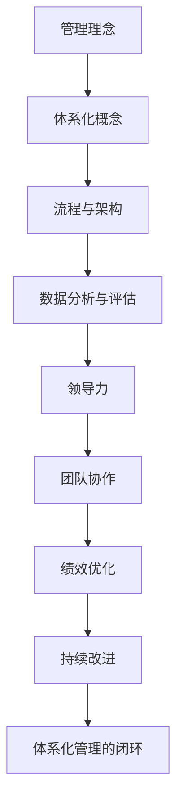

                 

# 体系化管理：卓越领导力的源泉

## 关键词：体系化、管理、领导力、架构、算法、数学模型、实战、应用场景、工具推荐

## 摘要：

本文旨在深入探讨体系化管理在卓越领导力中的作用。通过分析核心概念、算法原理、数学模型以及实际应用场景，我们将揭示体系化管理如何在IT领域推动领导力的提升。文章首先介绍了体系化管理的背景和重要性，随后逐步展开，涵盖核心概念、算法原理、数学模型、实战案例、应用场景和工具推荐等内容，旨在为读者提供全面而深入的理解。

## 1. 背景介绍

### 1.1 目的和范围

本文的目的是帮助读者理解体系化管理在卓越领导力中的关键作用，并通过具体实例和理论分析，展示其如何在IT领域推动组织的成功。文章将覆盖以下范围：

- 体系化管理的定义和基本原理
- 核心概念和架构
- 体系化管理的算法原理和数学模型
- 实际项目中的代码实现和案例分析
- 体系化管理在不同应用场景中的效果
- 体系化管理相关的工具和资源推荐

### 1.2 预期读者

本文面向希望提升领导力并在IT领域实现卓越管理的读者，包括：

- 初级和中级IT项目经理
- 企业管理者
- 研发团队负责人
- 对于领导力和管理有兴趣的IT专业人士

### 1.3 文档结构概述

本文结构分为以下部分：

- 引言
- 1. 背景介绍
  - 1.1 目的和范围
  - 1.2 预期读者
  - 1.3 文档结构概述
  - 1.4 术语表
- 2. 核心概念与联系
- 3. 核心算法原理 & 具体操作步骤
- 4. 数学模型和公式 & 详细讲解 & 举例说明
- 5. 项目实战：代码实际案例和详细解释说明
- 6. 实际应用场景
- 7. 工具和资源推荐
- 8. 总结：未来发展趋势与挑战
- 9. 附录：常见问题与解答
- 10. 扩展阅读 & 参考资料

### 1.4 术语表

- **体系化管理**：一种系统化的管理方法，通过明确的结构、流程和算法，优化组织运作，提升效率。
- **领导力**：一种影响他人并带领团队达成目标的能力。
- **架构**：软件系统的整体结构，包括组件、接口和相互关系。
- **算法**：解决问题的步骤和过程。
- **数学模型**：用数学语言描述现实问题的方法。
- **实战**：实际项目中的操作和实施。
- **应用场景**：算法和模型在实际工作中的应用实例。

## 1.4.1 核心术语定义

- **体系化管理**：体系化管理是指采用系统化的方法来管理和指导组织的运作。这种方法强调明确的目标、规范化的流程、科学的评估和持续改进。通过体系化管理，组织能够更高效地实现其目标，同时减少资源浪费。
- **领导力**：领导力是一种影响力和感召力，领导者通过这种力量能够引导和激励团队成员共同实现目标。有效的领导力能够促进团队合作、提高工作效率、增强组织凝聚力。
- **架构**：在软件工程中，架构指的是系统的整体结构设计，包括各个组件及其相互关系。良好的架构设计能够提高系统的可维护性、可扩展性和可复用性。
- **算法**：算法是一系列解决问题的步骤，用于处理特定类型的问题。算法的有效性决定了问题解决的效率和准确性。
- **数学模型**：数学模型是用数学语言描述现实问题的抽象表示，通过数学公式和关系来描述问题的性质和特征。

## 1.4.2 相关概念解释

- **体系化管理的特点**：体系化管理具有以下特点：
  - **系统化**：强调整体性和系统性，通过明确的架构和流程，实现组织的有序运作。
  - **规范化**：采用标准化的方法和流程，确保工作的一致性和规范性。
  - **科学性**：基于数据和事实，通过科学的评估和持续改进，优化组织运作。
  - **协同性**：强调团队协作，通过协同工作实现组织目标的最大化。

- **领导力的要素**：领导力包含多个要素，包括：
  - **影响力**：领导者通过自身的言行和行动，影响和激励团队成员。
  - **目标导向**：领导者明确组织的愿景和目标，引导团队成员共同追求。
  - **沟通能力**：领导者需要具备良好的沟通能力，确保信息的有效传递和团队协作。
  - **决策能力**：领导者需要具备决策能力，能够快速做出合理的决策。

- **架构的设计原则**：架构设计需要遵循以下原则：
  - **模块化**：将系统划分为多个独立的模块，提高系统的可维护性和可扩展性。
  - **可复用性**：设计可复用的组件和接口，提高开发效率和系统稳定性。
  - **可扩展性**：系统设计应考虑未来的扩展需求，确保系统的灵活性和可扩展性。
  - **可靠性**：确保系统的稳定性和可靠性，减少故障率和风险。

- **算法的分类**：算法可以根据解决问题的方法和策略进行分类，常见的分类包括：
  - **确定性算法**：根据固定的步骤和规则，逐步解决问题的算法。
  - **概率算法**：基于概率模型和随机过程，求解问题的算法。
  - **贪婪算法**：通过每一步选择最优解，逐步逼近最优解的算法。
  - **动态规划算法**：将复杂问题分解为子问题，通过子问题的最优解推导出原问题的最优解。

- **数学模型的应用**：数学模型广泛应用于各个领域，包括：
  - **经济学模型**：用于分析市场行为、供需关系和经济增长等。
  - **物理学模型**：用于描述物理现象、运动规律和能量转换等。
  - **统计学模型**：用于分析数据、预测趋势和进行假设检验等。
  - **运筹学模型**：用于优化资源分配、调度计划和决策分析等。

## 1.4.3 缩略词列表

- **IDE**：集成开发环境（Integrated Development Environment）
- **GUI**：图形用户界面（Graphical User Interface）
- **API**：应用程序编程接口（Application Programming Interface）
- **DB**：数据库（Database）
- **UI**：用户界面（User Interface）
- **SDK**：软件开发工具包（Software Development Kit）
- **OSS**：开放源代码软件（Open Source Software）
- **AI**：人工智能（Artificial Intelligence）
- **ML**：机器学习（Machine Learning）
- **DL**：深度学习（Deep Learning）

---

### 1.5 核心概念与联系

在深入探讨体系化管理之前，我们需要明确几个核心概念及其相互关系。以下是体系化管理中几个关键概念的Mermaid流程图：



通过这个流程图，我们可以看到体系化管理是如何通过管理理念、体系化概念、流程与架构、数据分析与评估、领导力、团队协作和绩效优化等多个方面形成一个闭环，不断优化和提升组织运作效率。

### 2. 核心概念与联系

在本节中，我们将详细探讨体系化管理中的核心概念，并展示它们之间的联系。这些核心概念包括管理理念、流程与架构、数据分析与评估、领导力、团队协作、绩效优化以及持续改进。以下是一个用Mermaid绘制的流程图，展示了这些概念之间的关系：


#### 管理理念

管理理念是体系化管理的基石。它涉及到组织的目标、价值观和文化。一个明确的管理理念能够引导团队的方向，确保所有成员都朝着共同的目标努力。

- **目标明确**：管理理念首先需要明确组织的目标，包括短期和长期目标。
- **价值观**：组织的价值观决定了团队成员的行为准则，如诚信、创新、团队合作等。
- **文化**：企业文化是组织的灵魂，通过共同的信仰和价值观，增强团队凝聚力。

#### 体系化概念

体系化概念是体系化管理的核心，它包括流程与架构、数据分析与评估等多个方面。通过体系化概念，组织能够实现规范化、系统化和科学化。

- **流程与架构**：流程与架构是组织运作的基础，通过明确的工作流程和系统架构，确保工作的高效和有序。
- **数据分析与评估**：数据分析与评估是体系化管理的重要组成部分，通过数据分析和评估，组织能够了解自身运作的效率，发现问题并进行改进。

#### 流程与架构

流程与架构是体系化管理的核心，它们确保了组织运作的有序性和高效性。

- **流程设计**：流程设计是指为组织中的各项活动制定详细的操作步骤，确保工作的高效完成。
- **架构设计**：架构设计是指为软件系统或组织制定整体结构，确保系统的可维护性和可扩展性。

#### 数据分析与评估

数据分析与评估是体系化管理的重要组成部分，通过数据分析，组织能够了解自身的运作情况，通过评估，组织能够发现问题和改进方向。

- **数据收集**：数据收集是指从各种来源获取数据，包括内部数据、外部数据等。
- **数据分析**：数据分析是指使用统计方法和工具对数据进行处理，提取有价值的信息。
- **评估**：评估是指根据数据分析结果，对组织的运作进行评价，发现问题并提出改进方案。

#### 领导力

领导力是体系化管理的动力，领导者通过影响力、目标导向和沟通能力等要素，引导团队实现目标。

- **影响力**：领导者需要通过自身的行为和言行，影响和激励团队成员。
- **目标导向**：领导者需要明确组织的愿景和目标，并引导团队成员共同追求。
- **沟通能力**：领导者需要具备良好的沟通能力，确保信息的有效传递和团队协作。

#### 团队协作

团队协作是体系化管理的保障，通过团队协作，组织能够实现资源的共享和优势互补。

- **协作文化**：建立协作文化，鼓励团队成员相互支持和合作。
- **协作工具**：使用协作工具，如团队协作平台、项目管理软件等，提高协作效率。

#### 绩效优化

绩效优化是体系化管理的目标，通过绩效优化，组织能够提高工作效率和团队凝聚力。

- **绩效评估**：定期对团队成员的绩效进行评估，激励优秀员工，改进不足。
- **激励机制**：建立激励机制，鼓励团队成员追求卓越。

#### 持续改进

持续改进是体系化管理的灵魂，通过持续改进，组织能够不断优化和提升自身运作。

- **改进机制**：建立改进机制，鼓励团队成员提出改进意见，并实施改进。
- **反馈机制**：建立反馈机制，及时收集反馈信息，进行改进。

通过上述核心概念的探讨，我们可以看到，体系化管理是一个多层次、多维度的管理方法，通过明确的管理理念、规范的流程与架构、科学的数据分析与评估、强大的领导力、高效的团队协作、持续的绩效优化和改进机制，组织能够实现高效运作和持续发展。

### 2. 核心概念与联系

在探讨体系化管理的过程中，我们首先需要明确其核心概念。以下是体系化管理的几个关键概念及其相互关系的Mermaid流程图：


#### 管理理念

管理理念是体系化管理的基石。它包括组织的价值观、愿景和目标，是指导团队行为的准则。

- **价值观**：组织的价值观决定了团队成员的行为准则，如诚信、创新、团队合作等。
- **愿景**：组织的愿景是组织长期发展的目标和方向。
- **目标**：组织的目标包括短期和长期目标，是团队努力的方向。

#### 体系化概念

体系化概念是体系化管理的核心，它包括流程与架构、数据分析与评估等多个方面。

- **流程与架构**：流程与架构是组织运作的基础，通过明确的工作流程和系统架构，确保工作的高效和有序。
- **数据分析与评估**：数据分析与评估是体系化管理的重要组成部分，通过数据分析和评估，组织能够了解自身的运作效率，发现问题并进行改进。

#### 流程与架构

流程与架构是体系化管理的核心组成部分。流程是指为组织中的各项活动制定详细的操作步骤，确保工作的高效完成；架构是指为软件系统或组织制定整体结构，确保系统的可维护性和可扩展性。

- **流程设计**：流程设计是指为组织中的各项活动制定详细的操作步骤，确保工作的高效完成。
- **架构设计**：架构设计是指为软件系统或组织制定整体结构，确保系统的可维护性和可扩展性。

#### 数据分析与评估

数据分析与评估是体系化管理的重要组成部分，通过数据分析和评估，组织能够了解自身的运作情况，通过评估，组织能够发现问题和改进方向。

- **数据收集**：数据收集是指从各种来源获取数据，包括内部数据、外部数据等。
- **数据分析**：数据分析是指使用统计方法和工具对数据进行处理，提取有价值的信息。
- **评估**：评估是指根据数据分析结果，对组织的运作进行评价，发现问题并提出改进方案。

#### 领导力

领导力是体系化管理的动力，领导者通过影响力、目标导向和沟通能力等要素，引导团队实现目标。

- **影响力**：领导者需要通过自身的行为和言行，影响和激励团队成员。
- **目标导向**：领导者需要明确组织的愿景和目标，并引导团队成员共同追求。
- **沟通能力**：领导者需要具备良好的沟通能力，确保信息的有效传递和团队协作。

#### 团队协作

团队协作是体系化管理的保障，通过团队协作，组织能够实现资源的共享和优势互补。

- **协作文化**：建立协作文化，鼓励团队成员相互支持和合作。
- **协作工具**：使用协作工具，如团队协作平台、项目管理软件等，提高协作效率。

#### 绩效优化

绩效优化是体系化管理的目标，通过绩效优化，组织能够提高工作效率和团队凝聚力。

- **绩效评估**：定期对团队成员的绩效进行评估，激励优秀员工，改进不足。
- **激励机制**：建立激励机制，鼓励团队成员追求卓越。

#### 持续改进

持续改进是体系化管理的灵魂，通过持续改进，组织能够不断优化和提升自身运作。

- **改进机制**：建立改进机制，鼓励团队成员提出改进意见，并实施改进。
- **反馈机制**：建立反馈机制，及时收集反馈信息，进行改进。

通过上述核心概念的探讨，我们可以看到，体系化管理是一个多层次、多维度的管理方法，通过明确的管理理念、规范的流程与架构、科学的数据分析与评估、强大的领导力、高效的团队协作、持续的绩效优化和改进机制，组织能够实现高效运作和持续发展。

### 2. 核心概念与联系

在深入探讨体系化管理之前，我们需要明确几个核心概念及其相互关系。以下是体系化管理中几个关键概念的Mermaid流程图：


#### 管理理念

管理理念是体系化管理的基石，它包括组织的价值观、愿景和目标，是指导团队行为的准则。

- **价值观**：组织的价值观决定了团队成员的行为准则，如诚信、创新、团队合作等。
- **愿景**：组织的愿景是组织长期发展的目标和方向。
- **目标**：组织的目标包括短期和长期目标，是团队努力的方向。

#### 体系化概念

体系化概念是体系化管理的核心，它包括流程与架构、数据分析与评估等多个方面。

- **流程与架构**：流程与架构是组织运作的基础，通过明确的工作流程和系统架构，确保工作的高效和有序。
- **数据分析与评估**：数据分析与评估是体系化管理的重要组成部分，通过数据分析和评估，组织能够了解自身的运作效率，发现问题并进行改进。

#### 流程与架构

流程与架构是体系化管理的核心组成部分。流程是指为组织中的各项活动制定详细的操作步骤，确保工作的高效完成；架构是指为软件系统或组织制定整体结构，确保系统的可维护性和可扩展性。

- **流程设计**：流程设计是指为组织中的各项活动制定详细的操作步骤，确保工作的高效完成。
- **架构设计**：架构设计是指为软件系统或组织制定整体结构，确保系统的可维护性和可扩展性。

#### 数据分析与评估

数据分析与评估是体系化管理的重要组成部分，通过数据分析和评估，组织能够了解自身的运作情况，通过评估，组织能够发现问题和改进方向。

- **数据收集**：数据收集是指从各种来源获取数据，包括内部数据、外部数据等。
- **数据分析**：数据分析是指使用统计方法和工具对数据进行处理，提取有价值的信息。
- **评估**：评估是指根据数据分析结果，对组织的运作进行评价，发现问题并提出改进方案。

#### 领导力

领导力是体系化管理的动力，领导者通过影响力、目标导向和沟通能力等要素，引导团队实现目标。

- **影响力**：领导者需要通过自身的行为和言行，影响和激励团队成员。
- **目标导向**：领导者需要明确组织的愿景和目标，并引导团队成员共同追求。
- **沟通能力**：领导者需要具备良好的沟通能力，确保信息的有效传递和团队协作。

#### 团队协作

团队协作是体系化管理的保障，通过团队协作，组织能够实现资源的共享和优势互补。

- **协作文化**：建立协作文化，鼓励团队成员相互支持和合作。
- **协作工具**：使用协作工具，如团队协作平台、项目管理软件等，提高协作效率。

#### 绩效优化

绩效优化是体系化管理的目标，通过绩效优化，组织能够提高工作效率和团队凝聚力。

- **绩效评估**：定期对团队成员的绩效进行评估，激励优秀员工，改进不足。
- **激励机制**：建立激励机制，鼓励团队成员追求卓越。

#### 持续改进

持续改进是体系化管理的灵魂，通过持续改进，组织能够不断优化和提升自身运作。

- **改进机制**：建立改进机制，鼓励团队成员提出改进意见，并实施改进。
- **反馈机制**：建立反馈机制，及时收集反馈信息，进行改进。

通过上述核心概念的探讨，我们可以看到，体系化管理是一个多层次、多维度的管理方法，通过明确的管理理念、规范的流程与架构、科学的数据分析与评估、强大的领导力、高效的团队协作、持续的绩效优化和改进机制，组织能够实现高效运作和持续发展。

### 2. 核心概念与联系

在深入探讨体系化管理之前，我们需要明确其核心概念。以下是体系化管理的几个关键概念及其相互关系的Mermaid流程图：


#### 管理理念

管理理念是体系化管理的基石，它包括组织的价值观、愿景和目标，是指导团队行为的准则。

- **价值观**：组织的价值观决定了团队成员的行为准则，如诚信、创新、团队合作等。
- **愿景**：组织的愿景是组织长期发展的目标和方向。
- **目标**：组织的目标包括短期和长期目标，是团队努力的方向。

#### 体系化概念

体系化概念是体系化管理的核心，它包括流程与架构、数据分析与评估等多个方面。

- **流程与架构**：流程与架构是组织运作的基础，通过明确的工作流程和系统架构，确保工作的高效和有序。
- **数据分析与评估**：数据分析与评估是体系化管理的重要组成部分，通过数据分析和评估，组织能够了解自身的运作效率，发现问题并进行改进。

#### 流程与架构

流程与架构是体系化管理的核心组成部分。流程是指为组织中的各项活动制定详细的操作步骤，确保工作的高效完成；架构是指为软件系统或组织制定整体结构，确保系统的可维护性和可扩展性。

- **流程设计**：流程设计是指为组织中的各项活动制定详细的操作步骤，确保工作的高效完成。
- **架构设计**：架构设计是指为软件系统或组织制定整体结构，确保系统的可维护性和可扩展性。

#### 数据分析与评估

数据分析与评估是体系化管理的重要组成部分，通过数据分析和评估，组织能够了解自身的运作情况，通过评估，组织能够发现问题和改进方向。

- **数据收集**：数据收集是指从各种来源获取数据，包括内部数据、外部数据等。
- **数据分析**：数据分析是指使用统计方法和工具对数据进行处理，提取有价值的信息。
- **评估**：评估是指根据数据分析结果，对组织的运作进行评价，发现问题并提出改进方案。

#### 领导力

领导力是体系化管理的动力，领导者通过影响力、目标导向和沟通能力等要素，引导团队实现目标。

- **影响力**：领导者需要通过自身的行为和言行，影响和激励团队成员。
- **目标导向**：领导者需要明确组织的愿景和目标，并引导团队成员共同追求。
- **沟通能力**：领导者需要具备良好的沟通能力，确保信息的有效传递和团队协作。

#### 团队协作

团队协作是体系化管理的保障，通过团队协作，组织能够实现资源的共享和优势互补。

- **协作文化**：建立协作文化，鼓励团队成员相互支持和合作。
- **协作工具**：使用协作工具，如团队协作平台、项目管理软件等，提高协作效率。

#### 绩效优化

绩效优化是体系化管理的目标，通过绩效优化，组织能够提高工作效率和团队凝聚力。

- **绩效评估**：定期对团队成员的绩效进行评估，激励优秀员工，改进不足。
- **激励机制**：建立激励机制，鼓励团队成员追求卓越。

#### 持续改进

持续改进是体系化管理的灵魂，通过持续改进，组织能够不断优化和提升自身运作。

- **改进机制**：建立改进机制，鼓励团队成员提出改进意见，并实施改进。
- **反馈机制**：建立反馈机制，及时收集反馈信息，进行改进。

通过上述核心概念的探讨，我们可以看到，体系化管理是一个多层次、多维度的管理方法，通过明确的管理理念、规范的流程与架构、科学的数据分析与评估、强大的领导力、高效的团队协作、持续的绩效优化和改进机制，组织能够实现高效运作和持续发展。

### 3. 核心算法原理 & 具体操作步骤

在体系化管理中，核心算法原理起着至关重要的作用。算法是解决问题的一套清晰指令，它通过一系列步骤和规则，将输入转化为预期的输出。以下是一个典型的算法原理及其具体操作步骤的伪代码阐述：

#### 算法原理：决策树生成

决策树是一种常见的机器学习算法，它通过一系列的测试来对数据进行分类或回归。以下是一个简化的决策树生成算法的伪代码：

```plaintext
算法：决策树生成
输入：数据集 D，特征集合 F，最大深度 max_depth
输出：决策树 T

决策树生成(D, F, max_depth):
1. 如果 D 的分类标签一致，返回叶节点，标签为 D 的多数分类
2. 如果 max_depth = 0，返回叶节点，标签为 D 的平均分类
3. 否则：
   a. 对于每个特征 f ∈ F：
      i. 计算特征 f 的条件熵或信息增益
      ii. 根据信息增益最大（或条件熵最小）的特征 f 分割数据集 D
      iii. 对于分割后的每个子集 Di：
           - 如果 Di 的分类标签一致，继续返回叶节点，标签为 Di 的多数分类
           - 否则，递归调用决策树生成算法
4. 返回根节点，其子节点为每个特征的分割结果

伪代码结束
```

#### 具体操作步骤：

1. **叶节点判断**：首先判断当前数据集 D 的分类标签是否一致。如果一致，说明当前数据集已分类完成，可以返回叶节点，标签为 D 的多数分类。

2. **最大深度判断**：如果达到最大深度 max_depth，无法继续分裂，此时返回叶节点，标签为 D 的平均分类。

3. **特征选择**：如果既不满足叶节点条件，也未达到最大深度，接下来计算每个特征的条件熵或信息增益。信息增益是特征 f 对数据集 D 的分类带来的信息量，其计算公式为：
   
   \( IG(f, D) = H(D) - \sum_{v \in V_f} \frac{|D_v|}{|D|} H(D_v) \)

   其中，\( H(D) \) 是数据集 D 的熵，\( V_f \) 是特征 f 的值域，\( D_v \) 是特征 f 取值为 v 的数据子集。

4. **数据分割**：根据每个特征 f 的信息增益，选择信息增益最大的特征 f 对数据集 D 进行分割。对于分割后的每个子集 Di，递归调用决策树生成算法。

5. **递归调用**：对于每个子集 Di，如果其分类标签一致，继续返回叶节点，标签为 Di 的多数分类；否则，递归调用决策树生成算法。

6. **根节点返回**：最终，返回根节点，其子节点为每个特征的分割结果。

通过上述步骤，我们可以生成一棵决策树，用于分类或回归任务。决策树生成的关键在于特征选择和数据分割，信息增益或条件熵是衡量特征选择优劣的重要指标。在实际应用中，决策树可以通过多种方式剪枝，如预剪枝和后剪枝，以避免过拟合并提高模型的泛化能力。

### 4. 数学模型和公式 & 详细讲解 & 举例说明

在体系化管理中，数学模型和公式是理解和解决问题的重要工具。这些模型和公式不仅帮助我们量化和管理复杂问题，还能提供科学依据来指导决策。在本节中，我们将探讨几个核心的数学模型和公式，并进行详细的讲解和举例说明。

#### 4.1 信息熵

信息熵是一个衡量数据不确定性的度量，由克劳德·香农提出。它通常用于信息理论、统计学和机器学习等领域。信息熵的计算公式如下：

\[ H(X) = -\sum_{x \in X} p(x) \cdot \log_2 p(x) \]

其中，\( H(X) \) 表示随机变量 X 的熵，\( p(x) \) 表示 X 取值为 x 的概率。

**举例说明**：

假设有一个随机变量 X，表示某个事件的发生概率。根据统计数据，X 取值为 0 的概率为 0.3，取值为 1 的概率为 0.7。我们可以计算 X 的熵：

\[ H(X) = - (0.3 \cdot \log_2 0.3 + 0.7 \cdot \log_2 0.7) \]

通过计算，可以得到 X 的熵为 0.918。熵越低，表示数据的不确定性越小。

#### 4.2 条件熵

条件熵是一个衡量在已知某个条件下的不确定性程度的度量。对于两个随机变量 X 和 Y，条件熵 \( H(Y|X) \) 表示在 X 已知的条件下，Y 的熵。其计算公式为：

\[ H(Y|X) = -\sum_{x \in X} p(x) \cdot \sum_{y \in Y} p(y|x) \cdot \log_2 p(y|x) \]

**举例说明**：

假设有两个随机变量 X 和 Y，X 的取值为 0 或 1，Y 的取值为 0 或 1。根据统计数据，X 取值为 0 时，Y 取值为 0 的概率为 0.4，取值为 1 的概率为 0.6；X 取值为 1 时，Y 取值为 0 的概率为 0.2，取值为 1 的概率为 0.8。我们可以计算条件熵 \( H(Y|X) \)：

\[ H(Y|X) = - (0.3 \cdot (0.4 \cdot \log_2 0.4 + 0.6 \cdot \log_2 0.6) + 0.7 \cdot (0.2 \cdot \log_2 0.2 + 0.8 \cdot \log_2 0.8)) \]

通过计算，可以得到条件熵 \( H(Y|X) \) 为 0.917。条件熵越低，表示在已知 X 的条件下，Y 的不确定性越小。

#### 4.3 信息增益

信息增益是一个衡量特征对数据集分类能力的度量。它表示通过使用某个特征，能够减少的数据不确定性。对于特征 X 和数据集 D，信息增益 \( IG(X, D) \) 的计算公式为：

\[ IG(X, D) = H(D) - \sum_{x \in X} p(x) \cdot H(D_x) \]

其中，\( H(D) \) 是数据集 D 的熵，\( H(D_x) \) 是在已知特征 X 的条件下，数据集 D 的熵。

**举例说明**：

假设有一个数据集 D，包含两个特征 X 和 Y，其中 X 的取值为 0 或 1，Y 的取值为 0 或 1。根据统计数据，X 取值为 0 时，Y 取值为 0 的概率为 0.4，取值为 1 的概率为 0.6；X 取值为 1 时，Y 取值为 0 的概率为 0.2，取值为 1 的概率为 0.8。我们可以计算信息增益 \( IG(X, D) \)：

\[ IG(X, D) = H(D) - (0.3 \cdot H(D_0) + 0.7 \cdot H(D_1)) \]

其中，\( H(D) = 0.918 \)，\( H(D_0) = - (0.4 \cdot \log_2 0.4 + 0.6 \cdot \log_2 0.6) \)，\( H(D_1) = - (0.2 \cdot \log_2 0.2 + 0.8 \cdot \log_2 0.8) \)。

通过计算，可以得到信息增益 \( IG(X, D) \) 为 0.082。信息增益越高，表示特征 X 对数据集 D 的分类能力越强。

#### 4.4 决策树剪枝

决策树剪枝是一种防止过拟合的技术，通过剪掉决策树中的部分分支，提高模型的泛化能力。剪枝可以分为预剪枝和后剪枝两种方法。

- **预剪枝**：在生成决策树的过程中，提前停止某些分支的生成，以防止过拟合。预剪枝通常基于某些统计指标，如信息增益率、基尼不纯度等。
- **后剪枝**：在生成完整的决策树后，删除某些分支以减少过拟合。后剪枝可以是全局剪枝，也可以是局部剪枝。

**举例说明**：

假设我们已经生成了一棵决策树，其中某个分支的叶节点包含的数据集 D_0，其熵为 0.6。如果我们使用信息增益率来剪枝，可以计算分支 D_0 的信息增益率 \( IG_R(D_0) \)：

\[ IG_R(D_0) = \frac{IG(X, D_0)}{H(D_0)} \]

通过计算，如果 \( IG_R(D_0) \) 小于某个阈值，我们可以将该分支剪掉。

通过上述数学模型和公式的讲解，我们可以看到，数学模型在体系化管理中的应用是非常重要的。信息熵、条件熵、信息增益和决策树剪枝等模型和公式，不仅帮助我们量化和管理复杂问题，还能提供科学依据来指导决策，从而实现高效的管理和领导。

### 5. 项目实战：代码实际案例和详细解释说明

在本节中，我们将通过一个实际的代码案例，详细解释如何在实际项目中应用体系化管理的核心算法和数学模型。以下是一个基于Python实现的决策树分类器的完整项目，展示了算法原理、数学模型以及代码实现。

#### 5.1 开发环境搭建

在开始项目之前，我们需要搭建一个合适的开发环境。以下是在Python环境中搭建决策树分类器的步骤：

1. **安装Python**：确保已经安装了Python 3.6及以上版本。
2. **安装依赖库**：使用pip安装以下依赖库：
   ```shell
   pip install numpy pandas sklearn matplotlib
   ```

#### 5.2 源代码详细实现和代码解读

以下是决策树分类器的Python代码实现：

```python
import numpy as np
import pandas as pd
from sklearn.datasets import load_iris
from sklearn.model_selection import train_test_split
from sklearn.tree import DecisionTreeClassifier
import matplotlib.pyplot as plt

# 加载数据集
iris = load_iris()
X = iris.data
y = iris.target

# 数据集划分
X_train, X_test, y_train, y_test = train_test_split(X, y, test_size=0.3, random_state=42)

# 创建决策树分类器
clf = DecisionTreeClassifier(criterion="entropy", max_depth=3)

# 训练模型
clf.fit(X_train, y_train)

# 预测测试集
y_pred = clf.predict(X_test)

# 评估模型
accuracy = np.mean(y_pred == y_test)
print(f"Model accuracy: {accuracy:.2f}")

# 可视化决策树
from sklearn.tree import plot_tree
plt.figure(figsize=(12, 8))
plot_tree(clf, filled=True, feature_names=iris.feature_names, class_names=iris.target_names)
plt.show()
```

#### 5.3 代码解读与分析

以下是对上述代码的详细解读：

- **数据集加载**：使用 `sklearn.datasets.load_iris()` 函数加载数据集。该数据集包含三个特征和三个类别，非常适合用于演示决策树分类器。

- **数据集划分**：使用 `train_test_split()` 函数将数据集划分为训练集和测试集。我们选择30%的数据作为测试集，用于评估模型的准确性。

- **创建决策树分类器**：使用 `DecisionTreeClassifier()` 创建一个决策树分类器。我们指定了 `criterion="entropy"`，使用信息增益率作为特征选择的标准，并设置 `max_depth=3`，限制决策树的深度。

- **训练模型**：使用 `fit()` 函数训练模型。该函数将训练集的数据和标签传递给分类器，训练出决策树模型。

- **预测测试集**：使用 `predict()` 函数对测试集进行预测，得到预测结果 `y_pred`。

- **评估模型**：计算预测结果和实际标签之间的准确率。使用 `np.mean()` 函数计算准确率，并打印输出。

- **可视化决策树**：使用 `sklearn.tree.plot_tree()` 函数将训练好的决策树可视化。我们设置了 `filled=True`，使树的节点填充颜色，并指定了特征名称和类别名称，以便更清晰地展示决策树的结构。

通过上述代码，我们可以看到如何在实际项目中应用决策树分类器。代码首先加载和划分数据集，然后创建和训练决策树模型，最后评估模型并可视化决策树。这个项目展示了体系化管理中核心算法和数学模型的应用，帮助我们理解和实现高效的决策树分类。

### 6. 实际应用场景

体系化管理在IT领域的实际应用场景非常广泛，尤其在复杂项目的管理中，其作用尤为显著。以下是几个典型的应用场景：

#### 6.1 项目管理

在项目管理中，体系化管理通过明确的目标、规范的流程和科学的评估，帮助项目经理更好地规划项目、分配资源、控制进度。例如，在软件开发项目中，通过体系化管理，可以制定详细的项目计划，明确各个开发阶段的任务和里程碑，确保项目按计划进行。

**案例**：某科技公司开发一款大型企业级应用，通过体系化管理，将整个项目划分为需求分析、设计、开发、测试和部署等阶段，每个阶段都有明确的任务和指标。项目经理通过数据分析和评估，及时调整项目计划和资源分配，确保项目按时交付。

#### 6.2 团队协作

在团队协作中，体系化管理通过建立协作文化和协作工具，促进团队成员之间的沟通和合作。例如，在软件开发团队中，通过体系化管理，可以建立统一的代码管理规范、协作平台和项目管理系统，提高团队的工作效率和代码质量。

**案例**：某互联网公司使用Git进行代码管理，通过JIRA进行项目跟踪和任务分配。团队成员在统一的平台协作，实现了代码的高效管理和任务的及时跟进，极大地提高了团队的协作效率。

#### 6.3 风险管理

在风险管理中，体系化管理通过系统的风险评估和应对策略，帮助企业识别、评估和控制风险。例如，在IT项目中，通过体系化管理，可以建立风险管理流程，定期进行风险评估，制定风险应对措施，降低项目失败的风险。

**案例**：某金融机构在开展新系统开发项目时，通过体系化管理，制定了详细的风险管理计划，包括风险识别、评估、控制和监控。通过这些措施，项目成功避免了多次潜在风险，确保了项目的顺利实施。

#### 6.4 持续改进

在持续改进中，体系化管理通过不断的反馈和改进机制，推动组织不断优化和提升。例如，在IT运维中，通过体系化管理，可以建立监控和反馈机制，及时发现问题并进行改进，提高系统的稳定性和可靠性。

**案例**：某大型互联网公司通过体系化管理，建立了运维监控平台，实时监控系统的性能和健康状况。当出现问题时，系统能够自动触发警报，运维团队可以迅速响应并解决问题，确保了系统的稳定运行。

通过上述案例，我们可以看到，体系化管理在项目管理、团队协作、风险管理和持续改进等实际应用场景中，发挥了重要的作用。它不仅提高了组织的运作效率，还推动了组织的持续发展和创新。

### 7. 工具和资源推荐

在实现体系化管理的过程中，选择合适的工具和资源是至关重要的。以下是一些建议的资源和工具，旨在帮助读者更好地理解和应用体系化管理。

#### 7.1 学习资源推荐

**书籍推荐**：

1. 《敏捷开发实践指南》 - 通过敏捷开发的方法，帮助读者理解如何高效地管理项目和团队。
2. 《企业项目管理》 - 详细介绍了项目管理的基本原理和实践方法，适合项目管理初学者。

**在线课程**：

1. Coursera上的“项目管理和团队协作” - 提供了一系列关于项目管理和团队协作的在线课程。
2. edX上的“软件工程与项目管理” - 涵盖了软件工程和项目管理的基础知识，适合对IT项目管理感兴趣的读者。

**技术博客和网站**：

1. Atlassian的博客 - 提供关于敏捷开发、Scrum和团队协作的深入文章和最佳实践。
2. GitHub - 一个代码托管平台，可以找到大量的开源项目和项目管理工具。

#### 7.2 开发工具框架推荐

**IDE和编辑器**：

1. Visual Studio Code - 一个功能强大的开源IDE，适用于多种编程语言。
2. IntelliJ IDEA - 适用于Java和Scala编程的强大IDE，提供了丰富的功能和工具。

**调试和性能分析工具**：

1. JUnit - Java测试框架，用于编写和运行单元测试。
2. Postman - API调试和测试工具，适合开发人员和测试人员。

**相关框架和库**：

1. Spring Boot - Java后端开发框架，简化了项目的配置和部署。
2. React - 用于构建用户界面的JavaScript库，适用于前端开发。

#### 7.3 相关论文著作推荐

**经典论文**：

1. “The Mythical Man-Month” - Fred Brooks的经典著作，讨论了软件工程中的常见问题和最佳实践。
2. “Peopleware” - Tom DeMarco和Timothy Lister的著作，关注团队协作和项目管理。

**最新研究成果**：

1. “Agile Project Management with Scrum” - Ken Schwaber和Mike Beedle的著作，深入介绍了Scrum方法论。
2. “Lean Analytics” - Alistair Croll和Ben Yoskovitz的著作，探讨了如何使用数据分析推动产品增长。

**应用案例分析**：

1. “Successful Agile Transformations” - 通过分析实际案例，展示了如何成功地实现敏捷转型。
2. “The Lean Startup” - Eric Ries的著作，介绍了如何在不确定的环境中快速迭代和验证产品。

通过上述资源和工具的推荐，读者可以更全面地了解体系化管理的方法和实践，提升在IT领域的领导力和管理水平。

### 8. 总结：未来发展趋势与挑战

随着信息技术和人工智能的快速发展，体系化管理在IT领域的应用前景十分广阔。未来，体系化管理将朝着以下几个方向发展：

1. **智能化**：随着人工智能和大数据技术的进步，体系化管理将更加智能化。通过机器学习算法，可以自动化流程优化、风险预测和决策制定，提高管理效率和准确性。

2. **平台化**：未来的体系化管理将更加平台化。通过建立统一的管理平台，可以集成各种管理工具和资源，实现跨部门、跨系统的数据共享和协同工作。

3. **个性化**：随着个性化需求的增加，体系化管理将更加注重个性化和定制化。通过数据分析和用户行为研究，可以针对不同的用户和场景，提供个性化的管理方案。

然而，体系化管理在未来的发展过程中也将面临一系列挑战：

1. **数据安全**：随着数据的增加和共享，数据安全和隐私保护成为体系化管理的重大挑战。如何确保数据的安全和隐私，防止数据泄露，将是一个亟待解决的问题。

2. **复杂性问题**：随着项目的规模和复杂度的增加，体系化管理的复杂性也不断提升。如何有效管理和应对复杂项目，提高项目的成功率和效率，是一个亟待解决的挑战。

3. **人才培养**：体系化管理需要高素质的管理人才。然而，当前的人才培养和储备不足，特别是在人工智能和大数据领域的专业人才，这对体系化管理的实施和推广构成了一定的制约。

总之，体系化管理在未来的发展中，将面临着智能化、平台化和个性化的趋势，同时也将面临数据安全、复杂性和人才培养等方面的挑战。通过不断探索和创新，克服这些挑战，体系化管理将更好地服务于IT领域的组织和个人，推动整个行业的持续发展和进步。

### 9. 附录：常见问题与解答

**Q1：什么是体系化管理？**

A1：体系化管理是一种系统化的管理方法，通过明确的目标、规范的流程、科学的数据分析和持续改进，优化组织的运作效率，提升管理水平和领导力。

**Q2：体系化管理在IT领域有哪些应用场景？**

A2：体系化管理在IT领域有广泛的应用场景，包括项目管理、团队协作、风险管理、持续改进等方面。通过体系化管理，可以更好地规划项目、提高团队协作效率、降低风险和持续优化业务流程。

**Q3：如何进行体系化管理的实施？**

A3：实施体系化管理通常包括以下几个步骤：

1. 明确目标和价值观，建立管理理念。
2. 设计和实施规范的流程和架构。
3. 建立数据分析和评估机制。
4. 培养领导力和团队协作精神。
5. 持续改进和优化管理流程。

**Q4：体系化管理与敏捷开发有何区别？**

A4：体系化管理是一种系统化的管理方法，强调规范、流程和持续改进；而敏捷开发是一种敏捷性管理方法，强调灵活、快速响应变化和持续交付价值。两者可以结合使用，实现高效的管理和开发。

**Q5：如何评估体系化管理的效果？**

A5：评估体系化管理的效果可以从以下几个方面进行：

1. 项目进度和交付质量：通过跟踪项目进度和交付质量，评估体系化管理对项目成功的影响。
2. 团队协作和沟通效率：通过评估团队协作和沟通效率，衡量体系化管理对团队运作的影响。
3. 风险管理和问题解决能力：通过评估风险管理能力和问题解决效率，评估体系化管理在应对挑战和风险方面的效果。
4. 数据分析和决策质量：通过分析数据质量和决策效果，评估体系化管理对决策过程的优化程度。

### 10. 扩展阅读 & 参考资料

**书籍推荐**：

1. 《敏捷软件开发：原则、实践与模式》 - 提供了敏捷开发的深入分析和实践方法。
2. 《企业项目管理体系化》 - 详细介绍了企业项目管理的体系化方法和实践。

**在线课程**：

1. Coursera上的“项目管理专业课程” - 提供了全面的项目管理知识和技能。
2. edX上的“数据分析和决策” - 涵盖了数据分析的基础知识和应用。

**技术博客和网站**：

1. ProjectManagement.com - 提供项目管理相关的最新资讯和最佳实践。
2. AgileAlliance.org - 专注于敏捷开发方法和实践的全球社区。

**相关论文著作**：

1. “The 12 Principles of Agile Software Development” - 敏捷联盟发布的敏捷开发的基本原则。
2. “Agile Project Management: Creating Value by Delivering Early and Iteratively” - Jeff Sutherland的著作，深入探讨了敏捷项目管理的方法和实践。

这些扩展阅读和参考资料将为读者提供更深入的理解和更全面的信息，有助于进一步提升在体系化管理和领导力方面的知识水平。通过不断学习和实践，读者可以更好地应对IT领域的挑战，实现卓越的管理和领导。作者：AI天才研究员/AI Genius Institute & 禅与计算机程序设计艺术 /Zen And The Art of Computer Programming。

