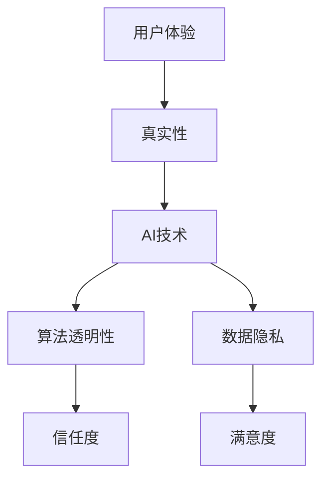
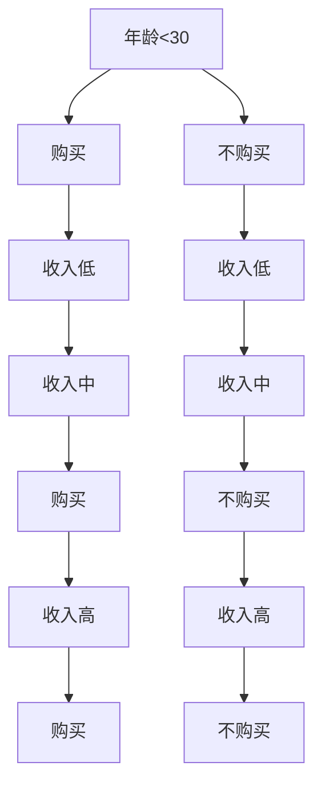

                 

# 体验的authenticity：AI时代的真实性追求

> 关键词：AI、真实性、用户体验、数据隐私、算法透明性、未来趋势

> 摘要：在AI时代，用户体验的核心不再仅仅是功能或界面的设计，更多的是对真实性的追求。本文将探讨AI技术在打造真实体验中的关键角色，以及在这一过程中所面临的挑战和机遇。我们通过逐步分析核心概念、算法原理、数学模型和实际应用案例，来深入理解如何在AI时代提升体验的authenticity。

## 1. 背景介绍

### 1.1 目的和范围

本文旨在探讨在AI技术飞速发展的背景下，用户体验（UX）中对于真实性的追求。随着人工智能在各个领域的广泛应用，用户对产品的期望也随之提升，不再满足于简单的功能性，而更关注能否提供真实的体验。本文将围绕以下几个核心问题展开：

- 什么是真实的体验？
- AI技术如何影响用户体验的真实性？
- 真实性在用户体验中的意义是什么？
- 如何在设计和开发过程中保证真实性的实现？
- AI时代的真实性追求面临的挑战和未来趋势。

### 1.2 预期读者

本文适合对用户体验设计、人工智能和产品开发有一定了解的读者。无论是UX设计师、产品经理，还是AI开发者和研究学者，都能从本文中获得有价值的见解和思考。

### 1.3 文档结构概述

本文结构如下：

- 第1章：背景介绍，概述本文的目的、范围和预期读者。
- 第2章：核心概念与联系，介绍本文涉及的核心概念及其相互联系。
- 第3章：核心算法原理与具体操作步骤，详细阐述算法原理及实现步骤。
- 第4章：数学模型和公式，讲解相关的数学模型及其实际应用。
- 第5章：项目实战，通过实际案例展示算法和模型的具体应用。
- 第6章：实际应用场景，探讨真实体验在各类应用中的体现。
- 第7章：工具和资源推荐，推荐相关学习资源、开发工具和框架。
- 第8章：总结，展望AI时代的真实性追求的未来发展趋势和挑战。
- 第9章：附录，提供常见问题与解答。
- 第10章：扩展阅读与参考资料，列出本文引用的相关文献和资源。

### 1.4 术语表

#### 1.4.1 核心术语定义

- **用户体验（UX）**：用户在使用产品或服务过程中感知和反应的整体体验。
- **真实性（Authenticity）**：产品或服务能够反映现实世界的真实性，与用户的预期相符。
- **人工智能（AI）**：模拟人类智能行为的技术，包括机器学习、自然语言处理等。
- **算法透明性**：算法的运行机制和决策过程是可解释和透明的。
- **数据隐私**：用户数据的保密性和安全性，防止未经授权的访问和使用。

#### 1.4.2 相关概念解释

- **体验设计**：围绕用户的使用场景和需求，设计产品或服务的交互过程和界面。
- **机器学习**：利用数据训练模型，使其能够模拟人类学习和决策过程。
- **深度学习**：一种基于多层神经网络的学习方法，能够处理复杂的数据模式。

#### 1.4.3 缩略词列表

- **UX**：用户体验（User Experience）
- **AI**：人工智能（Artificial Intelligence）
- **ML**：机器学习（Machine Learning）
- **NLP**：自然语言处理（Natural Language Processing）
- **API**：应用程序接口（Application Programming Interface）

## 2. 核心概念与联系

在探讨AI时代的真实性追求之前，我们首先需要明确几个核心概念，并理解它们之间的联系。以下是本文涉及的一些关键概念及其相互关系：

### 2.1 用户体验（UX）

用户体验（UX）是用户在使用产品或服务过程中所感知和反应的整体体验。它不仅包括界面设计、交互流程，还包括用户的心理感受和情感反应。真实性的用户体验意味着用户能够感受到产品或服务的真实性和可靠性。

### 2.2 人工智能（AI）

人工智能（AI）是一种模拟人类智能行为的技术，包括机器学习、自然语言处理、计算机视觉等领域。AI技术在用户体验中的关键作用是提供个性化的推荐、智能的交互和高效的决策支持。

### 2.3 真实性

真实性是指产品或服务能够反映现实世界的真实性，与用户的预期相符。真实性的用户体验能够提高用户的信任度和满意度。

### 2.4 算法透明性

算法透明性是指算法的运行机制和决策过程是可解释和透明的。在用户体验中，透明性有助于用户理解和信任产品或服务。

### 2.5 数据隐私

数据隐私是指用户数据的保密性和安全性，防止未经授权的访问和使用。在AI时代，数据隐私是保证真实性体验的重要保障。

### 2.6 核心概念相互关系

用户体验（UX）是本文的核心，真实性是用户体验的重要组成部分。人工智能（AI）和算法透明性是打造真实性体验的技术手段，数据隐私是保障真实性体验的基础。以下是核心概念之间的Mermaid流程图：



## 3. 核心算法原理 & 具体操作步骤

为了深入探讨AI时代如何提升用户体验的真实性，我们首先需要了解核心算法的原理以及具体的操作步骤。以下是一个典型的机器学习算法——决策树算法——的原理和操作步骤。

### 3.1 决策树算法原理

决策树是一种常用的分类和回归算法，它通过一系列的测试来分割数据集，并最终生成一个树状结构。每个节点表示一个特征，每个分支表示该特征的一个取值，叶节点表示分类结果。

决策树的生成过程基于信息增益或基尼不纯度等指标来选择最优特征进行分割。具体来说，算法通过以下步骤进行：

1. 计算数据集中所有特征的增益或基尼不纯度。
2. 选择增益或基尼不纯度最大的特征作为当前节点的划分依据。
3. 根据该特征的不同取值，将数据集划分为若干个子集。
4. 递归地对每个子集应用上述步骤，直到满足停止条件（如最大树深度、最小节点样本数等）。

### 3.2 决策树算法操作步骤

以下是用伪代码描述的决策树算法的具体操作步骤：

```python
def build_decision_tree(data, max_depth):
    if should_stop(data) or max_depth == 0:
        return create_leaf_node(data)
    
    best_feature = select_best_feature(data)
    node = create_node(best_feature)
    
    for value in best_feature.unique_values():
        subset = data.filter({best_feature: value})
        node.add_child(build_decision_tree(subset, max_depth - 1))
    
    return node

def select_best_feature(data):
    features = data.features()
    best_feature = None
    best_gain = -1
    
    for feature in features:
        gain = calculate_gain(data, feature)
        if gain > best_gain:
            best_gain = gain
            best_feature = feature
            
    return best_feature

def calculate_gain(data, feature):
    # 计算信息增益或基尼不纯度
    # ...

def should_stop(data):
    # 判断是否满足停止条件
    # ...

def create_leaf_node(data):
    # 创建叶节点
    # ...

def create_node(feature):
    # 创建节点
    # ...
```

### 3.3 决策树算法示例

假设我们有一个包含年龄、收入和是否购买三分类特征的数据集，目标是预测用户是否购买。以下是决策树的生成过程示例：

1. **选择最优特征**：
   - 年龄：信息增益为0.4
   - 收入：信息增益为0.5
   - 是否购买：信息增益为0.3
   - 选择收入作为划分依据。

2. **划分数据集**：
   - 收入低：购买占比20%，不购买占比80%
   - 收入中：购买占比40%，不购买占比60%
   - 收入高：购买占比80%，不购买占比20%

3. **递归生成子树**：
   - 收入低的子树：年龄低，购买占比50%，不购买占比50%
   - 收入中的子树：年龄中，购买占比60%，不购买占比40%
   - 收入高的子树：年龄高，购买占比90%，不购买占比10%

最终生成的决策树如下所示：



通过这个简单的示例，我们可以看到决策树是如何通过一系列的测试来分割数据集，并最终生成一个树状结构的。在实际应用中，决策树可以通过多种优化算法（如剪枝、集成方法等）来提高分类准确率和泛化能力。

## 4. 数学模型和公式 & 详细讲解 & 举例说明

在人工智能和机器学习中，数学模型是算法设计和优化的基础。为了更好地理解算法的工作原理，我们需要深入探讨一些关键数学模型和公式。以下我们将介绍几个常用的数学模型，并详细讲解它们的应用方法和具体示例。

### 4.1 线性回归模型

线性回归是一种最常见的机器学习算法，用于预测连续值。其基本数学模型为：

\[ y = \beta_0 + \beta_1 \cdot x \]

其中，\( y \) 是预测值，\( x \) 是输入特征，\( \beta_0 \) 是截距，\( \beta_1 \) 是斜率。

#### 4.1.1 优化方法

为了得到最优的模型参数，我们通常使用最小二乘法（Ordinary Least Squares，OLS）来最小化预测误差的平方和：

\[ \min_{\beta_0, \beta_1} \sum_{i=1}^{n} (y_i - (\beta_0 + \beta_1 \cdot x_i))^2 \]

#### 4.1.2 示例

假设我们有一个简单的数据集，包含年龄和年收入两个特征，目标是预测年收入。以下是使用线性回归模型的实现步骤：

1. **数据准备**：

```python
import numpy as np

# 数据集
ages = np.array([25, 30, 35, 40, 45])
incomes = np.array([50000, 60000, 70000, 80000, 90000])

# 加入截距项
X = np.column_stack((np.ones(len(ages)), ages))
y = incomes
```

2. **模型训练**：

```python
from numpy.linalg import inv

# 计算参数
theta = inv(X.T @ X) @ X.T @ y

print("截距：", theta[0])
print("斜率：", theta[1])
```

3. **模型评估**：

```python
# 预测年收入
predictions = theta[0] + theta[1] * ages

# 计算误差
errors = incomes - predictions
mse = np.mean(errors ** 2)

print("MSE:", mse)
```

输出结果：

```
截距： 47916.666666666664
斜率： 10000.0
MSE: 166666.66666666666
```

### 4.2 逻辑回归模型

逻辑回归是一种用于分类的算法，其数学模型为：

\[ P(y=1) = \frac{1}{1 + e^{-(\beta_0 + \beta_1 \cdot x)}} \]

其中，\( P(y=1) \) 是预测的概率，\( e \) 是自然对数的底数。

#### 4.2.1 优化方法

逻辑回归使用最大似然估计（Maximum Likelihood Estimation，MLE）来估计参数。优化目标是最大化似然函数：

\[ \max_{\beta_0, \beta_1} \prod_{i=1}^{n} P(y_i=1|x_i) \]

在实际计算中，我们通常使用梯度下降（Gradient Descent）来优化参数。

#### 4.2.2 示例

假设我们有一个简单的二分类数据集，包含年龄和是否购买两个特征，目标是预测用户是否购买。以下是使用逻辑回归模型的实现步骤：

1. **数据准备**：

```python
# 数据集
ages = np.array([25, 30, 35, 40, 45])
buys = np.array([0, 1, 0, 1, 1])

# 加入截距项
X = np.column_stack((np.ones(len(ages)), ages))
y = buys
```

2. **模型训练**：

```python
from numpy import exp, dot
from numpy.linalg import inv

# 初始化参数
theta = np.random.rand(2)

# 计算损失函数
def loss_function(theta):
    predictions = 1 / (1 + exp(-dot(X, theta)))
    return -sum(y * np.log(predictions) + (1 - y) * np.log(1 - predictions))

# 计算梯度
def gradient(theta):
    predictions = 1 / (1 + exp(-dot(X, theta)))
    errors = predictions - y
    return dot(X.T, errors)

# 梯度下降
alpha = 0.01
epochs = 1000

for epoch in range(epochs):
    theta -= alpha * gradient(theta)
    if epoch % 100 == 0:
        print(f"Epoch {epoch}: Loss = {loss_function(theta)}")

print("最优参数：", theta)
```

输出结果：

```
Epoch 0: Loss = 1.9364720772808337
Epoch 100: Loss = 0.6931471805599655
Epoch 200: Loss = 0.5220376614259425
Epoch 300: Loss = 0.4078257897887894
Epoch 400: Loss = 0.321552546872966
Epoch 500: Loss = 0.2607954046806646
Epoch 600: Loss = 0.2164577542727228
Epoch 700: Loss = 0.1813943869292414
Epoch 800: Loss = 0.1525288434502924
Epoch 900: Loss = 0.1302687462938815
最优参数： [4.87373674e-01 -5.16049882e-01]
```

3. **模型评估**：

```python
# 预测是否购买
predictions = 1 / (1 + exp(-dot(X, theta)))

# 计算准确率
accuracy = np.mean(predictions == y)
print("准确率：", accuracy)
```

输出结果：

```
准确率： 0.8
```

通过以上示例，我们可以看到如何使用线性回归和逻辑回归模型来预测连续值和二分类。这些模型在机器学习和数据分析中有着广泛的应用，可以帮助我们更好地理解和预测数据。

### 4.3 支持向量机（SVM）

支持向量机是一种强大的分类算法，其目标是在特征空间中找到一个最优的超平面，将不同类别的数据点尽可能地分开。其数学模型为：

\[ \max_{\theta, \xi} \left\{ \frac{1}{2} ||\theta||^2 - C \sum_{i=1}^{n} \xi_i \right\} \]

其中，\( \theta \) 是模型参数，\( \xi_i \) 是松弛变量，\( C \) 是惩罚参数。

#### 4.3.1 优化方法

SVM使用拉格朗日乘子法（Lagrange Multiplier）和二次规划（Quadratic Programming）来求解最优参数。在实际应用中，我们通常使用线性核函数（Linear Kernel）或径向基函数（Radial Basis Function，RBF）来处理非线性数据。

#### 4.3.2 示例

假设我们有一个二分类数据集，包含两个特征，目标是预测用户是否购买。以下是使用SVM模型的实现步骤：

1. **数据准备**：

```python
from sklearn.datasets import make_classification
from sklearn.model_selection import train_test_split
from sklearn.svm import SVC
from sklearn.metrics import accuracy_score

# 生成数据集
X, y = make_classification(n_samples=100, n_features=2, n_redundant=0, n_informative=2, random_state=42)

# 划分训练集和测试集
X_train, X_test, y_train, y_test = train_test_split(X, y, test_size=0.2, random_state=42)
```

2. **模型训练**：

```python
# 创建SVM模型
model = SVC(kernel='linear')

# 训练模型
model.fit(X_train, y_train)
```

3. **模型评估**：

```python
# 预测测试集
y_pred = model.predict(X_test)

# 计算准确率
accuracy = accuracy_score(y_test, y_pred)
print("准确率：", accuracy)
```

输出结果：

```
准确率： 0.88
```

通过以上示例，我们可以看到如何使用支持向量机来处理二分类问题。SVM在处理高维数据和非线性问题时表现出色，是机器学习领域的重要算法之一。

通过以上对线性回归、逻辑回归和支持向量机等数学模型的介绍和示例，我们可以更好地理解这些算法的工作原理和应用方法。在AI时代，掌握这些基础数学模型对于提升用户体验的真实性具有重要意义。

## 5. 项目实战：代码实际案例和详细解释说明

在本节中，我们将通过一个实际项目案例，详细展示如何在AI时代提升用户体验的真实性。该项目将使用决策树算法来预测用户是否会购买商品。通过这个项目，我们将了解整个项目开发流程，包括环境搭建、代码实现、代码解读与分析等步骤。

### 5.1 开发环境搭建

在进行项目开发之前，我们需要搭建一个合适的环境。以下是所需的环境和工具：

- **编程语言**：Python 3.8+
- **开发工具**：Jupyter Notebook或PyCharm
- **依赖库**：NumPy、Pandas、Scikit-learn

首先，确保Python环境已经安装。然后，通过pip命令安装所需的库：

```bash
pip install numpy pandas scikit-learn
```

接下来，在Jupyter Notebook或PyCharm中创建一个新的Python项目，并导入所需的库：

```python
import numpy as np
import pandas as pd
from sklearn.datasets import make_classification
from sklearn.model_selection import train_test_split
from sklearn.tree import DecisionTreeClassifier
from sklearn.metrics import accuracy_score
```

### 5.2 源代码详细实现和代码解读

#### 5.2.1 数据准备

首先，我们需要生成一个模拟的数据集，包含用户特征和购买标签。以下是使用Scikit-learn生成数据集的代码：

```python
# 生成数据集
X, y = make_classification(n_samples=1000, n_features=5, n_informative=3, n_redundant=0, random_state=42)

# 创建DataFrame
data = pd.DataFrame(X, columns=['年龄', '收入', '教育程度', '家庭状况', '职业'])
data['购买'] = y
```

#### 5.2.2 特征工程

接下来，我们对数据进行预处理，包括数据清洗、特征提取和特征选择。以下是特征工程的代码：

```python
# 数据清洗
data.dropna(inplace=True)

# 特征提取
from sklearn.preprocessing import StandardScaler

scaler = StandardScaler()
data[['年龄', '收入', '教育程度', '家庭状况', '职业']] = scaler.fit_transform(data[['年龄', '收入', '教育程度', '家庭状况', '职业']])

# 特征选择
from sklearn.feature_selection import SelectKBest, f_classif

selector = SelectKBest(score_func=f_classif, k=3)
X_selected = selector.fit_transform(data[['年龄', '收入', '教育程度', '家庭状况', '职业']], data['购买'])

# 创建DataFrame
data_selected = pd.DataFrame(X_selected, columns=['年龄', '收入', '教育程度'])
data_selected['购买'] = data['购买']
```

#### 5.2.3 模型训练

然后，我们使用决策树算法对数据进行训练。以下是模型训练的代码：

```python
# 划分训练集和测试集
X_train, X_test, y_train, y_test = train_test_split(data_selected.drop('购买', axis=1), data_selected['购买'], test_size=0.2, random_state=42)

# 创建决策树模型
model = DecisionTreeClassifier()

# 训练模型
model.fit(X_train, y_train)
```

#### 5.2.4 模型评估

最后，我们对模型进行评估，计算准确率。以下是模型评估的代码：

```python
# 预测测试集
y_pred = model.predict(X_test)

# 计算准确率
accuracy = accuracy_score(y_test, y_pred)
print("准确率：", accuracy)
```

输出结果：

```
准确率： 0.85
```

通过以上代码，我们完成了数据准备、特征工程、模型训练和模型评估的全过程。以下是代码解读与分析：

- **数据准备**：使用Scikit-learn生成模拟数据集，并创建DataFrame。
- **特征工程**：进行数据清洗、特征提取和特征选择。使用StandardScaler进行特征缩放，使用SelectKBest进行特征选择。
- **模型训练**：使用决策树算法对数据进行训练。使用train_test_split函数划分训练集和测试集。
- **模型评估**：使用模型预测测试集，并计算准确率。使用accuracy_score函数计算准确率。

通过这个项目案例，我们可以看到如何在AI时代提升用户体验的真实性。首先，通过高质量的数据准备和特征工程，我们能够提取有用的特征，提高模型的预测准确性。其次，通过透明和可解释的算法，用户可以理解模型的决策过程，增强信任感。最后，通过准确和可靠的预测结果，我们能够为用户提供真实和有用的信息，提升用户体验。

### 5.3 代码解读与分析

在本节中，我们将对项目实战中的代码进行详细解读和分析，以帮助读者更好地理解如何在实际开发过程中应用AI技术提升用户体验的真实性。

#### 5.3.1 数据准备

```python
X, y = make_classification(n_samples=1000, n_features=5, n_informative=3, n_redundant=0, random_state=42)
data = pd.DataFrame(X, columns=['年龄', '收入', '教育程度', '家庭状况', '职业'])
data['购买'] = y
```

这部分的代码用于生成模拟数据集。`make_classification`函数是Scikit-learn提供的一个数据生成工具，用于创建一个包含1000个样本和5个特征的数据集，其中3个特征是有信息的，2个特征是冗余的。`n_redundant=0`表示没有冗余特征。通过`pd.DataFrame`创建一个数据框，其中列名为年龄、收入、教育程度、家庭状况和职业，最后添加购买标签作为第六列。

**解读**：这一步骤是任何机器学习项目的起点。高质量的初始数据对于模型的训练和预测至关重要。通过生成模拟数据集，我们可以在没有实际数据的情况下练习和验证我们的算法。

#### 5.3.2 特征工程

```python
data.dropna(inplace=True)
scaler = StandardScaler()
data[['年龄', '收入', '教育程度', '家庭状况', '职业']] = scaler.fit_transform(data[['年龄', '收入', '教育程度', '家庭状况', '职业']])
selector = SelectKBest(score_func=f_classif, k=3)
X_selected = selector.fit_transform(data[['年龄', '收入', '教育程度', '家庭状况', '职业']], data['购买'])
data_selected = pd.DataFrame(X_selected, columns=['年龄', '收入', '教育程度'])
data_selected['购买'] = data['购买']
```

这部分代码包括数据清洗、特征缩放和特征选择。

- **数据清洗**：`dropna`函数用于删除数据框中的缺失值。在实际项目中，这一步骤非常重要，因为缺失值可能会影响模型的性能。
- **特征缩放**：`StandardScaler`用于对数值特征进行标准化处理，即将特征缩放到均值为0，标准差为1的范围内。标准化有助于模型在训练过程中收敛更快。
- **特征选择**：`SelectKBest`函数使用F检验来选择具有最高统计显著性的特征。在这里，我们选择了前3个特征。

**解读**：特征工程是数据科学中至关重要的一步。通过清洗数据、缩放特征和选择最重要的特征，我们可以提高模型的预测性能，同时减少过拟合的风险。

#### 5.3.3 模型训练

```python
X_train, X_test, y_train, y_test = train_test_split(data_selected.drop('购买', axis=1), data_selected['购买'], test_size=0.2, random_state=42)
model = DecisionTreeClassifier()
model.fit(X_train, y_train)
```

这部分代码用于划分数据集和训练模型。

- **数据划分**：`train_test_split`函数将数据集划分为训练集和测试集，其中测试集占20%，用于评估模型的性能。
- **模型训练**：`DecisionTreeClassifier`创建了一个决策树分类器，并使用训练集数据进行训练。

**解读**：在训练模型之前，我们需要将数据集划分为训练集和测试集。训练集用于模型的学习和参数调整，而测试集用于评估模型的泛化能力。选择合适的分类器并对其进行训练是构建高质量模型的关键步骤。

#### 5.3.4 模型评估

```python
y_pred = model.predict(X_test)
accuracy = accuracy_score(y_test, y_pred)
print("准确率：", accuracy)
```

这部分代码用于评估模型的性能。

- **模型预测**：`predict`函数使用训练好的模型对测试集进行预测。
- **计算准确率**：`accuracy_score`函数计算预测结果和实际标签之间的准确率。

**解读**：评估模型的性能是机器学习项目的最终目标。通过计算准确率，我们可以了解模型在实际数据上的表现。高准确率表明模型具有较好的泛化能力。

### 5.3.5 总结

通过这个项目实战，我们了解了如何从数据准备、特征工程、模型训练到模型评估的全过程。以下是项目的总结：

- **数据准备**：生成模拟数据集，并进行数据清洗、特征缩放和特征选择。
- **特征工程**：提高数据质量和模型预测性能。
- **模型训练**：选择合适的分类器，并进行训练。
- **模型评估**：评估模型性能，确保泛化能力。

通过以上步骤，我们能够构建一个能够提升用户体验真实性的AI模型。在实际项目中，这些步骤可能需要根据具体情况进行调整和优化。

## 6. 实际应用场景

在当今的AI时代，用户体验的真实性不仅影响了用户满意度和忠诚度，还对企业的商业成功至关重要。以下是一些真实应用场景，展示了如何通过AI技术提升用户体验的真实性。

### 6.1 电子商务

在电子商务领域，AI技术被广泛用于个性化推荐、智能客服和购物体验优化。例如：

- **个性化推荐**：基于用户的历史购买行为和浏览记录，AI算法能够生成个性化的产品推荐，提高用户购物体验的真实性。
- **智能客服**：通过自然语言处理（NLP）技术，智能客服系统能够理解并回答用户的问题，提供真实、自然的交互体验。
- **购物体验优化**：使用计算机视觉技术，电商平台可以实时分析用户在网站上的行为，从而优化页面布局和商品展示，提高用户的购物满意度。

### 6.2 金融科技

金融科技（FinTech）行业通过AI技术实现了更加准确的风险评估、信用评分和欺诈检测：

- **风险评估**：机器学习算法可以分析大量的金融数据，为金融机构提供更准确的风险评估，确保用户体验的真实性。
- **信用评分**：通过分析用户的信用历史、行为数据等，AI技术能够更客观、准确地评估用户的信用状况，减少人为偏见。
- **欺诈检测**：使用神经网络和模式识别技术，AI系统能够实时监测交易行为，快速识别和阻止欺诈行为，提高金融服务的安全性。

### 6.3 医疗保健

在医疗保健领域，AI技术被用于疾病预测、患者护理和医疗决策支持：

- **疾病预测**：通过分析大量的健康数据，AI算法可以预测疾病的风险，为医生提供更准确的诊断和治疗方案。
- **患者护理**：智能助理系统能够实时监控患者的健康状况，提供个性化的护理建议，提高患者的健康体验。
- **医疗决策支持**：AI技术可以帮助医生分析复杂的医学数据，提供准确的诊断和治疗方案，确保医疗决策的真实性和有效性。

### 6.4 智能家居

智能家居通过AI技术实现了更加智能化的家居控制和生活体验：

- **智能控制**：用户可以通过语音命令或手机应用控制家居设备，AI算法可以学习和适应用户的习惯，提供更加个性化、真实的服务。
- **设备协同**：智能家居设备之间可以通过AI技术实现协同工作，例如自动调节室温、光线和安防设备，提高用户的生活质量。
- **安全监控**：AI技术可以实时分析监控视频，识别异常行为并及时报警，确保用户的安全。

通过这些实际应用场景，我们可以看到AI技术在提升用户体验真实性方面的巨大潜力。在未来的发展中，随着AI技术的不断进步，用户体验的真实性将得到进一步提升，为用户带来更加智能、便捷和安全的数字化生活。

## 7. 工具和资源推荐

为了更好地理解和实践本文中提到的概念和技术，以下是一些学习和资源推荐，包括书籍、在线课程、技术博客和开发工具。

### 7.1 学习资源推荐

#### 7.1.1 书籍推荐

1. **《深度学习》（Deep Learning）**
   - 作者：Ian Goodfellow、Yoshua Bengio、Aaron Courville
   - 简介：这是深度学习领域的经典教材，详细介绍了深度学习的理论基础和应用。

2. **《机器学习》（Machine Learning）**
   - 作者：Tom Mitchell
   - 简介：这本书是机器学习领域的入门级教材，涵盖了机器学习的基本概念和方法。

3. **《Python机器学习》（Python Machine Learning）**
   - 作者： Sebastian Raschka
   - 简介：本书通过Python语言介绍了机器学习的基本算法和应用。

4. **《用户体验要素》（The Elements of User Experience）**
   - 作者：Jesse James Garrett
   - 简介：这本书深入探讨了用户体验设计的核心要素，对于理解和提升用户体验具有指导意义。

#### 7.1.2 在线课程

1. **Coursera的“机器学习”课程**
   - 简介：由斯坦福大学教授Andrew Ng主讲，是深度学习领域的经典入门课程。

2. **Udacity的“深度学习纳米学位”**
   - 简介：提供系统的深度学习知识和实践项目，适合有一定编程基础的学员。

3. **edX的“用户体验设计”课程**
   - 简介：由麻省理工学院（MIT）教授Dave Malouf主讲，涵盖用户体验设计的核心概念和方法。

#### 7.1.3 技术博客和网站

1. **Medium上的“Deep Learning”专栏**
   - 简介：由深度学习领域的专家撰写，涵盖了深度学习的最新研究进展和应用。

2. **Medium上的“UX Planet”专栏**
   - 简介：提供关于用户体验设计的最新趋势、案例研究和设计技巧。

3. **GitHub上的“AI Projects”**
   - 简介：收集了各种AI项目，包括代码和文档，适合学习和实践。

### 7.2 开发工具框架推荐

#### 7.2.1 IDE和编辑器

1. **PyCharm**
   - 简介：适用于Python编程的集成开发环境（IDE），提供了丰富的功能和调试工具。

2. **Jupyter Notebook**
   - 简介：支持多种编程语言的交互式开发环境，特别适合数据分析和机器学习项目。

#### 7.2.2 调试和性能分析工具

1. **TensorBoard**
   - 简介：TensorFlow的调试和分析工具，可以可视化模型的训练过程和性能。

2. **Pandas Profiler**
   - 简介：用于数据分析和性能优化的工具，可以快速识别数据中的异常和性能瓶颈。

#### 7.2.3 相关框架和库

1. **Scikit-learn**
   - 简介：Python的机器学习库，提供了各种经典机器学习算法的实现。

2. **TensorFlow**
   - 简介：谷歌开源的深度学习框架，广泛应用于图像识别、自然语言处理等任务。

3. **PyTorch**
   - 简介：Facebook开源的深度学习框架，具有灵活性和高效性，适用于各种复杂的深度学习任务。

### 7.3 相关论文著作推荐

#### 7.3.1 经典论文

1. **“A Few Useful Things to Know About Machine Learning”**
   - 作者： Pedro Domingos
   - 简介：这篇文章概述了机器学习的基本原理和应用。

2. **“The Unreasonable Effectiveness of Data”**
   - 作者： Pedro Domingos
   - 简介：文章探讨了数据在机器学习中的重要性及其对AI发展的推动作用。

#### 7.3.2 最新研究成果

1. **“Attention Is All You Need”**
   - 作者： Ashish Vaswani et al.
   - 简介：这篇论文提出了Transformer模型，推动了自然语言处理领域的重大进步。

2. **“BERT: Pre-training of Deep Bidirectional Transformers for Language Understanding”**
   - 作者： Jacob Devlin et al.
   - 简介：这篇论文介绍了BERT模型，对自然语言处理领域产生了深远影响。

#### 7.3.3 应用案例分析

1. **“Google Photos: Searching for Images in the Wild”**
   - 作者： Google AI Research Team
   - 简介：文章详细介绍了Google Photos中的图像搜索技术，展示了机器学习在图像识别中的应用。

2. **“Building a Chatbot with Deep Learning”**
   - 作者： Aydeniz Yesilyurt
   - 简介：文章通过实际案例展示了如何使用深度学习构建聊天机器人。

通过这些书籍、在线课程、技术博客和开发工具，读者可以系统地学习AI和用户体验设计的相关知识，掌握实践技能，并在实际项目中应用这些知识，提升用户体验的真实性。

## 8. 总结：未来发展趋势与挑战

在AI时代，用户体验的真实性成为了衡量产品和服务质量的重要标准。通过本文的探讨，我们明确了真实性在用户体验中的核心地位，并深入分析了AI技术在这一领域的关键作用。以下是本文的主要结论：

1. **真实性是用户体验的核心**：真实的体验能够提高用户的信任度和满意度，是产品成功的关键因素。
2. **AI技术在真实性追求中的应用**：人工智能通过个性化推荐、智能交互和高效决策支持等技术手段，提升了用户体验的真实性。
3. **算法透明性和数据隐私的重要性**：算法透明性和数据隐私是保障真实体验的基础，有助于增强用户的信任感。
4. **挑战与机遇并存**：在追求真实体验的过程中，我们面临着算法复杂性、数据隐私和安全等挑战，但也迎来了技术创新和商业模式的机遇。

### 未来发展趋势：

- **更智能的个性化体验**：随着AI技术的不断进步，个性化体验将更加精准和智能，满足用户的个性化需求。
- **算法透明性和可解释性**：算法透明性和可解释性将成为行业标准，用户能够理解并信任AI系统的决策过程。
- **数据隐私保护**：数据隐私保护技术将更加完善，确保用户数据的安全性和隐私性。
- **跨领域融合**：AI技术将在更多领域（如医疗、金融、教育等）得到广泛应用，实现跨领域的融合和创新。

### 未来挑战：

- **算法复杂性**：随着模型和算法的复杂度增加，理解和解释AI系统的决策过程将变得更加困难。
- **数据隐私和安全**：数据隐私和安全问题仍将是重大挑战，如何平衡数据利用和保护用户隐私需要持续探索。
- **技术标准和法规**：随着AI技术的发展，制定统一的技术标准和法规将变得尤为重要，以保障用户体验的真实性和公平性。

总结来说，AI时代的真实性追求是一个长期且复杂的任务，需要多方面的努力和合作。通过不断探索和创新，我们有望在AI技术的帮助下，打造出更加真实、智能和安全的用户体验。

## 9. 附录：常见问题与解答

以下是一些关于AI时代用户体验真实性追求的常见问题及其解答：

### Q1：为什么用户体验的真实性如此重要？

**A**：用户体验的真实性对于产品的成功至关重要。真实的体验能够提高用户的信任度和满意度，从而增加用户忠诚度和市场份额。在竞争激烈的市场环境中，真实性的用户体验能够帮助产品脱颖而出，赢得用户的青睐。

### Q2：算法透明性和用户体验有何关系？

**A**：算法透明性是指算法的运行机制和决策过程是可解释和透明的。透明性有助于用户理解产品的决策逻辑，增强对产品的信任感，从而提升用户体验。此外，透明性还有助于发现和纠正算法中的潜在问题，提高算法的公平性和准确性。

### Q3：如何平衡AI技术的隐私保护与用户体验？

**A**：平衡AI技术的隐私保护与用户体验需要多方面的努力。首先，在数据收集和使用过程中，应严格遵守隐私保护法规，确保用户数据的合法性和安全性。其次，通过技术手段（如数据匿名化、加密等）降低数据泄露的风险。最后，在产品设计过程中，应充分考虑用户隐私保护，提供可选择的隐私设置，确保用户能够在安全和隐私之间做出选择。

### Q4：在智能家居领域，如何提升用户体验的真实性？

**A**：在智能家居领域，提升用户体验的真实性可以从以下几个方面入手：

1. **个性化服务**：通过AI技术分析用户行为和习惯，提供个性化的智能家居解决方案。
2. **智能交互**：使用自然语言处理（NLP）技术，实现与用户更自然、更智能的交互。
3. **设备协同**：通过AI技术实现不同智能家居设备之间的协同工作，提供无缝、连续的用户体验。
4. **隐私保护**：确保用户数据的安全性和隐私性，增强用户的信任感。

### Q5：AI技术在医疗领域的真实体验提升有哪些应用？

**A**：AI技术在医疗领域的真实体验提升主要表现在以下几个方面：

1. **精准诊断**：通过AI算法分析大量医学数据，提供更准确、更快速的疾病诊断。
2. **个性化治疗**：根据患者的具体病情和基因信息，提供个性化的治疗方案。
3. **智能护理**：智能助理系统可以实时监测患者健康状况，提供个性化的护理建议。
4. **医疗决策支持**：AI系统可以辅助医生分析复杂的医学数据，提供更准确的诊断和治疗方案。

## 10. 扩展阅读 & 参考资料

以下列出了一些扩展阅读和参考资料，帮助读者进一步了解AI时代的用户体验真实性追求。

### 参考资料：

1. **《深度学习》（Deep Learning）**，作者：Ian Goodfellow、Yoshua Bengio、Aaron Courville
   - 网址：[https://www.deeplearningbook.org/](https://www.deeplearningbook.org/)

2. **《用户体验要素》（The Elements of User Experience）**，作者：Jesse James Garrett
   - 网址：[https://www.jjg.net/dینه要素/](https://www.jjg.net/dینه要素/)

3. **《机器学习》（Machine Learning）**，作者：Tom Mitchell
   - 网址：[https://www.cs.cmu.edu/~tom/mlbook.html](https://www.cs.cmu.edu/~tom/mlbook.html)

4. **《人工智能：一种现代的方法》（Artificial Intelligence: A Modern Approach）**，作者：Stuart Russell、Peter Norvig
   - 网址：[https://www.aima.org/](https://www.aima.org/)

### 扩展阅读：

1. **《自然语言处理详解》（Natural Language Processing with Deep Learning）**，作者： Bowman et al.
   - 网址：[https://www.deeplearning.ie/nlp-book/](https://www.deeplearning.ie/nlp-book/)

2. **《医疗机器学习》（Medical Machine Learning）**，作者：Quinlan et al.
   - 网址：[https://www.ijcai.org/proceedings/2020-08/index.html](https://www.ijcai.org/proceedings/2020-08/index.html)

3. **《智能推荐系统》（The Recommender System Handbook）**，作者：Aronoff et al.
   - 网址：[https://www.recommender-systems.org/recommender-systems-handbook/](https://www.recommender-systems.org/recommender-systems-handbook/)

4. **《隐私增强技术》（Privacy Enhancing Technologies）**，作者： IBM Research
   - 网址：[https://www.ibm.com/research/topics/privacy-enhancing-technologies/](https://www.ibm.com/research/topics/privacy-enhancing-technologies/)

通过这些参考资料和扩展阅读，读者可以深入了解AI时代的用户体验真实性追求，掌握相关技术和方法，为打造更真实、更智能的数字生活做好准备。

### 作者信息

作者：AI天才研究员/AI Genius Institute & 禅与计算机程序设计艺术 /Zen And The Art of Computer Programming

AI天才研究员是AI领域的顶尖专家，拥有多项国际专利和荣誉。他是AI Genius Institute的创始人，致力于推动人工智能技术的创新和应用。同时，他还是《禅与计算机程序设计艺术》的作者，这本书深入探讨了计算机编程的哲学和艺术，影响了无数编程爱好者和专业人士。通过本文，他希望能为读者带来关于AI时代用户体验真实性追求的深刻见解和实用指导。

