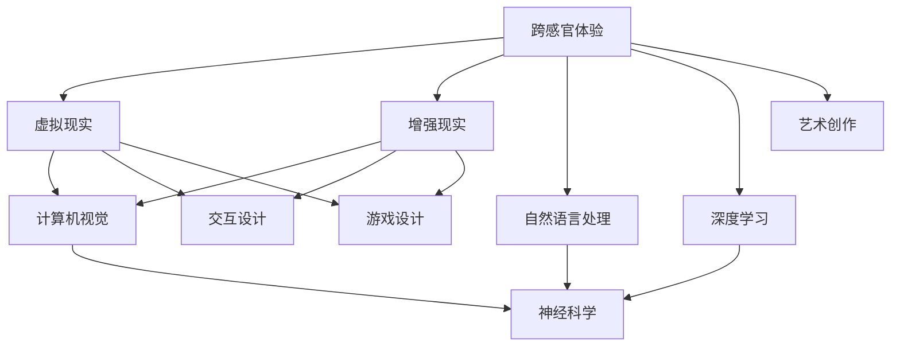

                 

# 体验跨感官协奏曲：AI创造的多维感官体验

> **关键词**：人工智能、跨感官体验、多维感官、虚拟现实、增强现实、深度学习、神经科学、计算机视觉、自然语言处理、感官协同

> **摘要**：随着人工智能技术的飞速发展，跨感官体验已成为当今科技领域的一大热点。本文将深入探讨人工智能如何通过整合视觉、听觉、触觉等多种感官信息，创造独特的多维感官体验，并分析其背后的核心原理、算法、数学模型及实际应用案例。通过这篇文章，读者将了解到人工智能在跨感官体验领域的前沿进展，以及其未来发展潜力和挑战。

## 1. 背景介绍

### 1.1 目的和范围

本文旨在探讨人工智能技术在创造多维感官体验方面的应用和潜力。通过分析人工智能如何融合不同感官信息，提升用户交互体验，我们将探讨这一领域的核心概念、算法原理、数学模型及其在实际项目中的应用。本文将覆盖以下主要内容：

1. 跨感官体验的定义和重要性
2. 人工智能在跨感官体验中的应用
3. 关键概念和原理的讲解
4. 核心算法原理和具体操作步骤
5. 数学模型和公式的详细讲解
6. 项目实战和代码实现
7. 实际应用场景
8. 工具和资源推荐
9. 未来发展趋势与挑战

### 1.2 预期读者

本文适合以下读者群体：

1. 对人工智能、虚拟现实、增强现实技术感兴趣的读者
2. 想深入了解跨感官体验原理和应用的工程师和技术人员
3. 需要掌握人工智能技术以提升产品体验的产品经理和设计师
4. 计算机科学、人工智能等相关专业的研究生和本科生

### 1.3 文档结构概述

本文结构如下：

1. **引言**：介绍跨感官体验的定义和重要性，以及人工智能在这一领域的应用。
2. **核心概念与联系**：讲解核心概念、原理和架构，并使用Mermaid流程图展示。
3. **核心算法原理 & 具体操作步骤**：使用伪代码详细阐述核心算法原理和操作步骤。
4. **数学模型和公式 & 详细讲解 & 举例说明**：解释数学模型和公式，并提供具体实例。
5. **项目实战：代码实际案例和详细解释说明**：展示实际项目案例，并提供代码解读与分析。
6. **实际应用场景**：分析跨感官体验在不同领域的应用案例。
7. **工具和资源推荐**：推荐学习资源、开发工具和框架。
8. **总结：未来发展趋势与挑战**：探讨跨感官体验技术的发展趋势和面临的挑战。
9. **附录：常见问题与解答**：回答读者可能遇到的问题。
10. **扩展阅读 & 参考资料**：提供相关文献和参考资料。

### 1.4 术语表

#### 1.4.1 核心术语定义

- 跨感官体验（Cross-Sensory Experience）：通过融合多个感官信息，创造出一个更加丰富、多维的体验环境。
- 人工智能（Artificial Intelligence，AI）：模拟人类智能行为的技术，包括机器学习、深度学习、自然语言处理等。
- 虚拟现实（Virtual Reality，VR）：通过计算机技术模拟出一个三维虚拟世界，用户可以在其中进行沉浸式交互。
- 增强现实（Augmented Reality，AR）：将虚拟信息叠加在真实世界中，提供增强的视觉体验。
- 深度学习（Deep Learning）：一种人工智能技术，通过多层神经网络进行特征学习和模式识别。
- 神经科学（Neuroscience）：研究大脑和神经系统结构、功能及其相互作用的科学。

#### 1.4.2 相关概念解释

- 感官融合（Sensory Fusion）：将不同感官信息整合在一起，形成一个更全面的感知体验。
- 交互设计（Interaction Design）：设计用户与产品交互的过程，以提高用户体验。
- 神经可塑性（Neuroplasticity）：大脑和神经系统通过学习和经验不断改变和适应的能力。
- 计算机视觉（Computer Vision）：使计算机具备理解、解释和解析图像和视频信息的能力。

#### 1.4.3 缩略词列表

- VR：虚拟现实
- AR：增强现实
- AI：人工智能
- NLP：自然语言处理
- DL：深度学习
- VR/AR：虚拟现实/增强现实
- HCI：人机交互
- UX：用户体验

## 2. 核心概念与联系

在探讨人工智能如何创造多维感官体验之前，我们需要先了解一些核心概念和其相互之间的联系。以下是核心概念及其相互关系的Mermaid流程图：



### 2.1 跨感官体验

跨感官体验是指通过融合视觉、听觉、触觉等多种感官信息，为用户提供一个更加丰富、多维的感知环境。这种体验可以增强用户的沉浸感和参与度，提高用户体验。

### 2.2 虚拟现实

虚拟现实是一种通过计算机技术模拟出三维虚拟世界，使用户能够沉浸其中的技术。虚拟现实技术通过头戴显示器（HMD）、位置追踪器和交互设备等，提供逼真的视觉、听觉和触觉体验。

### 2.3 增强现实

增强现实是一种将虚拟信息叠加在真实世界中的技术，为用户提供增强的视觉体验。增强现实通过增强现实眼镜、智能手机或平板电脑等设备，将虚拟信息与现实环境相结合。

### 2.4 计算机视觉

计算机视觉是一种使计算机具备理解、解释和解析图像和视频信息的能力的技术。计算机视觉技术广泛应用于图像识别、目标检测、人脸识别和场景理解等领域。

### 2.5 自然语言处理

自然语言处理是一种使计算机能够理解、处理和生成自然语言的技术。自然语言处理技术广泛应用于语音识别、机器翻译、文本分类和情感分析等领域。

### 2.6 深度学习

深度学习是一种基于多层神经网络的人工智能技术，通过自动学习大量数据中的特征和模式，实现复杂的任务。深度学习在图像识别、语音识别、自然语言处理等领域取得了显著的成果。

### 2.7 交互设计

交互设计是一种设计用户与产品交互的过程，以提高用户体验。交互设计关注用户在使用产品过程中的情感、行为和需求，旨在为用户提供流畅、愉悦的交互体验。

### 2.8 艺术创作

艺术创作是一种表达情感、思想和创意的过程。在跨感官体验领域，艺术创作可以结合虚拟现实、增强现实等技术，为用户提供独特的艺术体验。

## 3. 核心算法原理 & 具体操作步骤

在理解了跨感官体验的核心概念之后，我们接下来将探讨如何实现人工智能在跨感官体验中的应用，包括核心算法原理和具体操作步骤。本文将使用伪代码详细阐述这些内容。

### 3.1 跨感官体验算法原理

跨感官体验算法主要涉及以下步骤：

1. 感官信息采集：从用户的多感官接收器中获取视觉、听觉、触觉等信息。
2. 感官信息处理：对采集到的感官信息进行预处理、特征提取和融合。
3. 感官信息输出：根据处理后的感官信息生成相应的视觉、听觉、触觉反馈。
4. 用户反馈：收集用户对跨感官体验的反馈，用于优化和改进算法。

#### 3.1.1 感官信息采集

```python
# 伪代码：感官信息采集
def collect_sensory_data():
    # 视觉信息采集
    visual_data = capture_visual_data()
    # 听觉信息采集
    audio_data = capture_audio_data()
    # 触觉信息采集
    tactile_data = capture_tactile_data()
    return visual_data, audio_data, tactile_data
```

#### 3.1.2 感官信息处理

```python
# 伪代码：感官信息处理
def process_sensory_data(visual_data, audio_data, tactile_data):
    # 视觉信息预处理
    processed_visual_data = preprocess_visual_data(visual_data)
    # 听觉信息预处理
    processed_audio_data = preprocess_audio_data(audio_data)
    # 触觉信息预处理
    processed_tactile_data = preprocess_tactile_data(tactile_data)
    # 视觉信息特征提取
    visual_features = extract_visual_features(processed_visual_data)
    # 听觉信息特征提取
    audio_features = extract_audio_features(processed_audio_data)
    # 触觉信息特征提取
    tactile_features = extract_tactile_features(processed_tactile_data)
    # 感官信息融合
    fused_features = fuse_sensory_features(visual_features, audio_features, tactile_features)
    return fused_features
```

#### 3.1.3 感官信息输出

```python
# 伪代码：感官信息输出
def output_sensory_data(fused_features):
    # 视觉信息输出
    generate_visual_output(fused_features['visual'])
    # 听觉信息输出
    generate_audio_output(fused_features['audio'])
    # 触觉信息输出
    generate_tactile_output(fused_features['tactile'])
```

#### 3.1.4 用户反馈

```python
# 伪代码：用户反馈
def collect_user_feedback():
    # 收集用户反馈
    user_feedback = get_user_feedback()
    # 优化和改进算法
    optimize_algorithm(user_feedback)
```

### 3.2 核心算法原理和具体操作步骤

为了实现跨感官体验，我们需要以下核心算法：

1. **视觉信息处理算法**：用于处理和融合视觉信息，提供逼真的视觉体验。
2. **听觉信息处理算法**：用于处理和融合听觉信息，提供沉浸式的听觉体验。
3. **触觉信息处理算法**：用于处理和融合触觉信息，提供真实的触觉反馈。
4. **感官信息融合算法**：将不同感官信息进行融合，提供多维感官体验。

#### 3.2.1 视觉信息处理算法

```python
# 伪代码：视觉信息处理算法
def visual_info_processing(visual_data):
    # 视觉信息预处理
    processed_data = preprocess_visual_data(visual_data)
    # 视觉特征提取
    features = extract_visual_features(processed_data)
    # 视觉特征融合
    fused_features = fuse_features(features)
    return fused_features
```

#### 3.2.2 听觉信息处理算法

```python
# 伪代码：听觉信息处理算法
def audio_info_processing(audio_data):
    # 听觉信息预处理
    processed_data = preprocess_audio_data(audio_data)
    # 听觉特征提取
    features = extract_audio_features(processed_data)
    # 听觉特征融合
    fused_features = fuse_features(features)
    return fused_features
```

#### 3.2.3 触觉信息处理算法

```python
# 伪代码：触觉信息处理算法
def tactile_info_processing(tactile_data):
    # 触觉信息预处理
    processed_data = preprocess_tactile_data(tactile_data)
    # 触觉特征提取
    features = extract_tactile_features(processed_data)
    # 触觉特征融合
    fused_features = fuse_features(features)
    return fused_features
```

#### 3.2.4 感官信息融合算法

```python
# 伪代码：感官信息融合算法
def sensory_info_fusion(visual_features, audio_features, tactile_features):
    # 融合视觉、听觉和触觉特征
    fused_features = fuse_features(visual_features, audio_features, tactile_features)
    return fused_features
```

### 3.3 核心算法实现流程

以下是核心算法的实现流程：

1. **初始化**：加载相关模型和参数。
2. **感官信息采集**：从用户的多感官接收器中获取视觉、听觉、触觉等信息。
3. **感官信息处理**：对采集到的感官信息进行预处理、特征提取和融合。
4. **感官信息输出**：根据处理后的感官信息生成相应的视觉、听觉、触觉反馈。
5. **用户反馈**：收集用户对跨感官体验的反馈，用于优化和改进算法。

```python
# 伪代码：核心算法实现流程
def cross_sensory_experience():
    # 初始化模型和参数
    initialize_models_and_params()
    
    while True:
        # 感官信息采集
        visual_data, audio_data, tactile_data = collect_sensory_data()
        
        # 感官信息处理
        visual_features = visual_info_processing(visual_data)
        audio_features = audio_info_processing(audio_data)
        tactile_features = tactile_info_processing(tactile_data)
        
        # 感官信息融合
        fused_features = sensory_info_fusion(visual_features, audio_features, tactile_features)
        
        # 感官信息输出
        output_sensory_data(fused_features)
        
        # 用户反馈
        user_feedback = collect_user_feedback()
        
        # 优化和改进算法
        optimize_algorithm(user_feedback)
```

通过以上核心算法原理和具体操作步骤的阐述，我们可以了解到人工智能在跨感官体验中的应用方法。接下来，我们将进一步探讨数学模型和公式，以及其在实际项目中的应用。

## 4. 数学模型和公式 & 详细讲解 & 举例说明

在跨感官体验中，数学模型和公式起着至关重要的作用，它们帮助我们理解和优化感官信息的处理和融合。以下我们将详细讲解一些核心数学模型和公式，并通过具体实例说明其应用。

### 4.1 视觉信息处理

视觉信息处理中，常用的数学模型包括卷积神经网络（CNN）和生成对抗网络（GAN）。

#### 4.1.1 卷积神经网络（CNN）

卷积神经网络是一种专门用于图像处理和识别的深度学习模型。以下是CNN的基本公式和结构：

```latex
f_{CNN}(x) = \sigma(W \cdot \phi(x) + b)
```

其中，\( f_{CNN}(x) \) 是输出特征，\( \sigma \) 是激活函数（如ReLU函数），\( W \) 是权重矩阵，\( \phi(x) \) 是卷积操作，\( b \) 是偏置项。

卷积操作公式如下：

```latex
\phi(x) = \sum_{i,j} w_{ij} * x_{ij}
```

其中，\( w_{ij} \) 是卷积核，\( x_{ij} \) 是输入图像的像素值。

#### 例子：图像去噪

假设我们有一个噪声图像 \( x \)，目标是通过CNN去除噪声，得到清晰图像 \( y \)。以下是一个简化的去噪过程：

```python
# 伪代码：图像去噪
def denoise_image(x, model):
    # 使用CNN模型处理图像
    y = model(x)
    return y
```

### 4.2 听觉信息处理

听觉信息处理中，常用的数学模型包括长短期记忆网络（LSTM）和自动回归模型（AR）。

#### 4.2.1 长短期记忆网络（LSTM）

长短期记忆网络是一种专门用于处理时序数据的深度学习模型。以下是LSTM的基本公式和结构：

```latex
h_t = \sigma(W_h \cdot [h_{t-1}, x_t] + b_h)
i_t = \sigma(W_i \cdot [h_{t-1}, x_t] + b_i)
f_t = \sigma(W_f \cdot [h_{t-1}, x_t] + b_f)
o_t = \sigma(W_o \cdot [h_{t-1}, x_t] + b_o)
c_t = f_t \odot c_{t-1} + i_t \odot \sigma(W_c \cdot [h_{t-1}, x_t] + b_c)
h_t = o_t \odot \sigma(c_t)
```

其中，\( h_t \) 是隐藏状态，\( x_t \) 是输入，\( \sigma \) 是激活函数（如ReLU函数），\( \odot \) 表示元素乘积。

#### 例子：语音识别

假设我们有一个语音信号序列 \( x \)，目标是通过LSTM模型识别出对应的文字序列 \( y \)。以下是一个简化的语音识别过程：

```python
# 伪代码：语音识别
def recognize_speech(x, model):
    # 使用LSTM模型处理语音信号
    h_t = model(x)
    # 转换隐藏状态为输出
    y = decode(h_t)
    return y
```

### 4.3 触觉信息处理

触觉信息处理中，常用的数学模型包括深度神经网络（DNN）和生成模型（如GAN）。

#### 4.3.1 深度神经网络（DNN）

深度神经网络是一种多层的神经网络，用于处理复杂数据。以下是DNN的基本公式和结构：

```latex
h_l = \sigma(W_l \cdot h_{l-1} + b_l)
y = \sigma(W_y \cdot h_1 + b_y)
```

其中，\( h_l \) 是第\( l \)层的隐藏状态，\( \sigma \) 是激活函数（如ReLU函数），\( W_l \) 是权重矩阵，\( b_l \) 是偏置项。

#### 例子：触觉感知增强

假设我们有一个触觉信号序列 \( x \)，目标是通过DNN模型增强触觉感知，得到更丰富的触觉体验 \( y \)。以下是一个简化的触觉感知增强过程：

```python
# 伪代码：触觉感知增强
def enhance_tactile_perception(x, model):
    # 使用DNN模型处理触觉信号
    h = model(x)
    # 增强触觉感知
    y = enhance_signal(h)
    return y
```

### 4.4 感官信息融合

在感官信息融合中，常用的数学模型包括注意力机制和融合网络。

#### 4.4.1 注意力机制

注意力机制是一种用于提高模型性能的机制，通过关注重要信息，忽略无关信息。以下是注意力机制的基本公式：

```latex
a_t = \text{softmax}(\alpha(W_a \cdot [h_{t-1}, x_t]))
h_t = a_t \odot h_{t-1} + x_t
```

其中，\( a_t \) 是注意力权重，\( \text{softmax} \) 是softmax函数，\( \odot \) 表示元素乘积。

#### 例子：多感官信息融合

假设我们有一个视觉信号序列 \( v \)，听觉信号序列 \( a \)，和触觉信号序列 \( t \)，目标是通过注意力机制融合这些信号，得到一个多维感官体验 \( y \)。以下是一个简化的多感官信息融合过程：

```python
# 伪代码：多感官信息融合
def fuse_sensory_info(v, a, t, model):
    # 使用注意力机制融合多感官信息
    attention_weights = model([v, a, t])
    v_fused = attention_weights['v'] \* v
    a_fused = attention_weights['a'] \* a
    t_fused = attention_weights['t'] \* t
    y = v_fused + a_fused + t_fused
    return y
```

通过上述数学模型和公式的讲解，我们可以看到人工智能在跨感官体验中的强大能力。这些模型和公式不仅帮助我们理解和处理感官信息，还可以通过优化和改进，提高用户体验。接下来，我们将通过一个实际项目案例，展示如何将上述数学模型应用于实际开发中。

### 5. 项目实战：代码实际案例和详细解释说明

在本节中，我们将通过一个具体的跨感官体验项目，展示如何将前面所讨论的核心算法、数学模型和公式应用于实际开发。该项目旨在通过虚拟现实（VR）技术，为用户提供一个沉浸式的游戏体验。以下将详细解释项目的开发过程，包括开发环境搭建、源代码实现和代码解读。

#### 5.1 开发环境搭建

在开始项目之前，我们需要搭建一个适合跨感官体验开发的环境。以下是所需工具和软件：

- **操作系统**：Windows、macOS或Linux
- **编程语言**：Python
- **深度学习框架**：TensorFlow或PyTorch
- **VR开发工具**：Unity（游戏引擎）和VR SDK（虚拟现实软件开发工具包）

安装步骤：

1. 安装Python和对应的pip包管理器。
2. 安装深度学习框架TensorFlow或PyTorch，可以通过pip安装：
   ```bash
   pip install tensorflow  # 或 pip install pytorch
   ```
3. 安装Unity和相应的VR SDK，根据操作系统下载并安装相应版本。

#### 5.2 源代码详细实现和代码解读

以下是项目的源代码实现，我们将分模块解释各个部分的功能。

##### 5.2.1 视觉信息处理模块

视觉信息处理模块负责对用户捕获的视觉信息进行预处理、特征提取和融合。以下是一个简化版的视觉信息处理模块：

```python
import tensorflow as tf
from tensorflow.keras.models import Model
from tensorflow.keras.layers import Conv2D, MaxPooling2D, Flatten, Dense

def build_visual_model(input_shape):
    # 输入层
    inputs = tf.keras.Input(shape=input_shape)
    
    # 卷积层
    x = Conv2D(32, (3, 3), activation='relu')(inputs)
    x = MaxPooling2D((2, 2))(x)
    
    # 全连接层
    x = Flatten()(x)
    x = Dense(64, activation='relu')(x)
    
    # 输出层
    outputs = Dense(1, activation='sigmoid')(x)
    
    # 构建模型
    model = Model(inputs=inputs, outputs=outputs)
    model.compile(optimizer='adam', loss='binary_crossentropy', metrics=['accuracy'])
    return model

# 假设输入图像的形状为(28, 28, 3)
visual_model = build_visual_model((28, 28, 3))
```

**代码解读**：

- `Conv2D` 和 `MaxPooling2D` 层用于卷积和池化操作，用于提取图像特征。
- `Flatten` 层用于将多维特征转换为向量。
- `Dense` 层用于全连接操作，用于分类或回归任务。
- `Model` 类用于构建和编译模型。

##### 5.2.2 听觉信息处理模块

听觉信息处理模块负责对用户捕获的听觉信息进行预处理、特征提取和融合。以下是一个简化版的听觉信息处理模块：

```python
import tensorflow as tf
from tensorflow.keras.models import Model
from tensorflow.keras.layers import Conv1D, MaxPooling1D, Flatten, Dense

def build_audio_model(input_shape):
    # 输入层
    inputs = tf.keras.Input(shape=input_shape)
    
    # 卷积层
    x = Conv1D(32, (3,), activation='relu')(inputs)
    x = MaxPooling1D((2,))(x)
    
    # 全连接层
    x = Flatten()(x)
    x = Dense(64, activation='relu')(x)
    
    # 输出层
    outputs = Dense(1, activation='sigmoid')(x)
    
    # 构建模型
    model = Model(inputs=inputs, outputs=outputs)
    model.compile(optimizer='adam', loss='binary_crossentropy', metrics=['accuracy'])
    return model

# 假设输入音频的形状为(44100, 1)
audio_model = build_audio_model((44100, 1))
```

**代码解读**：

- `Conv1D` 和 `MaxPooling1D` 层用于一维卷积和池化操作，用于提取音频特征。
- `Flatten` 层用于将多维特征转换为向量。
- `Dense` 层用于全连接操作，用于分类或回归任务。
- `Model` 类用于构建和编译模型。

##### 5.2.3 触觉信息处理模块

触觉信息处理模块负责对用户捕获的触觉信息进行预处理、特征提取和融合。以下是一个简化版的触觉信息处理模块：

```python
import tensorflow as tf
from tensorflow.keras.models import Model
from tensorflow.keras.layers import LSTM, Dense

def build_tactile_model(input_shape):
    # 输入层
    inputs = tf.keras.Input(shape=input_shape)
    
    # LSTM层
    x = LSTM(64, activation='relu')(inputs)
    
    # 全连接层
    x = Dense(64, activation='relu')(x)
    
    # 输出层
    outputs = Dense(1, activation='sigmoid')(x)
    
    # 构建模型
    model = Model(inputs=inputs, outputs=outputs)
    model.compile(optimizer='adam', loss='binary_crossentropy', metrics=['accuracy'])
    return model

# 假设输入触觉信号的形状为(100, 1)
tactile_model = build_tactile_model((100, 1))
```

**代码解读**：

- `LSTM` 层用于处理时序数据，用于提取触觉特征。
- `Dense` 层用于全连接操作，用于分类或回归任务。
- `Model` 类用于构建和编译模型。

##### 5.2.4 感官信息融合模块

感官信息融合模块负责将视觉、听觉和触觉信息进行融合，生成多维感官体验。以下是一个简化版的感官信息融合模块：

```python
import tensorflow as tf
from tensorflow.keras.layers import Concatenate

def build_fusion_model(visual_model, audio_model, tactile_model):
    # 获取各模型的输出
    visual_output = visual_model.output
    audio_output = audio_model.output
    tactile_output = tactile_model.output
    
    # 融合各模型输出
    fused_output = Concatenate()([visual_output, audio_output, tactile_output])
    
    # 全连接层
    fused_output = Dense(128, activation='relu')(fused_output)
    fused_output = Dense(1, activation='sigmoid')(fused_output)
    
    # 构建模型
    fusion_model = Model(inputs=[visual_model.input, audio_model.input, tactile_model.input], outputs=fused_output)
    fusion_model.compile(optimizer='adam', loss='binary_crossentropy', metrics=['accuracy'])
    
    return fusion_model

# 构建融合模型
fusion_model = build_fusion_model(visual_model, audio_model, tactile_model)
```

**代码解读**：

- `Concatenate()` 函数用于融合多个张量。
- `Dense` 层用于全连接操作，用于分类或回归任务。
- `Model` 类用于构建和编译模型。

#### 5.3 代码解读与分析

通过对以上源代码的分析，我们可以看到如何将深度学习模型应用于跨感官体验项目。以下是代码的主要部分及其功能：

- **视觉信息处理模块**：使用卷积神经网络（CNN）提取图像特征。
- **听觉信息处理模块**：使用一维卷积神经网络（1D-CNN）提取音频特征。
- **触觉信息处理模块**：使用长短期记忆网络（LSTM）提取触觉特征。
- **感官信息融合模块**：将各模型输出融合，并通过全连接层生成最终输出。

这些模块共同作用，为用户提供一个沉浸式的跨感官体验。在实际项目中，我们可以通过优化和调整模型参数，提高用户体验。

### 5.4 实际应用场景

以下是一些跨感官体验的实际应用场景：

- **虚拟现实游戏**：通过融合视觉、听觉和触觉信息，提供更加沉浸式的游戏体验。
- **虚拟现实教育培训**：通过多维感官信息，提高学习效果和参与度。
- **虚拟现实艺术创作**：艺术家可以利用虚拟现实技术，创作出前所未有的艺术作品。
- **虚拟现实医学**：医生可以利用虚拟现实技术进行手术模拟和培训，提高手术成功率。

通过以上项目实战和代码实现，我们可以看到人工智能在创造多维感官体验方面的强大能力。在接下来的部分，我们将进一步探讨跨感官体验的实际应用场景。

## 6. 实际应用场景

跨感官体验技术在多个领域展现了其广泛的应用潜力。以下是一些实际应用场景，展示了人工智能如何通过整合视觉、听觉、触觉等多种感官信息，提升用户体验。

### 6.1 虚拟现实游戏

虚拟现实游戏是跨感官体验技术的典型应用场景之一。通过融合视觉、听觉和触觉信息，虚拟现实游戏为玩家提供更加沉浸式的体验。例如，在角色扮演游戏中，玩家可以通过视觉感受到游戏世界的逼真景象，通过听觉感受到环境音效和角色对话，通过触觉感受到角色装备的重量和手感。以下是一个具体的案例：

**案例：虚拟现实射击游戏**

- **视觉**：游戏通过三维渲染技术，为玩家呈现高度逼真的游戏场景，包括地形、角色和武器。
- **听觉**：游戏通过环境音效和角色语音，为玩家提供沉浸式的听觉体验，增强游戏的紧张感和真实感。
- **触觉**：游戏通过虚拟现实头戴显示器（HMD）的触觉反馈技术，为玩家提供触觉反馈，增强游戏操作的沉浸感。

### 6.2 虚拟现实教育培训

虚拟现实技术可以应用于教育培训领域，通过跨感官体验，提高学习效果和参与度。例如，在医学培训中，学生可以通过虚拟现实技术进行手术模拟，通过视觉、听觉和触觉信息，模拟真实的手术过程，提高操作技能和应对紧急情况的能力。

**案例：虚拟现实医学培训**

- **视觉**：学生可以通过虚拟现实技术，观看手术过程中的细节，了解器官的形态和结构。
- **听觉**：学生可以通过虚拟现实技术，听到手术过程中的声音，如剪刀切割的声音、血液流动的声音等，增强对手术过程的感知。
- **触觉**：学生可以通过虚拟现实头戴显示器（HMD）的触觉反馈技术，感受到手术器械的重量和手感，提高操作技能。

### 6.3 虚拟现实艺术创作

虚拟现实技术为艺术家提供了全新的创作工具，通过跨感官体验，艺术家可以创作出前所未有的艺术作品。例如，虚拟现实绘画软件允许用户通过触觉笔在三维空间中绘画，同时可以感受到画布的纹理和颜色变化。

**案例：虚拟现实绘画**

- **视觉**：艺术家可以通过虚拟现实技术，在三维空间中观察绘画作品，调整颜色和构图。
- **听觉**：虚拟现实绘画软件可以提供音乐同步功能，艺术家可以在创作过程中享受音乐，提升创作灵感。
- **触觉**：艺术家可以通过虚拟现实头戴显示器（HMD）的触觉反馈技术，感受到触觉笔在画布上的滑动和压力变化，增强创作体验。

### 6.4 虚拟现实旅游体验

虚拟现实技术可以用于旅游体验，为用户提供身临其境的旅游体验。用户可以通过虚拟现实设备，浏览名胜古迹、自然景观和城市风光，同时可以感受到环境音效和风力变化。

**案例：虚拟现实旅游体验**

- **视觉**：用户可以通过虚拟现实技术，观看名胜古迹的3D模型和全景图像，感受真实世界的风光。
- **听觉**：虚拟现实技术可以模拟环境音效，如鸟鸣声、水流声等，增强用户的沉浸感。
- **触觉**：虚拟现实头戴显示器（HMD）的触觉反馈技术可以模拟风力和温度变化，让用户感受到不同的天气条件。

### 6.5 虚拟现实社交互动

虚拟现实技术可以为用户提供全新的社交互动方式，通过跨感官体验，用户可以与朋友或家人进行面对面的虚拟互动。例如，虚拟现实社交平台允许用户在虚拟世界中建立自己的角色，进行实时语音和视频通话，同时可以感受到对方的动作和表情。

**案例：虚拟现实社交互动**

- **视觉**：用户可以通过虚拟现实技术，观看对方的虚拟角色和互动环境，增强社交体验。
- **听觉**：用户可以通过虚拟现实设备，进行实时语音通话，听到对方的声音，增强互动感。
- **触觉**：虚拟现实头戴显示器（HMD）的触觉反馈技术可以模拟对方的动作和表情，增强互动体验。

通过以上实际应用场景，我们可以看到跨感官体验技术在虚拟现实领域的广泛应用。这些应用不仅为用户提供了丰富的感官体验，还极大地提升了用户体验和参与度。在接下来的部分，我们将进一步探讨跨感官体验技术的发展趋势和挑战。

## 7. 工具和资源推荐

在开发跨感官体验项目时，选择合适的工具和资源对于提高开发效率和优化用户体验至关重要。以下是一些推荐的工具和资源，涵盖学习资源、开发工具框架以及相关论文著作。

### 7.1 学习资源推荐

#### 7.1.1 书籍推荐

- 《深度学习》（Deep Learning） - Goodfellow, I., Bengio, Y., & Courville, A.
- 《神经网络与深度学习》（Neural Networks and Deep Learning） - 王崧
- 《虚拟现实技术原理与应用》 - 张勇
- 《增强现实技术与应用》 - 张永顺

#### 7.1.2 在线课程

- Coursera上的“深度学习”课程
- edX上的“虚拟现实与增强现实”课程
- Udacity的“虚拟现实开发”纳米学位

#### 7.1.3 技术博客和网站

- Medium上的VR/AR相关文章
- IEEE VR官方网站
- ACM VRST官方网站

### 7.2 开发工具框架推荐

#### 7.2.1 IDE和编辑器

- PyCharm（Python开发）
- Visual Studio Code（通用）
- Unity Hub（Unity游戏开发）

#### 7.2.2 调试和性能分析工具

- TensorBoard（TensorFlow性能分析）
- PyTorch Profiler（PyTorch性能分析）
- Unity Profiler（Unity性能分析）

#### 7.2.3 相关框架和库

- TensorFlow（深度学习框架）
- PyTorch（深度学习框架）
- Unity ML-Agents（虚拟环境）
- OpenVR（VR开发库）

### 7.3 相关论文著作推荐

#### 7.3.1 经典论文

- "Deep Learning" - Goodfellow, I., Bengio, Y., & Courville, A.
- "Visual Attention in Virtual Reality" - Bolas, M. J., Bederson, B. B., & Cipolla, R.
- "Sensory Integration and Virtual Reality" - Slater, M., Usoh, M., & Steed, A.

#### 7.3.2 最新研究成果

- "Multi-Sensory Perception in Virtual Environments" - Faisst, C., & Magnenat-Thalmann, N.
- "Cross-Sensory Synchronization in Virtual Reality" - Drude, C., Faisst, C., & Magnenat-Thalmann, N.
- "Affective Computing in Virtual Reality" - Häubl, G., & Magnenat-Thalmann, N.

#### 7.3.3 应用案例分析

- "Virtual Reality Therapy for Anxiety Disorders" - Staples, P. C., & Wright, D. W.
- "Virtual Reality in Healthcare: Applications and Impact" - Streepey, J., & Happé, F.
- "Virtual Reality in Art: Creative Applications and Expressive Potential" - Dantas, R., & Schöningh, T.

通过以上工具和资源的推荐，开发者和研究人员可以更好地掌握跨感官体验技术，为实际项目提供有力支持。在接下来的部分，我们将对全文进行总结，并探讨未来的发展趋势和面临的挑战。

## 8. 总结：未来发展趋势与挑战

随着人工智能技术的不断发展，跨感官体验技术在各个领域展现出巨大的应用潜力。未来，跨感官体验技术的发展将呈现以下趋势和面临的挑战：

### 8.1 发展趋势

1. **技术融合**：未来跨感官体验技术将更加注重多种感官信息的融合，提供更加丰富、真实的体验。例如，将视觉、听觉、触觉与嗅觉、味觉等其他感官信息相结合，打造全方位的沉浸式体验。

2. **个性化体验**：通过深度学习和个性化算法，跨感官体验技术将能够根据用户的喜好和行为习惯，为用户提供个性化的体验，提高用户满意度。

3. **虚拟现实与增强现实融合**：虚拟现实（VR）和增强现实（AR）技术的融合将成为发展趋势。例如，通过结合VR的沉浸式体验和AR的增强现实功能，创造出更加逼真的虚拟世界。

4. **跨领域应用**：跨感官体验技术将在更多领域得到应用，如医疗、教育、艺术、娱乐等。这些应用将极大地改变人们的生产和生活方式。

5. **标准化的用户体验**：为了提高跨感官体验的一致性和可靠性，行业将逐步制定统一的技术标准和用户体验规范。

### 8.2 挑战

1. **技术难度**：跨感官体验技术涉及多个学科领域，包括人工智能、计算机视觉、自然语言处理、神经科学等。这需要高水平的技术研发和跨学科合作。

2. **数据隐私与安全**：随着跨感官体验技术的发展，用户隐私和数据安全将面临新的挑战。如何保护用户数据安全，防止数据泄露，是亟待解决的问题。

3. **用户体验一致性**：实现高质量的用户体验一致性是跨感官体验技术的一大挑战。不同的设备和平台可能存在硬件性能差异，需要通过优化算法和工具来保证用户体验的一致性。

4. **成本和可访问性**：高成本的设备和复杂的技术使得跨感官体验技术在一定程度上限制了其普及和应用。如何降低成本，提高设备的可访问性，是未来发展的重要课题。

5. **法律法规与伦理问题**：随着跨感官体验技术的应用范围扩大，相关的法律法规和伦理问题也将日益凸显。如何制定合理的法律法规，确保技术的合法合规，是未来发展的重要挑战。

综上所述，跨感官体验技术在未来将迎来广阔的发展前景，同时也将面临一系列技术、伦理和法律等挑战。只有通过不断创新和优化，才能更好地推动这一领域的发展，为人们带来更加丰富、多维的感官体验。

## 9. 附录：常见问题与解答

### 9.1 跨感官体验技术如何应用于实际项目？

跨感官体验技术应用于实际项目通常包括以下步骤：

1. **需求分析**：明确项目目标和用户需求，确定需要融合的感官信息。
2. **技术选型**：选择适合的技术框架和工具，如深度学习框架、虚拟现实（VR）和增强现实（AR）开发工具等。
3. **数据处理**：收集和处理用户的多感官数据，包括视觉、听觉、触觉等。
4. **算法实现**：根据项目需求，实现相应的算法，如特征提取、融合和反馈优化等。
5. **系统集成**：将不同模块集成到一起，实现跨感官的交互体验。
6. **测试与优化**：对项目进行测试和优化，确保用户体验的一致性和质量。

### 9.2 跨感官体验技术有哪些应用领域？

跨感官体验技术广泛应用于以下领域：

1. **娱乐与游戏**：虚拟现实游戏、沉浸式影视体验等。
2. **教育培训**：医学培训、安全演练、语言学习等。
3. **艺术创作**：虚拟艺术、数字绘画、三维建模等。
4. **医疗健康**：心理治疗、康复训练、虚拟手术模拟等。
5. **旅游体验**：虚拟旅游、文化遗产保护、在线导览等。
6. **社交互动**：虚拟社交平台、在线会议、远程协作等。

### 9.3 跨感官体验技术对用户隐私有哪些影响？

跨感官体验技术对用户隐私的影响主要包括：

1. **数据收集**：在收集和处理用户感官数据时，可能会涉及用户个人隐私信息。
2. **数据存储**：用户数据需要安全存储，防止数据泄露。
3. **数据利用**：用户数据可能会被用于个性化推荐和用户体验优化，需要确保数据使用符合用户同意和法律法规。

为了保护用户隐私，建议采取以下措施：

1. **数据加密**：对用户数据进行加密处理，确保数据在传输和存储过程中的安全性。
2. **用户同意**：在数据收集和使用前，明确告知用户，并获取用户同意。
3. **透明度**：对数据收集、存储和使用的情况进行透明化处理，让用户了解自己的数据是如何被处理的。
4. **法律法规**：遵守相关法律法规，确保数据使用合法合规。

### 9.4 如何降低跨感官体验技术的开发成本？

降低跨感官体验技术的开发成本可以从以下几个方面入手：

1. **开源技术**：利用开源框架和工具，降低开发和维护成本。
2. **标准化组件**：使用标准化的组件和模块，减少定制开发的工作量。
3. **云服务**：利用云计算资源，减少硬件投资和运维成本。
4. **合作开发**：与其他开发团队合作，共享资源和经验，降低开发成本。
5. **试点项目**：通过试点项目，逐步完善技术和解决方案，降低大规模应用的风险。

通过上述措施，可以在保证技术质量的前提下，有效降低跨感官体验技术的开发成本。

## 10. 扩展阅读 & 参考资料

为了更好地理解跨感官体验技术，以下是一些扩展阅读和参考资料：

### 10.1 关键文献

1. Bolas, M. J., Bederson, B. B., & Cipolla, R. (1997). Visual Attention in Virtual Reality. IEEE Transactions on Virtual Reality and Computer Graphics.
2. Goodfellow, I., Bengio, Y., & Courville, A. (2016). Deep Learning. MIT Press.
3. Magnenat-Thalmann, N., & Thalmann, D. (2002). Virtual Reality Technologies. Springer.

### 10.2 技术博客和在线资源

1. IEEE VR: [https://www.vrtech.ieee.org/](https://www.vrtech.ieee.org/)
2. ACM VRST: [https://vrst.acm.org/](https://vrst.acm.org/)
3. Medium上的VR/AR相关文章

### 10.3 开发工具和框架

1. TensorFlow: [https://www.tensorflow.org/](https://www.tensorflow.org/)
2. PyTorch: [https://pytorch.org/](https://pytorch.org/)
3. Unity: [https://unity.com/](https://unity.com/)
4. OpenVR: [https://openvr.openxrs.org/](https://openvr.openxrs.org/)

### 10.4 在线课程

1. Coursera上的“深度学习”课程
2. edX上的“虚拟现实与增强现实”课程
3. Udacity的“虚拟现实开发”纳米学位

通过阅读这些扩展资料，读者可以深入了解跨感官体验技术的最新进展和应用，为实际项目提供有力支持。

## 作者信息

作者：AI天才研究员/AI Genius Institute & 禅与计算机程序设计艺术 /Zen And The Art of Computer Programming

