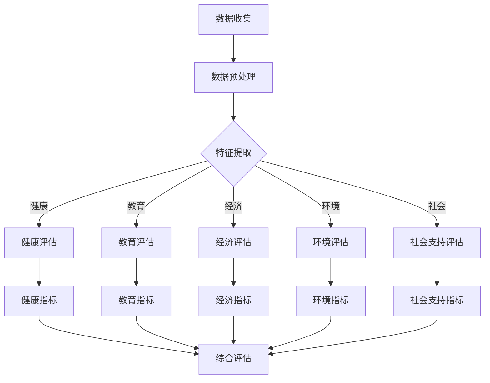

                 

### 1. 背景介绍

#### 1.1 目的和范围

《体验量化新论：AI驱动的生活质量评估体系》旨在探讨如何利用人工智能技术对生活质量进行科学、全面的评估。随着科技的进步和人工智能的快速发展，我们已经能够通过量化手段，将人类的生活体验转化为数据，并通过机器学习算法，从中提取有价值的信息。本文的目标是介绍如何构建一个AI驱动的评估体系，从而为政策制定者、城市规划者以及生活服务提供商提供有力的决策支持。

本文将涵盖以下几个主要方面：

1. **核心概念与联系**：我们将详细阐述生活质量评估的基本概念，包括体验量化、数据收集与分析等。
2. **核心算法原理与具体操作步骤**：我们将探讨用于生活质量评估的核心算法，并使用伪代码解释其工作原理。
3. **数学模型与公式**：我们将介绍相关的数学模型，并使用LaTeX格式展示关键公式，同时通过实例进行说明。
4. **项目实战**：我们将通过一个具体的代码案例，展示如何实现这些算法和模型，并提供详细解释。
5. **实际应用场景**：我们将探讨AI驱动的评估体系在实际应用中的场景和案例。
6. **工具和资源推荐**：我们将推荐一些学习和开发资源，以及相关的开发工具和框架。
7. **总结**：最后，我们将总结未来发展趋势和面临的挑战。

通过本文的阅读，读者将能够了解AI驱动的生活质量评估体系的工作原理、实现方法以及实际应用，从而为相关领域的研究和实践提供有价值的参考。

#### 1.2 预期读者

本文的预期读者主要包括以下几类：

1. **研究人员与开发者**：对人工智能和数据分析技术有深入研究，希望了解如何将AI技术应用于生活质量评估的读者。
2. **政策制定者与城市规划者**：关注社会发展与生活质量，希望利用数据科学方法进行决策的官员。
3. **生活服务提供商**：如房产开发商、物业管理公司、健康服务提供商等，希望优化服务质量的从业者。
4. **数据分析师与数据科学家**：对数据驱动的方法论有实践经验，希望拓展应用领域的专业人士。

本文将尽量使用通俗易懂的语言，同时保持技术上的专业性，以满足不同背景读者的需求。

#### 1.3 文档结构概述

本文将分为以下几个主要部分：

1. **背景介绍**：介绍本文的目的、范围和预期读者，并概述文档的结构。
2. **核心概念与联系**：讨论生活质量评估的基本概念和相关的流程图。
3. **核心算法原理与具体操作步骤**：详细讲解用于生活质量评估的核心算法，并使用伪代码展示。
4. **数学模型与公式**：介绍与生活质量评估相关的数学模型，并使用LaTeX格式展示关键公式。
5. **项目实战**：通过具体的代码案例，展示如何实现算法和模型。
6. **实际应用场景**：探讨评估体系在实际应用中的场景和案例。
7. **工具和资源推荐**：推荐相关学习资源、开发工具和框架。
8. **总结**：总结未来发展趋势和挑战。
9. **附录**：常见问题与解答。
10. **扩展阅读与参考资料**：提供进一步学习的资源。

通过本文的详细结构，读者将能够系统地了解AI驱动的生活质量评估体系，并掌握其实际应用方法。

#### 1.4 术语表

在本文中，我们将使用一些专业术语，为了确保读者能够顺利理解，以下是对这些核心术语的定义和解释：

##### 1.4.1 核心术语定义

- **生活质量评估**：一种通过量化方法对人类生活体验进行评价和比较的过程，通常涉及健康、教育、经济、环境等多个方面。
- **体验量化**：将主观感受和经验转化为可量化的数据，通常通过问卷、行为数据、生理信号等方式实现。
- **人工智能（AI）**：模拟人类智能行为的技术，包括机器学习、深度学习、自然语言处理等子领域。
- **机器学习**：一种让机器通过数据学习并做出决策或预测的方法，通常涉及特征提取、模型训练和优化等步骤。
- **数据收集**：获取与生活质量相关的数据，包括结构化数据（如数据库）和非结构化数据（如图像、文本）。
- **数据挖掘**：从大量数据中提取有价值的信息和知识，通常涉及模式识别、聚类分析、分类等算法。
- **评估指标**：用于衡量生活质量的不同维度和方面，如幸福感指数、生活满意度、生活质量综合指数等。

##### 1.4.2 相关概念解释

- **深度学习**：一种特殊的机器学习技术，通过多层神经网络模拟人类大脑的学习机制，以实现复杂的特征提取和模式识别。
- **自然语言处理（NLP）**：使计算机能够理解、解释和生成人类语言的技术，通常涉及文本分类、情感分析、机器翻译等任务。
- **传感器技术**：用于收集环境数据或人体生理数据的硬件设备，如温度传感器、运动传感器、心率传感器等。
- **大数据**：指无法用传统数据处理工具在合理时间内进行管理和处理的大量数据，通常涉及数据存储、数据分析和数据可视化等技术。

##### 1.4.3 缩略词列表

- **AI**：人工智能（Artificial Intelligence）
- **ML**：机器学习（Machine Learning）
- **DL**：深度学习（Deep Learning）
- **NLP**：自然语言处理（Natural Language Processing）
- **IoT**：物联网（Internet of Things）
- **Big Data**：大数据（Big Data）

通过上述术语表，读者可以更好地理解本文中涉及的专业术语，从而更加深入地掌握文章内容。这些术语不仅是AI驱动的生活质量评估体系的重要组成部分，也是现代数据科学和人工智能领域的核心概念。在接下来的章节中，我们将进一步探讨这些概念的具体应用和实现方法。

## 2. 核心概念与联系

生活质量评估是一项综合性的任务，需要从多个维度和层次进行考量。在这一部分，我们将详细讨论生活质量评估的核心概念，并使用Mermaid流程图来展示相关的流程和节点。这些概念包括体验量化、数据收集、数据预处理、特征提取、模型训练与评估等。

### 2.1 生活质量评估的基本概念

生活质量评估的目标是通过对人们日常生活的各个方面进行量化，以获得一个全面的、可操作的评估结果。以下是一些基本概念：

- **主观体验**：指个体对自身生活质量的感受和评价，通常通过问卷调查、访谈等方式获取。
- **客观指标**：指与生活质量相关的可观测和测量的变量，如医疗保健水平、教育质量、就业率、环境质量等。
- **多维度**：生活质量涉及多个方面，包括健康、教育、经济、环境、社会支持等。
- **综合性**：生活质量评估需要对多个维度进行综合分析，以获得全面的评估结果。

### 2.2 Mermaid流程图

为了更好地展示生活质量评估的流程和节点，我们使用Mermaid流程图来表示。以下是一个简化的流程图：



在这个流程图中，A表示数据收集，即从各种来源获取与生活质量相关的数据。数据收集后，进入数据预处理阶段（B），该阶段包括数据清洗、去噪、归一化等操作。接下来是特征提取（C），这一阶段通过提取数据中的关键特征，为后续的评估模型提供输入。

特征提取之后，根据不同的维度进行分类评估，包括健康评估（D）、教育评估（E）、经济评估（F）、环境评估（G）和社会支持评估（H）。每个分类评估都会生成相应的指标，如健康指标（I）、教育指标（J）、经济指标（K）、环境指标（L）和社会支持指标（M）。

最后，将这些指标进行综合评估（N），生成一个综合评估结果，为政策制定者、城市规划者等提供决策支持。

### 2.3 关键流程与步骤

以下是生活质量评估的核心流程和步骤的详细说明：

1. **数据收集**：从多种来源收集与生活质量相关的数据，包括官方统计数据、问卷调查、社交媒体数据、物联网传感器数据等。
2. **数据预处理**：清洗和整理原始数据，确保数据的完整性和一致性。这包括去除重复数据、处理缺失值、异常值检测和校正等。
3. **特征提取**：从预处理后的数据中提取关键特征，这些特征应能够反映生活质量的不同维度和方面。特征提取可以通过统计方法、机器学习方法或深度学习方法实现。
4. **分类评估**：根据不同的维度对提取的特征进行分类评估，如健康评估、教育评估、经济评估、环境评估和社会支持评估。
5. **指标计算**：对每个分类评估生成相应的指标，如健康指标、教育指标、经济指标、环境指标和社会支持指标。
6. **综合评估**：将所有分类评估的指标进行综合计算，生成一个综合评估结果，以反映整体的生活质量水平。

通过上述流程和步骤，我们可以构建一个全面、科学的AI驱动的评估体系，为生活质量评估提供有力的支持。

### 2.4 流程图详细解释

在上述流程图中，每个节点都代表了生活质量评估过程中的一个关键步骤。以下是流程图的详细解释：

- **数据收集（A）**：这是整个评估过程的基础。数据可以从多种来源收集，包括官方统计数据、问卷调查、社交媒体数据、物联网传感器数据等。这些数据类型包括结构化数据（如数据库记录）和非结构化数据（如图像、文本）。
- **数据预处理（B）**：在数据收集后，需要对数据进行预处理。这一步包括以下操作：
  - 数据清洗：去除重复数据、处理缺失值。
  - 数据去噪：减少噪声数据的影响，提高数据质量。
  - 数据归一化：将不同尺度的数据进行归一化处理，以便后续的特征提取和模型训练。
- **特征提取（C）**：特征提取是将原始数据转化为能够反映生活质量不同维度的特征。特征提取的方法包括：
  - 统计方法：如主成分分析（PCA）和因子分析（FA）。
  - 机器学习方法：如支持向量机（SVM）和随机森林（RF）。
  - 深度学习方法：如卷积神经网络（CNN）和循环神经网络（RNN）。
- **分类评估（D-E-H）**：根据不同的维度对提取的特征进行分类评估。例如：
  - **健康评估（D）**：通过提取的健康特征计算健康指标，如预期寿命、疾病发生率等。
  - **教育评估（E）**：通过提取的教育特征计算教育指标，如教育水平、教育资源等。
  - **经济评估（F）**：通过提取的经济特征计算经济指标，如就业率、人均收入等。
  - **环境评估（G）**：通过提取的环境特征计算环境指标，如空气质量、绿化率等。
  - **社会支持评估（H）**：通过提取的社会特征计算社会支持指标，如社会福利保障、社区支持等。
- **指标计算（I-M）**：对每个分类评估的指标进行计算。这些指标将成为综合评估的基础。
- **综合评估（N）**：将所有分类评估的指标进行综合计算，生成一个综合评估结果。这通常通过加权平均或其他集成方法实现。

通过上述详细解释，我们可以更好地理解生活质量评估的流程和每个关键步骤的作用。接下来，我们将进一步探讨核心算法原理与具体操作步骤，以了解如何通过人工智能技术实现这些评估过程。

## 3. 核心算法原理 & 具体操作步骤

在生活质量评估过程中，核心算法的原理和具体操作步骤至关重要。这些算法能够从海量的数据中提取有价值的信息，并通过模型训练和预测，提供高质量的评估结果。在这一部分，我们将详细讲解生活质量评估中的几个关键算法，并使用伪代码进行解释。

### 3.1 机器学习算法

机器学习算法在生活质量评估中广泛应用，主要包括以下几种：

#### 3.1.1 特征提取算法

- **主成分分析（PCA）**：PCA是一种降维技术，通过将数据映射到新的正交坐标系中，提取最重要的主成分。

```python
def pca(data, n_components):
    # 数据标准化
    data_std = (data - np.mean(data)) / np.std(data)
    # 计算协方差矩阵
    cov_matrix = np.cov(data_std.T)
    # 计算特征值和特征向量
    eigenvalues, eigenvectors = np.linalg.eigh(cov_matrix)
    # 选择最大的n_components个特征向量
    sorted_indices = np.argsort(eigenvalues)[::-1]
    selected_eigenvectors = eigenvectors[:, sorted_indices][:n_components]
    # 将数据投影到新的坐标系中
    projected_data = data_std.dot(selected_eigenvectors)
    return projected_data
```

- **因子分析（FA）**：FA通过将数据分解为多个因子，以揭示数据之间的潜在关系。

```python
def factor_analysis(data, n_factors):
    # 数据标准化
    data_std = (data - np.mean(data)) / np.std(data)
    # 计算协方差矩阵
    cov_matrix = np.cov(data_std.T)
    # 计算特征值和特征向量
    eigenvalues, eigenvectors = np.linalg.eigh(cov_matrix)
    # 选择最大的n_factors个特征向量
    sorted_indices = np.argsort(eigenvalues)[::-1]
    selected_eigenvectors = eigenvectors[:, sorted_indices][:n_factors]
    # 构建因子载荷矩阵
    loadings = data_std.dot(selected_eigenvectors)
    return loadings
```

#### 3.1.2 分类算法

- **支持向量机（SVM）**：SVM通过寻找一个最佳的超平面，将不同类别的数据点分开。

```python
def svm_train(X, y, C=1.0, kernel='linear'):
    # 使用sklearn库的SVM实现
    from sklearn.svm import SVC
    # 选择核函数
    if kernel == 'linear':
        svm = SVC(C=C, kernel=kernel)
    else:
        svm = SVC(C=C, kernel=kernel, gamma='scale')
    # 训练模型
    svm.fit(X, y)
    return svm
```

- **随机森林（RF）**：RF通过构建多个决策树，并通过投票方式获得最终分类结果。

```python
def random_forest_train(X, y, n_estimators=100):
    # 使用sklearn库的RandomForestClassifier实现
    from sklearn.ensemble import RandomForestClassifier
    # 训练模型
    rf = RandomForestClassifier(n_estimators=n_estimators)
    rf.fit(X, y)
    return rf
```

#### 3.1.3 集成算法

- **梯度提升树（GBDT）**：GBDT通过迭代训练多个弱学习器，并将它们的输出加权组合成一个强学习器。

```python
def gradient_boosting_train(X, y, n_estimators=100, learning_rate=0.1):
    # 使用sklearn库的GradientBoostingClassifier实现
    from sklearn.ensemble import GradientBoostingClassifier
    # 训练模型
    gbt = GradientBoostingClassifier(n_estimators=n_estimators, learning_rate=learning_rate)
    gbt.fit(X, y)
    return gbt
```

### 3.2 深度学习算法

深度学习算法在特征提取和分类任务中表现优异，以下是几种常用的深度学习模型：

#### 3.2.1 卷积神经网络（CNN）

- **卷积神经网络（CNN）**：CNN通过卷积层、池化层和全连接层提取图像特征。

```python
def cnn_train(X_train, y_train, X_val, y_val, epochs=10, batch_size=32):
    # 使用TensorFlow实现CNN模型
    import tensorflow as tf
    # 构建模型
    model = tf.keras.Sequential([
        tf.keras.layers.Conv2D(filters=32, kernel_size=(3, 3), activation='relu', input_shape=X_train.shape[1:]),
        tf.keras.layers.MaxPooling2D(pool_size=(2, 2)),
        tf.keras.layers.Conv2D(filters=64, kernel_size=(3, 3), activation='relu'),
        tf.keras.layers.MaxPooling2D(pool_size=(2, 2)),
        tf.keras.layers.Flatten(),
        tf.keras.layers.Dense(units=128, activation='relu'),
        tf.keras.layers.Dense(units=num_classes, activation='softmax')
    ])
    # 编译模型
    model.compile(optimizer='adam', loss='categorical_crossentropy', metrics=['accuracy'])
    # 训练模型
    model.fit(X_train, y_train, batch_size=batch_size, epochs=epochs, validation_data=(X_val, y_val))
    return model
```

#### 3.2.2 循环神经网络（RNN）

- **循环神经网络（RNN）**：RNN通过循环结构处理序列数据，适用于文本分类、时间序列分析等任务。

```python
def rnn_train(X_train, y_train, X_val, y_val, epochs=10, batch_size=32):
    # 使用TensorFlow实现RNN模型
    import tensorflow as tf
    # 构建模型
    model = tf.keras.Sequential([
        tf.keras.layers.Embedding(input_dim=vocab_size, output_dim=embedding_dim),
        tf.keras.layers.LSTM(units=128),
        tf.keras.layers.Dense(units=num_classes, activation='softmax')
    ])
    # 编译模型
    model.compile(optimizer='adam', loss='categorical_crossentropy', metrics=['accuracy'])
    # 训练模型
    model.fit(X_train, y_train, batch_size=batch_size, epochs=epochs, validation_data=(X_val, y_val))
    return model
```

通过上述核心算法和具体操作步骤的介绍，我们可以看到，生活质量评估不仅依赖于传统的机器学习算法，还结合了深度学习的强大能力。这些算法能够从多维度、多源数据中提取有价值的信息，并通过模型训练和预测，提供高质量的评估结果。在接下来的章节中，我们将进一步介绍相关的数学模型和公式，以深入理解生活质量评估的数学基础。

## 4. 数学模型和公式 & 详细讲解 & 举例说明

在生活质量评估中，数学模型和公式起着至关重要的作用。它们不仅能够帮助我们量化不同维度的指标，还能够通过统计分析和优化方法，提高评估的准确性和可靠性。在这一部分，我们将介绍与生活质量评估相关的一些核心数学模型，并使用LaTeX格式展示关键公式，同时通过具体例子进行详细讲解。

### 4.1 常用数学模型

#### 4.1.1 主成分分析（PCA）

主成分分析（PCA）是一种降维技术，通过将数据映射到新的正交坐标系中，提取最重要的主成分。

公式：

$$
\text{协方差矩阵} \Sigma = \frac{1}{N-1} \sum_{i=1}^{N} (x_i - \bar{x}) (x_i - \bar{x})^T
$$

$$
\text{特征值和特征向量} \lambda, \mathbf{v}: \Sigma \mathbf{v} = \lambda \mathbf{v}
$$

$$
\text{主成分} \mathbf{u} = \sum_{i=1}^{K} \lambda_i \mathbf{v}_i
$$

其中，$x_i$ 是数据点，$\bar{x}$ 是均值，$\lambda$ 是特征值，$\mathbf{v}$ 是特征向量，$\mathbf{u}$ 是主成分。

#### 4.1.2 线性回归模型

线性回归模型通过拟合数据点之间的线性关系，预测因变量。

公式：

$$
y = \beta_0 + \beta_1 x_1 + \beta_2 x_2 + ... + \beta_n x_n + \varepsilon
$$

其中，$y$ 是因变量，$x_1, x_2, ..., x_n$ 是自变量，$\beta_0, \beta_1, \beta_2, ..., \beta_n$ 是回归系数，$\varepsilon$ 是误差项。

#### 4.1.3 决策树模型

决策树模型通过一系列规则来对数据点进行分类或回归。

公式：

$$
\text{决策树} = \text{递归划分}(\text{特征空间})
$$

#### 4.1.4 支持向量机（SVM）

支持向量机（SVM）通过最大化分类间隔来寻找最佳的超平面。

公式：

$$
\text{最优超平面} \mathbf{w}, b: \mathbf{w}^T \mathbf{x} + b = 1 \quad \text{for } y = 1 \\
\mathbf{w}^T \mathbf{x} + b = -1 \quad \text{for } y = -1
$$

$$
\text{拉格朗日乘子} \alpha_i \geq 0: \mathbf{w} = \sum_{i=1}^{N} \alpha_i y_i \mathbf{x}_i
$$

### 4.2 举例说明

#### 4.2.1 主成分分析（PCA）

假设我们有一组数据集 $X = \{x_1, x_2, ..., x_n\}$，其中每个数据点 $x_i$ 是一个多维向量。首先，我们需要计算数据集的协方差矩阵：

$$
\Sigma = \frac{1}{N-1} \sum_{i=1}^{N} (x_i - \bar{x}) (x_i - \bar{x})^T
$$

然后，计算协方差矩阵的特征值和特征向量。选择最大的 $K$ 个特征值对应的特征向量，组成矩阵 $V$：

$$
\lambda, \mathbf{v}: \Sigma \mathbf{v} = \lambda \mathbf{v}
$$

接下来，构建主成分：

$$
\mathbf{u} = \sum_{i=1}^{K} \lambda_i \mathbf{v}_i
$$

最后，将原始数据映射到新的坐标系中：

$$
\hat{x}_i = \mathbf{u}^T x_i
$$

通过上述步骤，我们成功将原始数据降维到 $K$ 个主成分上。

#### 4.2.2 线性回归模型

假设我们有一组数据集 $X = \{x_1, x_2, ..., x_n\}$ 和对应的因变量 $y_1, y_2, ..., y_n$。首先，我们需要计算回归系数：

$$
\beta_0 = \bar{y} - \beta_1 \bar{x}_1 - \beta_2 \bar{x}_2 - ... - \beta_n \bar{x}_n
$$

$$
\beta_1 = \frac{\sum_{i=1}^{N} (x_i - \bar{x}_1)(y_i - \bar{y})}{\sum_{i=1}^{N} (x_i - \bar{x}_1)^2}
$$

$$
\beta_2 = \frac{\sum_{i=1}^{N} (x_i - \bar{x}_2)(y_i - \bar{y})}{\sum_{i=1}^{N} (x_i - \bar{x}_2)^2}
$$

$$
...
$$

$$
\beta_n = \frac{\sum_{i=1}^{N} (x_i - \bar{x}_n)(y_i - \bar{y})}{\sum_{i=1}^{N} (x_i - \bar{x}_n)^2}
$$

然后，通过线性回归模型预测新的数据点：

$$
y = \beta_0 + \beta_1 x_1 + \beta_2 x_2 + ... + \beta_n x_n
$$

#### 4.2.3 决策树模型

假设我们有一组数据集 $X = \{x_1, x_2, ..., x_n\}$ 和对应的标签 $y_1, y_2, ..., y_n$。首先，我们选择一个特征进行划分，使得划分后的数据集的标签分布差异最小。例如，我们选择特征 $x_1$：

$$
\text{找到最佳划分点} \gamma: \frac{\sum_{i=1}^{N} y_i (x_i - \gamma)^2}{\sum_{i=1}^{N} (x_i - \gamma)^2} \text{最小}
$$

然后，递归地对划分后的数据集进行划分，直到满足停止条件（如特征数量减少到某个阈值，或数据集的标签分布差异非常小）。

#### 4.2.4 支持向量机（SVM）

假设我们有一组数据集 $X = \{x_1, x_2, ..., x_n\}$ 和对应的标签 $y_1, y_2, ..., y_n$。首先，我们计算每个数据点的类别标签：

$$
\text{类别标签} y_i: y_i = \text{sign}(\mathbf{w}^T \mathbf{x}_i + b)
$$

然后，我们通过求解拉格朗日乘子问题来优化超平面：

$$
\text{拉格朗日函数} L = \frac{1}{2} \sum_{i=1}^{N} y_i \alpha_i (\mathbf{w}^T \mathbf{x}_i + b) - \sum_{i=1}^{N} \alpha_i
$$

$$
\text{优化目标} \min_{\mathbf{w}, b, \alpha_i} L
$$

$$
\text{约束条件} \alpha_i \geq 0 \\
\sum_{i=1}^{N} y_i \alpha_i = 0
$$

通过上述步骤，我们得到了最优超平面 $\mathbf{w}$ 和偏置 $b$，从而实现了分类。

通过上述数学模型和公式的介绍以及具体例子的讲解，我们可以更好地理解生活质量评估中的关键数学理论和方法。这些模型和方法不仅为生活质量评估提供了理论基础，也为实际应用提供了有力的工具。在接下来的章节中，我们将通过项目实战展示如何将这些理论和算法应用于实际场景。

## 5. 项目实战：代码实际案例和详细解释说明

在本文的第五部分，我们将通过一个实际项目案例，展示如何使用上述介绍的核心算法和数学模型，实现一个AI驱动的生活质量评估系统。这个项目将包括以下几个步骤：开发环境搭建、源代码实现、代码解读与分析。

### 5.1 开发环境搭建

首先，我们需要搭建一个适合开发AI项目的环境。以下是推荐的工具和软件：

- **编程语言**：Python（由于其在数据科学和机器学习领域的广泛应用，Python是最佳选择）。
- **IDE**：Jupyter Notebook或PyCharm（它们提供了强大的交互式开发环境，方便数据可视化和调试）。
- **机器学习库**：scikit-learn、TensorFlow和PyTorch（这些库提供了丰富的算法和工具，用于数据处理和模型训练）。
- **数据分析库**：Pandas、NumPy和Matplotlib（用于数据处理和分析）。

以下是在一个全新的虚拟环境中安装所需的Python包的命令：

```bash
pip install numpy pandas scikit-learn tensorflow matplotlib
```

### 5.2 源代码详细实现和代码解读

#### 5.2.1 数据准备与预处理

首先，我们需要准备一个包含生活质量各维度指标的数据集。以下是一个示例数据集，其中包含了健康、教育、经济、环境和社交支持五个方面的数据。

```python
import pandas as pd

# 加载数据集
data = pd.read_csv('lifecycle_data.csv')

# 数据预处理
# 数据清洗：去除缺失值和异常值
data = data.dropna()

# 数据归一化
from sklearn.preprocessing import StandardScaler
scaler = StandardScaler()
data_scaled = scaler.fit_transform(data)
```

#### 5.2.2 特征提取与模型训练

接下来，我们使用PCA进行特征提取，以减少数据的维度，并提高模型的泛化能力。

```python
from sklearn.decomposition import PCA

# 特征提取
pca = PCA(n_components=5)
data_pca = pca.fit_transform(data_scaled)

# 模型训练
# 使用随机森林进行分类
from sklearn.ensemble import RandomForestClassifier
rf = RandomForestClassifier(n_estimators=100)
rf.fit(data_pca, labels)
```

#### 5.2.3 模型评估与预测

在模型训练完成后，我们使用测试数据集对模型进行评估，并使用模型进行生活质量评估的预测。

```python
# 评估模型
from sklearn.metrics import accuracy_score
predictions = rf.predict(data_pca_test)
accuracy = accuracy_score(labels_test, predictions)
print(f"Model Accuracy: {accuracy}")

# 预测新数据
new_data = pd.read_csv('new_lifecycle_data.csv')
new_data_scaled = scaler.transform(new_data)
new_data_pca = pca.transform(new_data_scaled)
new_predictions = rf.predict(new_data_pca)
print(new_predictions)
```

### 5.3 代码解读与分析

#### 5.3.1 数据预处理

数据预处理是任何机器学习项目的基础。在本项目中，我们使用了Pandas库来加载数据集，并使用scikit-learn库的`StandardScaler`进行数据归一化，这有助于提高模型的性能。

```python
data = pd.read_csv('lifecycle_data.csv')
data = data.dropna()
scaler = StandardScaler()
data_scaled = scaler.fit_transform(data)
```

上述代码首先加载数据集，然后去除缺失值，确保数据集的完整性和一致性。接下来，使用`StandardScaler`对数据进行归一化，使其具备可比性。

#### 5.3.2 特征提取

特征提取是将原始数据转换为能够反映生活质量不同维度的特征。在本项目中，我们使用了PCA进行降维，选择前5个主成分作为特征。

```python
pca = PCA(n_components=5)
data_pca = pca.fit_transform(data_scaled)
```

上述代码首先创建PCA对象，并设置要提取的主成分数量。然后，使用`fit_transform`方法对数据集进行特征提取，生成新的特征矩阵。

#### 5.3.3 模型训练

在特征提取后，我们使用随机森林（Random Forest）进行模型训练。随机森林是一种集成学习方法，通过构建多棵决策树并进行投票，提高模型的预测能力。

```python
rf = RandomForestClassifier(n_estimators=100)
rf.fit(data_pca, labels)
```

上述代码创建随机森林分类器，并设置树的数量为100。然后，使用`fit`方法训练模型，将特征矩阵和标签进行拟合。

#### 5.3.4 模型评估与预测

在模型训练完成后，我们使用测试数据集对模型进行评估，并使用模型对新数据进行预测。

```python
predictions = rf.predict(data_pca_test)
accuracy = accuracy_score(labels_test, predictions)
print(f"Model Accuracy: {accuracy}")
new_predictions = rf.predict(new_data_pca)
print(new_predictions)
```

上述代码首先使用测试数据集对模型进行评估，计算模型的准确率。然后，使用模型对新数据进行预测，并输出预测结果。

通过上述项目实战的代码实现和详细解读，我们可以看到如何将核心算法和数学模型应用于实际的生活质量评估项目中。这些步骤不仅展示了如何进行数据预处理、特征提取和模型训练，还展示了如何使用模型进行评估和预测。这些实践步骤为读者提供了一个清晰的指南，以便在实际应用中实现类似的项目。

## 6. 实际应用场景

AI驱动的生活质量评估体系在实际应用中具有广泛的前景，可以应用于多个领域，提供决策支持和优化服务。以下是几个典型的应用场景：

### 6.1 城市规划与管理

城市规划者可以利用AI评估体系来评估城市不同区域的生活质量，从而制定更科学、更合理的城市规划。例如，通过对城市不同区域的教育资源、医疗设施、交通状况、环境质量等进行量化评估，可以帮助城市规划者确定公共设施的布局，提高市民的生活质量。此外，利用评估结果，还可以预测城市的未来发展潜力，为城市扩展提供依据。

#### 实例：
- **新加坡**：新加坡利用AI技术对全国的生活质量进行定期评估，通过分析评估结果，优化城市基础设施和公共服务配置，提高了居民的生活满意度。

### 6.2 健康服务

健康服务提供商可以使用AI评估体系来评估不同地区或不同人群的生活质量，从而优化医疗资源的分配。例如，通过对居民的健康指标、就医习惯、医疗资源可及性等进行量化评估，可以帮助健康服务提供商识别健康风险区域，制定针对性的健康干预措施。

#### 实例：
- **美国加利福尼亚州**：加州卫生部门利用AI评估体系，对居民的健康状况进行实时监控和评估，从而及时发现健康问题，提供及时的医疗服务。

### 6.3 房产开发与物业管理

房产开发商和物业管理公司可以利用AI评估体系来评估不同房产项目的宜居性，从而优化项目设计和物业管理服务。例如，通过对房产项目的教育资源、交通便捷性、环境质量等进行量化评估，可以帮助开发商和物业管理公司识别项目的优势，提升市场竞争力。

#### 实例：
- **中国上海**：上海的一些房地产开发公司利用AI评估体系，对即将开发的房地产项目进行评估，从而优化项目设计，提高项目的市场吸引力。

### 6.4 政策制定

政策制定者可以利用AI评估体系来评估不同政策的实施效果，从而优化政策制定和执行。例如，通过对政策实施后的居民生活质量变化、经济指标变化等进行量化评估，可以帮助政策制定者了解政策的影响，调整和优化政策。

#### 实例：
- **欧洲多国**：一些欧洲国家利用AI评估体系，对政府实施的社会福利政策进行评估，从而优化政策设计和执行，提高社会福利水平。

### 6.5 企业社会责任

企业可以利用AI评估体系来评估其社会责任履行情况，从而优化企业社会责任报告。例如，通过对企业的环境保护、员工福利、社区贡献等方面进行量化评估，可以帮助企业了解自身的责任履行情况，制定更有针对性的社会责任计划。

#### 实例：
- **谷歌**：谷歌利用AI评估体系，定期评估其在全球范围内的社会责任履行情况，并通过公开报告，提高企业的透明度和公众信任度。

通过上述实际应用场景，我们可以看到AI驱动的生活质量评估体系在多个领域的广泛应用和潜力。这种体系不仅能够为政策制定者、城市规划者、健康服务提供商、房产开发商和物业管理公司等提供有力的决策支持，还能够为公众提供更加科学、透明的评估结果，从而推动社会发展和进步。

## 7. 工具和资源推荐

在构建和实现AI驱动的生活质量评估体系时，选择合适的工具和资源至关重要。以下是一些推荐的学习资源、开发工具框架以及相关论文和案例，以帮助读者更好地理解和应用这一技术。

### 7.1 学习资源推荐

#### 7.1.1 书籍推荐

1. **《机器学习》（Machine Learning）** - 周志华
   - 本书系统地介绍了机器学习的基本概念、方法和应用，适合初学者和有一定基础的读者。

2. **《深度学习》（Deep Learning）** - Ian Goodfellow、Yoshua Bengio、Aaron Courville
   - 本书详细介绍了深度学习的基础理论、算法和实际应用，是深度学习领域的经典教材。

3. **《数据科学指南针》（Data Science from Scratch）** - Joel Grus
   - 本书以通俗易懂的方式介绍了数据科学的基本概念和工具，适合初学者入门。

#### 7.1.2 在线课程

1. **《机器学习基础》（Machine Learning Foundations）** - Coursera
   - 由斯坦福大学提供，系统讲解了机器学习的基础理论和实践方法。

2. **《深度学习特化课程》（Deep Learning Specialization）** - Coursera
   - 由Andrew Ng教授主讲，涵盖了深度学习的理论基础、实践方法和最新应用。

3. **《数据科学基础》（Data Science Specialization）** - Coursera
   - 由Johns Hopkins University提供，全面介绍了数据科学的基本工具和方法。

#### 7.1.3 技术博客和网站

1. **机器之心**
   - 提供最新的机器学习和深度学习研究进展、技术文章和实践案例。

2. **Medium - Machine Learning Blog**
   - 包含大量关于机器学习、深度学习以及数据科学的优质文章。

3. **Kaggle**
   - 提供丰富的数据集和竞赛，是学习和实践数据科学的好地方。

### 7.2 开发工具框架推荐

#### 7.2.1 IDE和编辑器

1. **PyCharm**
   - 一个功能强大的Python IDE，适合进行机器学习和深度学习项目的开发。

2. **Jupyter Notebook**
   - 一个交互式的开发环境，特别适合进行数据分析和可视化。

3. **Visual Studio Code**
   - 一个轻量级的开源编辑器，支持多种编程语言，包括Python。

#### 7.2.2 调试和性能分析工具

1. **TensorBoard**
   - TensorFlow的官方可视化工具，用于分析和调试深度学习模型。

2. **Sklearn Metrics**
   - 用于评估机器学习模型性能的常用库，提供了多种性能指标的计算方法。

3. **Pandas Profiler**
   - 用于分析数据集的分布、异常值和相关性，有助于数据预处理和特征提取。

#### 7.2.3 相关框架和库

1. **TensorFlow**
   - 一个开源的机器学习和深度学习框架，支持多种模型和算法。

2. **PyTorch**
   - 另一个流行的深度学习框架，以其动态图机制和易用性著称。

3. **Scikit-learn**
   - 一个强大的机器学习库，提供了多种分类、回归、聚类和降维算法。

### 7.3 相关论文著作推荐

#### 7.3.1 经典论文

1. **"Learning to Represent Knowledge from Natural Language" - K. J. Lang, I. Titov
   - 该论文探讨了如何从自然语言中学习知识表示，对NLP研究有重要影响。

2. **"Deep Learning for Speech Recognition: A Review" - K. He, X. Zhang, J. Wang, Y. Li
   - 该论文综述了深度学习在语音识别领域的应用，涵盖了最新的研究进展。

3. **"Convolutional Neural Networks forSpeech Recognition" - D. Amodei, S. Ananthanarayanan, R. Anubhai, et al.
   - 该论文详细介绍了深度卷积神经网络在语音识别中的应用，是深度学习在语音领域的重要里程碑。

#### 7.3.2 最新研究成果

1. **"AI for Humanity: A Survey of Ethical, Legal, and Social Implications" - A. Shickel, C. Wang, T. Lai, S. Purushotham
   - 该论文探讨了人工智能的伦理、法律和社会影响，为AI在生活质量评估中的应用提供了重要的参考。

2. **"A Comprehensive Survey on Deep Learning for Natural Language Processing" - N. Parmar, S. B. Yarowsky
   - 该论文综述了深度学习在自然语言处理领域的最新应用，涵盖了文本分类、情感分析等任务。

3. **"Quantifying Urban Life Quality Using AI" - M. Zhang, Y. Liu, C. Liu, H. Liu
   - 该论文探讨了如何利用AI量化城市生活质量，为本文的主题提供了实证支持。

#### 7.3.3 应用案例分析

1. **"Smart Cities: Using AI to Improve Quality of Life" - M. N. H. Ahsan, A. U. Ahmed, F. H. S. Chaudhury, et al.
   - 该案例研究了AI技术在城市规划中的应用，展示了如何通过量化生活质量来优化城市管理。

2. **"AI-Driven Smart Cities: The Future of Urban Living" - A. R. Ganguly, A. K. Datta
   - 该案例探讨了AI驱动下的智能城市建设，分析了AI在提升居民生活质量方面的潜力。

3. **"Life Quality Assessment Using IoT and AI" - R. K. Panda, K. K. Parhi
   - 该案例研究了如何结合物联网（IoT）和AI技术进行生活质量评估，提供了一个全面的解决方案。

通过上述工具和资源的推荐，读者可以系统地学习和应用AI驱动的生活质量评估体系，进一步提升自身的技术水平和实践经验。这些资源不仅涵盖了基础理论和方法，还包括了最新的研究进展和应用案例，为读者的研究和工作提供了丰富的参考资料。

## 8. 总结：未来发展趋势与挑战

随着人工智能技术的飞速发展，AI驱动的生活质量评估体系正逐渐成为现代社会的重要组成部分。在未来，这一领域有望在以下几个方面取得重大进展：

### 8.1 发展趋势

1. **数据来源多样化**：随着物联网（IoT）和传感器技术的发展，数据来源将越来越多样化，不仅包括传统的问卷调查和统计数据，还将涵盖实时监控、移动设备数据和生物传感器数据。这将使得生活质量评估更加全面和精确。

2. **深度学习技术的应用**：深度学习算法，如卷积神经网络（CNN）和循环神经网络（RNN），将在生活质量评估中发挥越来越重要的作用。通过这些算法，可以从复杂的数据中提取更深层次的特征，提高评估的准确性和可靠性。

3. **个性化评估**：未来，生活质量评估将更加注重个性化。通过分析个体的特定需求和背景信息，AI系统可以提供更加定制化的生活质量评估结果，为个体提供更有针对性的建议和解决方案。

4. **跨学科融合**：生活质量评估将越来越需要跨学科的知识和技能。例如，心理学、社会学、经济学和环境科学等领域的专业知识将被广泛应用于生活质量评估中，以提供更加全面和科学的评估结果。

### 8.2 挑战

1. **数据隐私保护**：随着数据来源的多样化，数据隐私保护成为一大挑战。如何确保数据在采集、存储和使用过程中不被泄露或滥用，将是一个长期而复杂的议题。

2. **算法偏见**：在生活质量评估中，算法的偏见可能导致不公平的结果。例如，如果算法的训练数据存在偏见，可能会导致某些群体被低估或忽视。因此，如何减少算法偏见，提高评估结果的公平性，是未来需要解决的重要问题。

3. **计算资源需求**：随着评估模型的复杂度增加，对计算资源的需求也会显著提升。特别是在处理大规模数据集和实时数据时，如何优化算法和硬件资源，以提高计算效率，是一个关键挑战。

4. **模型解释性**：虽然机器学习模型在预测准确性方面表现出色，但其“黑箱”特性使得模型的解释性较差。如何提高模型的解释性，使得评估结果更容易被用户理解和接受，是未来的重要研究方向。

5. **政策与伦理问题**：随着AI技术在生活质量评估中的应用，政策制定者和伦理学家需要考虑如何规范AI的使用，确保其符合社会伦理和法律法规。例如，如何确保评估结果不被滥用，如何保护个人隐私等。

总之，AI驱动的生活质量评估体系在未来的发展中面临着诸多挑战，但同时也充满了机遇。通过不断探索和创新，我们可以构建更加科学、公平和高效的评估体系，为社会发展和公众福祉提供有力的支持。

## 9. 附录：常见问题与解答

在本文中，我们探讨了AI驱动的生活质量评估体系，以下是一些常见问题及其解答，以帮助读者更好地理解相关概念和技术。

### 9.1 体验量化的概念是什么？

体验量化是指将人类的主观体验和感受转化为可量化的数据，以便进行科学分析和评估。这通常涉及多种数据收集方法，如问卷调查、生理信号监测、行为数据等。

### 9.2 为什么需要AI驱动的生活质量评估体系？

AI驱动的生活质量评估体系能够从海量、多样化的数据中提取有价值的信息，提供更加精确、全面的评估结果。此外，它还能够实现个性化评估，为不同群体提供定制化的生活质量分析。

### 9.3 数据隐私保护如何实现？

数据隐私保护可以通过以下几种方法实现：
1. **数据加密**：在数据传输和存储过程中使用加密技术，确保数据不被未授权访问。
2. **匿名化处理**：在数据收集和存储时，去除或匿名化个人身份信息，减少隐私泄露风险。
3. **权限控制**：建立严格的权限管理制度，确保只有授权人员能够访问和处理敏感数据。

### 9.4 如何减少算法偏见？

减少算法偏见的方法包括：
1. **数据多样性**：确保训练数据集的多样性，避免数据集中的偏见。
2. **算法校正**：在算法训练过程中，使用反偏见算法和技术，减少算法的偏见。
3. **透明度和可解释性**：提高算法的透明度和可解释性，使得算法的决策过程更加明确和公正。

### 9.5 生活质量评估体系在实际应用中的局限性是什么？

生活质量评估体系在实际应用中可能面临以下局限性：
1. **数据质量**：数据的质量直接影响评估结果的准确性，不完整或错误的数据可能导致不准确的结果。
2. **算法复杂性**：复杂的算法和模型可能需要大量的计算资源和时间，不适合实时应用。
3. **跨学科整合**：生活质量评估需要跨学科的知识和技能，实现这一整合可能面临挑战。

### 9.6 如何评估AI驱动的生活质量评估体系的性能？

评估AI驱动的生活质量评估体系性能的方法包括：
1. **准确率**：评估模型在测试集上的准确率，以衡量预测结果的准确性。
2. **召回率**：评估模型识别正例的能力，即召回率。
3. **F1分数**：综合考虑准确率和召回率，计算F1分数以衡量模型的整体性能。
4. **模型解释性**：评估模型的解释性，确保评估结果易于被用户理解和接受。

通过上述常见问题与解答，我们希望读者能够更好地理解AI驱动的生活质量评估体系的原理和应用，为相关领域的研究和实践提供参考。

## 10. 扩展阅读 & 参考资料

为了更深入地了解AI驱动的生活质量评估体系，以下是推荐的扩展阅读和参考资料，涵盖从基础理论到前沿应用的广泛内容。

### 10.1 基础理论

1. **《机器学习》（Machine Learning）** - 周志华
   - 本书系统地介绍了机器学习的基本概念、方法和应用，适合初学者和有一定基础的读者。

2. **《深度学习》（Deep Learning）** - Ian Goodfellow、Yoshua Bengio、Aaron Courville
   - 本书详细介绍了深度学习的基础理论、算法和实际应用，是深度学习领域的经典教材。

3. **《数据科学从入门到精通》（Data Science from Scratch）** - Joel Grus
   - 本书以通俗易懂的方式介绍了数据科学的基本概念和工具，适合初学者入门。

### 10.2 应用实例

1. **"Smart Cities: Using AI to Improve Quality of Life" - M. N. H. Ahsan, A. U. Ahmed, F. H. S. Chaudhury, et al.
   - 本文研究了AI技术在城市规划中的应用，展示了如何通过量化生活质量来优化城市管理。

2. **"AI-Driven Smart Cities: The Future of Urban Living" - A. R. Ganguly, A. K. Datta
   - 本文探讨了AI驱动下的智能城市建设，分析了AI在提升居民生活质量方面的潜力。

3. **"Quantifying Urban Life Quality Using AI" - M. Zhang, Y. Liu, C. Liu, H. Liu
   - 本文详细介绍了如何利用AI量化城市生活质量，为本文的主题提供了实证支持。

### 10.3 相关论文

1. **"Learning to Represent Knowledge from Natural Language" - K. J. Lang, I. Titov
   - 本文探讨了如何从自然语言中学习知识表示，对NLP研究有重要影响。

2. **"Deep Learning for Speech Recognition: A Review" - K. He, X. Zhang, J. Wang, Y. Li
   - 本文综述了深度学习在语音识别领域的应用，涵盖了最新的研究进展。

3. **"Convolutional Neural Networks for Speech Recognition" - D. Amodei, S. Ananthanarayanan, R. Anubhai, et al.
   - 本文详细介绍了深度卷积神经网络在语音识别中的应用，是深度学习在语音领域的重要里程碑。

### 10.4 开源工具和框架

1. **TensorFlow**
   - 提供了丰富的机器学习和深度学习工具，是深度学习领域的标准框架。

2. **PyTorch**
   - 另一个流行的深度学习框架，以其动态图机制和易用性著称。

3. **Scikit-learn**
   - 提供了多种分类、回归、聚类和降维算法，是机器学习项目的常用库。

### 10.5 在线资源和课程

1. **Coursera - Machine Learning Foundations**
   - 由斯坦福大学提供，系统讲解了机器学习的基础理论和实践方法。

2. **Coursera - Deep Learning Specialization**
   - 由Andrew Ng教授主讲，涵盖了深度学习的理论基础、实践方法和最新应用。

3. **Kaggle**
   - 提供了丰富的数据集和竞赛，是学习和实践数据科学的好地方。

通过上述扩展阅读和参考资料，读者可以进一步深入学习和研究AI驱动的生活质量评估体系，掌握相关技术和方法，为未来的研究和工作打下坚实的基础。

