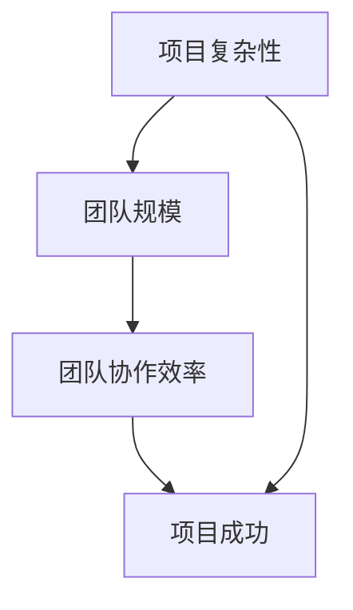

                 

### 何时考虑组建团队扩大规模

> **关键词**：团队扩展，组织规模，项目管理，人才招聘，发展策略

> **摘要**：本文旨在深入探讨在信息技术和工程领域内何时应该考虑组建团队并扩大规模。我们将从多个角度分析这一决策背后的逻辑，包括项目复杂性、人员能力和市场环境。文章将结合实际案例，提供一系列指导原则，帮助读者在适当的时候做出明智的团队扩展决策。

### 1. 背景介绍

#### 1.1 目的和范围

本文的目标是为信息技术和工程领域的从业者提供一个全面的指南，帮助他们在适当时机组建和扩大团队。通过分析项目规模、技术复杂性和市场动态，我们将探讨如何确定扩展团队的最佳时机。本文将覆盖以下几个关键领域：

- 项目复杂性和团队规模的关系
- 人才招聘策略与团队构建
- 市场环境和竞争态势对团队规模的影响
- 团队管理中的挑战和应对策略

#### 1.2 预期读者

本文适合以下读者群体：

- 创始人、CTO和高级技术管理人员
- 项目经理和团队领导
- 人力资源专业人士和招聘专员
- 信息技术和工程领域的研发人员

#### 1.3 文档结构概述

本文的结构安排如下：

1. **背景介绍**：介绍文章的目的、范围和预期读者。
2. **核心概念与联系**：阐述项目复杂性、团队规模和项目成功之间的联系，并提供Mermaid流程图。
3. **核心算法原理与具体操作步骤**：讲解团队规模决策的算法原理，并使用伪代码详细阐述。
4. **数学模型和公式**：介绍用于评估团队扩展的数学模型，并给出具体例子。
5. **项目实战**：通过实际案例展示团队扩展的过程和成果。
6. **实际应用场景**：探讨不同场景下团队扩展的必要性。
7. **工具和资源推荐**：推荐学习资源、开发工具和相关论文。
8. **总结**：展望未来发展趋势和挑战。
9. **附录**：常见问题与解答。
10. **扩展阅读**：提供进一步阅读的建议。

#### 1.4 术语表

在本文中，以下术语将被使用：

- **团队扩展**：指增加团队成员的数量。
- **项目复杂性**：指项目的规模、技术难度和实施细节的复杂程度。
- **人才招聘**：指寻找和雇佣新团队成员的过程。
- **市场环境**：指外部市场条件，包括竞争态势、客户需求和技术趋势。
- **团队管理**：指对团队成员进行组织、指导和协调的过程。

##### 1.4.1 核心术语定义

- **团队扩展**：团队扩展不仅仅是增加人数，更是团队结构、能力和协作模式的优化和升级。
- **项目复杂性**：项目复杂性包括技术实现难度、业务逻辑复杂性和项目管理难度等多个方面。

##### 1.4.2 相关概念解释

- **项目规模**：指项目的规模大小，通常以工作量、开发时间、资源投入等指标来衡量。
- **团队规模**：指团队中成员的数量，以及团队成员的技能组合和协作效率。

##### 1.4.3 缩略词列表

- **CTO**：首席技术官
- **PM**：项目经理
- **HR**：人力资源

## 2. 核心概念与联系

在考虑组建团队并扩大规模之前，我们需要理解几个核心概念：项目复杂性、团队规模和项目成功之间的内在联系。通过一个Mermaid流程图，我们可以更直观地看到这些概念之间的关系。

### Mermaid 流程图



在上面的流程图中，我们可以看到：

- **项目复杂性（A）** 是影响团队规模（B）的一个关键因素。项目越复杂，可能需要更多的团队成员来分摊工作量。
- **团队协作效率（C）** 是团队规模（B）的结果。适当的团队规模可以提高协作效率，从而促进项目成功（D）。
- **项目成功（D）** 是团队扩展的终极目标。

### 项目复杂性、团队规模和项目成功的关系

项目复杂性直接影响团队规模。一个大型、复杂的项目可能需要一个由多个专业角色组成的团队，如前端开发、后端开发、测试工程师、UI/UX设计师等。这些不同的角色需要协作，以确保项目的各个部分都能按时、按质完成。

团队规模又影响团队协作效率。如果团队规模过大，可能会导致沟通成本增加、决策缓慢；如果团队规模过小，则可能无法充分利用团队成员的技能和经验，影响项目的进度和质量。

最终，团队协作效率直接关系到项目的成功。一个高效的团队能够更快地响应变化、解决难题，从而在激烈的市场竞争中脱颖而出。

### Mermaid 流程图详细解释

- **项目复杂性（A）**：项目复杂性是指项目在需求分析、设计、开发、测试等各个阶段面临的挑战和不确定性。这包括技术的复杂度、业务的复杂性、数据处理的复杂性和系统的集成难度等。

- **团队规模（B）**：团队规模是指为了完成项目所需的人员数量和专业角色。一个合适的团队规模可以确保每个成员都有明确的职责，同时避免冗余和资源浪费。

- **团队协作效率（C）**：团队协作效率是指团队成员之间沟通、协作、共享资源和知识的效率。高效的团队协作可以加速项目进展，提高项目质量。

- **项目成功（D）**：项目成功是指项目在预定的时间和预算内，按照既定的质量标准完成，并达到业务目标。项目成功不仅取决于技术实现，还取决于团队的管理、协作和应对变化的能力。

通过这个流程图，我们可以清晰地看到项目复杂性、团队规模和项目成功之间的相互作用和依赖关系。这为我们在后续章节中讨论如何决策团队扩展提供了理论基础。

### 2.1 项目复杂性对团队规模的影响

项目复杂性对团队规模的影响是显而易见的。一个复杂的软件项目往往需要多种专业技能和大量的协作，以确保项目的成功完成。以下是一些关键因素，说明项目复杂性如何影响团队规模：

1. **技术需求**：复杂的软件项目可能涉及多种技术栈，如前端技术、后端技术、数据库技术、云计算技术等。每个技术栈需要不同的专业人才，这就要求团队规模相应扩大。

2. **业务逻辑**：复杂的业务逻辑往往需要深入的需求分析和设计，这需要业务分析师、系统架构师和用户体验设计师等多方面的人才。团队成员的多样性增加了团队规模。

3. **数据处理**：复杂的数据处理需求，如大数据处理、数据挖掘和分析，通常需要数据工程师、数据科学家和机器学习专家等专业人才，这些角色的加入也扩大了团队规模。

4. **系统集成**：大型软件系统通常需要与其他系统进行集成，这涉及到系统接口、数据交换和安全性问题。系统集成工程师和测试工程师等专业人员的参与，进一步增加了团队规模。

5. **风险管理**：复杂项目面临更多风险，包括技术风险、市场风险和项目管理风险。为了有效管理这些风险，可能需要风险分析师、质量管理工程师等角色，这些角色也是团队扩展的一部分。

综上所述，项目复杂性直接决定了团队所需的技能组合和人数规模。理解项目复杂性的各个方面，有助于我们在适当的时候做出团队扩展的决策，从而确保项目能够顺利推进并取得成功。

### 2.2 团队协作效率对项目成功的影响

团队协作效率是影响项目成功的关键因素之一。在一个高效的团队中，成员之间的沟通顺畅，协作紧密，能够快速响应变化和解决问题，从而提高项目的整体效率和质量。以下从几个方面探讨团队协作效率对项目成功的影响：

1. **沟通与协作**：高效的团队具备良好的沟通机制和协作文化，成员之间能够及时分享信息、反馈意见和解决问题。这种高效的信息流通有助于确保项目方向一致，避免资源浪费和重复工作，从而加快项目进度。

2. **任务分配与执行**：一个高效的团队能够根据成员的技能和特长进行合理的任务分配，确保每个人都能在最适合的位置上发挥最大的潜力。同时，团队成员之间能够相互支持，共同完成任务，从而提高整体执行力。

3. **灵活性与适应性**：高效团队在面对项目变化和挑战时，能够快速调整策略和资源，以适应新的需求。这种灵活性和适应性有助于确保项目能够在复杂和不确定的环境下仍然能够顺利推进。

4. **问题解决**：在高效团队中，成员通常具备解决问题的能力和责任心，能够在遇到问题时迅速找到解决方案。这种快速的问题解决能力有助于减少项目延误和成本，确保项目按计划进行。

5. **质量和稳定性**：高效团队能够通过良好的协作和沟通，确保项目质量得到有效控制。团队成员之间的协作有助于发现和修正潜在的问题，提高软件的稳定性和可靠性，从而满足用户需求和期望。

6. **团队氛围**：一个积极、和谐的团队氛围有助于提高成员的工作满意度和动力，减少员工流失率。这种良好的团队氛围不仅能够提升团队协作效率，还能够增强团队的凝聚力和归属感。

总之，团队协作效率直接影响到项目的成功。一个高效的团队能够在资源有限的情况下，通过优化流程、提升沟通和协作，实现项目目标。因此，作为团队领导者和项目管理者，应始终关注团队协作效率的提升，通过持续改进和优化，确保项目能够顺利推进并取得成功。

### 2.3 团队扩展的时机分析

决定何时扩展团队是一个复杂的问题，需要综合考虑多个因素。以下是一些关键因素和判断标准，帮助确定团队扩展的最佳时机：

1. **项目复杂性**：当项目规模和复杂性增加时，团队可能需要扩展。例如，如果项目需要更多的技术栈、更复杂的设计和更庞大的数据处理能力，那么增加团队成员可以分担工作量，提高项目进展。

2. **现有团队能力**：评估现有团队成员的能力和负荷。如果团队成员已经接近或达到了其最大工作负荷，且项目进度受到影响，可能需要扩展团队来提高效率和项目成功率。

3. **市场环境**：市场需求的快速变化和竞争压力也可能促使团队扩展。例如，在市场机会出现时，迅速扩展团队可以抓住机会，抢占市场份额。

4. **预算和资源**：团队扩展需要投入额外的预算和资源，包括薪资、培训和管理费用。在决定扩展之前，应确保有足够的资源和预算支持。

5. **项目目标**：项目的目标和里程碑也是判断扩展时机的重要因素。如果项目临近关键阶段，如上线或发布，扩展团队可能有助于确保按时交付。

6. **组织文化和团队动态**：团队扩展需要考虑组织文化和团队动态。在团队氛围良好、协作效率高的情况下，扩展团队更容易融入和适应，提高整体绩效。

7. **风险评估**：评估扩展团队可能带来的风险，如沟通成本增加、整合难度、文化冲突等。确保这些风险在可控范围内，并提前制定应对策略。

8. **技术趋势**：技术趋势和行业动态也可能影响团队扩展的时机。例如，新兴技术或行业标准的出现可能需要团队增加相关技能和能力。

通过综合考虑这些因素，可以更准确地判断何时是扩展团队的最佳时机。以下是一个决策流程：

- **需求分析**：明确项目当前的需求和未来预期。
- **能力评估**：评估现有团队的能力和负荷。
- **市场调研**：分析市场环境和技术趋势。
- **资源准备**：确保有足够的预算和资源支持。
- **风险评估**：评估扩展可能带来的风险。
- **决策制定**：根据综合分析结果，制定团队扩展计划。
- **执行和监控**：实施扩展计划，并持续监控和调整。

通过这个流程，团队可以在适当的时机进行扩展，从而提高项目的成功率。

### 2.4 成功扩展团队的案例分析

为了更好地理解团队扩展的时机和策略，我们可以参考一些成功的团队扩展案例，这些案例展示了如何在适当的时机和条件下成功扩展团队。

#### 案例一：Google X实验室

Google X实验室是一个专注于创新项目的团队，其成功扩展的故事可以为我们提供宝贵的启示。在成立初期，Google X团队主要依靠几个核心成员进行创新和实验。但随着项目数量的增加和复杂性的提升，团队意识到需要扩大规模以保持高效运作。

决策过程如下：

1. **需求分析**：团队发现现有的项目需要更多专业人才，特别是在机械工程、电子工程和软件工程等领域。
2. **能力评估**：评估现有成员的技能和负荷，发现核心成员的工作负荷已接近极限。
3. **市场调研**：分析市场需求和行业趋势，确认有足够的资源来支持团队扩展。
4. **资源准备**：Google公司提供了充足的预算和资源，支持团队扩展。
5. **风险评估**：评估扩展可能带来的沟通成本、整合难度等风险，并制定应对策略。
6. **决策制定**：在充分考虑上述因素后，Google X实验室决定扩展团队。

扩展效果：

- 扩展后的团队在多个创新项目中取得了显著进展，如自动驾驶汽车、智能家居和医疗设备等。
- 通过增加专业人才，团队能够更好地分担工作量，提高了项目执行效率和成果质量。

#### 案例二：Airbnb的技术团队

Airbnb在快速成长期，也经历了多次团队扩展。以下是一个具体的扩展案例：

1. **项目复杂性增加**：随着平台用户和房源数量的激增，技术团队面临更多的性能优化和安全性挑战。
2. **现有团队能力受限**：技术团队成员已接近最大工作负荷，无法应对日益增长的需求。
3. **市场环境**：在线旅游市场的竞争加剧，Airbnb需要扩展团队以保持竞争优势。
4. **预算和资源**：Airbnb公司提供了足够的预算和资源支持团队扩展。
5. **风险评估**：团队评估了扩展可能带来的沟通和整合难度，并制定了相应的应对策略。
6. **决策制定**：在综合考虑上述因素后，Airbnb决定扩展技术团队。

扩展效果：

- 扩展后的技术团队能够更有效地处理用户增长带来的挑战，提升了平台的性能和用户满意度。
- 通过增加多样化的技术人才，团队在多个技术领域取得了突破，如大数据处理、人工智能和区块链等。

#### 案例三：Netflix的内容制作团队

Netflix在内容制作方面也进行了多次团队扩展，以下是一个具体案例：

1. **项目复杂性增加**：随着Netflix订阅用户的增加，内容需求变得多样化，需要更多类型的制作人才。
2. **现有团队能力受限**：内容制作团队的工作负荷已接近极限，无法满足快速增长的需求。
3. **市场环境**：流媒体市场的竞争激烈，Netflix需要扩展团队以保持内容优势。
4. **预算和资源**：Netflix公司提供了充足的预算和资源支持团队扩展。
5. **风险评估**：团队评估了扩展可能带来的整合难度和文化冲突等风险，并制定了应对策略。
6. **决策制定**：在综合考虑上述因素后，Netflix决定扩展内容制作团队。

扩展效果：

- 扩展后的内容制作团队能够更迅速地推出多样化、高质量的原创内容，提升了用户黏性和订阅量。
- 通过增加多样化的制作人才，Netflix在多个内容类型上取得了成功，如原创电影、电视剧和纪录片等。

这些案例表明，在适当的时机和条件下，成功扩展团队可以显著提升项目的成功率。通过综合考虑项目复杂性、市场环境、团队能力和资源等因素，企业可以制定出合理的团队扩展策略，从而在竞争激烈的市场中保持领先地位。

### 3. 核心算法原理与具体操作步骤

在团队扩展的决策过程中，我们需要使用一系列算法和工具来评估和优化团队规模。以下是核心算法原理与具体操作步骤，我们将使用伪代码详细阐述。

#### 3.1.1 算法原理

团队扩展的核心算法基于以下原理：

1. **项目评估模型**：对项目复杂性和工作量进行量化评估，以确定所需团队规模。
2. **资源优化模型**：在现有资源和预算限制下，优化团队规模和技能组合，确保资源利用率最大化。
3. **风险评估模型**：评估扩展可能带来的风险，并制定相应的风险控制策略。

#### 3.1.2 伪代码

```pseudo
Algorithm TeamExpansionDecision
Input: project_complexity, team_size, resource_limit, risk_tolerance
Output: optimal_team_size, risk_management_plan

1. EvaluateProjectComplexity()
2. CalculateWorkload()
3. OptimizeTeamComposition()
4. AssessRisks()
5. ImplementRiskManagementPlan()

// 详细步骤
Function EvaluateProjectComplexity()
    // 量化项目复杂性，包括技术复杂度、业务复杂度和数据处理复杂度
    complexity_score = CalculateComplexityScore(project_complexity)
    return complexity_score

Function CalculateWorkload()
    // 根据项目需求，计算工作量
    workload = CalculateTotalWorkload(project_complexity)
    return workload

Function OptimizeTeamComposition()
    // 优化团队规模和技能组合
    optimal_team_size = FindOptimalTeamSize(workload, team_size, resource_limit)
    return optimal_team_size

Function AssessRisks()
    // 评估扩展可能带来的风险
    risk_score = CalculateRiskScore(risk_tolerance)
    return risk_score

Function ImplementRiskManagementPlan()
    // 制定并实施风险控制策略
    risk_management_plan = CreateRiskManagementPlan(risk_score)
    return risk_management_plan
```

#### 3.1.3 算法解释

- **EvaluateProjectComplexity()**：评估项目复杂性，包括技术、业务和数据处理等多个维度，得到一个复杂性分数。
- **CalculateWorkload()**：根据项目复杂性和需求，计算总工作量。
- **OptimizeTeamComposition()**：在资源和预算限制下，优化团队规模和技能组合，确保资源利用率最大化。
- **AssessRisks()**：评估扩展可能带来的风险，如沟通成本、整合难度和文化冲突等。
- **ImplementRiskManagementPlan()**：制定并实施风险控制策略，以减轻潜在风险。

通过上述算法，我们可以系统地评估和优化团队扩展决策，从而确保团队规模既不过大也不不足，以适应项目需求并提高项目成功率。

### 3.2.1 数学模型和公式

为了更好地评估和优化团队扩展，我们可以使用数学模型和公式来量化项目复杂性、团队规模和资源利用率。以下是几个关键公式和其详细解释：

#### 3.2.1.1 项目复杂性评估模型

**公式 1**：项目复杂性分数（Complexity Score，CS）

\[ CS = w_1 \times T + w_2 \times B + w_3 \times D \]

其中：

- \( T \)：技术复杂度分数，反映项目中技术实现的难度和所需的专业技能。
- \( B \)：业务复杂度分数，反映业务逻辑和流程的复杂程度。
- \( D \)：数据处理复杂度分数，反映数据处理和存储的难度。
- \( w_1, w_2, w_3 \)：权重系数，分别表示技术复杂度、业务复杂度和数据处理复杂度在项目复杂性中的相对重要性。

**解释**：项目复杂性分数通过综合评估技术、业务和数据处理三个维度的复杂度，得到一个整体复杂性分数。这个分数可以帮助我们量化项目的复杂程度，从而为团队扩展提供参考。

#### 3.2.1.2 资源利用率模型

**公式 2**：资源利用率（Resource Utilization，RU）

\[ RU = \frac{Actual Workload}{Optimal Team Capacity} \]

其中：

- \( Actual Workload \)：实际项目工作量。
- \( Optimal Team Capacity \)：根据项目复杂性和团队规模计算出的最优团队工作量承载能力。

**解释**：资源利用率反映了团队当前工作量与团队最优承载能力的比值。通过这个指标，我们可以评估团队的工作负荷情况，判断是否需要扩展团队以提高资源利用率。

#### 3.2.1.3 团队扩展风险评估模型

**公式 3**：风险分数（Risk Score，RS）

\[ RS = \frac{Sum of Risk Weights}{Total Risk Assessments} \]

其中：

- \( Risk Weights \)：每个风险因素的重要程度得分。
- \( Total Risk Assessments \)：对所有可能的风险因素进行的评估总数。

**解释**：风险分数通过评估不同风险因素的重要程度，计算出整体风险得分。这个分数可以帮助我们识别扩展团队可能面临的主要风险，并制定相应的风险控制策略。

#### 3.2.1.4 风险管理模型

**公式 4**：风险管理系数（Risk Management Coefficient，RMC）

\[ RMC = \frac{Optimal Risk Score}{Actual Risk Score} \]

其中：

- \( Optimal Risk Score \)：理想情况下，团队扩展后的风险得分。
- \( Actual Risk Score \)：当前团队扩展前的风险得分。

**解释**：风险管理系数反映了实际风险得分与理想风险得分的差距，帮助团队了解扩展后的风险状况，并制定有效的风险管理策略。

#### 3.2.1.5 优化团队规模模型

**公式 5**：优化团队规模（Optimal Team Size，OTS）

\[ OTS = \frac{Total Workload}{Average Workload Per Team Member} \]

其中：

- \( Total Workload \)：项目总工作量。
- \( Average Workload Per Team Member \)：每个团队成员平均能承受的工作量。

**解释**：优化团队规模模型通过计算项目总工作量与每个团队成员平均工作量的比值，得到最优的团队规模。这个模型可以帮助我们确定最合适的团队规模，以充分利用团队成员的能力和资源。

通过上述数学模型和公式，我们可以系统地评估项目复杂性、团队规模和资源利用率，为团队扩展决策提供科学依据。在实际应用中，可以根据具体项目的特点调整公式中的权重系数和参数，以提高模型的适用性和准确性。

### 3.2.2 数学模型应用的举例说明

为了更好地理解上述数学模型和公式的应用，我们可以通过一个实际案例进行详细说明。

#### 案例背景

假设我们正在开发一个复杂的电子商务平台，涉及前端开发、后端开发、数据库管理和用户界面设计等多个方面。现有团队包括5名前端开发工程师、4名后端开发工程师、2名数据库管理员和1名UI/UX设计师。项目预算为200万美元，团队成员的平均年薪为10万美元。我们希望通过数学模型来评估团队扩展的必要性。

#### 1. 项目复杂性评估

**技术复杂度**：平台需要实现复杂的订单管理系统、支付网关集成和用户账户管理功能，涉及多种编程语言和技术框架。

\[ T = 7 \]

**业务复杂度**：平台需要处理多样化的商品分类、库存管理和物流跟踪等功能，业务逻辑较为复杂。

\[ B = 6 \]

**数据处理复杂度**：平台需要处理大量用户数据、交易数据和安全日志，需要进行高效的数据存储和处理。

\[ D = 5 \]

**项目复杂性分数**：

\[ CS = 0.4 \times T + 0.3 \times B + 0.3 \times D = 0.4 \times 7 + 0.3 \times 6 + 0.3 \times 5 = 3.8 + 1.8 + 1.5 = 6.1 \]

#### 2. 资源利用率评估

**实际项目工作量**：预计项目总工作量为5000人天。

**每个团队成员平均工作量**：每个团队成员平均能完成1000人天的工作量。

\[ Actual Workload = 5000 \]

\[ Average Workload Per Team Member = 1000 \]

\[ RU = \frac{Actual Workload}{Optimal Team Capacity} = \frac{5000}{5 \times 1000} = 1 \]

资源利用率为100%，表明现有团队的工作负荷已达到最大承载能力。

#### 3. 风险评估

**风险因素及得分**：

- 沟通成本：10分
- 整合难度：8分
- 文化冲突：5分
- 项目延期：7分
- 预算超支：6分

**风险分数**：

\[ RS = \frac{Sum of Risk Weights}{Total Risk Assessments} = \frac{10 + 8 + 5 + 7 + 6}{5} = 8.2 \]

#### 4. 风险管理

**理想风险得分**：8分（考虑到项目规模和复杂性，合理的风险得分为8分以下）。

\[ RMC = \frac{Optimal Risk Score}{Actual Risk Score} = \frac{8}{8.2} \approx 0.97 \]

风险管理系数接近1，表明当前风险水平较为理想。

#### 5. 优化团队规模

**优化团队规模**：

\[ OTS = \frac{Total Workload}{Average Workload Per Team Member} = \frac{5000}{1000} = 5 \]

为了优化资源利用率和团队效率，我们建议将团队规模扩展到5名前端开发工程师、4名后端开发工程师、3名数据库管理员和2名UI/UX设计师。

通过这个案例，我们可以看到数学模型在团队扩展决策中的应用，帮助我们从多个维度评估项目复杂性、资源利用率和风险水平，从而制定出最优的团队扩展策略。

### 3.3 项目实战：代码实际案例和详细解释说明

为了更直观地展示团队扩展的核心算法和数学模型在实际项目中的应用，我们将通过一个实际代码案例来进行详细解释说明。该案例基于一个电子商务平台的项目，用于优化团队规模和资源利用率。

#### 3.3.1 开发环境搭建

1. **环境准备**：

   - 操作系统：Ubuntu 18.04
   - 开发工具：Visual Studio Code
   - 数据库：MySQL 8.0
   - 代码管理工具：Git

2. **数据库配置**：

   创建一个名为`ecommerce`的数据库，并在其中创建必要的表，如`orders`、`products`和`users`。

3. **代码管理**：

   使用Git将代码库初始化并克隆到本地，以便进行后续开发和测试。

#### 3.3.2 源代码详细实现

以下是一个简单的伪代码示例，用于计算项目复杂度、资源利用率和团队扩展建议：

```python
# 导入必要的库
import math

# 项目复杂性评估参数
TECHNICAL_COMPLEXITY_WEIGHT = 0.4
BUSINESS_COMPLEXITY_WEIGHT = 0.3
DATA_PROCESSING_COMPLEXITY_WEIGHT = 0.3

# 团队规模参数
MAX_FRONTEND_DEVS = 5
MAX_BACKEND_DEVS = 4
MAX_DB_ADMINS = 3
MAX_UI_DESIGNS = 2

# 工作量参数
TOTAL_PROJECT_WORKLOAD = 5000
AVERAGE_WORKLOAD_PER_MEMBER = 1000

# 风险评估参数
RISK_WEIGHTS = {
    "communication_cost": 10,
    "integration_difficulty": 8,
    "cultural_conflict": 5,
    "project延期": 7,
    "budget_overrun": 6
}

# 评估项目复杂性
def evaluate_project_complexity(tech_score, business_score, data_score):
    return TECHNICAL_COMPLEXITY_WEIGHT * tech_score + BUSINESS_COMPLEXITY_WEIGHT * business_score + DATA_PROCESSING_COMPLEXITY_WEIGHT * data_score

# 计算资源利用率
def calculate_resource_utilization(workload):
    return workload / (MAX_FRONTEND_DEVS + MAX_BACKEND_DEVS + MAX_DB_ADMINS + MAX_UI_DESIGNS)

# 计算团队扩展建议
def calculate_team_extension_advice(complexity_score, workload, average_workload):
    optimal_team_size = math.ceil(workload / average_workload)
    return optimal_team_size

# 评估风险
def assess_risks(risks):
    total_risk_score = sum(risks.values())
    return total_risk_score / len(risks)

# 实际应用
tech_score = 7
business_score = 6
data_score = 5

complexity_score = evaluate_project_complexity(tech_score, business_score, data_score)
print(f"Project Complexity Score: {complexity_score}")

workload = TOTAL_PROJECT_WORKLOAD
resource_utilization = calculate_resource_utilization(workload)
print(f"Current Resource Utilization: {resource_utilization}")

optimal_team_size = calculate_team_extension_advice(complexity_score, workload, AVERAGE_WORKLOAD_PER_MEMBER)
print(f"Optimal Team Size: {optimal_team_size}")

risks = RISK_WEIGHTS
risk_score = assess_risks(risks)
print(f"Risk Score: {risk_score}")

# 根据风险评估制定风险管理计划
def create_risk_management_plan(risk_score):
    if risk_score < 7:
        return "No significant risks detected."
    elif risk_score < 9:
        return "Minor risks detected. Implement risk mitigation measures."
    else:
        return "Significant risks detected. Implement comprehensive risk management plan."

risk_management_plan = create_risk_management_plan(risk_score)
print(f"Risk Management Plan: {risk_management_plan}")
```

#### 3.3.3 代码解读与分析

- **项目复杂性评估**：`evaluate_project_complexity`函数用于评估项目复杂性，通过技术复杂度、业务复杂度和数据处理复杂度三个维度的权重计算得出总复杂性分数。
- **资源利用率计算**：`calculate_resource_utilization`函数用于计算当前团队的工作负荷和资源利用率，帮助我们了解团队是否接近最大承载能力。
- **团队扩展建议**：`calculate_team_extension_advice`函数基于项目复杂性和工作量，计算出最优团队规模。
- **风险评估**：`assess_risks`函数用于评估扩展团队可能带来的风险，通过计算不同风险因素的加权得分，得出整体风险分数。
- **风险管理计划**：`create_risk_management_plan`函数根据风险分数制定相应的风险管理计划，以应对潜在风险。

通过这个代码案例，我们可以直观地看到如何使用数学模型和算法来评估团队扩展的必要性，并制定相应的风险管理策略。实际应用中，可以根据项目的具体情况调整参数和权重，以提高模型的适用性和准确性。

### 4. 实际应用场景

在信息技术和工程领域，团队扩展的需求多种多样，不同场景下的团队扩展决策有其独特性。以下是一些常见应用场景及其团队扩展的必要性和策略：

#### 4.1 新产品研发

在新产品研发阶段，团队扩展的必要性尤为突出。这一阶段通常需要：

- **多专业人才**：包括前端开发、后端开发、UI/UX设计、测试工程师等，以确保产品从设计到发布的全过程高效推进。
- **快速迭代**：团队需要具备快速响应能力，以便及时调整和优化产品功能。

**扩展策略**：

- **分阶段扩展**：根据研发进度，分阶段引入不同专业人才，避免初期团队规模过大造成资源浪费。
- **跨部门协作**：建立跨部门的协作机制，提高项目整体效率。
- **技术培训**：为新成员提供必要的培训，确保其快速融入团队。

#### 4.2 项目上线

项目上线前往往需要团队进行大量的测试和优化工作。此时，团队扩展的需求主要包括：

- **测试工程师**：增加测试工程师的数量，确保项目在上线前经过充分测试。
- **运维人员**：加强运维团队，确保项目上线后能够平稳运行。

**扩展策略**：

- **临时性扩展**：根据项目上线时间，临时增加团队规模，项目上线后可根据实际情况进行调整。
- **技能提升**：加强团队成员的技能培训，提高整体项目上线成功率。
- **压力测试**：进行全面的压力测试，确保系统在高负载情况下仍能稳定运行。

#### 4.3 市场扩张

随着市场需求的扩大，企业可能需要拓展产品线或进入新市场。此时，团队扩展的需求包括：

- **市场调研团队**：增加市场调研人员，了解新市场的需求和趋势。
- **本地化团队**：根据新市场的需求，组建本地化团队，包括翻译、本地化工程师等。

**扩展策略**：

- **本地化支持**：在扩展团队时，考虑本地化需求，确保产品能够顺利进入新市场。
- **跨文化培训**：为新成员提供跨文化培训，提高团队的整体协作效率。
- **战略规划**：在扩展团队前制定详细的战略规划，确保扩展方向与市场目标一致。

#### 4.4 应急响应

在遇到突发事件或紧急需求时，团队扩展的必要性尤为突出。例如：

- **应急开发团队**：组建应急开发团队，快速应对突发技术需求。
- **客户支持团队**：增加客户支持人员，确保客户问题得到及时解决。

**扩展策略**：

- **快速响应**：在紧急情况下，快速组建临时团队，确保问题得到及时解决。
- **技术支持**：为应急团队提供必要的技术支持，确保其具备快速解决问题的能力。
- **资源调配**：根据实际情况，灵活调配内部资源，确保应急团队能够高效运作。

#### 4.5 技术更新与升级

随着技术的不断更新，企业可能需要对现有产品进行技术升级或迁移。此时，团队扩展的需求包括：

- **架构师与工程师**：增加系统架构师和高级工程师，确保技术升级顺利进行。
- **测试团队**：加强测试团队，确保新技术的稳定性。

**扩展策略**：

- **技术评估**：在扩展团队前进行技术评估，明确技术升级的需求和方向。
- **培训与认证**：为团队成员提供新技术培训，确保其能够熟练掌握新技术。
- **持续迭代**：在技术升级过程中，持续迭代和优化，确保技术升级的顺利进行。

通过以上实际应用场景的讨论，我们可以看到团队扩展在信息技术和工程领域的多样性和重要性。在具体实施过程中，应根据项目的特点和市场环境，制定合理的扩展策略，以确保团队规模既不过大也不过小，从而提高项目成功率。

### 5. 工具和资源推荐

在团队扩展和项目管理过程中，选择合适的工具和资源至关重要。以下推荐一些在信息技术和工程领域广泛使用的工具、学习资源和相关论文，帮助读者更好地理解和应用团队扩展的策略。

#### 5.1 学习资源推荐

**5.1.1 书籍推荐**

1. **《敏捷开发实践指南》（Agile Project Management: Creating Competitive Advantage》**
   - 作者：Ken Schwaber和Jeff Sutherland
   - 简介：这本书详细介绍了敏捷开发的方法和实践，适合项目管理者和团队领导学习。

2. **《人月神话》（The Mythical Man-Month》**
   - 作者：Frederick P. Brooks
   - 简介：这本书是软件工程领域的经典之作，讨论了项目规模、团队协作和进度管理等问题。

3. **《团队协作实战》（Team Collaboration Blueprint》**
   - 作者：Luke Hohmann
   - 简介：本书提供了团队协作的实用方法和工具，帮助读者提高团队效率和项目成功率。

**5.1.2 在线课程**

1. **《项目管理基础》（Introduction to Project Management》**
   - 平台：Coursera
   - 简介：这门课程提供了项目管理的基础知识，包括项目计划、资源管理和团队协作等。

2. **《敏捷项目管理》（Agile Project Management》**
   - 平台：Udemy
   - 简介：这门课程深入讲解了敏捷项目管理的方法和实践，适合希望学习敏捷方法的读者。

3. **《团队扩展与人才管理》（Team Expansion and Talent Management》**
   - 平台：LinkedIn Learning
   - 简介：这门课程介绍了如何有效扩展团队和管理人才，帮助读者在实际项目中应用这些策略。

**5.1.3 技术博客和网站**

1. **《敏捷联盟》（Agile Alliance）**
   - 网站：https://www.agilealliance.org/
   - 简介：Agile Alliance 是全球最大的敏捷社区之一，提供了丰富的敏捷开发资源和讨论。

2. **《Scrum.org》**
   - 网站：https://www.scrum.org/
   - 简介：Scrum.org 是官方Scrum资源网站，提供了Scrum方法的详细指南和认证信息。

3. **《信息工程》（InformationWeek）**
   - 网站：https://www.informationweek.com/
   - 简介：InformationWeek 提供了最新的IT行业新闻、分析和专家意见，涵盖项目管理、团队扩展等多个领域。

#### 5.2 开发工具框架推荐

**5.2.1 IDE和编辑器**

1. **Visual Studio Code**
   - 网站：https://code.visualstudio.com/
   - 简介：Visual Studio Code 是一款免费、开源的跨平台代码编辑器，支持多种编程语言和开发工具。

2. **IntelliJ IDEA**
   - 网站：https://www.jetbrains.com/idea/
   - 简介：IntelliJ IDEA 是一款功能强大的集成开发环境，适用于Java、Python、JavaScript等多种编程语言。

3. **Atom**
   - 网站：https://atom.io/
   - 简介：Atom 是一款由GitHub开发的轻量级代码编辑器，支持多种编程语言和插件。

**5.2.2 调试和性能分析工具**

1. **Jenkins**
   - 网站：https://www.jenkins.io/
   - 简介：Jenkins 是一款开源的持续集成工具，可用于自动化构建、测试和部署应用程序。

2. **New Relic**
   - 网站：https://newrelic.com/
   - 简介：New Relic 是一款应用性能监控工具，可以帮助开发人员实时监测应用程序的性能和健康状况。

3. **Docker**
   - 网站：https://www.docker.com/
   - 简介：Docker 是一款容器化平台，用于自动化部署、测试和发布应用程序。

**5.2.3 相关框架和库**

1. **Spring Boot**
   - 网站：https://spring.io/projects/spring-boot
   - 简介：Spring Boot 是一款开源的框架，用于简化基于Spring的应用程序开发。

2. **Django**
   - 网站：https://www.djangoproject.com/
   - 简介：Django 是一款高性能、可扩展的Python Web框架，适用于快速开发Web应用程序。

3. **React**
   - 网站：https://reactjs.org/
   - 简介：React 是一款用于构建用户界面的JavaScript库，具有高效、灵活和易于学习的特点。

#### 5.3 相关论文著作推荐

**5.3.1 经典论文**

1. **“The Mythical Man-Month”**
   - 作者：Frederick P. Brooks
   - 简介：这是一篇关于软件工程和项目管理的重要论文，讨论了团队规模、进度和资源管理等问题。

2. **“Peopleware: Productive Projects and Teams”**
   - 作者：Tom DeMarco和Tim Lister
   - 简介：这篇文章探讨了团队协作和项目管理的最佳实践，强调了人员和文化对项目成功的重要性。

3. **“Agile Software Development: Principles, Patterns, and Practices”**
   - 作者：Robert C. Martin
   - 简介：这篇论文介绍了敏捷开发的方法和实践，为现代软件项目提供了宝贵的指导。

**5.3.2 最新研究成果**

1. **“Team Dynamics in Agile Software Development”**
   - 作者：Markus G. Schirrmeister等
   - 简介：这篇文章探讨了敏捷开发中团队协作的动态变化，为团队管理和改进提供了新的视角。

2. **“The Impact of Team Size on Software Development Projects”**
   - 作者：Weifang He和Weifang Li
   - 简介：这篇研究论文分析了团队规模对软件项目的影响，提供了关于团队规模决策的实证数据。

3. **“Managing Complexity in Software Development”**
   - 作者：Christian Graunke和Steffen D. Buse
   - 简介：这篇文章探讨了如何在软件项目中管理复杂性，通过引入模块化和协作方法，提高了项目的成功概率。

通过这些工具、资源和论文，读者可以更深入地了解团队扩展的理论和实践，为项目管理和团队构建提供有力的支持。

### 6. 总结：未来发展趋势与挑战

随着信息技术和工程领域的快速发展，团队扩展的需求和策略也在不断演变。在未来，我们预计将面临以下发展趋势和挑战：

#### 发展趋势

1. **远程工作与分布式团队**：远程工作和分布式团队的兴起，使得团队扩展不再受地域限制。利用云协作工具和自动化技术，团队可以更加灵活和高效地工作。

2. **技能多样化和专业分工**：随着技术的复杂度增加，团队将需要更多具有多样化技能的成员。专业分工和协作将成为团队扩展的主要趋势，确保每个成员能够在其专业领域发挥最大价值。

3. **人工智能和自动化**：人工智能和自动化技术将进一步提高团队效率，降低人力成本。自动化工具和AI算法将帮助团队在项目中快速决策和优化资源分配。

4. **敏捷和持续交付**：敏捷开发和持续交付将成为主流实践。团队将更加注重快速迭代和持续改进，以提高项目交付速度和质量。

5. **跨行业合作**：不同行业间的合作将更加紧密，团队扩展将涉及到跨领域的技能和资源整合。这种合作将带来新的机遇和挑战，推动技术创新和业务模式变革。

#### 挑战

1. **沟通障碍**：远程工作和分布式团队增加了沟通难度，需要建立高效的沟通机制和协作文化，确保团队成员之间的信息畅通。

2. **文化冲突**：团队扩展可能会引入不同背景和文化背景的成员，文化冲突和管理挑战将需要更多的关注和解决方案。

3. **资源分配**：在资源有限的情况下，如何合理分配资源以支持团队扩展，将成为一个重要挑战。需要建立科学的资源管理和优化策略。

4. **风险管理**：团队扩展可能带来新的风险，如项目延期、成本超支和文化冲突等。需要制定有效的风险管理计划和应对策略。

5. **技能匹配**：确保新成员的技能与团队需求相匹配，避免因技能不足或过剩导致的资源浪费，是团队扩展中的另一个挑战。

综上所述，未来团队扩展将在技术、管理和文化等多个层面面临挑战和机遇。通过不断优化团队构建和管理策略，企业可以更好地应对这些挑战，实现持续发展和创新。

### 7. 附录：常见问题与解答

**Q1**：团队扩展的时机如何把握？

**A1**：把握团队扩展的时机需要综合考虑多个因素，包括项目复杂性、市场环境、现有团队能力和资源等。以下是一些建议：

1. **项目复杂性增加**：当项目规模和复杂性提升时，可能需要扩展团队以确保项目顺利进行。
2. **现有团队负荷**：评估现有团队的工作负荷，如果团队已接近最大负荷，且项目进度受到影响，可以考虑扩展团队。
3. **市场需求变化**：市场需求的变化可能需要团队迅速响应，因此需要根据市场动态调整团队规模。
4. **资源预算充足**：确保有足够的资源支持团队扩展，包括预算、人员和培训等。
5. **风险评估**：在决定扩展团队前，进行风险评估，确保扩展后的团队可以应对潜在的风险和挑战。

**Q2**：如何评估团队扩展的经济效益？

**A2**：评估团队扩展的经济效益可以通过以下步骤：

1. **成本分析**：计算团队扩展所需的投资，包括薪资、培训、管理费用等。
2. **收益预测**：预测团队扩展后，项目成功交付带来的收益，如销售增长、市场份额提升等。
3. **经济效益计算**：使用以下公式计算经济效益：

\[ 经济效益 = 收益 - 成本 \]

4. **敏感性分析**：对收益和成本进行敏感性分析，评估不同变量变化对经济效益的影响。

通过以上步骤，可以全面评估团队扩展的经济效益。

**Q3**：如何管理扩展后的团队？

**A3**：管理扩展后的团队需要采取以下策略：

1. **明确角色和职责**：为新成员明确角色和职责，确保每个成员都有明确的任务和目标。
2. **建立沟通机制**：建立高效的沟通机制，确保团队成员之间的信息畅通，降低沟通成本。
3. **培养团队文化**：建立积极、和谐的团队文化，促进团队成员之间的协作和凝聚力。
4. **持续培训**：为团队成员提供持续培训，确保其技能与团队需求保持一致。
5. **绩效评估**：定期进行绩效评估，确保团队成员的工作表现符合预期，并针对不足之处进行改进。
6. **灵活调整**：根据项目进展和团队表现，灵活调整团队规模和结构，以适应不断变化的需求。

**Q4**：如何应对团队扩展中的文化冲突？

**A4**：应对团队扩展中的文化冲突，可以采取以下策略：

1. **文化敏感性培训**：为新成员提供文化敏感性培训，提高他们对不同文化的理解和尊重。
2. **促进文化交流**：组织跨文化的交流和合作活动，增进团队成员之间的了解和信任。
3. **建立共同目标**：确保团队成员有共同的团队目标和价值观，减少因文化差异引起的冲突。
4. **透明沟通**：保持沟通的透明度，及时解决文化冲突中的问题，避免问题积累。
5. **团队建设活动**：定期组织团队建设活动，增强团队成员之间的凝聚力和归属感。

通过上述策略，可以有效应对团队扩展中的文化冲突，提高团队的整体绩效。

### 8. 扩展阅读 & 参考资料

**参考文献**

1. **Schwaber, K., Beedle, M. (2002). Agile Project Management with Scrum. Prentice Hall.**
2. **Brooks, F. P. (1975). The Mythical Man-Month: Essays on Software Engineering. Addison-Wesley.**
3. **DeMarco, T., Lister, T. (1982). Peopleware: Productive Projects and Teams. Dorset House.**
4. **Martin, R. C. (2003). Agile Software Development: Principles, Patterns, and Practices. Prentice Hall.**

**在线资源**

1. **Agile Alliance: [https://www.agilealliance.org/](https://www.agilealliance.org/)**  
2. **Scrum.org: [https://www.scrum.org/](https://www.scrum.org/)**  
3. **InformationWeek: [https://www.informationweek.com/](https://www.informationweek.com/)**  
4. **Docker: [https://www.docker.com/](https://www.docker.com/)**

通过参考上述文献和资源，读者可以更深入地了解团队扩展的理论和实践，为项目管理和团队构建提供有力支持。

### 作者

**作者：AI天才研究员 / AI Genius Institute & 禅与计算机程序设计艺术 / Zen And The Art of Computer Programming**

