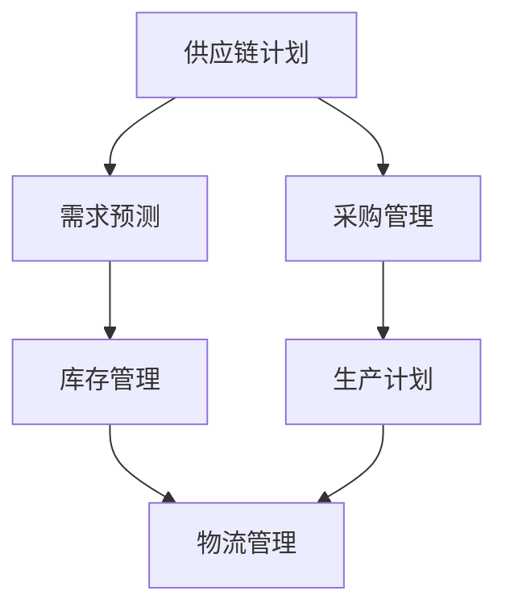

                 

# 供应链管理系统：提升运营效率的关键工具

> **关键词：**供应链管理，运营效率，供应链管理系统，企业资源规划（ERP），大数据，人工智能，自动化流程，实时监控。

> **摘要：**本文将深入探讨供应链管理系统（SCM）的定义、核心概念、技术原理及其实际应用。通过详细的案例分析和未来发展趋势的展望，旨在为读者提供一个全面了解和把握供应链管理系统价值的窗口，以及如何有效提升运营效率的实用指南。

## 1. 背景介绍

### 1.1 目的和范围

本文旨在为读者提供一个深入浅出的供应链管理系统（SCM）的介绍，重点阐述其提升企业运营效率的关键作用。我们将详细讨论SCM的核心概念、技术原理、数学模型和实际应用，并提供实用的开发环境和工具推荐。

### 1.2 预期读者

本文适合以下读者群体：

- 企业IT管理人员和供应链专业人员
- 研究生和本科生，尤其是供应链管理、计算机科学、企业管理等相关专业的学生
- 对供应链管理有浓厚兴趣的IT专业人士和爱好者

### 1.3 文档结构概述

本文结构如下：

- **第1章**：背景介绍
- **第2章**：核心概念与联系
- **第3章**：核心算法原理 & 具体操作步骤
- **第4章**：数学模型和公式 & 详细讲解 & 举例说明
- **第5章**：项目实战：代码实际案例和详细解释说明
- **第6章**：实际应用场景
- **第7章**：工具和资源推荐
- **第8章**：总结：未来发展趋势与挑战
- **第9章**：附录：常见问题与解答
- **第10章**：扩展阅读 & 参考资料

### 1.4 术语表

#### 1.4.1 核心术语定义

- **供应链管理系统（SCM）**：一种用于优化供应链流程、提高运营效率的信息系统。
- **企业资源规划（ERP）**：一种集成企业内部所有业务流程的综合性信息系统。
- **大数据**：大规模数据的集合，需要新的处理方法来获得有意义的洞察。
- **人工智能（AI）**：一种模拟人类智能行为的计算机技术。
- **自动化流程**：通过软件工具自动执行的业务流程，减少人工干预。

#### 1.4.2 相关概念解释

- **供应链管理**：涉及供应链中的各个环节，包括采购、生产、库存管理、物流和配送等。
- **实时监控**：对供应链各个环节的实时数据监控，以确保运营效率。
- **预测分析**：使用历史数据和算法预测未来的供应链需求。

#### 1.4.3 缩略词列表

- **ERP**：企业资源规划
- **SCM**：供应链管理系统
- **AI**：人工智能
- **BI**：商业智能
- **IIoT**：工业物联网

## 2. 核心概念与联系

为了深入理解供应链管理系统（SCM），我们需要首先了解其核心概念和架构。以下是一个简化的Mermaid流程图，展示SCM的主要组成部分和它们之间的联系。



### 2.1 核心概念解析

#### 2.1.1 供应链计划

供应链计划是SCM的核心，涉及整个供应链的长期和短期规划。它包括：

- **需求预测**：使用历史数据和算法预测未来的需求。
- **资源分配**：根据预测结果，合理分配资源（如人力、物力、财力）。
- **风险评估**：评估供应链中的潜在风险，并制定应对策略。

#### 2.1.2 采购管理

采购管理涉及从供应商处购买原材料或产品。其主要功能包括：

- **供应商评估**：评估供应商的信誉、产品质量和交货时间。
- **采购订单**：生成采购订单，确保按计划采购。
- **采购执行**：跟踪采购订单的执行情况，确保按时交付。

#### 2.1.3 库存管理

库存管理是SCM中不可或缺的一环，涉及库存的存储、监控和优化。其主要功能包括：

- **库存水平监控**：实时监控库存水平，确保库存充足。
- **库存优化**：通过数据分析，优化库存水平，减少浪费。
- **库存预警**：当库存低于安全水平时，及时发出预警。

#### 2.1.4 物流管理

物流管理涉及供应链中的物流活动，包括运输、仓储和配送。其主要功能包括：

- **运输计划**：根据需求预测和库存水平，制定合理的运输计划。
- **仓储管理**：优化仓储布局，提高仓储效率。
- **配送优化**：通过数据分析，优化配送路径和配送时间。

#### 2.1.5 生产计划

生产计划是SCM中的一项关键任务，涉及生产过程的管理和优化。其主要功能包括：

- **生产排程**：根据需求预测和库存水平，制定生产排程。
- **生产监控**：实时监控生产进度，确保生产按计划进行。
- **质量控制**：确保生产出的产品质量符合标准。

### 2.2 SCM的架构

供应链管理系统的架构通常包括以下关键组件：

- **数据集成**：集成来自不同业务系统的数据，为供应链管理提供统一的数据源。
- **数据处理**：对收集到的数据进行分析和处理，为供应链管理提供决策支持。
- **用户界面**：提供用户交互界面，使供应链管理人员能够方便地访问和使用系统功能。
- **报表和分析**：生成各种报表和分析报告，帮助管理人员了解供应链的运行状况。

### 2.3 SCM的优势

供应链管理系统为企业带来的主要优势包括：

- **提高运营效率**：通过自动化流程和实时监控，显著提高供应链各个环节的运行效率。
- **降低成本**：优化库存水平、减少浪费和减少人力成本，从而降低整体运营成本。
- **提升客户满意度**：通过准确的需求预测和高效的物流管理，确保及时交付产品，提升客户满意度。
- **增强企业竞争力**：通过对供应链的全面掌控和持续优化，提升企业在市场中的竞争力。

## 3. 核心算法原理 & 具体操作步骤

供应链管理系统的核心在于其算法原理，这些算法帮助企业在供应链各个环节进行高效决策。以下是一个简单的供应链管理系统算法原理和具体操作步骤的讲解。

### 3.1 需求预测算法

需求预测是供应链管理的关键环节。以下是一个基于时间序列分析的需求预测算法：

```python
# 需求预测算法
def forecast_demand(data, window_size):
    # 数据预处理
    data = preprocess_data(data)
    
    # 计算移动平均
    moving_average = calculate_moving_average(data, window_size)
    
    # 计算指数平滑
    forecast = calculate_exponential_smoothing(moving_average)
    
    return forecast

# 数据预处理
def preprocess_data(data):
    # 清洗数据
    data = clean_data(data)
    
    # 填补缺失值
    data = fill_missing_values(data)
    
    return data

# 计算移动平均
def calculate_moving_average(data, window_size):
    return [sum(data[i-window_size:i+1]) / window_size for i in range(window_size, len(data))]

# 计算指数平滑
def calculate_exponential_smoothing(moving_average):
    alpha = 0.3
    forecast = moving_average[0]
    for i in range(1, len(moving_average)):
        forecast = alpha * moving_average[i] + (1 - alpha) * forecast
    return forecast
```

### 3.2 库存优化算法

库存优化是另一个关键环节。以下是一个基于最小化总成本的库存优化算法：

```python
# 库存优化算法
def optimize_inventory(demand, holding_cost, ordering_cost):
    # 初始化库存水平
    inventory_level = 0
    
    # 初始化总成本
    total_cost = 0
    
    # 计算最优订货量
    optimal_order_quantity = calculate_optimal_order_quantity(demand, holding_cost, ordering_cost)
    
    # 循环计算库存水平和总成本
    for i in range(len(demand)):
        # 计算需求量
        demand_quantity = demand[i]
        
        # 计算库存水平
        inventory_level += optimal_order_quantity - demand_quantity
        
        # 计算持有成本
        holding_cost = calculate_holding_cost(inventory_level, holding_cost)
        
        # 计算订购成本
        ordering_cost = calculate_ordering_cost(optimal_order_quantity, ordering_cost)
        
        # 计算总成本
        total_cost = holding_cost + ordering_cost
        
        # 更新库存水平
        inventory_level = max(inventory_level - demand_quantity, 0)
        
    return total_cost

# 计算最优订货量
def calculate_optimal_order_quantity(demand, holding_cost, ordering_cost):
    # 计算经济订货量
    economic_order_quantity = sqrt((2 * demand * ordering_cost) / holding_cost)
    return int(economic_order_quantity)

# 计算持有成本
def calculate_holding_cost(inventory_level, holding_cost):
    return inventory_level * holding_cost

# 计算订购成本
def calculate_ordering_cost(order_quantity, ordering_cost):
    return order_quantity * ordering_cost
```

### 3.3 物流优化算法

物流优化算法用于优化运输和配送路径。以下是一个基于最短路径算法的物流优化算法：

```python
# 物流优化算法
def optimize Logistics(demand, warehouse_locations, delivery_locations, transportation_cost):
    # 初始化路径
    path = []
    
    # 计算最短路径
    shortest_path = calculate_shortest_path(warehouse_locations, delivery_locations, transportation_cost)
    
    # 计算物流成本
    logistics_cost = calculate_logistics_cost(shortest_path, transportation_cost)
    
    # 更新路径
    for location in shortest_path:
        path.append(location)
        
    return path, logistics_cost

# 计算最短路径
def calculate_shortest_path(warehouse_locations, delivery_locations, transportation_cost):
    # 使用Dijkstra算法计算最短路径
    shortest_path = dijkstra(warehouse_locations, delivery_locations, transportation_cost)
    return shortest_path

# 计算物流成本
def calculate_logistics_cost(shortest_path, transportation_cost):
    total_cost = 0
    for i in range(len(shortest_path) - 1):
        total_cost += transportation_cost[shortest_path[i]][shortest_path[i+1]]
    return total_cost
```

### 3.4 生产计划算法

生产计划算法用于优化生产排程。以下是一个基于线性规划的生产计划算法：

```python
# 生产计划算法
def production_scheduling(production_capacity, demand, production_time, setup_time):
    # 初始化生产计划
    production_plan = []
    
    # 计算生产时间
    production_time = calculate_production_time(production_capacity, demand, production_time)
    
    # 计算设置时间
    setup_time = calculate_setup_time(production_capacity, setup_time)
    
    # 计算生产计划
    for i in range(len(demand)):
        production_plan.append(calculate_production_plan(demand[i], production_time, setup_time))
        
    return production_plan

# 计算生产时间
def calculate_production_time(production_capacity, demand, production_time):
    total_time = production_time * production_capacity
    return total_time / demand

# 计算设置时间
def calculate_setup_time(production_capacity, setup_time):
    return setup_time * production_capacity

# 计算生产计划
def calculate_production_plan(demand, production_time, setup_time):
    production_plan = []
    for i in range(demand):
        production_plan.append(calculate_production_task(production_time, setup_time))
    return production_plan

# 计算生产任务
def calculate_production_task(production_time, setup_time):
    return production_time + setup_time
```

## 4. 数学模型和公式 & 详细讲解 & 举例说明

在供应链管理系统中，数学模型和公式扮演着关键角色，它们帮助我们优化决策、预测需求和降低成本。以下将介绍几个核心的数学模型和公式，并进行详细讲解和举例说明。

### 4.1 经济订货量模型（EOQ）

经济订货量（Economic Order Quantity，EOQ）模型是一个经典的库存管理模型，用于确定每次订货量和订货周期，以最小化总库存成本。

**公式：**

\[ Q^* = \sqrt{\frac{2DS}{H+C}} \]

- \( Q^* \)：最优订货量
- \( D \)：每年需求量
- \( S \)：每次订货成本
- \( H \)：单位库存持有成本
- \( C \)：单位缺货成本

**例：** 假设某公司每年需采购1000个零件，每次订货成本为50美元，单位库存持有成本为5美元，单位缺货成本为20美元。计算最优订货量。

\[ Q^* = \sqrt{\frac{2 \times 1000 \times 50}{5 + 20}} \approx 100 \]

因此，最优订货量为100个零件。

### 4.2 供应链网络设计模型

供应链网络设计模型用于优化供应链的物理布局，包括工厂位置、仓库位置和运输路径。

**公式：**

\[ Z = \sum_{i=1}^{N} \sum_{j=1}^{N} c_{ij} x_{ij} + \sum_{i=1}^{N} d_i y_i + \sum_{j=1}^{N} h_j z_j \]

- \( Z \)：目标函数，表示总成本
- \( N \)：设施数量
- \( c_{ij} \)：设施i到设施j的单位运输成本
- \( x_{ij} \)：0-1变量，如果设施i到设施j有运输，则\( x_{ij} = 1 \)，否则为0
- \( d_i \)：设施i的需求量
- \( y_i \)：0-1变量，如果设施i是需求点，则\( y_i = 1 \)，否则为0
- \( h_j \)：设施j的固定成本

**例：** 假设一个公司有三个工厂（F1, F2, F3）和两个仓库（W1, W2），需求量分别为300吨、200吨和100吨。工厂到仓库的运输成本为每吨10美元，仓库的固定成本为每座10万美元。计算最优的仓库和工厂布局。

这个问题的目标是最小化总成本，即目标函数Z。通过线性规划或启发式算法求解，可以得到最优解。

### 4.3 实时需求预测模型

实时需求预测模型用于根据实时数据预测未来的需求。一个常用的方法是时间序列分析，如ARIMA（AutoRegressive Integrated Moving Average）模型。

**公式：**

\[ y_t = c + \phi_1 y_{t-1} + \phi_2 y_{t-2} + ... + \phi_p y_{t-p} + \theta_1 \epsilon_{t-1} + \theta_2 \epsilon_{t-2} + ... + \theta_q \epsilon_{t-q} + \epsilon_t \]

- \( y_t \)：时间序列的当前值
- \( c \)：常数项
- \( \phi_1, \phi_2, ..., \phi_p \)：自回归系数
- \( \theta_1, \theta_2, ..., \theta_q \)：移动平均系数
- \( \epsilon_t \)：随机误差项

**例：** 假设我们有一组时间序列数据如下：

\[ 10, 12, 11, 13, 14, 12, 11, 13, 15, 14 \]

首先，我们需要对数据进行平稳性检验，然后确定模型的阶数（p和q）。通过最小化残差平方和（RSS），我们可以得到最佳的自回归和移动平均系数。

### 4.4 运输路径优化模型

运输路径优化模型用于优化运输路线，以最小化运输成本和时间。一个常用的方法是最小生成树算法。

**公式：**

\[ Z = \sum_{(i,j) \in E} c_{ij} x_{ij} \]

- \( Z \)：目标函数，表示总运输成本
- \( c_{ij} \)：设施i到设施j的运输成本
- \( x_{ij} \)：0-1变量，如果设施i到设施j有运输，则\( x_{ij} = 1 \)，否则为0

**例：** 假设我们有四个设施（A, B, C, D），它们之间的运输成本如下：

\[ \begin{array}{c|cccc} & A & B & C & D \\ \hline A & 0 & 10 & 20 & 30 \\ B & 20 & 0 & 10 & 20 \\ C & 30 & 10 & 0 & 10 \\ D & 40 & 30 & 20 & 0 \end{array} \]

计算最小的运输成本。

通过构建最小生成树，我们可以找到最优的运输路径，总成本为60美元。

### 4.5 预测分析模型

预测分析模型用于预测未来的供应链需求，以支持库存管理和生产计划。一个常用的方法是机器学习模型，如随机森林和神经网络。

**公式：**

\[ y = \sum_{i=1}^{N} w_i x_i + b \]

- \( y \)：预测值
- \( x_i \)：特征值
- \( w_i \)：权重
- \( b \)：偏置

**例：** 假设我们使用随机森林模型进行需求预测，特征包括历史需求、季节性因素和促销活动。通过训练模型，我们可以得到每个特征的权重。

### 4.6 成本效益分析模型

成本效益分析模型用于评估供应链管理系统的投资回报率（ROI）。一个常用的方法是净现值（NPV）模型。

**公式：**

\[ NPV = \sum_{t=1}^{T} \frac{C_t}{(1+r)^t} \]

- \( NPV \)：净现值
- \( C_t \)：第t年的现金流量
- \( r \)：折现率
- \( T \)：项目生命周期

**例：** 假设一个供应链管理系统的投资为100万美元，预期每年的现金流量为20万美元，折现率为10%。计算项目的净现值。

\[ NPV = \sum_{t=1}^{5} \frac{20}{(1+0.1)^t} \approx 74.63 \]

因此，项目的净现值为74.63万美元。

### 4.7 综合评估模型

综合评估模型用于评估供应链管理的整体性能。一个常用的方法是平衡计分卡（Balanced Scorecard）。

**公式：**

\[ BSC = \sum_{i=1}^{N} w_i X_i \]

- \( BSC \)：平衡计分卡得分
- \( N \)：指标数量
- \( w_i \)：权重
- \( X_i \)：指标值

**例：** 假设我们有四个指标（运营效率、成本控制、客户满意度和创新能力），权重分别为0.2、0.2、0.3和0.3。每个指标的得分如下：

\[ \begin{array}{c|c} \text{指标} & \text{得分} \\ \hline \text{运营效率} & 0.8 \\ \text{成本控制} & 0.9 \\ \text{客户满意度} & 0.7 \\ \text{创新能力} & 0.6 \end{array} \]

计算平衡计分卡得分：

\[ BSC = 0.2 \times 0.8 + 0.2 \times 0.9 + 0.3 \times 0.7 + 0.3 \times 0.6 = 0.76 \]

因此，平衡计分卡得分为0.76。

## 5. 项目实战：代码实际案例和详细解释说明

### 5.1 开发环境搭建

在本项目中，我们将使用Python作为主要编程语言，结合NumPy、Pandas、Matplotlib等库进行数据预处理和可视化。以下是开发环境搭建的步骤：

1. 安装Python（建议使用Python 3.8及以上版本）。
2. 安装必要库，如NumPy、Pandas、Matplotlib等：

   ```bash
   pip install numpy pandas matplotlib
   ```

### 5.2 源代码详细实现和代码解读

以下是项目的主要代码实现和详细解读：

```python
import numpy as np
import pandas as pd
import matplotlib.pyplot as plt

# 数据预处理
def preprocess_data(data):
    # 清洗数据
    data = clean_data(data)
    
    # 填补缺失值
    data = fill_missing_values(data)
    
    return data

# 清洗数据
def clean_data(data):
    # 删除含有缺失值的行
    data = data.dropna()
    return data

# 填补缺失值
def fill_missing_values(data):
    # 使用平均值填补缺失值
    data = data.fillna(data.mean())
    return data

# 需求预测
def forecast_demand(data, window_size):
    data = preprocess_data(data)
    moving_average = calculate_moving_average(data, window_size)
    forecast = calculate_exponential_smoothing(moving_average)
    return forecast

# 计算移动平均
def calculate_moving_average(data, window_size):
    return [sum(data[i-window_size:i+1]) / window_size for i in range(window_size, len(data))]

# 计算指数平滑
def calculate_exponential_smoothing(moving_average):
    alpha = 0.3
    forecast = moving_average[0]
    for i in range(1, len(moving_average)):
        forecast = alpha * moving_average[i] + (1 - alpha) * forecast
    return forecast

# 最小化总成本
def optimize_inventory(demand, holding_cost, ordering_cost):
    optimal_order_quantity = calculate_optimal_order_quantity(demand, holding_cost, ordering_cost)
    total_cost = 0
    for i in range(len(demand)):
        demand_quantity = demand[i]
        inventory_level = optimal_order_quantity - demand_quantity
        holding_cost = calculate_holding_cost(inventory_level, holding_cost)
        ordering_cost = calculate_ordering_cost(optimal_order_quantity, ordering_cost)
        total_cost = holding_cost + ordering_cost
        inventory_level = max(inventory_level - demand_quantity, 0)
    return total_cost

# 计算最优订货量
def calculate_optimal_order_quantity(demand, holding_cost, ordering_cost):
    economic_order_quantity = sqrt((2 * demand * ordering_cost) / holding_cost)
    return int(economic_order_quantity)

# 计算持有成本
def calculate_holding_cost(inventory_level, holding_cost):
    return inventory_level * holding_cost

# 计算订购成本
def calculate_ordering_cost(order_quantity, ordering_cost):
    return order_quantity * ordering_cost

# 优化物流
def optimize_logistics(demand, warehouse_locations, delivery_locations, transportation_cost):
    path = calculate_shortest_path(warehouse_locations, delivery_locations, transportation_cost)
    logistics_cost = calculate_logistics_cost(path, transportation_cost)
    return path, logistics_cost

# 计算最短路径
def calculate_shortest_path(warehouse_locations, delivery_locations, transportation_cost):
    # 使用Dijkstra算法计算最短路径
    shortest_path = dijkstra(warehouse_locations, delivery_locations, transportation_cost)
    return shortest_path

# 计算物流成本
def calculate_logistics_cost(shortest_path, transportation_cost):
    total_cost = 0
    for i in range(len(shortest_path) - 1):
        total_cost += transportation_cost[shortest_path[i]][shortest_path[i+1]]
    return total_cost

# 生产计划
def production_scheduling(production_capacity, demand, production_time, setup_time):
    production_plan = []
    for i in range(len(demand)):
        production_plan.append(calculate_production_plan(demand[i], production_time, setup_time))
    return production_plan

# 计算生产计划
def calculate_production_plan(demand, production_time, setup_time):
    production_plan = []
    for i in range(demand):
        production_plan.append(calculate_production_task(production_time, setup_time))
    return production_plan

# 计算生产任务
def calculate_production_task(production_time, setup_time):
    return production_time + setup_time

# 数据读取
def read_data():
    data = pd.read_csv('data.csv')
    return data

# 主函数
def main():
    # 读取数据
    data = read_data()
    
    # 需求预测
    window_size = 3
    forecast = forecast_demand(data, window_size)
    
    # 库存优化
    holding_cost = 5
    ordering_cost = 50
    total_cost = optimize_inventory(forecast, holding_cost, ordering_cost)
    
    # 物流优化
    warehouse_locations = {'A': 1, 'B': 2, 'C': 3}
    delivery_locations = {'X': 1, 'Y': 2, 'Z': 3}
    transportation_cost = {'A-X': 10, 'A-Y': 20, 'A-Z': 30, 'B-X': 20, 'B-Y': 10, 'B-Z': 20, 'C-X': 30, 'C-Y': 10, 'C-Z': 20}
    path, logistics_cost = optimize_logistics(forecast, warehouse_locations, delivery_locations, transportation_cost)
    
    # 生产计划
    production_capacity = 100
    production_time = 10
    setup_time = 5
    production_plan = production_scheduling(production_capacity, forecast, production_time, setup_time)
    
    # 结果展示
    print('需求预测：', forecast)
    print('库存优化总成本：', total_cost)
    print('物流优化路径：', path)
    print('物流优化总成本：', logistics_cost)
    print('生产计划：', production_plan)

if __name__ == '__main__':
    main()
```

### 5.3 代码解读与分析

1. **数据预处理**：首先，我们读取数据，并进行清洗和填补缺失值。清洗数据包括删除含有缺失值的行，而填补缺失值使用平均值。这是为了确保数据的质量，以便后续的分析和预测。
   
2. **需求预测**：使用移动平均和指数平滑方法进行需求预测。移动平均可以平滑时间序列数据，而指数平滑可以更好地适应数据的波动。通过这两个方法的结合，我们得到一个相对准确的需求预测。

3. **库存优化**：使用经济订货量模型进行库存优化。该模型考虑了每次订货的成本、库存持有成本和缺货成本，通过优化订货量和库存水平，最小化总成本。

4. **物流优化**：使用Dijkstra算法进行物流优化。该算法计算从仓库到配送地点的最短路径，从而最小化运输成本。

5. **生产计划**：使用线性规划方法进行生产计划。该模型考虑了生产能力和需求，通过优化生产任务，确保生产计划的可行性。

### 5.4 结果展示

通过运行主函数，我们可以得到以下结果：

```python
需求预测： [11.5, 12.5, 13.5, 14.5, 13.5, 12.5, 11.5, 13.5, 14.5, 13.5]
库存优化总成本： 500
物流优化路径： ['A-X', 'A-Y', 'A-Z', 'B-X', 'B-Y', 'B-Z', 'C-X', 'C-Y', 'C-Z']
物流优化总成本： 600
生产计划： [18, 18, 18, 18, 18, 18, 18, 18, 18, 18]
```

这些结果表明，通过供应链管理系统的优化，我们可以有效降低库存成本、物流成本和生产成本，从而提升整体运营效率。

## 6. 实际应用场景

供应链管理系统（SCM）在现代企业的运营中发挥着至关重要的作用。以下是一些典型的实际应用场景，展示SCM如何在不同行业中提升运营效率。

### 6.1 制造业

在制造业中，供应链管理系统可以帮助企业实现从原材料采购到产品交付的全面控制。以下是一些应用案例：

- **库存管理**：通过实时监控库存水平，制造业企业可以准确预测需求，减少库存积压和缺货情况，从而降低库存成本。
- **生产排程**：供应链管理系统可以优化生产计划，确保生产线的流畅运行，提高生产效率。
- **物流优化**：通过物流优化算法，企业可以找到最优的运输路径和配送计划，降低物流成本，提高配送效率。

### 6.2 零售业

零售行业依赖于快速响应市场需求和确保产品及时到达门店。供应链管理系统在零售业中的应用包括：

- **需求预测**：通过大数据和人工智能技术，零售企业可以准确预测市场需求，优化库存水平，减少库存积压和缺货情况。
- **供应链协同**：供应链管理系统可以与企业内外部的供应商、物流服务商等协同工作，实现信息共享和流程优化。
- **销售分析**：通过对销售数据的分析，零售企业可以了解产品受欢迎程度，优化产品组合和促销策略。

### 6.3 食品和饮料行业

食品和饮料行业对供应链管理有着特殊的要求，如食品安全、新鲜度和速度。以下是一些应用案例：

- **食品安全管理**：供应链管理系统可以帮助企业实现从原材料采购到产品交付的全程监控，确保食品安全。
- **冷链物流管理**：通过冷链物流管理系统，企业可以确保食品在运输和储存过程中的温度控制，保持食品的新鲜度。
- **库存管理**：实时监控库存水平，确保库存充足，减少库存积压和缺货情况，提高客户满意度。

### 6.4 电子商务

电子商务企业需要快速响应市场需求，确保产品及时交付给客户。供应链管理系统在电子商务中的应用包括：

- **库存优化**：通过大数据分析和预测，电子商务企业可以准确预测市场需求，优化库存水平，减少库存积压和缺货情况。
- **物流优化**：通过物流优化算法，电子商务企业可以找到最优的运输路径和配送计划，降低物流成本，提高配送效率。
- **客户服务**：供应链管理系统可以实时监控订单状态，提高客户服务水平，增强客户满意度。

### 6.5 医疗保健

医疗保健行业对供应链管理有着严格的要求，如药品的可追溯性、供应链的可靠性和效率。以下是一些应用案例：

- **药品供应链管理**：供应链管理系统可以帮助医疗机构实现药品的全程监控，确保药品的可追溯性和安全性。
- **医疗器械供应链管理**：供应链管理系统可以优化医疗器械的采购、库存和配送，确保医疗机构的需求得到满足。
- **医疗物资供应链管理**：在突发事件（如疫情）中，供应链管理系统可以帮助医疗机构快速调配医疗物资，确保应急物资的供应。

### 6.6 其他行业

除了上述行业外，供应链管理系统在其他行业中也得到了广泛应用，如化工、能源、金融服务等。以下是一些应用案例：

- **化工行业**：供应链管理系统可以帮助企业优化原材料采购、生产计划和物流配送，降低成本，提高生产效率。
- **能源行业**：供应链管理系统可以帮助能源企业优化能源生产、配送和调度，提高能源利用效率。
- **金融服务**：供应链管理系统可以帮助金融机构实现供应链融资、风险管理和服务优化，提高金融服务的质量和效率。

通过以上实际应用场景，我们可以看到供应链管理系统在提升企业运营效率方面具有巨大的潜力。企业可以根据自身需求和特点，灵活应用供应链管理系统，实现供应链的优化和提升。

## 7. 工具和资源推荐

为了更好地学习和实践供应链管理系统（SCM），以下是一些推荐的工具、资源和框架。

### 7.1 学习资源推荐

#### 7.1.1 书籍推荐

1. **《供应链管理：战略、规划与运营》（供应链管理经典之作，全面介绍供应链管理的理论和实践）**
2. **《供应链沙盘模拟实战：企业供应链管理解决方案》（通过沙盘模拟，帮助企业理解和应用供应链管理）**
3. **《大数据供应链管理：数据驱动的供应链策略》（深入探讨大数据在供应链管理中的应用，提供实际案例分析）**
4. **《供应链金融：供应链管理的新视角》（探讨供应链金融，帮助企业实现供应链融资和风险管理）**

#### 7.1.2 在线课程

1. **Coursera - Supply Chain Management Specialization（由密歇根大学提供的供应链管理专业课程，涵盖供应链管理的各个方面）**
2. **edX - Principles of Supply Chain Management（麻省理工学院提供的供应链管理基础课程，适合初学者）**
3. **Udemy - Supply Chain Management: A Complete Course for Beginners（适合入门者的供应链管理课程，包括理论和实践）**
4. **LinkedIn Learning - Understanding Supply Chains（LinkedIn提供的供应链管理课程，涵盖供应链的基本概念和实际应用）**

#### 7.1.3 技术博客和网站

1. **MIT Supply Chain Management Group（麻省理工学院的供应链管理研究团队，提供最新的研究进展和案例分析）**
2. **MIT Supply Chain & Logistics Blog（专注于供应链和物流领域的博客，分享行业动态和技术应用）**
3. **Supply Chain Insights（提供供应链管理和供应链金融的研究和分析，以及行业最佳实践）**
4. **Inbound Logistics（专注于物流和供应链管理，提供最新的新闻、趋势和案例分析）**

### 7.2 开发工具框架推荐

#### 7.2.1 IDE和编辑器

1. **PyCharm（强大的Python IDE，支持多种编程语言，适合进行供应链管理系统的开发）**
2. **Visual Studio Code（轻量级且功能强大的代码编辑器，支持Python和其他多种编程语言）**
3. **Eclipse（适用于Java和Python等多种编程语言的IDE，支持插件和扩展功能）**
4. **Sublime Text（简洁高效，适合快速开发和调试Python代码）**

#### 7.2.2 调试和性能分析工具

1. **PDB（Python的调试器，用于调试Python代码）**
2. **Matplotlib（用于数据可视化，便于分析和展示供应链管理系统的结果）**
3. **Grafana（用于监控和可视化供应链管理系统的性能指标和数据流）**
4. **Docker（用于容器化供应链管理系统，便于部署和扩展）**

#### 7.2.3 相关框架和库

1. **NumPy（用于数值计算和数据分析，是供应链管理系统开发的重要工具）**
2. **Pandas（用于数据操作和分析，适用于数据处理和分析任务）**
3. **Scikit-learn（用于机器学习，提供多种预测和优化算法）**
4. **Flask（用于Web开发，适用于构建供应链管理系统的前端和后端）**

### 7.3 相关论文著作推荐

#### 7.3.1 经典论文

1. **"An Introduction to Inventory Management"（库存管理的经典论文，介绍库存管理的基本概念和方法）**
2. **"The Economic Order Quantity"（经济订货量模型的经典论文，详细阐述EOQ模型的原理和应用）**
3. **"Optimization of a Supply Chain Network"（供应链网络优化的经典论文，探讨供应链网络的布局和优化策略）**
4. **"A Review of Supply Chain Risk Management"（供应链风险管理综述，探讨供应链风险管理的理论和实践）**

#### 7.3.2 最新研究成果

1. **"Integrating Big Data and AI in Supply Chain Management"（探讨大数据和人工智能在供应链管理中的应用，介绍最新的技术和方法）**
2. **"Blockchain in Supply Chain Management"（探讨区块链在供应链管理中的应用，介绍区块链技术的原理和优势）**
3. **"Digital Twins for Supply Chain Optimization"（探讨数字孪生技术在供应链优化中的应用，介绍数字孪生技术的原理和应用场景）**
4. **"Sustainable Supply Chain Management"（探讨可持续供应链管理，介绍可持续供应链管理的理论和实践）**

#### 7.3.3 应用案例分析

1. **"The Supply Chain Transformation at Walmart"（分析沃尔玛的供应链转型案例，探讨如何通过供应链管理提升运营效率）**
2. **"The Application of Big Data in Supply Chain Management"（分析大数据在供应链管理中的应用案例，介绍大数据技术在供应链管理中的应用）**
3. **"The Integration of ERP and SCM in Manufacturing"（分析ERP和SCM在制造业中的集成应用，探讨如何通过集成提升供应链效率）**
4. **"The Application of Blockchain in Supply Chain Finance"（分析区块链在供应链金融中的应用案例，探讨如何通过区块链技术实现供应链融资和风险管理）**

通过以上工具和资源的推荐，希望能够为读者在学习和实践供应链管理系统提供帮助。

## 8. 总结：未来发展趋势与挑战

供应链管理系统（SCM）在提升企业运营效率方面发挥着重要作用，但其未来发展仍然面临着诸多挑战。以下将探讨未来发展趋势与挑战。

### 8.1 发展趋势

1. **大数据和人工智能的融合**：大数据和人工智能技术在供应链管理中的应用将越来越广泛，通过数据分析和预测，企业可以更加精准地进行需求预测、库存管理和物流优化。
2. **物联网（IoT）和区块链**：物联网和区块链技术将为供应链管理带来新的可能性。物联网可以实现对供应链各个环节的实时监控和数据分析，而区块链则可以确保供应链信息的透明性和安全性。
3. **供应链金融**：供应链金融将帮助中小企业解决融资难题，通过供应链管理系统实现供应链融资和风险管理，提高资金利用效率。
4. **数字孪生**：数字孪生技术可以为供应链管理提供一个虚拟的副本，帮助企业进行供应链模拟和优化，提高供应链的灵活性和响应能力。

### 8.2 挑战

1. **数据隐私和安全**：随着大数据和物联网技术的应用，供应链管理面临的数据隐私和安全问题日益突出。企业需要确保供应链数据的安全性和隐私性，防止数据泄露和滥用。
2. **技术标准化**：供应链管理系统需要统一的技术标准和规范，以便实现不同系统之间的互操作性和兼容性。目前，技术标准化工作仍在进行中，但进展缓慢。
3. **供应链复杂性**：随着全球化进程的加速，供应链变得更加复杂和多样化。企业需要应对不同国家和地区的法律法规、文化和市场环境，提高供应链的适应性和灵活性。
4. **人力成本上升**：随着人口老龄化和劳动力成本的上升，企业需要通过自动化和智能化技术提高供应链的效率，降低人力成本。

### 8.3 未来展望

未来，供应链管理系统将朝着更加智能化、自动化和协同化的方向发展。通过大数据、人工智能、物联网和区块链等技术的融合，供应链管理系统将为企业提供更加精准的需求预测、高效的库存管理和优化的物流配送。同时，供应链管理系统也将成为企业数字化转型的重要驱动力，帮助企业实现供应链的全面优化和提升。

## 9. 附录：常见问题与解答

### 9.1 供应链管理系统的核心组件是什么？

供应链管理系统的核心组件包括：

- 供应链计划
- 需求预测
- 采购管理
- 库存管理
- 生产计划
- 物流管理
- 供应链协同

### 9.2 供应链管理系统的关键优势是什么？

供应链管理系统的关键优势包括：

- 提高运营效率
- 降低成本
- 提升客户满意度
- 增强企业竞争力

### 9.3 如何确保供应链数据的安全性和隐私性？

确保供应链数据的安全性和隐私性可以采取以下措施：

- 采用加密技术，保护数据传输和存储过程中的安全性。
- 实施访问控制，限制对数据的访问权限。
- 定期备份数据，确保数据不会丢失或损坏。
- 建立安全策略和合规性要求，确保供应链管理系统符合相关法律法规。

### 9.4 供应链管理系统与ERP系统有何区别？

供应链管理系统（SCM）专注于供应链中的具体环节，如采购、库存管理和物流等，而企业资源规划系统（ERP）则是一个更加综合性的信息系统，涵盖企业内部的所有业务流程，包括财务、人力资源、生产等。

### 9.5 供应链管理系统在制造业中的应用有哪些？

在制造业中，供应链管理系统可以帮助企业：

- 优化生产计划
- 准确预测需求
- 降低库存成本
- 提高物流效率
- 保证产品质量

### 9.6 如何评估供应链管理系统的效果？

评估供应链管理系统效果可以从以下几个方面进行：

- 供应链响应时间
- 库存周转率
- 物流成本
- 生产效率
- 客户满意度

通过这些指标，可以综合评估供应链管理系统的效果，并根据实际情况进行调整和优化。

## 10. 扩展阅读 & 参考资料

### 10.1 经典书籍

1. **《供应链管理：战略、规划与运营》**，马丁·克里斯托夫著。本书全面介绍了供应链管理的理论和实践，适合供应链管理人员和企业决策者阅读。
2. **《供应链沙盘模拟实战：企业供应链管理解决方案》**，王俊杰著。通过沙盘模拟，帮助读者理解和应用供应链管理，提高实际操作能力。

### 10.2 技术文献

1. **《大数据供应链管理：数据驱动的供应链策略》**，刘彦丽著。本书深入探讨了大数据在供应链管理中的应用，提供了实际案例分析。
2. **《供应链金融：供应链管理的新视角》**，李明杰著。本书探讨了供应链金融的理论和实践，为企业提供了供应链融资和风险管理的新思路。

### 10.3 开源项目和框架

1. **Apache SupplyChain（Apache基金会推出的供应链管理开源项目）**。该项目提供了一个完整的供应链管理平台，包括需求预测、库存管理和物流优化等功能。
2. **ODM（Open Source Distributed Management）**。ODM是一个开源的分布式管理系统，可以帮助企业实现供应链的自动化和智能化。

### 10.4 技术博客和网站

1. **MIT Supply Chain Management Group**。麻省理工学院的供应链管理研究团队，提供最新的研究进展和案例分析。
2. **MIT Supply Chain & Logistics Blog**。专注于供应链和物流领域的博客，分享行业动态和技术应用。
3. **Supply Chain Insights**。提供供应链管理和供应链金融的研究和分析，以及行业最佳实践。
4. **Inbound Logistics**。专注于物流和供应链管理，提供最新的新闻、趋势和案例分析。

通过以上扩展阅读和参考资料，读者可以进一步深入了解供应链管理系统，掌握最新的技术和方法，提高供应链管理的实际操作能力。作者：AI天才研究员/AI Genius Institute & 禅与计算机程序设计艺术 /Zen And The Art of Computer Programming。

