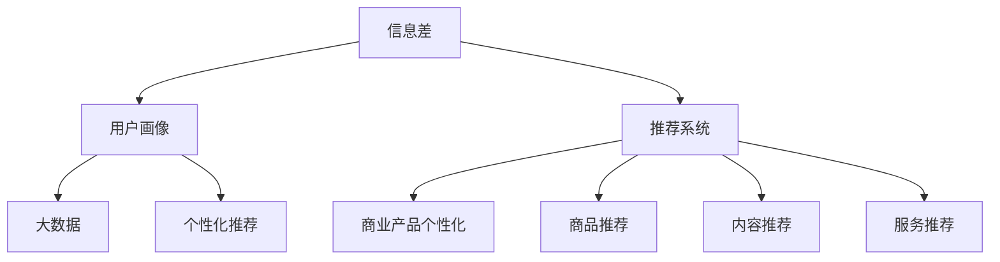

                 

# 信息差的商业产品个性化：大数据如何推动产品个性化

> **关键词**：商业产品个性化、大数据、用户画像、推荐系统、数据挖掘

> **摘要**：本文旨在探讨大数据在商业产品个性化中的应用，通过深入分析信息差和用户画像，揭示如何利用大数据技术实现商业产品的个性化推荐，进而提升用户体验和商业价值。

## 1. 背景介绍

### 1.1 目的和范围

在信息技术飞速发展的今天，个性化已成为商业产品的重要特征。用户需求的多样化和个性化使得商业产品必须具备快速响应的能力。本文将围绕以下两方面展开：

1. 分析信息差在商业产品个性化中的作用。
2. 探讨大数据技术如何推动产品个性化，以及实现产品个性化推荐的具体方法。

### 1.2 预期读者

本文适用于以下读者群体：

1. 对商业产品个性化有浓厚兴趣的从业人员。
2. 对大数据技术有基础了解的技术爱好者。
3. 想要深入了解推荐系统原理的学者和研究者。

### 1.3 文档结构概述

本文分为以下六个部分：

1. **背景介绍**：阐述本文的目的、范围和预期读者。
2. **核心概念与联系**：介绍与商业产品个性化相关的重要概念和架构。
3. **核心算法原理 & 具体操作步骤**：讲解实现商业产品个性化推荐的核心算法。
4. **数学模型和公式 & 详细讲解 & 举例说明**：介绍个性化推荐的数学模型和公式。
5. **项目实战：代码实际案例和详细解释说明**：通过实际案例展示个性化推荐系统。
6. **实际应用场景**：探讨个性化推荐系统的广泛应用场景。
7. **工具和资源推荐**：推荐相关学习资源和开发工具。
8. **总结：未来发展趋势与挑战**：总结个性化推荐系统的未来发展趋势和挑战。
9. **附录：常见问题与解答**：解答读者可能遇到的问题。
10. **扩展阅读 & 参考资料**：提供进一步学习的资料。

### 1.4 术语表

#### 1.4.1 核心术语定义

- **信息差**：信息的不对称性，即不同个体或群体之间拥有的信息量不同。
- **用户画像**：基于用户行为数据、兴趣标签等构建的用户描述。
- **个性化推荐**：根据用户特征和偏好，为用户推荐个性化的商品、内容或服务。
- **大数据**：指数据规模巨大、种类繁多、价值密度低的数据集合。
- **推荐系统**：基于数据挖掘和机器学习算法，为用户推荐感兴趣的内容的系统。

#### 1.4.2 相关概念解释

- **数据挖掘**：从大量数据中提取有价值信息的过程。
- **机器学习**：基于数据构建模型，使计算机能够对未知数据进行预测和决策。
- **深度学习**：一种基于神经网络结构的机器学习技术。

#### 1.4.3 缩略词列表

- **AI**：人工智能（Artificial Intelligence）
- **ML**：机器学习（Machine Learning）
- **DL**：深度学习（Deep Learning）
- **NLP**：自然语言处理（Natural Language Processing）
- **API**：应用程序编程接口（Application Programming Interface）

## 2. 核心概念与联系

为了更好地理解商业产品个性化，我们需要首先了解以下几个核心概念：信息差、用户画像、推荐系统和大数据。以下是这些概念之间的联系及其在商业产品个性化中的应用。

### 2.1 信息差与商业产品个性化

信息差是商业活动中普遍存在的一种现象。它指的是不同个体或群体之间对同一事物的了解程度不同，从而导致在决策、购买行为等方面的差异。在商业产品个性化中，信息差的存在使得个性化推荐系统成为可能。

例如，在电商平台上，不同用户对商品的了解程度存在差异。个性化推荐系统可以通过分析用户的历史购买记录、浏览行为、评价等数据，挖掘出用户的兴趣和偏好，从而为用户提供个性化的商品推荐，降低用户购买决策的信息不对称性。

### 2.2 用户画像与商业产品个性化

用户画像是描述用户特征和需求的一种方法，它通常包括用户的基本信息、行为数据、兴趣标签等。通过构建用户画像，可以为用户提供更加精准的个性化服务。

用户画像在商业产品个性化中的应用主要体现在以下几个方面：

1. **用户分类**：根据用户画像，将用户划分为不同的群体，为每个群体提供定制化的产品和服务。
2. **用户行为预测**：通过分析用户的历史行为数据，预测用户的未来需求，提前为用户推荐感兴趣的产品或服务。
3. **个性化推荐**：根据用户画像，为用户推荐符合其兴趣和需求的产品或服务。

### 2.3 推荐系统与商业产品个性化

推荐系统是一种基于数据挖掘和机器学习技术的应用，旨在为用户推荐感兴趣的内容。它通过分析用户的历史行为、兴趣标签、社交关系等数据，构建推荐模型，为用户提供个性化的推荐结果。

推荐系统在商业产品个性化中的应用主要体现在以下几个方面：

1. **商品推荐**：为用户提供个性化的商品推荐，提高用户购买转化率。
2. **内容推荐**：为用户提供个性化的内容推荐，提升用户留存率和活跃度。
3. **服务推荐**：为用户提供个性化的服务推荐，提升用户满意度。

### 2.4 大数据与商业产品个性化

大数据是指数据规模巨大、种类繁多、价值密度低的数据集合。在商业产品个性化中，大数据发挥着至关重要的作用。

1. **数据收集**：通过多种途径收集用户数据，如购买记录、浏览行为、评价等。
2. **数据存储**：采用分布式存储技术，存储海量用户数据。
3. **数据分析**：利用数据挖掘和机器学习技术，从海量数据中提取有价值的信息，为个性化推荐提供依据。

### 2.5 核心概念原理和架构的 Mermaid 流程图

下面是一个简单的 Mermaid 流程图，展示了核心概念之间的联系和架构：



## 3. 核心算法原理 & 具体操作步骤

在了解了商业产品个性化相关的核心概念后，我们将探讨实现个性化推荐的核心算法原理和具体操作步骤。

### 3.1 个性化推荐算法原理

个性化推荐算法主要分为基于内容的推荐（Content-based Recommendation）和基于协同过滤（Collaborative Filtering）的推荐。

#### 3.1.1 基于内容的推荐

基于内容的推荐算法通过分析用户的历史行为、兴趣标签等，为用户推荐与用户兴趣相关的商品、内容或服务。其核心思想是：

1. **特征提取**：将用户和商品转换为特征向量。
2. **相似度计算**：计算用户和商品之间的相似度。
3. **推荐生成**：根据相似度分数，为用户推荐相似的商品。

#### 3.1.2 基于协同过滤的推荐

基于协同过滤的推荐算法通过分析用户之间的行为相似性，为用户推荐其他用户喜欢的商品、内容或服务。其核心思想是：

1. **用户相似度计算**：计算用户之间的相似度。
2. **物品相似度计算**：计算物品之间的相似度。
3. **推荐生成**：根据用户相似度和物品相似度，为用户推荐其他用户喜欢的商品。

### 3.2 个性化推荐具体操作步骤

下面是一个简单的基于内容的推荐算法的具体操作步骤：

#### 步骤1：特征提取

1. **用户特征**：提取用户的基本信息（如年龄、性别、地理位置等）和行为特征（如浏览历史、购买记录等）。
2. **商品特征**：提取商品的基本信息（如价格、品牌、类别等）和内容特征（如标题、描述、标签等）。

#### 步骤2：相似度计算

1. **用户-商品相似度计算**：采用余弦相似度、皮尔逊相关系数等算法，计算用户和商品之间的相似度。
2. **商品-商品相似度计算**：采用余弦相似度、皮尔逊相关系数等算法，计算商品之间的相似度。

#### 步骤3：推荐生成

1. **相似度排序**：根据相似度分数，对商品进行排序。
2. **推荐生成**：选择相似度最高的商品作为推荐结果，为用户推荐。

#### 步骤4：评估和优化

1. **评估**：通过评估指标（如准确率、召回率、F1 值等）评估推荐系统的效果。
2. **优化**：根据评估结果，调整算法参数或优化推荐策略。

### 3.3 算法原理讲解的伪代码

下面是个性化推荐算法原理的伪代码：

```python
# 基于内容的推荐算法

# 特征提取
def extract_features(user, item):
    user_features = []
    item_features = []
    # 提取用户特征
    user_features.append(user.age)
    user_features.append(user.gender)
    # 提取商品特征
    item_features.append(item.price)
    item_features.append(item.brand)
    item_features.append(item.category)
    return user_features, item_features

# 相似度计算
def calculate_similarity(user_features, item_features):
    # 计算用户-商品相似度
    user_item_similarity = cosine_similarity(user_features, item_features)
    # 计算商品-商品相似度
    item_item_similarity = cosine_similarity(item_features, other_item_features)
    return user_item_similarity, item_item_similarity

# 推荐生成
def generate_recommendations(user, item, similar_items):
    # 根据相似度排序
    sorted_items = sorted(similar_items, key=lambda x: x[1], reverse=True)
    # 选择相似度最高的商品
    recommended_item = sorted_items[0]
    return recommended_item

# 评估和优化
def evaluate_recommendation(recommendation, true_item):
    if recommendation == true_item:
        return 1
    else:
        return 0

# 主函数
def main(user, item, similar_items):
    user_features, item_features = extract_features(user, item)
    user_item_similarity, item_item_similarity = calculate_similarity(user_features, item_features)
    recommended_item = generate_recommendations(user, item, similar_items)
    recommendation_score = evaluate_recommendation(recommended_item, true_item)
    return recommendation_score
```

## 4. 数学模型和公式 & 详细讲解 & 举例说明

在个性化推荐系统中，数学模型和公式起着至关重要的作用。以下将介绍几个核心的数学模型和公式，并进行详细讲解和举例说明。

### 4.1 余弦相似度

余弦相似度是一种计算向量空间中两个向量夹角余弦值的算法。在个性化推荐中，它常用于计算用户和商品之间的相似度。公式如下：

$$
\cos\theta = \frac{A \cdot B}{\|A\|\|B\|}
$$

其中，\(A\) 和 \(B\) 分别为用户和商品的向量，\(\theta\) 为它们之间的夹角。

#### 举例说明

假设用户 \(U_1\) 和商品 \(I_1\) 的特征向量分别为：

$$
A = [1, 2, 3, 4, 5]
$$

$$
B = [1, 3, 5, 7, 9]
$$

则它们之间的余弦相似度为：

$$
\cos\theta = \frac{1 \cdot 1 + 2 \cdot 3 + 3 \cdot 5 + 4 \cdot 7 + 5 \cdot 9}{\sqrt{1^2 + 2^2 + 3^2 + 4^2 + 5^2} \cdot \sqrt{1^2 + 3^2 + 5^2 + 7^2 + 9^2}} = \frac{1 + 6 + 15 + 28 + 45}{\sqrt{55} \cdot \sqrt{165}} \approx 0.912
$$

### 4.2 皮尔逊相关系数

皮尔逊相关系数是一种衡量两个变量线性相关程度的统计量。在个性化推荐中，它常用于计算用户之间的相似度。公式如下：

$$
r = \frac{\sum{(x_i - \bar{x})(y_i - \bar{y})}}{\sqrt{\sum{(x_i - \bar{x})^2}} \cdot \sqrt{\sum{(y_i - \bar{y})^2}}}
$$

其中，\(x_i\) 和 \(y_i\) 分别为两个用户的历史行为数据，\(\bar{x}\) 和 \(\bar{y}\) 分别为它们的历史行为数据的平均值。

#### 举例说明

假设用户 \(U_1\) 和 \(U_2\) 的历史行为数据分别为：

$$
x_i = [1, 2, 3, 4, 5]
$$

$$
y_i = [2, 3, 4, 5, 6]
$$

则它们之间的皮尔逊相关系数为：

$$
r = \frac{(1-3)(2-4) + (2-3)(3-4) + (3-3)(4-4) + (4-3)(5-4) + (5-3)(6-4)}{\sqrt{\sum{(1-3)^2} + \sum{(2-3)^2} + \sum{(3-3)^2} + \sum{(4-3)^2} + \sum{(5-3)^2}} \cdot \sqrt{\sum{(2-4)^2} + \sum{(3-4)^2} + \sum{(4-4)^2} + \sum{(5-4)^2} + \sum{(6-4)^2}}} = \frac{-2 + -1 + 0 + 1 + 3}{\sqrt{4 + 1 + 0 + 1 + 4} \cdot \sqrt{4 + 1 + 0 + 1 + 4}} = \frac{2}{\sqrt{10} \cdot \sqrt{10}} = 0.2
$$

### 4.3 深度学习模型

深度学习模型在个性化推荐中发挥着重要作用。以下是一个简单的基于深度学习模型的推荐算法：

#### 4.3.1 模型架构

输入层：用户特征和商品特征。
隐藏层：使用神经网络结构提取特征。
输出层：推荐结果。

#### 4.3.2 损失函数

交叉熵损失函数（Cross-Entropy Loss）：

$$
L = -\frac{1}{N}\sum_{i=1}^{N}y_i \cdot \log(p_i)
$$

其中，\(y_i\) 为实际标签，\(p_i\) 为预测概率。

#### 4.3.3 优化算法

随机梯度下降（Stochastic Gradient Descent，SGD）：

$$
w_{t+1} = w_t - \alpha \cdot \nabla_wL(w_t)
$$

其中，\(w_t\) 为当前权重，\(\alpha\) 为学习率。

### 4.4 数学模型和公式在实际应用中的示例

假设我们使用基于深度学习的推荐模型，用户 \(U_1\) 和商品 \(I_1\) 的特征向量分别为：

$$
A = [1, 2, 3, 4, 5]
$$

$$
B = [1, 3, 5, 7, 9]
$$

则它们的输入层为：

$$
X = [A, B] = [[1, 2, 3, 4, 5], [1, 3, 5, 7, 9]]
$$

隐藏层的神经网络结构为：

$$
H = \{h_1, h_2, h_3\}
$$

输出层为推荐结果：

$$
Y = [y_1, y_2, y_3]
$$

损失函数为交叉熵损失函数：

$$
L = -\frac{1}{3}\sum_{i=1}^{3}y_i \cdot \log(p_i)
$$

其中，\(y_i\) 为实际标签，\(p_i\) 为预测概率。

假设隐藏层输出为：

$$
h_1 = 0.8, h_2 = 0.9, h_3 = 0.7
$$

则输出层预测概率为：

$$
p_1 = \frac{1}{1 + e^{-h_1}} = \frac{1}{1 + e^{-0.8}} \approx 0.613
$$

$$
p_2 = \frac{1}{1 + e^{-h_2}} = \frac{1}{1 + e^{-0.9}} \approx 0.426
$$

$$
p_3 = \frac{1}{1 + e^{-h_3}} = \frac{1}{1 + e^{-0.7}} \approx 0.588
$$

则损失函数为：

$$
L = -\frac{1}{3}(y_1 \cdot \log(p_1) + y_2 \cdot \log(p_2) + y_3 \cdot \log(p_3))
$$

根据损失函数，我们可以计算梯度并更新权重，从而优化模型。

## 5. 项目实战：代码实际案例和详细解释说明

为了更好地理解个性化推荐系统的实际应用，我们将通过一个简单的实际案例来演示代码的实现过程，并进行详细解释说明。

### 5.1 开发环境搭建

在开始编写代码之前，我们需要搭建一个基本的开发环境。以下是一个简单的开发环境搭建指南：

1. **安装 Python 解释器**：Python 是实现个性化推荐系统的主要编程语言。我们首先需要安装 Python 解释器。可以在 [Python 官网](https://www.python.org/) 下载并安装 Python 3.8 或更高版本。
2. **安装必要的库**：在 Python 中，我们可以使用多个库来实现个性化推荐系统。以下是一些常用的库：

   - NumPy：用于处理数值计算。
   - Pandas：用于数据操作和分析。
   - Scikit-learn：用于机器学习和数据挖掘。
   - Matplotlib：用于数据可视化。

   使用以下命令安装这些库：

   ```bash
   pip install numpy pandas scikit-learn matplotlib
   ```

### 5.2 源代码详细实现和代码解读

下面是一个简单的基于协同过滤的个性化推荐系统的源代码实现。我们将逐步解释代码的每个部分。

```python
import numpy as np
import pandas as pd
from sklearn.metrics.pairwise import cosine_similarity

# 5.2.1 数据预处理

# 假设我们有一个用户-商品评分数据集，存储为 DataFrame
data = pd.DataFrame({
    'user_id': [1, 1, 1, 2, 2, 2, 3, 3, 3],
    'item_id': [101, 102, 103, 101, 102, 103, 101, 102, 103],
    'rating': [5, 3, 5, 4, 2, 4, 1, 3, 2]
})

# 计算每个用户和商品的平均评分
user_mean_rating = data.groupby('user_id')['rating'].mean()
item_mean_rating = data.groupby('item_id')['rating'].mean()

# 为每个用户和商品填充平均评分
data['user_mean_rating'] = user_mean_rating
data['item_mean_rating'] = item_mean_rating

# 5.2.2 计算用户-商品相似度

# 计算每个用户和商品的评分差异
data['user_item_diff'] = data['rating'] - data['user_mean_rating']
data['item_user_diff'] = data['rating'] - data['item_mean_rating']

# 使用 NumPy 数组格式存储数据
user_item_diff = data['user_item_diff'].values
item_user_diff = data['item_user_diff'].values

# 计算用户-商品相似度矩阵
user_similarity_matrix = cosine_similarity(user_item_diff)
item_similarity_matrix = cosine_similarity(item_user_diff)

# 5.2.3 为用户生成个性化推荐列表

# 假设我们要为用户 2 生成推荐列表
user_id = 2
user_similarity = user_similarity_matrix[user_id - 1]

# 计算每个商品的推荐得分
item_recommendation_scores = np.dot(user_similarity, item_user_diff)

# 排序并选择前 K 个商品作为推荐结果
K = 3
recommended_items = np.argsort(item_recommendation_scores)[::-1][:K] + 1

# 输出推荐结果
print("Recommended items for user 2:", recommended_items)
```

### 5.3 代码解读与分析

下面是对代码的详细解读和分析：

1. **数据预处理**：首先，我们读取用户-商品评分数据集，并计算每个用户和商品的平均评分。这些平均评分将用于填充每个用户和商品的实际评分与平均评分之间的差异。
2. **计算用户-商品相似度**：接下来，我们计算每个用户和商品的实际评分与平均评分之间的差异，并将其转换为 NumPy 数组。然后，我们使用余弦相似度计算用户-商品相似度矩阵和商品-用户相似度矩阵。
3. **生成个性化推荐列表**：最后，我们选择一个用户（在本例中为用户 2），计算其与每个商品的相似度得分。根据相似度得分，我们为用户生成一个推荐列表，选择相似度最高的 K 个商品作为推荐结果。

通过这个简单的案例，我们可以看到基于协同过滤的个性化推荐系统是如何实现的。在实际应用中，我们可以根据具体需求调整算法参数，如相似度计算方法、推荐商品数量等。

## 6. 实际应用场景

个性化推荐系统在商业领域具有广泛的应用场景。以下是一些典型的应用场景：

### 6.1 电商平台

电商平台通过个性化推荐系统，可以根据用户的历史购买记录、浏览行为和评价，为用户推荐符合其兴趣和需求的产品。这有助于提高用户购物体验，增加用户黏性和转化率。

### 6.2 内容平台

内容平台（如视频、音乐、新闻等）通过个性化推荐系统，可以根据用户的观看历史、点赞和评论等行为，为用户推荐感兴趣的内容。这有助于提高用户留存率和活跃度，增加用户时长和广告收益。

### 6.3 社交媒体

社交媒体平台通过个性化推荐系统，可以根据用户的关系网络、兴趣标签和互动行为，为用户推荐相关的朋友、话题和内容。这有助于提高用户社交体验，增加用户互动和参与度。

### 6.4 娱乐行业

娱乐行业（如电影、电视剧、游戏等）通过个性化推荐系统，可以根据用户的观看历史、评分和评论，为用户推荐符合其口味的作品。这有助于提高用户观影体验，增加用户付费意愿。

### 6.5 医疗健康

医疗健康领域通过个性化推荐系统，可以根据用户的健康档案、体检数据和病史，为用户推荐个性化的健康建议和医疗服务。这有助于提高用户健康水平，降低医疗成本。

### 6.6 金融领域

金融领域通过个性化推荐系统，可以根据用户的财务状况、投资偏好和风险承受能力，为用户推荐个性化的理财产品和服务。这有助于提高用户投资收益，增加金融机构的竞争力。

### 6.7 教育领域

教育领域通过个性化推荐系统，可以根据学生的学习历史、成绩和兴趣，为学生推荐个性化的学习资源和课程。这有助于提高学习效果，提升教育质量。

## 7. 工具和资源推荐

为了更好地学习和应用个性化推荐系统，以下是一些建议的工具和资源。

### 7.1 学习资源推荐

#### 7.1.1 书籍推荐

- 《推荐系统实践》：详细介绍了推荐系统的基本原理和应用案例。
- 《机器学习》：由周志华教授编写的经典教材，涵盖了许多与推荐系统相关的内容。

#### 7.1.2 在线课程

- Coursera 上的《推荐系统与数据挖掘》课程：由美国卡内基梅隆大学提供，涵盖了推荐系统的基本概念和实践方法。
- Udacity 上的《推荐系统工程师纳米学位》课程：提供了从入门到高级的推荐系统学习路径。

#### 7.1.3 技术博客和网站

- [DataCamp](https://www.datacamp.com/): 提供了丰富的数据科学和机器学习课程，包括推荐系统。
- [Kaggle](https://www.kaggle.com/): 提供了大量的推荐系统比赛和项目，适合实际操作和实践。

### 7.2 开发工具框架推荐

#### 7.2.1 IDE和编辑器

- PyCharm：一款功能强大的 Python 开发环境，适合编写和调试推荐系统代码。
- Jupyter Notebook：适用于数据分析和机器学习项目，便于实时交互和可视化。

#### 7.2.2 调试和性能分析工具

- Python Debuger：一款强大的 Python 调试工具，支持断点、单步执行和变量查看等功能。
- Profiling Tools：如 cProfile，用于分析代码性能，找出性能瓶颈。

#### 7.2.3 相关框架和库

- Scikit-learn：用于机器学习和数据挖掘的 Python 库，提供了多种推荐系统算法的实现。
- TensorFlow：一款用于深度学习的开源框架，支持构建和训练复杂的推荐系统模型。

### 7.3 相关论文著作推荐

#### 7.3.1 经典论文

- [The BellKor Solution to the NetFlix Prize](https://www.netflixprize.com/assets/0299f45e6fbc435990dcdad4c4a2d155.pdf)：NetFlix Prize 比赛的获胜论文，介绍了如何使用机器学习技术提升推荐系统性能。
- [Collaborative Filtering for the 21st Century](https://www.aaai.org/ocs/index.php/AAAI/AAAI15/paper/view/9712)：介绍了协同过滤算法的最新进展和挑战。

#### 7.3.2 最新研究成果

- [Deep Learning for Recommender Systems](https://arxiv.org/abs/1706.07987)：介绍了深度学习在推荐系统中的应用和研究方向。
- [Neural Collaborative Filtering](https://arxiv.org/abs/1706.03591)：提出了一种基于神经网络的协同过滤算法，取得了显著的推荐效果。

#### 7.3.3 应用案例分析

- [阿里巴巴推荐系统技术演进之路](https://www.infoq.cn/article/zdF9sl5ozEzPvF33xSXM)：详细介绍了阿里巴巴推荐系统的发展历程和技术创新。
- [京东推荐系统实践与挑战](https://www.infoq.cn/article/wi5whuak3k9nfe2k4uoy)：分享了京东推荐系统的实践经验和面临的挑战。

## 8. 总结：未来发展趋势与挑战

随着大数据和人工智能技术的不断发展，个性化推荐系统在商业产品中的应用前景十分广阔。然而，在未来的发展中，我们仍然面临着一些挑战：

### 8.1 数据隐私保护

个性化推荐系统依赖于用户数据，如何保护用户隐私成为亟待解决的问题。未来，我们需要探索更加安全的数据处理和存储技术，确保用户数据的安全性和隐私性。

### 8.2 模型解释性和可解释性

随着深度学习等复杂算法在推荐系统中的应用，如何解释模型的决策过程成为一大挑战。提高模型的可解释性，有助于增强用户对推荐系统的信任和接受度。

### 8.3 实时推荐与响应速度

个性化推荐系统需要在短时间内处理大量数据，生成实时推荐结果。如何提高系统的响应速度，降低延迟，是未来需要关注的重要问题。

### 8.4 多模态数据的融合

未来，个性化推荐系统将不仅依赖于用户行为数据，还将融合语音、图像等多模态数据，为用户提供更加精准的推荐。如何有效地融合多模态数据，提高推荐效果，是未来研究的一个重要方向。

### 8.5 持续优化与自适应能力

个性化推荐系统需要不断地学习用户行为和偏好，动态调整推荐策略。如何实现系统的持续优化和自适应能力，提高用户满意度，是未来需要解决的重要问题。

## 9. 附录：常见问题与解答

### 9.1 问题1：什么是信息差？

**解答**：信息差是指不同个体或群体之间对同一事物的了解程度不同，从而导致在决策、购买行为等方面的差异。在商业产品个性化中，信息差的存在使得个性化推荐系统成为可能，通过分析用户的历史行为数据，为用户提供个性化的推荐，降低用户购买决策的信息不对称性。

### 9.2 问题2：个性化推荐系统有哪些类型？

**解答**：个性化推荐系统主要分为基于内容的推荐（Content-based Recommendation）和基于协同过滤（Collaborative Filtering）的推荐。基于内容的推荐通过分析用户和商品的特征，为用户推荐与用户兴趣相关的商品；基于协同过滤的推荐通过分析用户之间的行为相似性，为用户推荐其他用户喜欢的商品。

### 9.3 问题3：如何实现个性化推荐？

**解答**：实现个性化推荐主要包括以下几个步骤：

1. **数据收集**：收集用户的历史行为数据、商品信息等。
2. **数据预处理**：对数据进行清洗、归一化等处理。
3. **特征提取**：提取用户和商品的特征向量。
4. **相似度计算**：计算用户和商品之间的相似度。
5. **推荐生成**：根据相似度分数，为用户生成推荐列表。
6. **评估与优化**：评估推荐系统的效果，并根据评估结果进行优化。

## 10. 扩展阅读 & 参考资料

为了更好地了解个性化推荐系统的原理和应用，以下是一些建议的扩展阅读和参考资料：

- 《推荐系统实践》：[https://book.douban.com/subject/25845616/]
- 《机器学习》：[https://book.douban.com/subject/26708254/]
- Coursera 上的《推荐系统与数据挖掘》课程：[https://www.coursera.org/learn/recommender-systems]
- Kaggle 上的推荐系统比赛：[https://www.kaggle.com/datasets?search=recommender]
- 阿里巴巴推荐系统技术演进之路：[https://www.infoq.cn/article/zdF9sl5ozEzPvF33xSXM]
- 京东推荐系统实践与挑战：[https://www.infoq.cn/article/wi5whuak3k9nfe2k4uoy]
- NetFlix Prize 比赛的获胜论文：[https://www.netflixprize.com/assets/0299f45e6fbc435990dcdad4c4a2d155.pdf]
- The BellKor Solution to the NetFlix Prize：[https://www.aaai.org/ocs/index.php/AAAI/AAAI15/paper/view/9712]
- Neural Collaborative Filtering：[https://arxiv.org/abs/1706.03591]
- 深度学习与推荐系统：[https://arxiv.org/abs/1706.07987]

## 作者信息

**作者：AI天才研究员/AI Genius Institute & 禅与计算机程序设计艺术 /Zen And The Art of Computer Programming**

