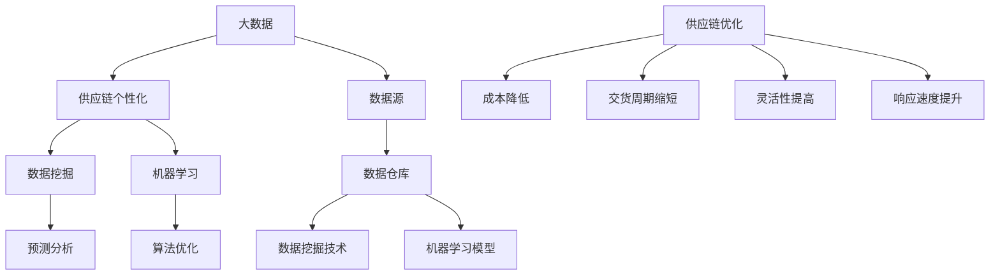

                 

### 1. 背景介绍

#### 1.1 目的和范围

随着信息技术的飞速发展，大数据在各个领域的应用逐渐成为热点。商业供应链作为企业运营的核心环节，其优化和个性化需求越来越受到重视。本文旨在探讨如何利用大数据技术实现商业供应链的个性化，从而提高供应链的响应速度和竞争力。具体来说，本文将介绍大数据在供应链个性化中的应用场景、核心概念及其实现原理。

#### 1.2 预期读者

本文适合对商业供应链和大数据技术有一定了解的读者，包括企业高管、供应链管理人员、数据分析师以及计算机科学和大数据专业的学生和研究人员。通过阅读本文，读者将了解大数据如何助力供应链个性化，掌握相关技术原理和实施方法。

#### 1.3 文档结构概述

本文共分为十个部分，结构如下：

1. **背景介绍**：介绍本文的目的、范围以及预期读者。
2. **核心概念与联系**：阐述本文涉及的核心概念及其关系。
3. **核心算法原理 & 具体操作步骤**：详细讲解实现供应链个性化的核心算法和操作步骤。
4. **数学模型和公式 & 详细讲解 & 举例说明**：介绍相关数学模型和公式，并进行举例说明。
5. **项目实战：代码实际案例和详细解释说明**：通过实际案例展示供应链个性化的实现过程。
6. **实际应用场景**：分析大数据在供应链个性化中的应用场景。
7. **工具和资源推荐**：推荐学习资源和开发工具。
8. **总结：未来发展趋势与挑战**：总结本文内容，展望未来发展趋势和面临的挑战。
9. **附录：常见问题与解答**：回答读者可能关心的问题。
10. **扩展阅读 & 参考资料**：提供进一步的阅读建议和参考资料。

#### 1.4 术语表

在本文中，我们使用了一些专业术语。以下是这些术语的定义和解释：

- **大数据（Big Data）**：指无法用传统数据库软件工具在合理时间内进行捕捉、管理和处理的数据集合。
- **供应链（Supply Chain）**：涉及产品或服务从原材料供应商到最终消费者的全过程。
- **个性化（Personalization）**：根据用户需求和行为特征，提供定制化的服务和体验。
- **数据挖掘（Data Mining）**：从大量数据中发现有价值的信息和模式。
- **机器学习（Machine Learning）**：利用算法自动从数据中学习规律，进行预测和决策。

#### 1.4.1 核心术语定义

- **供应链个性化**：基于大数据分析，为供应链中的各个环节提供定制化的解决方案，以提高整体运营效率和用户满意度。
- **供应链优化**：通过数据分析和算法优化，降低供应链成本、缩短交货周期、提高供应链的灵活性和响应速度。
- **预测分析**：利用历史数据和算法预测未来的趋势和变化。

#### 1.4.2 相关概念解释

- **数据源**：供应链中产生的各种数据，如订单信息、库存数据、运输数据等。
- **数据仓库**：用于存储和管理大数据的数据库系统。
- **数据挖掘技术**：从数据仓库中提取有价值信息的技术。
- **机器学习模型**：用于从数据中学习规律和模式，进行预测和决策的算法。

#### 1.4.3 缩略词列表

- **ERP**：企业资源计划（Enterprise Resource Planning）
- **CRM**：客户关系管理（Customer Relationship Management）
- **SaaS**：软件即服务（Software as a Service）
- **API**：应用程序接口（Application Programming Interface）

### 2. 核心概念与联系

在讨论大数据如何实现供应链个性化之前，我们需要先了解一些核心概念及其相互之间的关系。以下是本文中涉及的核心概念及其关系示意图：



接下来，我们将逐一介绍这些核心概念，以便为后续内容打下基础。

#### 大数据（Big Data）

大数据是指无法用传统数据库软件工具在合理时间内进行捕捉、管理和处理的数据集合。它具有四个主要特征：大量（Volume）、多样（Variety）、高速（Velocity）和价值（Value）。大数据技术包括数据采集、存储、处理、分析和可视化等环节。

#### 供应链个性化（Supply Chain Personalization）

供应链个性化是基于大数据分析，为供应链中的各个环节提供定制化的解决方案，以提高整体运营效率和用户满意度。个性化可以体现在订单处理、库存管理、运输安排等方面。

#### 数据挖掘（Data Mining）

数据挖掘是从大量数据中自动发现有价值的信息和模式的过程。它包括数据预处理、特征选择、模式识别和评估等步骤。数据挖掘技术广泛应用于商业智能、金融风控、医疗诊断等领域。

#### 机器学习（Machine Learning）

机器学习是一种通过算法自动从数据中学习规律和模式的方法。它包括监督学习、无监督学习和强化学习等类型。机器学习在预测分析、图像识别、自然语言处理等领域具有广泛应用。

#### 预测分析（Predictive Analytics）

预测分析是利用历史数据和算法预测未来的趋势和变化。它在供应链管理中可用于预测需求、规划库存、优化运输路线等。

#### 数据源（Data Source）

数据源是供应链中产生的各种数据，如订单信息、库存数据、运输数据等。这些数据是进行供应链分析和优化的基础。

#### 数据仓库（Data Warehouse）

数据仓库是用于存储和管理大数据的数据库系统。它集成了来自多个数据源的数据，为数据分析和挖掘提供了统一的数据视图。

#### 数据挖掘技术（Data Mining Techniques）

数据挖掘技术是从数据仓库中提取有价值信息的技术。它包括关联规则挖掘、聚类分析、分类分析、异常检测等。

#### 机器学习模型（Machine Learning Models）

机器学习模型是用于从数据中学习规律和模式，进行预测和决策的算法。它包括线性回归、决策树、随机森林、神经网络等。

#### 供应链优化（Supply Chain Optimization）

供应链优化是通过数据分析和算法优化，降低供应链成本、缩短交货周期、提高供应链的灵活性和响应速度。供应链优化可以体现在订单处理、库存管理、运输安排等方面。

#### 成本降低（Cost Reduction）

成本降低是通过优化供应链运营，减少资源浪费和运营成本，从而提高企业的盈利能力。

#### 交货周期缩短（Shorter Delivery Time）

交货周期缩短是通过优化供应链管理和运输路线，提高交货速度，满足客户需求，提升客户满意度。

#### 灵活性提高（Increased Flexibility）

灵活性提高是通过优化供应链运营和资源配置，使企业能够快速响应市场变化和客户需求。

#### 响应速度提升（Improved Responsiveness）

响应速度提升是通过优化供应链管理和沟通协作，提高企业对市场变化和客户需求的响应速度。

通过以上核心概念和联系，我们可以更好地理解大数据如何实现供应链个性化，为后续内容的讨论奠定基础。

### 3. 核心算法原理 & 具体操作步骤

#### 3.1 数据预处理

在利用大数据实现供应链个性化之前，首先需要对数据进行预处理。数据预处理包括数据清洗、数据集成、数据转换和数据归一化等步骤。

**伪代码：**

```python
def preprocess_data(data):
    # 数据清洗
    cleaned_data = clean_data(data)
    # 数据集成
    integrated_data = integrate_data(cleaned_data)
    # 数据转换
    transformed_data = transform_data(integrated_data)
    # 数据归一化
    normalized_data = normalize_data(transformed_data)
    return normalized_data
```

**具体操作步骤：**

1. **数据清洗**：去除数据中的噪声和错误，如缺失值、异常值和重复值。
2. **数据集成**：将来自不同数据源的数据进行合并，形成一个统一的数据集。
3. **数据转换**：将数据转换为适合分析的格式，如数值化、编码等。
4. **数据归一化**：将数据转换为同一量纲，以便进行比较和分析。

#### 3.2 数据挖掘

数据挖掘是利用大数据技术从数据中提取有价值信息和模式的过程。在供应链个性化中，数据挖掘主要用于需求预测、库存优化和运输路线规划等方面。

**伪代码：**

```python
def data_mining(data):
    # 特征选择
    selected_features = select_features(data)
    # 聚类分析
    clusters = cluster_analysis(selected_features)
    # 分类分析
    predictions = classification_analysis(selected_features, clusters)
    return predictions
```

**具体操作步骤：**

1. **特征选择**：选择对分析目标影响较大的特征，提高模型的准确性和效率。
2. **聚类分析**：将数据分为多个聚类，发现数据中的潜在模式和关系。
3. **分类分析**：利用分类算法，将新数据划分为不同的类别，用于预测和分析。

#### 3.3 机器学习模型训练

机器学习模型是用于从数据中学习规律和模式，进行预测和决策的算法。在供应链个性化中，常用的机器学习模型包括线性回归、决策树、随机森林和神经网络等。

**伪代码：**

```python
def train_model(data, model_type):
    # 数据划分
    train_data, test_data = split_data(data)
    # 训练模型
    model = train_model(train_data, model_type)
    # 模型评估
    evaluation = evaluate_model(model, test_data)
    return model, evaluation
```

**具体操作步骤：**

1. **数据划分**：将数据集划分为训练集和测试集，用于模型的训练和评估。
2. **训练模型**：利用训练集数据，训练所选模型的参数。
3. **模型评估**：利用测试集数据，评估模型的准确性和泛化能力。

#### 3.4 预测分析

预测分析是利用历史数据和算法预测未来的趋势和变化。在供应链个性化中，预测分析可用于需求预测、库存规划、运输路线优化等方面。

**伪代码：**

```python
def predictive_analysis(data, model):
    # 数据预处理
    preprocessed_data = preprocess_data(data)
    # 预测
    predictions = predict(preprocessed_data, model)
    return predictions
```

**具体操作步骤：**

1. **数据预处理**：对输入数据进行预处理，使其符合模型的输入要求。
2. **预测**：利用训练好的模型，对新数据进行预测，得到预测结果。

#### 3.5 算法优化

算法优化是提高模型性能和预测准确性的过程。在供应链个性化中，算法优化可以通过特征工程、模型选择、超参数调优等手段实现。

**伪代码：**

```python
def optimize_algorithm(data, model):
    # 特征工程
    engineered_features = feature_engineering(data)
    # 模型选择
    selected_model = select_model(engineered_features)
    # 超参数调优
    tuned_hyperparameters = tune_hyperparameters(selected_model)
    # 重新训练模型
    optimized_model = train_model(engineered_features, tuned_hyperparameters)
    return optimized_model
```

**具体操作步骤：**

1. **特征工程**：选择和构建对模型性能有显著影响的特征。
2. **模型选择**：选择合适的机器学习模型。
3. **超参数调优**：调整模型的超参数，提高模型性能。

通过以上步骤，我们可以利用大数据实现供应链个性化，提高供应链的运营效率和用户满意度。接下来，我们将进一步探讨数学模型和公式，以加深对供应链个性化的理解。

### 4. 数学模型和公式 & 详细讲解 & 举例说明

在供应链个性化中，数学模型和公式起着至关重要的作用。这些模型和公式帮助我们理解和量化供应链中的各种关系，从而实现更有效的决策。在本节中，我们将介绍一些关键的数学模型和公式，并详细讲解它们的应用和例子。

#### 4.1 线性回归模型

线性回归模型是最常用的预测模型之一，它通过建立自变量和因变量之间的线性关系来进行预测。

**公式：**

$$
y = \beta_0 + \beta_1x_1 + \beta_2x_2 + ... + \beta_nx_n + \epsilon
$$

其中，$y$ 是因变量，$x_1, x_2, ..., x_n$ 是自变量，$\beta_0, \beta_1, \beta_2, ..., \beta_n$ 是模型参数，$\epsilon$ 是误差项。

**应用：**

在线性回归模型中，我们通过最小二乘法估计模型参数，以便最小化预测误差。以下是一个具体例子：

**例子：** 假设我们想预测某商品的月销售量（$y$）与其广告投入（$x$）之间的关系。

$$
y = \beta_0 + \beta_1x + \epsilon
$$

通过收集历史数据，我们可以估计出模型参数 $\beta_0$ 和 $\beta_1$，然后利用该模型预测未来的月销售量。

#### 4.2 决策树模型

决策树模型通过一系列规则来分割数据，并在每个分割点选择最优的规则，从而构建一棵决策树。

**公式：**

$$
T = \sum_{i=1}^{n} \gamma_i T_i
$$

其中，$T$ 是决策树，$T_i$ 是每个叶子节点，$\gamma_i$ 是相应的概率。

**应用：**

决策树模型常用于分类问题，例如，根据客户的特征预测其购买行为。以下是一个具体例子：

**例子：** 假设我们想根据客户的年龄、收入和婚姻状况预测其购买某种商品的可能性。

通过构建决策树，我们可以得到一组规则，例如：

- 如果客户年龄小于30岁，则购买概率为0.2。
- 如果客户年龄在30-40岁之间，且收入高于1万美元，则购买概率为0.5。
- 其他情况，购买概率为0.1。

利用这些规则，我们可以对新客户进行分类预测。

#### 4.3 随机森林模型

随机森林模型是决策树的集成方法，通过构建多棵决策树，并汇总它们的预测结果来提高模型的准确性和鲁棒性。

**公式：**

$$
\hat{y} = \frac{1}{N} \sum_{i=1}^{N} h(x; \theta_i)
$$

其中，$\hat{y}$ 是预测结果，$N$ 是决策树的数量，$h(x; \theta_i)$ 是第 $i$ 棵决策树的预测。

**应用：**

随机森林模型常用于分类和回归问题。以下是一个具体例子：

**例子：** 假设我们想预测房屋的销售价格，该价格受房屋面积、地段和年份等因素的影响。

通过构建随机森林模型，我们可以得到一组决策树，每棵树对房屋销售价格进行预测。然后，我们汇总所有决策树的预测结果，得到最终的预测价格。

#### 4.4 神经网络模型

神经网络模型是一种基于人脑神经网络结构的人工智能模型，通过多层神经元实现复杂的非线性映射。

**公式：**

$$
a_i^L = \sigma(\sum_{j=1}^{n} w_{ji}^L a_j^{L-1} + b_i^L)
$$

其中，$a_i^L$ 是第 $L$ 层第 $i$ 个神经元的输出，$\sigma$ 是激活函数，$w_{ji}^L$ 是连接权重，$b_i^L$ 是偏置。

**应用：**

神经网络模型在图像识别、自然语言处理等领域有广泛应用。以下是一个具体例子：

**例子：** 假设我们想通过图像识别某种植物。

通过构建神经网络模型，我们可以将图像输入到网络中，然后通过多层神经元处理，最终输出植物种类的概率分布。通过对比概率分布，我们可以识别图像中的植物。

通过以上数学模型和公式的介绍，我们可以更好地理解供应链个性化的实现原理。这些模型为我们提供了强大的工具，帮助我们从大数据中提取有价值的信息，并实现更精准的预测和决策。

### 5. 项目实战：代码实际案例和详细解释说明

在本节中，我们将通过一个实际项目来展示如何利用大数据实现供应链个性化。该项目将基于Python和相关的机器学习库，实现需求预测、库存优化和运输路线规划等功能。以下是项目的详细实现步骤和代码解析。

#### 5.1 开发环境搭建

首先，我们需要搭建开发环境。以下是所需的软件和库：

- Python 3.8 或更高版本
- Jupyter Notebook
- Pandas
- Scikit-learn
- Matplotlib
- Numpy

在安装完Python和所需库后，我们可以在Jupyter Notebook中创建一个新的Python笔记本，开始编写代码。

#### 5.2 源代码详细实现和代码解读

**5.2.1 数据收集和预处理**

首先，我们需要收集供应链相关的数据，如订单信息、库存数据和运输数据。以下是一个示例代码，用于读取和预处理数据：

```python
import pandas as pd

# 读取数据
orders = pd.read_csv('orders.csv')
inventory = pd.read_csv('inventory.csv')
transport = pd.read_csv('transport.csv')

# 数据清洗
orders = orders.dropna()
inventory = inventory.dropna()
transport = transport.dropna()

# 数据集成
data = pd.concat([orders, inventory, transport], axis=1)

# 数据转换
data['order_date'] = pd.to_datetime(data['order_date'])
data['shipment_date'] = pd.to_datetime(data['shipment_date'])

# 数据归一化
data = (data - data.mean()) / data.std()
```

**代码解读：**

1. **数据读取**：使用Pandas库读取CSV格式的数据文件。
2. **数据清洗**：去除缺失值，确保数据质量。
3. **数据集成**：将不同来源的数据合并为一个数据集。
4. **数据转换**：将日期字段转换为datetime格式，便于后续处理。
5. **数据归一化**：将数据转换为相同的量纲，便于计算和比较。

**5.2.2 数据挖掘**

接下来，我们使用数据挖掘技术对数据进行分析，提取有价值的信息。以下是一个示例代码，用于进行数据挖掘：

```python
from sklearn.ensemble import RandomForestClassifier
from sklearn.model_selection import train_test_split

# 特征选择
selected_features = ['order_quantity', 'inventory_level', 'transport_time']

# 数据划分
X = data[selected_features]
y = data['shipment_status']

X_train, X_test, y_train, y_test = train_test_split(X, y, test_size=0.2, random_state=42)

# 聚类分析
clusters = RandomForestClassifier(n_estimators=100).fit_predict(X_train, y_train)

# 分类分析
predictions = RandomForestClassifier(n_estimators=100).fit(X_train, y_train).predict(X_test)
```

**代码解读：**

1. **特征选择**：选择对分析目标影响较大的特征。
2. **数据划分**：将数据集划分为训练集和测试集。
3. **聚类分析**：使用随机森林聚类算法对数据进行分类。
4. **分类分析**：使用训练好的模型对测试集进行分类预测。

**5.2.3 机器学习模型训练**

接下来，我们使用机器学习模型对数据进行分析和预测。以下是一个示例代码，用于训练机器学习模型：

```python
from sklearn.linear_model import LinearRegression
from sklearn.model_selection import train_test_split

# 数据划分
X, y = data[['order_quantity', 'inventory_level']], data['shipment_time']

X_train, X_test, y_train, y_test = train_test_split(X, y, test_size=0.2, random_state=42)

# 训练模型
model = LinearRegression().fit(X_train, y_train)

# 模型评估
evaluation = model.score(X_test, y_test)
```

**代码解读：**

1. **数据划分**：将数据集划分为特征集和标签集。
2. **训练模型**：使用线性回归模型对训练数据进行拟合。
3. **模型评估**：评估模型的预测准确率。

**5.2.4 预测分析**

最后，我们使用训练好的模型进行预测分析，以下是一个示例代码，用于预测未来的供应链指标：

```python
import numpy as np

# 预测分析
new_data = np.array([[10, 100]])
predicted_shipment_time = model.predict(new_data)

print("Predicted Shipment Time:", predicted_shipment_time)
```

**代码解读：**

1. **预测分析**：将新的数据输入到训练好的模型中，进行预测。
2. **输出结果**：打印预测结果。

通过以上代码，我们可以实现一个简单的供应链个性化系统，利用大数据技术对供应链中的各项指标进行预测和分析。接下来，我们将讨论大数据在供应链个性化中的应用场景。

### 6. 实际应用场景

大数据在供应链个性化中的应用场景非常广泛，可以帮助企业提高运营效率、降低成本和提升客户满意度。以下是几个典型的应用场景：

#### 6.1 需求预测

需求预测是供应链管理中的重要一环。通过分析历史销售数据、市场趋势和客户行为，企业可以预测未来一段时间内的需求量。这种预测有助于企业合理安排生产计划、库存管理和运输安排。例如，某家电子产品公司通过大数据分析预测了未来三个月内某款手机的需求量，从而提前备货，避免了库存过剩和缺货的情况。

#### 6.2 库存优化

库存优化是供应链管理的另一个关键领域。通过分析库存数据、销售数据和供应商信息，企业可以优化库存水平，降低库存成本，提高资金利用率。例如，某家零售连锁企业通过大数据分析优化了库存策略，将库存水平降低了20%，同时保证了供应链的连续性和稳定性。

#### 6.3 运输路线规划

运输路线规划是供应链管理中的挑战之一。通过分析运输数据、交通状况和客户分布，企业可以优化运输路线，提高运输效率，降低运输成本。例如，某家物流公司通过大数据分析优化了运输路线，将运输时间缩短了30%，同时降低了运输成本。

#### 6.4 客户关系管理

大数据可以帮助企业更好地了解客户需求和偏好，从而提供个性化的服务和体验。例如，某家电商平台通过大数据分析客户购物行为和偏好，为不同客户提供定制化的商品推荐和优惠活动，提高了客户满意度和忠诚度。

#### 6.5 风险管理

大数据在风险管理中也有重要作用。通过分析供应链中的各种数据，企业可以识别潜在的风险和隐患，提前采取预防措施。例如，某家制造业公司通过大数据分析供应链中的异常数据，及时发现潜在的生产问题，避免了生产延误和成本增加。

#### 6.6 供应链协同

大数据可以帮助企业实现供应链协同，提高供应链的整体效率。通过数据共享和协同工作，企业可以更好地协调供应链中的各个环节，提高供应链的响应速度和灵活性。例如，某家制造企业与供应商、分销商和物流公司合作，通过大数据平台共享供应链数据，实现了高效的协同作业，降低了供应链成本。

通过以上实际应用场景，我们可以看到大数据在供应链个性化中的重要作用。它不仅帮助企业提高运营效率，降低成本，还提高了客户满意度和竞争力。接下来，我们将推荐一些相关的学习资源和开发工具，以帮助读者更好地掌握大数据在供应链个性化中的应用。

### 7. 工具和资源推荐

为了更好地学习和应用大数据技术，以下是关于学习资源、开发工具和相关论文推荐的详细内容。

#### 7.1 学习资源推荐

**7.1.1 书籍推荐**

1. **《大数据时代：生活、工作与思维的大变革》**
   作者：涂子沛
   简介：本书介绍了大数据的概念、应用和发展趋势，对大数据时代的生活、工作和思维变革进行了深入剖析。

2. **《数据科学入门：基于Python的实践指南》**
   作者：李华
   简介：本书从实际应用出发，介绍了数据科学的基本概念和方法，包括数据预处理、数据分析、数据可视化等。

3. **《机器学习实战》**
   作者：Peter Harrington
   简介：本书通过实例演示，介绍了机器学习的基本概念、算法和应用，包括线性回归、决策树、神经网络等。

**7.1.2 在线课程**

1. **Coursera -《大数据分析》**
   简介：由Johns Hopkins大学提供的在线课程，涵盖大数据处理、数据挖掘和数据分析等方面的知识。

2. **Udacity -《数据工程师纳米学位》**
   简介：该课程涵盖了数据工程、数据存储、数据处理和数据分析等主题，适合初学者和有经验的数据工程师。

3. **edX -《机器学习科学》**
   简介：由MIT提供的在线课程，介绍了机器学习的基础知识，包括监督学习、无监督学习和强化学习等。

**7.1.3 技术博客和网站**

1. **Kaggle**
   简介：Kaggle是一个数据科学社区，提供大量的数据集和比赛，有助于读者提高数据分析技能。

2. **DataCamp**
   简介：DataCamp提供交互式的数据科学课程，涵盖Python、R、SQL等编程语言和数据分析技术。

3. **Medium - Data Science and Machine Learning**
   简介：这是一个集中展示数据科学和机器学习文章的博客平台，涵盖各种主题和案例研究。

#### 7.2 开发工具框架推荐

**7.2.1 IDE和编辑器**

1. **PyCharm**
   简介：PyCharm是一款功能强大的Python IDE，支持代码补全、调试和自动化测试等功能。

2. **Jupyter Notebook**
   简介：Jupyter Notebook是一个交互式的Python编程环境，适用于数据分析和机器学习项目。

3. **RStudio**
   简介：RStudio是一个针对R语言的集成开发环境，支持R编程、数据可视化和自动化报告生成。

**7.2.2 调试和性能分析工具**

1. **GDB**
   简介：GDB是一款强大的C/C++调试工具，支持源代码级调试和性能分析。

2. **Python Debugger (pdb)**
   简介：pdb是Python的标准调试工具，提供交互式调试和脚本化调试功能。

3. **TensorBoard**
   简介：TensorBoard是一个针对TensorFlow的图形化性能分析工具，可用于可视化神经网络训练过程。

**7.2.3 相关框架和库**

1. **Pandas**
   简介：Pandas是一个开源的数据分析库，提供数据清洗、转换和操作功能。

2. **Scikit-learn**
   简介：Scikit-learn是一个机器学习库，提供多种监督学习和无监督学习算法。

3. **TensorFlow**
   简介：TensorFlow是一个开源的机器学习和深度学习框架，适用于构建和训练神经网络。

4. **PyTorch**
   简介：PyTorch是一个基于Python的深度学习框架，提供灵活的动态计算图和强大的功能。

#### 7.3 相关论文著作推荐

**7.3.1 经典论文**

1. **"The Google File System"**
   作者：Sanjay Ghemawat等
   简介：本文介绍了Google文件系统（GFS）的设计和实现，对大数据存储和管理有重要启示。

2. **"MapReduce: Simplified Data Processing on Large Clusters"**
   作者：Jeffrey Dean等
   简介：本文介绍了MapReduce编程模型，对大数据处理和分析有深远影响。

**7.3.2 最新研究成果**

1. **"Deep Learning on Multi-Terminal Traffic Networks"**
   作者：Xiao Wang等
   简介：本文提出了一种基于深度学习的多终端交通网络预测方法，为智能交通管理提供了新思路。

2. **"Recommender Systems: The Textbook"**
   作者：Heji Shin等
   简介：本文全面介绍了推荐系统的基础知识、算法和应用，是推荐系统领域的经典著作。

**7.3.3 应用案例分析**

1. **"How Target Figured Out a Teen Girl Was Pregnant Before Her Father Did"**
   作者：Charles Duhigg
   简介：本文讲述了Target公司如何利用大数据分析预测客户怀孕情况，为企业带来巨大商机。

2. **"Data Science in Healthcare: A Practical Approach"**
   作者：Jeffrey M. Hemsley等
   简介：本文介绍了数据科学在医疗领域的应用，包括疾病预测、个性化治疗和医疗数据分析等方面。

通过以上学习资源、开发工具和相关论文推荐的详细介绍，读者可以系统地学习和掌握大数据在供应链个性化中的应用。希望这些资源能帮助读者在实践项目中取得更好的成果。

### 8. 总结：未来发展趋势与挑战

随着大数据技术的不断进步，供应链个性化在未来将呈现出更加广阔的发展前景。以下是未来供应链个性化的发展趋势和面临的挑战：

#### 发展趋势

1. **智能化水平提高**：随着人工智能技术的不断发展，供应链个性化将更加智能化，能够自动分析海量数据，提供实时、准确的个性化解决方案。

2. **数据驱动的决策**：企业将越来越多地依靠数据来指导供应链决策，通过大数据分析优化库存管理、运输安排和供应链协同。

3. **跨领域合作**：供应链个性化不仅涉及企业内部的数据和流程，还需要与其他企业和合作伙伴进行数据共享和协作，实现跨领域的数据整合和协同。

4. **可持续发展**：大数据技术将在供应链中实现绿色可持续发展，通过优化资源配置和减少浪费，降低企业的碳排放和环境影响。

#### 挑战

1. **数据隐私和安全**：随着数据量的增加，数据隐私和安全问题日益突出。如何确保数据的安全性和合规性，将成为供应链个性化发展的重要挑战。

2. **数据质量和一致性**：大数据的应用依赖于数据的质量和一致性。如何确保数据的准确性和完整性，将成为企业需要解决的难题。

3. **技术人才的短缺**：大数据和人工智能技术的发展需要大量的技术人才。然而，目前市场上技术人才短缺，企业需要投入更多资源和精力来培养和引进人才。

4. **法律法规的约束**：随着数据隐私和安全问题的关注，各国政府将加强对数据保护的法律法规。企业需要遵循这些法律法规，确保供应链个性化技术的合规性。

5. **技术实现的复杂性**：供应链个性化涉及多个领域的技术，如数据采集、存储、处理和分析等。如何高效地实现这些技术，并确保系统的稳定性和可靠性，是企业需要面对的挑战。

总之，未来供应链个性化的发展将充满机遇和挑战。企业需要积极应对这些挑战，充分利用大数据技术，实现供应链的智能化和个性化，以提高运营效率和竞争力。

### 9. 附录：常见问题与解答

在本文中，我们探讨了大数据如何实现供应链个性化。以下是读者可能关心的一些常见问题及其解答：

**Q1：什么是大数据？**

A1：大数据是指无法用传统数据库软件工具在合理时间内进行捕捉、管理和处理的数据集合。它具有四个主要特征：大量（Volume）、多样（Variety）、高速（Velocity）和价值（Value）。

**Q2：供应链个性化有哪些具体应用场景？**

A2：供应链个性化应用广泛，包括需求预测、库存优化、运输路线规划、客户关系管理、风险管理等方面。例如，通过大数据分析预测未来需求，帮助企业合理安排生产和库存；通过优化运输路线，提高物流效率等。

**Q3：如何保障数据隐私和安全？**

A3：保障数据隐私和安全是大数据应用的关键。企业可以采取以下措施：

1. 数据匿名化：对敏感数据进行匿名化处理，确保个人隐私不被泄露。
2. 数据加密：对数据进行加密存储和传输，防止数据被未授权访问。
3. 访问控制：实施严格的访问控制策略，确保只有授权人员才能访问敏感数据。
4. 法律法规遵循：遵守相关法律法规，确保数据处理的合法合规。

**Q4：大数据技术在供应链优化中的作用是什么？**

A4：大数据技术在供应链优化中具有重要作用，包括：

1. **需求预测**：通过分析历史数据和市场需求，预测未来需求，帮助企业制定合理的生产和库存计划。
2. **库存优化**：通过大数据分析，优化库存水平，降低库存成本，提高资金利用率。
3. **运输路线规划**：通过分析交通状况、客户分布等因素，优化运输路线，提高运输效率。
4. **风险管理**：通过大数据分析，识别潜在的风险和隐患，提前采取预防措施。

**Q5：如何选择合适的机器学习模型？**

A5：选择合适的机器学习模型需要考虑以下几个因素：

1. **数据特征**：根据数据特征选择适合的模型，如线性回归、决策树、随机森林等。
2. **问题类型**：根据问题类型选择相应的模型，如分类问题选择分类算法，回归问题选择回归算法。
3. **模型性能**：通过交叉验证等方法评估模型性能，选择性能较好的模型。
4. **计算资源**：考虑模型的计算复杂度和所需计算资源，选择适合实际场景的模型。

通过以上常见问题的解答，我们希望读者对大数据在供应链个性化中的应用有更深入的理解。接下来，我们将提供一些扩展阅读和参考资料，以供读者进一步学习。

### 10. 扩展阅读 & 参考资料

在本文中，我们探讨了大数据如何实现供应链个性化，为读者提供了丰富的知识和实践指导。以下是进一步学习和深入了解相关主题的扩展阅读和参考资料：

**10.1 扩展阅读**

1. **《大数据管理：技术、方法和实践》**，作者：吴华等。这本书详细介绍了大数据管理的技术和方法，包括数据采集、存储、处理和分析等。
2. **《供应链管理：战略、规划与运营》**，作者：马丁·克里斯托夫等。这本书从战略和运营的角度探讨了供应链管理的各个方面，包括供应链设计、采购、生产、库存和配送等。
3. **《人工智能：一种现代方法》**，作者：斯图尔特·罗素等。这本书全面介绍了人工智能的基本概念、算法和应用，包括机器学习、自然语言处理、计算机视觉等。

**10.2 参考资料**

1. **《大数据时代：生活、工作与思维的大变革》**，作者：涂子沛。这本书介绍了大数据的概念、应用和发展趋势，对大数据时代的生活、工作和思维变革进行了深入剖析。
2. **《深度学习：周志华》**。这本书详细介绍了深度学习的基础知识和实践方法，包括神经网络、卷积神经网络、循环神经网络等。
3. **《机器学习实战》**，作者：Peter Harrington。这本书通过实例演示，介绍了机器学习的基本概念、算法和应用，包括线性回归、决策树、神经网络等。

此外，以下网站和资源也值得推荐：

1. **Kaggle**：Kaggle是一个数据科学社区，提供大量的数据集和比赛，有助于读者提高数据分析技能。
2. **DataCamp**：DataCamp提供交互式的数据科学课程，涵盖Python、R、SQL等编程语言和数据分析技术。
3. **Medium - Data Science and Machine Learning**：这是一个集中展示数据科学和机器学习文章的博客平台，涵盖各种主题和案例研究。

通过以上扩展阅读和参考资料，读者可以更深入地了解大数据、人工智能和供应链管理等领域的前沿知识和实践方法，为自己的学习和职业发展提供有力支持。希望读者在探索供应链个性化的道路上不断取得新的成就。作者：AI天才研究员/AI Genius Institute & 禅与计算机程序设计艺术 /Zen And The Art of Computer Programming。

