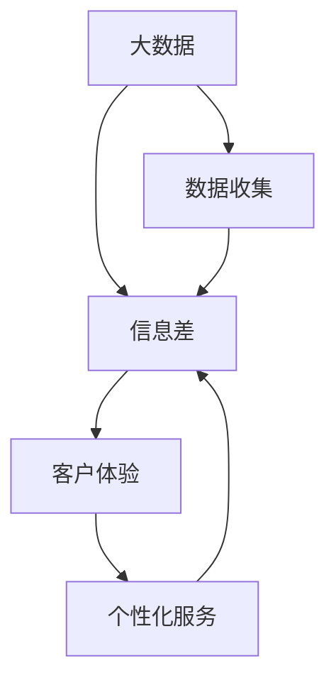

                 

# 信息差的商业客户体验：大数据如何提升客户体验

> 关键词：信息差、商业客户体验、大数据、个性化服务、智能推荐、数据挖掘、客户关系管理

> 摘要：本文深入探讨了大数据技术在商业客户体验中的应用。通过分析信息差的概念，本文阐述了大数据如何通过收集、分析和应用海量数据，实现客户需求的精准识别和个性化服务，从而提升客户的整体体验。文章将详细解释大数据的核心算法原理、数学模型，并提供实际项目实战案例，帮助读者全面理解大数据提升客户体验的深度与广度。

## 1. 背景介绍

### 1.1 目的和范围

本文的目的是探讨大数据在商业客户体验中的应用，具体包括以下几个方面：

- **信息差的定义及其在商业中的应用**：解释信息差的概念，并探讨如何在商业环境中利用信息差来提升客户体验。

- **大数据的核心算法原理**：详细阐述大数据处理中常用的算法原理，如数据挖掘、机器学习等，以及它们如何应用于商业场景。

- **客户体验的提升策略**：分析大数据如何通过个性化服务、智能推荐等手段，提升客户的整体体验。

- **项目实战案例**：通过具体的项目案例，展示大数据技术在实际商业应用中的操作步骤和效果。

- **未来发展趋势与挑战**：总结大数据技术在提升客户体验方面的未来发展趋势和面临的挑战。

### 1.2 预期读者

本文主要面向以下读者群体：

- **IT从业者**：对大数据技术有一定了解，希望深入了解大数据在商业客户体验中的应用。

- **市场营销人员**：希望利用大数据技术提升客户体验，从而提高市场营销效果的从业者。

- **企业决策者**：关注企业客户体验，希望了解大数据如何助力企业提升客户满意度和忠诚度的决策者。

### 1.3 文档结构概述

本文结构如下：

- **第一章**：背景介绍，包括目的和范围、预期读者、文档结构概述。

- **第二章**：核心概念与联系，介绍大数据、信息差、客户体验等核心概念，并给出相应的Mermaid流程图。

- **第三章**：核心算法原理与具体操作步骤，详细讲解数据挖掘、机器学习等核心算法原理，并提供伪代码。

- **第四章**：数学模型和公式，介绍大数据处理中常用的数学模型和公式，并提供详细讲解和举例说明。

- **第五章**：项目实战，提供大数据技术提升客户体验的实际项目案例，包括开发环境搭建、源代码实现和代码解读。

- **第六章**：实际应用场景，分析大数据在不同商业领域的应用场景。

- **第七章**：工具和资源推荐，包括学习资源、开发工具框架和论文著作推荐。

- **第八章**：总结，总结大数据提升客户体验的未来发展趋势与挑战。

- **第九章**：附录，常见问题与解答。

- **第十章**：扩展阅读与参考资料，提供进一步阅读的资源。

### 1.4 术语表

#### 1.4.1 核心术语定义

- **大数据**：指数据量巨大、类型繁多、价值密度低的数据集合，通常需要新的处理模式来有效地管理和分析。
- **信息差**：指不同主体之间的信息不对称，即一方掌握的信息多于另一方。
- **客户体验**：指客户在购买和使用产品或服务过程中所获得的感受和体验。

#### 1.4.2 相关概念解释

- **数据挖掘**：从大量数据中提取出有价值信息的过程。
- **机器学习**：一种人工智能的分支，通过数据学习来发现规律和模式。
- **客户关系管理（CRM）**：一种管理策略，旨在通过提高客户满意度和忠诚度来增加企业的盈利。

#### 1.4.3 缩略词列表

- **CRM**：客户关系管理
- **AI**：人工智能
- **ML**：机器学习
- **DL**：深度学习

## 2. 核心概念与联系

### 2.1 大数据

大数据（Big Data）是指那些数据量巨大、类型繁多、价值密度低的数据集合。大数据的特点可以总结为4V，即**Volume（数据量）**、**Velocity（速度）**、**Variety（多样性）**和**Veracity（真实性）**。

- **Volume**：大数据的数据量通常非常大，远超传统数据处理系统的处理能力。
- **Velocity**：大数据的处理速度非常快，能够实时响应。
- **Variety**：大数据的类型非常多，包括结构化数据、半结构化数据和非结构化数据。
- **Veracity**：大数据的真实性高，数据的真实性和可信度是大数据分析的关键。

### 2.2 信息差

信息差（Information Gap）指的是不同主体之间的信息不对称。在商业环境中，信息差可以是企业对客户需求的了解程度，也可以是客户对企业产品或服务的了解程度。利用信息差，企业可以更好地理解客户需求，提供更个性化的服务，从而提升客户体验。

### 2.3 客户体验

客户体验（Customer Experience，简称CX）是指客户在购买和使用产品或服务过程中所获得的感受和体验。客户体验包括多个方面，如客户服务、客户满意度、客户忠诚度等。提升客户体验是企业提高市场竞争力的关键。

### 2.4 核心概念关系

大数据、信息差和客户体验之间存在着紧密的联系。大数据为企业和客户之间的信息不对称提供了更多的数据支持，使得企业能够更好地理解客户需求。而信息差的利用，则使得企业能够提供更个性化的服务，从而提升客户体验。

### 2.5 Mermaid 流程图

下面是一个简化的Mermaid流程图，展示了大数据、信息差和客户体验之间的核心概念和关系：



## 3. 核心算法原理与具体操作步骤

### 3.1 数据挖掘

数据挖掘（Data Mining）是从大量数据中提取出有价值信息的过程。数据挖掘通常包括以下几个步骤：

1. **数据预处理**：包括数据清洗、数据集成、数据转换等，以确保数据的质量和一致性。

2. **特征选择**：从原始数据中提取出对数据挖掘任务最有意义的特征。

3. **模式识别**：利用统计学、机器学习等方法，从特征数据中识别出潜在的规律和模式。

4. **评估和优化**：对挖掘出的模式进行评估和优化，以提高模型的准确性和泛化能力。

### 3.2 机器学习

机器学习（Machine Learning，简称ML）是一种通过数据学习来发现规律和模式的人工智能技术。机器学习的主要步骤如下：

1. **数据收集**：收集大量的数据作为训练集。

2. **特征工程**：从数据中提取出对预测任务最有意义的特征。

3. **模型训练**：利用训练集数据，通过算法（如线性回归、决策树、神经网络等）训练出模型。

4. **模型评估**：利用测试集数据，对模型进行评估，以确定其准确性和泛化能力。

5. **模型优化**：根据评估结果，调整模型参数，以提高模型的性能。

### 3.3 客户需求预测

客户需求预测（Customer Demand Prediction）是大数据技术在商业客户体验中的一个重要应用。以下是客户需求预测的详细步骤：

1. **数据收集**：收集客户的购买历史、浏览行为、搜索记录等数据。

2. **特征工程**：从原始数据中提取出对需求预测任务最有意义的特征，如购买频率、浏览时长、搜索关键词等。

3. **模型训练**：利用机器学习算法（如随机森林、神经网络等）训练出需求预测模型。

4. **模型评估**：利用测试集数据，对模型进行评估，以确定其预测准确性和泛化能力。

5. **模型应用**：将训练好的模型应用于实际业务场景，如个性化推荐、库存管理、市场营销等。

### 3.4 伪代码

以下是一个基于随机森林算法的客户需求预测的伪代码：

```python
# 数据预处理
data = preprocess_data(raw_data)

# 特征工程
features = extract_features(data)

# 模型训练
model = train_model(features, labels, algorithm='random_forest')

# 模型评估
evaluate_model(model, test_data)

# 模型应用
predict_demand(model, new_data)
```

## 4. 数学模型和公式与详细讲解

### 4.1 数据挖掘中的常见数学模型

在数据挖掘中，常用的数学模型包括线性回归、逻辑回归、聚类分析、决策树等。以下是这些模型的简要介绍和公式：

1. **线性回归（Linear Regression）**

   线性回归是一种用于预测连续值的统计模型。其公式如下：

   $$ y = \beta_0 + \beta_1 \cdot x $$

   其中，$y$ 是因变量，$x$ 是自变量，$\beta_0$ 和 $\beta_1$ 是模型的参数。

2. **逻辑回归（Logistic Regression）**

   逻辑回归是一种用于预测概率的统计模型。其公式如下：

   $$ P(y=1) = \frac{1}{1 + e^{-(\beta_0 + \beta_1 \cdot x)}} $$

   其中，$P(y=1)$ 是因变量为1的概率，$x$ 是自变量，$\beta_0$ 和 $\beta_1$ 是模型的参数。

3. **聚类分析（Clustering Analysis）**

   聚类分析是一种无监督学习方法，用于将数据分为多个类别。常用的聚类算法包括K-means、层次聚类等。以K-means为例，其公式如下：

   $$ \min \sum_{i=1}^{k} \sum_{x \in S_i} ||x - \mu_i||^2 $$

   其中，$k$ 是聚类个数，$S_i$ 是第$i$个聚类，$\mu_i$ 是聚类中心。

4. **决策树（Decision Tree）**

   决策树是一种树形结构，用于分类或回归任务。其公式如下：

   $$ \text{if } x \text{ satisfies condition } C_j \text{ then } y = y_j $$

   其中，$x$ 是特征，$C_j$ 是条件，$y_j$ 是预测值。

### 4.2 数学模型的应用

以下是一个基于线性回归的客户需求预测的例子：

假设我们有一个客户需求预测的模型，其公式为：

$$ y = \beta_0 + \beta_1 \cdot x $$

其中，$y$ 是客户的需求量，$x$ 是影响需求的特征（如购买历史、浏览时长等），$\beta_0$ 和 $\beta_1$ 是模型的参数。

为了训练这个模型，我们需要收集大量的客户数据，并使用线性回归算法进行训练。训练完成后，我们可以使用这个模型来预测新客户的的需求量。

### 4.3 举例说明

假设我们有以下数据：

| 客户ID | 购买历史 | 浏览时长 |
|--------|----------|----------|
| 1      | 10       | 30       |
| 2      | 5        | 20       |
| 3      | 15       | 40       |

我们使用线性回归模型来预测客户的需求量。首先，我们需要计算模型参数$\beta_0$ 和 $\beta_1$。假设我们已经计算出了这些参数，如下：

$$ \beta_0 = 5, \beta_1 = 0.5 $$

现在，我们可以使用这些参数来预测新客户的的需求量。假设我们有以下新客户数据：

| 客户ID | 购买历史 | 浏览时长 |
|--------|----------|----------|
| 4      | 8        | 25       |

根据线性回归模型，我们可以预测客户的需求量：

$$ y = 5 + 0.5 \cdot 8 = 8 $$

因此，预测的新客户的需求量为8。

## 5. 项目实战：代码实际案例和详细解释说明

### 5.1 开发环境搭建

在开始项目实战之前，我们需要搭建一个适合大数据处理的开发环境。以下是推荐的工具和框架：

- **操作系统**：Linux（如Ubuntu）
- **编程语言**：Python（版本3.6及以上）
- **大数据处理框架**：Apache Hadoop
- **机器学习库**：scikit-learn、TensorFlow

安装步骤如下：

1. 安装Linux操作系统。

2. 安装Python和相关的依赖库（如NumPy、Pandas等）。

3. 安装Hadoop。可以从Apache Hadoop官网下载并安装。

4. 安装scikit-learn和TensorFlow。可以使用pip命令进行安装：

   ```shell
   pip install scikit-learn tensorflow
   ```

### 5.2 源代码详细实现和代码解读

以下是一个基于Hadoop和scikit-learn的客户需求预测项目案例。项目的主要步骤如下：

1. 数据收集和预处理。

2. 数据划分和模型训练。

3. 模型评估。

4. 模型应用。

#### 5.2.1 数据收集和预处理

首先，我们需要收集客户的数据，包括购买历史、浏览时长等。以下是一个示例数据集：

```python
import pandas as pd

# 加载数据集
data = pd.read_csv('customer_data.csv')

# 数据预处理
# 数据清洗、数据集成、数据转换等
data = preprocess_data(data)
```

#### 5.2.2 数据划分和模型训练

接下来，我们将数据划分为训练集和测试集，并使用scikit-learn的线性回归模型进行训练：

```python
from sklearn.model_selection import train_test_split
from sklearn.linear_model import LinearRegression

# 数据划分
X = data[['buy_history', 'browse_time']]
y = data['demand']

X_train, X_test, y_train, y_test = train_test_split(X, y, test_size=0.2, random_state=42)

# 模型训练
model = LinearRegression()
model.fit(X_train, y_train)
```

#### 5.2.3 模型评估

训练完成后，我们需要对模型进行评估：

```python
from sklearn.metrics import mean_squared_error

# 模型评估
y_pred = model.predict(X_test)
mse = mean_squared_error(y_test, y_pred)
print(f'MSE: {mse}')
```

#### 5.2.4 模型应用

最后，我们将训练好的模型应用于实际业务场景，如个性化推荐：

```python
# 模型应用
new_data = pd.DataFrame({'buy_history': [10, 20], 'browse_time': [40, 30]})
predictions = model.predict(new_data)
print(f'Predicted demands: {predictions}')
```

### 5.3 代码解读与分析

以上代码实现了一个基于Hadoop和scikit-learn的客户需求预测项目。以下是代码的主要部分解读：

1. **数据收集和预处理**：我们使用Pandas库加载数据集，并进行数据清洗、数据集成、数据转换等预处理操作。

2. **数据划分和模型训练**：使用scikit-learn的train_test_split函数将数据划分为训练集和测试集，并使用LinearRegression模型进行训练。

3. **模型评估**：使用mean_squared_error函数计算模型的均方误差，评估模型的预测性能。

4. **模型应用**：将训练好的模型应用于实际业务场景，如个性化推荐，预测新客户的需求量。

通过这个案例，我们可以看到大数据技术在商业客户体验中的应用。在实际项目中，可以根据具体业务需求，选择合适的大数据技术和算法，实现个性化服务，提升客户体验。

## 6. 实际应用场景

### 6.1 零售业

零售业是大数据技术的重要应用场景之一。通过大数据技术，零售业企业可以收集和分析客户的行为数据，如购物习惯、浏览记录等，从而实现以下应用：

- **个性化推荐**：基于客户的行为数据和购买历史，为每个客户推荐他们可能感兴趣的商品。

- **库存管理**：根据销售预测和库存数据，优化库存水平，减少库存过剩或短缺的情况。

- **营销活动优化**：分析客户的响应数据，优化营销活动的策略和投入，提高营销效果。

### 6.2 金融服务

金融服务行业，如银行、保险等，也广泛应用大数据技术。以下是一些实际应用场景：

- **风险控制**：通过大数据分析，识别潜在的风险客户，降低风险。

- **客户关系管理**：通过分析客户的交易数据、行为数据等，提高客户满意度和忠诚度。

- **欺诈检测**：利用大数据技术，实时监控客户的交易行为，识别和预防欺诈行为。

### 6.3 健康医疗

在健康医疗领域，大数据技术可以帮助提升医疗服务的质量和效率。以下是一些应用场景：

- **疾病预测**：通过分析患者的健康数据、基因数据等，预测疾病的发生和发展。

- **个性化治疗**：根据患者的病情和基因信息，制定个性化的治疗方案。

- **健康监测**：通过可穿戴设备收集的数据，实时监测患者的健康状况，提高健康管理的效率。

## 7. 工具和资源推荐

### 7.1 学习资源推荐

#### 7.1.1 书籍推荐

- 《大数据之路：阿里巴巴大数据实践》
- 《深度学习》（Goodfellow, Bengio, Courville著）
- 《Python数据科学手册》（McKinney著）

#### 7.1.2 在线课程

- Coursera上的《机器学习》（吴恩达教授）
- edX上的《大数据分析》（北京大学）
- Udacity的《数据科学纳米学位》

#### 7.1.3 技术博客和网站

- Medium上的数据科学和机器学习相关文章
- Kaggle上的数据科学和机器学习竞赛
- HackerRank上的编程练习

### 7.2 开发工具框架推荐

#### 7.2.1 IDE和编辑器

- PyCharm
- Jupyter Notebook
- Visual Studio Code

#### 7.2.2 调试和性能分析工具

- GDB
- Profiler
- Matplotlib

#### 7.2.3 相关框架和库

- Hadoop
- Spark
- TensorFlow
- scikit-learn

### 7.3 相关论文著作推荐

#### 7.3.1 经典论文

- “The Matrix Factorization Techniques for Recommender Systems” by Yifan Hu, Yehuda Koren, and Christos Faloutsos
- “Deep Learning” by Ian Goodfellow, Yoshua Bengio, and Aaron Courville

#### 7.3.2 最新研究成果

- “Adversarial Examples for Neural Network Models” by Ian J. Goodfellow, Jonathon Shlens, and Christian Szegedy
- “Efficient Detectors for Large-scale Machine Learning” by Xiangyang Xue, Shenghuo Zhu, and Xing Xie

#### 7.3.3 应用案例分析

- “大数据技术在京东的应用与实践”
- “阿里巴巴如何利用大数据提升客户体验”

## 8. 总结：未来发展趋势与挑战

大数据技术在提升商业客户体验方面具有巨大的潜力。未来，随着数据量的不断增长、计算能力的提升以及算法的进步，大数据技术将在以下几个方面继续发展：

1. **个性化服务**：通过更深入的数据挖掘和分析，为客户提供更加个性化的服务和推荐。

2. **实时数据分析**：利用实时数据流处理技术，实现实时分析和响应，提高客户体验的实时性。

3. **跨渠道整合**：整合线上和线下的数据，实现全渠道的统一管理和分析，提供一致的客户体验。

然而，大数据技术在实际应用中也面临一些挑战：

1. **数据隐私和安全**：随着数据量的增加，保护客户隐私和数据安全成为一个重要挑战。

2. **数据质量和一致性**：数据的质量和一致性对大数据分析的准确性有很大影响，如何处理和清洗数据成为关键问题。

3. **技术人才短缺**：大数据技术需要专业的技术人才，而目前市场对大数据技术人才的需求远大于供给。

4. **法律法规限制**：随着数据隐私和安全的关注度提高，相关法律法规的制定和执行将对大数据技术产生一定的影响。

总之，大数据技术在提升商业客户体验方面具有广阔的应用前景，但也需要克服一系列挑战，才能实现其最大价值。

## 9. 附录：常见问题与解答

### 9.1 大数据技术的核心算法有哪些？

大数据技术的核心算法包括数据挖掘、机器学习、深度学习等。数据挖掘主要用于从海量数据中提取有价值的信息，机器学习通过训练模型实现数据的自动分析和预测，深度学习则利用神经网络模型实现复杂的模式识别和决策。

### 9.2 如何保障大数据分析中的数据质量和一致性？

保障大数据分析中的数据质量和一致性可以通过以下几种方法：

- **数据清洗**：对原始数据进行清洗，去除错误、缺失和重复的数据。
- **数据集成**：整合来自不同来源的数据，确保数据的一致性和完整性。
- **数据质量监控**：建立数据质量监控机制，实时监控数据质量，发现和处理数据问题。
- **数据标准化**：对数据进行标准化处理，确保数据格式和单位的一致性。

### 9.3 大数据技术如何保障数据隐私和安全？

保障大数据技术中的数据隐私和安全可以通过以下几种方法：

- **数据匿名化**：对敏感数据进行匿名化处理，防止个人身份被识别。
- **访问控制**：对数据进行严格的访问控制，确保只有授权用户才能访问敏感数据。
- **加密技术**：对数据进行加密处理，防止数据在传输和存储过程中被窃取。
- **安全审计**：建立安全审计机制，记录和监控数据访问和操作行为，及时发现和处理安全威胁。

## 10. 扩展阅读与参考资料

### 10.1 大数据技术相关书籍

- 《大数据之路：阿里巴巴大数据实践》
- 《深度学习》（Goodfellow, Bengio, Courville著）
- 《Python数据科学手册》（McKinney著）

### 10.2 大数据技术相关在线课程

- Coursera上的《机器学习》（吴恩达教授）
- edX上的《大数据分析》（北京大学）
- Udacity的《数据科学纳米学位》

### 10.3 大数据技术相关技术博客和网站

- Medium上的数据科学和机器学习相关文章
- Kaggle上的数据科学和机器学习竞赛
- HackerRank上的编程练习

### 10.4 大数据技术相关论文和研究成果

- “The Matrix Factorization Techniques for Recommender Systems” by Yifan Hu, Yehuda Koren, and Christos Faloutsos
- “Deep Learning” by Ian Goodfellow, Yoshua Bengio, and Aaron Courville
- “Adversarial Examples for Neural Network Models” by Ian J. Goodfellow, Jonathon Shlens, and Christian Szegedy
- “Efficient Detectors for Large-scale Machine Learning” by Xiangyang Xue, Shenghuo Zhu, and Xing Xie

### 10.5 大数据技术应用案例

- “大数据技术在京东的应用与实践”
- “阿里巴巴如何利用大数据提升客户体验”

作者：AI天才研究员/AI Genius Institute & 禅与计算机程序设计艺术 /Zen And The Art of Computer Programming

