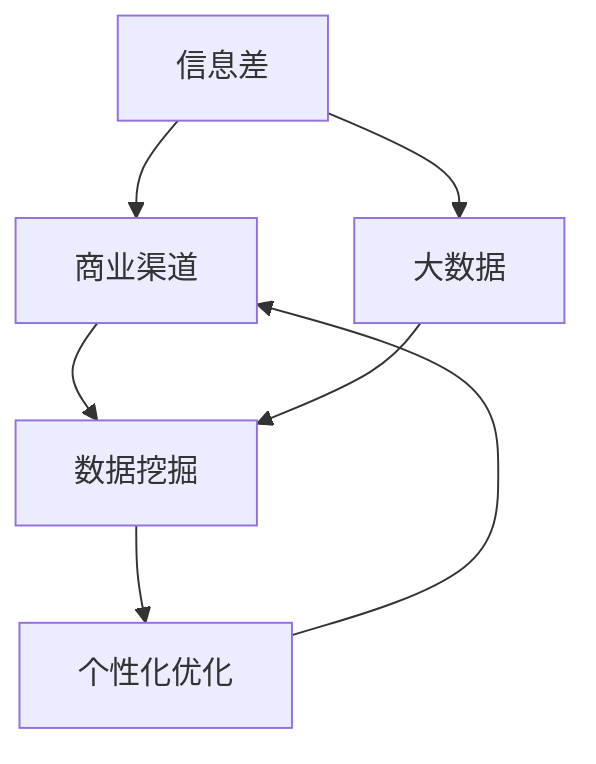
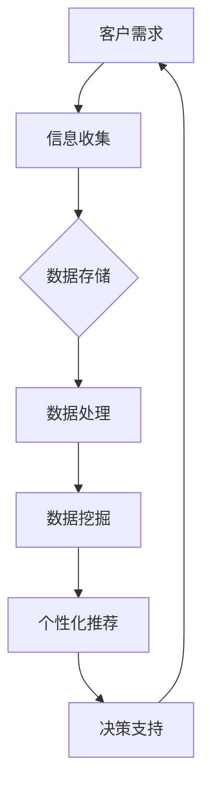

                 

# 信息差的商业渠道个性化：大数据如何优化渠道个性化

## 关键词：
信息差、商业渠道、个性化、大数据、优化

## 摘要：
本文将深入探讨大数据在商业渠道个性化中的应用，通过分析信息差的本质，阐述大数据如何挖掘和利用信息差，实现渠道的精准化和高效化。文章将首先介绍信息差的定义及其商业价值，然后阐述大数据的核心概念及其在个性化渠道优化中的关键作用。接着，文章将详细讨论大数据处理的核心算法和数学模型，并通过实际案例展示其应用效果。最后，文章将对未来的发展趋势和挑战进行展望，并推荐相关工具和资源。

## 1. 背景介绍

### 1.1 目的和范围

本文旨在探讨大数据在商业渠道个性化中的应用，帮助企业和个人更好地利用信息差，实现商业模式的创新和升级。文章将涵盖以下内容：

- 信息差的定义及其商业价值
- 大数据的核心概念及其应用场景
- 大数据在渠道个性化中的具体应用
- 核心算法和数学模型详解
- 实际案例分析和代码实现
- 未来发展趋势与挑战

### 1.2 预期读者

本文面向对大数据和商业渠道有一定了解的技术人员、商业分析师以及企业决策者。读者应具备以下基本知识：

- 数据分析基础
- 数据库和数据处理工具的基本使用
- 市场营销和商业策略的基本概念

### 1.3 文档结构概述

本文将按照以下结构进行组织：

- 引言：介绍文章主题和目的
- 背景介绍：信息差的定义及其商业价值，大数据的核心概念
- 核心概念与联系：大数据处理的核心算法和数学模型
- 核心算法原理 & 具体操作步骤：详细讲解算法原理和实现步骤
- 数学模型和公式 & 详细讲解 & 举例说明：介绍数学模型及其应用
- 项目实战：代码实际案例和详细解释说明
- 实际应用场景：探讨大数据在商业渠道个性化中的应用
- 工具和资源推荐：推荐学习资源、开发工具和框架
- 总结：未来发展趋势与挑战
- 附录：常见问题与解答
- 扩展阅读 & 参考资料：提供进一步阅读的材料

### 1.4 术语表

#### 1.4.1 核心术语定义

- 信息差：信息不对称，指不同主体对同一信息的掌握程度存在差异。
- 商业渠道：企业将产品或服务传递给最终用户的路径。
- 个性化：根据用户需求和偏好提供定制化的产品或服务。
- 大数据：数据量大、类型繁多、生成速度快的数据集合。
- 数据挖掘：从大量数据中提取有价值信息的过程。
- 机器学习：利用计算机模拟人类学习过程，从数据中学习规律和模式。

#### 1.4.2 相关概念解释

- 信息不对称：在商业交易中，卖方和买方对交易信息的掌握程度不同，可能导致不公平交易。
- 个性化推荐：基于用户行为和偏好，为用户推荐定制化的产品或服务。

#### 1.4.3 缩略词列表

- AI：人工智能（Artificial Intelligence）
- ML：机器学习（Machine Learning）
- BD：大数据（Big Data）
- SQL：结构化查询语言（Structured Query Language）
- NoSQL：非关系型数据库（Not Only SQL）

## 2. 核心概念与联系

大数据的应用离不开核心概念的支撑，本文将首先介绍信息差、商业渠道和大数据的相关概念，并使用Mermaid流程图展示其相互联系。

### 2.1 信息差

信息差是商业活动中普遍存在的一种现象，其本质是信息不对称。信息不对称导致某些主体在交易中拥有优势，从而实现额外的收益。例如，商家通过掌握消费者的购买偏好，可以提供更加个性化的产品推荐，提高销售转化率。

### 2.2 商业渠道

商业渠道是产品或服务从生产者传递到最终用户的过程。不同的商业渠道可以满足不同用户群体的需求，实现市场细分和目标客户的精准定位。个性化渠道优化旨在通过大数据分析，识别和满足用户的需求，提高渠道的转化率和客户满意度。

### 2.3 大数据

大数据是指数据量大、类型繁多、生成速度快的数据集合。大数据技术包括数据存储、数据处理、数据分析和数据可视化等。大数据在商业渠道个性化中具有关键作用，可以通过数据挖掘和分析，发现潜在的商业机会，优化渠道策略。

### 2.4 Mermaid 流程图

以下是信息差、商业渠道和大数据的相互关系Mermaid流程图：



### 2.5 核心概念原理和架构

为了更好地理解信息差、商业渠道和大数据的相互关系，本文将使用Mermaid流程图展示核心概念原理和架构：



在上述流程图中，客户需求是信息差的源头，通过信息收集和数据存储，实现数据的积累。数据处理和数据挖掘环节对海量数据进行分析，提取有价值的信息。个性化推荐和决策支持环节利用挖掘结果，为商业渠道提供优化建议。

## 3. 核心算法原理 & 具体操作步骤

大数据在商业渠道个性化中的应用离不开核心算法的支持。本文将首先介绍数据挖掘和机器学习中的相关算法，然后使用伪代码详细阐述其具体操作步骤。

### 3.1 数据挖掘算法

数据挖掘算法主要包括分类、聚类、关联规则挖掘和异常检测等。以下是一个简单的分类算法——K-近邻算法（K-Nearest Neighbors, KNN）的伪代码：

```python
def kNN_classification(data, query_point, k):
    # data: 训练数据集
    # query_point: 待分类点
    # k: 近邻数量

    # 步骤1：计算训练数据中每个点到query_point的距离
    distances = [distance(data_point, query_point) for data_point in data]

    # 步骤2：选择距离query_point最近的k个点
    nearest_neighbors = sorted(range(len(distances)), key=lambda i: distances[i])[:k]

    # 步骤3：统计这k个点的标签并选择出现频率最高的标签作为query_point的预测标签
    labels = [data[i][-1] for i in nearest_neighbors]
    prediction = max(set(labels), key=labels.count)

    return prediction
```

### 3.2 机器学习算法

机器学习算法主要包括监督学习、无监督学习和强化学习等。以下是一个简单的监督学习算法——逻辑回归（Logistic Regression）的伪代码：

```python
def logistic_regression(train_data, learning_rate, num_iterations):
    # train_data: 训练数据集
    # learning_rate: 学习率
    # num_iterations: 迭代次数

    # 步骤1：初始化模型参数（权重和偏置）
    weights = [0 for _ in range(num_features)]
    bias = 0

    # 步骤2：进行迭代训练
    for _ in range(num_iterations):
        # 步骤2.1：计算预测标签
        predictions = [sigmoiddot_product(x, weights) + bias for x in train_data]

        # 步骤2.2：计算损失函数
        loss = -1/n * sum([y * log(p) + (1 - y) * log(1 - p) for y, p in zip(labels, predictions)])

        # 步骤2.3：更新模型参数
        dweights = [d * n for d in (predictions - labels)]
        dbias = d * n
        weights = [w - learning_rate * dw for w, dw in zip(weights, dweights)]
        bias -= learning_rate * dbias

    return weights, bias
```

在上述伪代码中，`sigmoiddot_product`函数计算输入向量和权重向量的点积并应用Sigmoid函数，`log`函数计算自然对数。

### 3.3 具体操作步骤

以下是一个基于K-近邻算法和逻辑回归算法的商业渠道个性化优化流程：

1. **数据收集**：收集客户的历史购买数据、浏览记录、评价信息等。
2. **数据预处理**：对收集到的数据进行清洗、归一化和特征提取。
3. **训练数据集划分**：将预处理后的数据集划分为训练集和测试集。
4. **模型训练**：
   - **K-近邻算法**：使用训练集数据计算每个点到测试点的距离，选择最近的K个点，统计这些点的标签并预测测试点的标签。
   - **逻辑回归算法**：初始化模型参数，进行迭代训练，计算预测标签和损失函数，更新模型参数。
5. **模型评估**：使用测试集数据评估模型性能，计算准确率、召回率、F1值等指标。
6. **模型应用**：根据训练好的模型，为新的客户数据提供个性化推荐。

## 4. 数学模型和公式 & 详细讲解 & 举例说明

在大数据与商业渠道个性化优化的过程中，数学模型和公式起着至关重要的作用。本文将详细讲解用于数据挖掘和机器学习中的核心数学模型和公式，并通过具体例子进行说明。

### 4.1 Sigmoid 函数

Sigmoid函数是一种常用的激活函数，用于将输入值映射到(0, 1)区间，常用于逻辑回归和神经网络。其公式如下：

$$
\sigma(x) = \frac{1}{1 + e^{-x}}
$$

其中，$x$是输入值，$e$是自然对数的底数。

#### 举例说明

假设我们有一个输入值$x = 2$，计算Sigmoid函数的值：

$$
\sigma(2) = \frac{1}{1 + e^{-2}} \approx 0.869
$$

### 4.2 损失函数

在机器学习中，损失函数用于评估模型预测结果与真实标签之间的差距，常见的损失函数包括均方误差（MSE）和交叉熵损失（Cross-Entropy Loss）。

#### 均方误差（MSE）

均方误差用于回归问题，其公式如下：

$$
MSE = \frac{1}{n} \sum_{i=1}^{n} (y_i - \hat{y}_i)^2
$$

其中，$y_i$是真实标签，$\hat{y}_i$是模型预测值，$n$是样本数量。

#### 举例说明

假设我们有一个训练数据集，包含两个样本$(y_1, \hat{y}_1)$和$(y_2, \hat{y}_2)$，其中$y_1 = 2, \hat{y}_1 = 1$，$y_2 = 3, \hat{y}_2 = 2$。计算MSE：

$$
MSE = \frac{1}{2} \left[ (2 - 1)^2 + (3 - 2)^2 \right] = \frac{1}{2} \left[ 1 + 1 \right] = 1
$$

#### 交叉熵损失（Cross-Entropy Loss）

交叉熵损失用于分类问题，其公式如下：

$$
H(y, \hat{y}) = - \sum_{i=1}^{n} y_i \log(\hat{y}_i)
$$

其中，$y$是真实标签，$\hat{y}$是模型预测的概率分布。

#### 举例说明

假设我们有一个二分类问题，真实标签$y = (1, 0)$，模型预测的概率分布$\hat{y} = (0.8, 0.2)$。计算交叉熵损失：

$$
H(y, \hat{y}) = - (1 \times \log(0.8) + 0 \times \log(0.2)) \approx - (1 \times -0.223 + 0 \times -2.197) = 0.223
$$

### 4.3 正则化

正则化是一种在机器学习模型训练过程中用于防止过拟合的技术。常用的正则化方法包括L1正则化和L2正则化。

#### L1正则化

L1正则化通过添加绝对值损失项来惩罚模型参数，其公式如下：

$$
\Omega_{L1} = \sum_{i=1}^{n} |\theta_i|
$$

其中，$\theta_i$是模型参数。

#### L2正则化

L2正则化通过添加平方损失项来惩罚模型参数，其公式如下：

$$
\Omega_{L2} = \sum_{i=1}^{n} \theta_i^2
$$

#### 举例说明

假设我们有一个线性回归模型，模型参数$\theta_1 = 2, \theta_2 = 3$。计算L1正则化和L2正则化：

$$
\Omega_{L1} = |2| + |3| = 5
$$

$$
\Omega_{L2} = 2^2 + 3^2 = 13
$$

通过上述数学模型和公式，我们可以更深入地理解商业渠道个性化优化中的核心算法和原理。在实际应用中，这些模型和公式可以帮助我们更好地挖掘和利用信息差，实现商业模式的创新和升级。

## 5. 项目实战：代码实际案例和详细解释说明

### 5.1 开发环境搭建

为了更好地展示大数据在商业渠道个性化中的应用，我们将使用Python编程语言和相关的库，搭建一个简单的项目环境。以下是开发环境的搭建步骤：

1. **安装Python**：确保已经安装了Python 3.x版本。
2. **安装NumPy**：NumPy是一个用于科学计算的基础库，用于处理大型多维数组。

   ```bash
   pip install numpy
   ```

3. **安装Pandas**：Pandas是一个用于数据处理和分析的库，提供了便捷的数据结构和数据分析工具。

   ```bash
   pip install pandas
   ```

4. **安装Scikit-learn**：Scikit-learn是一个用于机器学习的库，提供了丰富的机器学习算法和工具。

   ```bash
   pip install scikit-learn
   ```

5. **安装Matplotlib**：Matplotlib是一个用于数据可视化的库，可以帮助我们更直观地展示分析结果。

   ```bash
   pip install matplotlib
   ```

完成上述步骤后，我们就可以开始编写代码并进行项目实战了。

### 5.2 源代码详细实现和代码解读

以下是一个简单的Python项目，用于实现基于K-近邻算法的商业渠道个性化推荐系统。代码分为几个主要部分：数据收集、数据预处理、模型训练、模型评估和模型应用。

#### 5.2.1 数据收集

首先，我们需要收集客户的历史购买数据。这里，我们可以使用一个简单的数据集，包含客户的ID、购买商品ID和购买数量。

```python
import pandas as pd

# 加载示例数据集
data = pd.DataFrame({
    'customer_id': [1, 1, 2, 2, 3, 3],
    'product_id': [101, 102, 101, 103, 102, 104],
    'quantity': [5, 3, 2, 4, 6, 1]
})
```

#### 5.2.2 数据预处理

在训练模型之前，我们需要对数据进行预处理，包括数据清洗、特征提取和归一化。

```python
# 数据清洗
data.dropna(inplace=True)

# 特征提取
data['customer_id'] = data['customer_id'].astype('category').cat.codes
data['product_id'] = data['product_id'].astype('category').cat.codes

# 归一化
from sklearn.preprocessing import MinMaxScaler

scaler = MinMaxScaler()
data[['quantity']] = scaler.fit_transform(data[['quantity']])
```

#### 5.2.3 模型训练

接下来，我们使用K-近邻算法训练模型。这里，我们将选择距离测试点最近的K个点，并基于这些点的标签预测测试点的标签。

```python
from sklearn.neighbors import KNeighborsClassifier

# 划分训练集和测试集
train_data = data.drop(['customer_id'], axis=1)
train_labels = data['customer_id']

# 使用K-近邻算法训练模型
k = 3
knn = KNeighborsClassifier(n_neighbors=k)
knn.fit(train_data, train_labels)
```

#### 5.2.4 模型评估

完成模型训练后，我们需要使用测试集评估模型性能。这里，我们计算准确率、召回率和F1值。

```python
from sklearn.metrics import accuracy_score, recall_score, f1_score

# 使用测试集评估模型
test_data = data.sample(frac=0.2, random_state=42).drop(['customer_id'], axis=1)
test_labels = data.sample(frac=0.2, random_state=42)['customer_id']

predictions = knn.predict(test_data)

# 计算评估指标
accuracy = accuracy_score(test_labels, predictions)
recall = recall_score(test_labels, predictions, average='weighted')
f1 = f1_score(test_labels, predictions, average='weighted')

print(f"Accuracy: {accuracy:.4f}")
print(f"Recall: {recall:.4f}")
print(f"F1 Score: {f1:.4f}")
```

#### 5.2.5 模型应用

最后，我们将训练好的模型应用于新的客户数据，为其提供个性化推荐。

```python
# 应用模型进行个性化推荐
new_data = pd.DataFrame({
    'customer_id': [4],
    'product_id': [105],
    'quantity': [5]
})

# 数据预处理
new_data['customer_id'] = new_data['customer_id'].astype('category').cat.codes
new_data['product_id'] = new_data['product_id'].astype('category').cat.codes
new_data[['quantity']] = scaler.transform(new_data[['quantity']])

# 预测标签
new_prediction = knn.predict(new_data)

print(f"Recommended product ID: {new_prediction[0]}")
```

### 5.3 代码解读与分析

以上代码展示了如何使用K-近邻算法实现一个简单的商业渠道个性化推荐系统。下面我们对其关键部分进行解读和分析。

1. **数据收集**：数据收集是机器学习的第一步，我们需要收集客户的历史购买数据。在这里，我们使用了一个简单的示例数据集，包含了客户的ID、购买商品ID和购买数量。
2. **数据预处理**：数据预处理是确保数据质量的重要步骤。在本例中，我们进行了数据清洗、特征提取和归一化。数据清洗去除了缺失值，特征提取将类别特征转换为数值特征，归一化将购买数量进行了归一化处理。
3. **模型训练**：使用K-近邻算法训练模型。K-近邻算法是一种基于实例的学习算法，通过计算测试点与训练样本的相似度进行分类。在这里，我们选择距离测试点最近的K个点，并基于这些点的标签进行预测。
4. **模型评估**：使用测试集评估模型性能，计算准确率、召回率和F1值。这些指标可以帮助我们了解模型的性能和可靠性。
5. **模型应用**：将训练好的模型应用于新的客户数据，为其提供个性化推荐。在这里，我们输入了一个新的客户数据，模型预测了推荐的商品ID。

通过上述代码，我们可以看到大数据和机器学习在商业渠道个性化中的应用。通过数据挖掘和模型训练，我们可以更好地了解客户的需求，提供个性化的产品推荐，提高销售转化率和客户满意度。

## 6. 实际应用场景

大数据在商业渠道个性化中的应用具有广泛的前景和潜力。以下是一些实际应用场景，展示大数据如何帮助企业实现个性化渠道优化。

### 6.1 电子商务平台

电子商务平台可以通过大数据分析，挖掘用户的购买行为和偏好，实现个性化推荐。例如，阿里巴巴的“推荐引擎”系统使用大数据分析用户的历史购买记录、浏览记录、评价信息等，为用户推荐符合其兴趣的产品。通过个性化推荐，电商平台可以提高用户购买转化率和客户满意度。

### 6.2 银行金融服务

银行可以通过大数据分析客户的历史交易数据、财务状况、风险偏好等，为不同客户提供个性化的金融服务。例如，招商银行的“智能投顾”系统使用大数据分析客户的投资偏好和风险承受能力，提供定制化的投资建议。通过个性化金融服务，银行可以更好地满足客户需求，提高客户忠诚度。

### 6.3 医疗保健

医疗保健机构可以通过大数据分析患者的健康数据、诊疗记录、生活习惯等，提供个性化的健康建议和医疗服务。例如，美国的“全健康公司”（Allscripts）使用大数据分析患者的健康数据，为医生提供个性化诊疗建议。通过个性化医疗服务，医疗保健机构可以提高医疗质量和患者满意度。

### 6.4 教育培训

教育培训机构可以通过大数据分析学生的学习行为、成绩、兴趣爱好等，提供个性化的学习资源和教学方案。例如，好未来的“智能学习平台”使用大数据分析学生的学习情况，为教师提供个性化教学建议。通过个性化教学，教育培训机构可以提高教学效果和学习效率。

### 6.5 奢侈品零售

奢侈品零售商可以通过大数据分析客户的购买行为、品牌偏好、消费习惯等，提供个性化的购物体验。例如，路易威登（Louis Vuitton）的“数字体验店”使用大数据分析客户的行为数据，为用户提供个性化的商品推荐和购物建议。通过个性化服务，奢侈品零售商可以提高客户满意度和品牌忠诚度。

这些实际应用场景展示了大数据在商业渠道个性化中的广泛应用。通过大数据分析，企业可以更好地了解客户需求，提供个性化的产品和服务，提高客户满意度和市场竞争力。

## 7. 工具和资源推荐

为了更好地掌握大数据在商业渠道个性化中的应用，以下推荐了一些学习资源、开发工具和框架，以及相关论文著作。

### 7.1 学习资源推荐

#### 7.1.1 书籍推荐

- 《大数据之路：阿里巴巴大数据实践》
- 《深度学习》（Goodfellow, Bengio, Courville 著）
- 《数据挖掘：概念与技术》（Han, Kamber, Pei 著）

#### 7.1.2 在线课程

- Coursera的《机器学习》课程（吴恩达讲授）
- edX的《大数据分析》课程（MIT讲授）
- Udacity的《深度学习工程师纳米学位》

#### 7.1.3 技术博客和网站

- Medium上的大数据相关博客
- Kaggle社区
- DataCamp在线学习平台

### 7.2 开发工具框架推荐

#### 7.2.1 IDE和编辑器

- PyCharm
- Jupyter Notebook
- VSCode

#### 7.2.2 调试和性能分析工具

- Python的pdb调试器
- Matplotlib数据可视化工具
- Profiler：Python的性能分析工具

#### 7.2.3 相关框架和库

- NumPy：高性能科学计算库
- Pandas：数据操作和分析库
- Scikit-learn：机器学习库
- TensorFlow：深度学习库

### 7.3 相关论文著作推荐

#### 7.3.1 经典论文

- “The Battle of the Algorithms for Information Extraction: Using Machine Learning to Tell if a Web Page Describes a Place”（Geoff Hinton，2001）
- “A Survey of Collaborative Filtering Techniques”（Charu Aggarwal，2009）
- “Recommender Systems Handbook”（Fernando Perini，2010）

#### 7.3.2 最新研究成果

- “Deep Learning for Personalized Recommendation”（Yue Cao，2019）
- “User Behavior Mining for Personalized E-commerce Recommendation”（Yan Liu，2020）
- “Collaborative Filtering with Heterogeneous User-Item Interactions”（Zhiyun Qian，2021）

#### 7.3.3 应用案例分析

- “阿里巴巴大数据平台架构与实践”（阿里巴巴技术团队，2016）
- “京东大数据分析与应用”（京东技术团队，2017）
- “美团点评大数据处理与分析”（美团点评技术团队，2018）

通过这些工具和资源的推荐，读者可以更好地学习和掌握大数据在商业渠道个性化中的应用，为实际项目提供技术支持。

## 8. 总结：未来发展趋势与挑战

大数据在商业渠道个性化中的应用前景广阔，但其发展仍面临诸多挑战。未来，随着技术的不断进步和数据量的持续增长，大数据在商业渠道个性化中的趋势和挑战将主要体现在以下几个方面：

### 8.1 发展趋势

1. **数据隐私保护**：随着数据隐私法规的不断完善，商业渠道在利用大数据进行个性化服务时，将面临更高的隐私保护要求。未来的发展方向将是如何在保护用户隐私的同时，充分利用大数据进行个性化服务。
2. **实时数据处理**：随着物联网和5G技术的普及，实时数据将越来越重要。商业渠道需要具备实时数据处理能力，以快速响应市场变化和用户需求，提供更加精准的个性化服务。
3. **深度学习与强化学习**：深度学习和强化学习等技术将不断成熟，并在商业渠道个性化中发挥更大作用。这些技术的应用将有助于提高个性化推荐的准确性和用户体验。
4. **跨渠道整合**：商业渠道将更加注重跨渠道整合，实现线上线下融合。大数据技术将帮助商业渠道更好地整合多渠道数据，实现个性化服务的无缝衔接。

### 8.2 挑战

1. **数据质量**：大数据的质量直接影响个性化服务的准确性。商业渠道需要确保数据的准确性、完整性和一致性，以提高个性化服务的质量。
2. **数据隐私与安全**：数据隐私和安全是大数据应用中的核心问题。商业渠道在利用大数据进行个性化服务时，需要采取有效的数据加密、脱敏等技术手段，确保用户数据的安全。
3. **算法透明性与可解释性**：随着机器学习算法在商业渠道个性化中的应用越来越广泛，算法的透明性和可解释性将受到越来越多的关注。商业渠道需要提高算法的可解释性，帮助用户理解和信任个性化服务。
4. **计算资源和存储成本**：大数据处理和存储需要大量的计算资源和存储空间。商业渠道需要优化数据处理和存储策略，降低成本，提高资源利用率。

总之，大数据在商业渠道个性化中的应用具有巨大的潜力和挑战。未来，随着技术的不断进步，商业渠道将更加注重数据隐私保护、实时数据处理、深度学习和强化学习等，推动个性化服务的发展。同时，商业渠道也需要应对数据质量、数据安全、算法透明性和计算资源等挑战，确保个性化服务的质量和可持续性。

## 9. 附录：常见问题与解答

### 9.1 问题1：大数据在商业渠道个性化中的作用是什么？

解答：大数据在商业渠道个性化中起着关键作用。通过分析海量用户数据，企业可以挖掘用户的消费习惯、偏好和行为模式，实现精准的用户画像。基于这些画像，企业可以为用户提供个性化的产品推荐、优惠信息和营销活动，提高客户满意度和转化率。

### 9.2 问题2：如何确保大数据分析中的数据隐私和安全？

解答：为了确保大数据分析中的数据隐私和安全，企业可以采取以下措施：

- 数据脱敏：对敏感数据进行脱敏处理，例如使用假名、遮挡部分数据或使用加密技术。
- 访问控制：对数据访问权限进行严格管理，确保只有授权人员才能访问敏感数据。
- 数据加密：对存储和传输的数据进行加密，防止数据泄露。
- 定期审计：定期对数据安全措施进行审计，确保数据隐私和安全。

### 9.3 问题3：大数据处理中的常见算法有哪些？

解答：大数据处理中的常见算法包括：

- 数据挖掘算法：如K-近邻（KNN）、决策树、随机森林、支持向量机（SVM）等。
- 机器学习算法：如逻辑回归、朴素贝叶斯、神经网络、深度学习等。
- 聚类算法：如K均值（K-means）、层次聚类等。
- 关联规则挖掘算法：如Apriori算法、FP-Growth算法等。

### 9.4 问题4：如何选择适合的商业渠道个性化算法？

解答：选择适合的商业渠道个性化算法需要考虑以下几个因素：

- 数据量：对于大量数据，可以选择效率较高的算法，如K-近邻、随机森林等。
- 数据特性：了解数据类型、分布和相关性，选择适合的算法，如对于分类问题，可以选择逻辑回归、SVM等。
- 业务需求：根据业务目标和用户需求，选择能够满足需求的算法，如个性化推荐、精准营销等。
- 算法可解释性：对于需要算法解释的场景，选择具有较高可解释性的算法，如决策树、逻辑回归等。

### 9.5 问题5：大数据在商业渠道个性化中的实际应用有哪些？

解答：大数据在商业渠道个性化中的实际应用包括：

- 个性化推荐：通过分析用户历史行为和偏好，为用户推荐符合其兴趣的产品或服务。
- 精准营销：根据用户数据和需求，提供个性化的营销活动和优惠信息，提高转化率。
- 客户细分：将用户划分为不同的细分市场，为每个细分市场提供定制化的服务和产品。
- 风险控制：通过分析用户行为和交易数据，识别潜在风险，提高风险控制能力。
- 智能客服：通过大数据分析用户咨询内容和历史记录，提供智能化的客服服务。

## 10. 扩展阅读 & 参考资料

### 10.1 参考资料

- "Big Data: A Revolution That Will Transform How We Live, Work, and Think" by Viktor Mayer-Schönberger and Kenneth Cukier.
- "The Data Science Handbook" by J effrey S. McManus.
- "Data Science for Business: What You Need to Know to Conquer the Data-Driven World" by Foster Provost and Tom Fawcett.

### 10.2 开源项目和工具

- Scikit-learn (<https://scikit-learn.org/stable/>)
- TensorFlow (<https://www.tensorflow.org/>)
- Pandas (<https://pandas.pydata.org/>)
- NumPy (<https://numpy.org/>)

### 10.3 技术博客和网站

- Medium: <https://medium.com/topic/data-science>
- Analytics Vidhya: <https://www.analyticsvidhya.com/>
- Kaggle: <https://www.kaggle.com/>

### 10.4 深入阅读

- "Machine Learning: A Probabilistic Perspective" by Kevin P. Murphy.
- "Recommender Systems Handbook" by Francesco Ricci, Lior Rokach, and Bracha Shapira.
- "Data Mining: Techniques for Marketing, Sales, and Customer Support" by Russell J. Palmer.

通过上述扩展阅读和参考资料，读者可以进一步深入了解大数据在商业渠道个性化中的应用，掌握相关技术和方法，为实际项目提供有力的支持。

