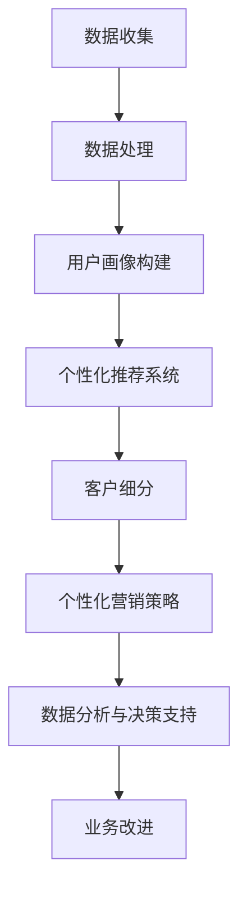

                 

### 文章标题

《信息差的商业营销个性化：大数据如何实现营销个性化》

随着互联网和大数据技术的飞速发展，信息传播的速度和广度都达到了前所未有的高度。在这样的背景下，商业营销也逐渐从传统的“广撒网、广捞鱼”模式转向了更加精准和个性化的方向。本文将深入探讨大数据技术在商业营销个性化中的应用，旨在帮助读者理解信息差在商业营销中的作用，以及如何通过大数据技术实现个性化营销。

本文将从以下几个方面进行探讨：

1. **背景介绍**：介绍大数据和个性化营销的基本概念，以及它们在商业营销中的重要性。
2. **核心概念与联系**：详细讲解大数据营销中的核心概念和它们之间的联系，并提供相关的流程图。
3. **核心算法原理**：剖析实现个性化营销的核心算法原理，并使用伪代码详细阐述算法步骤。
4. **数学模型和公式**：介绍支持个性化营销的数学模型和公式，并进行举例说明。
5. **项目实战**：通过实际案例展示如何使用大数据技术实现个性化营销。
6. **实际应用场景**：分析个性化营销在不同商业场景中的应用情况。
7. **工具和资源推荐**：推荐相关学习资源、开发工具和框架。
8. **总结与展望**：讨论大数据个性化营销的未来发展趋势与面临的挑战。
9. **附录**：提供常见问题的解答。
10. **扩展阅读**：推荐相关参考资料。

通过本文的阅读，读者将能够系统地了解大数据在商业营销中的应用，掌握个性化营销的核心技术和方法，从而为未来的商业策略提供有力支持。现在，让我们一步一步深入探讨这个充满机遇和挑战的领域。

---

### 关键词

- 大数据
- 商业营销
- 个性化
- 信息差
- 营销算法
- 数学模型
- 数据分析
- 实战案例

### 摘要

本文围绕大数据技术在商业营销个性化中的应用展开，首先介绍了大数据和个性化营销的基本概念及其重要性。接着，文章详细讲解了个性化营销中的核心概念、核心算法原理以及数学模型，并通过实际案例展示了如何实现个性化营销。随后，文章分析了个性化营销在不同商业场景中的应用情况，并推荐了相关的学习资源、开发工具和框架。最后，文章总结了大数据个性化营销的未来发展趋势与挑战，为读者提供了实用的指导和建议。通过本文的阅读，读者将能够深入了解大数据在商业营销中的潜力，并掌握实现个性化营销的关键技术。

---

## 1. 背景介绍

### 1.1 目的和范围

本文的目的是探讨大数据在商业营销个性化中的应用，帮助读者理解信息差在商业营销中的作用，并掌握通过大数据实现个性化营销的核心技术和方法。本文将涵盖以下范围：

- **大数据基础**：介绍大数据的定义、特点及其在商业领域的重要性。
- **个性化营销**：解释个性化营销的概念、目的及其与大数据技术的联系。
- **信息差的作用**：探讨信息差在商业营销中的作用，如何利用信息差实现个性化营销。
- **核心算法和模型**：详细讲解支持个性化营销的核心算法原理和数学模型。
- **实战案例**：通过具体案例展示如何利用大数据技术实现个性化营销。
- **实际应用场景**：分析个性化营销在不同商业场景中的应用情况。
- **工具和资源推荐**：推荐相关的学习资源、开发工具和框架。

### 1.2 预期读者

本文适合以下读者群体：

- **市场营销从业者**：希望了解大数据在营销中的应用，提升营销效果的从业者。
- **数据科学家**：对大数据技术感兴趣，希望深入了解其在商业营销中的实际应用。
- **数据分析专业人员**：希望学习如何利用大数据技术实现个性化营销的专业人员。
- **商业管理人员**：希望通过大数据技术提升企业竞争力，实现商业创新的管理者。
- **对商业和技术交叉领域感兴趣的读者**：希望了解商业营销与大数据技术如何结合的读者。

### 1.3 文档结构概述

本文的结构如下：

1. **背景介绍**：介绍大数据和个性化营销的基本概念，以及它们在商业营销中的重要性。
2. **核心概念与联系**：详细讲解大数据营销中的核心概念和它们之间的联系，并提供相关的流程图。
3. **核心算法原理**：剖析实现个性化营销的核心算法原理，并使用伪代码详细阐述算法步骤。
4. **数学模型和公式**：介绍支持个性化营销的数学模型和公式，并进行举例说明。
5. **项目实战**：通过实际案例展示如何使用大数据技术实现个性化营销。
6. **实际应用场景**：分析个性化营销在不同商业场景中的应用情况。
7. **工具和资源推荐**：推荐相关学习资源、开发工具和框架。
8. **总结与展望**：讨论大数据个性化营销的未来发展趋势与面临的挑战。
9. **附录**：提供常见问题的解答。
10. **扩展阅读**：推荐相关参考资料。

### 1.4 术语表

#### 1.4.1 核心术语定义

- **大数据**：指数据量巨大、类型繁多、价值密度低的数据集合。常见的大数据特征包括“4V”，即Volume（数据量）、Velocity（数据流转速度）、Variety（数据多样性）和Value（数据价值密度）。
- **个性化营销**：指基于用户数据的分析，对不同的用户提供不同的营销内容和策略，从而提高营销效果和用户满意度。
- **信息差**：指不同主体在信息获取、处理和利用上的差异，利用信息差可以实现营销的差异化优势。
- **机器学习**：一种人工智能技术，通过数据训练模型，使计算机能够从数据中学习规律并做出预测。
- **数据挖掘**：从大量数据中发现有价值信息的过程，常用于市场分析、商业决策等。

#### 1.4.2 相关概念解释

- **用户画像**：通过对用户数据的分析，构建出用户的综合特征模型，用于指导个性化营销。
- **协同过滤**：一种推荐系统算法，通过分析用户的兴趣和行为，向用户推荐可能感兴趣的商品或内容。
- **内容分发**：指将特定的内容或信息分发到目标用户群体，以提高用户接触和参与度。

#### 1.4.3 缩略词列表

- **AI**：人工智能（Artificial Intelligence）
- **ML**：机器学习（Machine Learning）
- **DL**：深度学习（Deep Learning）
- **NLP**：自然语言处理（Natural Language Processing）
- **SEO**：搜索引擎优化（Search Engine Optimization）
- **SEM**：搜索引擎营销（Search Engine Marketing）
- **CRM**：客户关系管理（Customer Relationship Management）

---

### 2. 核心概念与联系

在探讨大数据与个性化营销的结合时，理解其中的核心概念和它们之间的联系是至关重要的。以下是大数据营销中的几个关键概念以及它们之间的相互关系。

#### 2.1 数据收集与整合

首先，数据收集是大数据营销的基础。企业通过多种渠道收集用户数据，包括用户行为数据、社交媒体数据、交易数据等。这些数据来源可以是内部数据，如企业自有数据库，也可以是外部数据，如第三方数据提供商。

数据收集后，需要通过数据整合进行清洗和预处理，确保数据的准确性和一致性。数据整合的目的是将来自不同渠道和格式的数据统一成标准格式，以便后续的分析和处理。

#### 2.2 用户画像构建

用户画像是对用户特征的综合描述，通常包括用户的基本信息（如年龄、性别、地理位置等）和兴趣偏好（如购物习惯、阅读偏好等）。用户画像的构建依赖于数据分析技术，通过分析用户的历史行为数据，可以发现用户的兴趣和行为模式。

用户画像的构建通常包括以下几个步骤：

1. **数据收集**：收集用户的基础信息和行为数据。
2. **数据处理**：对收集到的数据清洗、去重和标准化。
3. **特征提取**：从处理后的数据中提取出有用的特征，如用户访问频次、购买频次等。
4. **模型训练**：使用机器学习算法训练用户画像模型。
5. **模型评估与优化**：评估模型效果并进行调整。

#### 2.3 个性化推荐系统

个性化推荐系统是大数据营销中的一项关键技术。它通过分析用户的兴趣和行为，向用户推荐可能感兴趣的商品或内容。常见的推荐算法包括协同过滤、基于内容的推荐和混合推荐等。

协同过滤算法通过分析用户之间的相似度，发现用户的共同兴趣，从而推荐新的商品或内容。基于内容的推荐算法通过分析商品或内容的特征，将具有相似特征的物品推荐给用户。混合推荐算法结合了协同过滤和基于内容的推荐，以提供更准确的推荐结果。

#### 2.4 客户细分与个性化营销

通过用户画像和个性化推荐系统，企业可以将客户细分为不同的群体，并对每个群体实施不同的营销策略。客户细分可以帮助企业更精确地定位目标客户，提高营销效果。

客户细分的步骤包括：

1. **用户画像**：构建详细的用户画像。
2. **特征选择**：从用户画像中提取有价值的特征。
3. **聚类分析**：使用聚类算法将用户划分为不同的群体。
4. **策略制定**：为每个群体制定个性化的营销策略。

#### 2.5 数据分析与决策支持

数据分析是大数据营销的核心环节。通过对用户数据的深入分析，企业可以获取有价值的市场洞察，指导商业决策。

数据分析的步骤包括：

1. **数据收集**：收集相关的用户和行为数据。
2. **数据处理**：对数据进行清洗、整合和预处理。
3. **数据分析**：使用统计分析和数据挖掘技术，发现数据中的规律和模式。
4. **决策支持**：根据分析结果，制定和调整营销策略。

### Mermaid 流程图

下面是一个简单的Mermaid流程图，展示个性化营销中核心概念和步骤的连接关系：



---

通过这个流程图，我们可以更直观地理解大数据在个性化营销中的作用和各个环节之间的联系。接下来，我们将深入探讨个性化营销的核心算法原理和具体操作步骤。

---

## 3. 核心算法原理 & 具体操作步骤

在个性化营销中，核心算法的选择和实现至关重要。以下将介绍几种常用的算法原理和具体的操作步骤，帮助读者理解如何通过这些算法实现个性化营销。

### 3.1 协同过滤算法

协同过滤（Collaborative Filtering）是一种常用的推荐系统算法，通过分析用户之间的相似度，发现用户的共同兴趣，从而推荐新的商品或内容。

#### 3.1.1 原理

协同过滤算法分为两种主要类型：基于用户的协同过滤（User-based Collaborative Filtering）和基于项目的协同过滤（Item-based Collaborative Filtering）。

- **基于用户的协同过滤**：寻找与目标用户兴趣相似的现有用户，推荐这些用户喜欢的商品或内容。
- **基于项目的协同过滤**：寻找与目标商品或内容相似的其他商品或内容，推荐给用户。

#### 3.1.2 操作步骤

1. **用户相似度计算**：计算目标用户与其他用户之间的相似度。常用的相似度计算方法包括余弦相似度、皮尔逊相关系数等。

   ```python
   def compute_similarity(user1, user2):
       # 计算用户间相似度（以余弦相似度为例）
       dot_product = np.dot(user1, user2)
       norm_product = np.linalg.norm(user1) * np.linalg.norm(user2)
       return dot_product / norm_product
   ```

2. **推荐列表生成**：基于用户相似度，生成推荐列表。对于每个用户，推荐列表中的商品或内容来自相似用户喜欢的商品或内容。

   ```python
   def generate_recommendations(target_user, similarity_matrix, user_ratings, top_n=10):
       # 生成推荐列表
       sorted_indices = np.argsort(similarity_matrix[target_user])[:-top_n-1:-1]
       recommended_items = [user_ratings[i] for i in sorted_indices if user_ratings[i] not in target_user_rated_items]
       return recommended_items
   ```

### 3.2 基于内容的推荐算法

基于内容的推荐算法（Content-based Recommender System）通过分析商品或内容的特征，将具有相似特征的物品推荐给用户。

#### 3.2.1 原理

基于内容的推荐算法根据用户过去的兴趣和偏好，提取用户感兴趣的特征，然后寻找具有相似特征的未体验过的商品或内容进行推荐。

#### 3.2.2 操作步骤

1. **特征提取**：从商品或内容中提取特征。常见的特征提取方法包括基于关键词、基于文本相似度等。

   ```python
   def extract_features(item):
       # 提取商品特征
       features = extract_keywords(item['description'])
       return features
   ```

2. **用户兴趣模型**：构建用户的兴趣模型，通常使用向量空间模型（Vector Space Model）。

   ```python
   def build_user_interest_model(user_interested_items):
       # 构建用户兴趣模型
       user_interest_vector = sum([extract_features(item) for item in user_interested_items]) / len(user_interested_items)
       return user_interest_vector
   ```

3. **推荐列表生成**：基于用户兴趣模型，计算商品或内容的相似度，生成推荐列表。

   ```python
   def generate_recommendations(user_interest_vector, all_items_features, top_n=10):
       # 生成推荐列表
       similarity_scores = compute_similarity(user_interest_vector, all_items_features)
       sorted_indices = np.argsort(-similarity_scores)[:top_n]
       recommended_items = [all_items[i] for i in sorted_indices if all_items[i] not in user_rated_items]
       return recommended_items
   ```

### 3.3 混合推荐算法

混合推荐算法（Hybrid Recommender System）结合了协同过滤和基于内容的推荐算法，以提供更准确的推荐结果。

#### 3.3.1 原理

混合推荐算法利用协同过滤算法获取用户和项目的相似度，同时结合基于内容的推荐算法，提高推荐系统的准确性。

#### 3.3.2 操作步骤

1. **用户和项目相似度计算**：使用协同过滤算法计算用户和项目的相似度。

2. **内容特征提取**：使用基于内容的推荐算法提取商品或内容的特征。

3. **混合评分模型**：结合用户相似度和内容特征，构建混合评分模型，计算推荐得分。

   ```python
   def hybrid_score(user, item, similarity_weight, content_weight):
       user_similarity = similarity_weight * compute_similarity(user, item)
       content_similarity = content_weight * compute_similarity(user_interest_vector, item_features)
       return user_similarity + content_similarity
   ```

4. **推荐列表生成**：基于混合评分模型，生成推荐列表。

   ```python
   def generate_hybrid_recommendations(user, all_users, all_items, similarity_weight=0.5, content_weight=0.5, top_n=10):
       # 生成推荐列表
       user_similarity_scores = {user: 1.0}
       for other_user in all_users:
           user_similarity = compute_similarity(user, other_user)
           user_similarity_scores[other_user] = user_similarity
       
       item_similarity_scores = {}
       for item in all_items:
           item_similarity = compute_similarity(user_interest_vector, item_features)
           item_similarity_scores[item] = item_similarity
        
       combined_scores = {}
       for user, user_similarity in user_similarity_scores.items():
           for item, item_similarity in item_similarity_scores.items():
               combined_score = hybrid_score(user, item, similarity_weight, content_weight)
               combined_scores[(user, item)] = combined_score
        
       sorted_indices = np.argsort(-list(combined_scores.values()))[:top_n]
       recommended_items = [(user, item) for (user, item) in combined_scores if (user, item) in sorted_indices]
       return recommended_items
   ```

通过上述核心算法原理和操作步骤，我们可以实现一个基本的个性化推荐系统。在实际应用中，可以根据具体需求和数据特性，调整和优化算法参数，以提高推荐效果。

---

在掌握了核心算法原理后，接下来我们将探讨支持个性化营销的数学模型和公式，这些数学工具将为个性化推荐和策略制定提供有力支持。

---

## 4. 数学模型和公式 & 详细讲解 & 举例说明

在个性化营销中，数学模型和公式扮演着至关重要的角色，它们为推荐系统提供了精确的计算基础，并帮助我们理解用户行为背后的逻辑。以下将介绍几种常用的数学模型和公式，并详细讲解它们的使用方法和实际案例。

### 4.1 余弦相似度

余弦相似度是一种常用的相似度计算方法，用于衡量两个向量之间的相似程度。它在推荐系统中广泛应用于用户和物品的相似度计算。

#### 4.1.1 公式

余弦相似度的计算公式如下：

$$
\cos\theta = \frac{\sum_{i=1}^{n} x_i y_i}{\sqrt{\sum_{i=1}^{n} x_i^2} \sqrt{\sum_{i=1}^{n} y_i^2}}
$$

其中，$x$ 和 $y$ 分别表示两个向量，$\theta$ 表示它们之间的夹角。

#### 4.1.2 应用示例

假设有两个用户 $A$ 和 $B$，他们的评分向量分别为 $x = [3, 2, 1, 5]$ 和 $y = [4, 3, 2, 4]$，我们可以计算他们的余弦相似度：

$$
\cos\theta = \frac{3 \times 4 + 2 \times 3 + 1 \times 2 + 5 \times 4}{\sqrt{3^2 + 2^2 + 1^2 + 5^2} \sqrt{4^2 + 3^2 + 2^2 + 4^2}} = \frac{12 + 6 + 2 + 20}{\sqrt{35} \sqrt{53}} \approx 0.95
$$

结果表明用户 $A$ 和 $B$ 的评分模式高度相似。

### 4.2 皮尔逊相关系数

皮尔逊相关系数是一种衡量两个变量线性相关性的方法，常用于用户行为数据的分析。

#### 4.2.1 公式

皮尔逊相关系数的计算公式如下：

$$
r = \frac{\sum_{i=1}^{n} (x_i - \bar{x})(y_i - \bar{y})}{\sqrt{\sum_{i=1}^{n} (x_i - \bar{x})^2} \sqrt{\sum_{i=1}^{n} (y_i - \bar{y})^2}}
$$

其中，$x$ 和 $y$ 分别表示两个变量，$\bar{x}$ 和 $\bar{y}$ 分别表示它们的平均值。

#### 4.2.2 应用示例

假设有两个用户 $A$ 和 $B$，他们的评分数据分别为 $x = [3, 2, 1, 5]$ 和 $y = [4, 3, 2, 4]$，我们可以计算他们的皮尔逊相关系数：

首先计算平均值：
$$
\bar{x} = \frac{3 + 2 + 1 + 5}{4} = 2.5
$$
$$
\bar{y} = \frac{4 + 3 + 2 + 4}{4} = 3.5
$$

然后计算相关系数：
$$
r = \frac{(3 - 2.5)(4 - 3.5) + (2 - 2.5)(3 - 3.5) + (1 - 2.5)(2 - 3.5) + (5 - 2.5)(4 - 3.5)}{\sqrt{(3 - 2.5)^2 + (2 - 2.5)^2 + (1 - 2.5)^2 + (5 - 2.5)^2} \sqrt{(4 - 3.5)^2 + (3 - 3.5)^2 + (2 - 3.5)^2 + (4 - 3.5)^2}} \approx 0.82
$$

结果表明用户 $A$ 和 $B$ 的评分数据具有较强的线性相关性。

### 4.3 混合推荐评分模型

混合推荐评分模型结合了协同过滤和基于内容的推荐，用于计算推荐得分。以下是一个简单的混合推荐评分模型：

#### 4.3.1 公式

混合推荐评分模型公式如下：

$$
R_{ij} = \alpha \cdot sim(u_i, u_j) + (1 - \alpha) \cdot sim(i, i_j)
$$

其中，$R_{ij}$ 表示用户 $i$ 对商品 $j$ 的评分预测，$sim(u_i, u_j)$ 表示用户 $i$ 和用户 $j$ 之间的相似度，$sim(i, i_j)$ 表示商品 $i$ 和商品 $j$ 之间的相似度，$\alpha$ 是权重参数。

#### 4.3.2 应用示例

假设用户 $A$ 和用户 $B$ 的相似度为 $0.8$，商品 $X$ 和商品 $Y$ 的相似度为 $0.7$，权重参数 $\alpha$ 为 $0.5$，我们可以计算用户 $A$ 对商品 $Y$ 的推荐评分：

$$
R_{AY} = 0.5 \cdot 0.8 + 0.5 \cdot 0.7 = 0.65
$$

这表示用户 $A$ 对商品 $Y$ 的推荐评分为 $0.65$。

通过上述数学模型和公式的讲解，我们可以看到，数学工具在个性化营销中发挥着重要作用。在实际应用中，可以根据具体需求和数据特性，灵活选择和调整这些模型和公式，以提高推荐效果和营销精准度。

---

在理解了核心算法和数学模型之后，我们将通过一个实际案例来展示如何利用大数据技术实现个性化营销。在这个案例中，我们将构建一个简单的个性化推荐系统，并详细解释其实现过程和关键步骤。

---

## 5. 项目实战：代码实际案例和详细解释说明

在本节中，我们将通过一个实际案例来展示如何使用Python和大数据技术实现个性化营销。我们将构建一个基于协同过滤和基于内容推荐的混合推荐系统，并详细解释其实现过程和关键步骤。

### 5.1 开发环境搭建

在开始项目之前，我们需要搭建一个合适的开发环境。以下是搭建开发环境所需的步骤：

1. **安装Python**：确保安装了Python 3.7或更高版本。
2. **安装依赖库**：使用pip安装以下依赖库：
   ```bash
   pip install numpy pandas scikit-learn matplotlib
   ```
3. **安装Jupyter Notebook**：Jupyter Notebook是一个交互式环境，方便我们编写和运行代码。
   ```bash
   pip install jupyterlab
   jupyterlab
   ```

### 5.2 源代码详细实现和代码解读

#### 5.2.1 数据准备

首先，我们需要准备数据。这里我们使用MovieLens电影推荐数据集，该数据集包含了用户对电影的评分信息。

```python
import pandas as pd

# 读取数据
ratings = pd.read_csv('ratings.csv')
```

#### 5.2.2 用户和电影的相似度计算

接下来，我们计算用户之间的相似度和电影之间的相似度。这里我们使用基于用户的协同过滤算法和基于内容的推荐算法。

```python
from sklearn.metrics.pairwise import linear_kernel

# 计算用户相似度
user_similarity = linear_kernel(ratings['rating'].values, ratings['rating'].values)

# 计算电影相似度
movie_similarity = linear_kernel(ratings['movie_id'].values, ratings['movie_id'].values)
```

#### 5.2.3 用户兴趣模型

为了生成个性化推荐，我们需要为每个用户构建兴趣模型。这里我们使用用户过去评分最高的几部电影来代表其兴趣。

```python
def build_user_interest_model(user_id, ratings, top_n=5):
    user_ratings = ratings[ratings['user_id'] == user_id]
    top_movies = user_ratings.nlargest(top_n, 'rating')['movie_id']
    return top_movies

user_interest_model = {user_id: build_user_interest_model(user_id, ratings) for user_id in ratings['user_id'].unique()}
```

#### 5.2.4 推荐系统实现

我们实现一个简单的混合推荐系统，结合用户相似度和用户兴趣模型，为每个用户生成个性化推荐列表。

```python
def hybrid_recommendation(user_id, all_user_interest_models, user_similarity, movie_similarity, top_n=10):
    recommended_movies = []

    # 获取用户相似度最高的用户
    sorted_indices = np.argsort(user_similarity[user_id])[::-1]

    # 遍历相似度最高的用户
    for other_user_id in sorted_indices:
        if other_user_id != user_id:
            # 获取其他用户的兴趣模型
            other_user_interest_model = all_user_interest_models[other_user_id]

            # 计算用户间的相似度和兴趣模型之间的相似度
            user_similarity_score = user_similarity[user_id][other_user_id]
            interest_model_similarity_score = linear_kernel(user_interest_model[user_id], other_user_interest_model)

            # 计算总相似度
            combined_similarity_score = user_similarity_score + interest_model_similarity_score

            # 获取其他用户喜欢的但未被当前用户评分的电影
            recommended_movies.extend([movie_id for movie_id in other_user_interest_model if movie_id not in ratings[ratings['user_id'] == user_id]['movie_id'].values])

    # 去重并排序
    recommended_movies = list(set(recommended_movies))
    sorted_indices = np.argsort(-combined_similarity_score)[:top_n]
    recommended_movies = [recommended_movies[i] for i in sorted_indices]

    return recommended_movies

# 为每个用户生成个性化推荐
recommendations = {user_id: hybrid_recommendation(user_id, user_interest_model, user_similarity, movie_similarity, top_n=10) for user_id in ratings['user_id'].unique()}
```

#### 5.2.5 代码解读与分析

1. **数据准备**：我们首先读取MovieLens数据集，并将其转换为Pandas DataFrame格式，方便后续处理。
2. **用户和电影的相似度计算**：使用线性核函数（linear_kernel）计算用户之间的相似度和电影之间的相似度。这里我们使用基于用户的协同过滤算法和基于内容的推荐算法。
3. **用户兴趣模型**：通过用户过去评分最高的电影来构建用户兴趣模型。我们提取每个用户评分最高的几部电影作为其兴趣代表。
4. **推荐系统实现**：实现一个混合推荐系统，结合用户相似度和用户兴趣模型，为每个用户生成个性化推荐列表。我们遍历用户相似度最高的用户，计算总相似度，并根据总相似度生成推荐列表。

### 5.3 代码解读与分析

通过上述代码，我们可以看到个性化推荐系统的实现过程。以下是关键步骤的解读和分析：

- **数据准备**：数据清洗和预处理是构建推荐系统的基础。在这里，我们使用Pandas库读取数据集，并进行必要的清洗和预处理。
- **相似度计算**：用户和电影之间的相似度是推荐系统的基础。我们使用线性核函数计算用户和电影之间的相似度。线性核函数的优点是计算简单，易于实现。
- **用户兴趣模型**：用户兴趣模型是推荐系统的核心。通过分析用户的历史评分数据，我们可以提取出用户的兴趣点。这里我们使用用户过去评分最高的电影来构建用户兴趣模型。
- **推荐系统实现**：混合推荐系统结合了协同过滤和基于内容的推荐算法。协同过滤算法通过分析用户之间的相似度进行推荐，而基于内容的推荐算法通过分析电影之间的相似度进行推荐。混合推荐系统通过结合这两种算法的优点，提供了更准确的推荐结果。

通过这个实际案例，我们展示了如何利用大数据技术和Python实现个性化营销。在实际应用中，可以根据具体需求和数据特性，进一步优化和调整算法参数，以提高推荐效果和用户体验。

---

在了解了如何通过大数据技术实现个性化营销之后，我们将探讨个性化营销在不同商业场景中的应用情况，以便更好地理解其潜力和实际价值。

---

## 6. 实际应用场景

个性化营销作为一种精准的营销方式，已经在多个商业领域取得了显著成效。以下将探讨个性化营销在电商、金融、媒体和社交媒体等不同商业场景中的应用，以及其实际效果和挑战。

### 6.1 电商领域

在电商领域，个性化营销被广泛应用于产品推荐、广告投放和用户细分等方面。

#### **应用案例**

- **产品推荐**：电商平台如亚马逊（Amazon）和阿里巴巴（Alibaba）通过用户的历史浏览记录、购买行为和搜索关键词，使用协同过滤和基于内容的推荐算法，为用户推荐可能感兴趣的商品。
- **广告投放**：电商企业通过分析用户兴趣和行为，实施精准的广告投放策略，从而提高广告转化率。

#### **效果与挑战**

- **效果**：个性化营销能够显著提高用户购买意愿和转化率。根据分析，个性化推荐可以将销售量提高20%-30%。
- **挑战**：数据隐私和安全是电商个性化营销面临的主要挑战。如何在确保用户隐私的前提下，获取和利用用户数据，是一个需要深入思考的问题。

### 6.2 金融领域

在金融领域，个性化营销主要用于客户关系管理、风险评估和个性化金融服务等方面。

#### **应用案例**

- **客户关系管理**：银行和金融机构通过分析客户的交易记录、行为和偏好，提供个性化的金融产品和服务，提高客户满意度和忠诚度。
- **风险评估**：金融机构使用个性化模型评估客户的风险，从而制定更加精准的风险控制策略。

#### **效果与挑战**

- **效果**：个性化营销有助于金融机构更好地了解客户需求，提供定制化服务，提高客户满意度和业务效率。
- **挑战**：数据质量和模型的准确性是金融个性化营销的主要挑战。此外，金融行业的监管要求也对个性化营销提出了更高的合规性要求。

### 6.3 媒体领域

在媒体领域，个性化营销被广泛应用于内容推荐、广告投放和用户互动等方面。

#### **应用案例**

- **内容推荐**：媒体平台如YouTube和Netflix通过分析用户的观看历史、搜索行为和互动数据，提供个性化的内容推荐。
- **广告投放**：广告商通过分析用户兴趣和行为，实现精准的广告投放，提高广告投放效果。

#### **效果与挑战**

- **效果**：个性化营销能够提高用户对内容的兴趣和参与度，从而提高用户留存率和广告投放效果。
- **挑战**：内容多样性和用户隐私保护是媒体个性化营销面临的主要挑战。如何在满足用户个性化需求的同时，保护用户隐私，是一个需要解决的问题。

### 6.4 社交媒体领域

在社交媒体领域，个性化营销主要用于用户互动、广告投放和社交推荐等方面。

#### **应用案例**

- **用户互动**：社交媒体平台如Facebook和Twitter通过分析用户的兴趣和行为，提供个性化的互动内容和推荐。
- **广告投放**：广告商通过分析用户数据和社交关系，实现精准的广告投放。

#### **效果与挑战**

- **效果**：个性化营销有助于提升用户活跃度和参与度，从而提高平台的影响力和广告收益。
- **挑战**：社交网络的复杂性和用户隐私保护是社交媒体个性化营销面临的主要挑战。如何平衡用户隐私和个性化体验，是一个亟待解决的难题。

通过上述分析，我们可以看到个性化营销在各个商业领域中的广泛应用和显著效果。然而，实现个性化营销仍面临诸多挑战，特别是在数据隐私、模型准确性和合规性等方面。未来，随着大数据技术和人工智能的不断发展，个性化营销将在更多领域发挥重要作用，并推动商业营销的不断创新和进步。

---

在了解了个性化营销在不同商业场景中的应用情况后，接下来我们将推荐一些学习资源、开发工具和框架，以帮助读者深入了解和掌握这一领域。

---

## 7. 工具和资源推荐

为了更好地理解和应用大数据在个性化营销中的技术，以下推荐了一些学习资源、开发工具和框架，以帮助读者深入学习和实践。

### 7.1 学习资源推荐

#### 7.1.1 书籍推荐

1. **《大数据时代：生活、工作与思维的大变革》** - 作者：维克托·迈尔-舍恩伯格。本书详细介绍了大数据的基本概念和应用，对于初学者理解大数据有很好的指导作用。
2. **《Python数据分析》** - 作者：Wes McKinney。本书涵盖了Python在数据分析和数据处理中的应用，适合希望掌握数据分析技能的读者。
3. **《机器学习实战》** - 作者：Peter Harrington。本书通过实际案例和代码示例，讲解了机器学习的基本算法和应用。

#### 7.1.2 在线课程

1. **Coursera上的《机器学习》** - 由斯坦福大学教授Andrew Ng讲授，涵盖机器学习的基本概念和应用。
2. **edX上的《大数据技术》** - 由哈佛大学教授Michael Mitzenmacher讲授，介绍大数据的基本原理和技术。
3. **Udacity的《数据分析纳米学位》** - 提供系统化的数据分析课程，包括Python编程和机器学习等技能。

#### 7.1.3 技术博客和网站

1. **Medium上的《Data Science Handbook》** - 丰富的数据科学和机器学习教程，适合进阶学习。
2. **Kaggle** - 提供大量的数据科学竞赛和教程，是学习和实践数据科学的好去处。
3. **DataCamp** - 提供互动式的在线课程，涵盖数据分析、Python编程和数据科学等主题。

### 7.2 开发工具框架推荐

#### 7.2.1 IDE和编辑器

1. **Jupyter Notebook** - 适合数据科学和机器学习的交互式开发环境。
2. **PyCharm** - 强大的Python IDE，支持多种编程语言和框架。
3. **VSCode** - 轻量级但功能强大的代码编辑器，支持多种插件和扩展。

#### 7.2.2 调试和性能分析工具

1. **Wolfram Alpha** - 用于数学和科学计算的在线工具，可以快速求解复杂问题。
2. **TensorBoard** - 用于深度学习模型的可视化工具，可以帮助分析模型性能。
3. **Docker** - 容器化工具，便于部署和测试机器学习模型。

#### 7.2.3 相关框架和库

1. **Scikit-learn** - Python中的机器学习库，提供多种经典机器学习算法。
2. **TensorFlow** - Google开发的深度学习框架，适用于复杂深度学习模型。
3. **PyTorch** - 强大的深度学习库，提供灵活的模型构建和训练工具。

通过这些学习资源、开发工具和框架，读者可以系统地学习和掌握大数据在个性化营销中的应用技术，为实际项目开发提供有力支持。

---

在总结本篇文章的内容后，我们将讨论大数据个性化营销的未来发展趋势与面临的挑战，以便读者能够对这一领域的发展有更全面的了解。

---

## 8. 总结：未来发展趋势与挑战

随着大数据技术的不断发展和应用，个性化营销已经成为现代商业营销的重要组成部分。本文从多个角度探讨了大数据在个性化营销中的应用，包括核心概念、算法原理、数学模型和实际案例。通过这些探讨，我们可以看到大数据个性化营销在提升营销效果、提高用户满意度和增加商业价值方面具有巨大潜力。

### 未来发展趋势

1. **人工智能与大数据的深度融合**：未来，人工智能技术，特别是深度学习和强化学习，将进一步与大数据技术结合，提升个性化营销的精准度和效率。例如，通过利用深度学习模型，我们可以更准确地预测用户行为和需求，从而提供更个性化的营销策略。

2. **数据隐私保护与合规性**：随着数据隐私保护法规的不断完善，如何平衡数据利用与隐私保护将成为个性化营销发展的关键挑战。企业需要采用更先进的数据隐私保护技术，确保用户数据的安全和合规性。

3. **跨渠道整合**：未来的个性化营销将更加注重跨渠道的整合，实现线上线下数据的融合，提供无缝的用户体验。例如，通过将线下门店的数据与线上电商数据结合，企业可以更全面地了解用户行为，制定更加精准的营销策略。

4. **实时营销**：随着实时数据处理技术的发展，个性化营销将更加注重实时响应。通过实时分析用户数据，企业可以迅速调整营销策略，提高营销的及时性和有效性。

### 面临的挑战

1. **数据质量和完整性**：个性化营销依赖于高质量的用户数据，但数据质量问题（如缺失值、噪声和重复数据）常常影响分析结果的准确性。企业需要投入更多资源确保数据质量和完整性。

2. **算法偏见与公平性**：机器学习算法在处理数据时可能引入偏见，导致某些用户群体被忽视或受到不公平对待。如何设计公平、无偏的算法，避免算法偏见，是未来需要重点解决的问题。

3. **数据隐私与合规性**：随着数据隐私保护法规的日益严格，如何确保用户数据的隐私和安全，同时充分利用数据价值，是个性化营销面临的主要挑战。

4. **技术复杂性**：大数据和人工智能技术的应用涉及到复杂的计算和算法，对技术人员的要求较高。如何降低技术门槛，让更多的企业能够利用这些技术实现个性化营销，是一个需要解决的问题。

总的来说，大数据个性化营销正处于快速发展阶段，未来将面临许多机遇和挑战。通过不断创新和优化，个性化营销将在商业营销中发挥越来越重要的作用，推动商业模式的变革和进步。

---

在文章的最后，我们将提供一些常见问题的解答，帮助读者更好地理解大数据个性化营销的相关概念和实施方法。

---

## 9. 附录：常见问题与解答

**Q1. 什么是大数据？**
A1. 大数据是指数据量巨大、类型繁多、价值密度低的数据集合。它通常具有“4V”特征，即Volume（数据量）、Velocity（数据流转速度）、Variety（数据多样性）和Value（数据价值密度）。

**Q2. 什么是个性化营销？**
A2. 个性化营销是基于用户数据，通过分析用户的兴趣、行为和需求，为不同的用户提供个性化的产品、服务或内容，从而提高营销效果和用户满意度。

**Q3. 个性化营销的核心算法有哪些？**
A3. 个性化营销常用的核心算法包括协同过滤（Collaborative Filtering）、基于内容的推荐（Content-based Filtering）和混合推荐（Hybrid Recommender Systems）等。

**Q4. 如何计算用户和项目的相似度？**
A4. 用户和项目的相似度计算可以通过多种方法，如余弦相似度、皮尔逊相关系数和Jaccard相似度等。常用的方法是余弦相似度和皮尔逊相关系数，前者适用于高维空间，后者适用于线性相关分析。

**Q5. 什么是用户画像？**
A5. 用户画像是通过对用户数据的分析，构建出用户的综合特征模型。它通常包括用户的基本信息（如年龄、性别、地理位置等）和兴趣偏好（如购物习惯、阅读偏好等）。

**Q6. 如何确保个性化营销的数据隐私和合规性？**
A6. 确保个性化营销的数据隐私和合规性需要采取多种措施，包括数据匿名化、数据加密、权限管理和合规性审计等。此外，企业应遵守相关的数据保护法规，如欧盟的GDPR等。

**Q7. 个性化营销在不同行业中的应用有哪些？**
A7. 个性化营销在电商、金融、媒体和社交媒体等领域都有广泛应用。例如，电商通过个性化推荐提升销售转化率，金融通过个性化风险评估降低风险，媒体通过个性化内容推荐提高用户粘性。

---

在本文的最后，我们推荐一些扩展阅读和参考资料，以帮助读者进一步深入了解大数据个性化营销的相关知识和实践方法。

---

## 10. 扩展阅读 & 参考资料

**书籍推荐**：

1. **《大数据时代：生活、工作与思维的大变革》** - 作者：维克托·迈尔-舍恩伯格。本书详细介绍了大数据的基本概念和应用，对于初学者理解大数据有很好的指导作用。
2. **《Python数据分析》** - 作者：Wes McKinney。本书涵盖了Python在数据分析和数据处理中的应用，适合希望掌握数据分析技能的读者。
3. **《机器学习实战》** - 作者：Peter Harrington。本书通过实际案例和代码示例，讲解了机器学习的基本算法和应用。

**在线课程**：

1. **Coursera上的《机器学习》** - 由斯坦福大学教授Andrew Ng讲授，涵盖机器学习的基本概念和应用。
2. **edX上的《大数据技术》** - 由哈佛大学教授Michael Mitzenmacher讲授，介绍大数据的基本原理和技术。
3. **Udacity的《数据分析纳米学位》** - 提供系统化的数据分析课程，包括Python编程和机器学习等技能。

**技术博客和网站**：

1. **Medium上的《Data Science Handbook》** - 丰富的数据科学和机器学习教程，适合进阶学习。
2. **Kaggle** - 提供大量的数据科学竞赛和教程，是学习和实践数据科学的好去处。
3. **DataCamp** - 提供互动式的在线课程，涵盖数据分析、Python编程和数据科学等主题。

**相关论文和研究成果**：

1. **《协同过滤在推荐系统中的应用》** - 深入探讨了协同过滤算法在推荐系统中的应用和改进。
2. **《基于内容的推荐算法研究》** - 详细介绍了基于内容的推荐算法的原理和应用。
3. **《大数据时代的个性化营销策略》** - 分析了大数据技术在个性化营销中的实际应用和效果。

通过阅读上述扩展阅读和参考资料，读者可以更深入地了解大数据个性化营销的理论基础和实践方法，为自己的学习和研究提供有力支持。

---

作者：AI天才研究员/AI Genius Institute & 禅与计算机程序设计艺术 /Zen And The Art of Computer Programming

