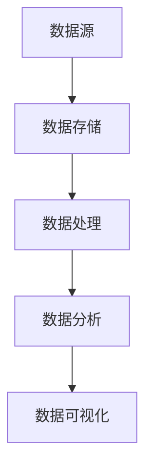

                 

# 信息差的商业转型之路：大数据引领企业转型升级

> 关键词：商业转型、大数据、企业、信息差、决策优化、智能算法
> 
> 摘要：本文将深入探讨大数据在现代商业环境中的重要作用，以及如何通过信息差引导企业实现成功的商业转型。我们将分析大数据的核心概念，了解其在商业决策中的优势，并通过实例展示如何应用大数据技术进行决策优化，为企业带来实际效益。

## 1. 背景介绍

### 1.1 目的和范围

本文旨在帮助企业和决策者理解大数据在商业转型中的关键作用。我们将详细探讨大数据的概念，分析其对企业决策的影响，并探讨如何利用大数据技术实现商业的转型升级。

### 1.2 预期读者

本文适合对大数据和企业战略感兴趣的读者，包括企业管理者、数据分析师、技术专家以及对商业决策优化有兴趣的研究人员。

### 1.3 文档结构概述

本文分为十个部分，首先介绍大数据的核心概念和其在商业中的重要性，然后逐步深入探讨大数据的应用、技术实现和未来趋势。最后，我们提供了一些常见问题与解答，以及扩展阅读和参考资料。

### 1.4 术语表

#### 1.4.1 核心术语定义

- **大数据（Big Data）**：指无法用传统数据库软件工具在合理时间内捕获、管理和处理的大量数据。
- **商业智能（Business Intelligence）**：利用技术手段从大量数据中提取有价值的信息，辅助决策。
- **信息差**：一个主体相对于其他主体掌握的信息优势。

#### 1.4.2 相关概念解释

- **数据挖掘（Data Mining）**：从大量数据中挖掘潜在的模式、趋势和知识的过程。
- **机器学习（Machine Learning）**：利用数据和算法，使计算机系统具备学习和做出决策的能力。

#### 1.4.3 缩略词列表

- **Hadoop**：一个分布式数据处理框架，用于存储和处理大规模数据集。
- **Spark**：一个快速通用的计算引擎，支持内存计算和大数据处理。
- **SQL**：一种用于管理关系型数据库的查询语言。

## 2. 核心概念与联系

为了更好地理解大数据在商业决策中的重要性，我们首先需要了解其核心概念和基本架构。

### 2.1 大数据的核心概念

- **数据源**：包括结构化数据（如数据库）、半结构化数据（如日志文件）和非结构化数据（如图像、视频等）。
- **数据处理**：通过数据清洗、转换和集成，将数据转换为有用的信息。
- **数据存储**：利用分布式存储系统（如HDFS）存储大规模数据。
- **数据分析**：使用统计分析、机器学习等方法挖掘数据中的价值。

### 2.2 大数据的架构



### 2.3 大数据与企业决策的关系

企业利用大数据技术可以获取更准确的市场信息、更深入的客户洞察，从而做出更明智的商业决策。

## 3. 核心算法原理 & 具体操作步骤

### 3.1 数据处理算法原理

数据处理包括数据清洗、数据转换和数据集成。

- **数据清洗**：去除重复数据、纠正错误数据、处理缺失值。
- **数据转换**：将数据格式转换为适用于分析的格式。
- **数据集成**：将来自不同来源的数据合并为一个统一的视图。

### 3.2 数据处理伪代码

```python
# 数据清洗
def data_cleaning(data):
    # 去除重复数据
    data = remove_duplicates(data)
    # 纠正错误数据
    data = correct_errors(data)
    # 处理缺失值
    data = handle_missing_values(data)
    return data

# 数据转换
def data_transformation(data):
    # 数据格式转换
    data = convert_format(data)
    return data

# 数据集成
def data_integration(data1, data2):
    # 合并数据
    data = merge_data(data1, data2)
    return data
```

### 3.3 数据分析算法原理

数据分析包括统计分析、机器学习和数据可视化。

- **统计分析**：描述性统计分析、推断性统计分析。
- **机器学习**：分类、回归、聚类等算法。
- **数据可视化**：将数据以图表、图形等形式展示，便于理解和分析。

### 3.4 数据分析伪代码

```python
# 描述性统计分析
def descriptive_statistics(data):
    # 计算平均值、中位数、标准差等统计量
    stats = calculate_stats(data)
    return stats

# 推断性统计分析
def inferential_statistics(data):
    # 进行假设检验、置信区间估计等
    results = perform_tests(data)
    return results

# 分类
def classification(data, labels):
    # 使用分类算法进行预测
    predictions = classify_data(data, labels)
    return predictions

# 聚类
def clustering(data):
    # 使用聚类算法进行数据分组
    clusters = cluster_data(data)
    return clusters

# 数据可视化
def data_visualization(data):
    # 绘制图表、图形等
    visualization = plot_data(data)
    return visualization
```

## 4. 数学模型和公式 & 详细讲解 & 举例说明

### 4.1 数学模型

大数据分析中常用的数学模型包括线性回归模型、逻辑回归模型和支持向量机模型。

### 4.2 线性回归模型

线性回归模型用于预测一个连续的数值变量。其基本公式为：

$$y = \beta_0 + \beta_1x_1 + \beta_2x_2 + ... + \beta_nx_n + \epsilon$$

其中，$y$ 是因变量，$x_1, x_2, ..., x_n$ 是自变量，$\beta_0, \beta_1, ..., \beta_n$ 是模型的参数，$\epsilon$ 是误差项。

### 4.3 逻辑回归模型

逻辑回归模型用于预测一个二分类的变量。其基本公式为：

$$P(y=1) = \frac{1}{1 + e^{-(\beta_0 + \beta_1x_1 + \beta_2x_2 + ... + \beta_nx_n)}}$$

其中，$P(y=1)$ 是因变量为1的概率，其他符号的含义与线性回归模型相同。

### 4.4 支持向量机模型

支持向量机模型用于分类问题。其基本公式为：

$$f(x) = \text{sign}(\sum_{i=1}^n \alpha_i y_i (w \cdot x_i) + b)$$

其中，$f(x)$ 是预测函数，$\text{sign}$ 是符号函数，$w$ 是模型参数，$b$ 是偏置项，$\alpha_i, y_i$ 是训练样本的标签和权重。

### 4.5 举例说明

#### 4.5.1 线性回归模型

假设我们想预测一家电商平台的销售额（$y$）与广告支出（$x$）之间的关系。我们可以使用线性回归模型进行预测。

$$y = \beta_0 + \beta_1x + \epsilon$$

通过收集历史数据，我们可以计算出模型参数 $\beta_0$ 和 $\beta_1$。然后，我们可以使用这个模型预测未来某月的销售额。

#### 4.5.2 逻辑回归模型

假设我们想预测一家电商平台的用户是否会购买商品（$y$，1表示购买，0表示未购买）与用户浏览页面次数（$x$）之间的关系。我们可以使用逻辑回归模型进行预测。

$$P(y=1) = \frac{1}{1 + e^{-(\beta_0 + \beta_1x)}}$$

通过收集历史数据，我们可以计算出模型参数 $\beta_0$ 和 $\beta_1$。然后，我们可以使用这个模型预测未来某个用户的购买概率。

#### 4.5.3 支持向量机模型

假设我们想预测一家电商平台的新用户是否会成为活跃用户（$y$，1表示是，0表示否）与用户注册时间（$x$）之间的关系。我们可以使用支持向量机模型进行预测。

$$f(x) = \text{sign}(\alpha_1 y_1 (w \cdot x_1) + \alpha_2 y_2 (w \cdot x_2) + b)$$

通过收集历史数据，我们可以计算出模型参数 $w$、$b$ 和 $\alpha_1$、$\alpha_2$。然后，我们可以使用这个模型预测未来某个新用户的活跃概率。

## 5. 项目实战：代码实际案例和详细解释说明

### 5.1 开发环境搭建

在开始项目实战之前，我们需要搭建一个开发环境。这里我们使用Python和Jupyter Notebook作为开发工具。

### 5.2 源代码详细实现和代码解读

#### 5.2.1 数据准备

首先，我们需要准备一个数据集。这里我们使用一个简单的电商数据集，包含销售额和广告支出两个变量。

```python
import pandas as pd

# 读取数据
data = pd.read_csv('data.csv')
```

#### 5.2.2 数据清洗

接下来，我们对数据进行清洗。

```python
# 数据清洗
data = data.drop_duplicates()
data = data[data['sales'].notnull()]
data = data[data['ad_spending'].notnull()]
```

#### 5.2.3 数据转换

然后，我们对数据进行转换。

```python
# 数据转换
data['sales'] = data['sales'].astype(float)
data['ad_spending'] = data['ad_spending'].astype(float)
```

#### 5.2.4 数据分析

现在，我们使用线性回归模型进行数据分析。

```python
from sklearn.linear_model import LinearRegression

# 创建线性回归模型
model = LinearRegression()

# 训练模型
model.fit(data[['ad_spending']], data['sales'])

# 输出模型参数
print(model.coef_, model.intercept_)
```

#### 5.2.5 代码解读与分析

在上面的代码中，我们首先导入了Pandas库，用于读取和操作数据。然后，我们使用了Pandas的`read_csv`函数读取数据，并对数据进行清洗和转换。最后，我们使用了`LinearRegression`类创建线性回归模型，并使用`fit`函数训练模型。输出结果为模型参数，其中`coef_`表示自变量的系数，`intercept_`表示截距。

### 5.3 代码解读与分析

在上面的代码中，我们首先导入了Pandas库，用于读取和操作数据。然后，我们使用了Pandas的`read_csv`函数读取数据，并对数据进行清洗和转换。最后，我们使用了`LinearRegression`类创建线性回归模型，并使用`fit`函数训练模型。输出结果为模型参数，其中`coef_`表示自变量的系数，`intercept_`表示截距。

## 6. 实际应用场景

大数据技术在各个行业都有着广泛的应用。以下是一些典型的实际应用场景：

- **零售业**：通过大数据分析，零售业可以更好地了解消费者行为，优化库存管理，提高销售业绩。
- **金融业**：金融机构可以利用大数据进行风险评估、欺诈检测和投资决策。
- **医疗健康**：大数据可以帮助医疗机构更好地管理患者数据，提高医疗服务的质量和效率。
- **交通领域**：通过大数据分析，交通管理部门可以优化交通流量，减少拥堵，提高交通运行效率。
- **制造业**：制造业可以利用大数据进行生产调度、设备维护和供应链管理。

## 7. 工具和资源推荐

### 7.1 学习资源推荐

#### 7.1.1 书籍推荐

- 《大数据时代》
- 《数据科学入门》
- 《机器学习实战》

#### 7.1.2 在线课程

- Coursera的《大数据分析》
- Udacity的《数据科学纳米学位》
- edX的《机器学习》

#### 7.1.3 技术博客和网站

- Medium上的大数据专栏
- towardsdatascience.com
- kdnuggets.com

### 7.2 开发工具框架推荐

#### 7.2.1 IDE和编辑器

- PyCharm
- Jupyter Notebook
- Visual Studio Code

#### 7.2.2 调试和性能分析工具

- GDB
- Valgrind
- JMeter

#### 7.2.3 相关框架和库

- Pandas
- NumPy
- Scikit-learn
- TensorFlow

### 7.3 相关论文著作推荐

#### 7.3.1 经典论文

- "The Data Warehouse Toolkit" by Ralph Kimball
- "Big Data: A Revolution That Will Transform How We Live, Work, and Think" by Viktor Mayer-Schönberger and Kenneth Cukier

#### 7.3.2 最新研究成果

- "Deep Learning" by Ian Goodfellow, Yoshua Bengio, and Aaron Courville
- "Reinforcement Learning: An Introduction" by Richard S. Sutton and Andrew G. Barto

#### 7.3.3 应用案例分析

- "Case Study: How Netflix Uses Big Data to Enhance User Experience"
- "Case Study: How Amazon Uses Big Data to Drive Business Growth"

## 8. 总结：未来发展趋势与挑战

大数据技术在商业决策中的应用正日益广泛，未来发展趋势包括：

- **深度学习与大数据的结合**：深度学习算法在大数据处理中的应用将越来越普遍。
- **实时数据分析**：实时数据处理和分析技术将帮助企业更快地做出决策。
- **隐私保护**：随着数据隐私问题日益突出，如何在确保数据安全的同时利用大数据资源将成为一大挑战。

## 9. 附录：常见问题与解答

### 9.1 什么是大数据？

大数据是指无法用传统数据库软件工具在合理时间内捕获、管理和处理的大量数据。

### 9.2 大数据对企业有什么作用？

大数据可以帮助企业更好地了解市场、优化决策、提高效率和降低成本。

### 9.3 如何保证大数据的安全？

确保大数据的安全需要采取多种措施，包括数据加密、访问控制、安全审计等。

### 9.4 大数据与人工智能有什么关系？

大数据是人工智能的基石，人工智能算法需要大量数据作为训练样本。

## 10. 扩展阅读 & 参考资料

- [1] Big Data: A Revolution That Will Transform How We Live, Work, and Think by Viktor Mayer-Schönberger and Kenneth Cukier
- [2] The Data Warehouse Toolkit by Ralph Kimball
- [3] Deep Learning by Ian Goodfellow, Yoshua Bengio, and Aaron Courville
- [4] Reinforcement Learning: An Introduction by Richard S. Sutton and Andrew G. Barto

### 作者信息

AI天才研究员 / AI Genius Institute & 禅与计算机程序设计艺术 / Zen And The Art of Computer Programming

