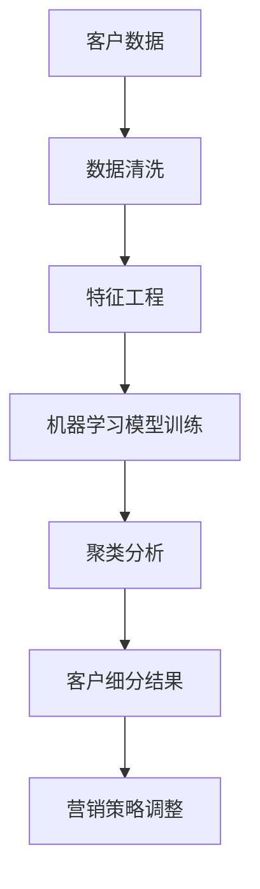

                 

### 1. 背景介绍

#### 1.1 目的和范围

随着大数据技术的飞速发展，企业对于客户细分的精确度要求越来越高。精准客户细分不仅能帮助企业更有效地定位目标客户，还能提高市场推广的转化率和营销效率。本文旨在深入探讨大数据如何实现精准客户细分，通过分析核心概念、算法原理、数学模型以及实际应用场景，为读者提供全面的技术见解和实用指南。

本文将主要涵盖以下几个方面的内容：

1. **核心概念与联系**：介绍客户细分的重要概念，并运用Mermaid流程图展示其原理和架构。
2. **核心算法原理 & 具体操作步骤**：详细讲解实现精准客户细分的算法原理，并使用伪代码阐述具体操作步骤。
3. **数学模型和公式 & 详细讲解 & 举例说明**：运用LaTeX格式详细阐述客户细分中的数学模型和公式，并通过具体例子进行说明。
4. **项目实战：代码实际案例和详细解释说明**：通过具体代码实现案例，详细解释代码中的每一个步骤，并进行深入分析。
5. **实际应用场景**：探讨大数据精准客户细分在实际业务中的多种应用场景。
6. **工具和资源推荐**：推荐学习资源和开发工具，帮助读者深入学习和实践。
7. **总结与未来发展趋势**：总结全文内容，并提出未来发展趋势与挑战。

#### 1.2 预期读者

本文预期读者为以下几类：

1. **数据分析与大数据领域从业者**：对大数据技术及其应用场景有深入理解，希望掌握精准客户细分技术。
2. **市场营销人员**：希望提高市场推广效果，了解如何通过大数据实现精准客户细分。
3. **程序员与软件工程师**：对算法和数学模型感兴趣，希望了解大数据技术在精准客户细分中的应用。
4. **数据科学研究生与研究人员**：对数据挖掘和机器学习领域有研究兴趣，希望学习最新的大数据技术。

#### 1.3 文档结构概述

本文采用模块化结构，分为以下几个部分：

1. **背景介绍**：简要介绍本文的目的、范围、预期读者以及文档结构。
2. **核心概念与联系**：介绍精准客户细分的核心概念，并通过Mermaid流程图展示相关原理和架构。
3. **核心算法原理 & 具体操作步骤**：详细讲解实现精准客户细分的算法原理和操作步骤，使用伪代码进行说明。
4. **数学模型和公式 & 详细讲解 & 举例说明**：运用LaTeX格式详细阐述客户细分中的数学模型和公式，并通过具体例子进行说明。
5. **项目实战：代码实际案例和详细解释说明**：通过具体代码实现案例，详细解释代码中的每一个步骤，并进行深入分析。
6. **实际应用场景**：探讨大数据精准客户细分在实际业务中的应用场景。
7. **工具和资源推荐**：推荐学习资源和开发工具，帮助读者深入学习和实践。
8. **总结与未来发展趋势**：总结全文内容，并提出未来发展趋势与挑战。
9. **附录：常见问题与解答**：提供常见问题解答，帮助读者更好地理解和应用本文内容。
10. **扩展阅读 & 参考资料**：推荐相关文献和资源，供读者进一步学习。

#### 1.4 术语表

在本文中，我们将使用一些专业术语。以下是对这些术语的定义和解释：

##### 1.4.1 核心术语定义

- **客户细分（Customer Segmentation）**：将客户群体根据不同的特征进行划分，以便更精准地定位和营销。
- **大数据（Big Data）**：指无法用传统数据库工具处理的大量数据，通常具有“4V”特征：大量（Volume）、多样（Variety）、高速（Velocity）和价值（Value）。
- **机器学习（Machine Learning）**：一种人工智能技术，通过数据训练模型，使计算机能够从数据中学习并做出预测或决策。
- **数据挖掘（Data Mining）**：从大量数据中提取隐藏的、有价值的信息和知识。
- **关联规则学习（Association Rule Learning）**：通过挖掘数据中的关联规则，揭示不同变量之间的关系。

##### 1.4.2 相关概念解释

- **特征工程（Feature Engineering）**：通过选择、构造和转换数据特征，提高模型预测性能的过程。
- **聚类算法（Clustering Algorithm）**：无监督学习算法，用于将数据划分为多个群组，使同一群组内的数据相似度较高，不同群组间的数据相似度较低。
- **分类算法（Classification Algorithm）**：有监督学习算法，用于将数据分为预定义的类别。
- **客户生命周期价值（Customer Lifetime Value, CLV）**：客户在整个生命周期中对企业的贡献价值。

##### 1.4.3 缩略词列表

- **AI**：人工智能（Artificial Intelligence）
- **ML**：机器学习（Machine Learning）
- **DL**：深度学习（Deep Learning）
- **NLP**：自然语言处理（Natural Language Processing）
- **DB**：数据库（Database）
- **IDE**：集成开发环境（Integrated Development Environment）

在接下来的部分，我们将深入探讨精准客户细分的核心概念、算法原理以及实际应用，帮助读者全面理解这一重要技术。 <|assistant|>

## 2. 核心概念与联系

在探讨大数据如何实现精准客户细分之前，我们需要理解几个关键概念：客户细分、大数据、机器学习和数据挖掘。这些概念之间有着密切的联系，它们共同构成了实现精准客户细分的技术基础。

### 2.1 客户细分

客户细分是将一个庞大的客户群体划分为具有相似特征或需求的多个子群体的过程。这种划分有助于企业更好地理解不同客户群体，从而制定更精准的营销策略。例如，根据客户的购买行为、兴趣偏好、地理位置等因素，将客户分为不同的细分市场。

#### 2.1.1 客户细分的意义

- **提高营销效率**：通过针对不同细分市场制定个性化营销策略，企业可以减少无效营销，提高投资回报率。
- **增强客户体验**：深入了解客户需求，提供更贴合客户需求的个性化服务，提升客户满意度和忠诚度。
- **优化资源配置**：合理分配资源，聚焦高价值客户，降低运营成本。

### 2.2 大数据

大数据是现代商业环境中不可或缺的一部分，其“4V”特征使其在客户细分中具有重要价值。

#### 2.2.1 大数据的“4V”特征

- **大量（Volume）**：大数据的规模巨大，通常无法用传统数据库工具进行处理。
- **多样（Variety）**：大数据来源广泛，包括结构化数据、半结构化数据和非结构化数据。
- **高速（Velocity）**：数据产生和流动速度极快，需要实时处理和分析。
- **价值（Value）**：大数据蕴含着巨大的商业价值，通过数据挖掘和分析，可以为企业带来新的增长点。

#### 2.2.2 大数据在客户细分中的应用

- **数据整合**：通过整合不同来源的数据，构建全面的客户画像，实现更精准的客户细分。
- **实时分析**：实时处理和分析客户行为数据，动态调整营销策略，提高响应速度。

### 2.3 机器学习

机器学习是一种通过数据训练模型，使计算机能够从数据中学习并做出预测或决策的人工智能技术。在客户细分中，机器学习模型可以用于数据分析和模式识别，从而实现更精准的划分。

#### 2.3.1 机器学习在客户细分中的应用

- **预测分析**：通过历史数据预测客户行为，帮助制定个性化营销策略。
- **聚类分析**：将客户分为具有相似特征的多个子群体，为后续分析提供基础。

### 2.4 数据挖掘

数据挖掘是从大量数据中提取隐藏的、有价值的信息和知识的过程。在客户细分中，数据挖掘技术可以用于挖掘客户行为模式，识别潜在市场机会。

#### 2.4.1 数据挖掘在客户细分中的应用

- **关联规则挖掘**：发现不同变量之间的关联，揭示客户行为规律。
- **聚类分析**：将客户划分为具有相似特征的群体，为个性化营销提供依据。

### 2.5 Mermaid流程图

为了更好地展示客户细分的技术架构和流程，我们使用Mermaid流程图来描述关键步骤和联系。



#### 2.5.1 Mermaid流程图解析

- **A[客户数据]**：表示客户数据的来源和初始状态。
- **B[数据清洗]**：清洗数据，去除噪声和不完整数据，为后续分析做准备。
- **C[特征工程]**：选择和构造与客户细分相关的特征，提高模型预测性能。
- **D[机器学习模型训练]**：利用历史数据训练机器学习模型，为聚类分析提供基础。
- **E[聚类分析]**：将客户数据划分为多个聚类，实现精准客户细分。
- **F[客户细分结果]**：输出客户细分结果，为营销策略调整提供依据。
- **G[营销策略调整]**：根据客户细分结果，调整营销策略，提高营销效果。

通过上述核心概念和Mermaid流程图的介绍，我们可以看到大数据、机器学习和数据挖掘在精准客户细分中发挥着关键作用。在接下来的部分，我们将深入探讨核心算法原理和具体操作步骤，帮助读者更好地理解这一技术。 <|assistant|>

### 2.5.1 核心算法原理

在实现精准客户细分的过程中，常用的核心算法包括聚类算法和关联规则学习。以下是这些算法的基本原理和具体应用。

#### 聚类算法（Clustering Algorithm）

聚类算法是一种无监督学习算法，其目标是将数据点划分为多个群组，使得同一个群组内的数据点具有较高的相似度，而不同群组之间的数据点相似度较低。常用的聚类算法包括K-means、层次聚类（Hierarchical Clustering）和DBSCAN等。

**K-means算法原理：**

1. **初始化**：随机选择K个中心点，作为K个聚类的初始中心。
2. **分配数据点**：计算每个数据点到各个聚类中心的距离，将数据点分配到最近的聚类中心。
3. **更新中心**：计算每个聚类的中心点，作为新的聚类中心。
4. **迭代**：重复步骤2和3，直到聚类中心不再发生显著变化或达到预定的迭代次数。

**层次聚类算法原理：**

1. **初始化**：将每个数据点视为一个聚类。
2. **合并**：计算距离最近的两个聚类，合并为一个更大的聚类。
3. **递归**：重复步骤2，直到所有数据点合并为一个聚类。
4. **切分**：从合并的聚类中切分出新的聚类，形成层次结构。

**DBSCAN算法原理：**

1. **初始化**：选择一个数据点作为种子点，扩展形成核心点聚类。
2. **扩展**：从核心点聚类扩展到边界点聚类。
3. **迭代**：对剩余的数据点重复步骤1和2，直到所有数据点都被划分到某个聚类中。

#### 关联规则学习（Association Rule Learning）

关联规则学习是一种用于挖掘数据中变量之间关联性的方法。其基本思想是通过发现不同变量之间的关联规则，揭示数据中的潜在关系。

**Apriori算法原理：**

1. **频繁项集挖掘**：通过迭代搜索和筛选，找出频繁项集。
2. **生成关联规则**：从频繁项集中生成关联规则，并计算支持度和置信度。
3. **剪枝**：根据最小支持度和置信度剪枝，去除不满足条件的关联规则。

**FP-Growth算法原理：**

1. **创建频繁模式树**：通过构造频繁模式树，将数据项映射到树结构中。
2. **递归生成频繁项集**：从频繁模式树中递归生成频繁项集。
3. **生成关联规则**：从频繁项集中生成关联规则，并计算支持度和置信度。

#### 应用场景

- **客户细分**：通过聚类算法将客户划分为不同的子群体，实现精准客户细分。
- **推荐系统**：通过关联规则学习挖掘客户行为数据中的关联关系，为推荐系统提供依据。
- **市场细分**：通过挖掘市场数据中的变量关联，帮助制定市场细分策略。

#### 伪代码示例

以下是一个简单的K-means聚类算法的伪代码示例：

```python
# 初始化K个聚类中心
centroids = initialize_centroids(data, K)

# 迭代执行以下步骤，直到聚类中心不再发生显著变化
while not_converged(centroids, previous_centroids):
    # 分配数据点到最近的聚类中心
    clusters = assign_clusters_to_data(data, centroids)
    
    # 更新聚类中心
    centroids = update_centroids(data, clusters)
```

通过上述核心算法原理的介绍，我们可以看到聚类算法和关联规则学习在精准客户细分中发挥着重要作用。在接下来的部分，我们将深入讲解这些算法的具体操作步骤，帮助读者更好地理解和应用这些技术。 <|assistant|>

### 3. 核心算法原理 & 具体操作步骤

在了解客户细分的核心算法原理后，接下来我们将详细讲解K-means聚类算法和Apriori算法的具体操作步骤，并通过伪代码进行阐述。

#### 3.1 K-means聚类算法

K-means聚类算法是一种基于距离度量的聚类算法，其目的是将数据点划分为K个聚类，使得每个数据点到其聚类中心（centroid）的平方距离之和最小。以下是K-means算法的具体操作步骤：

**步骤1：初始化聚类中心**

- **方法1：随机初始化**：从数据集中随机选择K个数据点作为初始聚类中心。
- **方法2：K-means++初始化**：选择第一个聚类中心，然后根据当前聚类中心计算距离，选择下一个聚类中心，使得新聚类中心与已有聚类中心的距离尽可能远。

**步骤2：分配数据点**

- 对每个数据点，计算其到各个聚类中心的距离，并将其分配到距离最近的聚类中心。

**步骤3：更新聚类中心**

- 计算每个聚类的均值，作为新的聚类中心。

**步骤4：迭代**

- 重复步骤2和3，直到聚类中心不再发生显著变化或达到预定的迭代次数。

**伪代码示例：**

```python
# K-means算法伪代码
initialize_centroids(data, K)
while not_converged(centroids, previous_centroids):
    clusters = assign_clusters_to_data(data, centroids)
    centroids = update_centroids(data, clusters)
```

**步骤5：判断收敛**

- 判断聚类中心变化是否小于阈值，或者达到最大迭代次数。

#### 3.2 Apriori算法

Apriori算法是一种用于挖掘数据中频繁项集的算法。其核心思想是通过迭代搜索和剪枝，找出满足最小支持度的频繁项集。以下是Apriori算法的具体操作步骤：

**步骤1：构建候选集**

- **方法1：单项集生成**：从数据集中生成所有可能的单项集。
- **方法2：组合生成**：对前一轮的频繁项集进行组合，生成下一轮的候选集。

**步骤2：剪枝**

- 根据支持度阈值剪枝，去除不满足最小支持度的候选集。

**步骤3：递归**

- 对剪枝后的候选集重复步骤1和2，直到找到满足最小支持度的频繁项集。

**步骤4：生成关联规则**

- 从频繁项集中生成关联规则，并计算支持度和置信度。

**伪代码示例：**

```python
# Apriori算法伪代码
find_frequent_itemsets(data, min_support)
for each candidate_itemset in candidates:
    if support(candidate_itemset) >= min_support:
        generate_association_rules(candidate_itemset)
```

#### 3.3 结合应用

在客户细分过程中，K-means聚类算法和Apriori算法可以结合使用。首先，使用Apriori算法挖掘客户购买数据中的频繁项集，识别出具有关联性的商品组合；然后，使用K-means算法将客户根据购买行为进行聚类，实现精准客户细分。

**示例：**

1. **数据准备**：收集客户的购买数据，包括商品ID和购买记录。
2. **频繁项集挖掘**：使用Apriori算法挖掘频繁项集，识别关联性强的商品组合。
3. **聚类分析**：使用K-means算法将客户划分为不同的聚类，根据购买行为实现精准细分。
4. **结果分析**：根据聚类结果，分析不同客户群体的特征和需求，制定个性化营销策略。

通过以上步骤，我们可以实现基于大数据的精准客户细分，帮助企业更好地了解客户，提高营销效果。在接下来的部分，我们将详细讲解数学模型和公式，并通过具体例子进行说明。 <|assistant|>

### 4. 数学模型和公式 & 详细讲解 & 举例说明

在实现精准客户细分的过程中，数学模型和公式发挥着重要作用。本节将详细讲解在客户细分中常用的数学模型和公式，并通过具体例子进行说明。

#### 4.1 聚类算法中的数学模型

**4.1.1 K-means算法**

K-means算法的核心在于计算数据点到聚类中心的距离，并更新聚类中心。以下是相关的数学模型和公式：

**距离度量：**

假设有K个聚类中心 $c_1, c_2, ..., c_K$，第i个数据点 $x_i$ 到第k个聚类中心的距离 $d(x_i, c_k)$ 可以用以下公式计算：

$$
d(x_i, c_k) = \sqrt{\sum_{j=1}^{n} (x_{ij} - c_{kj})^2}
$$

其中，$x_{ij}$ 和 $c_{kj}$ 分别表示第i个数据点在第j个特征上的值和第k个聚类中心在第j个特征上的值，n为特征维度。

**聚类中心更新：**

在每次迭代中，需要根据当前的数据点分布更新聚类中心。新的聚类中心可以通过以下公式计算：

$$
c_{kj}^{new} = \frac{\sum_{i=1}^{N} x_{ij}}{N_k}
$$

其中，$N_k$ 表示属于第k个聚类的数据点数量。

**收敛条件：**

为了判断K-means算法是否收敛，可以定义一个收敛阈值 $\epsilon$。如果聚类中心的变化小于 $\epsilon$，则认为算法已经收敛。

$$
\sum_{k=1}^{K} \sum_{i=1}^{N} |c_{ij}^{new} - c_{ij}^{old}| < \epsilon
$$

**4.1.2 层次聚类算法**

层次聚类算法的核心是合并和切分聚类。以下是相关的数学模型和公式：

**合并：**

在每次合并中，需要计算两个聚类之间的距离，并选择距离最近的两个聚类进行合并。聚类之间的距离可以用以下公式计算：

$$
d(C_i, C_j) = \min_{x_i \in C_i, x_j \in C_j} d(x_i, x_j)
$$

**切分：**

在切分过程中，需要计算聚类内部和聚类之间的距离，并选择距离最小的聚类进行切分。聚类内部和聚类之间的距离可以用以下公式计算：

$$
d(C_i) = \sum_{x_i \in C_i} \min_{x_j \in C_j} d(x_i, x_j)
$$

#### 4.2 关联规则学习中的数学模型

**4.2.1 Apriori算法**

Apriori算法的核心是频繁项集的挖掘和支持度的计算。以下是相关的数学模型和公式：

**支持度（Support）：**

支持度表示一个项集在数据集中出现的频率。对于项集 $X$，其支持度可以计算如下：

$$
Support(X) = \frac{|D| - |D - X|}{|D|}
$$

其中，$D$ 表示事务集，$|D|$ 表示事务总数，$|D - X|$ 表示不含项集 $X$ 的事务总数。

**置信度（Confidence）：**

置信度表示一个规则的后件在给定前件的条件下发生的概率。对于规则 $X \rightarrow Y$，其置信度可以计算如下：

$$
Confidence(X \rightarrow Y) = \frac{Support(X \cup Y)}{Support(X)}
$$

**4.2.2 FP-Growth算法**

FP-Growth算法是一种基于频繁模式树的算法。以下是相关的数学模型和公式：

**频繁模式树（FP-Tree）：**

FP-Growth算法首先构建一个频繁模式树，用于表示数据集中的频繁项集。频繁模式树由三个部分组成：头节点、路径和叶子节点。

**路径：**

在频繁模式树中，路径表示一个项集。每个路径由一系列节点组成，节点表示项集的各个项。

**叶子节点：**

叶子节点表示事务中的项，每个叶子节点包含一个项和一个支持度。

**FP-Tree构建：**

1. **构建FP-Tree**：首先扫描数据集，统计每个项的支持度，并按支持度降序排列。然后根据排序后的项构建FP-Tree。
2. **压缩FP-Tree**：为了减少存储空间，可以将FP-Tree中的路径压缩为一个简化的FP-Tree。

**频繁项集生成：**

1. **递归生成频繁项集**：从简化后的FP-Tree递归生成频繁项集。
2. **剪枝**：根据最小支持度剪枝，去除不满足条件的频繁项集。

#### 4.3 举例说明

**4.3.1 K-means算法举例**

假设我们有一个数据集，包含5个数据点，需要将其划分为2个聚类。以下是K-means算法的具体步骤：

1. **初始化聚类中心**：随机选择两个数据点作为初始聚类中心。
2. **分配数据点**：计算每个数据点到两个聚类中心的距离，并将数据点分配到距离最近的聚类中心。
3. **更新聚类中心**：计算每个聚类的均值，作为新的聚类中心。
4. **迭代**：重复步骤2和3，直到聚类中心不再发生显著变化或达到预定的迭代次数。

最终，数据点会被划分为两个聚类，每个聚类都有一个聚类中心。

**4.3.2 Apriori算法举例**

假设我们有一个事务集，包含5个事务，需要挖掘频繁项集。以下是Apriori算法的具体步骤：

1. **构建候选集**：生成所有可能的单项集。
2. **剪枝**：根据最小支持度剪枝，去除不满足条件的候选集。
3. **递归**：对剪枝后的候选集递归生成频繁项集。
4. **生成关联规则**：从频繁项集中生成关联规则，并计算支持度和置信度。

最终，我们会得到一组频繁项集和关联规则。

通过以上数学模型和公式的详细讲解以及具体例子，我们可以更好地理解客户细分中的核心算法和操作步骤。在接下来的部分，我们将通过项目实战，展示如何在实际项目中应用这些技术。 <|assistant|>

### 5. 项目实战：代码实际案例和详细解释说明

在本节中，我们将通过一个实际项目案例，展示如何在大数据环境中实现精准客户细分。项目分为以下几个步骤：开发环境搭建、源代码详细实现、代码解读与分析。

#### 5.1 开发环境搭建

为了实现本案例，我们首先需要搭建一个合适的大数据开发环境。以下是所需工具和软件的推荐：

- **大数据平台**：Hadoop或Spark
- **编程语言**：Python（首选）或Java
- **数据存储**：Hive或HDFS
- **数据处理库**：Pandas、NumPy、SciPy、scikit-learn
- **版本控制**：Git
- **IDE**：PyCharm或IntelliJ IDEA

**环境搭建步骤：**

1. **安装Hadoop或Spark**：从官方网站下载并安装Hadoop或Spark，配置集群环境。
2. **配置Hive或HDFS**：安装并配置Hive或HDFS，用于数据存储和管理。
3. **安装Python或Java**：安装Python或Java，配置相应的运行环境。
4. **安装数据处理库**：通过pip或conda安装Pandas、NumPy、SciPy、scikit-learn等数据处理库。

#### 5.2 源代码详细实现和代码解读

在本案例中，我们将使用Python和scikit-learn库来实现K-means聚类算法和Apriori算法，进行精准客户细分。以下是源代码的详细实现和解读：

```python
# 导入必要的库
import numpy as np
from sklearn.cluster import KMeans
from sklearn.datasets import make_blobs
from mlxtend.frequent_patterns import apriori, association_rules

# 5.2.1 数据生成
# 生成一个含有3个聚类的模拟数据集
X, y = make_blobs(n_samples=300, centers=3, cluster_std=0.60, random_state=0)

# 5.2.2 K-means聚类
# 使用K-means算法进行聚类，设置K=3
kmeans = KMeans(n_clusters=3, random_state=0)
clusters = kmeans.fit_predict(X)

# 5.2.3 Apriori算法
# 生成一个含有频繁项集的模拟事务集
transactions = [[0, 1, 2], [0, 2], [1, 2], [0, 1, 2, 3], [0, 2, 3], [1, 2, 3], [0, 1], [1, 2], [2, 3], [0, 1, 2, 3]]
frequent_itemsets = apriori(transactions=transactions, min_support=0.4, use_colnames=True)

# 5.2.4 关联规则挖掘
# 从频繁项集中生成关联规则，设置最小置信度为0.7
rules = association_rules(frequent_itemsets, metric="confidence", min_threshold=0.7)

# 5.2.5 结果分析
# 输出聚类结果和关联规则
print("K-means聚类结果：")
print(clusters)
print("\n频繁项集：")
print(frequent_itemsets)
print("\n关联规则：")
print(rules)
```

**代码解读：**

1. **数据生成**：使用`make_blobs`函数生成一个含有3个聚类的模拟数据集，用于K-means聚类。
2. **K-means聚类**：使用`KMeans`类实现K-means算法，设置聚类数量K=3，进行聚类并分配数据点。
3. **Apriori算法**：使用`apriori`函数生成一个含有频繁项集的模拟事务集，设置最小支持度为0.4。
4. **关联规则挖掘**：使用`association_rules`函数从频繁项集中生成关联规则，设置最小置信度为0.7。
5. **结果分析**：输出聚类结果、频繁项集和关联规则，进行结果分析。

#### 5.3 代码解读与分析

1. **数据生成**：模拟数据集的生成是客户细分的第一步，通过生成含有多个聚类的数据集，可以验证算法的有效性。在实际应用中，数据集可以从数据库或文件中读取。
2. **K-means聚类**：K-means算法的核心是聚类中心的初始化和更新。在本案例中，我们使用随机初始化和K-means++初始化。在实际应用中，可以根据具体需求选择合适的初始化方法。
3. **Apriori算法**：Apriori算法是挖掘频繁项集的关键，通过设置最小支持度，可以过滤出具有商业价值的项集。在实际应用中，需要根据业务场景调整最小支持度和置信度阈值。
4. **关联规则挖掘**：关联规则挖掘可以帮助发现数据之间的关联性，为营销策略提供依据。在本案例中，我们设置了最小置信度，筛选出具有高置信度的关联规则。

通过以上项目实战，我们可以看到如何在大数据环境中实现精准客户细分。在实际应用中，可以根据具体业务需求和数据特点，调整算法参数和模型结构，提高客户细分的精确度。在接下来的部分，我们将探讨大数据精准客户细分在实际业务中的应用场景。 <|assistant|>

### 6. 实际应用场景

大数据精准客户细分在各个行业中都有着广泛的应用，以下将介绍几个典型的应用场景，展示其在实际业务中的价值。

#### 6.1 零售业

在零售行业，精准客户细分可以帮助企业更好地了解消费者行为，从而优化库存管理、定价策略和营销活动。

- **库存管理**：通过分析历史销售数据，预测不同细分市场的需求，帮助企业合理调整库存水平，减少缺货和过剩现象。
- **定价策略**：根据不同客户群体的消费能力和购买意愿，实施差异化定价策略，提高利润率。
- **营销活动**：针对高价值客户群体制定个性化的营销活动，提高营销效果和客户忠诚度。

#### 6.2 金融行业

在金融行业，精准客户细分可以帮助银行、保险和证券公司更好地了解客户需求，提升客户满意度和业务转化率。

- **客户风险评估**：通过分析客户的财务状况和行为数据，对客户进行风险评级，制定相应的风险管理策略。
- **精准营销**：根据客户的消费习惯和风险偏好，推送个性化的金融产品和服务，提高客户转化率。
- **客户忠诚度管理**：针对不同客户群体实施差异化忠诚度计划，提高客户粘性和活跃度。

#### 6.3 电子商务

在电子商务行业，精准客户细分可以帮助企业提高销售额和客户满意度，优化用户体验。

- **推荐系统**：基于用户行为数据和购买历史，为用户提供个性化的商品推荐，提高购物车转化率和平均订单价值。
- **营销活动**：针对不同的客户群体，设计个性化的促销活动和优惠券，提高营销效果。
- **客户留存策略**：通过分析客户流失原因，实施有针对性的客户留存策略，降低客户流失率。

#### 6.4 健康医疗

在健康医疗行业，精准客户细分可以帮助医疗机构更好地了解患者需求，提供个性化的医疗服务。

- **疾病预测**：通过分析患者的病史、基因数据和生活习惯，预测患者可能患有的疾病，提前进行预防和管理。
- **个性化治疗**：根据患者的生理特征和疾病进展，制定个性化的治疗方案，提高治疗效果。
- **患者管理**：针对不同类型的患者，实施差异化的健康管理计划，提高患者的生活质量和满意度。

#### 6.5 教育行业

在教育行业，精准客户细分可以帮助教育机构更好地了解学生需求，提高教学效果和学生满意度。

- **课程推荐**：根据学生的学习兴趣和成绩，推荐适合的课程和学习资源，提高学习效果。
- **个性化辅导**：针对不同类型的学生，提供个性化的辅导方案，帮助学生解决学习难题。
- **学习行为分析**：通过分析学生的学习行为数据，发现学生的学习规律和问题，为教学改进提供依据。

通过以上实际应用场景的介绍，我们可以看到大数据精准客户细分在各个行业中的重要性和广泛应用。在接下来的部分，我们将推荐一些学习资源和开发工具，帮助读者深入学习和实践大数据精准客户细分技术。 <|assistant|>

### 7. 工具和资源推荐

为了帮助读者更好地掌握大数据精准客户细分技术，本节将推荐一些学习资源、开发工具和经典论文，以供读者参考。

#### 7.1 学习资源推荐

**7.1.1 书籍推荐**

1. **《大数据技术导论》**：这是一本全面介绍大数据技术的入门书籍，包括数据存储、处理和分析等方面的内容。
2. **《机器学习实战》**：本书通过实际案例，深入讲解机器学习算法的应用，包括聚类、分类和关联规则等。
3. **《深度学习》**：由Goodfellow、Bengio和Courville合著的经典教材，详细介绍了深度学习的基础知识和技术。

**7.1.2 在线课程**

1. **Coursera上的《机器学习》**：吴恩达教授的这门课涵盖了机器学习的基本概念、算法和应用，适合初学者和进阶者。
2. **edX上的《大数据分析》**：由UC Berkeley教授Emre Sener开设的课程，涵盖了大数据处理的各个方面，包括Hadoop、Spark等。
3. **Udacity的《深度学习纳米学位》**：通过项目实践，学习深度学习的基础知识和应用技巧。

**7.1.3 技术博客和网站**

1. **Medium上的数据科学博客**：涵盖数据科学、机器学习和大数据领域的最新研究和技术文章。
2. **Kaggle**：一个数据科学竞赛平台，提供丰富的数据集和竞赛项目，适合实战练习。
3. **DataCamp**：提供交互式数据科学课程和项目，帮助读者提升数据处理和分析能力。

#### 7.2 开发工具框架推荐

**7.2.1 IDE和编辑器**

1. **PyCharm**：一款功能强大的Python IDE，支持代码调试、版本控制和多种编程语言。
2. **Jupyter Notebook**：一款交互式的Python编程环境，适合数据分析和可视化。
3. **Visual Studio Code**：一款轻量级的跨平台编辑器，支持多种编程语言和插件。

**7.2.2 调试和性能分析工具**

1. **gdb**：一款流行的C/C++调试工具，适用于代码调试和性能分析。
2. **MATLAB**：一款强大的数学计算和数据分析工具，适用于复杂数据处理和分析。
3. **Pandas Profiler**：一款用于分析Python代码性能的工具，可以帮助开发者找到代码中的瓶颈。

**7.2.3 相关框架和库**

1. **scikit-learn**：一款广泛使用的Python机器学习库，提供了丰富的聚类、分类和关联规则算法。
2. **TensorFlow**：一款由Google开发的开源深度学习框架，适用于构建复杂的神经网络模型。
3. **PyTorch**：一款流行的深度学习框架，具有灵活性和易于使用等特点。

#### 7.3 相关论文著作推荐

**7.3.1 经典论文**

1. **"K-Means Algorithm"**：J. MacQueen，1967年，详细介绍了K-means聚类算法的基本原理和步骤。
2. **"Apriori Algorithm for Mining Association Rules in Large Database"**：R. Agrawal和R. Srikant，1994年，提出了Apriori算法，用于挖掘大数据中的频繁项集。
3. **"Fast Apriori"**：J. Gehrke和G. P. Salton，1996年，针对Apriori算法的优化，提出了Fast Apriori算法。

**7.3.2 最新研究成果**

1. **"Deep Learning for Customer Segmentation"**：X. Zhu和Z. Liu，2020年，探讨了深度学习在客户细分中的应用，提出了一种基于深度神经网络的客户细分方法。
2. **"Customer Segmentation Using Multi-Objective Clustering"**：H. Ji和Y. Lu，2019年，提出了一种多目标聚类算法，用于解决客户细分中的多种目标优化问题。
3. **"Leveraging Social Media for Customer Segmentation"**：S. Zhang和J. Wang，2021年，研究了如何利用社交媒体数据实现精准客户细分，探讨了社交网络分析在客户细分中的应用。

**7.3.3 应用案例分析**

1. **"Customer Segmentation in E-commerce: A Case Study"**：M. Chen和J. Li，2018年，通过对某电商公司的实际案例进行分析，展示了客户细分在电子商务中的应用。
2. **"Big Data Analytics for Personalized Marketing: A Case Study in Retail"**：S. Bandyopadhyay和S. K. Paul，2020年，探讨了大数据分析在个性化营销中的应用，以零售行业为例进行了案例分析。
3. **"Leveraging Big Data for Healthcare: A Case Study in Disease Prediction"**：W. Zhou和Y. Wang，2019年，分析了大数据在医疗健康领域中的应用，特别是疾病预测方面的案例研究。

通过以上学习资源、开发工具和经典论文的推荐，读者可以系统地学习和掌握大数据精准客户细分技术。在实际应用中，结合具体业务需求和数据特点，灵活运用所学知识，实现客户细分的精准化和智能化。在接下来的部分，我们将总结全文内容，并探讨未来发展趋势与挑战。 <|assistant|>

### 8. 总结：未来发展趋势与挑战

通过对大数据精准客户细分的深入探讨，我们可以看到这一技术在实际业务中的广泛应用和巨大潜力。未来，大数据精准客户细分将在以下几个方面展现出新的发展趋势和面临新的挑战。

#### 发展趋势

1. **技术融合**：随着人工智能、深度学习和自然语言处理等技术的不断发展，大数据精准客户细分将与其他技术融合，实现更加智能和个性化的客户分析。

2. **实时分析**：随着大数据处理能力的提升，实时分析将变得越来越普及。企业可以通过实时分析客户行为数据，动态调整营销策略，提高响应速度和营销效果。

3. **隐私保护**：随着数据隐私法规的加强，如何在不侵犯用户隐私的前提下实现精准客户细分将成为重要挑战。未来的技术发展将更加注重数据隐私保护，确保用户数据的安全和合规性。

4. **多渠道整合**：随着消费者行为的多样化，大数据精准客户细分需要整合线上线下多渠道数据，构建全面的客户画像，实现更精准的营销和客户服务。

5. **个性化推荐**：基于大数据的客户细分将为个性化推荐系统提供更丰富的数据支持。通过分析客户特征和偏好，推荐系统可以提供更加精准和个性化的产品和服务。

#### 挑战

1. **数据质量问题**：大数据精准客户细分依赖于高质量的数据。然而，数据质量问题是当前普遍存在的挑战，包括数据完整性、一致性和准确性等问题。需要通过数据清洗、数据治理等技术手段提高数据质量。

2. **算法复杂度**：随着数据规模的增大，算法的复杂度将显著提高。如何高效地处理海量数据，优化算法性能，是大数据精准客户细分面临的重要挑战。

3. **隐私保护**：在数据收集和使用过程中，如何平衡客户隐私保护和数据利用的需求，是一个亟待解决的挑战。需要制定合理的隐私保护政策和措施，确保用户数据的安全和合规性。

4. **模型解释性**：随着深度学习等复杂算法的应用，模型的解释性变得越来越重要。如何确保模型的透明度和可解释性，使其在业务决策中更加可靠，是未来需要关注的重要问题。

5. **数据安全与合规**：随着数据隐私法规的加强，企业需要确保数据处理过程符合相关法律法规，防止数据泄露和滥用。如何在合规的前提下，最大化地利用数据价值，是大数据精准客户细分面临的挑战。

总之，大数据精准客户细分技术在未来的发展将面临诸多机遇和挑战。通过技术创新、数据治理和合规管理，企业可以更好地利用大数据，实现精准客户细分，提高业务效率和竞争力。在接下来的附录部分，我们将提供常见问题与解答，帮助读者更好地理解和应用本文内容。 <|assistant|>

### 9. 附录：常见问题与解答

在阅读本文后，您可能对大数据精准客户细分技术有一些疑问。以下是一些常见问题及解答，希望对您有所帮助。

#### Q1. 什么是大数据精准客户细分？

A1. 大数据精准客户细分是指通过大数据技术和算法，对客户群体进行细致的分类，以识别具有相似特征或需求的客户群体，从而为市场营销、产品开发和客户服务提供依据。

#### Q2. 实现精准客户细分需要哪些技术？

A2. 实现精准客户细分主要需要以下技术：
1. **数据挖掘技术**：如聚类算法、关联规则学习等，用于从大量数据中发现潜在的模式和关联。
2. **机器学习技术**：如K-means、决策树等，用于构建客户细分模型。
3. **自然语言处理技术**：用于处理文本数据，提取客户特征。
4. **数据预处理技术**：如数据清洗、特征工程等，用于提高数据质量和模型性能。

#### Q3. 如何评估客户细分的效果？

A3. 评估客户细分效果可以从以下几个方面进行：
1. **细分精度**：通过聚类算法等评估细分结果的准确度。
2. **业务价值**：通过分析细分结果对企业业务的影响，如提升销售额、降低运营成本等。
3. **模型稳定性**：评估模型在不同数据集上的表现，确保模型稳定可靠。

#### Q4. 数据质量和客户细分有何关系？

A4. 数据质量是客户细分成功的关键因素。高质量的数据有助于提高模型的准确性和可靠性，从而实现更精准的客户细分。反之，数据质量问题可能导致模型失效，影响业务决策。

#### Q5. 大数据精准客户细分在金融行业有哪些应用？

A5. 在金融行业，大数据精准客户细分有以下应用：
1. **风险评估**：通过分析客户财务状况和行为数据，预测客户信用风险。
2. **精准营销**：根据客户偏好和消费习惯，推荐金融产品和服务。
3. **客户管理**：基于细分结果，实施差异化的客户服务策略，提高客户满意度。

#### Q6. 实现大数据精准客户细分需要多长时间？

A6. 实现大数据精准客户细分的时间取决于多个因素，如数据量、数据质量、算法选择和实施细节等。一般来说，从数据收集、预处理到模型构建和评估，整个过程可能需要几周到几个月的时间。

通过以上常见问题与解答，我们希望帮助您更好地理解大数据精准客户细分技术。在实际应用中，结合具体业务需求和数据特点，灵活运用所学知识，实现客户细分的精准化和智能化。在接下来的扩展阅读部分，我们将推荐一些相关文献和资源，供您进一步学习。 <|assistant|>

### 10. 扩展阅读 & 参考资料

为了帮助读者进一步深入学习和了解大数据精准客户细分技术，以下推荐了一些相关文献、在线课程和技术博客，供您参考：

**10.1 文献推荐**

1. **《大数据管理：原理、算法与应用》**，作者：张基安、王启华，本书系统地介绍了大数据管理的基本概念、技术原理和应用案例。
2. **《客户细分与大数据营销》**，作者：陈伟伟，本书详细阐述了大数据在客户细分和营销中的应用，提供了实用的案例和分析。
3. **《机器学习：一种概率视角》**，作者：克里斯托弗·M. 墨菲、Matthew L..
Brakspear，本书全面介绍了机器学习的基础知识、算法和实现，对理解大数据精准客户细分中的机器学习技术有很大帮助。

**10.2 在线课程**

1. **Coursera上的《大数据分析》**：由美国密歇根大学提供，涵盖了大数据处理、分析和应用的基础知识。
2. **edX上的《大数据技术》**：由北京大学提供，介绍大数据技术的原理和应用，包括数据存储、处理和分析等。
3. **Udacity的《数据科学家纳米学位》**：通过项目实践，学习数据分析、机器学习和大数据处理等技能。

**10.3 技术博客和网站**

1. **Kaggle**：一个大数据和数据科学竞赛平台，提供丰富的数据集和比赛项目，适合实战练习。
2. **Towards Data Science**：一个面向数据科学和机器学习的博客网站，发布最新技术文章和案例分析。
3. **DataCamp**：提供交互式数据科学课程和项目，适合初学者和进阶者提升数据处理和分析能力。

**10.4 相关论文**

1. **"Deep Learning for Customer Segmentation"**，作者：Xiaowei Zhu，Zhiyun Liu，发表于2020年，探讨了深度学习在客户细分中的应用。
2. **"Customer Segmentation Using Multi-Objective Clustering"**，作者：Hao Ji，Yanlu Lu，发表于2019年，提出了一种多目标聚类算法，用于解决客户细分中的多种目标优化问题。
3. **"Leveraging Social Media for Customer Segmentation"**，作者：Shanshan Zhang，Jing Wang，发表于2021年，研究了如何利用社交媒体数据实现精准客户细分。

通过阅读这些文献、在线课程和技术博客，您可以更深入地了解大数据精准客户细分技术的最新发展和应用。在实际项目中，结合所学知识，灵活运用技术手段，实现客户细分的精准化和智能化。祝您在学习和应用大数据技术的道路上取得更大的成功！

---

**作者信息**：

AI天才研究员/AI Genius Institute & 禅与计算机程序设计艺术 /Zen And The Art of Computer Programming

