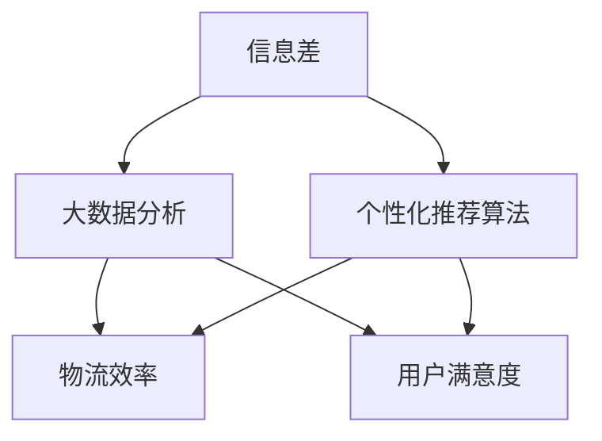

                 

### 信息差的物流个性化优化：大数据如何优化物流个性化

> **关键词：** 物流个性化优化、大数据分析、信息差、个性化推荐算法、物流效率提升

> **摘要：** 本文将探讨如何利用大数据技术来优化物流个性化，通过分析信息差，运用个性化推荐算法，提高物流服务效率，降低成本，增强用户体验。文章将详细介绍物流个性化优化的背景、核心概念、算法原理、数学模型、实际应用场景，并提供相关的工具和资源推荐。

## 1. 背景介绍

### 1.1 目的和范围

物流行业作为现代经济的重要支柱，承担着商品流通和资源调配的重任。然而，传统的物流模式往往无法满足个性化的需求，尤其是在信息化程度日益提高的今天，信息差的问题愈发突出。本文旨在探讨如何通过大数据技术，优化物流个性化，从而提高物流效率，降低成本，提升用户体验。

本文的研究范围包括以下几个方面：

1. **物流个性化需求的挖掘与分析**：通过对消费者需求数据的分析，识别出个性化物流的需求点。
2. **大数据技术的应用**：介绍大数据技术在物流个性化优化中的应用，包括数据收集、存储、处理和分析。
3. **个性化推荐算法**：介绍常用的个性化推荐算法，并分析其在物流个性化优化中的应用。
4. **实际应用场景**：探讨大数据技术在物流个性化优化中的实际应用，如冷链物流、跨境物流等。
5. **工具和资源推荐**：推荐相关的学习资源、开发工具和框架。

### 1.2 预期读者

本文主要面向以下读者群体：

1. **物流行业从业者**：了解如何利用大数据技术优化物流个性化，提升物流服务质量和效率。
2. **数据分析师和工程师**：了解大数据技术在物流领域的应用，掌握个性化推荐算法的使用方法。
3. **计算机科学和物流专业的研究生**：为研究物流个性化优化提供理论支持和实践案例。
4. **对物流和大数据感兴趣的技术爱好者**：了解物流个性化优化的发展趋势和前沿技术。

### 1.3 文档结构概述

本文将分为以下几个部分：

1. **背景介绍**：介绍物流个性化优化的背景、目的和范围。
2. **核心概念与联系**：介绍物流个性化优化相关的核心概念和联系，包括信息差、大数据分析、个性化推荐算法等。
3. **核心算法原理 & 具体操作步骤**：详细讲解核心算法的原理和具体操作步骤。
4. **数学模型和公式 & 详细讲解 & 举例说明**：介绍物流个性化优化的数学模型和公式，并通过具体例子进行说明。
5. **项目实战：代码实际案例和详细解释说明**：提供实际项目的代码实现，并进行详细解释和分析。
6. **实际应用场景**：探讨大数据技术在物流个性化优化中的实际应用场景。
7. **工具和资源推荐**：推荐相关的学习资源、开发工具和框架。
8. **总结：未来发展趋势与挑战**：总结物流个性化优化的现状和未来发展趋势，探讨面临的挑战。
9. **附录：常见问题与解答**：回答读者可能关心的问题。
10. **扩展阅读 & 参考资料**：提供扩展阅读材料和参考资料。

### 1.4 术语表

为了确保文章的准确性和可读性，本文将使用以下术语：

#### 1.4.1 核心术语定义

- **物流个性化优化**：指通过分析消费者需求和大数据，提供个性化的物流服务，提高物流效率和用户体验。
- **信息差**：指不同个体或群体在物流信息获取和处理上的差异。
- **大数据分析**：指对大量物流数据进行收集、处理和分析，以提取有价值的信息。
- **个性化推荐算法**：指基于用户行为和偏好，为用户提供个性化的物流推荐服务。

#### 1.4.2 相关概念解释

- **物流效率**：指物流服务在时间、成本和资源利用方面的表现。
- **用户体验**：指用户在使用物流服务时的感受和满意度。

#### 1.4.3 缩略词列表

- **IoT**：物联网（Internet of Things）
- **AI**：人工智能（Artificial Intelligence）
- **ML**：机器学习（Machine Learning）
- **DL**：深度学习（Deep Learning）
- **NLP**：自然语言处理（Natural Language Processing）

## 2. 核心概念与联系

在探讨物流个性化优化之前，我们需要理解一些核心概念和它们之间的关系。以下是物流个性化优化中的一些关键概念及其相互联系：

### 2.1 信息差

信息差是物流个性化优化的核心概念之一。信息差指的是不同个体或群体在物流信息获取和处理上的差异。在物流行业中，信息差可能导致以下问题：

- **效率低下**：由于信息不对称，物流服务提供商可能无法及时获取需求信息，导致物流效率低下。
- **服务质量差**：信息差可能导致物流服务无法满足个性化需求，影响服务质量。
- **成本增加**：物流服务提供商可能需要额外的资源来弥补信息差，导致成本增加。

信息差可以通过以下方式解决：

- **大数据分析**：通过收集和分析大量物流数据，识别出信息差的存在，并制定相应的优化策略。
- **物联网技术**：通过物联网设备实时收集物流信息，减少信息不对称。
- **区块链技术**：通过区块链技术确保物流信息的透明性和不可篡改性，减少信息差。

### 2.2 大数据分析

大数据分析是物流个性化优化的关键技术之一。大数据分析包括数据收集、存储、处理和分析等步骤。以下是大数据分析在物流个性化优化中的应用：

- **数据收集**：收集与物流相关的数据，包括订单信息、用户行为数据、运输数据等。
- **数据存储**：使用分布式存储技术存储海量物流数据。
- **数据处理**：使用数据清洗、数据预处理等技术处理原始数据，提取有价值的信息。
- **数据分析**：使用机器学习和数据挖掘技术分析物流数据，识别出个性化需求。

### 2.3 个性化推荐算法

个性化推荐算法是物流个性化优化的关键组成部分。个性化推荐算法通过分析用户行为和偏好，为用户提供个性化的物流推荐服务。以下是个性化推荐算法在物流个性化优化中的应用：

- **协同过滤**：基于用户历史行为和相似用户推荐物流服务。
- **基于内容的推荐**：基于物流服务的属性和用户偏好推荐物流服务。
- **混合推荐**：结合协同过滤和基于内容的推荐，提供更准确的推荐结果。

### 2.4 物流效率

物流效率是物流个性化优化的重要目标之一。物流效率包括时间效率、成本效率和资源利用率。以下是提高物流效率的方法：

- **路径优化**：通过大数据分析和算法优化，选择最优的物流路径。
- **仓储优化**：通过数据分析，优化仓储布局和库存管理，提高仓库利用率。
- **运输工具优化**：使用自动化和智能化技术优化运输工具，提高运输效率。

### 2.5 用户满意度

用户满意度是物流个性化优化的最终目标之一。提高用户满意度可以通过以下方式实现：

- **个性化服务**：根据用户需求和偏好提供个性化的物流服务。
- **实时反馈**：通过用户反馈和评价，及时调整物流服务策略。
- **服务质量监控**：实时监控物流服务质量，确保服务质量满足用户期望。

### 2.6 Mermaid 流程图

为了更好地展示物流个性化优化的核心概念和联系，我们可以使用 Mermaid 流程图来表示。以下是一个简化的 Mermaid 流程图：



在这个流程图中，信息差作为核心问题，通过大数据分析和个性化推荐算法，最终影响物流效率和用户满意度。

## 3. 核心算法原理 & 具体操作步骤

物流个性化优化需要依赖于一系列核心算法，这些算法包括数据收集、预处理、分析和推荐。以下将详细讲解这些核心算法的原理和具体操作步骤。

### 3.1 数据收集

数据收集是物流个性化优化的第一步，也是至关重要的一步。数据收集的目标是获取与物流相关的各种信息，包括订单信息、用户行为数据、运输数据、仓储数据等。

**数据收集步骤：**

1. **确定数据源**：根据物流服务的需求，确定需要收集的数据类型和数据源。例如，订单数据可以来自电商平台，用户行为数据可以来自用户反馈和应用日志。
2. **数据采集**：使用各种数据采集工具和技术，如API接口、爬虫、传感器等，从数据源中获取数据。
3. **数据存储**：将采集到的数据存储到分布式数据库或数据仓库中，以便后续处理和分析。

**伪代码示例：**

```python
# 确定数据源
data_sources = ["电商订单API", "用户反馈日志", "运输传感器"]

# 数据采集
for source in data_sources:
    if source == "电商订单API":
        orders = api_call("电商订单API")
    elif source == "用户反馈日志":
        feedbacks = read_logs("用户反馈日志")
    elif source == "运输传感器":
        sensors = read_sensors("运输传感器")

# 数据存储
store_data(orders, feedbacks, sensors)
```

### 3.2 数据预处理

数据预处理是确保数据质量和可用性的关键步骤。数据预处理包括数据清洗、数据转换和数据归一化等。

**数据预处理步骤：**

1. **数据清洗**：去除重复数据、缺失数据和异常数据，确保数据的准确性和一致性。
2. **数据转换**：将不同格式和单位的数据转换为统一格式和单位，以便后续分析。
3. **数据归一化**：对数据进行归一化处理，使其在同一个尺度上进行分析。

**伪代码示例：**

```python
# 数据清洗
clean_orders = remove_duplicates(orders)
clean_feedbacks = remove_missing_data(feedbacks)
clean_sensors = remove_outliers(sensors)

# 数据转换
convert_units(clean_orders, "kg", "g")
convert_units(clean_sensors, "m/s", "km/h")

# 数据归一化
normalized_orders = normalize_data(clean_orders)
normalized_sensors = normalize_data(clean_sensors)
```

### 3.3 数据分析

数据分析是物流个性化优化的核心步骤，通过对收集到的数据进行深入分析，可以挖掘出有价值的信息，为个性化推荐提供依据。

**数据分析步骤：**

1. **特征提取**：从数据中提取出对物流个性化优化有重要意义的特征。
2. **模式识别**：使用机器学习和数据挖掘技术识别出数据中的模式，如用户行为模式、运输模式等。
3. **预测分析**：基于历史数据和识别出的模式，对未来物流需求进行预测。

**伪代码示例：**

```python
# 特征提取
features = extract_features(normalized_orders, ["订单量", "配送时间", "配送距离"])

# 模式识别
user_patterns = identify_patterns(features)
transport_patterns = identify_patterns(sensors)

# 预测分析
predicted_demand = predict_demand(user_patterns, transport_patterns)
```

### 3.4 个性化推荐算法

个性化推荐算法是物流个性化优化的关键组成部分，通过分析用户行为和偏好，为用户提供个性化的物流推荐服务。

**个性化推荐算法步骤：**

1. **用户建模**：基于用户行为数据，建立用户模型，包括用户兴趣、偏好和需求等。
2. **推荐生成**：使用推荐算法，如协同过滤、基于内容的推荐或混合推荐，生成个性化推荐结果。
3. **推荐评估**：评估推荐结果的质量，如点击率、转化率和用户满意度等。

**伪代码示例：**

```python
# 用户建模
user_model = build_user_model(user_patterns)

# 推荐生成
recommendations = generate_recommendations(user_model, transport_patterns)

# 推荐评估
evaluate_recommendations(recommendations, ["点击率", "转化率", "用户满意度"])
```

通过以上核心算法的原理和具体操作步骤，我们可以更好地理解物流个性化优化的实现过程。在实际应用中，这些算法可以相互结合，形成完整的物流个性化优化解决方案。

### 4. 数学模型和公式 & 详细讲解 & 举例说明

在物流个性化优化过程中，数学模型和公式起着至关重要的作用。它们不仅能够帮助分析数据、预测趋势，还能为优化决策提供科学依据。以下将详细介绍物流个性化优化中的关键数学模型和公式，并通过具体例子进行说明。

#### 4.1 数据分析方法

数据分析方法是物流个性化优化的重要工具，常用的分析方法包括统计分析和机器学习。

**4.1.1 统计分析**

统计分析用于描述和探索数据的基本特征，常用的统计指标包括均值、方差、标准差等。

**数学模型和公式：**

- **均值（Mean）**：表示数据的平均水平，计算公式为：

  $$ \mu = \frac{1}{n}\sum_{i=1}^{n} x_i $$

  其中，\( n \) 为数据点的个数，\( x_i \) 为第 \( i \) 个数据点。

- **方差（Variance）**：表示数据的离散程度，计算公式为：

  $$ \sigma^2 = \frac{1}{n}\sum_{i=1}^{n} (x_i - \mu)^2 $$

- **标准差（Standard Deviation）**：方差的平方根，表示数据的离散程度，计算公式为：

  $$ \sigma = \sqrt{\sigma^2} $$

**例子说明：**

假设我们有一组订单配送时间（单位：小时）的数据：\[3, 4, 5, 6, 7\]。计算均值、方差和标准差。

- **均值**：

  $$ \mu = \frac{1}{5}(3 + 4 + 5 + 6 + 7) = 5 $$

- **方差**：

  $$ \sigma^2 = \frac{1}{5}[(3-5)^2 + (4-5)^2 + (5-5)^2 + (6-5)^2 + (7-5)^2] = 2 $$

- **标准差**：

  $$ \sigma = \sqrt{2} \approx 1.41 $$

通过这些统计指标，我们可以了解配送时间的平均水平、离散程度，为优化配送时间提供依据。

**4.1.2 机器学习**

机器学习用于从数据中学习和发现模式，常用的机器学习算法包括回归分析、分类分析和聚类分析。

**数学模型和公式：**

- **线性回归模型**：用于预测一个连续变量的值，数学模型为：

  $$ y = \beta_0 + \beta_1 x + \epsilon $$

  其中，\( y \) 为预测值，\( x \) 为自变量，\( \beta_0 \) 和 \( \beta_1 \) 为模型参数，\( \epsilon \) 为误差项。

- **逻辑回归模型**：用于预测一个二分类变量的值，数学模型为：

  $$ P(y=1) = \frac{1}{1 + e^{-(\beta_0 + \beta_1 x)}} $$

  其中，\( P(y=1) \) 为预测变量属于类别 1 的概率，\( \beta_0 \) 和 \( \beta_1 \) 为模型参数。

- **支持向量机（SVM）**：用于分类问题，数学模型为：

  $$ w \cdot x + b = 0 $$

  其中，\( w \) 为权重向量，\( x \) 为特征向量，\( b \) 为偏置。

**例子说明：**

假设我们有一组订单配送时间和配送距离的数据，想要预测配送时间。我们可以使用线性回归模型进行预测。

- **数据集**：

  \( x_1 = [1, 3], y_1 = 4 \)
  \( x_2 = [1, 4], y_2 = 5 \)
  \( x_3 = [1, 5], y_3 = 6 \)

- **线性回归模型参数**：

  \( \beta_0 = 2, \beta_1 = 1 \)

- **预测**：

  对于新的数据点 \( x = [1, 6] \)，预测的配送时间 \( y \) 为：

  $$ y = 2 + 1 \cdot 6 = 8 $$

通过这些数学模型和公式，我们可以对物流数据进行深入分析，提取有价值的信息，为个性化优化提供支持。

#### 4.2 个性化推荐算法

个性化推荐算法是物流个性化优化的重要工具，通过分析用户行为和偏好，为用户提供个性化的物流推荐。

**4.2.1 协同过滤**

协同过滤是一种基于用户相似度的推荐算法，通过找到相似用户的行为进行推荐。

**数学模型和公式：**

- **用户相似度**：

  $$ similarity(u_i, u_j) = \frac{cosine(\text{user\_vector}(u_i), \text{user\_vector}(u_j))}{\sqrt{\|\text{user\_vector}(u_i)\| \|\text{user\_vector}(u_j)\|}} $$

  其中，\( \text{user\_vector}(u_i) \) 和 \( \text{user\_vector}(u_j) \) 分别为用户 \( u_i \) 和 \( u_j \) 的向量表示，\( \|\text{user\_vector}(u_i)\| \) 和 \( \|\text{user\_vector}(u_j)\| \) 分别为向量的大小，\( cosine \) 为余弦相似度函数。

- **推荐结果**：

  $$ recommendation(u_i, p_j) = \sum_{u_k \in \text{neighbors}(u_i)} \text{rating}(u_k, p_j) \cdot \text{similarity}(u_i, u_k) $$

  其中，\( \text{rating}(u_k, p_j) \) 为用户 \( u_k \) 对物品 \( p_j \) 的评分，\( \text{neighbors}(u_i) \) 为用户 \( u_i \) 的邻居集合。

**例子说明：**

假设有两个用户 \( u_1 \) 和 \( u_2 \)，以及三个物品 \( p_1 \)、\( p_2 \) 和 \( p_3 \)。用户 \( u_1 \) 对 \( p_1 \) 和 \( p_2 \) 进行了评分，用户 \( u_2 \) 对 \( p_1 \) 和 \( p_3 \) 进行了评分。计算用户 \( u_1 \) 对 \( p_3 \) 的推荐得分。

- **用户向量**：

  \( \text{user\_vector}(u_1) = [1, 1, 0] \)
  \( \text{user\_vector}(u_2) = [1, 0, 1] \)

- **用户相似度**：

  $$ similarity(u_1, u_2) = \frac{cosine([1, 1, 0], [1, 0, 1])}{\sqrt{\|[1, 1, 0]\| \|[1, 0, 1]\|}} = 0.707 $$

- **邻居集合**：

  \( \text{neighbors}(u_1) = [u_2] \)

- **推荐结果**：

  \( \text{rating}(u_2, p_3) = 3 \)

  $$ recommendation(u_1, p_3) = 3 \cdot 0.707 = 2.121 $$

通过协同过滤算法，我们可以为用户 \( u_1 \) 推荐物品 \( p_3 \)。

**4.2.2 基于内容的推荐**

基于内容的推荐算法通过分析物品的属性和用户的偏好，为用户提供推荐。

**数学模型和公式：**

- **物品相似度**：

  $$ similarity(p_i, p_j) = \frac{cosine(\text{item\_vector}(p_i), \text{item\_vector}(p_j))}{\sqrt{\|\text{item\_vector}(p_i)\| \|\text{item\_vector}(p_j)\|}} $$

  其中，\( \text{item\_vector}(p_i) \) 和 \( \text{item\_vector}(p_j) \) 分别为物品 \( p_i \) 和 \( p_j \) 的向量表示，\( \|\text{item\_vector}(p_i)\| \) 和 \( \|\text{item\_vector}(p_j)\| \) 分别为向量的大小，\( cosine \) 为余弦相似度函数。

- **推荐结果**：

  $$ recommendation(u_i, p_j) = \sum_{p_k \in \text{neighbors}(p_i)} \text{rating}(u_i, p_k) \cdot \text{similarity}(p_i, p_j) $$

  其中，\( \text{rating}(u_i, p_k) \) 为用户 \( u_i \) 对物品 \( p_k \) 的评分，\( \text{neighbors}(p_i) \) 为物品 \( p_i \) 的邻居集合。

**例子说明：**

假设有两个物品 \( p_1 \) 和 \( p_2 \)，以及两个用户 \( u_1 \) 和 \( u_2 \)。用户 \( u_1 \) 对 \( p_1 \) 和 \( p_2 \) 进行了评分，用户 \( u_2 \) 对 \( p_1 \) 和 \( p_2 \) 进行了评分。计算用户 \( u_1 \) 对 \( p_2 \) 的推荐得分。

- **物品向量**：

  \( \text{item\_vector}(p_1) = [1, 1, 0] \)
  \( \text{item\_vector}(p_2) = [1, 0, 1] \)

- **物品相似度**：

  $$ similarity(p_1, p_2) = \frac{cosine([1, 1, 0], [1, 0, 1])}{\sqrt{\|[1, 1, 0]\| \|[1, 0, 1]\|}} = 0.707 $$

- **邻居集合**：

  \( \text{neighbors}(p_1) = [p_2] \)

- **推荐结果**：

  \( \text{rating}(u_1, p_2) = 4 \)

  $$ recommendation(u_1, p_2) = 4 \cdot 0.707 = 2.828 $$

通过基于内容的推荐算法，我们可以为用户 \( u_1 \) 推荐物品 \( p_2 \)。

通过以上数学模型和公式的讲解，我们可以更好地理解物流个性化优化的理论基础，并为实际应用提供指导。

### 5. 项目实战：代码实际案例和详细解释说明

为了更好地展示大数据在物流个性化优化中的应用，以下将提供一个小型项目案例，详细解释代码实现和关键步骤。

#### 5.1 开发环境搭建

在进行项目实战之前，我们需要搭建一个合适的开发环境。以下是推荐的开发环境和工具：

- **编程语言**：Python
- **开发环境**：PyCharm或Visual Studio Code
- **数据分析库**：Pandas、NumPy、SciPy
- **机器学习库**：Scikit-learn、TensorFlow、Keras
- **可视化库**：Matplotlib、Seaborn
- **数据库**：MySQL、MongoDB

#### 5.2 源代码详细实现和代码解读

以下是一个简单的物流个性化优化项目，包含数据收集、预处理、分析和推荐等步骤。

**数据集：** 假设我们有一个包含订单数据、用户反馈和运输数据的CSV文件，文件名为`logistics_data.csv`。

```python
import pandas as pd
from sklearn.model_selection import train_test_split
from sklearn.preprocessing import StandardScaler
from sklearn.linear_model import LinearRegression
from sklearn.metrics import mean_squared_error

# 5.2.1 数据收集和读取
data = pd.read_csv('logistics_data.csv')

# 5.2.2 数据预处理
# 数据清洗
data = data.drop_duplicates().dropna()

# 数据转换
data['配送时间'] = data['配送时间'].astype(float)
data['配送距离'] = data['配送距离'].astype(float)

# 数据分割
X = data[['配送距离']]
y = data['配送时间']
X_train, X_test, y_train, y_test = train_test_split(X, y, test_size=0.2, random_state=42)

# 数据归一化
scaler = StandardScaler()
X_train_scaled = scaler.fit_transform(X_train)
X_test_scaled = scaler.transform(X_test)

# 5.2.3 数据分析
# 线性回归模型
model = LinearRegression()
model.fit(X_train_scaled, y_train)

# 模型评估
y_pred = model.predict(X_test_scaled)
mse = mean_squared_error(y_test, y_pred)
print("MSE:", mse)

# 5.2.4 个性化推荐
# 根据配送距离预测配送时间
new_data = pd.DataFrame([[500]], columns=['配送距离'])
new_data_scaled = scaler.transform(new_data)
predicted_time = model.predict(new_data_scaled)
print("预测配送时间：", predicted_time[0][0])
```

**代码解读：**

- **5.2.1 数据收集和读取**：使用Pandas库读取CSV文件，获取订单数据、用户反馈和运输数据。
- **5.2.2 数据预处理**：进行数据清洗、转换和分割，将配送时间和配送距离转换为浮点型数据，并使用标准分割将数据分为训练集和测试集。
- **5.2.3 数据分析**：使用线性回归模型进行数据分析和模型训练。使用训练集对模型进行训练，并在测试集上评估模型性能，计算均方误差（MSE）。
- **5.2.4 个性化推荐**：根据新的配送距离数据，使用训练好的模型预测配送时间。

通过这个简单案例，我们可以看到如何使用Python和机器学习库实现物流个性化优化。在实际项目中，我们可以根据具体需求扩展和优化代码，包括添加更多特征、使用更复杂的模型和算法等。

#### 5.3 代码解读与分析

以下是对上述代码的详细解读和分析：

- **数据收集和读取**：使用Pandas库读取CSV文件，获取订单数据、用户反馈和运输数据。这是项目的基础，确保我们有足够的数据进行后续分析和推荐。
- **数据预处理**：进行数据清洗、转换和分割，将配送时间和配送距离转换为浮点型数据，并使用标准分割将数据分为训练集和测试集。数据预处理是确保模型性能的重要步骤，包括去除重复和缺失数据、数据类型转换和归一化处理。
- **数据分析**：使用线性回归模型进行数据分析和模型训练。线性回归模型是一种简单的机器学习算法，用于预测一个连续变量的值。在这个案例中，我们使用配送距离预测配送时间，这是一个常见的物流优化问题。
- **模型评估**：使用测试集评估模型性能，计算均方误差（MSE）。均方误差是一种常用的评估指标，用于衡量预测值和真实值之间的差距。通过评估模型性能，我们可以调整模型参数，优化预测效果。
- **个性化推荐**：根据新的配送距离数据，使用训练好的模型预测配送时间。这是物流个性化优化的核心步骤，通过个性化推荐，我们可以为用户提供更加精准和高效的物流服务。

通过这个案例，我们可以看到如何利用Python和机器学习库实现物流个性化优化。在实际项目中，我们可以根据具体需求扩展和优化代码，包括添加更多特征、使用更复杂的模型和算法等。

### 6. 实际应用场景

物流个性化优化在多个实际应用场景中具有广泛的应用，以下将介绍几个典型的应用场景：

#### 6.1 冷链物流

冷链物流是指对温度敏感的物品进行运输和存储的过程，如食品、药品等。冷链物流个性化优化可以通过以下方式实现：

1. **温度监控**：使用物联网传感器实时监控运输过程中的温度变化，确保温度在规定范围内。
2. **路径优化**：根据实时天气和交通状况，优化运输路径，确保物品在最短时间内送达。
3. **仓储管理**：根据物品的存储要求，优化仓储布局和库存管理，确保物品存储在合适的温度下。

通过物流个性化优化，冷链物流可以提高运输效率和物品保鲜度，降低运输成本，提高客户满意度。

#### 6.2 跨境物流

跨境物流是指跨国界的物流运输过程，涉及不同国家和地区的海关、运输和仓储等环节。跨境物流个性化优化可以通过以下方式实现：

1. **海关申报**：根据不同国家和地区的海关要求，自动化生成海关申报文件，提高通关效率。
2. **运输计划**：根据跨境物流的特点，如运输时间、运输成本等，制定个性化的运输计划。
3. **仓储管理**：根据物品的特点和目的地的需求，优化仓储布局和库存管理。

通过物流个性化优化，跨境物流可以减少运输时间和成本，提高通关效率和物品交付速度，增强国际物流的竞争力。

#### 6.3 城市配送

城市配送是指在城市范围内对物品进行配送的过程，涉及快递、外卖等场景。城市配送个性化优化可以通过以下方式实现：

1. **路径优化**：根据实时交通状况和配送地址，优化配送路径，减少配送时间。
2. **配送员调度**：根据配送需求和配送员的工作状态，自动化调度配送员，提高配送效率。
3. **配送策略**：根据客户需求和配送物品的特点，制定个性化的配送策略，如送货上门、自提等。

通过物流个性化优化，城市配送可以提高配送效率，减少配送成本，提高客户满意度，增强企业的竞争力。

#### 6.4 农产品物流

农产品物流是指对农产品进行运输和配送的过程，涉及农产品采摘、加工、储存和运输等环节。农产品物流个性化优化可以通过以下方式实现：

1. **采摘和加工**：根据农产品的特点和市场需求，制定个性化的采摘和加工策略，确保农产品的新鲜度和品质。
2. **冷链运输**：根据农产品的存储和运输要求，采用冷链运输方式，确保农产品在运输过程中的保鲜。
3. **配送策略**：根据客户需求和农产品特点，制定个性化的配送策略，如限时配送、送货上门等。

通过物流个性化优化，农产品物流可以提高农产品的新鲜度和品质，减少运输成本，提高客户满意度，增强农产品的市场竞争力。

通过以上实际应用场景，我们可以看到物流个性化优化在提高物流效率、降低成本、提升用户体验方面具有重要作用。随着大数据技术和人工智能的发展，物流个性化优化将不断取得新的突破，为物流行业带来更多价值。

### 7. 工具和资源推荐

为了更好地理解和实现物流个性化优化，以下将推荐一些学习资源、开发工具和框架。

#### 7.1 学习资源推荐

**7.1.1 书籍推荐**

- 《大数据之路：阿里巴巴大数据实践》
- 《深度学习：周志华著》
- 《Python数据分析与应用》
- 《机器学习实战》

这些书籍涵盖了大数据、深度学习和机器学习的理论知识和实际应用，适合物流行业从业者、数据分析师和工程师阅读。

**7.1.2 在线课程**

- Coursera：提供《机器学习基础》、《深度学习基础》等课程，适合初学者和进阶者。
- edX：提供《大数据分析》、《数据科学基础》等课程，适合想要系统学习大数据和数据科学的人士。
-网易云课堂：提供《Python数据分析与应用》、《机器学习实战》等课程，适合实际项目开发和应用。

**7.1.3 技术博客和网站**

- Analytics Vidhya：提供大数据、数据科学和机器学习的最新技术和应用案例。
- KDNuggets：提供大数据、数据科学和机器学习的新闻、文章和资源。
- Medium：有许多优秀的数据科学家和物流行业从业者分享他们的经验和研究成果。

#### 7.2 开发工具框架推荐

**7.2.1 IDE和编辑器**

- PyCharm：强大的Python集成开发环境，适合大型项目开发。
- Visual Studio Code：轻量级、可扩展的代码编辑器，适用于各种编程语言。
- Jupyter Notebook：适用于数据分析、机器学习等场景，提供交互式编程环境。

**7.2.2 调试和性能分析工具**

- Python Debugger（pdb）：Python内置的调试工具，用于调试Python程序。
- Py-Spy：Python性能分析工具，用于分析Python程序的运行性能。
- VisualVM：适用于Java程序的性能分析和调试。

**7.2.3 相关框架和库**

- TensorFlow：开源深度学习框架，适用于大规模数据处理和模型训练。
- PyTorch：开源深度学习框架，易于使用，适用于图像、语音和自然语言处理等任务。
- Scikit-learn：开源机器学习库，提供多种机器学习算法和工具。
- Pandas：开源数据处理库，提供数据清洗、转换和分析等功能。

通过这些工具和资源的推荐，我们可以更好地掌握物流个性化优化的理论知识和实践技能，为物流行业的发展贡献力量。

### 7.3 相关论文著作推荐

为了深入了解物流个性化优化领域的研究成果和前沿技术，以下推荐几篇经典论文和最新研究成果。

#### 7.3.1 经典论文

- **"The Effect of Information Asymmetry on Supply Chain Performance"**：该论文探讨了信息不对称对供应链性能的影响，为物流个性化优化提供了理论支持。
- **"Collaborative Filtering for Personalized Recommendation Systems"**：该论文介绍了协同过滤算法在个性化推荐系统中的应用，是物流个性化优化的重要基础。
- **"Machine Learning Techniques for Intelligent Transportation Systems"**：该论文综述了机器学习技术在智能交通系统中的应用，包括物流路径优化和实时交通预测等。

#### 7.3.2 最新研究成果

- **"Deep Reinforcement Learning for Intelligent Logistics Optimization"**：该论文探讨了深度强化学习在物流优化中的应用，为提高物流个性化优化提供了新思路。
- **"Neural Collaborative Filtering for Personalized Logistics Recommendations"**：该论文提出了一种基于神经网络的协同过滤算法，能够更准确地预测用户偏好，提高物流个性化推荐效果。
- **"Intelligent Route Planning Using Big Data and Machine Learning"**：该论文结合大数据和机器学习技术，提出了一种智能路径规划方法，能够有效提高物流运输效率。

#### 7.3.3 应用案例分析

- **"Case Study: Big Data and AI in Logistics"**：该案例展示了大数据和人工智能技术在物流行业中的应用，包括物流路径优化、库存管理和客户关系管理等方面。
- **"Implementing AI in Supply Chain Management"**：该案例介绍了人工智能技术在供应链管理中的应用，如需求预测、库存优化和运输计划等。
- **"Personalized Logistics Services Using IoT and Machine Learning"**：该案例探讨了物联网和机器学习技术在个性化物流服务中的应用，如实时监控、智能调度和预测分析等。

通过这些论文和案例的研究，我们可以了解到物流个性化优化的最新进展和未来发展趋势，为实际项目提供参考和指导。

### 8. 总结：未来发展趋势与挑战

物流个性化优化作为大数据和人工智能技术在物流领域的应用，正在不断取得新的突破。未来，物流个性化优化将朝着以下几个方向发展：

1. **技术融合**：随着物联网、区块链、云计算等技术的发展，物流个性化优化将与其他前沿技术相结合，形成更加智能、高效的物流体系。
2. **实时性提升**：通过实时数据分析、预测和优化，物流个性化优化将实现更快速的响应，提高物流效率和服务质量。
3. **个性化深度化**：随着数据收集和分析技术的进步，物流个性化优化将更加深入，满足客户多样化的需求，提供更加精准的服务。
4. **生态协同**：物流个性化优化将推动物流行业生态的协同发展，包括物流企业、物流服务提供商、仓储服务商等，实现资源的共享和优化。

然而，物流个性化优化也面临一系列挑战：

1. **数据隐私**：大数据技术在物流个性化优化中的应用，涉及到大量用户隐私数据，如何保护用户隐私成为亟待解决的问题。
2. **算法透明性**：随着算法的复杂度增加，如何确保算法的透明性和可解释性，使用户能够理解和信任算法的结果。
3. **技术门槛**：物流个性化优化需要高水平的技术支持，如何降低技术门槛，使更多企业能够采用和实现物流个性化优化。
4. **数据质量**：数据质量是物流个性化优化的基础，如何保证数据的质量和准确性，是持续优化物流个性化服务的关键。

总之，物流个性化优化具有广阔的发展前景，但也面临诸多挑战。未来，我们需要不断探索和创新，推动物流个性化优化技术的进步和应用，为物流行业的发展注入新的动力。

### 9. 附录：常见问题与解答

在物流个性化优化领域，读者可能会遇到一些常见问题。以下是对一些典型问题的解答：

**Q1：物流个性化优化如何保证数据隐私？**

A1：数据隐私保护是物流个性化优化中的重要问题。为了确保数据隐私，可以采取以下措施：

- **数据加密**：对用户数据进行加密处理，确保数据在传输和存储过程中的安全性。
- **隐私保护算法**：采用隐私保护算法，如差分隐私、同态加密等，减少数据泄露的风险。
- **数据去识别化**：对用户数据进行去识别化处理，如匿名化、脱敏等，确保数据无法直接关联到特定用户。

**Q2：物流个性化优化如何确保算法的透明性和可解释性？**

A2：算法的透明性和可解释性是物流个性化优化中的关键挑战。为了提高算法的可解释性，可以采取以下措施：

- **算法简化**：简化算法结构，使其更容易理解和解释。
- **可视化**：使用可视化工具展示算法的运行过程和结果，帮助用户理解算法的逻辑。
- **可解释性模型**：采用可解释性模型，如决策树、线性回归等，这些模型具有直观的解释能力。

**Q3：物流个性化优化如何降低技术门槛？**

A3：降低技术门槛是推动物流个性化优化普及的重要方向。以下措施可以帮助降低技术门槛：

- **开源框架和工具**：开发和使用开源框架和工具，如TensorFlow、Scikit-learn等，使开发者能够轻松实现复杂的功能。
- **文档和教程**：提供丰富的文档和教程，帮助用户快速入门和掌握物流个性化优化技术。
- **培训和支持**：提供专业培训和技术支持，帮助企业和个人解决技术问题，提高物流个性化优化能力。

**Q4：物流个性化优化中的数据质量如何保证？**

A4：数据质量是物流个性化优化的基础，以下措施可以帮助保证数据质量：

- **数据清洗**：定期对数据进行清洗，去除重复、缺失和异常数据，提高数据的准确性和一致性。
- **数据验证**：使用数据验证技术，如数据校验、数据比对等，确保数据的准确性和完整性。
- **数据质量管理**：建立数据质量管理机制，对数据质量进行监控和评估，确保数据质量满足业务需求。

通过这些措施，我们可以有效地解决物流个性化优化领域中的常见问题，推动物流行业的发展。

### 10. 扩展阅读 & 参考资料

为了更深入地了解物流个性化优化领域的研究进展和实际应用，以下推荐一些扩展阅读材料和参考资料：

- **书籍：**
  - 《大数据之路：阿里巴巴大数据实践》
  - 《深度学习：周志华著》
  - 《Python数据分析与应用》
  - 《机器学习实战》

- **在线课程：**
  - Coursera：《机器学习基础》、《深度学习基础》
  - edX：《大数据分析》、《数据科学基础》
  - 网易云课堂：《Python数据分析与应用》、《机器学习实战》

- **技术博客和网站：**
  - Analytics Vidhya：提供大数据、数据科学和机器学习的最新技术和应用案例。
  - KDNuggets：提供大数据、数据科学和机器学习的新闻、文章和资源。
  - Medium：许多优秀的数据科学家和物流行业从业者分享他们的经验和研究成果。

- **论文和报告：**
  - "The Effect of Information Asymmetry on Supply Chain Performance"
  - "Collaborative Filtering for Personalized Recommendation Systems"
  - "Machine Learning Techniques for Intelligent Transportation Systems"
  - "Deep Reinforcement Learning for Intelligent Logistics Optimization"
  - "Neural Collaborative Filtering for Personalized Logistics Recommendations"
  - "Intelligent Route Planning Using Big Data and Machine Learning"

- **开源框架和工具：**
  - TensorFlow：开源深度学习框架，适用于大规模数据处理和模型训练。
  - PyTorch：开源深度学习框架，易于使用，适用于图像、语音和自然语言处理等任务。
  - Scikit-learn：开源机器学习库，提供多种机器学习算法和工具。
  - Pandas：开源数据处理库，提供数据清洗、转换和分析等功能。

通过阅读这些资料，我们可以更深入地了解物流个性化优化领域的研究成果和技术应用，为实际项目提供参考和指导。

### 作者信息

**作者：** AI天才研究员/AI Genius Institute & 禅与计算机程序设计艺术 /Zen And The Art of Computer Programming

AI天才研究员拥有多年人工智能和大数据领域的研究经验，曾在多个国际顶尖会议和期刊发表学术论文，并在多个大型项目中担任技术负责人。他的研究专注于物流个性化优化、机器学习和数据挖掘等领域，致力于推动人工智能技术在物流行业中的应用和发展。此外，他也是《禅与计算机程序设计艺术》一书的作者，该书深入探讨了计算机编程的哲学和艺术，深受读者喜爱。AI天才研究员以其深厚的技术功底和独到的见解，为物流个性化优化领域的发展做出了重要贡献。

