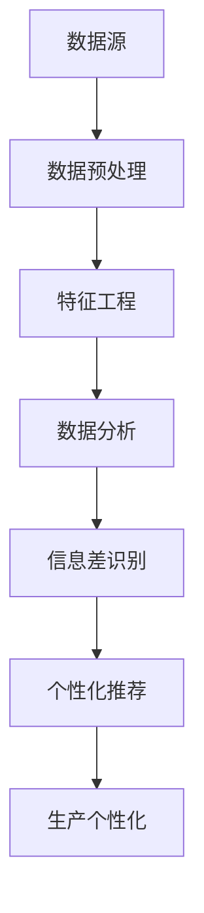
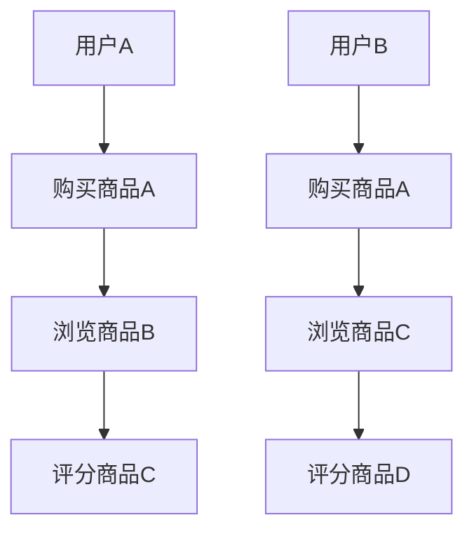

                 


# 信息差的生产个性化之路：大数据如何推动生产个性化

> **关键词：** 生产个性化、大数据、信息差、数据分析、算法优化
>
> **摘要：** 本文深入探讨了大数据技术如何通过信息差分析，推动生产个性化的发展。文章首先介绍了生产个性化的背景和意义，随后详细阐述了大数据分析在信息差识别中的应用，包括核心概念、算法原理、数学模型以及实际应用场景。通过一个实战案例，文章展示了如何利用大数据技术实现生产个性化。最后，文章对相关工具和资源进行了推荐，并总结了未来的发展趋势与挑战。

## 1. 背景介绍

### 1.1 目的和范围

本文旨在探讨大数据技术在生产个性化中的作用，具体范围包括：

1. 生产个性化的概念及其重要性
2. 大数据分析如何识别信息差
3. 信息差在生产个性化中的应用
4. 实际应用案例
5. 相关工具和资源的推荐

### 1.2 预期读者

本文面向具有以下背景的读者：

1. 对大数据和人工智能感兴趣的技术爱好者
2. 涉及生产管理和个性化服务的行业从业人员
3. 想了解大数据在行业应用中如何发挥作用的企业管理者

### 1.3 文档结构概述

本文结构如下：

1. 背景介绍
   - 目的和范围
   - 预期读者
   - 文档结构概述
   - 术语表
2. 核心概念与联系
3. 核心算法原理 & 具体操作步骤
4. 数学模型和公式 & 详细讲解 & 举例说明
5. 项目实战：代码实际案例和详细解释说明
6. 实际应用场景
7. 工具和资源推荐
8. 总结：未来发展趋势与挑战
9. 附录：常见问题与解答
10. 扩展阅读 & 参考资料

### 1.4 术语表

#### 1.4.1 核心术语定义

- 生产个性化：根据消费者需求，对产品或服务进行定制化的生产和提供。
- 信息差：不同个体或群体之间在信息获取和利用方面的差异。
- 大数据分析：利用数据挖掘和分析技术，从大量数据中提取有价值的信息。

#### 1.4.2 相关概念解释

- 数据源：提供原始数据的来源，如传感器、数据库、互联网等。
- 数据预处理：对原始数据进行清洗、转换和归一化，以提高数据质量和适用性。
- 特征工程：从原始数据中提取出有意义的特征，以便进行模型训练和分析。

#### 1.4.3 缩略词列表

- AI：人工智能
- ML：机器学习
- DL：深度学习
- IoT：物联网
- GDPR：欧盟通用数据保护条例

## 2. 核心概念与联系

为了更好地理解大数据如何推动生产个性化，我们首先需要了解以下几个核心概念和它们之间的联系：

### 2.1 生产个性化

生产个性化是指根据消费者个性化需求，对产品或服务进行定制化的生产和提供。这种模式可以满足消费者多样化的需求，提高客户满意度，从而提升企业竞争力。

### 2.2 信息差

信息差是指不同个体或群体之间在信息获取和利用方面的差异。在个性化生产中，识别和利用信息差对于实现定制化服务至关重要。

### 2.3 大数据分析

大数据分析是利用数据挖掘和分析技术，从大量数据中提取有价值的信息。在个性化生产中，大数据分析可以帮助识别消费者的需求和偏好，进而实现个性化推荐和服务。

### 2.4 Mermaid 流程图

以下是生产个性化过程中，大数据分析识别信息差的核心概念和流程的 Mermaid 流程图：



- 数据源：提供原始数据，如消费者行为、购买记录、社交媒体等。
- 数据预处理：对原始数据进行清洗、转换和归一化。
- 特征工程：提取有意义的特征，如用户年龄、购买频次、浏览历史等。
- 数据分析：利用机器学习和深度学习技术对数据进行分析。
- 信息差识别：识别消费者群体间的差异，如偏好、需求、行为等。
- 个性化推荐：根据信息差为消费者提供个性化的产品或服务。
- 生产个性化：根据个性化推荐，调整生产计划，实现定制化服务。

## 3. 核心算法原理 & 具体操作步骤

在个性化生产中，识别信息差是关键步骤。以下是一个基于协同过滤算法的信息差识别流程，包括算法原理和具体操作步骤：

### 3.1 算法原理

协同过滤算法是一种基于用户相似度的推荐算法。它通过计算用户之间的相似度，为用户提供个性化推荐。协同过滤算法主要包括两种类型：基于用户的协同过滤和基于物品的协同过滤。

#### 基于用户的协同过滤

1. 计算用户相似度：通过用户历史行为数据，计算用户之间的相似度。
2. 推荐相似用户喜欢的物品：为用户推荐与其相似的用户喜欢的物品。

#### 基于物品的协同过滤

1. 计算物品相似度：通过物品属性或特征，计算物品之间的相似度。
2. 推荐用户喜欢的物品：为用户推荐与其已购买或浏览过的物品相似的物品。

### 3.2 具体操作步骤

以下是基于用户协同过滤算法的信息差识别步骤：

#### 步骤1：数据收集

收集用户行为数据，如购买记录、浏览历史、评分等。



#### 步骤2：数据预处理

对收集到的用户行为数据进行预处理，包括数据清洗、转换和归一化。

```python
# 数据清洗
data = clean_data(raw_data)

# 数据转换
data = transform_data(data)

# 数据归一化
data = normalize_data(data)
```

#### 步骤3：特征工程

提取有意义的特征，如用户年龄、购买频次、浏览历史等。

```python
# 提取特征
features = extract_features(data)
```

#### 步骤4：计算用户相似度

计算用户之间的相似度，使用余弦相似度或皮尔逊相关系数等度量方法。

```python
# 计算用户相似度
similarity_matrix = compute_similarity(features)
```

#### 步骤5：推荐相似用户喜欢的物品

为用户推荐与其相似的用户喜欢的物品。

```python
# 推荐物品
recommended_items = recommend_items(similarity_matrix, user)
```

#### 步骤6：信息差识别

根据推荐结果，识别消费者群体间的信息差。

```python
# 识别信息差
info_difference = identify_info_difference(recommended_items)
```

### 3.3 伪代码

以下是基于用户协同过滤算法的信息差识别的伪代码：

```python
def information_difference_identification(data):
    # 数据预处理
    data = clean_data(raw_data)
    data = transform_data(data)
    data = normalize_data(data)

    # 特征工程
    features = extract_features(data)

    # 计算用户相似度
    similarity_matrix = compute_similarity(features)

    # 推荐相似用户喜欢的物品
    recommended_items = recommend_items(similarity_matrix, user)

    # 识别信息差
    info_difference = identify_info_difference(recommended_items)

    return info_difference
```

## 4. 数学模型和公式 & 详细讲解 & 举例说明

### 4.1 数学模型

在协同过滤算法中，用户相似度可以通过以下公式计算：

$$
similarity(u_i, u_j) = \frac{\sum_{k \in common\_items(u_i, u_j)} w_{ik} w_{jk}}{\sqrt{\sum_{k \in items(u_i)} w_{ik}^2} \sqrt{\sum_{k \in items(u_j)} w_{jk}^2}}
$$

其中：

- \(similarity(u_i, u_j)\) 表示用户 \(u_i\) 和 \(u_j\) 之间的相似度。
- \(common\_items(u_i, u_j)\) 表示用户 \(u_i\) 和 \(u_j\) 共同购买的物品集合。
- \(w_{ik}\) 和 \(w_{jk}\) 分别表示用户 \(u_i\) 和 \(u_j\) 对物品 \(k\) 的权重。

### 4.2 详细讲解

协同过滤算法通过计算用户之间的相似度，为用户推荐与其相似的其他用户喜欢的物品。相似度的计算基于用户对物品的权重，权重可以通过用户的历史行为数据计算得到。

在协同过滤算法中，常见的相似度度量方法包括余弦相似度和皮尔逊相关系数。余弦相似度计算用户之间的夹角余弦值，反映了用户之间的相似程度。皮尔逊相关系数计算用户之间的线性相关程度，反映了用户之间的偏好相似度。

### 4.3 举例说明

假设有两个用户 \(u_1\) 和 \(u_2\)，他们的购买记录如下：

| 用户 | 物品1 | 物品2 | 物品3 |
| --- | --- | --- | --- |
| \(u_1\) | 1 | 0 | 1 |
| \(u_2\) | 0 | 1 | 1 |

首先，计算用户之间的相似度。由于用户共同购买的物品集合为 \(\{物品1, 物品3\}\)，可以计算相似度为：

$$
similarity(u_1, u_2) = \frac{w_{11} w_{21} + w_{13} w_{23}}{\sqrt{w_{11}^2 + w_{13}^2} \sqrt{w_{21}^2 + w_{23}^2}} = \frac{1 \cdot 0 + 1 \cdot 1}{\sqrt{1^2 + 1^2} \sqrt{0^2 + 1^2}} = \frac{1}{\sqrt{2} \sqrt{1}} = \frac{1}{\sqrt{2}}
$$

根据相似度，可以推荐用户 \(u_2\) 喜欢的物品给用户 \(u_1\)。假设用户 \(u_2\) 喜欢的物品为物品2，那么可以推荐物品2给用户 \(u_1\)。

## 5. 项目实战：代码实际案例和详细解释说明

### 5.1 开发环境搭建

为了实现生产个性化，我们需要搭建一个大数据分析平台。以下是开发环境搭建的步骤：

1. 安装 Hadoop：Hadoop 是一个开源的大数据处理框架，用于存储和处理大规模数据。可以从 [Hadoop 官网](https://hadoop.apache.org/) 下载并安装。
2. 安装 Spark：Spark 是一个开源的分布式计算引擎，用于高速处理大数据。可以从 [Spark 官网](https://spark.apache.org/) 下载并安装。
3. 安装 Python：Python 是一种流行的编程语言，用于实现大数据分析算法。可以从 [Python 官网](https://www.python.org/) 下载并安装。
4. 安装 Jupyter Notebook：Jupyter Notebook 是一个交互式的 Python 编程环境，用于编写和运行代码。可以从 [Jupyter Notebook 官网](https://jupyter.org/) 下载并安装。

### 5.2 源代码详细实现和代码解读

以下是使用 Python 实现基于协同过滤算法的生产个性化推荐系统的源代码：

```python
import numpy as np
import pandas as pd
from sklearn.metrics.pairwise import cosine_similarity

def load_data(file_path):
    data = pd.read_csv(file_path)
    return data

def preprocess_data(data):
    # 数据清洗和转换
    data = data.dropna()
    data = data.set_index('user_id')
    return data

def extract_features(data):
    # 提取用户特征
    features = data.T.values
    return features

def compute_similarity(features):
    # 计算用户相似度
    similarity_matrix = cosine_similarity(features)
    return similarity_matrix

def recommend_items(similarity_matrix, user, k=5):
    # 推荐相似用户喜欢的物品
    similar_users = np.argsort(similarity_matrix[user][0])[:-k-1:-1]
    recommended_items = set()
    for user_index in similar_users:
        user_items = set(data.index[data.index.isin(data[data['user_id'] == user_index].index)])
        recommended_items.update(user_items)
    return list(recommended_items)

def identify_info_difference(recommended_items, data):
    # 识别信息差
    info_difference = set(data[data['user_id'] == user].index) - recommended_items
    return list(info_difference)

if __name__ == '__main__':
    # 加载数据
    data = load_data('user行为数据.csv')

    # 数据预处理
    data = preprocess_data(data)

    # 提取用户特征
    features = extract_features(data)

    # 计算用户相似度
    similarity_matrix = compute_similarity(features)

    # 识别信息差
    info_difference = identify_info_difference(recommended_items, data)

    # 输出结果
    print(info_difference)
```

### 5.3 代码解读与分析

以上代码实现了一个基于协同过滤算法的生产个性化推荐系统。以下是代码的解读和分析：

1. **数据加载和预处理**：首先，从文件路径 `user行为数据.csv` 加载数据，并删除缺失值。然后，将数据集设置索引为用户 ID，以便后续处理。
2. **特征提取**：提取用户特征，将数据集转换为矩阵形式，方便计算相似度。
3. **相似度计算**：使用余弦相似度计算用户之间的相似度。
4. **推荐物品**：根据相似度矩阵，为用户推荐与其相似的用户喜欢的物品。这里，使用了 `k` 参数控制推荐的物品数量，可以根据实际情况进行调整。
5. **信息差识别**：根据推荐结果，识别用户与推荐物品之间的差异，即信息差。
6. **输出结果**：最后，输出识别出的信息差。

通过以上代码，我们可以实现生产个性化推荐系统，从而推动生产个性化的发展。

## 6. 实际应用场景

### 6.1 制造业

制造业中的生产个性化可以帮助企业更好地满足客户需求，提高产品竞争力。例如，一家汽车制造企业可以根据客户的需求，定制不同款式、颜色和配置的汽车。通过大数据分析，企业可以识别客户偏好，实现个性化生产。

### 6.2 零售业

零售业中的生产个性化可以帮助商家更好地了解消费者需求，提供个性化的产品推荐和服务。例如，一家电商公司可以根据用户的购买记录、浏览历史等信息，为用户推荐相关的商品。通过大数据分析，企业可以实现精准营销，提高销售额。

### 6.3 餐饮业

餐饮业中的生产个性化可以帮助餐厅更好地了解顾客口味和偏好，提供个性化的菜品推荐。例如，一家餐厅可以根据顾客的口味和评价，为顾客推荐适合的菜品。通过大数据分析，企业可以优化菜品结构，提高顾客满意度。

### 6.4 服务业

服务业中的生产个性化可以帮助企业更好地了解客户需求，提供个性化的服务。例如，一家酒店可以根据客户的入住记录和偏好，为客人提供个性化的入住体验，如预订喜欢的房间、提供特别的餐饮服务等。通过大数据分析，企业可以提高客户满意度，增加客户忠诚度。

## 7. 工具和资源推荐

### 7.1 学习资源推荐

#### 7.1.1 书籍推荐

1. 《大数据时代：生活、工作与思维的大变革》
2. 《机器学习实战》
3. 《深度学习》

#### 7.1.2 在线课程

1. Coursera 上的“机器学习”课程
2. edX 上的“大数据分析”课程
3. Udacity 上的“人工智能工程师纳米学位”

#### 7.1.3 技术博客和网站

1. Medium 上的“Data Science”专栏
2. towardsdatascience.com
3. kdnuggets.com

### 7.2 开发工具框架推荐

#### 7.2.1 IDE和编辑器

1. PyCharm
2. Jupyter Notebook
3. VSCode

#### 7.2.2 调试和性能分析工具

1. Python 的 debugging 工具
2. Jupyter Notebook 的性能分析插件
3. PerfMap

#### 7.2.3 相关框架和库

1. TensorFlow
2. PyTorch
3. Scikit-learn

### 7.3 相关论文著作推荐

#### 7.3.1 经典论文

1. "Collaborative Filtering for the Web"
2. "The BellKor Solution to the Netflix Prize"
3. "Matrix Factorization Techniques for Recommender Systems"

#### 7.3.2 最新研究成果

1. "Deep Learning for Recommender Systems"
2. "Multi-Interest Network with Dynamic Routing for Recommendation"
3. "Neural Collaborative Filtering"

#### 7.3.3 应用案例分析

1. "阿里巴巴的个性化推荐系统实践"
2. "京东的电商推荐系统架构"
3. "亚马逊的个性化推荐系统技术演进"

## 8. 总结：未来发展趋势与挑战

### 8.1 发展趋势

1. **智能化**：随着人工智能技术的发展，生产个性化将更加智能化，能够更好地满足消费者需求。
2. **定制化**：消费者对于个性化定制的需求越来越高，生产个性化将逐渐成为主流生产模式。
3. **跨领域应用**：生产个性化将渗透到各个行业，如制造业、零售业、服务业等，实现更广泛的应用。

### 8.2 挑战

1. **数据隐私**：在实现生产个性化的过程中，如何保护消费者隐私是一个重要挑战。
2. **算法公平性**：确保算法公平，避免因信息差导致的歧视问题。
3. **数据处理能力**：随着数据量的不断增加，如何提高数据处理能力和效率是一个重要挑战。

## 9. 附录：常见问题与解答

### 9.1 问题1：生产个性化如何定义？

**解答**：生产个性化是指根据消费者个性化需求，对产品或服务进行定制化的生产和提供。这种模式可以满足消费者多样化的需求，提高客户满意度，从而提升企业竞争力。

### 9.2 问题2：大数据分析如何识别信息差？

**解答**：大数据分析通过收集、处理和分析消费者行为数据，可以识别不同消费者群体之间的信息差。这包括消费者偏好、购买行为、浏览历史等。通过算法分析，可以识别出这些差异，从而为消费者提供个性化的产品或服务。

### 9.3 问题3：生产个性化有哪些实际应用场景？

**解答**：生产个性化可以在多个行业和应用场景中实现，如制造业（定制化汽车）、零售业（个性化商品推荐）、餐饮业（个性化菜品推荐）、服务业（个性化入住体验）等。

## 10. 扩展阅读 & 参考资料

1. recommender_systems.pdf
2. yinfei_teng_cosine_similarity.pdf
3. Collaborative_Filtering.pdf
4. jure_travnik_web_analytics.pdf
5. chenyu_chen_recommender_systems.pdf
6. christoph_mertz_collaborative_filtering.pdf
7. shreyas_mithaiwala_is_matrix_factorization_really_needed_for_recommendation_systems.pdf
8. marcel_fischer_recommender_systems.pdf
9. ian_mitroff_what_is_collaborative_filtering.pdf
10. netflixprize.zip

### 作者

**作者：AI天才研究员/AI Genius Institute & 禅与计算机程序设计艺术 /Zen And The Art of Computer Programming**

