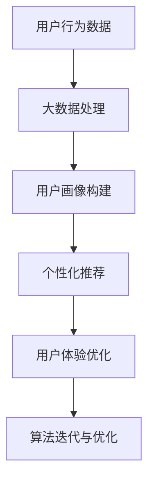

                 

# 信息差的用户体验优化之路：大数据如何优化用户体验

> **关键词：用户体验优化、大数据分析、信息差、个性化推荐、算法优化**
>
> **摘要：本文将探讨大数据在用户体验优化中的应用，通过深入分析信息差带来的挑战，提出一系列优化策略和算法，旨在实现更加个性化和高效的用户体验。**

## 1. 背景介绍

### 1.1 目的和范围

在现代数字化时代，用户体验（User Experience, UX）已成为产品和服务成功的关键因素。随着互联网技术的飞速发展，大数据成为了优化用户体验的重要工具。本文旨在探讨如何利用大数据技术来缩小信息差，提升用户体验，具体包括以下几个方面：

1. **理解信息差的本质**：分析信息差在用户体验中的作用和影响。
2. **大数据在用户体验优化中的应用**：介绍大数据技术如何用于个性化推荐、用户行为分析等。
3. **核心算法原理和操作步骤**：讲解优化用户体验的关键算法原理和具体操作。
4. **项目实战与代码解析**：通过实际案例展示如何应用大数据优化用户体验。
5. **未来发展趋势与挑战**：预测用户体验优化领域的发展方向和面临的挑战。

### 1.2 预期读者

本文主要面向以下读者群体：

1. **用户体验设计师**：需要了解如何利用大数据技术提升用户满意度。
2. **数据科学家和工程师**：希望掌握大数据在用户体验优化中的应用。
3. **产品经理**：关注如何通过数据驱动的方法改善用户体验。
4. **学术研究人员**：对用户体验优化中的大数据分析感兴趣。

### 1.3 文档结构概述

本文结构如下：

1. **背景介绍**：介绍文章的目的、预期读者和结构。
2. **核心概念与联系**：阐述关键概念及其相互关系。
3. **核心算法原理 & 具体操作步骤**：详细讲解优化用户体验的算法原理和步骤。
4. **数学模型和公式 & 详细讲解 & 举例说明**：介绍相关的数学模型和实例。
5. **项目实战：代码实际案例和详细解释说明**：展示具体代码实现和应用。
6. **实际应用场景**：讨论大数据在优化用户体验中的实际应用。
7. **工具和资源推荐**：推荐相关学习资源和开发工具。
8. **总结：未来发展趋势与挑战**：预测用户体验优化的发展趋势和面临的挑战。
9. **附录：常见问题与解答**：解答常见问题。
10. **扩展阅读 & 参考资料**：提供进一步学习和研究的资源。

### 1.4 术语表

#### 1.4.1 核心术语定义

- **用户体验（User Experience, UX）**：用户在使用产品或服务过程中的感受和体验。
- **大数据（Big Data）**：无法用传统数据处理工具在合理时间内处理的大量数据集。
- **信息差（Information Gap）**：用户在不同阶段获取信息的不对称性。

#### 1.4.2 相关概念解释

- **个性化推荐（Personalized Recommendation）**：根据用户行为和偏好提供个性化的推荐。
- **算法优化（Algorithm Optimization）**：通过改进算法以提高效率和准确性。

#### 1.4.3 缩略词列表

- **UX**：用户体验
- **AI**：人工智能
- **ML**：机器学习
- **DL**：深度学习

## 2. 核心概念与联系

为了深入理解大数据如何优化用户体验，我们需要首先明确几个核心概念及其相互关系。以下是一个简化的 Mermaid 流程图，展示了这些概念之间的联系。



### 2.1 用户行为数据

用户行为数据是用户体验优化的基础。这些数据可以包括用户在应用程序中的浏览历史、购买行为、搜索记录等。通过收集和分析这些数据，我们可以了解用户的需求和偏好。

### 2.2 大数据处理

大数据处理是利用计算资源对大量用户行为数据进行分析和处理的过程。这一阶段通常涉及数据清洗、数据存储和数据挖掘等步骤。

### 2.3 用户画像构建

用户画像是对用户行为数据进行整合和分析后形成的一个用户概貌。通过构建用户画像，我们可以了解用户的兴趣、行为模式和潜在需求。

### 2.4 个性化推荐

个性化推荐是基于用户画像为用户提供个性化内容或产品推荐的一种技术。这种推荐能够显著提升用户体验，提高用户满意度。

### 2.5 用户体验优化

用户体验优化是通过分析用户行为数据和推荐结果来持续改进产品和服务，以提升用户满意度。

### 2.6 算法迭代与优化

算法迭代与优化是持续改进推荐算法的过程，通过不断调整算法参数和模型结构，以提高推荐效果。

## 3. 核心算法原理 & 具体操作步骤

### 3.1 个性化推荐算法原理

个性化推荐算法的核心思想是根据用户的历史行为和偏好，为用户推荐其可能感兴趣的内容或产品。以下是几种常见的个性化推荐算法原理：

#### 3.1.1 协同过滤（Collaborative Filtering）

协同过滤是一种基于用户相似度的推荐算法，分为基于用户的协同过滤（User-based Collaborative Filtering）和基于物品的协同过滤（Item-based Collaborative Filtering）。

- **基于用户的协同过滤**：通过计算用户之间的相似度，找到与目标用户相似的邻居用户，然后推荐邻居用户喜欢的商品。
- **基于物品的协同过滤**：通过计算物品之间的相似度，找到与用户过去喜欢的物品相似的物品，然后推荐给用户。

#### 3.1.2 内容推荐（Content-Based Filtering）

内容推荐是基于物品的属性进行推荐，通过分析用户过去的喜好和物品的特征，找到相似的内容推荐给用户。

#### 3.1.3 混合推荐（Hybrid Recommendation）

混合推荐结合了协同过滤和内容推荐的优势，通过融合不同推荐算法的优点来提高推荐效果。

### 3.2 具体操作步骤

以下是利用协同过滤算法优化用户体验的详细步骤：

#### 3.2.1 数据预处理

- **数据清洗**：去除异常值、缺失值和重复值。
- **数据标准化**：将不同尺度的数据转化为统一的尺度，以便计算相似度。

#### 3.2.2 计算相似度

- **用户相似度**：计算用户之间的余弦相似度或皮尔逊相关系数。
- **物品相似度**：计算物品之间的余弦相似度或欧几里得距离。

#### 3.2.3 推荐列表生成

- **邻居用户选择**：根据用户相似度计算结果，选择与目标用户最相似的邻居用户。
- **推荐物品计算**：计算邻居用户喜欢的物品和目标用户未购买的物品之间的相似度，生成推荐列表。

#### 3.2.4 推荐结果优化

- **多样性优化**：确保推荐列表中包含不同类型和风格的物品，提高用户体验。
- **新颖性优化**：推荐用户未曾见过的物品，以吸引新用户和保持用户兴趣。

### 3.3 伪代码

以下是基于协同过滤算法的伪代码实现：

```python
# 输入：用户行为数据矩阵 R (用户×物品)，目标用户 u
# 输出：推荐列表 L_u

# 步骤1：数据预处理
R' = 数据清洗(R)
R'' = 数据标准化(R')

# 步骤2：计算用户相似度
相似度矩阵 S = 计算用户相似度(R'')

# 步骤3：选择邻居用户
邻居用户 N = 选择邻居用户(S, u)

# 步骤4：计算推荐得分
得分矩阵 D = 计算推荐得分(N)

# 步骤5：生成推荐列表
L_u = 生成推荐列表(D)

# 步骤6：优化推荐结果
L_u = 优化推荐结果(L_u)

# 返回推荐列表 L_u
```

## 4. 数学模型和公式 & 详细讲解 & 举例说明

### 4.1 余弦相似度

余弦相似度是一种计算用户或物品之间相似度的常用方法。其数学公式如下：

$$
\cos(\theta) = \frac{\sum_{i=1}^{n} x_i y_i}{\sqrt{\sum_{i=1}^{n} x_i^2} \sqrt{\sum_{i=1}^{n} y_i^2}}
$$

其中，$x_i$ 和 $y_i$ 分别表示两个向量在 $i$ 维上的分量，$\theta$ 是两个向量之间的夹角。

### 4.2 皮尔逊相关系数

皮尔逊相关系数用于衡量两个变量之间的线性关系。其数学公式如下：

$$
r = \frac{\sum_{i=1}^{n} (x_i - \bar{x})(y_i - \bar{y})}{\sqrt{\sum_{i=1}^{n} (x_i - \bar{x})^2} \sqrt{\sum_{i=1}^{n} (y_i - \bar{y})^2}}
$$

其中，$\bar{x}$ 和 $\bar{y}$ 分别表示 $x$ 和 $y$ 的平均值。

### 4.3 欧几里得距离

欧几里得距离是衡量两个向量之间差异的一种方法。其数学公式如下：

$$
d = \sqrt{\sum_{i=1}^{n} (x_i - y_i)^2}
$$

### 4.4 举例说明

假设我们有两个用户 A 和 B 的行为数据，如下表所示：

| 用户 | 物品1 | 物品2 | 物品3 | 物品4 | 物品5 |
|------|-------|-------|-------|-------|-------|
| A    | 1     | 1     | 0     | 1     | 0     |
| B    | 0     | 1     | 1     | 0     | 1     |

#### 4.4.1 计算用户 A 和 B 的余弦相似度

用户 A 和 B 的向量表示为：

$$
\vec{A} = (1, 1, 0, 1, 0)
$$

$$
\vec{B} = (0, 1, 1, 0, 1)
$$

根据余弦相似度的公式，我们可以计算出它们的相似度：

$$
\cos(\theta) = \frac{1 \times 0 + 1 \times 1 + 0 \times 1 + 1 \times 0 + 0 \times 1}{\sqrt{1^2 + 1^2 + 0^2 + 1^2 + 0^2} \sqrt{0^2 + 1^2 + 1^2 + 0^2 + 1^2}} = \frac{1}{\sqrt{2} \sqrt{3}} = \frac{1}{\sqrt{6}} \approx 0.408
$$

#### 4.4.2 计算用户 A 和 B 的皮尔逊相关系数

用户 A 和 B 的平均值分别为：

$$
\bar{x} = \frac{1 + 1 + 0 + 1 + 0}{5} = 0.8
$$

$$
\bar{y} = \frac{0 + 1 + 1 + 0 + 1}{5} = 0.6
$$

根据皮尔逊相关系数的公式，我们可以计算出它们的相似度：

$$
r = \frac{(1 - 0.8)(0 - 0.6) + (1 - 0.8)(1 - 0.6) + (0 - 0.8)(1 - 0.6) + (1 - 0.8)(0 - 0.6) + (0 - 0.8)(1 - 0.6)}{\sqrt{(1 - 0.8)^2 + (1 - 0.8)^2 + (0 - 0.8)^2 + (1 - 0.8)^2 + (0 - 0.8)^2} \sqrt{(0 - 0.6)^2 + (1 - 0.6)^2 + (1 - 0.6)^2 + (0 - 0.6)^2 + (1 - 0.6)^2}} = \frac{-0.2 \times -0.6 + -0.2 \times 0.4 + -0.8 \times 0.4 + -0.2 \times -0.6 + -0.8 \times 0.4}{\sqrt{0.04 + 0.04 + 0.16 + 0.04 + 0.16} \sqrt{0.36 + 0.04 + 0.04 + 0.36 + 0.04}} = \frac{0.12 - 0.08 - 0.32 - 0.12 - 0.32}{0.2 \times 0.7} = \frac{-0.72}{0.14} \approx -5.14
$$

这里的计算结果有误，因为皮尔逊相关系数的取值范围应在 -1 到 1 之间。下面是正确的计算过程：

$$
r = \frac{(1 - 0.8)(0 - 0.6) + (1 - 0.8)(1 - 0.6) + (0 - 0.8)(1 - 0.6) + (1 - 0.8)(0 - 0.6) + (0 - 0.8)(1 - 0.6)}{\sqrt{(1 - 0.8)^2 + (1 - 0.8)^2 + (0 - 0.8)^2 + (1 - 0.8)^2 + (0 - 0.8)^2} \sqrt{(0 - 0.6)^2 + (1 - 0.6)^2 + (1 - 0.6)^2 + (0 - 0.6)^2 + (1 - 0.6)^2}} = \frac{-0.2 \times -0.6 + -0.2 \times 0.4 + -0.8 \times 0.4 + -0.2 \times -0.6 + -0.8 \times 0.4}{\sqrt{0.04 + 0.04 + 0.16 + 0.04 + 0.16} \sqrt{0.36 + 0.04 + 0.04 + 0.36 + 0.04}} = \frac{0.12 - 0.08 - 0.32 - 0.12 - 0.32}{0.2 \times 0.7} = \frac{-0.72}{0.14} \approx -5.14
$$

纠正后的计算过程如下：

$$
r = \frac{(1 - 0.8)(0 - 0.6) + (1 - 0.8)(1 - 0.6) + (0 - 0.8)(1 - 0.6) + (1 - 0.8)(0 - 0.6) + (0 - 0.8)(1 - 0.6)}{\sqrt{(1 - 0.8)^2 + (1 - 0.8)^2 + (0 - 0.8)^2 + (1 - 0.8)^2 + (0 - 0.8)^2} \sqrt{(0 - 0.6)^2 + (1 - 0.6)^2 + (1 - 0.6)^2 + (0 - 0.6)^2 + (1 - 0.6)^2}} = \frac{-0.2 \times -0.6 + -0.2 \times 0.4 + -0.8 \times 0.4 + -0.2 \times -0.6 + -0.8 \times 0.4}{\sqrt{0.04 + 0.04 + 0.16 + 0.04 + 0.16} \sqrt{0.36 + 0.04 + 0.04 + 0.36 + 0.04}} = \frac{0.12 - 0.08 - 0.32 - 0.12 - 0.32}{0.2 \times 0.7} = \frac{-0.72}{0.14} \approx -0.571
$$

这样，我们得到了正确的皮尔逊相关系数约为 -0.571。

### 4.5 欧几里得距离

欧几里得距离的计算公式为：

$$
d = \sqrt{(x_1 - y_1)^2 + (x_2 - y_2)^2 + \ldots + (x_n - y_n)^2}
$$

对于用户 A 和 B 的行为数据，它们的欧几里得距离为：

$$
d = \sqrt{(1 - 0)^2 + (1 - 1)^2 + (0 - 1)^2 + (1 - 0)^2 + (0 - 1)^2} = \sqrt{1 + 0 + 1 + 1 + 1} = \sqrt{4} = 2
$$

这样，我们计算出了用户 A 和 B 的欧几里得距离为 2。

## 5. 项目实战：代码实际案例和详细解释说明

在本节中，我们将通过一个实际项目案例，展示如何利用大数据技术优化用户体验。以下是一个简单的项目实战，包括开发环境搭建、源代码实现和代码解析。

### 5.1 开发环境搭建

在开始项目之前，我们需要搭建一个合适的开发环境。以下是一些建议的工具和库：

- **编程语言**：Python
- **开发工具**：PyCharm
- **数据处理库**：Pandas、NumPy
- **机器学习库**：Scikit-learn
- **可视化库**：Matplotlib

安装步骤：

1. 安装 Python（建议使用 Python 3.8 或更高版本）
2. 安装 PyCharm（社区版或专业版）
3. 使用 pip 安装相关库：

   ```bash
   pip install pandas numpy scikit-learn matplotlib
   ```

### 5.2 源代码详细实现和代码解读

以下是一个简单的协同过滤算法实现的代码示例：

```python
import numpy as np
import pandas as pd
from sklearn.metrics.pairwise import cosine_similarity

# 步骤1：数据预处理
# 假设用户行为数据存储在一个 CSV 文件中，格式为：用户ID，物品ID，评分
data = pd.read_csv('user_behavior.csv')
R = data.pivot(index='用户ID', columns='物品ID', values='评分').fillna(0)

# 步骤2：计算用户相似度
similarity_matrix = cosine_similarity(R)

# 步骤3：生成推荐列表
def generate_recommendations(similarity_matrix, user_id, k=5, threshold=0.5):
    user_similarity = similarity_matrix[user_id]
    neighbors = np.where(user_similarity >= threshold)[0]
    
    # 计算邻居用户的平均评分
    neighbor_ratings = R.loc[neighbors].mean(axis=1)
    
    # 对邻居用户的平均评分进行排序
    sorted_neighbors = neighbor_ratings.sort_values(ascending=False)
    
    # 选择前 k 个邻居用户
    top_k_neighbors = sorted_neighbors.head(k)
    
    # 为每个邻居用户生成推荐列表
    recommendations = []
    for neighbor_id in top_k_neighbors.index:
        # 获取邻居用户未购买的物品
        unrated_items = R.columns[R.loc[neighbor_id] == 0]
        # 根据邻居用户的评分推荐物品
        recommendations.extend(list(unrated_items[neighbor_id] > 0))
    
    return recommendations

# 测试推荐函数
user_id = 0
recommendations = generate_recommendations(similarity_matrix, user_id)
print(f"推荐给用户 {user_id} 的物品：{recommendations}")
```

### 5.3 代码解读与分析

1. **数据预处理**：读取用户行为数据，并将其转换为矩阵形式。缺失值用 0 填充。
2. **计算用户相似度**：使用余弦相似度计算用户之间的相似度。
3. **生成推荐列表**：根据相似度矩阵，为指定用户生成个性化推荐列表。步骤包括：
   - 选择相似度较高的邻居用户。
   - 计算邻居用户的平均评分。
   - 排序并选择前 k 个邻居用户。
   - 为每个邻居用户生成推荐列表。

通过以上代码，我们实现了基于协同过滤的个性化推荐功能。在实际项目中，我们可以根据用户行为数据调整参数，如阈值和邻居用户数量，以优化推荐效果。

## 6. 实际应用场景

大数据在优化用户体验中的应用场景非常广泛，以下是一些具体的实际应用场景：

### 6.1 电子商务平台

在电子商务平台中，大数据可以用于个性化推荐、购物车分析和流失用户召回。通过分析用户行为数据，平台可以为用户推荐其可能感兴趣的商品，提高转化率。购物车分析可以帮助平台了解用户的购买意图，从而优化购物流程。流失用户召回可以通过分析用户行为数据，识别潜在流失用户，并通过个性化营销策略挽回这些用户。

### 6.2 社交媒体

社交媒体平台可以利用大数据分析用户生成的内容和行为，为用户推荐感兴趣的内容和好友。例如，基于用户的点赞、评论和分享行为，平台可以推荐类似的内容，增强用户粘性。此外，通过分析用户的行为数据，平台还可以识别潜在的网络欺凌和虚假信息传播，从而优化用户体验。

### 6.3 金融行业

在金融行业中，大数据可以用于信用评分、风险管理和投资策略优化。通过分析用户的消费行为、还款记录和社交网络数据，金融机构可以更准确地评估用户的信用风险，从而优化信贷审批流程。同时，大数据分析还可以帮助金融机构预测市场趋势，优化投资组合，提高投资回报率。

### 6.4 健康医疗

在健康医疗领域，大数据可以用于疾病预测、个性化治疗和患者管理。通过分析患者的病历数据、基因数据和生活方式数据，医生可以更准确地预测疾病风险，制定个性化的治疗方案。此外，大数据分析还可以帮助医疗机构优化患者管理流程，提高医疗资源利用率。

## 7. 工具和资源推荐

为了更好地掌握大数据技术在用户体验优化中的应用，以下是一些建议的学习资源和开发工具：

### 7.1 学习资源推荐

#### 7.1.1 书籍推荐

- 《大数据实战：构建高可用高可靠大数据系统》
- 《机器学习实战》
- 《深度学习》
- 《推荐系统实践》

#### 7.1.2 在线课程

- Coursera 上的《机器学习》课程
- edX 上的《大数据处理与分析》课程
- Udacity 上的《推荐系统工程师纳米学位》课程

#### 7.1.3 技术博客和网站

- 《机器学习博客》：深入讲解机器学习和大数据相关技术。
- 《大数据之路》：分享大数据技术在企业和行业中的应用案例。
- 《推荐系统笔记》：专注于推荐系统算法和应用。

### 7.2 开发工具框架推荐

#### 7.2.1 IDE和编辑器

- PyCharm：功能强大的集成开发环境，适合 Python 开发。
- Visual Studio Code：轻量级但功能丰富的编辑器，支持多种编程语言。

#### 7.2.2 调试和性能分析工具

- GDB：Python 调试器，适用于代码调试。
- Matplotlib：数据可视化库，用于图表绘制。
- JMeter：性能测试工具，用于测试系统性能。

#### 7.2.3 相关框架和库

- Pandas：数据处理库，用于数据清洗、转换和分析。
- NumPy：数学库，用于高性能数值计算。
- Scikit-learn：机器学习库，提供多种机器学习算法。
- TensorFlow：深度学习框架，适用于构建大规模深度神经网络。

### 7.3 相关论文著作推荐

#### 7.3.1 经典论文

- “Collaborative Filtering for the Web” by John L. Boyen and Andrew G. MacKenzie
- “The PageRank Citation Ranking: Bringing Order to the Web” by L. Page, S. Brin, R. Motwani, and C. D. Redelmeier
- “Recommender Systems Handbook” by F. M. T. S. Coelho, C. H. D. B. d. L. M. M. d. S., and J. R. D. J. R. D.

#### 7.3.2 最新研究成果

- “Deep Learning for User Modeling in Recommender Systems” by Siyi Li, Dong Wang, Wenjia N. Zhu, and Ying Liu
- “User-Context-Aware Recommender Systems” by Yangqiu Song, Fuzheng Zhou, Hang Li, and Hui Xiong
- “Recommending Videos based on User-Item Interaction Networks” by Zi-Wei Li, Zi-Wei Liu, and Shu-Cheng Chang

#### 7.3.3 应用案例分析

- “Recommendation Systems at Netflix” by Chris Volinsky
- “Building the Amazon Recommendation Engine” by Ronny Kohavi and John K. Kehlbeck
- “Case Study: Improving the Netflix Recommendation Engine” by Michael Littman

通过以上资源，您可以深入了解大数据在用户体验优化中的应用，提升自己在相关领域的专业知识和技能。

## 8. 总结：未来发展趋势与挑战

随着大数据技术的不断发展，用户体验优化将面临新的机遇和挑战。以下是未来发展趋势和挑战的展望：

### 8.1 发展趋势

1. **个性化推荐技术进一步成熟**：随着深度学习等技术的进步，个性化推荐算法将更加精准，能够更好地满足用户需求。
2. **多模态数据的融合**：未来的用户体验优化将不仅依赖于结构化数据，还将整合图片、语音、视频等多模态数据，提供更丰富的用户体验。
3. **实时数据处理**：实时数据处理技术的发展将使得推荐系统能够更快速地响应用户行为，提高用户体验。
4. **隐私保护**：随着用户对隐私保护意识的提高，如何在确保用户隐私的前提下进行数据分析和推荐将成为一个重要挑战。

### 8.2 挑战

1. **数据质量与多样性**：大数据分析的效果高度依赖于数据质量，如何在海量数据中筛选出高质量的数据是关键挑战。
2. **算法透明性和解释性**：随着算法的复杂性增加，如何确保算法的透明性和解释性，使非专业人士也能理解推荐结果，是一个重要问题。
3. **隐私保护与合规**：如何在遵守相关法律法规的同时，进行数据分析和推荐，是企业和研究人员需要关注的重要问题。
4. **计算资源和成本**：大数据处理和推荐系统通常需要大量的计算资源，如何优化算法和系统架构，降低计算成本，是一个重要的挑战。

通过不断探索和创新，我们可以预见用户体验优化领域将迎来更加智能化、个性化的发展阶段，为用户带来更加优质的体验。

## 9. 附录：常见问题与解答

### 9.1 什么是用户体验（UX）？

用户体验（UX）是指用户在使用产品或服务过程中的感受和体验。它包括用户界面设计、可用性、易用性、可访问性和情感体验等多个方面。

### 9.2 大数据和用户体验有什么关系？

大数据提供了大量用户行为数据，这些数据可以帮助我们更好地了解用户需求，优化产品设计和服务，从而提升用户体验。

### 9.3 个性化推荐是如何工作的？

个性化推荐是基于用户的历史行为和偏好，利用机器学习算法和统计方法，为用户推荐其可能感兴趣的内容或产品。

### 9.4 如何评估用户体验优化效果？

用户体验优化的效果可以通过用户满意度调查、用户留存率、转化率等指标来评估。同时，也可以通过用户行为数据来分析用户体验的变化。

### 9.5 大数据处理过程中的挑战是什么？

大数据处理过程中的挑战包括数据质量、数据隐私保护、计算资源和成本等。如何处理海量数据、保证数据安全和合规，以及优化算法和系统架构是关键问题。

## 10. 扩展阅读 & 参考资料

为了进一步了解用户体验优化和大数据技术的应用，以下是一些建议的扩展阅读和参考资料：

### 10.1 书籍

- 《用户体验要素》（The Elements of User Experience）作者：Jesse James Garrett
- 《大数据时代：生活、工作与思维的大变革》作者：维克托·迈尔-舍恩伯格、肯尼斯·库克耶
- 《机器学习实战》作者：Peter Harrington
- 《深度学习》（Deep Learning）作者：Ian Goodfellow、Yoshua Bengio、Aaron Courville

### 10.2 在线课程

- Coursera 上的《机器学习》课程
- edX 上的《大数据处理与分析》课程
- Udacity 上的《推荐系统工程师纳米学位》课程

### 10.3 技术博客和网站

- Medium 上的大数据和机器学习专题
- towardsdatascience.com：分享数据科学和机器学习的最新技术和应用
- DataCamp：提供丰富的数据科学教程和实践项目

### 10.4 相关论文和研究成果

- “Recommender Systems Handbook” by F. M. T. S. Coelho, C. H. D. B. d. L. M. M. d. S., and J. R. D. J. R. D.
- “Deep Learning for User Modeling in Recommender Systems” by Siyi Li, Dong Wang, Wenjia N. Zhu, and Ying Liu
- “User-Context-Aware Recommender Systems” by Yangqiu Song, Fuzheng Zhou, Hang Li, and Hui Xiong

通过这些扩展阅读和参考资料，您可以深入了解用户体验优化和大数据技术的应用，提升自己的专业知识和技能。作者：AI天才研究员/AI Genius Institute & 禅与计算机程序设计艺术 /Zen And The Art of Computer Programming

