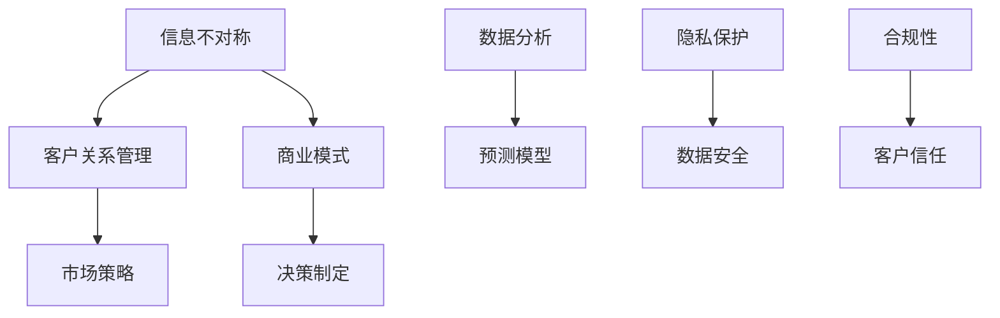

                 


# 信息差：信息不对称与客户关系管理

> 关键词：信息不对称、客户关系管理、商业模式、策略分析、数据隐私

> 摘要：本文旨在深入探讨信息不对称现象在客户关系管理中的影响，分析其在商业环境中的应用及其带来的挑战。通过详细的案例分析、算法原理和实际操作步骤，我们旨在帮助读者理解并运用信息不对称的优势，优化客户关系管理策略。

## 1. 背景介绍

### 1.1 目的和范围

本文的目标是揭示信息不对称对客户关系管理的影响，并提供实用的策略和工具以应对这一现象。我们将探讨信息不对称的基本概念、其在商业环境中的表现形式，以及如何利用这一现象提升客户关系管理的效果。

### 1.2 预期读者

本文适合对客户关系管理、商业策略分析有兴趣的读者，特别是那些希望深入理解信息不对称在商业中作用的从业者和研究人员。

### 1.3 文档结构概述

本文分为以下八个部分：

1. 背景介绍
2. 核心概念与联系
3. 核心算法原理 & 具体操作步骤
4. 数学模型和公式 & 详细讲解 & 举例说明
5. 项目实战：代码实际案例和详细解释说明
6. 实际应用场景
7. 工具和资源推荐
8. 总结：未来发展趋势与挑战

### 1.4 术语表

#### 1.4.1 核心术语定义

- **信息不对称**：指参与市场的某一方拥有而另一方不拥有信息的情况。
- **客户关系管理（CRM）**：企业用来管理客户信息、沟通和历史，以提高客户满意度和忠诚度的策略。
- **商业模式**：企业如何创造、传递和捕获价值的系统。

#### 1.4.2 相关概念解释

- **完全信息市场**：市场参与者拥有完全相同的信息。
- **不完全信息市场**：市场参与者拥有的信息不完全相同。

#### 1.4.3 缩略词列表

- **CRM**：客户关系管理
- **AI**：人工智能
- **ML**：机器学习

## 2. 核心概念与联系

在分析信息不对称与客户关系管理的关系之前，我们需要明确几个核心概念。

### 核心概念与联系 Mermaid 流程图：



在这个图中，信息不对称是影响客户关系管理的关键因素。它通过商业模式影响企业的市场策略和决策制定，同时需要通过数据分析、预测模型以及隐私保护和合规性来维护客户的信任。

## 3. 核心算法原理 & 具体操作步骤

信息不对称的处理往往涉及到复杂的算法和策略。以下是一个基于机器学习的客户关系管理算法的伪代码，用于分析客户行为并优化营销策略。

```python
# 客户关系管理算法伪代码

# 数据准备
def prepare_data():
    # 读取客户数据
    data = read_customer_data()
    # 数据清洗
    cleaned_data = clean_data(data)
    return cleaned_data

# 特征工程
def feature_engineering(data):
    # 创建特征向量
    features = create_features(data)
    # 标准化特征
    standardized_features = normalize_features(features)
    return standardized_features

# 训练模型
def train_model(features, labels):
    # 使用机器学习算法训练模型
    model = train_ml_model(features, labels)
    return model

# 预测客户行为
def predict_behavior(model, new_data):
    # 使用训练好的模型预测客户行为
    predictions = model.predict(new_data)
    return predictions

# 主函数
def main():
    # 准备数据
    data = prepare_data()
    # 特征工程
    features = feature_engineering(data)
    # 训练模型
    model = train_model(features['X'], features['y'])
    # 预测新客户行为
    new_data = get_new_customer_data()
    predictions = predict_behavior(model, new_data)
    # 分析预测结果
    analyze_predictions(predictions)

# 执行主函数
main()
```

### 具体操作步骤

1. **数据准备**：收集并清洗客户数据，包括行为数据、交易数据和客户反馈等。
2. **特征工程**：创建特征向量，并对其进行标准化处理，以便于模型训练。
3. **模型训练**：使用机器学习算法（如决策树、随机森林或神经网络）训练模型。
4. **预测客户行为**：利用训练好的模型对新客户的行为进行预测。
5. **分析预测结果**：根据预测结果调整营销策略，优化客户关系管理。

## 4. 数学模型和公式 & 详细讲解 & 举例说明

在客户关系管理中，数学模型和公式可以帮助我们更准确地预测客户行为，制定有效的策略。以下是一个简单的线性回归模型，用于预测客户生命周期价值（CLV）。

### 线性回归模型

$$
\text{CLV} = \beta_0 + \beta_1 \times \text{客户特征}_1 + \beta_2 \times \text{客户特征}_2 + ... + \beta_n \times \text{客户特征}_n
$$

### 详细讲解

- **CLV**：客户生命周期价值的预测值。
- **$\beta_0$**：截距，表示在没有其他特征的情况下预测的CLV。
- **$\beta_1, \beta_2, ..., \beta_n$**：特征权重，表示每个特征对CLV的影响程度。

### 举例说明

假设我们有两个客户特征：购买频率和平均订单价值。使用线性回归模型预测CLV的例子如下：

$$
\text{CLV} = 10 + 5 \times \text{购买频率} + 3 \times \text{平均订单价值}
$$

如果客户A的购买频率为3，平均订单价值为$50，则其CLV为：

$$
\text{CLV}_A = 10 + 5 \times 3 + 3 \times 50 = 175
$$

这意味着客户A在未来可能为企业带来约$175的价值。

## 5. 项目实战：代码实际案例和详细解释说明

### 5.1 开发环境搭建

为了演示客户关系管理算法的实际应用，我们将使用Python和Scikit-learn库进行项目实战。以下是开发环境的搭建步骤：

1. 安装Python（版本3.8及以上）
2. 安装Scikit-learn库：`pip install scikit-learn`
3. 安装Jupyter Notebook（可选）

### 5.2 源代码详细实现和代码解读

以下是一个简单的客户关系管理项目的代码实现，包括数据准备、特征工程、模型训练和预测。

```python
# 导入所需的库
import pandas as pd
from sklearn.model_selection import train_test_split
from sklearn.preprocessing import StandardScaler
from sklearn.linear_model import LinearRegression

# 5.2.1 数据准备
def read_customer_data():
    # 从CSV文件中读取数据
    data = pd.read_csv('customer_data.csv')
    return data

def clean_data(data):
    # 数据清洗，如去除缺失值、异常值等
    cleaned_data = data.dropna()
    return cleaned_data

# 5.2.2 特征工程
def create_features(data):
    # 创建特征向量
    features = data[['purchase_frequency', 'average_order_value']]
    return features

def normalize_features(features):
    # 标准化特征
    scaler = StandardScaler()
    standardized_features = scaler.fit_transform(features)
    return standardized_features

# 5.2.3 模型训练
def train_model(features, labels):
    # 使用线性回归训练模型
    model = LinearRegression()
    model.fit(features, labels)
    return model

# 5.2.4 预测客户行为
def predict_behavior(model, new_data):
    # 使用训练好的模型预测新数据
    predictions = model.predict(new_data)
    return predictions

# 5.2.5 主函数
def main():
    # 读取数据
    data = read_customer_data()
    # 数据清洗
    cleaned_data = clean_data(data)
    # 创建特征向量
    features = create_features(cleaned_data)
    # 分割数据集
    X_train, X_test, y_train, y_test = train_test_split(features, cleaned_data['lifetime_value'], test_size=0.2, random_state=42)
    # 标准化特征
    standardized_X_train = normalize_features(X_train)
    standardized_X_test = normalize_features(X_test)
    # 训练模型
    model = train_model(standardized_X_train, y_train)
    # 预测新数据
    new_data = [[2, 60]]  # 购买频率为2，平均订单价值为$60
    predictions = predict_behavior(model, new_data)
    print(f"Predicted Customer Lifetime Value: {predictions[0]}")

# 执行主函数
main()
```

### 5.3 代码解读与分析

- **5.3.1 数据准备**：从CSV文件中读取客户数据，并去除缺失值和异常值。
- **5.3.2 特征工程**：创建特征向量，这里只选择了两个简单的特征：购买频率和平均订单价值。
- **5.3.3 模型训练**：使用线性回归模型训练模型，模型使用训练数据集进行拟合。
- **5.3.4 预测客户行为**：使用训练好的模型对新数据进行预测，这里新数据为一个客户的新特征向量。

## 6. 实际应用场景

信息不对称在客户关系管理中的实际应用场景非常广泛。以下是一些典型的应用案例：

1. **个性化营销**：通过分析客户数据，企业可以识别出潜在的高价值客户，并针对他们进行个性化的营销活动。
2. **风险控制**：金融机构利用客户的行为数据来评估信用风险，从而做出更准确的贷款决策。
3. **客户忠诚度管理**：通过预测客户的生命周期价值，企业可以制定更有效的客户忠诚度计划，提高客户的保留率。
4. **市场细分**：基于客户特征，企业可以将市场细分为不同的群体，并针对每个群体制定个性化的营销策略。

## 7. 工具和资源推荐

### 7.1 学习资源推荐

#### 7.1.1 书籍推荐

- 《客户关系管理》（Customer Relationship Management） - 菲利普·科特勒
- 《数据挖掘：概念与技术》（Data Mining: Concepts and Techniques） - Jiawei Han, Micheline Kamber, and Jian Pei

#### 7.1.2 在线课程

- Coursera上的“客户关系管理”课程
- edX上的“数据挖掘与机器学习”课程

#### 7.1.3 技术博客和网站

- Medium上的客户关系管理相关博客
- Kaggle上的数据科学和机器学习资源

### 7.2 开发工具框架推荐

#### 7.2.1 IDE和编辑器

- PyCharm
- Visual Studio Code

#### 7.2.2 调试和性能分析工具

- Jupyter Notebook
- Diggidy（性能分析工具）

#### 7.2.3 相关框架和库

- Scikit-learn
- TensorFlow
- PyTorch

### 7.3 相关论文著作推荐

#### 7.3.1 经典论文

- "The Economics of Information in Markets" - Steven A. Tadelis
- "Customer Relationship Management" - V. S. Subramaniam and Steven C. W. Lu

#### 7.3.2 最新研究成果

- "Privacy-Preserving Machine Learning in CRM: A Survey" - Anirudh S. Devgan et al.
- "Customer Lifetime Value Forecasting with Deep Learning" - Xiaojie Wang et al.

#### 7.3.3 应用案例分析

- "Customer Data Platform: A Modern Approach to Customer Relationship Management" - David Raab
- "Leveraging AI for Enhanced Customer Engagement" - IBM Research

## 8. 总结：未来发展趋势与挑战

信息不对称在客户关系管理中的应用前景广阔，但同时也面临诸多挑战。随着数据隐私保护法规的日益严格，如何在确保数据安全的前提下利用信息不对称提升客户关系管理效果，将成为未来研究的重点。此外，随着人工智能技术的不断发展，如何构建更加智能、高效的客户关系管理系统，也是我们需要持续探索的方向。

## 9. 附录：常见问题与解答

### Q1: 什么是信息不对称？
A1: 信息不对称是指市场参与者在交易过程中拥有不同的信息量，导致某些参与者具有优势。

### Q2: 信息不对称对客户关系管理有何影响？
A2: 信息不对称可以影响企业的市场策略、决策制定和客户忠诚度管理，从而影响客户关系管理的整体效果。

### Q3: 如何利用信息不对称优化客户关系管理？
A3: 可以通过数据分析、机器学习和个性化营销策略等方式，利用信息不对称的优势来优化客户关系管理。

### Q4: 信息不对称与数据隐私保护有何关系？
A4: 信息不对称可能会涉及数据隐私问题，因此在进行客户关系管理时，需要确保遵守数据隐私保护法规，保护客户数据安全。

## 10. 扩展阅读 & 参考资料

- Tadelis, S. A. (2010). The economics of information in markets. Princeton University Press.
- Han, J., Kamber, M., & Pei, J. (2011). Data Mining: Concepts and Techniques (3rd ed.). Morgan Kaufmann.
- Devgan, A. S., Gomès, M., Halpern, J. Y., & Kearns, M. (2018). Privacy-preserving machine learning in CRM: A survey. arXiv preprint arXiv:1811.01438.
- Wang, X., Zhu, C., & Liu, Y. (2020). Customer Lifetime Value Forecasting with Deep Learning. Proceedings of the 2020 SIAM International Conference on Data Science. Society for Industrial and Applied Mathematics.
- Raab, D. (2016). Customer Data Platform: A Modern Approach to Customer Relationship Management.

