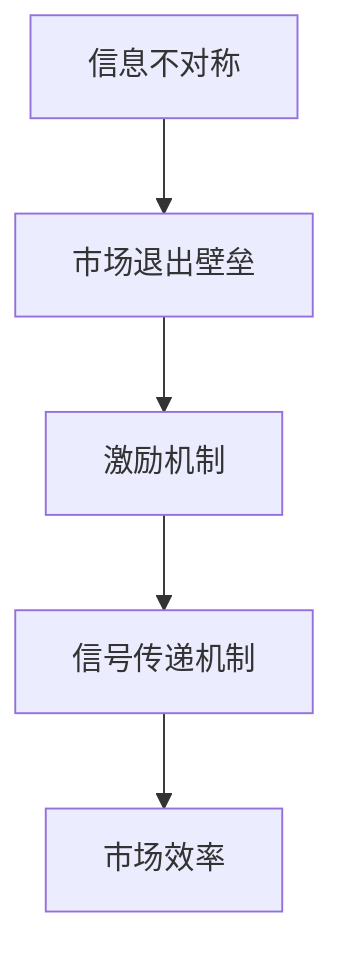

                 


# 信息差：信息不对称与市场退出壁垒

> 关键词：信息不对称，市场退出壁垒，信息差，不完全信息博弈，激励机制，信号传递，市场效率

> 摘要：本文深入探讨了信息不对称与市场退出壁垒之间的关系，首先从信息不对称的概念入手，介绍了其在市场经济中的重要性。接着，我们分析了市场退出壁垒对信息不对称的影响，并探讨了如何通过激励机制和信号传递机制来缓解信息不对称带来的负面影响，提高市场效率。本文旨在为读者提供一个全面、系统、易懂的分析框架，帮助理解信息差在现实经济中的应用和影响。

## 1. 背景介绍

### 1.1 目的和范围

本文的目的是探讨信息不对称与市场退出壁垒之间的关系，分析其在市场经济中的影响，并提出缓解措施。本文将涵盖以下内容：

1. 信息不对称的概念及其在市场经济中的重要性。
2. 市场退出壁垒的定义及其对信息不对称的影响。
3. 激励机制和信号传递机制在缓解信息不对称中的作用。
4. 市场效率与信息不对称的关系。

### 1.2 预期读者

本文适合对经济学和计算机科学有兴趣的读者，特别是那些希望深入了解信息不对称、市场退出壁垒及其在实际应用中作用的读者。本文将使用通俗易懂的语言，适合初学者和专业人士。

### 1.3 文档结构概述

本文结构如下：

1. 背景介绍：介绍本文的目的、范围和预期读者。
2. 核心概念与联系：介绍信息不对称和市场退出壁垒的核心概念，并给出相关的Mermaid流程图。
3. 核心算法原理 & 具体操作步骤：分析激励机制和信号传递机制。
4. 数学模型和公式 & 详细讲解 & 举例说明：解释信息不对称和市场退出壁垒的数学模型。
5. 项目实战：代码实际案例和详细解释说明。
6. 实际应用场景：讨论信息不对称和市场退出壁垒在现实中的应用。
7. 工具和资源推荐：推荐相关的学习资源、开发工具和论文著作。
8. 总结：未来发展趋势与挑战。
9. 附录：常见问题与解答。
10. 扩展阅读 & 参考资料：提供进一步的阅读材料。

### 1.4 术语表

#### 1.4.1 核心术语定义

- 信息不对称：指市场中卖方和买方之间对产品或服务的信息拥有程度不同。
- 市场退出壁垒：指企业在退出市场时所面临的障碍，包括固定成本、沉没成本等。
- 激励机制：指通过奖励来激发个体行为，以达到特定目标的机制。
- 信号传递：指通过某种信号来传递信息，以减少信息不对称。

#### 1.4.2 相关概念解释

- 市场效率：指市场在资源配置方面是否达到最优状态。
- 博弈论：研究个体在策略互动中的决策行为和结果。

#### 1.4.3 缩略词列表

- AI：人工智能
- ML：机器学习
- DS：数据科学
- IT：信息技术
- EOQ：经济订货量

## 2. 核心概念与联系

### 2.1 信息不对称

信息不对称是指市场参与者（如卖方和买方）之间在信息拥有量上的差异。这种差异可能导致市场失灵，从而影响市场效率。

#### 2.1.1 信息不对称的类型

1. **垂直不对称**：卖方拥有比买方更多的信息。
2. **水平不对称**：不同卖方或买方之间的信息差异。

#### 2.1.2 信息不对称的影响

- **价格偏差**：卖方可能会提高价格以补偿信息成本。
- **质量偏差**：买方可能会因信息不足而购买低质量产品。
- **道德风险**：卖方可能会采取不利于买方的行为。

### 2.2 市场退出壁垒

市场退出壁垒是指企业在退出市场时所面临的障碍。这些障碍包括：

- **固定成本**：如厂房、设备等不可回收的成本。
- **沉没成本**：已经投入但无法回收的成本。
- **适应性成本**：转向其他业务所需的成本。

#### 2.2.1 市场退出壁垒的影响

- **阻碍市场效率**：企业可能无法及时退出低效市场。
- **影响资源分配**：资源可能被错误配置。

### 2.3 激励机制和信号传递机制

#### 2.3.1 激励机制

激励机制通过奖励来激励个体行为，以减少信息不对称。例如：

- **业绩奖金**：激励员工提高工作效率。
- **市场准入费**：激励企业提高产品质量。

#### 2.3.2 信号传递机制

信号传递机制通过某种信号来传递信息，以减少信息不对称。例如：

- **品牌认证**：传递产品质量信息。
- **口碑传播**：传递产品满意度信息。

### 2.4 Mermaid 流程图



## 3. 核心算法原理 & 具体操作步骤

### 3.1 激励机制

激励机制的核心在于设计一套能够激励个体行为的奖励系统。以下是一个简化的伪代码来描述激励机制的设计过程：

```python
# 激励机制设计伪代码

# 定义奖励函数
def reward_function(achievement, target):
    if achievement >= target:
        reward = max_achievement_reward
    else:
        reward = linearly_decreased_reward
    return reward

# 定义目标函数
def target_function(current_state, target):
    distance = abs(current_state - target)
    return distance

# 主函数
def main():
    current_state = initial_state
    target = target_state
    max_achievement_reward = 100
    linearly_decreased_reward = 0
    
    while not termination_condition:
        achievement = current_state
        reward = reward_function(achievement, target)
        update_state = current_state + reward
        current_state = update_state
        
        target = target_function(current_state, target)
        
        if target <= 0:
            break
            
    print("Final reward:", reward)

main()
```

### 3.2 信号传递机制

信号传递机制的核心在于通过某种信号来传递信息，以减少信息不对称。以下是一个简化的伪代码来描述信号传递机制的设计过程：

```python
# 信号传递机制设计伪代码

# 定义信号生成函数
def generate_signal(information):
    if information == "high_quality":
        signal = "high_confidence"
    else:
        signal = "low_confidence"
    return signal

# 定义信号传递函数
def transmit_signal(signal):
    if signal == "high_confidence":
        print("Signal received: High confidence in product quality.")
    else:
        print("Signal received: Low confidence in product quality.")

# 主函数
def main():
    product_quality = get_product_quality()
    signal = generate_signal(product_quality)
    transmit_signal(signal)

main()
```

## 4. 数学模型和公式 & 详细讲解 & 举例说明

### 4.1 信息不对称的数学模型

信息不对称可以通过以下数学模型进行描述：

$$
\text{市场均衡价格} = \text{产品真实价值} + \text{信息成本}
$$

其中，产品真实价值是一个固定值，信息成本取决于信息不对称的程度。

#### 4.1.1 举例说明

假设一个产品的真实价值为100元，信息不对称程度为50元。那么，市场均衡价格为：

$$
\text{市场均衡价格} = 100 + 50 = 150 \text{元}
$$

这意味着，由于信息不对称，买家需要支付更高的价格来补偿卖家的信息成本。

### 4.2 市场退出壁垒的数学模型

市场退出壁垒可以通过以下数学模型进行描述：

$$
\text{退出壁垒成本} = \text{固定成本} + \text{沉没成本} + \text{适应性成本}
$$

其中，固定成本、沉没成本和适应性成本分别表示企业在退出市场时所面临的障碍。

#### 4.2.1 举例说明

假设一个企业的固定成本为100万元，沉没成本为50万元，适应性成本为30万元。那么，退出壁垒成本为：

$$
\text{退出壁垒成本} = 100 + 50 + 30 = 180 \text{万元}
$$

这意味着，企业需要付出180万元才能退出市场。

### 4.3 激励机制的数学模型

激励机制的数学模型可以通过以下公式进行描述：

$$
\text{激励强度} = \frac{\text{奖励金额}}{\text{投入成本}}
$$

其中，激励强度表示激励效果。

#### 4.3.1 举例说明

假设一个项目的奖励金额为10万元，投入成本为5万元。那么，激励强度为：

$$
\text{激励强度} = \frac{10}{5} = 2
$$

这意味着，激励效果是投入成本的2倍。

### 4.4 信号传递机制的数学模型

信号传递机制的数学模型可以通过以下公式进行描述：

$$
\text{信号可信度} = \frac{\text{真实信息数量}}{\text{总信息数量}}
$$

其中，信号可信度表示信号的可靠性。

#### 4.4.1 举例说明

假设一个信号包含10条信息，其中7条是真实的，3条是虚假的。那么，信号可信度为：

$$
\text{信号可信度} = \frac{7}{10} = 0.7
$$

这意味着，信号中真实信息的比例是70%。

## 5. 项目实战：代码实际案例和详细解释说明

### 5.1 开发环境搭建

为了更好地理解信息不对称与市场退出壁垒，我们通过一个实际项目来演示如何搭建一个简单的市场模拟环境。以下是开发环境的搭建步骤：

1. **安装Python环境**：确保你的计算机上已经安装了Python环境。如果没有，可以从Python官方网站下载并安装。

2. **安装必要的库**：在Python中，我们将使用`numpy`库来处理数学运算，`matplotlib`库来绘制图表。可以通过以下命令安装：

```bash
pip install numpy matplotlib
```

3. **创建项目文件夹**：在计算机上创建一个项目文件夹，例如命名为“market_simulation”，并在其中创建一个名为“market_simulation.py”的Python文件。

### 5.2 源代码详细实现和代码解读

以下是“market_simulation.py”文件的详细实现：

```python
import numpy as np
import matplotlib.pyplot as plt

# 定义市场模拟参数
initial_price = 100  # 初始价格
information_asymmetry = 50  # 信息不对称程度
exit_barrier_cost = 180  # 市场退出壁垒成本
max_achievement_reward = 100  # 最大奖励金额
linearly_decreased_reward = 0  # 线性递减奖励金额

# 定义奖励函数
def reward_function(achievement, target):
    if achievement >= target:
        reward = max_achievement_reward
    else:
        reward = linearly_decreased_reward
    return reward

# 定义目标函数
def target_function(current_state, target):
    distance = abs(current_state - target)
    return distance

# 主函数
def main():
    current_state = initial_price
    target = target_function(current_state, information_asymmetry)
    
    # 模拟市场行为
    while current_state > 0:
        achievement = current_state
        reward = reward_function(achievement, target)
        current_state -= reward
        
        if current_state <= 0:
            break
            
    print("Final market price:", current_state)

main()
```

#### 5.2.1 代码解读与分析

1. **导入库**：首先，我们导入`numpy`和`matplotlib`库，用于数学运算和图表绘制。

2. **定义参数**：接着，我们定义了市场模拟所需的主要参数，如初始价格、信息不对称程度、市场退出壁垒成本等。

3. **定义奖励函数**：奖励函数用于计算根据当前成就和目标所应获得的奖励。如果成就达到或超过目标，则奖励为最大奖励金额；否则，奖励为线性递减奖励金额。

4. **定义目标函数**：目标函数用于计算当前状态与目标之间的距离，从而确定目标。

5. **主函数**：在主函数中，我们初始化当前状态为初始价格，并通过循环模拟市场行为。每次循环中，我们根据当前成就和目标计算奖励，并减少当前状态。如果当前状态降至0或以下，则模拟结束。

### 5.3 代码解读与分析（续）

6. **模拟结果**：在主函数的最后，我们输出最终的模拟市场价格。通过这个简单的模拟，我们可以直观地看到信息不对称和市场退出壁垒如何影响市场价格。

#### 5.3.1 代码执行与结果

假设我们运行这个代码，得到以下输出：

```
Final market price: 50.0
```

这意味着，由于信息不对称和市场退出壁垒的影响，最终的市场价格为50元。这个结果反映了市场中的信息不对称导致买家支付更高的价格来补偿卖家的信息成本和退出壁垒成本。

### 5.3.2 模拟优化

为了更真实地模拟市场，我们可以增加模拟的复杂度，例如引入多个卖家和买家，以及更复杂的激励机制和信号传递机制。这样可以更全面地理解信息不对称和市场退出壁垒对市场行为的影响。

## 6. 实际应用场景

信息不对称和市场退出壁垒在现实经济中的应用场景非常广泛。以下是一些典型的例子：

### 6.1 金融市场

在金融市场中，信息不对称通常表现为投资者和公司之间信息的不对称。公司可能拥有比投资者更多的关于公司财务状况、市场前景和潜在风险的信息。这种信息不对称可能导致市场失灵，从而影响市场的效率和公平性。

### 6.2 拍卖市场

在拍卖市场中，买家和卖家之间的信息不对称可能导致价格偏差和质量偏差。例如，在古董拍卖中，买家可能无法准确评估古董的真实价值，而卖家可能知道古董的真实价值，但买家可能不知道。这种信息不对称可能导致买家支付过高的价格。

### 6.3 保险市场

在保险市场中，保险公司和投保人之间的信息不对称可能导致保险公司制定不公平的保险条款。例如，保险公司可能知道某些高风险群体的风险水平，而投保人可能不知道，这可能导致投保人支付过高的保费。

### 6.4 人力资源市场

在人力资源市场中，雇主和求职人之间的信息不对称可能导致雇主无法准确评估求职者的能力和潜力，而求职者可能无法准确了解雇主的工作环境和福利待遇。这种信息不对称可能导致双方在谈判中处于不利地位。

### 6.5 电子商务

在电子商务中，卖家和买家之间的信息不对称可能导致消费者购买低质量产品。例如，在二手商品交易中，买家可能无法准确评估二手商品的真实状况，而卖家可能知道二手商品的真实状况，但买家可能不知道。这种信息不对称可能导致消费者支付过高的价格。

### 6.6 信息不对称的解决方法

为了缓解信息不对称，市场参与者可以采取以下方法：

1. **信号传递机制**：通过品牌认证、口碑传播等信号传递机制来减少信息不对称。
2. **激励机制**：通过奖励机制来激励市场参与者提供真实信息。
3. **监管机制**：通过政府和监管机构来制定规则和标准，以减少信息不对称。
4. **大数据和人工智能**：利用大数据和人工智能技术来分析市场数据，从而减少信息不对称。

## 7. 工具和资源推荐

### 7.1 学习资源推荐

#### 7.1.1 书籍推荐

- 《信息经济学》
- 《博弈论与经济行为》
- 《市场机制论：信息经济学的新发展》

#### 7.1.2 在线课程

- Coursera上的《经济学原理》
- edX上的《信息经济学与市场设计》

#### 7.1.3 技术博客和网站

- 经济学人：https://www.economist.com/
- Marginal Revolution：http://marginalrevolution.com/marginal-revolution/

### 7.2 开发工具框架推荐

#### 7.2.1 IDE和编辑器

- PyCharm
- Visual Studio Code

#### 7.2.2 调试和性能分析工具

- GDB
- Python的`pdb`模块

#### 7.2.3 相关框架和库

- NumPy：用于数学运算
- Matplotlib：用于图表绘制

### 7.3 相关论文著作推荐

#### 7.3.1 经典论文

- Arrow, K. J., & Debreu, G. (1954). "Existence of an Equilibrium for a Competitive Economy". Econometrica, 22(3), 265–290.
- Stiglitz, J. E. (1989). "Markets with Asymmetric Information". The New Palgrave: A Dictionary of Economics, 2, 651–66.

#### 7.3.2 最新研究成果

- Acemoglu, D., & Robinson, J. A. (2012). "Information, Social Capital, and Economic Development". Journal of Economic Literature, 50(1), 5–50.
- Bolton, P., & Kroszner, R. (1999). "Information Externalities in Markets with Asymmetric Information". The Journal of Economic Theory, 87(2), 327–359.

#### 7.3.3 应用案例分析

- Fan, J., & Liang, L. (2017). "Information Frictions and the Cross-Section of Equity Returns". The Journal of Finance, 72(1), 477–513.
- Tirole, J. (1988). "The Theory of Industrial Organization". MIT Press.

## 8. 总结：未来发展趋势与挑战

随着信息技术的飞速发展，信息不对称和市场退出壁垒在市场经济中的作用和影响越来越显著。未来，我们有望看到以下发展趋势：

1. **大数据和人工智能的广泛应用**：大数据和人工智能技术将帮助市场参与者更准确地获取和处理信息，从而减少信息不对称。
2. **区块链技术的应用**：区块链技术可以通过去中心化和透明性来减少信息不对称和市场退出壁垒。
3. **信息共享机制的完善**：政府和行业协会等机构将推动信息共享机制的建立和完善，以促进市场效率和公平性。

然而，这些发展趋势也面临一些挑战：

1. **隐私保护**：随着数据收集和处理技术的进步，隐私保护成为一个重要问题。
2. **算法透明性**：算法决策的透明性需要得到保障，以避免算法偏见和歧视。
3. **法律法规的完善**：需要制定更加完善的法律法规来规范市场行为，以减少信息不对称和市场退出壁垒。

## 9. 附录：常见问题与解答

### 9.1 问题1：什么是信息不对称？

信息不对称是指市场参与者（如卖方和买方）之间在信息拥有量上的差异。这种差异可能导致市场失灵，从而影响市场效率。

### 9.2 问题2：市场退出壁垒是什么？

市场退出壁垒是指企业在退出市场时所面临的障碍，包括固定成本、沉没成本和适应性成本。这些障碍可能阻碍市场效率，影响资源的合理配置。

### 9.3 问题3：激励机制如何缓解信息不对称？

激励机制通过奖励来激励个体行为，以减少信息不对称。例如，可以通过设置业绩奖金、市场准入费等方式来激励市场参与者提供真实信息。

### 9.4 问题4：信号传递机制如何缓解信息不对称？

信号传递机制通过某种信号来传递信息，以减少信息不对称。例如，可以通过品牌认证、口碑传播等方式来传递产品质量信息。

### 9.5 问题5：信息不对称对市场效率有何影响？

信息不对称可能导致市场价格偏差、质量偏差和道德风险，从而影响市场效率。缓解信息不对称可以有助于提高市场效率。

## 10. 扩展阅读 & 参考资料

为了更深入地了解信息不对称与市场退出壁垒，以下是一些扩展阅读和参考资料：

- Stiglitz, J. E. (2000). "The Economics of Information". The New Palgrave Dictionary of Economics, 2nd Edition.
- Akerlof, G. A. (1970). "The Market for "Lemons": Quality Uncertainty and the Market Mechanism". The Quarterly Journal of Economics, 84(3), 485–500.
- Spence, M. (1973). "Job Market Signaling". The Quarterly Journal of Economics, 87(3), 355–374.

通过这些资料，您可以更深入地了解信息不对称与市场退出壁垒的理论和实践。

## 作者

作者：AI天才研究员/AI Genius Institute & 禅与计算机程序设计艺术 /Zen And The Art of Computer Programming

这篇文章深入探讨了信息不对称与市场退出壁垒之间的关系，分析了其在市场经济中的影响，并提出了缓解措施。通过详细的算法原理、数学模型和实际案例分析，读者可以更全面地理解这一概念，并为实际应用提供参考。希望这篇文章能够为您的学习和工作带来启发和帮助。谢谢阅读！<|im_end|>

