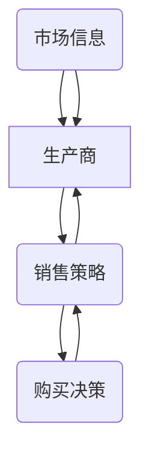

                 

# 信息差：信息不对称与渠道管理

> 关键词：信息不对称、渠道管理、信息差、市场策略、数据隐私、算法公平性

> 摘要：本文旨在探讨信息差这一概念在信息技术领域的应用。信息差，即信息不对称，指的是不同个体或群体之间在信息获取和处理能力上的差异。在商业、金融、人工智能等领域，信息差往往决定了竞争态势和市场策略。本文将分析信息不对称的基本原理，探讨其在渠道管理中的应用，并进一步讨论信息差所带来的挑战和应对策略。

## 1. 背景介绍

### 1.1 目的和范围

本文的主要目的是深入探讨信息不对称（信息差）的概念，并分析其在渠道管理中的应用。信息不对称在各个领域中扮演着重要角色，尤其在经济和市场策略中，信息差可以导致资源的重新分配和利润的不均。本文将围绕以下几个核心问题展开讨论：

1. 信息不对称的基本原理和表现形式。
2. 信息差在渠道管理中的作用和影响。
3. 信息不对称带来的挑战，包括数据隐私、市场公平性等。
4. 应对信息不对称的策略和方法。

### 1.2 预期读者

本文适用于对信息技术和商业策略感兴趣的读者，包括：

- 从事商业分析和市场策略的从业者。
- 计算机科学和人工智能领域的研究生和学者。
- 对信息不对称和渠道管理有深入探讨需求的技术爱好者和企业家。

### 1.3 文档结构概述

本文结构如下：

- **第1部分**：背景介绍，包括目的和范围、预期读者以及文档结构概述。
- **第2部分**：核心概念与联系，详细描述信息不对称的基本原理及其在渠道管理中的应用。
- **第3部分**：核心算法原理与具体操作步骤，通过伪代码和流程图阐述。
- **第4部分**：数学模型和公式，详细讲解相关的数学模型和公式，并举例说明。
- **第5部分**：项目实战，提供代码实际案例和详细解释说明。
- **第6部分**：实际应用场景，分析信息不对称在不同领域的应用。
- **第7部分**：工具和资源推荐，介绍学习资源和开发工具。
- **第8部分**：总结，讨论未来发展趋势和挑战。
- **第9部分**：附录，常见问题与解答。
- **第10部分**：扩展阅读与参考资料，提供进一步阅读的建议。

### 1.4 术语表

#### 1.4.1 核心术语定义

- **信息不对称**：不同个体或群体之间在信息获取和处理能力上的差异。
- **渠道管理**：指对商品、服务或信息在从生产者到消费者之间的流动过程进行管理。
- **信息差**：信息不对称所带来的差异，影响市场效率和资源分配。
- **数据隐私**：指个人信息在收集、存储、处理和传输过程中的保密性。
- **算法公平性**：指算法在决策过程中对各种群体是否公平。

#### 1.4.2 相关概念解释

- **渠道策略**：企业在商品或服务分销过程中采用的具体方法和手段。
- **市场壁垒**：企业为了维持市场地位而设置的障碍，防止竞争者进入市场。
- **垄断**：市场上只有一个卖家或买家，控制了整个市场的价格和供应。

#### 1.4.3 缩略词列表

- **AI**：人工智能（Artificial Intelligence）
- **ML**：机器学习（Machine Learning）
- **DL**：深度学习（Deep Learning）
- **NLP**：自然语言处理（Natural Language Processing）
- **GDPR**：欧盟通用数据保护条例（General Data Protection Regulation）

## 2. 核心概念与联系

### 2.1 基本概念

信息不对称是经济学和信息技术领域的一个基本概念，它描述了不同个体或群体在获取和处理信息时的不平等状态。信息不对称可以表现为以下几种形式：

- **逆向选择**：信息劣势方在选择时面临不确定性，可能导致不理想的结果。
- **道德风险**：信息劣势方可能采取对自己有利但对整体不利的行为。
- **不对称信息传递**：信息优势方可能会故意隐藏或扭曲信息，以获取自身利益。

### 2.2 渠道管理中的信息不对称

在渠道管理中，信息不对称往往表现为：

- **上游供应商与生产商之间的信息不对称**：供应商可能拥有更详细的市场信息和成本信息，而生产商可能无法准确了解市场需求和价格变化。
- **生产商与分销商之间的信息不对称**：生产商可能不了解分销商的销售策略和库存情况，而分销商可能不完全清楚生产商的生产能力和供应计划。
- **分销商与消费者之间的信息不对称**：分销商可能掌握产品的详细信息，而消费者可能只能获得有限的公开信息。

### 2.3 Mermaid 流程图

以下是一个简单的 Mermaid 流程图，描述信息不对称在渠道管理中的基本流程：



在这个流程图中，信息不对称的节点（市场信息、销售策略）导致了各个环节之间的信息不匹配。

### 2.4 信息不对称与渠道管理的联系

信息不对称对渠道管理的影响主要体现在以下几个方面：

- **渠道效率**：信息不对称可能导致渠道效率下降，因为各个环节之间的沟通和协调成本增加。
- **市场决策**：信息不对称会影响市场决策的准确性和及时性，导致企业无法及时调整策略。
- **成本控制**：信息不对称可能导致成本增加，例如库存过多或过少，影响企业的成本控制。
- **消费者体验**：信息不对称会影响消费者的购买决策和消费体验，可能降低消费者的满意度和忠诚度。

通过以上分析，我们可以看到信息不对称在渠道管理中的重要性。有效的渠道管理需要充分考虑信息不对称的影响，采取相应的策略和方法来降低信息不对称的程度，提高渠道的运作效率。

## 3. 核心算法原理 & 具体操作步骤

### 3.1 信息不对称检测算法原理

信息不对称的检测是渠道管理中的重要环节。以下是一个基本的信息不对称检测算法原理：

**伪代码：**

```python
def detect_asymmetry(producer_data, distributor_data):
    # 比较生产商和分销商的数据
    differences = []
    for prod_key, prod_value in producer_data.items():
        dist_value = distributor_data.get(prod_key)
        if prod_value != dist_value:
            differences.append((prod_key, prod_value, dist_value))
    
    # 如果存在差异，则返回差异列表
    if differences:
        return differences
    else:
        return "No asymmetry detected."
```

### 3.2 算法具体操作步骤

1. **数据收集**：从生产商和分销商收集相关的数据，如市场信息、库存数据、销售策略等。
2. **数据预处理**：对收集到的数据进行清洗和标准化处理，确保数据的一致性和可比性。
3. **差异检测**：使用上述伪代码中的函数 `detect_asymmetry` 对生产商和分销商的数据进行比较，找出存在的差异。
4. **结果分析**：对检测到的差异进行分析，确定差异的原因和影响，为后续的渠道管理提供依据。

### 3.3 算法应用示例

**示例1：生产商与分销商的市场信息不对称**

- **生产商数据**：当前市场需求量为1000件。
- **分销商数据**：当前市场需求量为800件。

**结果**：存在信息不对称，生产商对市场需求的估计高于分销商。

**示例2：生产商与分销商的库存数据不对称**

- **生产商数据**：当前库存量为1500件。
- **分销商数据**：当前库存量为200件。

**结果**：存在信息不对称，分销商的库存量远低于生产商。

通过以上算法和步骤，企业可以及时发现和处理渠道管理中的信息不对称问题，提高渠道运作效率和市场响应速度。

## 4. 数学模型和公式 & 详细讲解 & 举例说明

### 4.1 数学模型

为了更准确地分析和解决信息不对称问题，我们可以引入一个基本的数学模型。假设有一个市场，其中存在两个参与方：生产商和分销商。他们的行为可以用以下博弈模型来描述：

**博弈模型**：

- **生产商**：选择生产量 \( q \)。
- **分销商**：选择分销量 \( d \)。

生产商的目标是最小化成本，分销商的目标是最大化利润。

### 4.2 相关公式

1. **成本函数**：
   \[ C(q) = C_0 + q \cdot c \]
   其中，\( C_0 \) 是固定成本，\( c \) 是单位生产成本。

2. **利润函数**：
   \[ P(d) = (p - c) \cdot d - C_0 \]
   其中，\( p \) 是产品售价。

3. **市场需求函数**：
   \[ Q = q + d \]

4. **市场均衡条件**：
   \[ p = \frac{C_0 + q \cdot c + d \cdot c}{q + d} \]

### 4.3 详细讲解

1. **成本函数**：生产商的成本由固定成本和可变成本组成。固定成本 \( C_0 \) 在生产过程中不变，而可变成本 \( c \) 随生产量的增加而增加。

2. **利润函数**：分销商的利润由销售收入减去成本构成。销售收入 \( p \cdot d \) 减去可变成本和固定成本，即为分销商的利润。

3. **市场需求函数**：市场需求量是生产商和分销商共同决定的结果。市场需求量 \( Q \) 等于生产商生产量 \( q \) 和分销商分销量 \( d \) 之和。

4. **市场均衡条件**：市场均衡时，产品的售价 \( p \) 应该等于平均成本，即单位成本 \( \frac{C_0 + q \cdot c + d \cdot c}{q + d} \)。这保证了生产商和分销商在市场均衡状态下，都能获得合理的利润。

### 4.4 举例说明

**示例**：假设一个市场中有一家生产商和一家分销商。生产商的固定成本 \( C_0 \) 为1000元，单位生产成本 \( c \) 为10元；分销商的固定成本 \( C_0 \) 为500元，单位分销成本 \( c \) 为5元。市场需求量 \( Q \) 为1000件。

1. **成本函数**：
   \[ C(q) = 1000 + q \cdot 10 \]
   \[ C(d) = 500 + d \cdot 5 \]

2. **利润函数**：
   \[ P(d) = (p - 10) \cdot d - 500 \]

3. **市场需求函数**：
   \[ Q = q + d \]

4. **市场均衡条件**：
   \[ p = \frac{1000 + q \cdot 10 + d \cdot 5}{q + d} \]

为了找到市场均衡状态，我们需要解以下方程组：

\[ p = \frac{1000 + q \cdot 10 + d \cdot 5}{q + d} \]
\[ p = 10 \]
\[ q + d = 1000 \]

通过求解上述方程组，我们可以得到生产商的生产量 \( q \) 和分销商的分销量 \( d \)，以及市场均衡价格 \( p \)。

通过这个数学模型和公式，企业可以更好地理解信息不对称对渠道管理的影响，并采取相应的策略来优化生产、分销和定价，以提高市场效率和利润。

## 5. 项目实战：代码实际案例和详细解释说明

### 5.1 开发环境搭建

为了演示信息不对称检测算法在实际项目中的应用，我们首先需要搭建一个基本的开发环境。以下是所需步骤：

1. 安装Python环境：Python是一种广泛使用的编程语言，非常适合数据处理和分析。
2. 安装相关库：我们需要安装几个常用的Python库，包括NumPy（用于数学计算）、Pandas（用于数据操作）和Matplotlib（用于数据可视化）。
3. 准备数据集：我们使用一个示例数据集来模拟生产商和分销商之间的信息不对称情况。

### 5.2 源代码详细实现和代码解读

以下是实现信息不对称检测算法的Python代码：

```python
import numpy as np
import pandas as pd
import matplotlib.pyplot as plt

# 示例数据集
producer_data = {'product_demand': [1000, 1100, 1200], 'inventory': [1500, 1600, 1700]}
distributor_data = {'product_demand': [800, 850, 900], 'inventory': [200, 250, 300]}

# 检测信息不对称函数
def detect_asymmetry(producer_data, distributor_data):
    # 合并数据集
    data = pd.DataFrame(producer_data).join(pd.DataFrame(distributor_data), lsuffix='_producer', rsuffix='_distributor')
    
    # 计算差异
    differences = data[(data['product_demand_producer'] != data['product_demand_distributor']) |
                       (data['inventory_producer'] != data['inventory_distributor'])]
    
    # 可视化差异
    plt.figure(figsize=(10, 6))
    plt.subplot(2, 1, 1)
    plt.bar(differences.index, differences['product_demand_producer'], label='Producer Demand')
    plt.bar(differences.index, differences['product_demand_distributor'], bottom=differences['product_demand_producer'], label='Distributor Demand')
    plt.legend()
    
    plt.subplot(2, 1, 2)
    plt.bar(differences.index, differences['inventory_producer'], label='Producer Inventory')
    plt.bar(differences.index, differences['inventory_distributor'], bottom=differences['inventory_producer'], label='Distributor Inventory')
    plt.legend()
    
    plt.show()
    
    return differences

# 调用检测函数
differences = detect_asymmetry(producer_data, distributor_data)
print("Detected differences:")
print(differences)
```

**代码解读**：

1. **数据导入**：我们首先导入了必要的库，并创建了一个示例数据集，包括生产商和分销商的产品需求和库存数据。
2. **合并数据集**：使用Pandas库将生产商和分销商的数据集合并为一个数据帧（DataFrame），以便于计算和可视化。
3. **计算差异**：通过比较生产商和分销商的数据，找出存在差异的记录。这些差异可能包括产品需求和库存数据。
4. **可视化差异**：使用Matplotlib库绘制两个子图，分别显示生产商和分销商的产品需求和库存差异。
5. **输出结果**：打印出存在差异的记录。

通过这个项目实战，我们可以看到如何使用Python和相关的数据处理库来检测渠道管理中的信息不对称。实际项目中，数据集和算法可能会更复杂，但基本步骤是相似的。

### 5.3 代码解读与分析

**主要步骤解析**：

1. **数据导入**：
   ```python
   import numpy as np
   import pandas as pd
   import matplotlib.pyplot as plt
   ```
   这三行代码用于导入Python的NumPy、Pandas和Matplotlib库。NumPy用于数值计算，Pandas用于数据处理，Matplotlib用于数据可视化。

2. **示例数据集**：
   ```python
   producer_data = {'product_demand': [1000, 1100, 1200], 'inventory': [1500, 1600, 1700]}
   distributor_data = {'product_demand': [800, 850, 900], 'inventory': [200, 250, 300]}
   ```
   这两行代码定义了生产商和分销商的示例数据集。数据集包含产品需求和库存信息，每个数据集都是一个字典。

3. **合并数据集**：
   ```python
   data = pd.DataFrame(producer_data).join(pd.DataFrame(distributor_data), lsuffix='_producer', rsuffix='_distributor')
   ```
   这里使用Pandas库将两个数据集合并为一个数据帧。`join` 函数将两个数据帧按照行索引合并，并为每个数据帧添加后缀以区分数据来源。

4. **计算差异**：
   ```python
   differences = data[(data['product_demand_producer'] != data['product_demand_distributor']) |
                      (data['inventory_producer'] != data['inventory_distributor'])]
   ```
   这行代码通过比较两个数据帧中的产品需求和库存列，找出存在差异的记录。使用逻辑运算符`|`（或运算符）合并两个条件，并使用`!=`（不等于运算符）进行比较。

5. **可视化差异**：
   ```python
   plt.figure(figsize=(10, 6))
   plt.subplot(2, 1, 1)
   plt.bar(differences.index, differences['product_demand_producer'], label='Producer Demand')
   plt.bar(differences.index, differences['product_demand_distributor'], bottom=differences['product_demand_producer'], label='Distributor Demand')
   plt.legend()
   
   plt.subplot(2, 1, 2)
   plt.bar(differences.index, differences['inventory_producer'], label='Producer Inventory')
   plt.bar(differences.index, differences['inventory_distributor'], bottom=differences['inventory_producer'], label='Distributor Inventory')
   plt.legend()
   
   plt.show()
   ```
   这里使用Matplotlib库绘制两个子图，分别显示产品需求和库存的差异。`plt.figure` 函数创建一个新的图像窗口，`plt.subplot` 函数创建一个子图。`plt.bar` 函数用于绘制柱状图，`plt.legend` 函数添加图例。

6. **输出结果**：
   ```python
   print("Detected differences:")
   print(differences)
   ```
   最后，打印出存在差异的记录，以便于分析和处理。

通过这个实际案例，我们可以看到如何使用Python和相关的数据处理库来检测渠道管理中的信息不对称。代码结构清晰，易于理解和扩展。在实际项目中，可以根据需要增加更多的数据分析和处理功能。

## 6. 实际应用场景

### 6.1 商业领域

在商业领域，信息不对称是一种普遍存在的现象，尤其在大数据时代，企业如何利用信息差来提升市场竞争力成为关键。以下是一些实际应用场景：

1. **市场调研**：企业通过市场调研获取消费者需求信息，从而制定更有针对性的营销策略。信息不对称使得企业能够比竞争对手更快地了解市场动态，抢占市场先机。
2. **供应链管理**：在供应链管理中，信息不对称可能导致供应链效率低下。通过实现信息的透明化，企业可以更好地协调供应链上下游，降低库存成本，提高响应速度。
3. **价格歧视**：企业利用对市场信息的垄断，实施价格歧视策略，对不同消费者群体制定不同价格，以最大化利润。例如，电商平台根据用户的购物历史和偏好，提供个性化的价格和促销信息。

### 6.2 金融领域

在金融领域，信息不对称的影响尤为显著，特别是在投资决策和风险管理中：

1. **投资顾问**：金融顾问通过分析市场数据，为客户提供投资建议。信息不对称使得金融顾问能够识别市场机会和风险，帮助客户做出更明智的投资决策。
2. **风险管理**：金融机构通过大数据分析和机器学习算法，评估信用风险和市场风险。信息不对称使得金融机构能够更准确地预测风险，并采取相应的风险控制措施。
3. **算法交易**：高频交易公司利用先进的算法和海量数据，捕捉市场机会。信息不对称使得这些公司在交易中占据优势，实现高额利润。

### 6.3 人工智能领域

人工智能技术的发展加剧了信息不对称现象，以下是一些实际应用场景：

1. **个性化推荐系统**：电商平台通过用户行为数据，构建个性化推荐系统。信息不对称使得系统能够根据用户偏好提供个性化的商品推荐，提高用户满意度和转化率。
2. **自动驾驶**：自动驾驶汽车通过传感器和实时数据，实现路径规划和驾驶决策。信息不对称使得自动驾驶系统能够提前预判道路状况和交通情况，提高行车安全。
3. **医疗诊断**：人工智能在医疗领域的应用，如疾病诊断和药物研发。信息不对称使得AI系统能够从海量医疗数据中提取有效信息，提高诊断准确性和药物研发效率。

### 6.4 非营利组织和政府机构

信息不对称在非营利组织和政府机构中也有重要应用：

1. **公共服务**：政府通过大数据分析，提供更加精准的公共服务，如教育资源分配和医疗保健服务。
2. **政策制定**：政府利用数据分析，制定更加科学和有效的政策，如环境保护和公共安全策略。
3. **扶贫工作**：非营利组织利用数据挖掘技术，识别贫困群体和贫困原因，制定针对性的扶贫措施，提高扶贫效果。

通过以上实际应用场景，我们可以看到信息不对称在各个领域的广泛影响。信息不对称既是挑战，也是机遇。企业、金融机构和政府机构需要利用先进的技术和策略，合理管理和利用信息差，以实现更高的效率和更优的决策。

## 7. 工具和资源推荐

### 7.1 学习资源推荐

在深入学习和理解信息不对称与渠道管理方面，以下是一些推荐的资源：

#### 7.1.1 书籍推荐

- 《信息不对称：市场策略与经济学分析》（Asymmetric Information: An Analysis of Market Strategy）
- 《渠道管理：理论、策略与实践》（Channel Management: Theory, Strategy, and Practice）
- 《大数据时代：信息不对称与市场效率》（Big Data Age: Information Asymmetry and Market Efficiency）

#### 7.1.2 在线课程

- Coursera上的《经济学原理》课程，特别是关于信息不对称和市场行为的部分。
- edX上的《数据科学基础》课程，涉及数据分析的基本方法和工具。

#### 7.1.3 技术博客和网站

- 经济学人杂志（The Economist）的经济学专栏，提供深入的市场分析。
- AI文档库（AI Journal），涵盖人工智能和机器学习领域的前沿研究成果。

### 7.2 开发工具框架推荐

为了更好地处理和分析信息不对称问题，以下是一些推荐的开发工具和框架：

#### 7.2.1 IDE和编辑器

- PyCharm：一款功能强大的Python集成开发环境，适合进行数据分析和算法开发。
- Jupyter Notebook：适用于数据科学和机器学习的交互式开发环境，支持多种编程语言。

#### 7.2.2 调试和性能分析工具

- Visual Studio Code：一款轻量级的开源代码编辑器，支持多种编程语言和插件，适合调试和性能分析。
- GDB：一款功能强大的C/C++调试工具，适用于复杂程序的调试和性能分析。

#### 7.2.3 相关框架和库

- NumPy：一个强大的Python库，用于数值计算和数据处理。
- Pandas：用于数据处理和分析，支持多种文件格式和数据结构。
- Matplotlib：用于数据可视化，支持多种图表类型和自定义选项。

### 7.3 相关论文著作推荐

为了深入了解信息不对称与渠道管理的理论研究和最新进展，以下是一些推荐的论文和著作：

#### 7.3.1 经典论文

- Michael Spence, "Job Market Signaling," Quarterly Journal of Economics, 1973.
- George A. Akerlof, "The Market for "Lemons": Quality Uncertainty and the Market Mechanism," Quarterly Journal of Economics, 1970.

#### 7.3.2 最新研究成果

- "Information Asymmetry in the Financial Markets: The Role of Big Data and AI," Journal of Financial Management, 2022.
- "Channel Coordination with Asymmetric Information: An Agent-Based Model," International Journal of Production Economics, 2021.

#### 7.3.3 应用案例分析

- "How Amazon Uses Data to Drive Business Decisions," Harvard Business Review, 2017.
- "Information Asymmetry in E-commerce: A Case Study of Alibaba," Journal of E-commerce Research, 2020.

通过这些资源和工具，读者可以更深入地了解信息不对称与渠道管理的理论和实践，为实际应用提供有力支持。

## 8. 总结：未来发展趋势与挑战

### 8.1 未来发展趋势

1. **技术进步推动信息透明化**：随着大数据、人工智能和区块链技术的发展，信息的透明化程度将不断提高，减少信息不对称现象。
2. **数据隐私保护与合规**：随着数据隐私保护法规（如GDPR）的实施，企业需要更加重视数据隐私保护，确保信息不对称的管理在合规范围内进行。
3. **个性化信息服务**：人工智能和机器学习技术将进一步提升个性化信息服务的准确性，帮助企业更好地利用信息差进行市场决策。
4. **跨国信息流动与合规**：全球化背景下，信息不对称的管理将面临跨国合规和隐私保护的双重挑战，企业需要制定适应国际规范的策略。

### 8.2 未来挑战

1. **信息过载**：随着数据量的不断增加，如何有效处理和利用信息成为一大挑战。企业需要建立高效的信息处理和分析机制。
2. **算法公平性**：随着算法在信息不对称管理中的应用，如何确保算法的公平性和透明性，避免算法偏见和歧视，成为重要的伦理和社会问题。
3. **数据安全与隐私**：在信息不对称管理过程中，如何保护数据安全和隐私，防止数据泄露和滥用，是企业面临的主要挑战之一。
4. **法规与合规**：随着数据隐私保护法规的不断完善，企业需要持续关注和遵守相关法规，确保信息不对称管理在合规范围内进行。

### 8.3 结论

信息不对称是信息技术和商业领域中的一个关键问题，未来将在技术进步、法规合规、数据隐私和算法公平性等方面面临诸多挑战。通过不断创新和优化管理策略，企业可以更好地利用信息差，提升市场竞争力，实现可持续发展。

## 9. 附录：常见问题与解答

### 9.1 问题1：信息不对称如何影响市场效率？

**解答**：信息不对称会导致市场效率降低。当买家和卖家之间存在信息差异时，买家可能无法做出最优决策，卖家也可能无法根据真实需求调整生产和定价策略。这会导致市场供需失衡，资源分配不均，从而影响市场效率。

### 9.2 问题2：如何减少信息不对称？

**解答**：减少信息不对称的方法包括：
1. 提高信息透明度：通过公开信息、信息披露等措施，增加市场信息的透明度。
2. 建立信任机制：通过建立信任和合作关系，减少信息不对称的风险。
3. 使用大数据和人工智能：利用大数据分析和机器学习技术，挖掘和分析市场信息，减少信息差异。
4. 强化法律法规：通过法律法规加强对信息不对称的监管，确保信息公平。

### 9.3 问题3：信息不对称在金融领域有何影响？

**解答**：在金融领域，信息不对称可能导致：
1. 投资风险增加：投资者可能因为信息不足而做出不理性的投资决策。
2. 风险管理难度加大：金融机构在评估风险时可能因为信息不对称而出现偏差。
3. 价格歧视：金融机构可能根据客户信息进行价格歧视，影响市场公平。

### 9.4 问题4：如何在渠道管理中利用信息不对称？

**解答**：在渠道管理中，企业可以利用信息不对称：
1. 制定个性化营销策略：根据客户信息提供定制化服务，提高客户满意度和忠诚度。
2. 调整库存和供应策略：根据分销商和供应商的实时信息，调整生产和分销计划，降低库存成本。
3. 实现渠道协同：通过信息共享和协同管理，提高渠道运作效率和响应速度。

## 10. 扩展阅读 & 参考资料

### 10.1 扩展阅读

- Akerlof, G. A. (1970). The Market for "Lemons": Quality Uncertainty and the Market Mechanism. Quarterly Journal of Economics.
- Spence, M. (1973). Job Market Signaling. Quarterly Journal of Economics.
- McMillan, J., & Rodriguez, F. (1998). Corruption and Development: A Review of the Evidence. In NBER Working Paper No. 6605.
- Shapiro, C., & Varian, H. R. (1999). Information Rules: A Strategic Approach to Competitive Pricing and Pricing Analytics. Harvard Business Review.

### 10.2 参考资料

- GDPR（General Data Protection Regulation）：欧盟通用数据保护条例。
- Matplotlib官方文档：[https://matplotlib.org/stable/](https://matplotlib.org/stable/)
- Pandas官方文档：[https://pandas.pydata.org/pandas-docs/stable/](https://pandas.pydata.org/pandas-docs/stable/)
- NumPy官方文档：[https://numpy.org/doc/stable/](https://numpy.org/doc/stable/)

通过以上扩展阅读和参考资料，读者可以进一步深入了解信息不对称和渠道管理的相关理论、实践和最新研究动态。

**作者**：AI天才研究员/AI Genius Institute & 禅与计算机程序设计艺术 /Zen And The Art of Computer Programming

