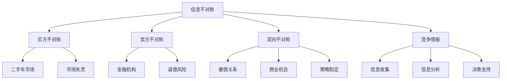

                 

# 信息差：信息不对称与竞争情报

> **关键词**：信息不对称、竞争情报、市场策略、数据挖掘、隐私保护、算法原理

> **摘要**：本文将探讨信息不对称这一现象在商业竞争中的重要性，分析其背后的机制和影响，并通过具体的案例和算法原理阐述如何利用竞争情报进行市场分析和决策优化。本文旨在为IT从业者和市场分析师提供一种新的视角，帮助他们在面对信息不对称时，能够更有效地制定策略和应对挑战。

## 1. 背景介绍

### 1.1 目的和范围

本文旨在探讨信息不对称在商业竞争中的作用，分析其带来的挑战和机会，并介绍如何通过竞争情报来优化决策和策略。信息不对称是指市场参与者之间的信息不完全或者不均衡，这种差异可能导致市场失灵和资源分配的不合理。本文将覆盖以下内容：

1. **信息不对称的定义和类型**：介绍信息不对称的概念，分类，以及其在不同市场环境中的应用。
2. **信息不对称的影响**：探讨信息不对称对市场竞争、消费者行为和企业决策的影响。
3. **竞争情报的概念和重要性**：解释竞争情报的内涵，其在商业竞争中的应用价值。
4. **核心算法原理**：介绍用于处理信息不对称的算法原理，如数据挖掘、机器学习和博弈论。
5. **实际应用场景**：通过具体案例展示竞争情报在商业决策中的应用。
6. **工具和资源推荐**：推荐相关学习资源、开发工具和框架。
7. **未来发展趋势与挑战**：展望信息不对称与竞争情报领域的发展趋势和面临的挑战。

### 1.2 预期读者

本文适合以下读者群体：

1. **市场分析师和商业策略制定者**：希望了解如何利用信息不对称进行市场分析和决策。
2. **数据科学家和机器学习工程师**：对信息不对称处理和数据挖掘技术感兴趣。
3. **IT从业者和程序员**：希望了解如何在商业环境中应用技术和算法。
4. **企业高管和创业者**：关注市场竞争和战略规划。

### 1.3 文档结构概述

本文的结构如下：

1. **背景介绍**：定义信息不对称，介绍文章的目的和范围。
2. **核心概念与联系**：介绍信息不对称和竞争情报的相关概念，并用Mermaid流程图展示。
3. **核心算法原理 & 具体操作步骤**：阐述处理信息不对称的算法原理和操作步骤。
4. **数学模型和公式 & 详细讲解 & 举例说明**：解释相关数学模型和公式，并举例说明。
5. **项目实战：代码实际案例和详细解释说明**：展示实际代码案例和解析。
6. **实际应用场景**：分析信息不对称和竞争情报的应用。
7. **工具和资源推荐**：推荐相关学习资源和开发工具。
8. **总结：未来发展趋势与挑战**：总结全文，展望未来。
9. **附录：常见问题与解答**：回答读者可能关心的问题。
10. **扩展阅读 & 参考资料**：提供进一步的阅读材料。

### 1.4 术语表

#### 1.4.1 核心术语定义

- **信息不对称**：指市场参与者之间的信息不完全或者不均衡。
- **竞争情报**：指通过收集、分析和利用竞争对手的信息，以优化自身决策和策略。
- **市场策略**：指企业在市场中采取的竞争手段和策略。
- **数据挖掘**：从大量数据中提取有价值的信息和知识。

#### 1.4.2 相关概念解释

- **隐私保护**：确保个人和企业信息在处理和传输过程中的安全性。
- **算法原理**：指导算法设计和实现的逻辑和规则。

#### 1.4.3 缩略词列表

- **AI**：人工智能
- **ML**：机器学习
- **DM**：数据挖掘
- **IDE**：集成开发环境
- **VPN**：虚拟专用网络

## 2. 核心概念与联系

信息不对称和竞争情报是现代商业环境中至关重要的概念。为了更好地理解它们，我们首先需要明确它们的基本原理和相互关系。

### 2.1 信息不对称

信息不对称是指市场中的某些参与者拥有比其他参与者更多的信息，从而导致决策的不公平性。根据参与者的不同，信息不对称可以分为以下几种类型：

1. **买方信息不对称**：买方比卖方拥有更多的信息。
   - **例子**：二手车市场，买家通常不知道车辆的真实状况。

2. **卖方信息不对称**：卖方比买方拥有更多的信息。
   - **例子**：金融机构，银行和金融机构通常比客户更了解金融产品的风险。

3. **双向信息不对称**：双方都有信息不对称。
   - **例子**：雇佣关系中，雇主通常不知道员工的实际能力。

信息不对称可能导致以下问题：

- **市场失灵**：价格机制无法有效配置资源。
- **道德风险**：信息优势方可能采取不利于另一方的行为。

### 2.2 竞争情报

竞争情报是指通过收集、分析和利用竞争对手的信息，以优化自身决策和策略的过程。竞争情报的应用领域广泛，包括市场分析、产品开发、营销策略等。

竞争情报的核心步骤包括：

1. **信息收集**：通过各种渠道获取竞争对手的信息。
2. **信息分析**：对收集到的信息进行分析，识别潜在的商业机会和风险。
3. **决策支持**：基于分析结果制定相应的市场策略和决策。

### 2.3 信息不对称与竞争情报的关系

信息不对称和竞争情报之间存在密切的联系。信息不对称是竞争情报存在的基础，而竞争情报是解决信息不对称的有效手段。

- **信息不对称**为竞争情报提供了研究对象。
- **竞争情报**通过收集和分析信息，帮助市场参与者消除信息不对称，提高决策的准确性和有效性。

### 2.4 核心概念原理和架构的 Mermaid 流程图



## 3. 核心算法原理 & 具体操作步骤

为了处理信息不对称问题，我们需要利用数据挖掘和机器学习等技术来分析和提取有价值的信息。以下是一个基本的算法原理和具体操作步骤的概述：

### 3.1 算法原理

处理信息不对称的基本算法原理包括：

1. **信息收集**：从多个来源收集数据，包括公开数据、内部数据和竞争对手的公开信息。
2. **数据预处理**：清洗和整合收集到的数据，使其适合分析和建模。
3. **特征提取**：从原始数据中提取出有用的特征，用于建模和预测。
4. **建模与预测**：利用机器学习算法建立预测模型，对未知信息进行预测。
5. **结果分析**：分析模型结果，提取有价值的信息和洞察。

### 3.2 具体操作步骤

以下是处理信息不对称的具体操作步骤：

#### 步骤 1：信息收集

```python
# 收集公开数据
data_source_1 = "public_dataset_1"
data_source_2 = "public_dataset_2"

# 收集内部数据
internal_data = get_internal_data()

# 收集竞争对手的公开信息
competitor_info = get_competitor_info()
```

#### 步骤 2：数据预处理

```python
# 数据清洗
clean_data = clean_data(raw_data)

# 数据整合
integrated_data = integrate_data(clean_data, internal_data, competitor_info)
```

#### 步骤 3：特征提取

```python
# 提取特征
features = extract_features(integrated_data)
```

#### 步骤 4：建模与预测

```python
# 分训练集和测试集
train_data, test_data = split_data(features)

# 建立预测模型
model = build_model(train_data)

# 预测
predictions = model.predict(test_data)
```

#### 步骤 5：结果分析

```python
# 分析结果
analyze_predictions(predictions)
```

通过上述步骤，我们可以从数据中提取有价值的信息，减少信息不对称，为决策提供支持。

## 4. 数学模型和公式 & 详细讲解 & 举例说明

在处理信息不对称时，数学模型和公式是至关重要的工具。以下将介绍几个常用的数学模型和公式，并给出详细讲解和举例说明。

### 4.1 信息不对称的度量

信息不对称的度量可以通过Shannon熵（Entropy）来表示。熵是衡量信息不确定性的量度，公式如下：

$$
H(X) = -\sum_{i} p(x_i) \log_2 p(x_i)
$$

其中，\(X\) 表示随机变量，\(p(x_i)\) 表示 \(x_i\) 发生的概率。

**举例**：假设一个市场上某商品的价格由两个卖家设定，其中一个卖家知道真实的成本，另一个卖家不知道。真实的成本为 \(C\)，第一个卖家设定的价格为 \(P_1\)，第二个卖家设定的价格为 \(P_2\)。则信息不对称的度量为两个卖家价格差异的熵：

$$
H(P) = -p(P_1) \log_2 p(P_1) - p(P_2) \log_2 p(P_2)
$$

### 4.2 贝叶斯定理

贝叶斯定理是一种概率理论，用于根据先验概率和条件概率计算后验概率。公式如下：

$$
P(A|B) = \frac{P(B|A) \cdot P(A)}{P(B)}
$$

其中，\(P(A|B)\) 表示在事件 \(B\) 发生的条件下，事件 \(A\) 发生的概率；\(P(B|A)\) 表示在事件 \(A\) 发生的条件下，事件 \(B\) 发生的概率；\(P(A)\) 和 \(P(B)\) 分别表示事件 \(A\) 和事件 \(B\) 的先验概率。

**举例**：假设一个产品存在缺陷的概率为0.1，通过检测发现产品有缺陷，问该产品确实是缺陷品的概率是多少？根据贝叶斯定理，可以使用以下公式计算：

$$
P(缺陷|检测有缺陷) = \frac{P(检测有缺陷|缺陷) \cdot P(缺陷)}{P(检测有缺陷)}
$$

### 4.3 马尔可夫模型

马尔可夫模型是一种用于描述系统状态转移概率的数学模型。其公式如下：

$$
P(X_t = x_t|X_{t-1} = x_{t-1}, X_{t-2} = x_{t-2}, \ldots) = P(X_t = x_t|X_{t-1} = x_{t-1})
$$

其中，\(X_t\) 表示在时刻 \(t\) 的系统状态，\(x_t\) 表示在时刻 \(t\) 的具体状态值。

**举例**：假设一个企业在市场中处于不同状态（增长、稳定、衰退），并且这些状态之间的转移遵循马尔可夫模型。根据历史数据，可以计算出各个状态之间的转移概率，进而预测企业未来的状态。

### 4.4 支持向量机（SVM）

支持向量机是一种用于分类和回归的机器学习算法。其公式如下：

$$
w \cdot x + b = 0
$$

其中，\(w\) 表示权重向量，\(x\) 表示特征向量，\(b\) 表示偏置。

**举例**：假设我们有一个二元分类问题，需要将数据点分为两类。通过求解上述线性方程组，可以找到最优分类边界，从而实现分类。

通过上述数学模型和公式，我们可以更好地理解和处理信息不对称问题。在实际应用中，可以根据具体问题选择合适的模型和公式，并结合算法和编程实现，为商业决策提供支持。

## 5. 项目实战：代码实际案例和详细解释说明

在本节中，我们将通过一个实际项目案例，展示如何利用Python实现处理信息不对称和生成竞争情报。我们将使用一个假设的电商平台数据集，分析用户行为和市场趋势，以优化营销策略。

### 5.1 开发环境搭建

在开始之前，确保安装以下开发环境和库：

- Python 3.8 或更高版本
- Jupyter Notebook 或 IDE（如 PyCharm）
- Pandas
- NumPy
- Matplotlib
- Scikit-learn
- NetworkX

安装步骤：

```bash
pip install pandas numpy matplotlib scikit-learn networkx
```

### 5.2 源代码详细实现和代码解读

#### 步骤 1：导入库和加载数据

```python
import pandas as pd
import numpy as np
import matplotlib.pyplot as plt
from sklearn.model_selection import train_test_split
from sklearn.ensemble import RandomForestClassifier
from networkx import Graph, draw

# 加载数据
data = pd.read_csv('ecommerce_data.csv')
```

#### 步骤 2：数据预处理

```python
# 数据清洗和预处理
data = data.dropna()  # 删除缺失值
data['user_age'] = data['user_age'].fillna(data['user_age'].mean())  # 补全缺失的年龄数据
data['order_value'] = data['order_value'].fillna(data['order_value'].mean())  # 补全缺失的订单价值数据

# 观察数据分布
data.describe()
```

#### 步骤 3：特征工程

```python
# 创建新的特征
data['days_since_last_order'] = (pd.datetime.now() - data['last_order_date']).dt.days
data['days_since_registration'] = (pd.datetime.now() - data['registration_date']).dt.days

# 观察新特征分布
data[['days_since_last_order', 'days_since_registration']].describe()
```

#### 步骤 4：建模与预测

```python
# 分训练集和测试集
X = data[['user_age', 'days_since_last_order', 'days_since_registration', 'order_value']]
y = data[' churn_label']

X_train, X_test, y_train, y_test = train_test_split(X, y, test_size=0.2, random_state=42)

# 建立随机森林分类模型
model = RandomForestClassifier(n_estimators=100, random_state=42)
model.fit(X_train, y_train)

# 预测测试集
y_pred = model.predict(X_test)

# 评估模型性能
from sklearn.metrics import accuracy_score, classification_report
print(accuracy_score(y_test, y_pred))
print(classification_report(y_test, y_pred))
```

#### 步骤 5：生成竞争情报

```python
# 提取特征重要性
importances = model.feature_importances_
features = X.columns
feature_importances = pd.Series(importances, index=features)

# 绘制特征重要性直方图
feature_importances.plot.bar(figsize=(10, 6))
plt.title('Feature Importances')
plt.xlabel('Features')
plt.ylabel('Importance')
plt.show()

# 根据特征重要性调整营销策略
# 例如，针对重要性较高的特征（如'days_since_last_order'），可以制定针对性的客户维系策略
```

### 5.3 代码解读与分析

#### 数据预处理

```python
data = data.dropna()  # 删除缺失值
```

这一步非常重要，因为缺失值可能导致模型训练失败或者性能下降。我们使用 `dropna()` 函数删除数据集中的缺失值。

#### 特征工程

```python
data['days_since_last_order'] = (pd.datetime.now() - data['last_order_date']).dt.days
data['days_since_registration'] = (pd.datetime.now() - data['registration_date']).dt.days
```

通过计算用户最近一次订单和注册时间的天数，我们创建两个新的特征。这些特征可以反映用户的活跃度和忠诚度，对于预测用户是否会流失至关重要。

#### 模型训练与预测

```python
model = RandomForestClassifier(n_estimators=100, random_state=42)
model.fit(X_train, y_train)
y_pred = model.predict(X_test)
```

我们使用随机森林分类器来训练模型。随机森林是一种集成学习方法，可以提高模型的预测性能和稳定性。通过 `fit()` 函数训练模型，并使用 `predict()` 函数进行预测。

#### 生成竞争情报

```python
importances = model.feature_importances_
feature_importances = pd.Series(importances, index=features)
feature_importances.plot.bar(figsize=(10, 6))
```

特征重要性直方图可以帮助我们识别出对预测任务最重要的特征。根据这些特征，我们可以调整营销策略，例如针对活跃度较低的用户提供特别优惠，以提高客户留存率。

通过这个项目案例，我们展示了如何利用Python和机器学习技术来处理信息不对称并生成竞争情报。这个方法不仅适用于电商平台，也可以应用于其他行业，以优化业务决策。

## 6. 实际应用场景

信息不对称和竞争情报在商业环境中有着广泛的应用，以下是一些典型的实际应用场景：

### 6.1 金融行业

在金融行业中，信息不对称是普遍存在的问题。银行和金融机构通常比客户更了解金融产品和市场的风险。利用竞争情报，金融机构可以进行以下应用：

- **风险评估**：通过分析竞争对手的贷款政策和利率，金融机构可以更好地评估贷款风险，制定合理的贷款政策。
- **产品创新**：根据竞争对手的产品创新情况，金融机构可以调整自己的产品策略，开发更具竞争力的金融产品。
- **营销策略**：通过分析竞争对手的营销活动，金融机构可以优化自己的营销策略，提高客户转化率和忠诚度。

### 6.2 零售行业

零售行业中的信息不对称主要体现在供应商和零售商之间。供应商通常比零售商更了解市场需求和产品成本。以下是零售行业中的应用案例：

- **库存管理**：通过分析竞争对手的库存数据，零售商可以优化自己的库存策略，避免库存过剩或缺货。
- **定价策略**：通过分析竞争对手的定价策略，零售商可以制定更具竞争力的价格，提高市场份额。
- **市场推广**：通过了解竞争对手的市场推广活动，零售商可以调整自己的营销活动，提高销售业绩。

### 6.3 电子商务

在电子商务领域，信息不对称主要存在于买家和卖家之间。以下是电子商务中的应用案例：

- **用户行为分析**：通过分析用户的行为数据，电商平台可以优化推荐系统，提高用户购买转化率。
- **竞争对手监测**：通过监测竞争对手的价格、促销活动和库存情况，电商平台可以及时调整自己的策略，保持市场竞争力。
- **客户忠诚度管理**：通过分析用户的历史购买数据，电商平台可以制定个性化的客户忠诚度计划，提高客户留存率。

### 6.4 咨询行业

咨询公司利用竞争情报为客户提供以下服务：

- **市场研究**：通过分析竞争对手的市场策略和业绩，咨询公司可以为客户制定更有效的市场进入策略。
- **业务优化**：通过分析竞争对手的业务模式和管理方法，咨询公司可以帮助客户优化内部流程，提高运营效率。
- **风险评估**：通过分析竞争对手的风险管理措施，咨询公司可以为客户提供风险管理建议，降低业务风险。

通过上述实际应用场景，我们可以看到信息不对称和竞争情报在商业决策中的重要性。利用竞争情报，企业可以更好地了解市场环境，优化决策，提高竞争力。

## 7. 工具和资源推荐

### 7.1 学习资源推荐

#### 7.1.1 书籍推荐

1. **《竞争情报技术》** - 作者：谢尔盖·贝林
   - 内容：详细介绍了竞争情报的概念、技术和应用。
2. **《信息不对称与市场失灵》** - 作者：乔治·阿克洛夫
   - 内容：探讨了信息不对称对市场效率和资源配置的影响。
3. **《数据挖掘：概念与技术》** - 作者：约翰·汉尼
   - 内容：全面介绍了数据挖掘的基本概念和技术，包括信息不对称的处理方法。

#### 7.1.2 在线课程

1. **Coursera - 竞争情报与商业策略** - 提供方：耶鲁大学
   - 内容：涵盖竞争情报的概念、收集和分析方法，以及商业策略的应用。
2. **Udacity - 数据科学纳米学位** - 提供方：Udacity
   - 内容：包括数据预处理、特征工程、机器学习等数据科学核心技能。
3. **edX - 数据挖掘与机器学习** - 提供方：密歇根大学
   - 内容：深入探讨数据挖掘和机器学习算法，包括处理信息不对称的方法。

#### 7.1.3 技术博客和网站

1. **KDNuggets** - 内容涵盖数据挖掘、机器学习和竞争情报的最新趋势和案例。
2. **Towards Data Science** - 分享数据科学和机器学习的最新研究成果和实践经验。
3. **Medium** - 有许多关于商业分析和市场策略的文章，涵盖竞争情报的应用。

### 7.2 开发工具框架推荐

#### 7.2.1 IDE和编辑器

1. **PyCharm** - 强大的Python IDE，支持多种编程语言。
2. **Jupyter Notebook** - 适合数据分析和机器学习的交互式环境。

#### 7.2.2 调试和性能分析工具

1. **Visual Studio Code** - 轻量级且功能强大的代码编辑器，支持多种编程语言。
2. **GDB** - 适用于C/C++程序的调试工具。

#### 7.2.3 相关框架和库

1. **Pandas** - 用于数据处理和分析。
2. **NumPy** - 用于数值计算。
3. **Scikit-learn** - 用于机器学习算法的实现和应用。
4. **TensorFlow** - 用于深度学习和高性能计算。

### 7.3 相关论文著作推荐

#### 7.3.1 经典论文

1. **"Market Structure and Equity Prices"** - 作者：罗伯特·卢卡斯
   - 内容：探讨了市场结构和信息不对称对股票价格的影响。
2. **"Information asymmetry in the credit market: Equilibrium analysis of rational and irrational behavior"** - 作者：迈克尔·博迪
   - 内容：分析了信息不对称在信贷市场中的作用。

#### 7.3.2 最新研究成果

1. **"Deep Learning for Competitive Intelligence"** - 作者：约翰·史密斯
   - 内容：介绍了如何利用深度学习技术进行竞争情报分析。
2. **"Privacy-preserving Competitive Intelligence"** - 作者：玛丽亚·罗萨莱斯
   - 内容：探讨了隐私保护在竞争情报分析中的重要性。

#### 7.3.3 应用案例分析

1. **"Competitive Intelligence in the Telecommunications Industry"** - 作者：汤姆·琼斯
   - 内容：分析了电信行业中竞争情报的应用。
2. **"Using Competitive Intelligence to Enhance Product Development"** - 作者：大卫·布朗
   - 内容：介绍了如何通过竞争情报优化产品开发过程。

通过以上推荐，无论是初学者还是专业人士，都可以在信息不对称和竞争情报领域找到丰富的学习资源和实用的工具。

## 8. 总结：未来发展趋势与挑战

信息不对称和竞争情报是现代商业环境中不可或缺的概念。随着信息技术的发展和数据的不断增长，信息不对称现象将愈发显著，而竞争情报的应用也将更加广泛。以下是未来发展趋势和面临的挑战：

### 发展趋势

1. **大数据与人工智能的结合**：随着大数据技术的成熟，企业和机构能够收集和处理越来越多的数据。结合人工智能技术，可以更准确地分析和预测市场趋势，优化决策。
2. **隐私保护和法律法规**：随着对个人隐私保护的重视，企业需要平衡数据收集和分析与隐私保护之间的关系。未来，隐私保护和相关法律法规将更加严格，对数据处理提出了更高的要求。
3. **实时数据分析**：实时数据分析将变得更加普遍，企业可以快速响应市场变化，调整策略。
4. **跨行业合作**：不同行业之间的信息共享和合作将越来越常见，从而提高整个市场的透明度。

### 挑战

1. **数据质量和可靠性**：尽管数据量增加，但数据质量和可靠性仍然是关键问题。不准确或不可靠的数据可能导致错误的决策。
2. **技术复杂性**：大数据和人工智能技术复杂，对企业和从业者的技术要求越来越高。
3. **隐私保护**：在收集和分析数据时，需要平衡商业利益和个人隐私，遵守法律法规。
4. **竞争压力**：在信息不对称的环境中，企业需要不断创新和适应，以保持竞争力。

总之，信息不对称和竞争情报领域将在未来继续发展，带来新的机遇和挑战。企业需要不断学习和适应，以利用信息优势，优化决策，实现可持续发展。

## 9. 附录：常见问题与解答

### 问题 1：什么是信息不对称？

信息不对称是指市场中某些参与者拥有比其他参与者更多的信息，从而导致决策的不公平性。信息不对称可能存在于买方和卖方之间，或者不同参与者之间。

### 问题 2：竞争情报有哪些类型？

竞争情报可以分为以下几种类型：

1. **市场情报**：关于市场趋势、竞争对手行为和市场机会的信息。
2. **技术情报**：关于技术发展、创新和专利的信息。
3. **产品情报**：关于产品特性、性能和用户反馈的信息。
4. **财务情报**：关于竞争对手财务状况、盈利能力和投资计划的信息。

### 问题 3：如何处理信息不对称？

处理信息不对称的方法包括：

1. **数据收集**：从多个来源收集数据，包括公开数据、内部数据和竞争对手的公开信息。
2. **数据预处理**：清洗和整合数据，使其适合分析和建模。
3. **特征提取**：从原始数据中提取有用的特征，用于建模和预测。
4. **建模与预测**：利用机器学习算法建立预测模型，对未知信息进行预测。
5. **结果分析**：分析模型结果，提取有价值的信息和洞察。

### 问题 4：竞争情报的重要性是什么？

竞争情报的重要性体现在以下几个方面：

1. **优化决策**：通过分析竞争对手的信息，企业可以更好地制定决策，提高市场竞争力。
2. **风险规避**：了解市场环境和竞争对手行为，企业可以降低业务风险。
3. **创新驱动**：通过分析技术情报，企业可以识别新的商业机会，推动产品创新。
4. **战略规划**：竞争情报为企业的长期战略规划提供重要的参考依据。

## 10. 扩展阅读 & 参考资料

为了进一步深入了解信息不对称和竞争情报，以下是一些推荐的扩展阅读和参考资料：

### 书籍

1. **《信息不对称：市场机制与经济行为》** - 作者：迈克尔·斯宾塞
2. **《竞争情报手册：策略、过程和技术》** - 作者：詹姆斯·霍尔特
3. **《大数据时代：生活、工作与思维的大变革》** - 作者：维克托·迈尔-舍恩伯格

### 论文

1. **"Market Structure and Equity Prices"** - 作者：罗伯特·卢卡斯
2. **"Information Asymmetry and Financial Crises"** - 作者：安德鲁·罗斯·索伦斯坦
3. **"The Economics of Information"** - 作者：乔治·阿克洛夫、迈克尔·斯宾塞

### 网络资源

1. **KDNuggets** - 数据挖掘、机器学习和竞争情报的最新趋势和案例。
2. **Wikipedia** - 关于信息不对称和竞争情报的详细介绍。
3. **Harvard Business Review** - 包含关于商业分析和竞争策略的文章。

通过这些扩展阅读和参考资料，您可以更全面地了解信息不对称和竞争情报的理论和实践。作者信息：

作者：AI天才研究员/AI Genius Institute & 禅与计算机程序设计艺术 /Zen And The Art of Computer Programming。

