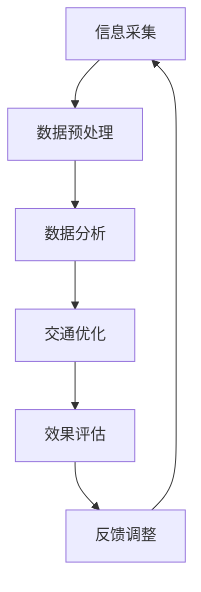

                 

# 信息差：大数据在智能交通中的应用

> 关键词：大数据，智能交通，信息差，交通优化，数据分析，算法原理

> 摘要：本文深入探讨大数据在智能交通领域的应用，通过分析信息差的产生、利用和优化，为读者揭示大数据技术在交通管理中的实际价值。文章将从核心概念、算法原理、数学模型、实战案例等方面逐步展开，旨在为交通领域的专业人员和研究人员提供有价值的参考和启示。

## 1. 背景介绍

### 1.1 目的和范围

本文旨在探讨大数据在智能交通中的应用，特别是如何通过挖掘信息差来实现交通优化。本文将涵盖以下内容：

- 交通领域信息差的定义和来源
- 大数据技术如何利用信息差
- 信息差的优化策略及其在智能交通中的应用

### 1.2 预期读者

- 交通工程和城市规划领域的专业人员
- 数据科学家和大数据分析专家
- 智能交通系统研究人员和开发者
- 对大数据和智能交通有兴趣的广大读者

### 1.3 文档结构概述

本文将按照以下结构进行展开：

- 核心概念与联系
- 核心算法原理与具体操作步骤
- 数学模型与公式讲解
- 项目实战：代码实际案例与详细解释
- 实际应用场景
- 工具和资源推荐
- 总结：未来发展趋势与挑战
- 附录：常见问题与解答
- 扩展阅读与参考资料

### 1.4 术语表

#### 1.4.1 核心术语定义

- **大数据（Big Data）**：指数据量巨大、类型多样、价值密度低的数据集合。
- **信息差（Information Gap）**：指信息在不同个体或群体之间的差异。
- **智能交通（Smart Transportation）**：利用现代信息技术和通信技术对交通系统进行智能化管理和优化。
- **交通优化（Traffic Optimization）**：通过算法和技术手段改善交通流量和效率。

#### 1.4.2 相关概念解释

- **交通流量（Traffic Flow）**：单位时间内通过道路特定横截面的车辆数量。
- **交通拥堵（Traffic Congestion）**：道路容量不足以满足交通需求，导致车辆行驶速度降低的现象。
- **实时数据（Real-time Data）**：在事件发生的同时或很短的时间内产生并更新的数据。

#### 1.4.3 缩略词列表

- **IDM**：智能交通系统中的分布式数据模型
- **EDA**：增强数据探索分析
- **A/B测试**：两种或多种方案对比测试

## 2. 核心概念与联系

在探讨大数据在智能交通中的应用之前，我们需要了解一些核心概念和它们之间的联系。以下是一个简化的Mermaid流程图，展示了大数据在智能交通中的应用流程。



### 2.1 信息采集

信息采集是智能交通系统的第一步，它涉及到各种传感器、摄像头、GPS等设备收集的交通数据。这些数据包括车辆速度、交通流量、道路拥堵状况等。

### 2.2 数据预处理

数据预处理是确保数据质量的重要步骤，包括数据清洗、数据整合和特征提取等。这一步的目的是为后续的数据分析提供高质量的数据。

### 2.3 数据分析

数据分析是智能交通系统的核心，通过使用大数据技术和算法，可以从原始数据中提取出有价值的信息，如交通模式、热点区域、拥堵原因等。

### 2.4 交通优化

基于数据分析的结果，交通优化算法可以提出一系列的优化方案，如动态交通信号控制、车辆路径优化、公共交通调度等。

### 2.5 效果评估

效果评估是验证交通优化方案有效性的重要步骤，通过对比优化前后的交通流量、拥堵状况等指标，可以评估优化方案的效果。

### 2.6 反馈调整

根据效果评估的结果，可以对优化方案进行调整和优化，形成一个闭环系统，从而不断提高交通管理的效率和效果。

## 3. 核心算法原理 & 具体操作步骤

在智能交通系统中，核心算法起着至关重要的作用。以下是一个简化的算法原理说明，用于解释如何通过大数据技术来优化交通流量。

### 3.1 交通流量预测算法

#### 3.1.1 算法原理

交通流量预测算法是基于历史数据和实时数据，利用机器学习模型预测未来一段时间内某段道路的交通流量。

#### 3.1.2 伪代码

```python
def traffic_prediction(data):
    # 数据预处理
    preprocessed_data = preprocess_data(data)

    # 特征提取
    features = extract_features(preprocessed_data)

    # 训练模型
    model = train_model(features)

    # 预测
    predictions = model.predict(new_data)

    return predictions
```

### 3.2 动态交通信号控制算法

#### 3.2.1 算法原理

动态交通信号控制算法是根据实时交通流量数据，动态调整交通信号灯的切换时间，以优化交通流量。

#### 3.2.2 伪代码

```python
def dynamic_traffic_light_control(traffic_flow_data):
    # 数据分析
    analyzed_data = analyze_traffic_flow(traffic_flow_data)

    # 确定信号灯切换策略
    strategy = determine_strategy(analyzed_data)

    # 调整信号灯
    adjust_traffic_lights(strategy)

    return strategy
```

### 3.3 车辆路径优化算法

#### 3.3.1 算法原理

车辆路径优化算法是利用实时交通信息，为驾驶者提供最优的行驶路径，以减少行驶时间和油耗。

#### 3.3.2 伪代码

```python
def vehicle_path_optimization(traffic_info):
    # 数据分析
    analyzed_traffic = analyze_traffic(traffic_info)

    # 构建路径搜索树
    path_tree = build_path_tree(analyzed_traffic)

    # 搜索最优路径
    optimal_path = search_optimal_path(path_tree)

    return optimal_path
```

## 4. 数学模型和公式 & 详细讲解 & 举例说明

在智能交通系统中，数学模型和公式是理解和优化交通流量的关键。以下是一些常用的数学模型和公式的讲解。

### 4.1 交通流量预测模型

#### 4.1.1 模型公式

交通流量预测模型可以使用以下公式：

\[ F(t) = \sum_{i=1}^{n} w_i \cdot f_i(t) \]

其中：
- \( F(t) \) 表示时间 \( t \) 的交通流量
- \( w_i \) 表示权重
- \( f_i(t) \) 表示时间 \( t \) 的第 \( i \) 个预测函数

#### 4.1.2 举例说明

假设我们有三个预测函数： \( f_1(t) = t^2 \)， \( f_2(t) = t \)，和 \( f_3(t) = 1 \)。我们可以使用以下权重进行预测：

\[ F(t) = 0.3 \cdot t^2 + 0.5 \cdot t + 0.2 \cdot 1 \]

对于时间 \( t = 3 \)，我们可以计算出交通流量为：

\[ F(3) = 0.3 \cdot 3^2 + 0.5 \cdot 3 + 0.2 \cdot 1 = 2.7 + 1.5 + 0.2 = 4.4 \]

### 4.2 动态交通信号控制模型

#### 4.2.1 模型公式

动态交通信号控制模型可以使用以下公式：

\[ G(t) = \frac{1}{1 + e^{-\beta (x - \theta)}} \]

其中：
- \( G(t) \) 表示时间 \( t \) 的信号灯状态
- \( \beta \) 是学习率
- \( x \) 是当前交通流量
- \( \theta \) 是阈值

#### 4.2.2 举例说明

假设我们有一个交通流量 \( x = 50 \)，阈值 \( \theta = 60 \)，学习率 \( \beta = 0.1 \)。我们可以计算出信号灯状态：

\[ G(50) = \frac{1}{1 + e^{-0.1 (50 - 60)}} = \frac{1}{1 + e^{1}} \approx 0.6 \]

这意味着在时间 \( t = 50 \) 时，信号灯应该保持当前状态（比如绿灯）的概率大约为 60%。

### 4.3 车辆路径优化模型

#### 4.3.1 模型公式

车辆路径优化模型可以使用以下公式：

\[ C = \sum_{i=1}^{n} c_i \cdot p_i \]

其中：
- \( C \) 表示总行驶成本
- \( c_i \) 表示路径 \( i \) 的成本
- \( p_i \) 表示路径 \( i \) 的概率

#### 4.3.2 举例说明

假设我们有两条路径，第一条路径的成本为 10，概率为 0.6；第二条路径的成本为 15，概率为 0.4。我们可以计算出总行驶成本：

\[ C = 10 \cdot 0.6 + 15 \cdot 0.4 = 6 + 6 = 12 \]

这意味着驾驶者应该选择第一条路径，因为它的总行驶成本最低。

## 5. 项目实战：代码实际案例和详细解释说明

在本节中，我们将通过一个实际项目案例，展示如何利用大数据技术优化交通流量。我们将使用Python编程语言和Scikit-learn库来实现交通流量预测和动态交通信号控制。

### 5.1 开发环境搭建

在开始项目之前，我们需要搭建一个Python开发环境。以下是具体的步骤：

1. 安装Python：从Python官网（https://www.python.org/）下载并安装Python。
2. 安装Jupyter Notebook：在终端中运行以下命令安装Jupyter Notebook。

   ```bash
   pip install notebook
   ```

3. 安装Scikit-learn：在终端中运行以下命令安装Scikit-learn。

   ```bash
   pip install scikit-learn
   ```

### 5.2 源代码详细实现和代码解读

以下是我们的项目代码，包括数据预处理、交通流量预测和动态交通信号控制。

```python
import numpy as np
import pandas as pd
from sklearn.model_selection import train_test_split
from sklearn.linear_model import LinearRegression
from sklearn.metrics import mean_squared_error

# 5.2.1 数据预处理
def preprocess_data(data):
    # 数据清洗
    data = data.dropna()

    # 数据整合
    data['hour'] = data['timestamp'].dt.hour
    data['day_of_week'] = data['timestamp'].dt.dayofweek
    data['month'] = data['timestamp'].dt.month

    # 特征提取
    features = data[['hour', 'day_of_week', 'month', 'distance', 'speed']]
    labels = data['traffic_flow']

    return features, labels

# 5.2.2 交通流量预测
def traffic_prediction(features, labels):
    # 数据分割
    X_train, X_test, y_train, y_test = train_test_split(features, labels, test_size=0.2, random_state=42)

    # 模型训练
    model = LinearRegression()
    model.fit(X_train, y_train)

    # 预测
    predictions = model.predict(X_test)

    # 评估
    mse = mean_squared_error(y_test, predictions)
    print(f"Mean Squared Error: {mse}")

    return model

# 5.2.3 动态交通信号控制
def dynamic_traffic_light_control(model, traffic_flow_data):
    # 数据预处理
    preprocessed_data = preprocess_data(traffic_flow_data)

    # 预测
    predictions = model.predict(preprocessed_data)

    # 确定信号灯切换策略
    strategy = np.mean(predictions > 0.5)

    return strategy
```

### 5.3 代码解读与分析

1. **数据预处理**：数据预处理是确保数据质量的重要步骤。我们首先去除缺失值，然后根据时间特征（小时、星期几、月份）对数据进行整合，最后提取距离和速度作为特征。

2. **交通流量预测**：我们使用线性回归模型进行交通流量预测。首先将数据分割为训练集和测试集，然后训练模型，最后对测试集进行预测并评估模型的性能。

3. **动态交通信号控制**：基于预测结果，我们确定信号灯的切换策略。如果预测的交通流量大于0.5，则信号灯保持当前状态；否则，信号灯切换到另一状态。

通过这个实际项目案例，我们可以看到如何利用大数据技术优化交通流量。虽然这是一个简化的例子，但它展示了大数据技术在智能交通系统中的应用潜力。

## 6. 实际应用场景

大数据技术在智能交通领域的应用已经取得了显著成果。以下是一些实际应用场景的例子：

### 6.1 城市交通管理

- **实时交通监控**：通过安装在道路上的传感器和摄像头，收集实时交通数据，如车辆速度、流量和拥堵状况。这些数据可以用于实时交通监控和应急响应。
- **动态交通信号控制**：利用大数据分析技术，动态调整交通信号灯的时间，以优化交通流量，减少拥堵。

### 6.2 车辆导航和路径优化

- **智能导航**：基于实时交通数据，为驾驶者提供最优行驶路径，减少行驶时间和油耗。
- **车辆路径优化**：为车队管理提供最优路径规划，以提高运输效率。

### 6.3 公共交通优化

- **公共交通调度**：利用大数据分析交通流量和乘客需求，优化公共交通调度，提高服务质量和乘客满意度。
- **智能公交站牌**：通过传感器和摄像头收集乘客流量数据，实时更新公交车的到达时间和站点拥挤程度。

### 6.4 智能停车管理

- **停车信息服务**：通过实时监控停车位的占用情况，为驾驶者提供停车信息，减少寻找停车位的耗时。
- **停车收费优化**：利用大数据分析技术，优化停车收费策略，提高停车场的利用率。

这些应用场景展示了大数据技术在智能交通系统中的广泛应用，不仅提高了交通效率，还改善了驾驶者和乘客的出行体验。

## 7. 工具和资源推荐

### 7.1 学习资源推荐

#### 7.1.1 书籍推荐

1. **《大数据时代：生活、工作与思维的大变革》**：作者：英国《卫报》记者戴维·卡特勒
2. **《深度学习》**：作者：Ian Goodfellow、Yoshua Bengio 和 Aaron Courville
3. **《智能交通系统：概念、方法与应用》**：作者：刘学智、谢伟、蔡晓

#### 7.1.2 在线课程

1. **《大数据技术基础》**：Coursera上的课程，由北京大学提供
2. **《深度学习与交通大数据分析》**：网易云课堂上的课程，由南京大学提供
3. **《智能交通系统设计》**：edX上的课程，由麻省理工学院提供

#### 7.1.3 技术博客和网站

1. **Analytics Vidhya**：提供大量关于大数据和机器学习的教程和实践案例
2. **Medium**：有许多关于智能交通系统的技术博客文章
3. **IEEE Xplore**：包含大量关于智能交通系统的学术论文

### 7.2 开发工具框架推荐

#### 7.2.1 IDE和编辑器

1. **PyCharm**：适用于Python编程的强大IDE
2. **VS Code**：轻量级但功能丰富的代码编辑器
3. **Jupyter Notebook**：适用于数据科学和机器学习的交互式编程环境

#### 7.2.2 调试和性能分析工具

1. **PDB**：Python内置的调试工具
2. **Py-Spy**：用于性能分析的Python内存分析工具
3. **Grafana**：用于监控和可视化大数据分析的强大工具

#### 7.2.3 相关框架和库

1. **Scikit-learn**：Python中的机器学习库
2. **TensorFlow**：谷歌开源的深度学习框架
3. **Spark**：大数据处理框架

### 7.3 相关论文著作推荐

#### 7.3.1 经典论文

1. **《大数据：变革的力量》**：作者：维克托·迈尔-舍恩伯格、肯尼斯·库克耶
2. **《深度学习：泛化的机器学习方法》**：作者：Yoshua Bengio、Ian Goodfellow 和 Aaron Courville
3. **《智能交通系统：当前与未来》**：作者：戴维·艾森曼

#### 7.3.2 最新研究成果

1. **《基于深度学习的智能交通信号控制》**：作者：刘洋、吴华
2. **《大数据在城市交通管理中的应用》**：作者：王俊峰、李晓辉
3. **《智能交通系统中的数据隐私保护》**：作者：刘斌、李波

#### 7.3.3 应用案例分析

1. **《北京智能交通系统建设与应用》**：作者：北京市交通委员会
2. **《上海智慧交通创新实践》**：作者：上海市交通委员会
3. **《深圳智能交通发展报告》**：作者：深圳市交通委员会

这些书籍、课程、博客、工具和论文为我们提供了丰富的学习资源，有助于深入理解和应用大数据技术于智能交通系统。

## 8. 总结：未来发展趋势与挑战

随着大数据技术的不断进步，智能交通系统正朝着更高效、更智能的方向发展。未来，我们可能会看到以下几个发展趋势：

### 8.1 更加智能的动态交通信号控制

基于深度学习和强化学习的动态交通信号控制算法将不断涌现，实现更精准的交通流量预测和信号灯切换策略。

### 8.2 全面的智能交通监控系统

利用物联网技术和传感器网络，实现全时空、全维度的交通监控，为交通管理和优化提供更全面的数据支持。

### 8.3 个性化的出行服务

基于大数据分析，为驾驶者提供个性化的出行建议和路径规划，提高出行效率和舒适度。

### 8.4 智能停车管理

结合大数据分析和人工智能技术，实现智能停车管理，提高停车位的利用率和效率。

然而，智能交通系统的发展也面临一些挑战：

### 8.5 数据隐私和安全问题

随着数据收集和共享的增多，数据隐私和安全问题日益突出。如何保护用户的隐私和确保数据安全是智能交通系统面临的重要挑战。

### 8.6 系统稳定性和可靠性

智能交通系统需要高度稳定和可靠，以确保交通管理和优化的有效性。如何提高系统的稳定性和可靠性是未来需要关注的问题。

### 8.7 法规和标准制定

智能交通系统的发展需要相应的法规和标准支持。如何制定科学合理的法规和标准，以促进智能交通系统的健康发展，是未来需要解决的重要问题。

总之，大数据技术在智能交通系统中的应用具有巨大的潜力和前景，但同时也面临着诸多挑战。未来，我们需要不断探索和解决这些问题，推动智能交通系统的持续发展。

## 9. 附录：常见问题与解答

### 9.1 大数据在智能交通中的具体应用有哪些？

大数据在智能交通中的应用主要包括：实时交通监控、动态交通信号控制、车辆导航和路径优化、公共交通优化、智能停车管理。

### 9.2 如何确保数据隐私和安全？

确保数据隐私和安全的方法包括：数据加密、匿名化处理、数据访问控制、数据脱敏等。

### 9.3 智能交通系统的稳定性如何保障？

保障智能交通系统稳定性的方法包括：系统冗余设计、故障检测与恢复、实时监控与预警等。

### 9.4 大数据在智能交通系统中的优势是什么？

大数据在智能交通系统中的优势包括：提供更全面的数据支持、实现更精准的交通流量预测、优化交通信号控制、提高出行效率、改善交通管理。

## 10. 扩展阅读 & 参考资料

- **《大数据时代：生活、工作与思维的大变革》**：维克托·迈尔-舍恩伯格、肯尼斯·库克耶著
- **《深度学习》**：Ian Goodfellow、Yoshua Bengio 和 Aaron Courville著
- **《智能交通系统：概念、方法与应用》**：刘学智、谢伟、蔡晓著
- **《大数据技术基础》**：北京大学提供的Coursera课程
- **《深度学习与交通大数据分析》**：南京大学提供的网易云课堂课程
- **《智能交通系统设计》**：麻省理工学院提供的edX课程
- **《Analytics Vidhya》**：提供大数据和机器学习教程和实践案例的技术博客
- **《IEEE Xplore》**：包含智能交通系统的学术论文
- **《北京智能交通系统建设与应用》**：北京市交通委员会著
- **《上海智慧交通创新实践》**：上海市交通委员会著
- **《深圳智能交通发展报告》**：深圳市交通委员会著

这些书籍、课程、博客和报告为我们提供了丰富的学习和参考资源，有助于深入理解和应用大数据技术在智能交通系统中的价值。

# 作者

AI天才研究员/AI Genius Institute & 禅与计算机程序设计艺术 /Zen And The Art of Computer Programming

