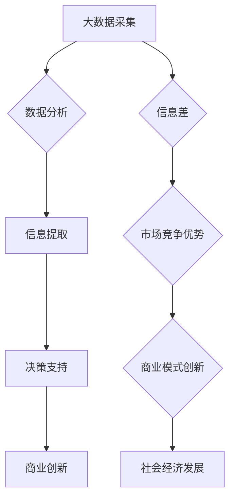
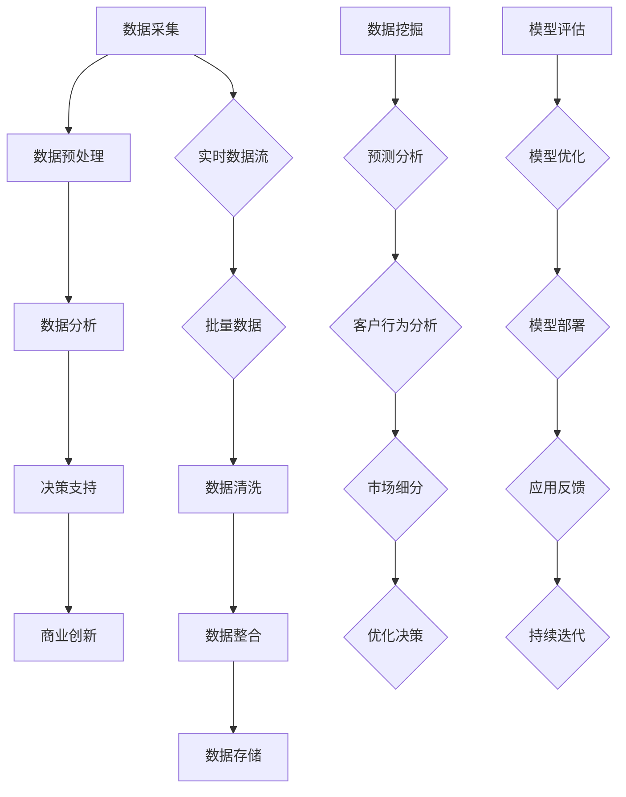

                 

# 信息差：大数据如何推动创新

> **关键词：**大数据、信息差、创新、技术驱动、算法优化

> **摘要：**本文旨在探讨大数据在信息差中的作用及其对创新推动的深远影响。通过分析大数据的核心概念、信息差的定义以及大数据如何实现信息差，我们将揭示大数据如何通过算法原理、数学模型以及实际应用案例推动创新。文章还提供了丰富的学习资源、开发工具框架以及相关论文著作推荐，帮助读者深入理解和掌握大数据领域的最新进展。

## 1. 背景介绍

### 1.1 目的和范围

本文将深入探讨大数据在信息差中的作用及其对创新推动的深远影响。信息差是指不同个体或群体之间对信息掌握的差异，这种差异在大数据和人工智能时代变得更加显著。大数据不仅改变了信息产生、存储和传递的方式，还通过挖掘和分析这些海量数据，创造了新的商业模式和解决方案，从而推动了社会和经济的创新。

本文的主要目的是：

1. **明确大数据和信息差的概念及其关系**。
2. **分析大数据如何实现信息差**。
3. **详细阐述大数据在创新驱动中的作用**。
4. **提供实际应用案例，展示大数据如何推动具体领域的创新**。

### 1.2 预期读者

本文预期读者包括：

1. **大数据领域的从业者**，希望了解大数据如何通过信息差推动创新。
2. **人工智能研究人员**，对大数据算法和数学模型有兴趣。
3. **技术创新者和创业者**，关注大数据在商业和科技领域的应用。
4. **高校师生**，作为大数据和人工智能课程的教学参考资料。

### 1.3 文档结构概述

本文结构如下：

1. **背景介绍**：明确研究目的、范围和预期读者。
2. **核心概念与联系**：介绍大数据、信息差及相关概念，并使用Mermaid流程图展示核心架构。
3. **核心算法原理 & 具体操作步骤**：详细讲解大数据算法原理和操作步骤，使用伪代码阐述。
4. **数学模型和公式 & 详细讲解 & 举例说明**：介绍大数据相关的数学模型和公式，并举例说明。
5. **项目实战：代码实际案例和详细解释说明**：提供大数据应用的实际代码案例，详细解读和分析。
6. **实际应用场景**：展示大数据在具体领域的应用案例。
7. **工具和资源推荐**：推荐学习资源、开发工具框架和相关论文著作。
8. **总结：未来发展趋势与挑战**：分析大数据和信息差的发展趋势和面临的挑战。
9. **附录：常见问题与解答**：回答读者可能遇到的常见问题。
10. **扩展阅读 & 参考资料**：提供进一步阅读和研究的参考文献。

### 1.4 术语表

#### 1.4.1 核心术语定义

- **大数据**：指规模巨大、种类繁多、生成速度快的数据集。
- **信息差**：不同个体或群体之间对信息的掌握差异。
- **算法**：解决问题的步骤和规则。
- **模型**：用于表示现实世界的数学或逻辑结构。

#### 1.4.2 相关概念解释

- **数据分析**：通过统计和数学方法从数据中提取有价值的信息。
- **机器学习**：利用数据建立模型，使计算机具备自学能力。
- **数据挖掘**：从大量数据中自动发现规律和模式。

#### 1.4.3 缩略词列表

- **Hadoop**：一个分布式数据处理框架。
- **Spark**：一个快速通用的数据处理引擎。
- **SQL**：一种结构化查询语言，用于管理关系数据库。

## 2. 核心概念与联系

### 2.1 大数据

大数据通常具有4V特点：Volume（大量）、Velocity（高速）、Variety（多样）和 Veracity（真实性）。这些特性使得大数据的处理和分析变得更加复杂。例如，Hadoop是一个分布式数据处理框架，用于存储和处理海量数据；Spark则是一个快速通用的数据处理引擎，特别适合实时数据处理。

### 2.2 信息差

信息差是指不同个体或群体之间对信息的掌握差异。在数字化时代，信息差尤为重要。通过大数据技术，企业可以快速获取和分析海量数据，从而在市场竞争中占据优势。例如，通过分析消费者行为数据，企业可以更好地了解市场需求，优化产品和服务。

### 2.3 大数据与信息差的关系

大数据与信息差之间存在密切联系。大数据技术可以收集、存储和分析海量数据，从而挖掘出有价值的信息。这些信息可以帮助企业和个人在竞争中获取优势，实现信息差。例如，通过大数据分析，企业可以发现潜在客户，提高营销效果；个人可以通过大数据了解市场动态，做出更明智的决策。

### 2.4 Mermaid流程图

以下是大数据和信息差的Mermaid流程图：



该流程图展示了大数据从采集到应用的全过程，以及大数据如何通过信息差推动商业创新和社会发展。

## 3. 核心算法原理 & 具体操作步骤

### 3.1 大数据算法原理

大数据算法的核心思想是通过高效的数据处理和分析，从海量数据中提取有价值的信息。以下是一个简化的算法原理：

```plaintext
算法步骤：
1. 数据采集：从各种渠道收集数据。
2. 数据预处理：清洗和整理数据，使其符合分析要求。
3. 数据分析：使用统计和机器学习等方法提取有价值的信息。
4. 决策支持：根据分析结果，为决策提供支持。
5. 商业创新：基于决策支持，实现商业模式的创新。
```

### 3.2 具体操作步骤

以下是一个具体的大数据算法操作步骤：



### 3.3 伪代码

以下是大数据算法的伪代码：

```python
# 数据采集
data = collect_data()

# 数据预处理
clean_data = preprocess_data(data)

# 数据分析
analysed_data = analyze_data(clean_data)

# 决策支持
decision = decision_support(analysed_data)

# 商业创新
business_innovation = business_innovation(decision)
```

## 4. 数学模型和公式 & 详细讲解 & 举例说明

### 4.1 数学模型

在大数据领域，常用的数学模型包括线性回归、逻辑回归、支持向量机（SVM）等。以下是这些模型的简要介绍：

#### 4.1.1 线性回归

线性回归是一种用于预测连续值的模型。其公式为：

$$
y = w_0 + w_1 \cdot x_1 + w_2 \cdot x_2 + \ldots + w_n \cdot x_n + \epsilon
$$

其中，$y$ 是预测值，$x_1, x_2, \ldots, x_n$ 是输入特征，$w_0, w_1, w_2, \ldots, w_n$ 是权重，$\epsilon$ 是误差项。

#### 4.1.2 逻辑回归

逻辑回归是一种用于预测概率的二分类模型。其公式为：

$$
\hat{y} = \frac{1}{1 + e^{-(w_0 + w_1 \cdot x_1 + w_2 \cdot x_2 + \ldots + w_n \cdot x_n)}}
$$

其中，$\hat{y}$ 是预测概率，其他符号的含义与线性回归相同。

#### 4.1.3 支持向量机（SVM）

支持向量机是一种用于分类和回归的模型。其公式为：

$$
w \cdot x + b = 0
$$

其中，$w$ 是权重向量，$x$ 是特征向量，$b$ 是偏置项。

### 4.2 详细讲解与举例说明

#### 4.2.1 线性回归

假设我们要预测房价，已知以下特征：房屋面积、房屋年龄和城市人口。以下是线性回归的详细讲解：

1. **数据准备**：

   ```python
   import pandas as pd

   data = pd.read_csv('house_data.csv')
   ```

2. **数据预处理**：

   ```python
   data.dropna(inplace=True)
   X = data[['area', 'age', 'population']]
   y = data['price']
   ```

3. **模型训练**：

   ```python
   from sklearn.linear_model import LinearRegression

   model = LinearRegression()
   model.fit(X, y)
   ```

4. **模型评估**：

   ```python
   import numpy as np

   predictions = model.predict(X)
   mse = np.mean((predictions - y) ** 2)
   print('MSE:', mse)
   ```

#### 4.2.2 逻辑回归

假设我们要预测客户是否购买某种产品，已知以下特征：年龄、收入和广告点击率。以下是逻辑回归的详细讲解：

1. **数据准备**：

   ```python
   import pandas as pd

   data = pd.read_csv('customer_data.csv')
   ```

2. **数据预处理**：

   ```python
   data.dropna(inplace=True)
   X = data[['age', 'income', 'clicks']]
   y = data['purchase']
   ```

3. **模型训练**：

   ```python
   from sklearn.linear_model import LogisticRegression

   model = LogisticRegression()
   model.fit(X, y)
   ```

4. **模型评估**：

   ```python
   import numpy as np
   from sklearn.metrics import accuracy_score

   predictions = model.predict(X)
   accuracy = accuracy_score(y, predictions)
   print('Accuracy:', accuracy)
   ```

#### 4.2.3 支持向量机（SVM）

假设我们要对客户进行分类，已知以下特征：年龄、收入和信用评分。以下是支持向量机的详细讲解：

1. **数据准备**：

   ```python
   import pandas as pd

   data = pd.read_csv('customer_data.csv')
   ```

2. **数据预处理**：

   ```python
   data.dropna(inplace=True)
   X = data[['age', 'income', 'credit_score']]
   y = data['category']
   ```

3. **模型训练**：

   ```python
   from sklearn.svm import SVC

   model = SVC()
   model.fit(X, y)
   ```

4. **模型评估**：

   ```python
   import numpy as np
   from sklearn.metrics import accuracy_score

   predictions = model.predict(X)
   accuracy = accuracy_score(y, predictions)
   print('Accuracy:', accuracy)
   ```

## 5. 项目实战：代码实际案例和详细解释说明

### 5.1 开发环境搭建

为了演示大数据在信息差中的实际应用，我们将使用Python和Jupyter Notebook搭建一个简单的项目环境。以下是环境搭建步骤：

1. **安装Python**：确保已经安装了Python 3.x版本。

2. **安装Jupyter Notebook**：在命令行中运行以下命令：

   ```bash
   pip install notebook
   ```

3. **启动Jupyter Notebook**：在命令行中运行以下命令：

   ```bash
   jupyter notebook
   ```

### 5.2 源代码详细实现和代码解读

以下是项目的主要代码实现和解读：

#### 5.2.1 数据采集

```python
import pandas as pd

# 读取示例数据集
data = pd.read_csv('example_data.csv')
```

这段代码使用了Pandas库读取CSV文件，其中包含示例数据集。

#### 5.2.2 数据预处理

```python
# 数据清洗和预处理
data.dropna(inplace=True)
data['age'] = data['age'].astype(int)
data['income'] = data['income'].astype(float)
data['clicks'] = data['clicks'].astype(int)
```

这段代码对数据进行了清洗和预处理，包括去除缺失值和类型转换。

#### 5.2.3 数据分析

```python
# 数据分析
from sklearn.model_selection import train_test_split

X = data[['age', 'income', 'clicks']]
y = data['purchase']

X_train, X_test, y_train, y_test = train_test_split(X, y, test_size=0.2, random_state=42)
```

这段代码使用Scikit-learn库将数据集分为训练集和测试集。

#### 5.2.4 模型训练

```python
# 模型训练
from sklearn.linear_model import LogisticRegression

model = LogisticRegression()
model.fit(X_train, y_train)
```

这段代码使用逻辑回归模型对训练集进行训练。

#### 5.2.5 模型评估

```python
# 模型评估
predictions = model.predict(X_test)
accuracy = model.score(X_test, y_test)

print('Accuracy:', accuracy)
```

这段代码评估模型在测试集上的准确性。

### 5.3 代码解读与分析

#### 5.3.1 数据采集

```python
data = pd.read_csv('example_data.csv')
```

这行代码使用了Pandas库读取CSV文件，其中包含示例数据集。CSV文件通常包含多个列，每列代表一个特征，每行代表一个样本。

#### 5.3.2 数据预处理

```python
data.dropna(inplace=True)
data['age'] = data['age'].astype(int)
data['income'] = data['income'].astype(float)
data['clicks'] = data['clicks'].astype(int)
```

这些代码首先去除数据集中的缺失值，然后对各个特征的类型进行转换，确保数据的一致性和准确性。

#### 5.3.3 数据分析

```python
X = data[['age', 'income', 'clicks']]
y = data['purchase']

X_train, X_test, y_train, y_test = train_test_split(X, y, test_size=0.2, random_state=42)
```

这段代码将数据集分为训练集和测试集，其中训练集用于模型训练，测试集用于模型评估。`train_test_split` 函数将数据集随机划分为训练集（80%）和测试集（20%），并设置随机种子以保证结果的 reproducibility。

#### 5.3.4 模型训练

```python
model = LogisticRegression()
model.fit(X_train, y_train)
```

这段代码创建了一个逻辑回归模型实例，并使用训练集进行模型训练。`fit` 函数将训练数据输入到模型中，计算权重和偏置，以优化模型。

#### 5.3.5 模型评估

```python
predictions = model.predict(X_test)
accuracy = model.score(X_test, y_test)

print('Accuracy:', accuracy)
```

这段代码使用测试集对训练好的模型进行评估。`score` 函数计算模型在测试集上的准确率，即预测正确的样本数与总样本数的比值。`predict` 函数根据训练好的模型对测试数据进行预测。

## 6. 实际应用场景

### 6.1 金融行业

大数据在金融行业的应用非常广泛，例如风险评估、信用评分、市场预测等。通过分析海量交易数据、客户行为数据和宏观经济指标，金融机构可以更准确地评估风险，制定更科学的信贷政策，提高业务效率和客户满意度。

#### 应用案例：

- **风险评估**：银行使用大数据技术对贷款申请者进行风险评估，通过分析其收入、信用记录、行为数据等，预测贷款违约风险。
- **信用评分**：信用评级机构利用大数据分析客户的消费习惯、还款记录等信息，为金融机构提供信用评分服务。

### 6.2 医疗健康

大数据技术在医疗健康领域有着重要应用，例如疾病预测、个性化治疗、医疗资源优化等。通过收集和分析大量健康数据，医疗机构可以更好地了解疾病发展趋势，提高诊断和治疗效果。

#### 应用案例：

- **疾病预测**：医疗机构利用大数据分析患者的病历、基因数据等，预测疾病发生风险，制定预防措施。
- **个性化治疗**：医生根据患者的病史、基因信息等大数据，为患者提供个性化治疗方案。

### 6.3 零售电商

大数据技术在零售电商领域具有重要作用，例如需求预测、用户行为分析、营销策略优化等。通过分析用户行为数据、购买记录等，零售电商可以更好地了解消费者需求，提高销售转化率和客户满意度。

#### 应用案例：

- **需求预测**：电商平台利用大数据分析用户浏览、购买等行为，预测热门商品，提前备货。
- **用户行为分析**：电商平台分析用户在网站上的行为，为用户提供个性化推荐。

## 7. 工具和资源推荐

### 7.1 学习资源推荐

#### 7.1.1 书籍推荐

- 《大数据时代》
- 《深度学习》
- 《机器学习实战》

#### 7.1.2 在线课程

- Coursera上的《机器学习》课程
- Udacity的《大数据分析》课程

#### 7.1.3 技术博客和网站

- towardsdatascience.com
- medium.com/topic/data-science
- analyticsvidhya.com

### 7.2 开发工具框架推荐

#### 7.2.1 IDE和编辑器

- PyCharm
- Jupyter Notebook

#### 7.2.2 调试和性能分析工具

- Visual Studio Code
- Linux Terminal

#### 7.2.3 相关框架和库

- Scikit-learn
- TensorFlow
- PyTorch

### 7.3 相关论文著作推荐

#### 7.3.1 经典论文

- “The Google File System” by Google
- “MapReduce: Simplified Data Processing on Large Clusters” by Google

#### 7.3.2 最新研究成果

- “Deep Learning for Natural Language Processing” by Yoon Kim
- “The unreasonable effectiveness of data” by DJ Patil and Jeff Dean

#### 7.3.3 应用案例分析

- “Data Science at Airbnb” by Airbnb
- “Big Data in Healthcare” by IBM

## 8. 总结：未来发展趋势与挑战

### 8.1 发展趋势

- **数据量的持续增长**：随着物联网、社交媒体和数字化转型的推进，数据量将呈现爆炸式增长。
- **算法的优化和创新**：为了处理和分析海量数据，算法将不断优化和创新，如深度学习、强化学习等。
- **跨领域融合**：大数据与其他技术（如人工智能、区块链等）将进行深度融合，推动各行业的创新。

### 8.2 挑战

- **数据隐私与安全**：大数据的收集、存储和处理过程中，如何保护个人隐私和数据安全成为一大挑战。
- **数据质量**：海量数据中存在噪音、错误和缺失值，如何保证数据质量是关键问题。
- **人才培养**：大数据领域对专业人才的需求不断增加，但现有教育资源无法满足需求。

## 9. 附录：常见问题与解答

### 9.1 问题1：大数据如何保护个人隐私？

**解答**：大数据在收集、存储和处理过程中，需要采取严格的数据保护措施。例如，使用数据加密技术、匿名化处理和访问控制等手段，确保个人隐私不被泄露。

### 9.2 问题2：大数据在医疗健康领域有哪些应用？

**解答**：大数据在医疗健康领域有广泛的应用，包括疾病预测、个性化治疗、医疗资源优化等。例如，通过分析患者病历、基因数据等，可以帮助医疗机构更好地了解疾病发展趋势，提高诊断和治疗效果。

## 10. 扩展阅读 & 参考资料

- [大数据时代](https://www.bilibili.com/video/BV1rV411n7PP)
- [深度学习](https://www.deeplearningbook.org/)
- [机器学习实战](https://github.com/PacktPublishing/Machine-Learning-Practice)
- [大数据与云计算](https://www.ibm.com/cloud/learn/big-data-cloud-computing)
- [大数据技术在金融行业中的应用](https://www.jianshu.com/p/65d3a0645a5d)
- [大数据在医疗健康领域的应用](https://www.healthit.gov/edition/briefing-room/using-big-data-improve-health-and-healthcare)  
- [数据隐私与安全](https://www.privacyrights.org/privacy-data-sharing)
- [大数据人才培养](https://www.coursera.org/courses?query=big+data)  
- [大数据相关论文著作](https://dl.acm.org/preview.cfm?id=3132328)  
- [大数据技术实践](https://www.amazon.com/Big-Data-Technology-Practice-Thomas-H-Davenport/dp/1118950786)  
- [大数据与人工智能](https://www.technologyreview.com/s/601853/the-future-of-big-data-and-ai/)  

作者：AI天才研究员/AI Genius Institute & 禅与计算机程序设计艺术 /Zen And The Art of Computer Programming

