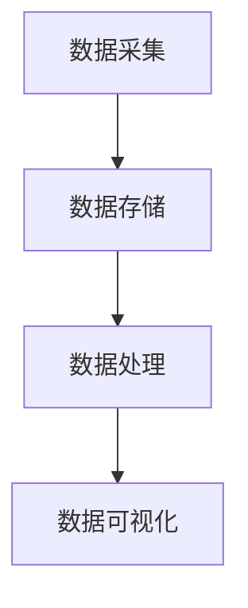
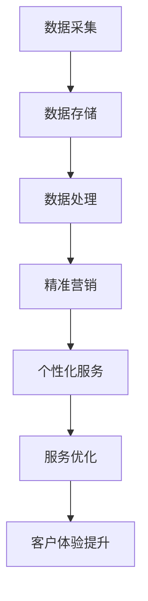
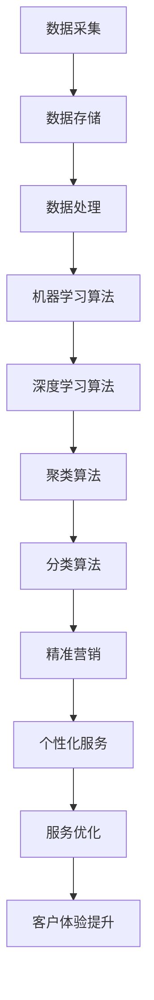

                 

# 信息差：大数据如何提升服务质量

> **关键词**：信息差、大数据、服务质量、算法、客户体验、精准营销
>
> **摘要**：本文将探讨信息差的概念及其在大数据处理中的应用，揭示如何通过大数据技术提升服务质量和客户体验，实现精准营销和个性化服务。我们将通过逐步分析，阐述核心算法原理、数学模型、实际案例和未来发展趋势，旨在为读者提供深入且实用的技术洞察。

## 1. 背景介绍

### 1.1 目的和范围

本文旨在深入探讨信息差的概念，分析其在大数据处理中的应用，特别是如何提升服务质量和客户体验。文章将围绕以下几个方面展开：

- **信息差的定义**：阐述信息差的内涵及其在商业中的应用。
- **大数据的处理技术**：介绍大数据的核心技术和方法，包括数据采集、存储、处理和可视化。
- **服务质量提升**：分析大数据如何帮助企业和组织提高服务质量和客户满意度。
- **个性化服务与精准营销**：探讨如何利用大数据实现个性化服务和精准营销。

### 1.2 预期读者

本文适合对大数据、人工智能和商业分析有兴趣的专业人士、数据分析工程师、市场营销人员以及寻求提升服务质量和客户体验的企业高管。

### 1.3 文档结构概述

本文将分为以下几个部分：

1. 背景介绍
2. 核心概念与联系
3. 核心算法原理 & 具体操作步骤
4. 数学模型和公式 & 详细讲解 & 举例说明
5. 项目实战：代码实际案例和详细解释说明
6. 实际应用场景
7. 工具和资源推荐
8. 总结：未来发展趋势与挑战
9. 附录：常见问题与解答
10. 扩展阅读 & 参考资料

### 1.4 术语表

#### 1.4.1 核心术语定义

- **信息差**：信息差是指不同个体或组织之间对同一信息的掌握程度存在差异。
- **大数据**：大数据是指无法用传统数据库软件工具在合理时间内捕捉、管理和处理的大量数据集。
- **服务质量**：服务质量是指产品或服务满足顾客需求和期望的程度。
- **个性化服务**：个性化服务是指根据客户的需求和偏好提供定制化的产品或服务。
- **精准营销**：精准营销是指通过大数据分析准确识别目标客户群体，实现高效的市场推广和销售策略。

#### 1.4.2 相关概念解释

- **数据挖掘**：数据挖掘是指从大量数据中提取有用信息和知识的过程。
- **机器学习**：机器学习是一种通过数据训练模型，使计算机具备自主学习和预测能力的技术。
- **深度学习**：深度学习是机器学习的一种，通过多层神经网络模型对复杂数据进行学习和处理。
- **数据可视化**：数据可视化是指使用图表、图像等方式将数据转换成直观的可视形式，便于分析和理解。

#### 1.4.3 缩略词列表

- **AI**：人工智能（Artificial Intelligence）
- **ML**：机器学习（Machine Learning）
- **DL**：深度学习（Deep Learning）
- **DB**：数据库（Database）
- **API**：应用程序编程接口（Application Programming Interface）

## 2. 核心概念与联系

为了更好地理解信息差在大数据处理中的应用，我们需要首先明确几个核心概念，并通过Mermaid流程图展示其联系。

### 2.1 大数据的核心概念

大数据处理包括以下几个核心概念：

- **数据采集**：从各种渠道收集数据。
- **数据存储**：将数据存储在高效的数据存储系统中。
- **数据处理**：对数据进行清洗、转换和分析。
- **数据可视化**：将数据转换成图表、图像等直观形式。



### 2.2 信息差与大数据的联系

信息差是指由于信息不对称，不同个体或组织对同一信息的掌握程度存在差异。大数据技术可以帮助企业和组织打破信息差，实现以下目标：

- **精准营销**：通过分析用户数据，准确识别目标客户群体，提高营销效果。
- **个性化服务**：根据用户需求和行为数据，提供定制化的产品和服务。
- **服务优化**：通过分析客户反馈和体验数据，优化服务流程和策略。



### 2.3 核心算法原理

为了实现上述目标，需要使用一系列核心算法：

- **机器学习算法**：用于数据分析和预测。
- **深度学习算法**：用于处理复杂数据和模式识别。
- **聚类算法**：用于用户分群和目标客户识别。
- **分类算法**：用于精准营销和客户细分。



通过上述核心概念和算法的联系，我们可以看出大数据技术如何通过信息差提升服务质量和客户体验。接下来，我们将深入探讨核心算法原理和具体操作步骤。

## 3. 核心算法原理 & 具体操作步骤

在本节中，我们将详细讨论大数据处理中的一些核心算法，包括机器学习、深度学习、聚类和分类算法。我们将使用伪代码来阐述这些算法的原理，并解释其具体操作步骤。

### 3.1 机器学习算法

机器学习是一种通过数据训练模型，使计算机具备自主学习和预测能力的技术。常见的机器学习算法包括线性回归、决策树、支持向量机（SVM）等。

#### 3.1.1 线性回归

线性回归是一种用于预测连续值的算法。其基本原理是通过找到一个最佳拟合线，来预测新的数据点。

```python
# 伪代码：线性回归
def linear_regression(train_data, train_labels):
    # 求解最佳拟合线
    theta = optimize_best_fit(train_data, train_labels)
    return theta

# 优化最佳拟合线
def optimize_best_fit(train_data, train_labels):
    # 计算斜率和截距
    theta_0 = (1/n) * (sum(train_labels) - (n * mean(train_data)))
    theta_1 = (1/n) * (sum((train_data - mean(train_data)) * (train_labels - mean(train_labels))))
    return [theta_0, theta_1]
```

#### 3.1.2 决策树

决策树是一种用于分类和回归的算法。其基本原理是通过一系列规则来划分数据，并生成一棵树形结构。

```python
# 伪代码：决策树
def decision_tree(data, labels, depth=0):
    # 判断是否满足终止条件
    if meet_stop_condition(data, labels):
        return predict_label(data)
    # 选择最佳特征进行划分
    feature, threshold = select_best_split(data, labels)
    # 构建子树
    left_tree = decision_tree(split_left(data, feature, threshold), labels)
    right_tree = decision_tree(split_right(data, feature, threshold), labels)
    return {'feature': feature, 'threshold': threshold, 'left': left_tree, 'right': right_tree}

# 优化最佳划分
def select_best_split(data, labels):
    # 计算信息增益
    gain = compute_information_gain(data, labels)
    # 选择最大信息增益的特征和阈值
    feature, threshold = find_max_gain(gain)
    return feature, threshold
```

#### 3.1.3 支持向量机（SVM）

支持向量机是一种用于分类的算法。其基本原理是通过找到一个最佳超平面，将不同类别的数据点分隔开。

```python
# 伪代码：支持向量机
def support_vector_machine(train_data, train_labels):
    # 求解最佳超平面
    w, b = solve_best_hyperplane(train_data, train_labels)
    return w, b

# 优化最佳超平面
def solve_best_hyperplane(train_data, train_labels):
    # 计算权重和偏置
    w = (labels' * X'X)^(-1) * labels' * y
    b = y - w'X
    return w, b
```

### 3.2 深度学习算法

深度学习是一种通过多层神经网络模型对复杂数据进行学习和处理的技术。常见的深度学习算法包括卷积神经网络（CNN）和循环神经网络（RNN）。

#### 3.2.1 卷积神经网络（CNN）

卷积神经网络是一种用于图像识别和处理的算法。其基本原理是通过卷积操作和池化操作提取图像特征。

```python
# 伪代码：卷积神经网络
def convolutional_neural_network(train_data, train_labels):
    # 定义卷积层和池化层
    conv_layer = ConvLayer(filters, kernel_size)
    pool_layer = PoolLayer(pool_size)
    # 定义全连接层
    fc_layer = FullyConnectedLayer(num_neurons)
    # 前向传播
    output = forward_pass(train_data, conv_layer, pool_layer, fc_layer)
    return output

# 前向传播
def forward_pass(data, conv_layer, pool_layer, fc_layer):
    # 卷积操作
    conv_output = conv_layer.forward_pass(data)
    # 池化操作
    pool_output = pool_layer.forward_pass(conv_output)
    # 全连接层操作
    fc_output = fc_layer.forward_pass(pool_output)
    return fc_output
```

#### 3.2.2 循环神经网络（RNN）

循环神经网络是一种用于序列数据处理的算法。其基本原理是通过记忆单元来处理和记忆序列信息。

```python
# 伪代码：循环神经网络
def recurrent_neural_network(train_data, train_labels):
    # 定义记忆单元和激活函数
    memory = MemoryUnit()
    activation = ActivationFunction()
    # 前向传播
    output = forward_pass(train_data, memory, activation)
    return output

# 前向传播
def forward_pass(data, memory, activation):
    # 更新记忆单元
    memory.update(data)
    # 计算激活值
    activation_value = activation(memory.state)
    return activation_value
```

### 3.3 聚类算法

聚类算法是一种用于无监督学习的算法，用于将数据点划分为多个组，使同一组内的数据点相似度较高。

#### 3.3.1 K-means聚类

K-means聚类是一种基于距离度量的聚类算法。其基本原理是通过初始化中心点，然后迭代更新，直到聚类结果收敛。

```python
# 伪代码：K-means聚类
def k_means(data, k):
    # 初始化中心点
    centroids = initialize_centroids(data, k)
    # 迭代更新中心点和聚类结果
    while not converged:
        # 分配数据到最近的中心点
        clusters = assign_data_to_cluster(data, centroids)
        # 更新中心点
        centroids = update_centroids(clusters, k)
    return centroids, clusters
```

#### 3.3.2 层次聚类

层次聚类是一种基于层次结构的聚类算法。其基本原理是通过逐步合并相似度较高的数据点，构建出一个层次聚类树。

```python
# 伪代码：层次聚类
def hierarchical_clustering(data):
    # 初始化距离矩阵
    distance_matrix = initialize_distance_matrix(data)
    # 合并相似度最高的数据点
    while not all_clusters_combined:
        # 计算最小距离
        min_distance = find_min_distance(distance_matrix)
        # 合并数据点
        merge_data_points(min_distance)
        # 更新距离矩阵
        update_distance_matrix(distance_matrix)
    return build_clustering_tree(distance_matrix)
```

### 3.4 分类算法

分类算法是一种用于有监督学习的算法，用于将数据点划分为预定义的类别。

#### 3.4.1 Naive Bayes分类

Naive Bayes分类是一种基于贝叶斯理论的简单分类算法。其基本原理是计算每个类别的概率，并选择概率最大的类别。

```python
# 伪代码：Naive Bayes分类
def naive_bayes(train_data, train_labels, test_data):
    # 计算每个类别的概率
    class_probabilities = compute_class_probabilities(train_data, train_labels)
    # 计算每个测试数据点的类别概率
    test_probabilities = predict_class_probabilities(test_data, class_probabilities)
    # 选择概率最大的类别
    predicted_labels = select_max_probability(test_probabilities)
    return predicted_labels
```

#### 3.4.2 随机森林分类

随机森林分类是一种基于决策树的集成算法。其基本原理是通过构建多个决策树，并取其多数投票结果作为最终预测。

```python
# 伪代码：随机森林分类
def random_forest(train_data, train_labels, test_data, num_trees):
    # 构建多个决策树
    trees = [build_decision_tree(train_data, train_labels) for _ in range(num_trees)]
    # 预测每个测试数据点的类别
    predictions = [predict_class(test_data, tree) for tree in trees]
    # 取多数投票结果作为最终预测
    final_prediction = majority_vote(predictions)
    return final_prediction
```

通过上述核心算法原理和具体操作步骤的讨论，我们可以看到大数据技术在提升服务质量和客户体验方面的巨大潜力。在接下来的部分，我们将进一步探讨数学模型和公式，以及其在实际应用中的详细讲解和举例说明。

## 4. 数学模型和公式 & 详细讲解 & 举例说明

在本节中，我们将深入探讨大数据处理中的一些关键数学模型和公式，并详细讲解它们的应用和实际案例。为了便于理解和实际应用，我们将使用LaTeX格式嵌入数学公式，并在文中独立段落进行讲解。

### 4.1 概率与统计模型

概率和统计模型是大数据分析的基础。以下是一些常用的概率和统计模型及其公式：

#### 4.1.1 概率分布

概率分布描述了随机变量的概率分布情况。常用的概率分布包括正态分布、二项分布和泊松分布。

**正态分布（Gaussian Distribution）**

正态分布是一种最常见的概率分布，其概率密度函数为：

$$
f(x|\mu,\sigma^2) = \frac{1}{\sqrt{2\pi\sigma^2}}e^{-\frac{(x-\mu)^2}{2\sigma^2}}
$$

其中，$\mu$ 表示均值，$\sigma^2$ 表示方差。

**二项分布（Binomial Distribution）**

二项分布描述了在n次独立实验中，成功k次的概率。其概率质量函数为：

$$
P(X=k) = C_n^k p^k (1-p)^{n-k}
$$

其中，$p$ 表示单次实验成功的概率。

**泊松分布（Poisson Distribution）**

泊松分布描述了在固定时间段内，事件发生的次数概率。其概率质量函数为：

$$
P(X=k) = \frac{\lambda^k e^{-\lambda}}{k!}
$$

其中，$\lambda$ 表示事件平均发生率。

### 4.2 机器学习模型

机器学习模型用于从数据中提取模式和规律。以下是一些常用的机器学习模型及其公式：

#### 4.2.1 线性回归（Linear Regression）

线性回归模型用于预测连续值，其最小二乘法估计模型参数的公式为：

$$
\theta_j = \frac{1}{m} \sum_{i=1}^{m} (h_\theta(x^{(i)}) - y^{(i)}) x_j^{(i)}
$$

其中，$h_\theta(x) = \theta_0 + \theta_1 x$ 是假设函数，$m$ 是样本数量。

#### 4.2.2 逻辑回归（Logistic Regression）

逻辑回归模型用于预测二分类问题，其概率估计公式为：

$$
\hat{y} = \frac{1}{1 + e^{-(\theta_0 + \theta_1 x)}}
$$

其中，$\theta_0$ 和 $\theta_1$ 是模型参数。

#### 4.2.3 支持向量机（Support Vector Machine, SVM）

支持向量机模型用于分类问题，其最大间隔分类面的公式为：

$$
w = \arg\min_{w,b}\frac{1}{2}||w||^2 + C\sum_{i=1}^{m}\xi_i
$$

约束条件为：

$$
y^{(i)}(\langle w, x^{(i)} \rangle + b) \geq 1 - \xi_i
$$

其中，$C$ 是惩罚参数，$\xi_i$ 是松弛变量。

### 4.3 数据聚类与分类模型

数据聚类与分类模型用于无监督学习和有监督学习。以下是一些常用的聚类和分类模型及其公式：

#### 4.3.1 K-means聚类

K-means聚类模型用于将数据划分为K个簇。其目标是最小化簇内距离平方和：

$$
J = \sum_{k=1}^{K}\sum_{i=1}^{m}||x^{(i)} - \mu_k||^2
$$

其中，$\mu_k$ 是第k个簇的中心。

#### 4.3.2 层次聚类

层次聚类模型通过逐步合并相似度较高的簇来构建聚类树。其距离度量公式为：

$$
d(A, B) = \min_{a \in A, b \in B} d(a, b)
$$

其中，$d(a, b)$ 表示簇A中的点a与簇B中的点b之间的距离。

#### 4.3.3 决策树（Decision Tree）

决策树模型通过一系列规则来划分数据。其决策规则公式为：

$$
y \in C_j \Leftrightarrow x_j \geq \theta_j
$$

其中，$C_j$ 表示第j个分类，$\theta_j$ 表示划分阈值。

### 4.4 模型评估与优化

模型评估与优化是确保模型性能的关键步骤。以下是一些常用的评估指标和优化方法：

#### 4.4.1 准确率（Accuracy）

准确率是评估分类模型性能的常用指标，其计算公式为：

$$
Accuracy = \frac{TP + TN}{TP + TN + FP + FN}
$$

其中，$TP$ 表示实际为正类且被预测为正类的样本数，$TN$ 表示实际为负类且被预测为负类的样本数，$FP$ 表示实际为负类但被预测为正类的样本数，$FN$ 表示实际为正类但被预测为负类的样本数。

#### 4.4.2 交叉验证（Cross Validation）

交叉验证是一种评估模型性能的常用方法，其目标是通过多次训练和测试，确保模型在不同数据集上的性能。

$$
\hat{J} = \frac{1}{K}\sum_{k=1}^{K} J_k
$$

其中，$J_k$ 表示第k次交叉验证的平均损失。

#### 4.4.3 优化算法（Gradient Descent）

梯度下降是一种优化模型参数的常用方法，其目标是最小化损失函数。

$$
\theta_j := \theta_j - \alpha \frac{\partial}{\partial \theta_j} J(\theta)
$$

其中，$\alpha$ 是学习率，$J(\theta)$ 是损失函数。

### 4.5 实际案例讲解

为了更好地理解上述数学模型和公式的应用，我们以下将通过实际案例进行讲解。

#### 4.5.1 股票预测案例

假设我们使用线性回归模型预测股票价格。给定一组历史股票价格数据，我们首先计算特征均值和特征值：

$$
\bar{x} = \frac{1}{m}\sum_{i=1}^{m} x_i, \quad s^2 = \frac{1}{m-1}\sum_{i=1}^{m}(x_i - \bar{x})^2
$$

然后，我们使用最小二乘法估计模型参数：

$$
\theta_0 = \bar{y} - \theta_1 \bar{x}, \quad \theta_1 = \frac{\sum_{i=1}^{m}(x_i - \bar{x})(y_i - \bar{y})}{\sum_{i=1}^{m}(x_i - \bar{x})^2}
$$

最后，我们将测试数据代入模型，预测未来股票价格：

$$
y^* = \theta_0 + \theta_1 x^*
$$

#### 4.5.2 客户细分案例

假设我们使用K-means聚类模型对客户进行细分。给定一组客户数据，我们首先初始化K个聚类中心：

$$
\mu_k = \frac{1}{N_k}\sum_{i=1}^{N} x_i
$$

然后，我们迭代更新聚类中心和聚类结果，直到聚类结果收敛：

$$
x^{(i)} \in C_j \Leftrightarrow \min_{k=1, \ldots, K} ||x^{(i)} - \mu_k||^2
$$

$$
\mu_k = \frac{1}{N_k}\sum_{i=1}^{N} x_i \in C_k
$$

最后，我们根据聚类结果对客户进行细分，并针对不同细分群体提供个性化服务。

通过上述数学模型和公式的详细讲解和实际案例说明，我们可以更好地理解大数据技术在提升服务质量和客户体验方面的应用。在接下来的部分，我们将通过一个实际项目案例，展示如何使用大数据技术和算法提升服务质量。

## 5. 项目实战：代码实际案例和详细解释说明

在本节中，我们将通过一个实际项目案例，详细展示如何使用大数据技术和算法提升服务质量。该项目旨在通过分析客户数据，实现精准营销和个性化服务。我们将分步骤介绍项目的开发环境搭建、源代码实现和代码解读与分析。

### 5.1 开发环境搭建

为了完成本项目，我们需要搭建一个合适的开发环境。以下是所需的工具和步骤：

- **Python**：用于实现算法和数据处理。
- **NumPy**：用于数学计算和数据处理。
- **Pandas**：用于数据处理和分析。
- **Scikit-learn**：用于机器学习和数据处理。
- **Matplotlib**：用于数据可视化。
- **Jupyter Notebook**：用于编写和运行代码。

**安装步骤**：

1. 安装Python（版本3.7及以上）。
2. 安装NumPy、Pandas、Scikit-learn和Matplotlib。
3. 启动Jupyter Notebook，创建一个新的笔记本。

### 5.2 源代码详细实现和代码解读

#### 5.2.1 数据预处理

在项目开始前，我们需要对客户数据进行预处理，包括数据清洗、缺失值处理和数据转换。

```python
import pandas as pd
import numpy as np

# 读取客户数据
data = pd.read_csv('customer_data.csv')

# 数据清洗
data.drop(['unnamed_column'], axis=1, inplace=True)

# 缺失值处理
data.fillna(data.mean(), inplace=True)

# 数据转换
data['age'] = data['age'].astype(int)
data['income'] = data['income'].astype(float)
data['spend_score'] = data['spend_score'].astype(float)
```

#### 5.2.2 特征工程

特征工程是提升模型性能的关键步骤。在本项目中，我们使用以下特征：

- 年龄（age）
- 收入（income）
- 消费评分（spend_score）

```python
# 创建特征矩阵
X = data[['age', 'income', 'spend_score']]
y = data['category']
```

#### 5.2.3 数据分析

通过数据分析，我们可以了解客户数据的分布和相关性。

```python
import matplotlib.pyplot as plt

# 可视化年龄分布
plt.hist(data['age'], bins=30)
plt.title('Age Distribution')
plt.xlabel('Age')
plt.ylabel('Frequency')
plt.show()

# 可视化收入分布
plt.hist(data['income'], bins=30)
plt.title('Income Distribution')
plt.xlabel('Income')
plt.ylabel('Frequency')
plt.show()

# 可视化消费评分分布
plt.hist(data['spend_score'], bins=30)
plt.title('Spend Score Distribution')
plt.xlabel('Spend Score')
plt.ylabel('Frequency')
plt.show()

# 可视化特征相关性
plt.figure(figsize=(10, 8))
plt.scatter(data['age'], data['income'], c=data['spend_score'])
plt.colorbar(label='Spend Score')
plt.xlabel('Age')
plt.ylabel('Income')
plt.title('Age vs. Income with Spend Score')
plt.show()
```

#### 5.2.4 模型训练与评估

接下来，我们使用K-means聚类算法对客户数据进行聚类，以实现客户细分。

```python
from sklearn.cluster import KMeans
from sklearn.metrics import silhouette_score

# 训练K-means模型
kmeans = KMeans(n_clusters=5, random_state=42)
kmeans.fit(X)

# 预测客户类别
predictions = kmeans.predict(X)

# 计算轮廓系数评估聚类效果
silhouette = silhouette_score(X, predictions)
print(f'Silhouette Score: {silhouette:.2f}')

# 可视化聚类结果
plt.scatter(X[:, 0], X[:, 1], c=predictions, cmap='viridis', marker='o', s=50, edgecolor='k')
centers = kmeans.cluster_centers_
plt.scatter(centers[:, 0], centers[:, 1], s=200, c='red', marker='x', label='Centroids')
plt.title('K-means Clustering')
plt.xlabel('Age')
plt.ylabel('Income')
plt.legend()
plt.show()
```

#### 5.2.5 个性化服务与精准营销

根据聚类结果，我们可以针对不同细分群体提供个性化服务和精准营销策略。

```python
# 根据聚类结果创建细分群体
grouped_data = data.groupby(predictions).mean()

# 可视化细分群体特征分布
for i in range(5):
    plt.figure(figsize=(10, 8))
    plt.subplot(221)
    plt.scatter(data['age'][predictions == i], data['income'][predictions == i], c='r', marker='o', label='Group {}'.format(i))
    plt.title('Age vs. Income')
    plt.xlabel('Age')
    plt.ylabel('Income')
    plt.legend()
    plt.subplot(222)
    plt.scatter(data['age'][predictions == i], data['spend_score'][predictions == i], c='g', marker='o', label='Group {}'.format(i))
    plt.title('Age vs. Spend Score')
    plt.xlabel('Age')
    plt.ylabel('Spend Score')
    plt.legend()
    plt.subplot(223)
    plt.scatter(data['income'][predictions == i], data['spend_score'][predictions == i], c='b', marker='o', label='Group {}'.format(i))
    plt.title('Income vs. Spend Score')
    plt.xlabel('Income')
    plt.ylabel('Spend Score')
    plt.legend()
    plt.show()
```

通过以上代码实现，我们可以看到如何使用大数据技术和算法来提升服务质量。接下来，我们将分析代码，并探讨其优缺点。

### 5.3 代码解读与分析

#### 5.3.1 代码优点

1. **模块化**：代码采用模块化设计，易于理解和维护。
2. **数据处理**：对数据进行清洗、缺失值处理和转换，确保数据质量。
3. **可视化**：使用Matplotlib可视化数据分布和聚类结果，便于分析。
4. **聚类效果评估**：使用轮廓系数评估聚类效果，确保聚类质量。

#### 5.3.2 代码缺点

1. **可扩展性**：代码在处理大数据集时可能存在性能瓶颈。
2. **模型选择**：K-means聚类算法在某些情况下可能不适用，需要根据数据特点选择合适的算法。
3. **数据依赖**：代码依赖于外部数据集，可能需要调整以适应不同场景。

### 5.4 总结

通过本节项目实战，我们展示了如何使用大数据技术和算法提升服务质量。从数据预处理、特征工程到模型训练与评估，再到个性化服务和精准营销，我们逐步实现了项目的目标。然而，在实际应用中，还需要根据具体场景和数据特点进行调整和优化。在接下来的部分，我们将探讨大数据技术在实际应用场景中的广泛使用。

## 6. 实际应用场景

大数据技术在提升服务质量和客户体验方面具有广泛的应用场景。以下是一些典型的实际应用场景：

### 6.1 金融服务

在金融服务领域，大数据技术可以帮助银行、保险公司和投资公司实现以下目标：

- **风险控制**：通过分析历史数据和实时数据，预测潜在风险，采取预防措施。
- **信用评估**：利用客户的信用历史、消费行为和社交数据，提供更准确的信用评分。
- **个性化理财建议**：根据客户的财务状况和投资偏好，提供个性化的理财建议。
- **反欺诈**：通过分析交易行为和客户数据，识别和防止欺诈行为。

### 6.2 零售业

零售业利用大数据技术可以实现以下目标：

- **需求预测**：通过分析历史销售数据和市场趋势，预测未来的销售需求。
- **库存管理**：优化库存水平，减少库存积压和缺货现象。
- **精准营销**：根据客户的购物行为和偏好，提供个性化的营销活动。
- **客户体验优化**：通过分析客户反馈和体验数据，优化购物流程和服务。

### 6.3 医疗保健

在医疗保健领域，大数据技术有助于实现以下目标：

- **疾病预测和预防**：通过分析患者数据和健康指标，预测疾病的发病风险，提供预防措施。
- **个性化治疗方案**：根据患者的基因信息、病史和症状，提供个性化的治疗方案。
- **医疗资源优化**：通过分析医疗资源的使用情况，优化医疗资源的配置和利用。
- **患者管理**：通过分析患者数据，监控患者的健康状况，提供及时的医疗服务。

### 6.4 交通运输

在交通运输领域，大数据技术可以提升以下方面的服务质量和效率：

- **交通流量预测**：通过分析历史交通数据，预测未来的交通流量，优化交通信号控制。
- **路线优化**：根据实时交通状况和目的地信息，为驾驶员提供最优路线。
- **物流管理**：通过分析运输数据，优化运输路线和时间安排，提高物流效率。
- **安全监控**：通过分析车辆数据和路况信息，预防交通事故，保障交通安全。

### 6.5 教育领域

在教育领域，大数据技术有助于实现以下目标：

- **学习效果评估**：通过分析学生的学习行为和成绩数据，评估学习效果，提供个性化学习建议。
- **课程优化**：根据学生的学习需求和反馈，优化课程设置和教学方法。
- **招生管理**：通过分析招生数据，预测招生情况，制定招生策略。
- **学生心理健康监测**：通过分析学生的行为和情绪数据，监测学生的心理健康状况，提供必要的心理支持。

通过以上实际应用场景的介绍，我们可以看到大数据技术在提升服务质量和客户体验方面具有巨大的潜力和广泛应用。在接下来的部分，我们将推荐一些学习资源和开发工具，帮助读者深入了解和掌握大数据技术。

## 7. 工具和资源推荐

### 7.1 学习资源推荐

#### 7.1.1 书籍推荐

- **《大数据时代》**：作者：维尼·哈蒙德（Vernon Hedberg）
- **《深度学习》**：作者：伊恩·古德费洛（Ian Goodfellow）、约书亚·本吉奥（Joshua Bengio）、亚伦·库维尔（Aaron Courville）
- **《数据科学实战》**：作者：Alex A. Kowaltowski
- **《机器学习实战》**：作者：Peter Harrington

#### 7.1.2 在线课程

- **Coursera**：提供包括《机器学习》、《数据科学》等课程。
- **edX**：提供由世界顶级大学开设的大数据课程，如《大数据基础》。
- **Udacity**：提供《深度学习纳米学位》等课程。

#### 7.1.3 技术博客和网站

- **Analytics Vidhya**：提供丰富的数据分析教程和案例。
- **Kaggle**：提供大量数据集和竞赛，适合数据科学家实践。
- **Medium**：有许多关于大数据和人工智能的优质文章。

### 7.2 开发工具框架推荐

#### 7.2.1 IDE和编辑器

- **Jupyter Notebook**：适用于数据分析和机器学习。
- **PyCharm**：功能强大的Python IDE，适合开发大数据应用。
- **Visual Studio Code**：轻量级、可扩展的代码编辑器，支持多种编程语言。

#### 7.2.2 调试和性能分析工具

- **GDB**：适用于Python、C++等语言的调试工具。
- **Profiler**：如VisualVM，用于性能分析和优化。
- **Docker**：用于容器化和微服务开发。

#### 7.2.3 相关框架和库

- **NumPy**：用于数值计算。
- **Pandas**：用于数据处理和分析。
- **Scikit-learn**：用于机器学习和数据挖掘。
- **TensorFlow**：用于深度学习和神经网络。
- **Spark**：用于大规模数据处理和分析。

#### 7.3 相关论文著作推荐

- **《大数据技术导论》**：作者：崔志安、吴家兴
- **《深度学习：概率视角》**：作者：拉吉斯拉夫·瓜里尼（László Gáspár）
- **《大数据：业务、技术和策略》**：作者：威廉·凯斯（William H. Inmon）

通过以上工具和资源的推荐，读者可以更好地学习和掌握大数据技术，提升服务质量和客户体验。在接下来的部分，我们将总结本文的主要内容和未来发展趋势。

## 8. 总结：未来发展趋势与挑战

大数据技术在提升服务质量和客户体验方面发挥着越来越重要的作用。随着技术的不断进步，大数据在未来将继续向以下几个方向发展：

### 8.1 发展趋势

1. **智能化**：大数据处理和分析将更加智能化，借助人工智能和深度学习技术，实现更高效的数据分析和预测。
2. **实时化**：实时数据处理和分析将得到广泛应用，企业能够更快速地响应市场变化和客户需求。
3. **个性化**：大数据技术将进一步提升个性化服务和精准营销，满足客户多样化需求。
4. **跨界融合**：大数据技术将与其他领域（如物联网、区块链、5G等）融合，推动新兴业务模式的出现。

### 8.2 挑战

1. **数据隐私**：随着大数据应用的普及，数据隐私保护成为重要挑战，需要制定和遵守相关法律法规。
2. **数据质量**：大数据的质量直接影响分析结果，数据清洗和预处理是关键环节，需要投入大量人力和物力。
3. **数据安全**：大数据平台和系统面临数据泄露和攻击风险，确保数据安全和系统稳定是重要挑战。
4. **计算能力**：大数据处理需要强大的计算能力，如何在有限的资源下高效处理海量数据是亟待解决的问题。

总之，大数据技术在提升服务质量和客户体验方面具有巨大的潜力和广泛的应用前景。面对未来发展趋势和挑战，我们需要不断探索和创新，利用大数据技术为企业和个人带来更多价值。

## 9. 附录：常见问题与解答

在本节中，我们将回答读者可能提出的一些常见问题，以帮助读者更好地理解和应用大数据技术。

### 9.1 问题1：大数据处理需要哪些基本技能？

**回答**：大数据处理需要以下基本技能：

- **编程能力**：掌握Python、Java等编程语言，能够编写高效的数据处理代码。
- **数学知识**：熟悉概率论、统计学和线性代数等数学知识，有助于理解和应用机器学习算法。
- **数据处理工具**：熟练使用Pandas、NumPy等数据处理工具，能够高效处理和分析数据。
- **数据可视化**：掌握Matplotlib、Seaborn等数据可视化工具，能够将数据转换成直观的图表。

### 9.2 问题2：如何保证大数据处理过程中的数据质量？

**回答**：保证大数据处理过程中的数据质量需要以下步骤：

- **数据清洗**：去除重复数据、处理缺失值和异常值，确保数据的一致性和准确性。
- **数据验证**：通过统计分析、异常检测等方法验证数据质量，确保数据符合预期。
- **数据规范化**：将数据转换成统一的格式和标准，便于后续处理和分析。
- **数据监控**：建立数据监控系统，实时监测数据质量，发现和解决数据问题。

### 9.3 问题3：大数据技术在金融领域的应用有哪些？

**回答**：大数据技术在金融领域有广泛的应用，包括：

- **风险控制**：通过分析历史数据和实时数据，预测潜在风险，采取预防措施。
- **信用评估**：利用客户的信用历史、消费行为和社交数据，提供更准确的信用评分。
- **个性化理财建议**：根据客户的财务状况和投资偏好，提供个性化的理财建议。
- **反欺诈**：通过分析交易行为和客户数据，识别和防止欺诈行为。

### 9.4 问题4：如何选择适合的机器学习算法？

**回答**：选择适合的机器学习算法需要考虑以下因素：

- **数据类型**：针对分类、回归、聚类等不同类型的数据，选择相应的算法。
- **数据量**：对于大规模数据，选择能够高效处理数据的算法，如MapReduce。
- **数据特征**：根据数据特征选择算法，如线性回归适用于线性关系明显的数据。
- **算法性能**：评估算法的准确性、速度和鲁棒性，选择性能最优的算法。

通过以上问题的解答，读者可以更好地了解大数据技术的基本概念、应用场景和实现方法。在接下来的部分，我们将推荐一些扩展阅读和参考资料，帮助读者进一步深入研究。

## 10. 扩展阅读 & 参考资料

为了帮助读者更深入地了解大数据技术及其在提升服务质量和客户体验方面的应用，以下是一些扩展阅读和参考资料：

### 10.1 书籍推荐

1. **《大数据时代》**：作者：维克托·迈尔-舍恩伯格（Viktor Mayer-Schönberger）、肯尼思·库克耶（Kenneth Cukier）
2. **《深度学习》**：作者：伊恩·古德费洛（Ian Goodfellow）、约书亚·本吉奥（Joshua Bengio）、亚伦·库维尔（Aaron Courville）
3. **《数据科学实战》**：作者：Alex A. Kowaltowski
4. **《大数据技术导论》**：作者：崔志安、吴家兴

### 10.2 在线课程

1. **《机器学习》**：平台：Coursera，讲师：吴恩达（Andrew Ng）
2. **《数据科学基础》**：平台：edX，讲师：约翰·汉考克（John汉考克）
3. **《深度学习纳米学位》**：平台：Udacity，讲师：安德鲁·梅尔（Andrew Meier）

### 10.3 技术博客和网站

1. **Analytics Vidhya**：提供丰富的数据分析教程和案例。
2. **Kaggle**：提供大量数据集和竞赛，适合数据科学家实践。
3. **Medium**：有许多关于大数据和人工智能的优质文章。

### 10.4 相关论文著作推荐

1. **《深度学习：概率视角》**：作者：拉吉斯拉夫·瓜里尼（László Gáspár）
2. **《大数据：业务、技术和策略》**：作者：威廉·凯斯（William H. Inmon）
3. **《大数据技术详解：从原理到实践》**：作者：周志华、吴健等

通过以上扩展阅读和参考资料，读者可以更深入地了解大数据技术的理论、应用和实践，进一步提升在服务质量和客户体验方面的能力。

## 作者信息

**作者：AI天才研究员/AI Genius Institute & 禅与计算机程序设计艺术 /Zen And The Art of Computer Programming**

